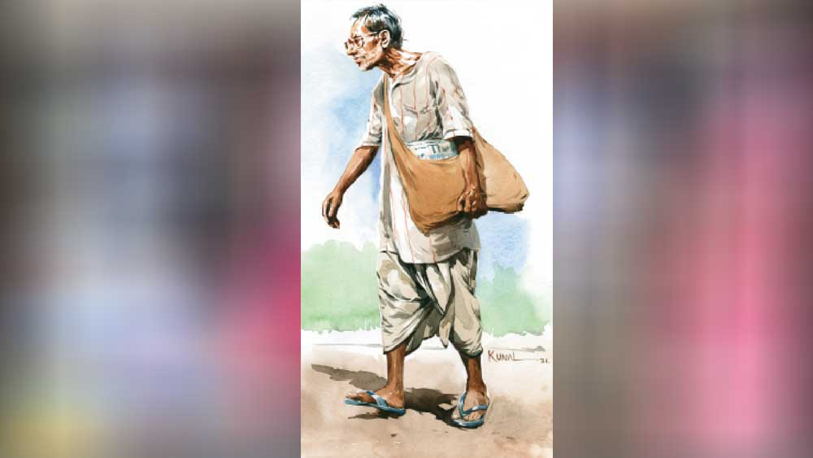

 

<h1 align=center>ওয়েট মেশিন</h1>
<h2 align=center>সৌরভ বন্দ্যোপাধ্যায়</h2>
বরাবরের মতোই বিকেলের দিকে নিমাই এল। গায়ে সেই ময়লা ফতুয়া। পরনে আকাচা ধুতি। দেখলে মনে হয় আলগা করে বাঁধা, খুলে পড়ে যাবে। আসলে তা নয়। ভীষণ রোগা সরু কোমর ধুতির বাঁধন সইতে পারে না। অপুষ্ট রোগা শরীরে ছোট্ট মুখ। অমিতাভ বচ্চন এখনও জিমে যায়, দেখলে মনে হয় আটাত্তর বছর বয়স? নিমাইকে দেখে বুড়ো মনে হয়। অথচ অমিতাভ বচ্চনের চেয়ে নিমাই অনেক ছোট হবে নিশ্চয়ই। গরিব মানুষরা তাড়াতাড়ি বুড়ো হয়ে যায়। মাথার চুল পাতলা, উসকোখুসকো। দাঁত পড়ে গিয়ে ঠাকুরদাদার শুকনো গাল হয়ে গেছে। ডান দিকের কাঁধ একটু হেলে থাকে নিমাইয়ের। জন্মদোষে কিংবা কর্মদোষে। মোটা পাওয়ারের চশমার ভেতর ছোট ছোট দু’টি চোখ।   চশমার ভেতর থেকে বিস্ফারিত চোখে উঠোনে লাগানো ফুলগাছগুলো দেখতে দেখতে হেঁটে আসছে। ঠোঁট দুটো অল্প একটু ফাঁক। চোখে যেন অপার বিস্ময়। এই ঘর, এই ফুল, এই ছাদ পর্যন্ত উঠে যাওয়া পেয়ারা গাছ, সমস্ত কিছুতেই যেন বিস্ময়। আসলে বিস্ময় নয়। নিমাই কি দেখেনি আগে এই সব! এই ঘরেই তো দেড়-দু’মাসে এক বার করে আসে, দেখেনি এ সব? আসলে তা নয়। নিমাইয়ের মুখটাই অমন। চশমার কাচের আড়ালে চোখ দুটো বিস্ময়াহত লাগে।   নিমাই দুয়ারে উঠে এল। সিদ্ধেশ্বরবাবু চা খাচ্ছেন। নিমাই চুপচাপ এসে চেয়ারের সামনে বসে পড়ল। হাঁটুর উপর হাত দুটো ছড়িয়ে দিয়ে। কী কারণে এসেছে বলতে হয় না। প্রতি দেড়-দু’মাসে এক বার আসে। পুরনো খবরের কাগজ কিনে নিয়ে যায়। দশ টাকা কেজি দরে। অবশ্য টাকা এখন দেবে না। ঠোঙা বিক্রি হওয়ার পর হাতে টাকা এলে তখন দেবে। নিমাই, ওর বৌ, ওর বৌমা, হয়তো ওর ছেলেও— সবাই ঠোঙা তৈরি করে বাজারে বেচে‌। এটাই ওদের পরিবারের একমাত্র আয়ের উৎস নয় হয়তো, আরও কিছু থাকতেই পারে। তবু গরিব মানুষের আয়ের একটা উপায় ঠোঙা করে বাজারে বেচো।   সিদ্ধেশ্বরবাবু রান্নাঘরে বার্তা পাঠালেন নিমাই এসেছে। এইটুকু বললেই হবে। এর মানে নিমাইকে একটু চা দাও। চা এল। নিমাই সুড়ুত সুড়ুত করে চা-টা শেষ করল। এমন দুধ-দেওয়া চা এই রকম কোনও বাড়িতে পেপার আনতে গেলেই খাওয়া হয়। ঘরে তো দুধছাড়া চা। দুধের দাম ঊর্ধ্বমুখী। বেসিনে নিয়ে গিয়ে কাপটা ধুয়ে ফেলল নিমাই। কারণ এটা বামুনবাড়ি, আর বামুন না হলে চা খেয়ে কাপ ধুয়ে রাখাটাই এ বাড়ির নিয়ম। নিমাই জানে।   দুয়ারে কাপটা উপুড় করে নিমাই বলল, “নিয়ে আসি?”   সিদ্ধেশ্বরবাবুদের বাড়ি দাঁড়িপাল্লা নেই। তাই পাশের বাড়ি থেকে দাঁড়িপাল্লা নিয়ে আসতে হয় কাগজ ওজন করার জন্য। নিমাই উঠে দাঁড়িয়েছিল। সিদ্ধেশ্বরবাবু নিরুত্তাপ গলায় বললেন, “বোসো, আর আনতে হবে না।”   নিমাইয়ের চোখে কৌতূহল। ভাবল, কেন আনতে হবে না!   সিদ্ধেশ্বরবাবু গলা তুলে বললেন, “ওয়েট মেশিনটা নিয়ে আয় তো।”   কোণের ঘর থেকে বেরিয়ে এল সিদ্ধেশ্বরবাবুর ছেলে। হাতে ওয়েট মেশিন। সিদ্ধেশ্বরবাবু বললেন, “বুঝলে নিমাই, এতে দু’কাজই হবে। কাগজ ওজন করা হবে, আবার আমাদের ওজনটাও দেখা হবে। বেশি মোটা হয়ে গেলে আবার খাওয়াদাওয়া কমিয়ে দেব, বুঝলে কি না...” বলে হেসে উঠলেন।   প্রথমে সিদ্ধেশ্বরবাবুর কথাগুলো নিমাইয়ের কানে ঢুকছিল, এখন আর ঢুকছে না। প্যাকেট থেকে যন্ত্রটা বেরোচ্ছে। নিমাইয়ের চোখ-কান-নাক তিনটিই সেই দিকে। একেবারে নতুন, ঝকঝক করছে। নতুন জিনিসের গন্ধও টাটকা থাকে। নিমাইয়ের ঘরে কত দিন নতুন জিনিস ঢোকেনি! নাতিটা এবছর মেলায় গিয়ে সারা ক্ষণ ‘দাদু, বল কিনে দাও, দাদু পাখি কিনে দাও’ করছিল। ‘আজ নয় দাদু, কাল আবার আসব, কাল কিনে নিয়ে যাব...’ বলে ভুলিয়ে-ভালিয়ে কোনও রকমে ফিরিয়ে এনেছিল। তার পর দাদু আর মেলায় যায়নি। নাতিটাকে ওর মা আগলে রেখেছিল। মায়ের সঙ্গে খেলতে খেলতে ভুলে গেছে।   অনেক দিন পর বায়না ধরেছিল, ‘দাদু আমায় তো পাখি কিনে দিলে না!’ নাতিটাকে কোলে বসিয়ে মাথায় হাত বুলিয়ে হাসতে হাসতে দাদু বলেছিল, ‘মেলা তো শেষ হয়ে গেছে দাদু, আবার সামনের বছর যখন মেলা হবে, তখন কিনে দেব।’   নাতিটা অবাক হয়ে দাদুর মুখের দিকে তাকিয়ে ছিল।      চারকোনা যন্ত্রটা মেঝেয় বসল। নিমাই হাঁ করে ওর বসা দেখল, যেন কোনও মহারাজা সিংহাসনে বসছেন।   “কত দাম নিল এটা?” নিমাই জিজ্ঞেস করল। সিদ্ধেশ্বরবাবু লক্ষ করেছেন, গরিব মানুষগুলো নতুন জিনিস দেখলেই প্রথমেই দাম জানতে চায়। বিরক্তিকর অভ্যেস! আরে বাবা, আগে রং দেখ, কাজ দেখ, তার পর না হয় দাম জানবি। তা নয়!   “হাজারদুয়েক,” সিদ্ধেশ্বরবাবুর ছেলে উত্তর দিল।   চোখ গোল গোল হয়ে গেল নিমাইয়ের। টাকা থাকলে কী না করা যায়! অত দাম দিয়ে এই যন্ত্র কেনার দরকারই বা কী! দাঁড়িপাল্লার দাম বড়জোর পাঁচশো-হাজার হবে। ঠিক জানে না নিমাই, তবে ওর ও রকমই আন্দাজ। পরক্ষণেই মনে পড়ল, এই যন্ত্র দিয়ে দেহের ওজনও মাপা যায়। দু’রকম কাজই হবে। তা হলে ঠিকই আছে। আলাদা দাম দিয়ে আলাদা যন্ত্র কেনার মানে হয় না। তা হলে সিদ্ধেশ্বরবাবু ঠিকই করেছেন। মনে মনে সিদ্ধেশ্বরবাবুর বুদ্ধির তারিফ করল নিমাই।‌ বড়লোকদের যেমন টাকার সঙ্গে বুদ্ধিও থাকতে হয়। না হলে চলবে কেন!   নিমাই মনে মনে হাঁ করে রইল। কী সুন্দর যন্ত্র! সারা মাসে ঠোঙা বেচেও ও জিনিস কেনার পয়সা উঠবে না। আর কেনা গেলেই বা কী! নিমাইয়ের ও জিনিসের দরকারই বা কী! ও জিনিস নিমাই কিনবে না।   “এটা কি ব্যাটারিতে চলে?” আহাম্মকের মতো কথা শুনে সিদ্ধেশ্বরবাবুর হাসি পেল।   “না গো!” বেশ ঝাঁঝিয়ে উত্তর দিল সিদ্ধেশ্বরবাবুর ছেলে। তার পর পাশের ঘরে চলে গেল কাগজ আনতে। হাঁ করে যন্ত্রটাকে দেখে যায় নিমাই। যন্ত্রটাকে কোথায় যেন দেখেছে আগে। নিমাই মনে করার চেষ্টা করল। মনে পড়ল, ডাক্তারখানায় দেখেছে।   এক বার বৌকে সঙ্গে নিয়ে শহরে গেছিল বড় ডাক্তার দেখাতে। ক’দিন ধরেই পেট ব্যথা। পেটের ভিতর জ্বালা-জ্বালা ভাব। গ্রামের ডাক্তারকে দেখিয়েছিল, কমেনি। অগত্যা শহরের ডাক্তার। ঘরে ঢোকার আগে এক জন বলেছিল, “উঠে পড়ুন।”   নিমাই হাঁ করেছিল বড় করে। কোথায় উঠে পড়বে? লোকটা ও রকম একটা চারকোনা যন্ত্রের দিকে ইশারা করেছিল। ভয়ে ভয়ে যন্ত্রটার উপর উঠে দাঁড়িয়েছিল। কী জানি কী হয়! না, কিছু হয়নি। যন্ত্রের ভিতরে সরসর শব্দ হয়েছিল। চাকার মতো একটা গোল জিনিস সরে গেল, এটুকুনি বুঝতে পেরেছে। পাশের লোকটা বলল, “পঞ্চান্ন। নেমে আসুন।”   এমন কথা জীবনে কখনও শোনেনি নিমাই। পঞ্চান্ন নেমে আসুন! কেমনধারা কথা হল? তার নাম মোটেও পঞ্চান্ন নয়! আর বয়সের কথা যদি হয়, তাও পেরিয়ে এসেছে কবে। নিমাই বলল, “আজ্ঞে?” লোকটা বিরক্ত মুখে বলল, “আপনার ওজন পঞ্চান্ন কেজি। এ বার নেমে আসুন।” তখন কথাটা বোঝা গেল। ভাল লাগল। না হলে সারা দিন মনটা আকুপাকু করত। কিন্তু লোকটা বুঝলে কী করে? জিজ্ঞেস করবে? ভাবতে ভাবতেই লোকটা ডাক্তারবাবুর ঘরের দরজা খুলে ওকে ঠেলে ঢুকিয়ে দিল।   ‌তার পর কত দিন হয়ে গেল ব্যাপারটা জানাই হয়নি। ভুলে গেছে। আসল কথা জানার প্রয়োজন হয়নি কখনও। কাগজ আনা, ঠোঙা তৈরি, বাজার, চা খাওয়া, ডাক্তার দেখানো, বিড়ি টানা, রাতে বৌয়ের কাছে শোওয়া। এ সবের মাঝে ও সব কথা জানার দরকারটা কী!      ধপ করে আওয়াজে নিমাই চমকে উঠল। সিদ্ধেশ্বরবাবুর ছেলে মেঝেয় কাগজগুলো রাখল। সিদ্ধেশ্বরবাবু বললেন, “বুঝলে নিমাই, সব বাড়িতেই একটা করে ওয়েট মেশিন থাকা দরকার। যখন যা প্রয়োজন, ওজনটা দেখে নেওয়া যেতে পারে। কী বলো?”   নিমাই অস্ফুটে কী বলল বোঝা গেল না। ওর মাথায় ঘুরছে ‘হাজারদুয়েক’ কথাটা।   সিদ্ধেশ্বরবাবুর ছেলের  মুখটা চুপসে যাওয়ার মতো হয়ে গেল। তিল থেকে তাল সব কিছু ওজন করা যাবে ভেবেই মেশিনটা কিনেছিল। গতকাল রাতে প্যাকেট থেকে খোলার পর দেখেশুনে বুঝেছিল, খুব ছোট  ওজন, এতে করা যাবে না। এর স্কেলটা লেখা আছে একশো তিরিশ বাই দশমিক পাঁচ। তার মানে পাঁচশো গ্রামের চেয়ে কম ওজন এতে মাপা যাবে না। তেমন কিছু মাপার দরকার হলে তখন কী করবে? মনটা খুব খারাপ হয়ে গিয়েছিল। আর ফেরতও মনে হয় নেবে না। যদিও বা ফেরত নেয়, মেডিকেল-সার্জিক্যালের দোকানে আর কী-ই বা কিনবে? পয়সা তো  ফেরত দেবে না। যন্ত্রটা শুধু শুধু বাড়িতে পড়ে থাকবে? বডি ওয়েট তো আর কেউ রোজ মাপে না। এক পেট ভাত খেয়ে দুপুরে ঘুম দেওয়া বাঙালিরা তো নয়ই। হাতের মোবাইলটা নিয়ে গুগ্‌লে  সার্চ করতে বসেছিল। কত রকম ওয়েট মেশিন দেখাচ্ছে। এখন তো কিচেনে ব্যবহার করার জন্য একটা ডিজিটাল মেশিন দেখাচ্ছে অনলাইনে, যাতে ছোট ওজনও করা যায়। ইস! আগে যদি জানত। মনটা আরও খারাপ হয়ে গিয়েছিল। সার্জিক্যালের দোকানে নিশ্চয়ই কিচেনের জন্য ওয়েট মেশিন রাখবে না। মুদিখানার দোকানগুলোয় পর্যন্ত এখন ডিজিটাল ওয়েট মেশিন রাখে, এখন মনে পড়ল। আফসোস হচ্ছিল খুব। ওই রকম একটা ছোট্ট ডিজিটাল ওয়েট মেশিন কিনে নেবে তারও উপায় নেই। পকেটের কথাটাও তো ভাবতে হবে। বাবাকে তো বলাই যাবে না। শুনলেই চিৎকার-চেঁচামেচি আরম্ভ করে দেবে।      কাগজগুলো দেখে দেখে মেশিনের উপর চাপাতে লাগল। দু’-একটা খবর, যেগুলো মনে হচ্ছে পরে দরকার হতে পারে, সেই পাতাটা ছিঁড়ে রেখে দিচ্ছে।   নিমাই হাঁ করে যন্ত্রটা দেখতে লাগল। একটু করে কাগজ চাপাচ্ছে আর ভেতরের কাঁটাটা সরে যাচ্ছে। ব্যস! কাঁটা স্থির। কাগজ শেষ।   “দেখে নাও কাকা, ছ’কেজি,” সিদ্ধেশ্বরবাবুর ছেলে বলল।   নিমাই এ বার বুঝতে পারল ওই চাকাটার উপরে কিছু লেখা আছে, সেখান থেকেই ওজনটা জানা যাচ্ছে। কিন্তু কী লেখা আছে নিমাই বুঝতে পারল না। মাথাটা ফাঁকা ফাঁকা মনে হল। ক্লাস ফোর অবধি সে পড়েছিল মনে পড়ে। বাংলায় এক-দুই-তিন-চার নিমাই চেনে। এগুলো তো তেমন নয়। তবে কি ওগুলো ইংরেজির এক-দুই-তিন-চার? তাই হবে হয়তো।   সিদ্ধেশ্বরবাবু বললেন, “বুঝেছ?”   নিমাই মাথা নাড়ল, বুঝেছে। যদিও মাথার ঝাপসাটে ভাব এখনও কাটেনি। কাটতে একটু সময় লাগবে। কাগজগুলো বস্তায় ভরে মুখটা দড়ি দিয়ে বাঁধল। কাঁধের ওপর বস্তাটা ফেলে কুঁজো হয়ে হাঁটতে লাগল নিমাই। নিজের ভাবনায় মগ্ন। বেরনোর সময় অন্যান্য বারের মতো ‘আসছি’ বলতেও ভুলে গেল। নিমাই একটা কথা ভাল বুঝতে পারল, যে অদৃশ্য লোকটা ওপরে বসে সবাইকে সব কিছু দেয়, তার কাছে ওয়েট মেশিন বলে কিছু নেই নিশ্চয়ই। তাই সে এত বেহিসেবি আর একচোখো। তাই কারও পেটে ভাত নেই, কারও আবার দু’হাজারি ওজন করার মেশিন। ওর তেমন হলে হবে না। আর ওয়েট মেশিন বুঝতে গেলে একে চন্দ্র, দুইয়ে পক্ষ আর চলবে না। এখন ইংরেজির যুগ। ইংরেজি শিখতে হবে। অন্তত ব্যবসার খাতিরে, না হলে ঠকে যাবে। তার পরই ফিক করে হেসে উঠল, বয়সটা তো কম হল না। এই বয়সে আবার নতুন কিছু শেখা!      সন্ধেবেলায় গিন্নিকে দু’টি মুড়ি দিতে বলে নিমাই নাতিটার কাছে গিয়ে বসল। নাতিটা ঘরে একা। ওর মা রান্নাঘরে। নিমাই এ দিক-ও দিক খুঁজে নাতিটার বইয়ের ব্যাগটা বার করল। খাটের উপর রেখে বলল, “অ্যাই, পড়তে বোস।”   নাতিটা খেলনা নিয়ে খেলছিল। অবাক হয়ে গেল। আজ দাদু পড়তে বসতে বলছে বলে, অন্য দিন তো মা-ই পড়ায়। তবু লক্ষ্মী ছেলের মতো দাদুর পাশে এসে বসল।   “ইংরেজি বইটা বার কর।”   “না, দাদু। আগে অ-আ-ক-খ পড়তে হয়।”   “আগে ইংরেজিতে একে চন্দ্র, দুইয়ে পক্ষ পড়। তার পর...”   “এ মা! জানে না। একে চন্দ্র, দুইয়ে পক্ষ বলে না। ওয়ান টু বলে।”   নিমাই থতমত খেয়ে বলল, “ও হ্যাঁ, বলতে ভুল হয়েছে। ওগুলোই বার কর।”   “না, আগে অ-আ-ক-খ পড়তে হয়,” মাথা নেড়ে নেড়ে বোঝাবার ভঙ্গিতে বলল নাতি।   “না। ইংরেজি।”   বেশি কিছু বলার আগে নাতিটা রান্নাঘরের উদ্দেশে চিৎকার করে বলল, “মা দেখো না, দাদু কী বলছে...”   নিমাই যত চুপ করতে বলে, নাতিটা তত চেঁচায়। চেঁচাক। ইংরেজি ওয়ান-টু না শিখে ছাড়বে না নিমাই।      