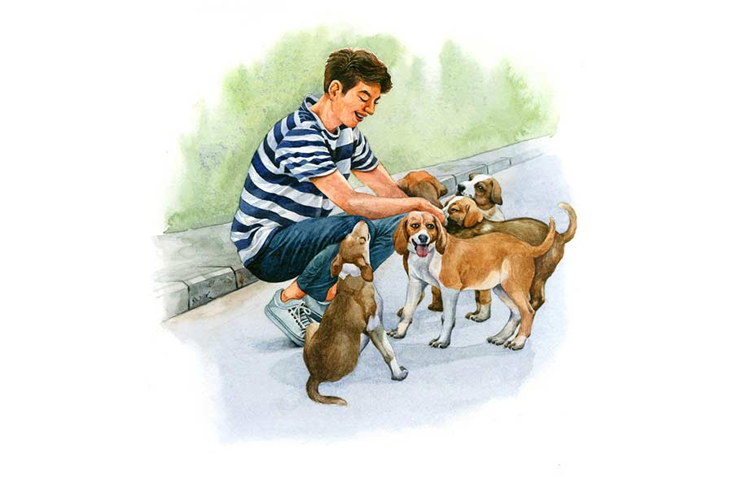

 
 <h1 align=center>ওরা পাঁচ জন</h1>
<h2 align=center>তিলোত্তমা মজুমদার</h2> 

জন্ম থেকেই দেখে আসছে তাকে। এই সে দিনও সাইকেল চালিয়ে আসত। দেখা হলেই সাইকেল থেকে নেমে গায়ে-মাথায় হাত বুলিয়ে আদর, তার পর পকেট থেকে বেরিয়ে এল বিস্কুট, প্রত্যেকে সমান ভাগেই পায় মোটের উপর। মাঝে মাঝে পাটকিলে একটা-দুটো বেশি পায়। তার দুই কান আর লেজ সাদা হওয়ায় শৈশবেও সেই আদর পেয়েছে সবচেয়ে বেশি, তার বাড়তি পাওনা অন্যদের গা-সওয়া।

পাড়ার মধ্যে যে চৌরাস্তার মোড়, এক কোণে শনিমন্দির, সেই মোড়ে পুবমুখো সাদা বড় বাড়িটা থেকে সে আসে। এখন আর সাইকেল চালায় না। মোটরবাইক। কী কান-ফাটানো শব্দ যন্ত্রটায়! জোরে চালিয়ে যায় যখন, মনে হয় দশটা মেশিনগান চলছে। তাদের বুক ঢিবঢিব করে, মাথার ভিতর ভোঁ ভোঁ শব্দ হয়, ভয়ে উল্টো দিকের পোড়ো জমির বাদাড়ে সেঁধিয়ে যায়। প্রথম দিন তাদের ত্রস্ত করুণ কুঁইকুঁই শুনে আর পিছনের দুই পায়ের ফাঁকে লেজ ঢুকিয়ে ফেলা দেখে সে হা হা করে হেসেছিল। খানিকটা সামলে ডুমুর গাছের গায়ে খানিক গা চুলকে সাদা বলে, “হাসিটা যেন কেমন হয়ে গেছে।”

কেলে বলে, “শক্ত মতো। লম্বা চুল আর চাপদাড়ি রাখছে যখন থেকে, কত বদল দেখছি।”

ছোপ-ছোপ বলেছিল, “ও রকম হয়। বড় হচ্ছে না? ও দিকের গলিতে একটা মেয়ের গায়ে সেঁটে গল্প করে। বাইকের পিছনে বসিয়ে ঘোরে।”

পাটকিলে চোখে বাঁকা চাউনি দিয়ে বলে, “পুরনো গপ্পো।”

ক্রমে বাইকের ফাটাফাটি আওয়াজের সঙ্গে এক রকম আপস হয়েই গেল তাদের। এখনও বুক ধড়ফড় করে, কিন্তু তারা আর পালিয়ে যায় না। সে রাতের খাবার দিতে আসে যখন, চার জনের চারটে বাটিতে মাংসের পাতলা ঝোল মাখা ভাত, তখন মোটরবাইক বাড়ির ভিতরে রেখে আসে। আগে যখন সাইকেলে আসত, এই নৈশাহারের সময়ে কত কথা বলত। স্কুলের গল্প, বন্ধুদের কথা, ক্রিকেটের হারজিত, অঙ্কে কম নম্বর পেয়ে বাবাকে রাগিয়ে দিয়েছে, সেই সব দুঃখের কথাও। আজকাল গম্ভীর মুখে খেতে দেয়। শুধু ফোন এলে গুনগুন করে কথা বলে। তারা মাংস চিবোতে চিবোতে তার মুখের দিকে চেয়ে দেখে। ভুক ভুক করে ডেকে বোঝাতে চায়, ‘আমাদের সঙ্গে আগের মতো কথা বলো না কেন! আমাদের মনখারাপ হয়।’

সে প্রত্যেকের গায়ে মাথায় হাত বুলিয়ে আদর করে। পাটকিলের সাদা কান টেনে হামি খায়। কিন্তু রোজ নয়। এক-এক দিন আজব এক ভূত তার ঘাড়ে চেপে থাকে। সেই সব দিন সে অতি তীব্র গতিতে, চূড়ান্ত ফটফট শব্দ তুলে বেরোয়, নিমেষে উধাও হয়ে যায় পাড়া থেকে। তারা লম্বা জিভ বার করে হাঁপাতে হাঁপাতে তার চলে যাওয়া দেখে, শব্দের প্রকোপে বিমর্ষ বোধ করে। শুনতে পায়, শনিমন্দিরের সামনে বাঁধানো রোয়াকে বসে পাড়ার বয়স্করা অত্যন্ত বিরক্তির সঙ্গে তার বাইক চালনা দেখে মন্তব্য করে, “মরবে। কোন দিন অ্যাকসিডেন্ট করে মরবে।”

এই মন্তব্যে তারা গহিন দুঃখে আপতিত হয় এবং খাদ্যসন্ধান বিষয়ে সম্পূর্ণ নিরুৎসুক হয়ে সামনের দুই পা ছড়িয়ে মাথা গুঁজে বসে থাকে। গায়ে এঁটুলি কামড়ায়, গুলে মাছি বিরক্ত করে, তারা ধুলো মেখে নিতে চায় এবং অতি শোকে স্মরণ করে, দুর্ঘটনা কতখানি দুঃসহ এবং মর্মঘাতী। তারা যখন একেবারে তুলোর বলের মতো, মায়ের দুধ খায় আর বাদাড়ে জড়াজড়ি করে থাকে, সেই কালে একটি গাড়ি তাদের মাকে চাপা দিয়ে চলে যায়। নাড়িভুঁড়ি বেরিয়ে আসা, মাথা-থ্যাঁতলানো সেই মাকে দেখে তারা আরও বেশি দলা পাকিয়ে যেন মাতৃগর্ভেই পুনরায় সেঁধিয়ে যেতে চেয়েছিল। অন্যরা পথের মাঝে জন্তুর বীভৎস মৃতদেহ দেখে ঘৃণা ও বিরক্তিতে মুখে রুমাল চেপে চলে যাচ্ছিল। তখন সে আসে। মৃতদেহের উপর একটি ঢাকাচাপা দিয়ে দেয়। ঢুকে পড়ে বাদাড়ে। তার দেখাদেখি সমবয়সি আরও কয়েকজন। কেউ একখানা বড় কাগজের বাক্স নিয়ে এল, কেউ শিশুদের দুধ খাওয়ানোর বোতল, কেউ আনল কিছু স্পঞ্জের টুকরো, থার্মোকল। সেই দিয়ে কাগজের বাক্সে চমৎকার বিছানা পাতা হয়েছিল, কিন্তু খুদে খুদে দাঁত গজানো মাত্র তারা সেগুলি ছিঁড়ে কুটিকুটি করে। সে-ই একমাত্র স্কুলে যাওয়ার আগে তাদের জন্য চার বোতল দুধ নিয়ে আসত, আবার রাতে, সঙ্গে কেউ এক জন, জোরালো বাতি ঝুলিয়ে।

দিব্যি চলছিল। সে কেন এমন মারণ বাইকের সওয়ার হল? তারা দিনের বেলায় খাবার খুঁটে খেতে শিখে গিয়েছে। ছয় ঋতু অতিক্রম করাও এখন সহজ তাদের কাছে। এমন নয় যে, রাতের খাবার জোটাতে পারবে না। কিন্তু তার খারাপ কিছু হয়ে গেলে তাদের আর বেঁচে থেকে লাভ কী?

এক দিন সে বাইক ছুটিয়ে সেই যে বাড়িতে সেঁধোল, পর পর তিন দিন কেউ তাকে দেখতে পেল না। তার অপেক্ষায় থেকে তিন রাত্রি তারাও থাকল অনাহারে। তার বাড়ির সামনে দাঁড়িয়ে ডাকাডাকি করল কত বার। চতুর্থ দিনের সকালে সে বেরিয়ে এল একমাথা উলোঝুলো চুল আর একমুখ গোঁফদাড়ি নিয়ে। বাইক ছাড়াই। চার জন তাকে ঘিরে লেজ নেড়ে সন্দর্শনসুখ প্রকাশ করতে লাগল। অনেক দিন পর সে তাদের গায়ে মাথায় হাত বুলিয়ে দিল। আদর পেয়ে তারা আহ্লাদে লাফিয়ে ঝাঁপিয়ে তার গায়ে উঠে পড়ল, কেউ মুখ চেটে দিল, কেউ জামা কামড়ে ধরল। সে বিড়বিড় করে বলল, “এত ভালবাসা? এত?”

সে হেঁটে হেঁটে চলে গেল কোথায়। অনেকটা সময় পর যখন ফিরল, তারা সবিস্ময়ে দেখল, তার মাথা ন্যাড়া, মুখে দাড়িগোঁফ নেই। তারা শুধু লেজ নাড়ল খানিক। দুর্বোধ্য অবস্থানে তাদের খিদেতেষ্টা লোপ পেল। সন্ধ্যা ভাল করে নামতে না নামতে তারা গায়ে গা লাগিয়ে ঝিমোতে লাগল।

রাতে সে এল চার বাটি মাংসের ঝোল মাখা ভাত নিয়ে। তারা কৃতজ্ঞ ও সুখী চোখে তাকে দেখে খাওয়ায় মন দিল। সে পাটকিলেকে চুমু খেল। কেলের গলায় হাত বুলিয়ে দিল। সাদার পিঠ চাপড়ে, ছোপ-ছোপের পাশে দাঁড়িয়ে বলল, “ও কুকুর ভালবাসে না। আদর করতে চেয়েছিলাম, ও বলল, ‘তোমার গায়ে কেমন বোঁটকা গন্ধ। ওই ঘেয়ো নেড়িগুলোকে যদি মেরে ফেলতে পারো, বুঝব আমায় সত্যি চাও।’ তিন দিন ধরে ভাবলাম, বুঝলি? তাই বিষ কিনে এনেছিলাম...”

তারা মাংসের হাড় চিবোচ্ছিল। আড়নজরে তাকে দেখে, পরমানন্দে চিবোতে লাগল।

