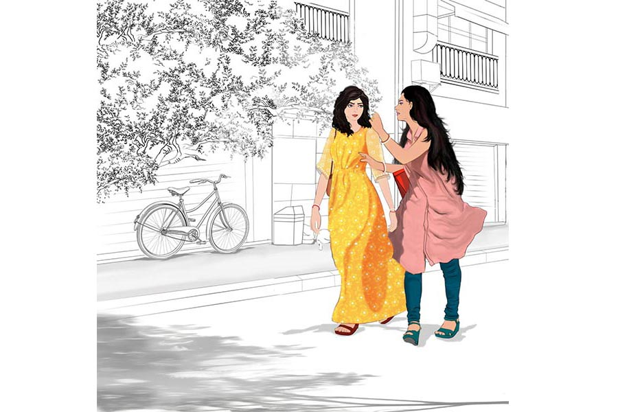

 
 <h1 align=center>ওলো সই</h1>
<h2 align=center>অন্বেষা রায়</h2> অবাক হওয়া গলায় প্রসূন বলল, “কেন? সবর্ণাকে বলবে না কেন? মাসে এক বার অন্তত যার সঙ্গে দেখা না করলে চলে না, তাকেই ছেলের জন্মদিনে ডাকবে না? কেমন অভদ্রতা হয়ে যাচ্ছে না?”

ইলিনা প্রশ্নটাকে উড়িয়ে দেওয়ার ভঙ্গিতে বলল, “আরে দূর! তুমি অত ভেবো না তো। নেমন্তন্ন করলে ওরই চাপ। বর যা জিনিস!”

প্রসূনের কপালের ভাঁজ কমে না। সংশয় ছাপিয়ে বুড়বুড়ি কাটে কৌতূহল, “বর যা জিনিস মানে? আসতে দেবে না নাকি?”

রিটার্ন গিফটের ব্যাগগুলো গুছিয়ে তুলতে তুলতে ইলিনা বলল, “জানি না। তবে খুব যে সন্দেহবাতিক সেটা জানি। মারধর হয়তো করে না, তবে আজেবাজে কথা বলে হেনস্থা করে প্রায়ই।”

প্রসূন কথা বাড়ায় না। ইলিনার উপর পূর্ণ আস্থা আছে তার। সব দিক সামলে, সকলকে নিয়ে চলার অদ্ভুত ক্ষমতা আছে মেয়েটার। নিজের মা, বাবা, জেঠা, জেঠিকে তো চেনে প্রসূন। কথায় কথায় রেগে ওঠা, না বুঝে উল্টোপাল্টা মন্তব্য করা তাদের চিরকালীন স্বভাব। বিয়ের পর পর ইলিনা রান্নায় নুন কম-বেশি করে ফেলত প্রায়ই। মুখে খাবার তুলেই বিরক্তিতে মুখ কুঁচকে যেত সকলের। বাবা বলতেন, “বাড়িতে খাওয়াদাওয়া বন্ধ করে দিতে হবে যা দেখছি।”

মা ফোড়ন কেটে বলতেন, “আরও আনো চাকরি করা বৌ! এমএ পাশ শুনে একেবারে গদগদ হয়ে গেলে সক্কলে! ঠিক কি না দিদিভাই?”

জেঠি ঠোঁট বেঁকিয়ে সায় দিতে বলত, “আমি তো তোকে পোথোমেই বলেছিলাম ছোট। এখন মিলিয়ে নে।”

বোনের তখনও বিয়ে হয়নি। সমঝদারি স্বরে সে ইলিনার কাছে জানতে চাইত, “তোমার দিদিও এমন রান্না করত বুঝি?” তার পরই অর্থপূর্ণ হাসিমাখা চোখে তাকাত জেঠি আর মায়ের দিকে।

ইলিনার দিদি ডিভোর্সি। স্বামীর সঙ্গে বনিবনা না হওয়ায় বাপের বাড়ি চলে এসেছে মেয়েকে নিয়ে।  

প্রসূন এ সব দেখে স্তম্ভিত হয়ে যেত। মনে হত যেন কোনও মোটা দাগের টিভি সিরিয়াল দেখছে। রাগে খাওয়া ছেড়ে উঠে যেত। কোনও কোনও দিন প্রতিবাদও করত, কিন্তু যার জন্য এত কিছু, সে-ই এসে বাধা দিত। জোর করে ঘরে টেনে নিয়ে গিয়ে বলত, “কিচ্ছু বলার দরকার নেই। সময় দাও, সব ঠিক হয়ে যাবে।”

তবে মুখে যা-ই বলুক, চোখের নীচে গাঢ় হত মনখারাপ। ত্বকের জৌলুস নিবে যেতে যেতে জানান দিত, সব ঠিক নেই। মাঝে মাঝে আনমনা হয়ে বাইরের দিকে তাকিয়ে থাকত। প্রসূন বা নিজের মা, দিদির কাছেও অভিযোগ করত না কোনও। প্রসূন যখন ওর মাথায় হাত বুলিয়ে দিতে দিতে নিঃশব্দে ক্ষমা চাইত, তখন শুধু বলত, “দিদির যা হল, আমারও যদি সেই রকম কিছু হয়, তা হলে আর মা, বাবা বাঁচবে না। অনেক সাধ করে আমার বিয়ে দিয়েছেন। আমাকে একটু মানিয়ে চলতেই হবে।”

ইলিনার নিষ্প্রভ স্বর, ম্লান হাসির দিকে তাকালে ভয় করত প্রসূনের। মনে হত, আর কিছু দিন এখানে থাকলে হারিয়ে ফেলবে প্রিয় নারীকে।

তাই সুমসুম হওয়ার পর উদ্যোগ করে পাড়ি দেয় দেশের বাইরে। সেখানে পাঁচটা বছর, মনের মতো আদরের সংসার তাদের। সব কিছু গুছিয়ে নিয়েছিল দু’জনে।

বছর আড়াই আগে অফিস থেকেই নির্দেশ এল দেশে ফেরার। প্রসূনের বাবার অসুস্থতা, ইলিনার মায়ের মৃত্যু, সব কিছু এমন সাঁড়াশির মতো চেপে ধরল যে, দেশে নাফিরে উপায় থাকল না। বাড়িতে পা দিয়েই প্রসূন বুঝেছিল, এই পাঁচ বছরে মানুষগুলো একটুও বদলায়নি।

মাঝের কয়েক বছর বাইরে থাকার কারণে ইলিনার উপর ক্ষোভ যেন তাদের দ্বিগুণ হয়ে গেছে। অন্য দিকে যুক্তিবোধ আর আধুনিকতায় আরও ঝকঝকে হয়ে উঠেছে ইলিনা। যে অন্যায়গুলো আগে মায়ের মুখের দিকে তাকিয়ে মুখ বুজে সহ্য করে নিত, সেগুলো আজকাল প্রবল প্রতিরোধে ফিরিয়ে দেবে, এটাই স্বাভাবিক। কিন্তু ইলিনা তা করে না।

ঝাঁঝালো মন্তব্যের জবাবে সে আজকাল হেসে ফেলে। কখনও জিভ কেটে স্বীকার করে নেয় নিজের ভুল। দিদির প্রসঙ্গ তুলে খোঁটা দিতে চাইলে এমন ভাবে কথা বলে, যেন ডিভোর্স হওয়াটা বিয়ে করার মতোই স্বাভাবিক ঘটনা। আর এত কিছুর পরেও তার চোখের নীচে অন্ধকার জমা হয় না। ঘুমে উঁকি দেয় না দুঃস্বপ্ন। ত্বক একই রকম ঔজ্জ্বল্য বজায় রাখতে পারে।

এই ম্যাজিকের জন্য সে মনে মনে পাঁচ বছরের বিদেশবাসকেইকুর্নিশ জানায়।

উপহারগুলো বড় ব্যাগের ভিতর গুছিয়ে রাখতে রাখতে ইলিনা বলল, “সবর্ণাকে নিয়ে অত এমব্যারাসড হতে হবে না তোমাকে। ও আমি সামলে নেব।”

প্রসূন দীর্ঘশ্বাস ফেলে সশব্দে। সামলে যে ইলিনা নেবে, সে বিষয়ে কোনও সন্দেহ নেই তার। তবু মনের ভিতর কী একটা খচখচ করে। একমাত্র প্রিয় বান্ধবীকে কেন ডাকতে চাইছে না ইলিনা?

*****

জন্মদিনের আয়োজন এক কথায় চমৎকার। হল সাজানো, মেনু, সব আয়োজনই দুর্দান্ত। আমন্ত্রিতদের তালিকা একটু লম্বা হলেও সকলের মনের মতো। প্রত্যেকেরই চেনাশোনা, বন্ধুবান্ধবকে মনে করে নেমন্তন্ন করেছে ইলিনা। তবু নিমন্ত্রিতদের মধ্যে ইলিনার ঘনিষ্ঠ কেউ নেই। এই ভাবনাটা কিছুতেই মন থেকে তাড়াতে পারছে না প্রসূন।  

এমনিতেই ইলিনার বন্ধুবান্ধব কম। এত দিন দেশের বাইরে থাকার ফলে যে ক’জন ছিল, তাদের সঙ্গেও যোগাযোগ ছিন্ন প্রায়। মায়ের মৃত্যুর পর বাবা এতটাই অসুস্থ যে, বাড়ি বয়ে আসতে পারবেন না। দিদি আপাতত মেয়ের কলেজে ভর্তির ব্যাপারে কলকাতার বাইরে। তা হলে সবর্ণা ছাড়া আর কে রইল?

বাইরে থাকার সময়েই সবর্ণার সঙ্গে আলাপ হয়েছিল ইলিনার। সোশ্যাল মিডিয়ায় একটা রান্নার গ্রুপের সদস্য ছিল দু’জনে। সেখান থেকেই পরিচয় এবং বন্ধুত্ব। তখন কথা হত চ্যাটের মাধ্যমে। সারাদিন টিং টিং শব্দে মেসেজ আসত ইলিনার। সবর্ণার নাম দেখলেই মুখ উজ্জ্বল হয়ে উঠত। বিষয়টা খেয়াল করে মনের গভীরে অদ্ভুত আরাম পেত প্রসূন। বিয়ের পর যে কঠিন সময় সে কাটিয়ে এসেছে দেশে, তার ভার যেন লাঘব হত খানিক।

কলকাতায় ফিরে সবর্ণার সঙ্গে দেখা করেছে ইলিনা। প্রথম দেখা করার দিনটা এখনও বেশ মনেআছে প্রসূনের।

বেরোনোর আগে প্রসূনের মাকে নিজে থেকেই বলেছিল সবর্ণার কথা। শুনে মুখ বেঁকিয়ে বৃদ্ধা বলেছিলেন, “আমাদের সময় এত সুখ ছিল না। সংসারের কাজে দম ফেলার সময় পেতাম না। সেই বোঝা আজওবয়ে বেড়াচ্ছি।”

কথাটা শেষ হওয়ার আগেই লজ্জায়, আশঙ্কায় মুখ শুকিয়ে গিয়েছিল প্রসুনের। এর আগেও তো এই রকম পরিস্থিতিতে পড়েছে সে। ইলিনা হয়তো মায়ের সঙ্গে দেখা করতে যাচ্ছে। ঠিক তখনই সংসারে কাজের কথা তুলে মুখ ভার করে ফেলতেন প্রসূনের মা। ইলিনা কাঁধ থেকে ব্যাগ নামিয়ে, শাড়ি পাল্টে কাজে লেগে পড়ত।

প্রসূন রাগ করত। প্রতিবাদ করতে চাইত। ইলিনা বাধা দিত প্রতি বারের মতো। আড়ালে বলত, “জানো, দিদির ডিভোর্স কেন হয়েছিল? শাশুড়ির সঙ্গে অশান্তি থেকে। মা খুব আঘাত পেয়েছিল। অনীকদা প্রথম প্রথম দিদিকে সাপোর্ট করত কিন্তু যতই হোক, মা তো! একা হাতে ছোট থেকে বড় করেছে, মনে মনে দুর্বল হয়ে পড়ত। ডিভোর্সের পর বাবা খুব চুপচাপ হয়ে গেছে। আমি বাবাকে আর আঘাত দিতে চাই না প্রসূন।”

মন দমে যেত প্রসূনের। পুজোয় ঠাকুর দেখতে যাওয়ার আগে ঘরের যাবতীয় কাজ সেরে তবে বেরোত। কোনও দিন বাইরে খেতে গেলে এক গাদা মিথ্যে বলে যেতে হত। ব্যাগে লুকিয়ে আনা লিপস্টিক গাড়িতে বসে ঠোঁটে দিত। একটা দুল নিজের জন্য কিনলেও কত যে কৈফিয়ত দিতে হত, তার হিসাব নেই। আর এই কৈফিয়ত, জবাবদিহির মাঝে শীর্ণ থেকে শীর্ণতর হতে থাকত ইলিনা।

সবর্ণার সঙ্গে এমনকি প্রসূনেরও আলাপ নেই সরাসরি। ছবি দেখেছে। স্বামীর সঙ্গে সম্পর্ক ভাল না হলেও চেহারায় সে ছাপ নেই খুব একটা। সবর্ণার থেকে ওর স্বামীর গল্প বেশি শুনেছে সে ইলিনার মুখে। খুব বদমেজাজি আর খিটখিটে প্রকৃতির মানুষ। বাইরে লোকের সামনে খুব ভদ্র, আসল রূপ ফোটে বৌকে একা পেলে। পান থেকে চুন খসলেই অশ্রাব্য গালিগালাজ, খোঁটা দেওয়া শুরু হয়ে যায়। সবর্ণা ছোট থেকেই অনাথ। সেই নিয়েও অভিযোগ করতে ছাড়ে না ওর বর। আশ্রমে বড় হয়েছে বলেই নাকি ওর মধ্যে গুছিয়ে সংসার করার ক্ষমতা কম ইত্যাদি। শুনতে শুনতে প্রসূন বলেছিল, “তোমার বন্ধুকে থানায় যেতে বলো না কেন? ভার্বাল আবিউজ়ের চার্জ আনতে পারে তো।”

শুনে দীর্ঘশ্বাস ফেলেছিল ইলিনা। আস্তে আস্তে বলেছিল, “সব সমাধান কি আর থানা-পুলিশ করে হয় গো?”

“তা হলে কিসে হয়?”

পাল্টা জানতে চেয়েছিল প্রসূন। কোনও উত্তর দেয়নি ইলিনা। চুপকরে থেকেছে।

*****

পরের দিন সকালে ইলিনাকে তৈরি হতে দেখে অবাক হল প্রসূন। গতকাল অনেক রাত অবধি জন্মদিনের পার্টি চলেছে। বাচ্চারা ঘুমিয়ে পড়লেও বড়রা নিজেদের মতো করে আড্ডা চালিয়ে গেছে মধ্যরাত অবধি। সকলেই ইলিনার প্রশংসায় পঞ্চমুখ। পাড়ার দু’-এক জন তো চাপা গলায় বলেই ফেললেন, অমন দজ্জাল শাশুড়ি আর জেঠিশাশুড়ির সঙ্গে যে বৌ কী ভাবে থাকে, সে এক বিস্ময়।

স্বামীকে তাকিয়ে থাকতে দেখে ইলিনা ব্যস্ত গলায় বলল, “আজ এক বার সবর্ণার সঙ্গে দেখা করতে যাব বুঝলে। ডেকেছে।”

প্রসূন সামান্য বিরক্ত গলায় বলল, “দেখেছ, আমি আগেই বলেছিলাম। ঠিক একটা গিফ্ট ধরিয়ে দেবে দেখবে। এখন ভাল লাগবে?”

ইলিনা অপ্রস্তুত হল না এতটুকু। বলল, “ও নিয়ে চিন্তা কোরো না। আমি বলেছি লাঞ্চ অন মি।”

বেরোনোর সময় শাশুড়িকে বলতে গিয়ে ধাক্কা খেল ইলিনা। টিভি থেকে চোখ না সরিয়ে উনি বললেন, “দেখে বেরিয়ো। দরজার পাশে ঝাঁটা রাখা আছে। চাতালে যা শেওলা পড়েছে। আজ যেমন করে পারি একটু পরিষ্কার করব।”

ইলিনা অবাক হওয়া গলায় বলল, “একদম না মা। কিছুতেই তুমি ও কাজ করবে না। আমি আর মালতী মিলে কাল যা করার করব। তোমার এমনিই এত কাজের চাপ।”

বৃদ্ধা চুপ করে যান। ইলিনা আলতো হাতে শাশুড়িকে জড়িয়ে ধরে বলে, “আর কত কষ্ট করবে বলো তো। আরাম করো। আমি তো আছি।”

শান্ত হয়ে যান বৃদ্ধা। টিভি থেকে চোখ সরিয়ে এক বার দেখেন পুত্রবধুকে। মনের ভিতর ধাঁধা লাগে যেন। মেয়েটা কি আচমকা খুব ভাল হয়ে গেল? না কি চালাকি শুরু করল?

*****

গম্ভীর গলায় তিনি স্ত্রীকে বললেন, “হয়ে গেলে মনে করে ফোন করে দিয়ো। চলে আসব।”

সবর্ণা স্বামীর বাহু জড়িয়ে গাল ঠেকায়। বলে, “এইটুকুর জন্যে ছুটি না নিলেই নয়? তুমি বাড়িতে থাকলে ভাল লাগে আমার এ ভাবে আসতে? নেহাত গিফ্টটা দিতে হবে তাই এসেছি। ওর শ্বশুর-শাশুড়ি যা যন্তর, বাব্বা! একমাত্র নাতি, তারও জন্মদিন করতে দেবে না।”

সুমসুমের জন্য কেনা উপহারটা কিনে বেরিয়ে আসে গাড়ি থেকে।

রেস্তরাঁর শীতলতায় মুখোমুখি হয় দুই বন্ধু। মেনু কার্ড খুলে চটপট অর্ডার করে চিকেন চাউমিন আর চিলি চিকেন। এমনটাই করে প্রতি বার। খাবার পছন্দ করতে অতিরিক্ত সময় খরচ করতে চায় না কেউই।

ইলিনা বলে, “এত অসভ্য মহিলা, ঠিক বেরোনোর মুখে ঝাঁটাটা রেখে দিয়েছে। গত সপ্তাহেই চাতালের শেওলা পরিষ্কার করেছি। কাজের লোক নাকি পারে না। আসলে আমার হাড়মাস কালি না করলে শান্তি পায় না বজ্জাত বুড়ি।”

সবর্ণা হিসহিসিয়ে বলে, “হাজার করেও এদের বদলাতে পারবি না। পাজির পা-ঝাড়া সব ক’টা। দেখলি না, অফিসের কামাই করেও আমাকে নামিয়ে দিয়ে গেল। সন্দেহ! এর পর বলবে ছবি পাঠাও। ভাবতে পারিস!”

“মাঝে মাঝে কী মনে হয় বল তো? বুড়ির চুল ধরে দেওয়ালে মাথাটা ঠুকে দিই। আপদ চুকে যাক! জীবনটা শেষ করে দিল আমার...”

ছলছলে চোখে ইলিনা ঝাঁপি খুলে দেয় অতীতের। যত বার দেখা হয়েছে, এই ভাবেই ওরা উগরেছে সমস্ত আগুন। এত বিশ্বাস, এত নিরাপত্তা আর কে-ই বা দিয়েছে তাকে! শুধু কান্না নয়, বিচারের ভয় না পেয়েও যার সামনে রাগ দেখানো যায়।

রেস্তরাঁর ঠান্ডা ঘরে প্রতি বারের মতো এ বারও ছড়িয়ে পড়ে বিন্দু বিন্দু আগুনের ফুলকি।