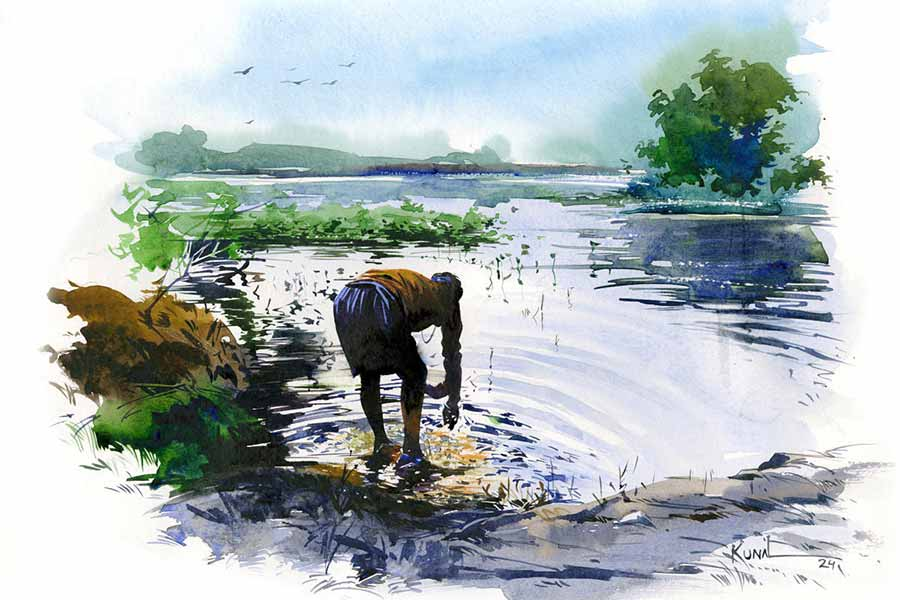

 
 <h1 align=center>কন্যাদান</h1>
<h2 align=center>সাগরিকা রায়</h2> আকাশ এখন মেঘলা। মেঘে ঢাকা ছাইরঙা আকাশের গাম্ভীর্য দেখে শ্যামাপদর মহাপুরুষদের মুখ মনে পড়ে। আলের উপর দিয়ে হেঁটে যেতে যেতে ফের আকাশ দেখে সে।

ফসলের ক্ষেত সবুজ রং মেখে বসে আছে। কিছুটা হেঁটে মেটে রাস্তায় উঠে পড়ে শ্যামাপদ। রাস্তার এক পাশে বাঁশের ঝোপ বৃষ্টির জল খেয়ে কোমরভাঙা বুড়ির মতো ঝুঁকে আছে। নয়ানজুলিতে পাটের পাতা পড়ে আছে। কচুরিপানার ফুল ফুটেছে, যেন ছোট্ট খুকি ভোমরামুখী।

বৃষ্টির বাতাস গায়ে লাগতেই পা চালায় শ্যামাপদ। নয়ানজুলির জলে পা ধুয়ে নিচ্ছে ভোগরু। ক্ষেতে কাজ করে দুপুরে খাওয়ার সময় হাত, পা নয়ানজুলির জলেই ধুতে আসে চাষিরা। বেগারখাটা চাষি ভোগরু, নিজের জমি নেই, পরের জমির বাগাল। শ্যামাপদকে দেখে চেঁচিয়ে ডাকে, “কই যান?”

শ্যামাপদ না থেমেই চেঁচিয়ে বলে, “যাই বড় মেয়ের কাছে।”

ভোগরু হি হি হাসে, “যান গা। তার খিদা পাইছে!”

শ্যামাপদ ভোগরুর হাসির ভিতরের ব্যঙ্গটা বোঝে। কোনও উত্তর দেয় না। হাতের কৌটোর দিকে এক বার তাকিয়ে সে আরও জোরে পা চালায়। কে জানে, দেরি দেখে মেয়ে মুখ গোমড়া না করে!

আজ বেশ দেরিই হল। বর্ষার সময় কাজ না থাকলে পয়সার খরা চলে। ফের যদি কাজ শুরু হল তো রোজই কাজ! শ্যামাপদ লোকের বাগান পরিষ্কারের কাজও করে। ঝড়বৃষ্টি হলেই পরের দিন কাজের চাপ বাড়ে। ভিজে ভিজে কাজ করতে হয় বলে রেনকোট কিনে দিয়েছে ছোট মেয়ে বুলবুলি।  সস্তার জিনিসে জল ঢুকে যায়। তবু বেশ আরাম হয়।

রাস্তার উল্টো দিকের জমিতে নেমে পড়ে শ্যামাপদ। রাস্তার দু’পাশের ধানী জমির দিকে তাকিয়ে দেখে সে। একটা মানুষের কত্ত জমি!

পয়সার কথা মনে হলেই হাত-পা কাঁপে শ্যামাপদর। ছোট মেয়ের বিয়ের কথা চলছে। মেয়ের বয়স সতেরো। ত্রিশ বছরের পাত্র। মেয়ের মায়ের তাই মন খারাপ, “বয়সের ফারাক থাকলে বর সারাদিন বকাঝকা করে। মিলমিশ হতে সময় লাগে।”

শ্যামাপদ টের পায়, মেঘ জল ছিটিয়ে দিতে শুরু করেছে। আজ রেনকোটও নেই সঙ্গে। ওটা গায়ে থাকলে ফেরার তাড়াহুড়ো থাকে না। বড় মেয়ের সঙ্গে কথা বলা যায় আরাম করে।

মেয়ের কাছে বলার মতো কত কিছুই যে থাকে! আগে বড় জনকে বলে তবে ছোট জনকে বলবে শ্যামাপদ। গল্প ভাল লাগলে বড় মেয়েটা খুশিতে দুলতে থাকে। এটা ওর বরাবরের অভ্যেস। দুলুনি দেখে শ্যামাপদ বোঝে গল্প পছন্দ হয়েছে মেয়ের। তখন আস্তে আস্তে হাতে তালি দিয়ে শ্যামাপদ ছড়া বলে, “দোল দোল দুলুনি/ রাঙা মাথায় চিরুনি/ বর আসবে এখনি/ নিয়ে যাবে তখুনিই-ই-ই!”

ভাবতে ভাবতে ঠোঁটের কোণে হাসি টিকটিক করে ওর। আজ মঙ্গলদাস মণ্ডলের হাতি পোষার গল্পটা বলবে বাদামণিকে। মঙ্গলদাসের বাড়িতে একটা হাতি ছিল। সে জোতদার ছিল। এখন সে সব নেই, কিন্তু পয়সা আছে। সম্মানও। কত্ত টাকা তাঁর! এই যে জমির উপর দিয়ে হেঁটে যাচ্ছে শ্যামাপদ, এ সব জমি মঙ্গলদাসের! তাঁর হাতি সেজেগুজে এসে রথের মেলার সময় রথ টানত। বিরাট মোটা দড়ি ধরে এগিয়ে যেত মঙ্গলদাসের হাতি। পিছনে হাজারগণ্ডা লোক দড়ি ধরে “জয় জগন্নাথ! জয় জগন্নাথ!” বলতে বলতে যেত। আর ঘড়ঘড় শব্দে রথ এগিয়ে যেত। কী শান্ত প্রাণী! এত লোক চেঁচাচ্ছে, কিন্তু সে বিরক্ত হয় না।

পিছনে সাইকেলের আওয়াজ পেয়ে ঘাড় ঘুরিয়ে দেখে শ্যামাপদ। কেউ  এক জন জমির ভিতরের পায়ে চলা পথ দিয়ে সাইকেল চালিয়ে আসছে। চিনে ফেলে শ্যামাপদ। এ হল রোহিণী হালদারের ভাই তারাপদ!

শ্যামাপদ একটু বিব্রত হল। কিছু মানুষের কাজই হল খাইদাই কাঁসি বাজাই। তারাপদ রোহিণীর মুদির দোকান দেখাশোনা করে। মানুষকে খুব নাজেহাল করে তারাপদ। টিটকিরি দেয়, রংতামাশা করে। বিশেষ করে শ্যামাপদকে দেখলেই তারাপদর মুখে যেন তুবড়ি ছোটে।

ঘাড়ের উপরে এসে পড়ল তারাপদ। শ্যামাপদকে দেখেই গান ধরল, “আহা গো! শ্যামাপদ/ লম্পট/ বসন্ত/ আগমন হয়…”

দ্রুত চার পাশে তাকিয়ে কেউ এ সব গান শুনছে কি না দেখে শ্যামাপদ। তারাপদর দিকে না তাকিয়ে রাস্তা ছেড়ে দেয়। তারাপদ হেঁ হেঁ হেসে চলে যেতে থাকে। পিছন ফিরে, “ও লম্পট? যাও কই?” বললেও জবাব দেয় না শ্যামাপদ। এ সব গায়ে মাখে না শ্যামাপদ। কিন্তু, ভয় হয়, ওর মেয়েরা এ সব গান শুনে না ফেলে!

এক আকাশ মেঘের নীচে হেঁটে যেতে যেতে হঠাৎ শ্যামাপদর ভারী আমোদ হয়। যেন মাটিতে নয়, সে হেঁটে যাচ্ছে মেঘের উপর দিয়ে। সে বার যেমন গিয়েছিল! বাদামণির কাছে দাঁড়িয়ে গল্প করে যেত ডুয়ার্সের চিতা বাঘের। অমনি আকাশ জুড়ে মেঘ নেমে এল সেই গল্প শুনতে। টুসটাস জলের ফোঁটা পড়তে শুরু করেছে। আর এত কাছে মেঘ দেখে মেঘের উপরে হাঁটতে ইচ্ছে হল শ্যামাপদর। মেঘের দল ওকে নিয়ে খানিক ভেসে বেড়াল আকাশে। পরে নামিয়ে দিল বাদামণির কাছেই। বাদামণি ছাড়া কেউ সাক্ষী নেই সে ভ্রমণের। আর বাদামণি কখনও কাউকে বলবে না, সে কথা জানে শ্যামাপদ। বাদামণি বড় লক্ষ্মী মেয়ে।

দূরে দেখা যাচ্ছে বাদামণিকে। ঠিক দেখতে পেয়েছে বাবাকে! দুলছে দেখো! শ্যামাপদ হাসে। বাদলা বাতাসে সে হাসি গিয়ে বাদামণির গায়ে লাগে।

বিরাট গাছটা কত কাল ধরে পৃথিবীর গর্ভে তার শিকড় ছড়িয়ে দিয়ে পোক্ত হয়ে উঠেছে। অজস্র ডালপালা ছড়িয়ে দিয়েছে মহাশূন্যে। গায়ে ঘন কালচে সবুজ শ্যাওলার স্তর বেয়ে বৃষ্টির জলের ধারা নেমেছে আজ সকালেও। তার দাগ এখনও রয়েছে। লম্বাটে লাল খোলসযুক্ত ফলের ভিতরে থাকে লাল লাল সিমের বিচির মতো বাদাম। লোকে বলে বুনো বাদাম। শ্যামাপদ তাকে ডাকে ‘বাদামণি’ বলে। এই-ই তার বড় মেয়ে!

ভোগরু হেসে হেসে বলেছিল, “তোমার মেয়ে অন্যের জমিতে থাকে ক্যান? এই জমি তো মঙ্গলদাসের! এক দিন যদি মঙ্গলদাস বলে, ‘এই শ্যামা, আমার জমিতে ঢুকবি না!’ তাইলে? মেয়েরে দেখবা কেমনে?”

এ সব কথার মধ্যে একটা ‘যদি’ ঢুকে পড়ে সামান্য স্বস্তি দেয় বটে,কিন্তু অস্বস্তিটা কাটে না। ঘুমোতে গিয়ে চোখ খুলে রেখে শ্যামাপদ বাদামণির কথা ভাবে। মেয়েটা এত রাতে একা একা দাঁড়িয়ে আছে। দুশ্চিন্তা বেড়ে যায় শ্যামাপদর।

শ্যামাপদর বৌ মেয়ের নাইটির খুলে যাওয়া সেলাই ফের জুড়ে দিতে সূচের ছোট ছোট ফোঁড় দিতে বসে। শ্যামাপদ জানে বৌ কিছু কথা জমিয়ে রাখে এই সময়ের জন্য।

“বুলবুলির ছবি খুব পছন্দ হয়েছে ছেলেপক্ষের। তারা আসবে। এই রবিবার। ভাপা পিঠা করে রাখব।”

“ভাপা পিঠা? বড় মেয়ের জন্য দুইখান দিয়ো...” শ্যামাপদ খুশি হয় ভাপা পিঠে হবে শুনে। খুশিতে আঙুল মটকাতে থাকে।

বৌ বলে, “টাকাপয়সার জোগাড় করতে হবে। তারা কিছু নেবে না যদি পছন্দ হয়। তাও মেয়ের জন্য শাড়ি, রূপার হার, সোনার নাকফুল লাগবে। চুড়ি লাগবে। আমার রূপার চুড়ি দুইটা দেব। বরযাত্রী, আত্মজনদের খাওয়া দিতে হবে। ডাবর, থালা, বাটি, গেলাস, ধুতি, গেঞ্জি। এই ক’টা দিতেই হয়। আর চাদর,বালিশ।”

থালা, বাটি, ডাবর…! শ্যামাপদ ভয় পায়! এত সব কোথা থেকে আসবে! বন্ধুবান্ধব বলতে তেমন কেউ নেই। কার কাছে দুঃখের কথা বলবে?

এখন শ্যামাপদ বাদামণির কাছে এসে দাঁড়িয়ে মেয়েকে দেখল। বাপকে দেখে বড় মেয়ে ভারী খুশি হয়ে দুলতে থাকে। বিরাট লম্বা ডালপালা ছড়িয়ে ‘দোল দোল দুলুনি’ গানের সুরে নাচতে থাকে।

শ্যামাপদ হাসে ছেলেমানুষের মতো। হাসতে হাসতে কৌটো খুলে ভাপা পিঠে বের করে একটা বড় পাতার উপর রাখে। মুখে বকবক, “খাইস রে মা। তোর জন্য তোর মা বানাইছে। তুই ভালবাসিস…। আর তোর বোন, তার বুঝি বিয়া লাগল রে! ছেলে ভালই…” এক নাগাড়ে কথা বলতে বলতে পিঠে সাজিয়ে নীচের দিকের একটা ডালে রাখে শ্যামাপদ, “আজকে বেশি সময় থাকতে পারব না রে মা। জোর বিষ্টি আসতেছে। বাসায় যাই। তুই খা।“

শ্যামাপদ দ্রুত হাঁটে। ঝিরঝিরে বৃষ্টি শুরু হয়েছে মানেই এ বারে হুমহাম বৃষ্টি নামবে রাক্ষসের মতো। অভ্যেস আছে রোদে-জলে কাজ করার। কিন্তু মেয়ের বিয়ে সামনে, এখন কোনও রকম ভাবেই অসুস্থ হতে চায় না শ্যামাপদ। অসুস্থ হলে বৌ রেগে যাবে আর সব রাগ গিয়ে পড়বে বাদামণির উপরে। শ্যামাপদ বোঝাতে পারে না বাদামণিকে কতটা ভালবাসে সে। বুলবুলির জন্মের কত আগে থেকে সে বাদামণিকে চেনে! ঝড়বৃষ্টির সময় বাদামণির কাছে আশ্রয় নিয়েছে! সে কি আজকের কথা? তখন ওর বৌ কোথায়! সেই কবে থেকে বাদামণির সঙ্গে শ্যামাপদর সম্পক্ক! শ্যামাপদ বা বাদামণিরই কি সেই তারিখ মনে আছে? বাপ-মেয়ের সম্পর্কের কি কোনও তারিখ হয়!

শ্যামাপদ আলের উপর দাঁড়িয়ে চার পাশ দেখে। এই দেখো! আজ মঙ্গলদাসের হাতির গল্পটা করা হল না বাদামণিকে! বৃষ্টির থেকেও বৌয়ের গোমড়া মুখের কথা ভেবে জোরে পা চালায় শ্যামাপদ।

ভোগরু একটা কালো ছাতা জুটিয়েছে কোথা থেকে। ডাঁটিভাঙা ছাতাটা নিয়ে বাঁ দিকের জমির ভিতর থেকে ভূতের মতো আচমকা উঠে এল। বাসায় ফিরবে এখন। শ্যামাপদকে দেখে ভোগরু বলল, “খাওন দিলা মেয়েরে?”

শ্যামাপদ ঘাড় হেলিয়ে দেয় সম্মতি বোঝাতে।

“কী আনছিলা?”

“ভাপা পিঠা।”

ভাপা পিঠের নামে ভোগরুর চোখ চকচক, “ইস! কত দিন পিঠা খাই না!”

শ্যামাপদ বলল, “চল ঘরে। খাবা। বুলবুলিকে দেখতে আসতেছে। তাই পিঠা…”

বিয়ের আভাসে ভোগরু খুশি হল, “কবে হবে বিয়া?”

শ্যামাপদর মনে হল, ভোগরু ওর খানিকটা বন্ধু যেন। মেয়ের বিয়ের নানা সমস্যার কথা ভোগরুকে বলা যায়, তাই সে বলে, “বিয়া তো হবে। টাকা নাই। কী করব …”

ভোগরু বুদ্ধি দেয়, “টাকা নাই তো মঙ্গলদাসের কাছে যাও না ক্যান? বেগার  খাটিয়া টাকা শোধ দেবা।”

শ্যামাপদ আশ্চর্য হয়। আজ কি ভোগরু এই বুদ্ধি দেওয়ার জন্যই জমিতে অপেক্ষা করে ছিল? নাকি বাদামণি ভোগরুকে পাঠাল শ্যামাপদকে বুদ্ধি দিতে? এ সব আশ্চর্য ব্যাপার মাঝে মাঝে আবেগবিহ্বল করে শ্যামাপদকে। বিশ্বাস হয়, বাদামণি বাপের সমস্যা দূর করতে চেয়েছে! বড় মেয়ে কি সাধে বলে শ্যামাপদ?

পাকাবাড়ির সামনে খোলা উঠোন। সেখানে কাঠের বড় চেয়ারে গদি সাঁটা। মঙ্গলদাস মণ্ডল বসে আছে চেয়ারে। চার পাশে ছড়িয়ে-ছিটিয়ে আছে পারিষদরা, এক কোণে এক্কাদোক্কা খেলছে বাচ্চারা। মঙ্গলদাসের নাতিপুতি হয়তো। ভাবল শ্যামাপদ। মঙ্গলদাস শ্যামাপদকে দেখে চোখ কুঁচকে তাকায়। বয়স কম হয়নি মঙ্গলদাসের। পার্টির নেতা হয়ে জমিজিরেত রক্ষা করেছে। করছেও। তাঁর ছয় ছেলের সকলেই পার্টির পাশাপাশি নানা বিজ়নেস করে।

মঙ্গলদাস ওকে চিনতে পেরেছে, “শ্যামাপদ না? খবর কী?”

শ্যামাপদ খবর বলার আগে মাটিয়ে শুয়ে প্রণাম করে নিল মঙ্গলদাসকে। বড়মানুষের সামনে এসে দাঁড়ালে কেমন কান্না আসে ভক্তিতে। প্রণামও আসে। প্রণাম সেরে উঠে সমস্যাটা বলে শ্যামাপদ। কিছু টাকা চাই। মেয়ের বিয়ে। বেগার খেটে টাকা শোধ করে দেবে সে।

“বেগার খাটবি?” মঙ্গলদাস বড় বড় দাঁতের আসর সাজিয়ে ফেলল, “কত দিনে টাকা শোধ করবি? কত টাকা চাই?”

শ্যামাপদ ঠিক জানে না কত টাকা চাই। তবে ঘটি, বাটি, ডাবর, থালা…

মঙ্গলদাস নিজেই বলে, “পাঁচ হাজার টাকায় হবে? আচ্ছা, ডবল কইরা দিই। আইজ থিকা শ্যামাপদ হইল আমার বাগাল। ভোগরুর সঙ্গে কামে লাগবি। তোর কাজের একটা পাকা বেবস্তাও হইল কি না?”

শ্যামাপদ জানে না, স্বাধীনতার মানে। একটা পাকাপাকি বাগাল হওয়ার আনন্দে উদ্বেল হয়ে ওঠে ও। আজ থেকে কাজ শুরু।

“শোন শ্যামাপদ, আইজ প্রথম দিন তোর কাজ হইল ঢেঁড়া পিটায় পিটায় ইলাকা ঘুরে ঘুরে চেঁচাবি। বিকাল পজ্জন্ত তোর কাজ। কাইলও যাবি ঢেঁড়া নিয়া।”

ঢেঁড়া পেটাবে শ্যামাপদ? কী খবর জানাতে হবে শ্যামাপদকে ?

“আমার জমিতে যে বুনা বাদাম গাছটা আছে, সেইটা বিক্রি হবে। কেউ কিনতে চায় কিনা সেইটা জানার জন্য ঢেঁড়া পিটাবি। বলবি, কিনতে চাইলে সরাসরি মঙ্গলদাস মণ্ডলের সঙ্গে দেখা করতে হবে!”

“বাদাম গাছ!” আর্তনাদ করে ওঠে শ্যামাপদ।

“হ্যাঁ। জমির অনেকটা দখল করে আছে উটা।”

বুলবুলি নাকি বাদামণি? কাকে বাঁচাবে শ্যামাপদ? বাদামণিকে বাঁচাবে কী করে? জমি সাফ দেখতে চায় মঙ্গলদাস। সেখানে কার মেয়ে বিক্রি হল, তা কেন দেখবে সে? 

উন্মাদের মতো রাতের অন্ধকারে বাদামণিকে জড়িয়ে কাঁদতে থাকে শ্যামাপদ। বৃষ্টির ফোঁটায় ভিজে একশা হয়ে যায় সে। বাদামণির চোখ বেয়ে জলের ধারা নেমে এসে ভিজিয়ে দেয় বাবাকে।

শ্যামাপদকে খুঁজতে বেরিয়ে এসেছিল বুলবুলি। অন্ধকার জমি থেকে বাবাকে ধরে ধরে ঘরে নিয়ে যায়। বাদামণির গোড়ায় রাখা গতকালের দেওয়া ভাপা পিঠের গায়ে তখন থিকথিক পিঁপড়ে।

শ্যামাপদ পিছন ফিরে দেখে, বাদামণি দুলছে অল্প অল্প। দু’-এক দিনের মধ্যে এই জায়গাটা ফাঁকা হয়ে যাবে । শ্যামাপদ দাঁড়িয়ে পড়ে, “দোল দোল দুলুনি/ রাঙা মাথায় চিরুনি/ বর আসবে যখনই/ নিয়ে যাবে তখনই…”

শ্যামাপদর দুই মেয়েরই বিয়ে হবে। কন্যাদান করবে শ্যামাপদ।