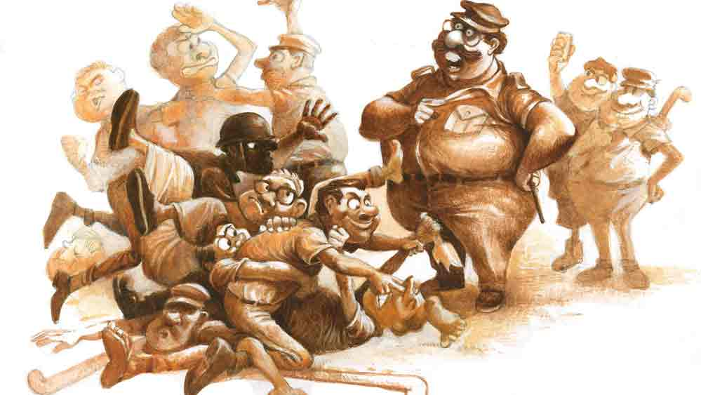

 

<h1 align=center>কপালে পুরুষ</h1>
<h2 align=center>বিতান সিকদার</h2>
উত্তর কলকাতার বিভিন্ন পাড়ার মোড়ে চায়ের দোকানগুলোয় সারা ক্ষণ যে কয়েকটা আশিস, দিলীপ বা বাপি দেখা যায়, এটা তাদের মধ্যে এক আশিসের কথা। আশিসের বয়স মোটামুটি পঞ্চাশের একটু নীচে। সেটা দেখে বোঝাও যায়। কিন্তু প্রসঙ্গ উঠলেই আশিস হালকা হেসে বলে, “দেখে মনে হয়?”   যুগ ও জগৎকে ঈশ্বরের অভিনব দান এই আশিস— অন্তত আশিস তাই মনে করে। তার কপাল সোনায় মোড়া, ঈর্ষণীয়!   আশিস বস্তিবাড়িতে অন্য ভাইবোনদের সঙ্গে গাদাগাদি করে বড় হয়েছিল। পাশের পাড়ার ইস্কুলে এইট পর্যন্ত পড়ে বিবেকানন্দ সমিতির হয়ে সে ফুটবল খেলতে নামে। তার পর আর একটু বড় হলেই, ওই খানকতক দিলীপ আর বাপির সঙ্গে পাড়ায় ক্যাবলার চায়ের দোকানে ঢুকে পড়ে। সেখানেই জীবনের বিশ্ববিদ্যালয়ে তার বাকি পাঠ।   বাপ-মা গত হওয়ার পর ধর্মের ষাঁড় আশিসকে তার বড় ভাই ঘাড়ধাক্কা দিয়ে বাড়ি থেকে বার করে দিয়েছিল— “চরে খা!” এ বিষয়ে কেউ সহানুভূতি জানাতে আসলে আশিস প্রথমে বলত— “ছাড়ব না আমি। আমাকে তো চেনে না!”   তার পর ছেড়ে দিল— “আরে দূর! আমার কপাল নিতে পেরেছে?”   সবারই কোনও না কোনও ভাবে চলে যায়। আশিসেরও তাই। সে ভাবেই এক দিন তার প্রেমজ বিবাহ হল। তার পর আশিসের বউ ঝুমকি তাকে লুকিয়ে খিদিরপুরের জামালের সঙ্গে চলে গেল। আশিসের মুখে সেই হাসি— “তো? আমার কপাল নিয়ে যেতে পারল?”   আশিস কখনও ভেঙে পড়ে না। কখনও চেয়েচিন্তে, কখনও এর-ওর ফরমাশ খেটে, আবার কখনও বা টুকটাক কিছু খুচরো কাজ করে আশিস তার পর থেকে রাজার হালে থাকে ও জুলপি রাখে।   এই আশিসই এক দিন নজরে পড়ল ক-পার্টির লোকাল এমএলএ নগেনবাবুর। পাড়ার ছেলে হিসেবে মুখ চিনতেন, ওটুকুই। কিন্তু আশিস যে কত ভাল রাঁধুনি, তা জানতেন না। আর হবে না-ই বা কেন। ইস্কুলে আশিসের প্রিয় বিষয় ছিল কর্মশিক্ষা। হাতের কাজে আশিস চিরকাল দড়। সে রান্নাই হোক, প্যান্ডেলে পেরেক ঠোকাই হোক বা বাঁকা করে আলপনা দেওয়াই হোক। সেটা দিয়ে আশিস আবার পাঁচ জনকে দেখিয়ে জিজ্ঞেস করত, “দেখেছিস? পারবে কেউ?”   উত্তরে বলতে হত, “নাঃ!”   সেই কাশ্মীরি আলুরদম। পার্টি অফিসের খাওয়াদাওয়া। এমএলএ মোটে ধরতে পারেন না, কী দেওয়ায় আলুরদম এমন অমৃত হয়ে গেছে। তার পর যখন চরাচরে কেউ বুঝতে পারল না, তখন আশিস আস্তে করে বলল, “পোস্ত!”   অবাক নগেনবাবু বললেন, “তোমার হাত মানতেই হবে।”   পরে পঞ্চাকে আশিস আলাদা করে ডেকে বলেছিল, “জানবি আমি হাতা ধরলে ক্যাটার ফেল!” এখানে ‘ক্যাটার’ মানে কেটারার। আশিসের ইংরেজিটা একটু…   যাক গে, আলাপটা ভাল ভাবেই হল। নগেনবাবু তার পিঠ চাপড়ে বললেন, “তুমি কাজের ছেলে।” আশিস মনে মনে বলল, ‘মানতেই হবে!’ তিনি মাঝে মাঝে রাস্তায় তাকে ডেকে কথা বলা 
শুরু করলেন।   হঠাৎই আশিস পার্টির কিছু ছেলেদের নেকনজরে চলে এল। কেউ কেউ তাকে ‘ওস্তাদ’ বলে ডাকাও শুরু করল। আশিস জানত, জগৎ এক দিন তাকে চিনবেই। সে স্যান্ডো গেঞ্জিও ইস্তিরি করে পরা শুরু করল।   মাস কয়েক পর রক্তদান শিবির। “তোকে কিন্তু থাকতেই হবে” গোছের একটা কথা আশিসকে বলতেই সে বলল, “রক্ত দিতে হবে?”   “না না, তুই চিকেন স্ট্যু-টা একটু রেঁধে দিবি।”   আরও কিছু দিন পর সরস্বতী পুজো। এ বার নগেনবাবু নিজে আশিসকে বললেন, “একটু দেখিয়ে-টেখিয়ে দিস…”   আশিস বুঝল সে ছাড়া জগৎ অচল। বলল, “ভাসানে কিসোর বাজবে…”   কিসোর?   “আরে কিসোর কুমার!” আশিসের ণত্ব-ষত্ব জ্ঞানটা একটু…   ভাসানের পর নগেনবাবু বললেন, “তুই বাইরে ঘুরিস কেন? ভেতরে এসে বসবি।”   সে দিনই পঞ্চা আশিসের শিষ্যত্ব গ্রহণ করল। সেও বড় হয়ে আশিস হবে। আশিস বলল, “লাইফ তৈরি করে দেব…”   কিন্তু, পার্টি অফিসে আশিসের এই ঘন ঘন পদার্পণ বিরোধীপক্ষ, অর্থাৎ খ-পার্টির খগেনবাবু ভাল চোখে দেখলেন না। তার ছেলেরা কয়েকদিন আশিসকে হালকা মাপল। আশিস খেয়াল করল না। আশিস তখন পার্টির ছেলেদের সঙ্গে ঘোরে।   নগেনবাবু এক দিন জিজ্ঞেস করলেন, “তোর চলে কী করে?”   আশিস মুখে বলল, “ওই টুকটাক!” মনে মনে বলল, ‘আশিসের চলা কেউ আটকাতে পারে না।’   “আমি নেপালবাবুকে বলে দেব। স্টোনচিপস আর বালি সাপ্লাইটা দেখে নে। তেলিপাড়ায় টালির চাল পাকা করছে। হাতে কিছু আসবে।”   তা, হাতে কিছু এলও। টাকাটা হাতে ধরে সে সেই রাতেই ক-পার্টির এমএলএ-র কাছে মনে মনে বিক্রি হয়ে গেল। সুখে না দুঃখে জানা যায় না, আশিস টেনে মালও খেল। তার পর পাশে বসা পঞ্চাকে বলল, “পারল আটকাতে? পারল আশিসের কপাল নিতে?”   পার্টির মাধ্যমে কনস্ট্রাকশন করবে যে প্রোমোটার, সেই-ই পার্টি মেম্বার। এমএলএ আশিসকে বললেন, “ইলেকশন আসছে। তৈরি হতে হবে। প্রথমে নাদ সাধনা। ‘চলছে না চলবে না’ কথাটা পা থেকে ধর।”   আশিস নগেনবাবুর পায়ে পড়ে গেল। তিনি হেসে বললেন, “দূর বোকা! পা মানে পঞ্চম থেকে ধর।”   বোঝালেন, কী ভাবে ধ্বনি দিতে হয়। ‘জবাব চাই জবাব দাও’-টা আরও ওপরে, মানে ধা-এ হবে। শেষে ‘ভেঙে দাও, গুঁড়িয়ে দাও’ একেবারে সপ্তকের টঙে।   আশিস সেই মতো গলা সাধা শুরু করল। এখন তার চার পাশে গনা, বান্টি, কলু, ছাতা, প্রভাসরা ঘোরে। নগেনবাবু আশিসকে শুনিয়েই সবাইকে দেখিয়ে বলেছেন, “ছেলেটার মধ্যে পার্টস আছে।”   এ বার জনসেবা। আশিসের ভাষায়, “মানুসের জন্য কাজ…”   সেই কাজে আশিস শীতকালের বৃষ্টিতে বানভাসি রাস্তায় দাঁড়িয়ে থেকে ম্যানহোলের ঢাকনা খুলে জল পাস করানোয় কর্পোরেশনের লোকদের সাহায্য করল। কারণে অকারণে বৃদ্ধাদের দিকে তাকিয়ে হেসে বলা শুরু করল, “বলবেন মাসিমা, কিছু লাগলে-টাগলে…”   মাসিমারা না বললেও রত্নাবৌদি বললেন, “দেখুন না, বাড়ির সামনে কে যেন জঞ্জাল ফেলে যায়।”   রিটায়ার্ড পুলক সেন বললেন, “দেখো তো বাবা, লাইটপোস্টের বাল্‌বটা কে যেন খুলে নিয়ে গেছে…”   এরই মধ্যে চূড়ান্ত ঘটনা। খোদ নগেনবাবু আশিসকে নিজের বাইকের পেছনে বসিয়ে পাড়া ঘুরে পার্টি অফিসে এলেন। খ-পার্টির খগেনবাবু বাদলা, শ্যামল আর ঝন্টুকে বললেন, “ওরা পটাপট ছেলে তুলে নিচ্ছে? তোরা গাব জ্বাল দিচ্ছিস?”   শ্যামল রিক্সা স্ট্যান্ডে আশিসকে পেয়ে বলল, “বেকার রিস্ক নিচ্ছিস। তার চেয়ে নিজের খোপেই থাক না ভাই। আমরা খোপে ঢোকাব, সেটা ভাল হবে? এ বার ফুল পালাবদল হতে চলেছে। সামলাতে পারবি?”   আশিস প্রথমে ডায়লগ বলল, মানে কোথায় মারবে আর কোথায় পড়বে ওই রকম গোছের একটা কথা! তার পর ভুল শুধরে বললে, “মারবই বা কাকে? তোর বাপের নাম তো আগে থেকেই খগেন হয়ে আছে।”   ব্যস! লেগে গেল। প্রথমে ধাক্কাধাক্কি। তার পর ঠেলা। তার পর লাটাইতলার মাঠে সবাই জড়ো হয়ে অ্যাকশন। টিউব লাইট, চেন, হকি স্টিক... কিছু পরে পুলিশ। কেউ কারও বিরুদ্ধে কোনও অভিযোগ জানাল না বলে ওসি কড়কে চলে গেলেন। দিনের শেষে নগেনবাবু আশিসকে ডেকে বললেন, “একে বলে পার্টি করা। কেমন লাগছে?”   আশিস বলল, “জান লড়িয়ে দেব। চেনে না আমাকে।”   ভোট আসার আগে পরিস্থিতি উত্তপ্ত রাখতে দুই পক্ষই কসুর করল না। আশিসকে শেখানো হল, কী ভাবে দাঁত-নখ বার করে রাখতে হয়।   ভোট এগিয়ে আসছে। শুরু প্রচার। এই সিট নগেনবাবুর চাই-ই চাই। আশিস বলল, “রেখে দেব।”   ঘন ঘন পোস্টার লেখা শুরু হল। বানান ভুল হতে পারে বলে আশিসকে এটা আর কেউ করতে বলল না। তবে আশিস দাঁড়িয়ে থেকে তদারকিটা করে যেতে লাগল। এর পরেই ব্যানার টাঙানো। তার পর পাড়ার এখানে-সেখানে সভা। মিছিল। সেখানে পার্টির পতাকা হাতে আশিস সামনের সারিতে। মুখে ‘সাম্পোদায়িক সম্পিতি’র জয়গান।   নগেনবাবু বলে চলেছেন, “ওরা সব শক্তি লাগিয়ে দেবে। এই সিট ওদের চাই-ই। যে ভাবে হোক আমাদের ঠেকাতে হবে।”      এর পর গ্রীষ্মের দাবদাহে এল ভোট পর্ব। লিস্ট রেডি। বাড়ি বাড়ি গিয়ে কাউন্টারপার্টও লোকজনকে দেওয়া হয়ে গেছে। নগেনবাবু হাতজোড় করে এ পাড়া সে পাড়ায়, রাস্তায়, গলিতে, “দয়া করে আস্থা রাখবেন।” পেছনে হোমরাচোমরাদের সঙ্গে ‘কাজের ছেলে’ আশিস। এর বাড়ির দেওয়ালে, তার বাড়ির দরজায়, লাইটপোস্ট জুড়ে পোস্টার সাঁটা চলছে। মাইকে মাইকে কান ঝালাপালা।   ভোটের আগে অ্যাকশন প্ল্যান রেডি। ঠিক হল, আশিস বাইরে থাকবে। পাড়ার মোড়ে বেঞ্চি পেতে। বিভিন্ন বুথের ভেতর থেকে ছকু, সান্টু, গনা ফোনে হিসেব দিয়ে যাবে, কোন দিকে কত পড়ল।   “জানবে কী করে?”   “ওরা ঠিক জানতে পারবে।”   আশিস জেনে নিল, যেগুলো ও দিকে ছাপ মারবে, সেগুলোকে আটকাতে হবে কি না। নগেনবাবু বললেন, “দরকার নেই।” যবে থেকে আশিস শুনেছে যে, সে ও দিকের টার্গেটে আছে, তবে থেকে এটা তার কাছে ‘পেস্টিজ ইসু’।   কাকে কাকে বাড়ি থেকে বেরোতে দেওয়া হবে না, জিজ্ঞেস করায় এমএলএ বললেন, “পোলিং-এর হালচাল দেখে তবে সিদ্ধান্ত…”      সেই সিদ্ধান্ত যখন নেওয়া হল, তখন বেলা একটার মধ্যে পঞ্চান্ন পারসেন্ট পোলিং। উল্টো দিকে পড়ছে না তো? ক-পার্টি প্রমাদ গুনল।   আর দেরি নয়। এ বার অ্যাকশন।   পোলিং এজেন্ট-ই পায়ে পা বাধিয়ে ঝামেলাটা শুরু করল। ক্রমে প্রত্যেকের গলার আওয়াজ চড়ছে। প্রিসাইডিং অফিসার রুমাল দিয়ে কপালের ঘাম মুছছেন।   তার পর… প্রথমে ধাক্কা, তার পর চোয়াল লক্ষ্য করে ঘুসি। নিমেষে খবর চাউর হয়ে গেল। সরলাবালা ইস্কুলের বুথে ঝামেলা বেধেছে। পুলিশ ঢুকে দুই পক্ষকে নড়া ধরে বাইরে নিয়ে এল। ব্যস! অমনি— “এরা এজেন্ট বসতে দিচ্ছে না...” বলে রে রে করে রাস্তা দিয়ে দু’পক্ষ ছুটে এল। নিমেষের মধ্যে তুমুল হাতাহাতি। তার পর অস্ত্র।   পুলিশ নামল। র‌্যাফ ছুটে এল। খণ্ডযুদ্ধ। পোলিং স্থগিত। প্রিসাইডিং অফিসার লেবুর জল খাচ্ছেন। রুমাল ভিজিয়ে মাথায় দিয়েছেন। ওঁর আবার প্রেশারের ব্যামো!   বাইরে তখন রণক্ষেত্র। পুলিশ আর র‌্যাফ মিলেও সামলানো যাচ্ছে না। প্রবল হিংসাত্মক পরিস্থিতিতে আশিস হাতে চেন নিয়ে বলছে, “করব লড়ব জিতব রে…”   টিভি চ্যানেলের লোকজন চলে এল, “আপনারা দেখতে পাচ্ছেন এখানে অশান্তিপূর্ণ পরিস্থিতির…” ক্যামেরা আশিসের দিকে তাক করা।   এমন সময় প্রভাস আশিসকে কানে কানে বলল, “নগেনবাবু তোকে ফুটে যেতে বললেন। এলাকা থেকে বেরিয়ে যা। দিন দশেক পরে ফিরিস।”   র‌্যাফের লাঠির ঘায়ে আশিসের ফোনটা পকেটেই ভেঙে গেছিল। তাই আশিস এমএলএ-কে জানাতে পারল না যে, সে সুন্দরবনের এক প্রত্যন্ত প্রান্তে তার দূর সম্পর্কের আত্মীয়ের বাড়িতে গা ঢাকা দিতে যাচ্ছে।   সব আত্মীয় খারাপ নয়! এরা, বলতে নেই, আশিসের আদরযত্ন করল। আশিসও তাদের পুকুরের কচুরিপানা তুলে দিল, গাছ থেকে ডাব পেড়ে দিল আর এক দিন কই মাছের ঝাল রান্না করে খাওয়াল।   দিন সাতেক বেশ গেল শুয়ে বসে। কিন্তু আর কত দিন? আশিসের এক ভাই গোত্রীয় লোক থেকে থেকেই জিজ্ঞেস করতে লাগল, “তাপ্পর আসিদ্দা, আবার কবে আসবা…”   আশিস বুঝল এখানে আর নয়। এক জনের বাড়ি টিভি দেখে সে জেনেছে, খ-পার্টি ক্ষমতায় এসেছে। কিন্তু তাদের কেন্দ্রের সিটের খবর সে পেল না। সারা ক্ষণ লোডশেডিং! কারও ফোনে চার্জ থাকে না।   যাই হোক, আশিস ফিরল এক নিশুতি রাতে। তখন পঞ্চা রকে একলা বসে বিড়ি টানছিল। আশিসকে দেখে দৌড়ে এল। তাকে টেনে একটা গলির মধ্যে নিয়ে গেল। বলল, “তুমি এখানে এসেছ কেন?”   “মানে?”   “জানো না, তোমার নামে ডাইরি হয়েছে? পুলিশ খুঁজছে তোমায়।”   “কেন?”   “ছকু, বান্টিকে পুলিশ তুলেছে। রোজ ক্যালায়। তোমাকেও খুঁজছে…”   আশিস হাঁ। ঢোঁক গিলে বলল, “নগেনবাবু কী বললেন?”   “বললেন, ‘সমাজবিরোধীদের সঙ্গে আমাদের কোনও সম্পর্ক নেই।’”   আশিস প্রথমে নির্বাক। তার পর বলল, “তোরা কিছু বললি না ওঁকে?”   “কে বলবে? ক-পার্টি আর নেই।”   “নেই মানে?”   “নগেনবাবু হারার পর খ-পার্টি জয়েন করেছেন। এখন আম-দুধ সবাই তোমার অ্যান্টি। নাগাল পেলে হয় কোপাবে, না হয় পুলিশে দেবে।”   আশিস পাঁচিল টপকে পালিয়েছিল সেই রাতেই। তবে যাওয়ার আগে পঞ্চা তাকে মনে করাতে ভোলেনি, “ভেবো না আশিসদা। যা খুশি হয়ে যাক। তোমার কপাল কেউ নিতে পারবে না।”