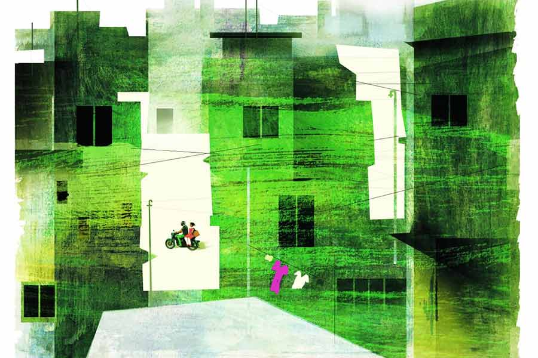

 
 <h1 align=center>কমিশন</h1>
<h2 align=center>বাণীব্রত গোস্বামী</h2> 

দালাল কথাটা শুনলে মাথায় রক্ত চড়ে যায় বিপ্লবের। কেন? নেগোশিয়েটর বা নিদেনপক্ষে মিডলম্যান বলা যায় না? একটু সম্মান দিয়ে ডাকলে ক্ষতি কী! সকালবেলাতেই পাড়ার বরেনকাকু মেজাজটা চটকে দিল। হন্তদন্ত হয়ে যাচ্ছিল বিপ্লব একটা দরকারি কাজে। ফ্ল্যাটের খদ্দের এসে মোড়ের মিষ্টির দোকানটার সামনে দাঁড়িয়ে থাকবে ঠিক ন’টায়। তার মধ্যেই পিছুডাক, “বিপ্লব, এ-ই বিপ্লব, তোর দালালির ব্যবসা এখন কেমন চলছে রে?”

এ যাত্রায় যদিও হাত নেড়ে ইশারা করে কিছু একটা বুঝিয়ে কেটে পড়ল বিপ্লব, তবে এদের হাত থেকে চিরতরে মুক্তি পাওয়া খুব মুশকিল।

বিপ্লবের কাজের ক্ষেত্র এখন ক্রমশ প্রসারিত হচ্ছে। জমি থেকে বাড়ি, পাত্র-পাত্রী থেকে গাড়ি— কিস্যু বাদ নেই সেই লিস্টে। মাঝেমধ্যে অন্যমনস্ক হয়ে সে ভাবে, এই দালালির বীজ তার শরীরে প্রথম ঢুকেছিল স্কুলে পড়ার সময় থেকেই। বন্ধুরা মিলে চাঁদা তুলে বল কেনা হত। সবাই চাঁদা দেওয়ার পর গোল হয়ে মাঠে বসে থাকত। বিপ্লব যেত বল কিনতে। পাশাপাশি কয়েকটা বলের দোকান। দুলালকাকুর দোকানটা ছিল ছোট্ট। দুলালকাকু বুদ্ধি দিয়েছিল, “যখনই বল কিনবি, আমার দোকানে আসবি। দাম সব দোকানেই এক, কিন্তু আমার দোকান থেকে বল কিনলে তোকে একটা করে চুইংগাম দেব।”

বিপ্লব শুধু ওই দোকানেই যেত। ভালই লাগত বিনা পয়সায় চুইংগাম। শুধু বোঝেনি যে, সেটাই তার দালাল হওয়ার হাতেখড়ি।

ওর হাতে এখন পয়সা আসছে জলপ্রপাতের মতো। মনের নদীতেও দু’কূল ছাপানো উচ্ছ্বাস। সেখানে একটা প্রেমের ভ্রূণ জন্ম নিয়েছে। পাড়ার মোড় থেকে ডান দিকে একটু এগোলেই যে হলুদ বাড়িটা, ওই বাড়িরই মেয়ে যূথিকা। কলেজে পড়ে। পড়াশোনার পাট অনেক আগেই চুকে গেছে বিপ্লবের। কলেজের দরজা ঠেলে ঢুকেছিল বটে বহু বছর আগে, তবে বেরিয়ে এসেছিল খালি হাতে। এখন আবার রোজ কলেজে যায়, তবে পড়তে নয়। রথ নিয়ে দাঁড়াতে। বাইকে সপ্তপদী হয়ে এখান-ওখান খুব ঘোরাঘুরি চলছে ওদের। পুজো, দোল, ভ্যালেন্টাইন সবেতেই নানা রকম উপহার দেয় যূথিকাকে। কিন্তু একটা বিষয় যূথিকার কিছুতেই হজম হত না। সেটা বলতে গেলে কয়েকটা ঘটনা বলতে হবে।

সে দিন ছিল ১২ ফেব্রুয়ারি। ভ্যালেন্টাইন’স ডে-র দু’দিন আগে। বাইকে চড়ে বেরিয়েছে। প্রথমে ঢুকল পেট্রল পাম্পে তেল ভরতে। তেল ভরল মাত্র এক লিটার। তার পর দুই চাকায় হাওয়া ভরিয়ে নিল। যূথিকা সরল মনেই জিজ্ঞেস করল, “মাত্র এক লিটার তেল ভরলে?”

“তেল তো আছেই অনেকটা। এমনিই ভরলাম। এখানে তেল ভরলে হাওয়া ফ্রিতে পাওয়া যায়।”

যূথিকা এ কথার পুরো মানে বুঝল না। তার পর যূথিকাকে নিয়ে একটা বড় শো-রুমে ঢুকল বিপ্লব। উদ্দেশ্য, একটা ভাল সালোয়ার কামিজ কিনে দেবে। মেয়েদের পোশাক পছন্দ করা সময়সাপেক্ষ ঘটনা। কিছুতেই মনের মতো হয় না। সাধারণত অন্য পুরুষসঙ্গীরা বিরক্ত হয়। কিন্তু যূথিকার খুব ভাল লাগত বিপ্লবের ধৈর্য দেখে। বিপ্লব চোখের ইশারায় যুথিকে বলত, যত ক্ষণ খুশি ধীরেসুস্থে পছন্দ করো। তার পর দোকানের এসির দিকে তাকিয়ে বলত, “ঠান্ডায় বেশ আরামেই তো আছি।” তার পর যখন সব কেনাকাটা হয়ে যেত যুথির, তখন বিপ্লব পয়সা দিয়ে অনুরোধ করত আর একটা ক্যারিব্যাগের জন্য। তার পর যদি কোনও সস্তার বলপেন বা পলকা চাবির রিং পাওয়া যায়, তার খোঁজ করত। পেয়ে গেলে হাসিমুখে বেরিয়ে আসত দোকান থেকে।

যূথিকা বুঝতে পারত না, এত বড় শো-রুম থেকে এত দামি জিনিস, মানে যা পছন্দ করে তা-ই কিনে দিতে বিপ্লবের কোনও দ্বিধা নেই, অথচ ছোটখাটো জিনিসের জন্য এ রকম করে কেন? আসলে যূথিকা বোঝে না, ভালবাসার বিনিময়ে বিপ্লব যে কোনও পরিমাণ অর্থ অবলীলায় ব্যয় করতে রাজি। কিন্তু তার কমিশন! সেটা না পেলে যে তার বুকের ভিতরের খচখচানি যায় না। তা বেশি সময় ধরে এসির ঠান্ডাই হোক আর পেন, চাবির রিং বা অতিরিক্ত পলিব্যাগ, যা-ই হোক না কেন! তবু কেমন যেন অদ্ভুত লাগত যূথিকার মানুষটাকে বুঝতে।

না থাকতে পেরে যূথিকা এক দিন প্রশ্নটা করেই ফেলল বিপ্লবকে, “আচ্ছা, তুমি সব সময় দীপকদার‌ কাছ থেকে চা-সিগারেট চেয়ে খাও কেন? আমি প্রায়ই দেখি। তুমি তো কোনও দিন তো তাকে খাওয়াও না!”

বিপ্লব তাচ্ছিল্যের সুরে হাসে, “তুমি আমার বোন মলিকে চেনো তো? দীপক ব্যাটা লাইন মারে আমার বোনের সঙ্গে। আমি জানি। তবু ওকে বুঝতে দিই না। তাই মাঝেমধ্যে চা সিগারেট ঝেড়ে খাই। ব্যাটা আমাকে হাতে রাখবে বলে তোয়াজ করে। ছাড়ব কেন!”

যূথিকা অবাক হয়ে বিপ্লবের দিকে তাকিয়ে থাকে।

সে বার দুগ্গাপুজোয় দক্ষিণ কলকাতায় একটা বড় রেস্তরাঁয় খেতে গিয়েছিল ওরা। সেখানকার বিরিয়ানি খুব বিখ্যাত। যুথি আবার বিরিয়ানি খেতে খুব ভালবাসে। তবে ওখানে চাইনিজ় বা অন্যান্য খাবারও পাওয়া যায়। যুথি ভালবাসে বলে বিরিয়ানি অর্ডার দিল বিপ্লব। বিরিয়ানি দিয়ে যাওয়ার পর বিপ্লব বেয়ারাকে ডেকে বলল, “ভাই ক’টা সসের পাউচ আর কাঁচালঙ্কা দিয়ে যাবেন তো।”

বেয়ারা একটু অবাক চোখেই তাকাল। বিরিয়ানির সঙ্গে সস! কিন্তু কাস্টমারকে তো চটানো যাবে না! একটু পরেই দিয়ে গেল। যূথিকা লক্ষ করল, বিপ্লব কয়েকটা কাঁচালঙ্কা আর সসের পাউচ বুকপকেটে ঢুকিয়ে নিল। যূথিকার ব্যাপারটা একটু বেমানান মনে হল। তা-ও সে রকম গুরুত্ব দিল না।

দেখতে দেখতে জন্মদিন এসে গেল যূথিকার। ভালবাসায় আর খরচায় কার্পণ্য নেই বিপ্লবের। বিপ্লবের ইচ্ছে, যূথিকাকে জন্মদিনে একটা হিরে বসানো কানের দুল দেবে। বেশ নামকরা একটা সোনার দোকানেই নিয়ে গেল। যূথিকা যথারীতি দুল পছন্দ করতে ব্যস্ত। বেশ ভারী দেখেই একটা পছন্দ হল যূথিকার। দাম পুরো এক লাখ টাকা! বিপ্লবের তাতে আপত্তি নেই। চুপচাপ দাঁড়িয়ে একটার পর একটা কোল্ড ড্রিঙ্ক খেয়ে যাচ্ছে। হাসিমুখেই যূথিকার পছন্দ মেনে নিল। যুথি বেশ সন্তুষ্ট আর মুগ্ধ। যূথিকার পছন্দ-পর্ব মিটে যাওয়ার পর বিপ্লব ছেলেদের কিছু আংটি দেখাতে বলল। তার পর একটা করে আংটি পরে আর মোবাইলে ছবি তোলে। এর মানে যূথিকা বুঝল না। তার পর কোনওটাই পছন্দ হল না বলে, শুধু যূথিকার দুলের দাম দিয়ে বেরিয়ে চলে এল। আসলে হোয়াটসঅ্যাপে-ফেসবুকে দেওয়ার মতো কিছু ছবির রসদ তো বিনা পয়সায় জোগাড় হল বিপ্লবের। সেটা যূথিকার সাধারণ বুদ্ধিতে অধরাই থেকে গেল।

সে দিন সূর্য ডুবলেও, আলো তখনও ফুরোয়নি। ওরা গঙ্গার ধারে বসে আছে। শীত তখনও আসেনি, তবে হাওয়ায় জোলো ঠান্ডা। নিম্নচাপ হয়েছে অসময়ে। মনে হল যেন এক ফোঁটা বৃষ্টি মাথায় পড়ল। ওড়না গায়ে জড়িয়ে জড়োসড়ো হয়ে বসে আছে যূথিকা। বিপ্লব আদরের ছলে যূথিকার কপালে হাত দিল। বেশ একটু গরম মনে হল কপালটা।

আলতো করে বিপ্লব জিগেস করল, “শরীর খারাপ লাগছে?”

“হ্যাঁ, একটু জ্বর ভাব মনে হচ্ছে।”

“না… আমার তো মনে হচ্ছে ভালই জ্বর এসেছে।”

“ছাড়ো তো! ও কিচ্ছু না।”

“না না। এখন জ্বরকে একদম অবহেলা করা উচিত নয়। সামান্য জ্বর থেকে মানুষের কত কী মারাত্মক হয়ে যাচ্ছে!” বিপ্লবের মুখচোখ সিরিয়াস।

এক রকম জোর করেই বিপ্লব যূথিকাকে ডাক্তারের কাছে নিয়ে গেল। ডাক্তারবাবু পরীক্ষা করে বললেন, “তেমন কিছু নয়, হালকা ঠান্ডা লেগেছে। আমি ওষুধ দিয়ে দিচ্ছি। কমে যাবে।”

ডাক্তারের ভিজ়িট দেওয়ার সময় বিপ্লব ডান হাতটা বাড়িয়ে দিয়ে বলে উঠল, “ডাক্তারবাবু, আসলে আমার খুব টেনশন হচ্ছিল। যদি আমার প্রেশারটা একটু দেখে দেন!”

ডাক্তারবাবু অনুরোধ এড়াতে পারলেন না। চক্ষুলজ্জায় দেখে দিলেন। বিপ্লব মুচকি হেসে যূথিকাকে নিয়ে চেম্বার থেকে বেরিয়ে এল।এই ছোট্ট ঘটনাটা চোখ এড়িয়ে গেল না যূথিকার।

মানুষটাকে বড় ভাল লাগে যূথিকার। বিপ্লবের মধ্যে যে শুধু প্রেমের জোয়ার আছে, তা নয়, তার ভিতরে থাকা দায়িত্ব-কর্তব্যের গভীরতাও যথেষ্ট টের পায় যূথিকা। এই মানুষকে বিয়ে করা যায়। এর সঙ্গে সারা জীবন কাটানো যায়। বাবা-মায়ের একমাত্র সন্তান যূথিকা। তাই তাঁদের সব কিছু জানিয়েই মাথা উঁচু করেই সে ঘর বাঁধতে চায়।

এ দিকে যূথিকারও বিয়ের বয়স হয়েছে। স্বভাবতই আর পাঁচটা বাড়ির মতো যূথিকার বাড়িতেও দেখাশোনা শুরু হল। সে ব্যাপারটায় খুব একটা আমল দেয় না। ইচ্ছা, বাবা-মা একটু হাঁপিয়ে গেলে, তার পরেই বিপ্লবের কথাটা বাড়িতে পাড়বে।

এখন মোটামুটি রবিবার বিকেল হলেই বাঁধা রুটিন। সেজেগুজে ছেলের বাড়ির লোকের সামনে বসতে হয় যূথিকাকে। তবে ইচ্ছে করেই কোনও দিন খুব সাজার পরেও মুখটা মলিন করে বসে। আবার কখনও গম্ভীর ঝগড়াটে মুখ করে থাকে যূথিকা। পাত্রপক্ষ সামনে মুখ ফুটে কিছু না বললেও, কিন্তু পরে ফোনে নেতিবাচক সিদ্ধান্ত জানিয়ে দেয়।

ডুবে ডুবে ভালই জল খাচ্ছিল যূথিকা আর বিপ্লব। কিন্তু সমস্যা করল জীবন বিমায় উঁচু পদে কাজ করা একটি ছেলে। দেখতে-শুনতে বেশ ভাল। ছেলেটি একদম পাগল যূথিকাকে বিয়ে করার জন্য। এ বার যূথিকা পড়ল মহা ফাঁপরে। যূথিকার বাবা-মায়েরও পছন্দ ছেলেটিকে। তাঁরা কথাবার্তা এগোতে উদ্যত হলেন। যূথিকা ভাবে, যে করেই হোক এখন এই সম্বন্ধ আটকাতেই হবে।

কথাটা পাড়ল এক দিন বিপ্লবের কাছে। বিপ্লব তো বিয়ের প্রস্তাব শুনে এক পায়ে খাড়া। আকাশের চাঁদকে যেন ঘরে ঢোকানোর অধিকার পেয়ে গেছে, সে রকম জ্যোৎস্না খেলে গেল তার মুখে। যূথিকা প্রশিক্ষণ দেওয়ার সুরে বলল, “আমার বাবা কিন্তু তোমার মতো উড়ো ব্যবসা করে না, বড়বাজারে মশলার বনেদি কারবার। যদি সম্পর্কটা মেনে নিয়ে তোমায় জিজ্ঞেস করে, ‘আমার একমাত্র মেয়ে, আমি তো ভরিয়ে দেব। তবু তোমার পাত্র হিসেবে কী দাবি আছে আমায় বলো...’ তুমি কী বলবে?”

“কী আবার বলব! আমার কিচ্ছু চাই না, কোনও দাবি-দাওয়া নেই। আপনার মেয়েকে আমি খালি হাতে শুধু শাঁখা-সিঁদুর পরিয়ে নিয়ে চলে যাব। শুধু ওর বিয়ের জুতো সেলাই থেকে চণ্ডীপাঠ, ফুল কন্ট্রাক্টটা আমাকে দিয়ে দেবেন, ওতেই আমার টেন পার্সেন্ট থেকে যাবে।”

হঠাৎ যূথিকার চোখে কী একটা পড়ল যেন! বার বার রুমাল দিয়ে মুছছে চোখটা, তা-ও জল কাটছে।

তার পর প্রায় দিন পনেরো আর যূথিকাকে দেখা যায়নি। এ দিকে বিপ্লবেরও ওদের বাড়িতে যাওয়ার সাহস নেই। হঠাৎ এক দিন বিপ্লবের বাড়িতে একটা সাদা বড় খাম এল, তার ভিতর একটা এক লাখ টাকার চেক। সঙ্গে একটা ভাঁজ করা ছোট চিঠি। তাতে লেখা—

এটা তোমার। আমার বিয়ের কমিশন। হিরের দুলটা ফেরত দিলাম না, কারণ ওটা আমার কমিশন। খুব ভাল থেকো।

ইতি

যূথিকা

বিপ্লব দৌড়ে বেরিয়ে বাইকটা নিয়ে যূথিকাদের বাড়ির সামনে গেল। গিয়ে দেখল বাঁশ পড়েছে। বুকটা ছ্যাঁত করে উঠল। বোধহয় প্যান্ডেল হবে। জীবনে এই প্রথম বিপ্লব কাজ না করেও পুরো দালালি পেয়ে গিয়েছে। তবু মনটা খচখচ করতে লাগল। কী যেন একটা গরমিল রয়ে গেছে, ঠিক বুঝে উঠতে পারল না সে।

