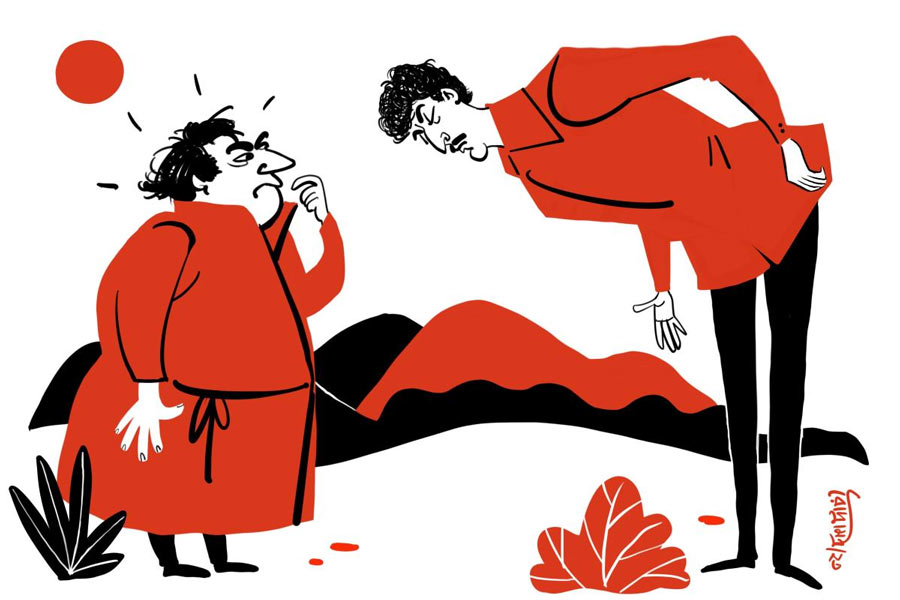

 
 <h1 align=center>কলত্র অভিহার আখ্যান</h1>
<h2 align=center>নীলাঞ্জন দাশগুপ্ত</h2> চুরি কত রকমের হয় জানিস? আমি জীবনে বহু অদ্ভুত রকমের চুরি দেখেছি। কিন্তু একটা চুরির ঘটনা সত্যি ইউনিক!” চায়ের কাপে চুমুক দিয়ে বলল শিবুদা।

একে মর্নিং কোর্ট, তার উপর নিম্নচাপ। কাজকর্ম নেই একেবারে। শহরে পর পর কয়েকটা চুরি হয়ে গেছে। সেই নিয়ে উকিল বারে বসে একটা জবরদস্ত আলোচনা চলছে। এমন সময় চা হাতে শিবুদার প্রবেশ এই এবং উক্তি। আমরা স্বতঃস্ফূর্ত হয়ে ঘিরে ধরলাম তাঁকে। শিবুদা আগে জুডিশিয়াল সার্ভিসে ছিলেন। চাকরি থেকে অবসরের পর নানা রকম সমাজসেবা করে বেড়ান। মাঝে মাঝে আমাদের উকিল বারে আসেন। কিছু ক্ষণ গল্প করেন, তার পর চলে যান। তবে সেই গল্প বলার স্টাইল আর বৈচিত্র এমন, গুঁড়ো থেকে খুড়ো, সব উকিলবাবুই গুটিগুটি পায়ে চলে আসেন গল্প শুনতে। আজও তার ব্যতিক্রম হল না। আমাদের দেখে আরও উৎসাহ নিয়ে শুরু করলেন শিবুদা—

তখন আমি কালিম্পং-এর মুন্সেফ। কোনও ম্যাজিস্ট্রেট না থাকায় সে কাজটাও করতে হত। তখনও সেটা জেলা ঘোষণা হয়নি। ছোট শহরটা এক সময় ভুটানি শাসকদের অধীনে ছিল। ওই অঞ্চলটির নাম ছিল ডালিমকোট। কালিম্পং ছিল একটি খুব ছোট গ্রামের নাম। ১৮৬৪ সালের অ্যাংলো-ভুটান যুদ্ধ এবং পরের বছর স্বাক্ষরিত সিনচুলা চুক্তির পর, তিস্তা নদীর পূর্বের সমগ্র এলাকা এবং ডুয়ার্স ব্রিটিশ ভারতে অর্পণ করা হয়। কালিম্পং সেই চুক্তির মধ্যে পড়ে। পরবর্তী সময়ে কালিম্পংকে মহকুমা করা হয় এবং সেখানে মহকুমা আদালত তৈরি হয়।

আমি জুনিয়র সিভিল জজ হয়ে জয়েন করেছি সবে। ছোট্ট পাহাড়ি শহর। পাহাড়ের বাঁকে সরকারি কোয়ার্টার্স আর অফুরন্ত অক্সিজেন। সাকুল্যে পনেরোটি কেস আমার কোর্টে। ঘুরিয়ে-ফিরিয়ে সেগুলোর দিন রাখি। দশ-বারো জন উকিলবাবু আছেন। দেরি করে কোর্টে আসেন আর কাজ শেষ করেই চলে যান। ওখানকার সব কিছুই অলস। আমিও অভ্যস্ত হয়ে পড়েছিলাম ওই জীবনে। বেলা করে ঘুম থেকে উঠি, কোর্টে যাই, যেটুকু কাজ থাকে করি। জঙ্গল পাহাড় মেঘ দেখে দিন কাটাই। নিরুপদ্রব এই জীবনে হঠাৎ আবির্ভাব হল মূর্তিমান এক আপদের। অপূর্ব প্রধান।

সে দিন সকাল আটটা। ঘুম ভাঙলেও বিছানা থেকে উঠিনি। কোয়ার্টার্সের গেটে চিৎকার শুনে উঠে দেখতে গেলাম। দেখি আমার আর্দালির সঙ্গে তাদের নিজস্ব ভাষায় জোর তর্ক জুড়েছে এক ব্যক্তি। প্রায় ছ’ফুট লম্বা। এই হাইট আর মোটা গোঁফ ছাড়া সব কিছুই পাহাড়িদের মতো। আমাকে দেখেই চুপ করে শরীরের উপরাংশ ঝুঁকিয়ে শ্রদ্ধা প্রকাশ করল। কী হয়েছে জিজ্ঞেস করায়, স্থানীয় ভাষা আর হিন্দি মিশিয়ে সে বলল, তার কিছু অভিযোগ জানানোর আছে। আমি যেহেতু সেখানকার জজসাহেব, তাই আমার কাছেই সে তা জানাতে চায়। আমি তাকে কোর্টে আসতে বললাম। তখনকার মতো সে বিদায় হল।

কোর্টে গিয়ে ভুলেই গিয়েছিলাম তার কথা। এজলাসে বসার পর দেখি, কোর্টের ঠিক উল্টো দিকে দাঁড়িয়ে আছে। কাজ শেষ হলে এজলাস পিয়নকে দিয়ে ডাকালাম। সে বলল, তার নাম অপূর্ব প্রধান। ইন্ডিয়ান নেভিতে চাকরি করে। ছোটবেলায় বাবা-মা মারা যাওয়ার পরে নিজের চেষ্টায় লেখাপড়া করে চাকরি পেয়েছে। সাত মাস আগে বিয়ে করেছিল। বিয়ের দেড় মাস পর শিপে যায় সে। তার বৌ বাড়িতেই থাকত। তখন মোবাইলের জমানা ছিল না। তাই পাড়ার পোস্ট অফিসে ফোন করে মাঝে মাঝে বৌয়ের সঙ্গে কথা বলত। কিন্তু শেষ তিন মাস কথা হয়নি। যখনই ফোন করত, পোস্টমাস্টার বাড়ি গিয়ে দেখত দরজায় চাবি। পোস্টমাস্টারের কাছে সব শুনে আর অপেক্ষা না করেই সোজা চলে এসেছে সে। আর এসেই দুঃসংবাদ। তার বৌ চুরি হয়ে গিয়েছে।

তার ছেলেবেলার বন্ধু শাওন থাকত তাদের বাড়ির পাঁচ-ছ’টা বাড়ি পরে। সেও থাকত তার বৌ-বাচ্চা নিয়ে। অপূর্ব যাওয়ার আগে শাওনকে বলে গিয়েছিল তার বৌকে একটু দেখাশোনা করতে। তা বন্ধুর কথা রাখতে একটু বেশিই দেখাশোনা করেছে সে। ফলে তার বৌ এখন শাওনের ঘর করছে। দুই বৌ নিয়ে শাওনের সংসার এখন জমজমাট। সে তার বৌকে বাড়ি ফেরার কথা বললে তার বউ হাঁকিয়ে দিয়েছে। আমাকে সব কথা বলার পর তার দাবি, একটা বৌ চুরির কেস করে দিতে হবে।

আমি তাকে বুঝিয়ে বলার চেষ্টা করলাম, তার বৌ নিজের ইচ্ছেয় গেছে। চুরির কেস হয় না। কিন্তু তাতে সে যা বলল তাতে আমি ফের হতবাক। সে আমাকে বলল, “স্যর, একটু আধটু আইন আমিও পড়েছি। না বলে পরের সম্পত্তি নিলে চুরি বলে।”

“কিন্তু আপনার স্ত্রী তো সম্পত্তি নয়। ব্যক্তি। তাঁর নিজের ইচ্ছের তো দাম আছে। আইনানুযায়ী সে অন্য কোথাও নিজের ইচ্ছেয় থাকতেই পারে।”

“এটা স্যর আপনি কী বলছেন? বিয়ের সময় বিশ হাজার টাকা দিয়েছি আমার শ্বশুরকে। শ্বশুর পুরো কাবিলার সামনে আমার হাতে বৌকে দান করেছেন। সব দায়িত্ব দিয়েছেন। তা হলে? এটা তো এক রকম হস্তান্তর। আর এই হস্তান্তর আমার বৌয়ের সম্মতিতেই হয়েছে। সেও হেসে হেসে বাপের কাছ থেকে আমার কাছে এসেছে। তা হলে বৌ আমার সম্পত্তি নয় কেন? মানুষের হস্তান্তর আপনার আইনে স্বীকৃত? তা যদি না হয়, আমার বৌয়ের শাওনের ঘর করাটা আইনে স্বীকৃত হবে কী করে?”

আমি বহু চেষ্টা করেও তাকে বোঝাতে পারলাম না। শেষে বললাম, “আমি তো বিচারক, আমি বিচার করি। আপনাকে বৌ চুরির মামলা করতে হলে থানায় যেতে হবে।”

“গিয়েছিলাম স্যর। সেখানে কিছু করেনি। ক’দিন সকাল-বিকেল ঘুরিয়ে বলল, কোর্টে মামলা করতে।”

বুঝলাম একে নিরস্ত করা ভগবানেরও অসাধ্য। তাই একটু অন্য পথ ধরলাম।

“বেশ, তা কোর্টে মামলা করতে গেলে তো এক জন উকিল লাগে। সেই ব্যবস্থা করুন।”

“আপনি অভয় দিলে সে ব্যবস্থাও করে ফেলব স্যর।”

“তাই করুন।”

মনে মনে ভাবলাম, আপাতত পাগলের হাত থেকে বাঁচা তো যাক।

সে দিনের মতো মুক্তি পেলেও ভুলেই গিয়েছিলাম আপদেরা কখনও একা আসে না। পরের দিন সকালে এজলাসে বসেছি, এক জন সিড়িঙ্গেপারা উকিলবাবু এসে হাজির। পরনে একটা রংচটা কোট আর ততোধিক নোংরা পাজামা। পি আর সেটলিং নাম তাঁর। পিছনে পিছনে মূর্তিমান প্রধান। একটা আট পাতার মহাকাব্য আমায় দিয়ে বললেন, সেটাতে একটা কেস করতে হবে। আমি সবটা পড়ে দেখলাম, সেটা নিয়ে ভাষাতাত্ত্বিক গবেষণা চলতেই পারে, কিন্তু মামলা হওয়ার কিছু মেটিরিয়াল নেই। সেটলিং সাহেব আবার তাঁর মক্কেলের উপর দিয়ে যান। শুধু বৌ চুরিতেই তাঁর মামলা আটকে নেই, বৌ ছিনতাই, গচ্ছিত সম্পত্তি লুঠ, বিশ্বাসভঙ্গ ইত্যাদি বহু কিছু দিয়ে তাঁর অভিযোগ সজ্জিত করলেও পোড়া দেশের ফৌজদারি দণ্ডবিধির কোনও ধারায় তার কোনও বিধান নেই।

সেই কথা বলতেই সেটলিং সাহেব চিড়বিড়িয়ে উঠলেন। সারাটা দিন বুঝিয়েও তাকে আমি বোঝাতে সক্ষম হলাম না, এই অভিযোগ দিয়ে কোনও ফৌজদারি মামলা রুজু করা যাবে না। সে দিনের সব কাজ সারতে অনেক দেরি হল।

কোর্ট থেকে বেরোচ্ছি, দেখি উকিলবাবু আর তার মক্কেল রাস্তার পাশে বাঁধানো বেদিতে বসে গভীর পরামর্শরত।

পরের দিন সকাল বেলা ঘুম ভাঙল আর্দালির ডাকে। এক উকিলবাবু দেখা করতে এসেছেন। আমাদের পেশাগত কারণেই আমরা উকিলবাবুদের সঙ্গে কোর্টের খাস চেম্বারে কথা বলি, কোয়ার্টার্সে সাধারণত কাউকে আসতে বলি না। তাই একটু কৌতূহল নিয়ে বসার ঘরে গিয়ে দেখি সেটলিং সাহেব। পরনে সেই কালকের ড্রেস। এ বারে সত্যি আমার বেশ বিরক্তি লাগল। দুটো কড়া কথা বলে ধমকে চমকে বিদায় করতে হবে।

হঠাৎই সেটলিং সাহেব খপ করে আমার হাত দুটো ধরে ফেললেন, “আমাকে বাঁচান স্যর!”

এ বার চমকানোর পালা আমার, “আপনার আবার কী হল?”

“ওই প্রধান, স্যর। কাল আপনার সঙ্গে কথা বলার পর ওঁকে বুঝিয়ে বলেছিলাম যে, এই ঘটনায় মামলা হবে না। সেই বিকেল থেকে অনেক রাত অবধি বুঝিয়ে বাড়ি পাঠিয়েছিলাম। আজ সকাল থেকে আবার আমার বাড়ির বাইরে বসে আছে। এ বার ভয় দেখাচ্ছে, আমি মামলা না করে দিলে আমার নাম লিখে দায় চাপিয়ে আত্মহত্যা করবে। আমার বাড়ির লোকেরা খুব ঘাবড়ে গেছে স্যর।”

“দেখুন এমনিতে কোনও মামলা হয় না। কিন্তু আমি একটা বুদ্ধি দিচ্ছি। কাল সকালে আপনি একটা মামলা ফাইল করুন। ডিক্লারেশন স্যুট। প্রধানের বৌ যে শাওনের বৌ নয়, সেই মর্মে ঘোষণার প্রতিকার চেয়ে। আমি অ্যাডমিশন পয়েন্ট অর্থাৎ মামলাটি গ্রহণ করা যাবে কি না, সেই প্রশ্নে শুনানির দিন রেখে দেব। এর পর আপনি খালি তারিখ নিয়ে যান। আমার এখান থেকে ট্রান্সফার হওয়ার পর নতুন সাহেব যদি অ্যাডমিট না করেন, তা হলে জজকোর্ট হাইকোর্ট আছেই। তত দিনে প্রধানের মামলার ইচ্ছে না থাকলে তো চুকেই গেল।”

সেটলিং সাহেব খুশিতে অদ্ভুত একটা ঘোঁত-ঘোঁত আওয়াজ করে বিদায় নিলেন।

পরের দিন যথারীতি মামলা ফাইল হল। মামলার ডেট পড়ে, উকিল আর মক্কেল কোর্টে আসেন। আবার নতুন ডেট পড়ে। তিন-চারটে ডেটের পর প্রধানকে দেখতে পেলাম না। সেটলিং সাহেবকে প্রধানের খবর জিজ্ঞেস করায় তিনি বললেন, প্রধান শিপে চলে গেছে।

তার পর আরও এক বছর পেরিয়ে গেছে। প্রধানের ঘটনা মাথা থেকে বেরিয়ে গেছে। দার্জিলিং যাচ্ছি একটা মিটিংয়ে। সুকিয়াপোখরির কাছে দাঁড়ালাম চা খাওয়ার জন্য। চা খেয়ে বেরোচ্ছি, হঠাৎ উল্টো দিক থেকে একটা এসইউভি দাঁড়াল পাশে। তাকিয়ে দেখি প্রধান। নেমেই মিলিটারি ভঙ্গিতে একটা সেলাম ঠুকল। ওকে দেখেই আমার পুরনো সব ঘটনা মনে পড়ে গেল।

“স্যর, কেমন আছেন?”

“ভাল। আপনি কবে ফিরলেন?”

“প্রায় দেড় মাস হয়ে গেছে।”

“সে কী! গত সপ্তাহেই আপনার মামলার ডেটে উকিলবাবু বললেন আপনি বাইরে আছেন।”

“আসলে আমিই আর যোগাযোগ করিনি। ঠিক করেছি, মামলাটা আর চালাব না স্যর।”

“কেন?”

“ইয়ে মানে... আমি স্যর আবার বিয়ে করে নিয়েছি। দাঁড়ান, আমার স্ত্রীকে ডাকি।”

আমাকে কিছু বলার সুযোগ না দিয়েই, “কেশাং, কেশাং...” বলে ডাকল প্রধান। অমনি গাড়ির দরজা খুলে এক জন পাহাড়ি মহিলা নেমে এল। পিছন-পিছন একটা তিন-চার বছরের বাচ্চা। প্রধান তার মাতৃভাষায় কিছু একটা বলতেই মা-বেটা ধুপধাপ প্রণাম করে নিল আমায়।

আমি মৃদু হেসে বললাম, “তা হলে রাগ গেছে?”

“সে আর না যায়। শোধবোধ হয়ে গেছে যে।”

“মানে?” এ বার আমার অবাক হবার পালা।

“মানে, আমার বৌকে চুরি করে নিয়েছিল শাওন, আর শাওনের বৌ-বাচ্চা চুরি করে নিয়েছি আমি। ব্যস। শোধবোধ!”একগাল হেসে বলল প্রধান।

আন্দাজ করতে পারলাম, পরের বৌ চুরি করে নিজের প্রথম পক্ষকে অবহেলা করেছিল ওই শাওন, তাই তার বৌ-বাচ্চাকে ফুসলে নিতে অপূর্ব প্রধানকে বিশেষ বেগ পেতে হয়নি।

“কিন্তু আমার অবাক হওয়ার আরও বাকি ছিল, বুঝলি?” আমাদের লক্ষ করে বলল শিবুদা।

সুকিয়াপোখরি থেকে বেরিয়ে বেশ কিছু ক্ষণ যাওয়ার পর আমার ড্রাইভার নরবাহাদুর হঠাৎই বলে উঠল, “ওই লোকগুলো কে সাবজি?”

“কেন? ওদের মামলা আছে আমার কোর্টে।”

“বাজে লোক স্যর। গাড়ি থেকে বৌটা যখন নামল, তখন লোকটা ওকে কী বলছিল জানেন?”

“কী বলছিল?”

“ওর বৌকে বলল, ‘এ দিকে এসো এক বার। সেই খচ্চর জজসাহেবটাকে দেখবে বলছিলে না? নেমে দেখে নাও। এক বার পেন্নাম করে প্রার্থনা করো, ব্যাটা হারামজাদার সঙ্গে যেন আর কখনও দেখা না হয়।”