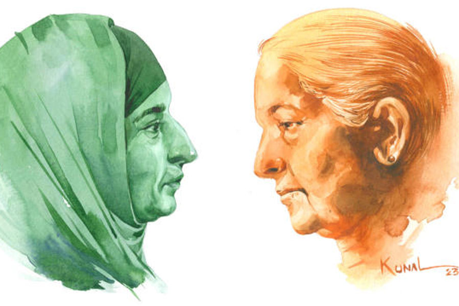

 
 <h1 align=center>কাঁটাতারের বেড়া</h1>
<h2 align=center>ভাস্বর চট্টোপাধ্যায়</h2> চিন্তন ফাইলটা সরিয়ে দেয়, বলে, “অ্যাবসার্ড!”

টেবিলের অন্য দিকে ঋষিতা, “স্যর, আমি শুধু জানতে চাই, হাউ ইজ় মাই আইডিয়া?”

“আইডিয়া ইজ় গুড…”

ঋষিতা উত্তেজিত, “ইন্ডিয়াতে আজ়াদি কা অমৃত মহোৎসব চলছে, সেখানে যদি এমন একটা টপিক… ”

“কনসেপ্ট ব্রিলিয়ান্ট, বাট...” চিন্তনের মুখে চিন্তার রেখা ফোটে।

মেকআপ রুমে আয়নার সামনে বসে টাচআপ করার সময় ঋষিতার সে দিনের কথা মনে পড়ে। লন্ডনে বেড়ে ওঠা ঋষিতা কপূরের ছোটবেলা থেকেই স্বপ্ন ছিল জার্নালিস্ট হওয়ার। সাত বছর ‘বেস্ট ব্রডকাস্ট নিউজ়’-এ সুনাম এবং প্যাশনের সঙ্গে কাজ করছে। রাত ন’টার প্রাইম টাইম স্লট ওকে দেওয়ায়, আজ সে অনেকের চক্ষুশূল। তবে তারাও আড়ালে স্বীকার করে, ওর মতো রিসার্চ করতে সবাই পারে না। নামী অঙ্কোলজিস্ট স্বামী, তিন বছরের ছেলে তিয়ান আর বেস্ট ব্রডকাস্ট— এই নিয়েই ঋষিতার ভালবাসার জগৎ।

ঋষিতা চশমা পরে নিজেকে এক বার দেখে নিয়ে মেকআপ টেবিলে রাখা গুরু নানকের ছবির সামনে চোখ বুজে কয়েক সেকেন্ড প্রার্থনা করে। তার পর ফ্লোরের দিকে হাঁটা দেয়।

সোনিয়া সিং চুপ করে বসে আছেন ঘরটায়। কিছু ক্ষণ অন্তর কেউ না কেউ এসে জানতে চাইছে, সে ঠিক আছে কি না, কিছু লাগবে কি না। তার মধ্যে একটি মেয়ে ইংরেজিতে কী সব বলে গেল, বেশির ভাগই বোঝেনি সোনিয়া। সে মিরাটের গ্রামের মেয়ে। শুধু এটুকু বুঝেছে, ক্যামেরা দেখে ঘাবড়ানোর কিছু নেই। সোনিয়া সে দিনও ঘাবড়ে যায়নি, যে দিন প্রেসিডেন্টের হাত থেকে ছেলে ভৈরব সিং-এর জন্য মরণোত্তর বীরচক্র পুরস্কার নিতে গিয়েছিল। চোখ থেকে জল বেরোয়নি, কারণ দেশের জন্য যে শহিদ, তার উদ্দেশে কাঁদতে নেই, ভৈরব বলত তাকে। মেডেল নেওয়ার আগে যখন ছেলের বীরগাথা শোনানো হচ্ছিল, তখন বুকের ভিতরটা হু-হু করে উঠেছিল। তখনই ভৈরবের গলা শুনতে পেয়েছিল সোনিয়া, ‘ডরনা মত! মুঝে দেখ, ম্যায় ডরা কেয়া?’

রেহানা নামাজ সেরে দেখে, সামনে ইভলিন।

“কিছু বলবেন?”

“আমরা রেডি।”

“এক মিনিট...” রেহানা নামাজের আসন ব্যাগে পুরে ব্যাগটা দেখিয়ে জিজ্ঞেস করে, “এটা কোথায়…”

“আপনার জন্য লকার অ্যালট করা আছে, ওখানে রেখে দিন।”

রেহানা কখনও লকার দেখেনি। তার মুঘলপুরা গ্রামের বাড়িতে লকারে রাখার মতো বিশেষ কিছু ছিল না। অল্প যা কিছু ছিল, বাড়ির আলমারিতেই থাকত। ছেলে যখন পাকিস্তান আর্মি-তে যোগ দিল, তখন রেহানা বুঝেছিল, আরও কঠিন সময়ের জন্য উপরওয়ালা তাকে প্রস্তুত করছেন। স্বামী গত হওয়ার পর ছেলে আব্বাসই ছিল তার ভরসা। পোস্টিং থেকে সে সহজে ছুটি পেত না। একা থাকার অভ্যেস করতে হয়েছিল রেহানাকে। তার পর ১৯৯৯-এর যুদ্ধে ছেলে মারা যাওয়ার পর তার ছবির দিকে তাকিয়েই সময় কেটে যেত। কখনও ঘুমে ঢুলে পড়লে ছেলের গলার শুনে ধড়মড় করে উঠে বসত, আব্বাস যেন বলত, “ইনশা আল্লাহ! এ বার জিতে ফিরব আম্মি।”

ইভলিন রেহানাকে স্টুডিয়ো ফ্লোরে নিয়ে গিয়ে ল্যাপেল পরিয়ে দেয়। রেহানা দেখে, ফ্লোরে ব্যস্ততা থাকলেও সবাই খুব আস্তে কথা বলছে। একটা বড় সাদা রঙের লম্বাটে টেবিল, তার লাগোয়া তিনটে লেদার চেয়ার আর পিছনের দেওয়ালে ইলেকট্রনিক বোর্ডে ‘বেস্ট ব্রডকাস্ট নিউজ়’ লেখাটা জ্বলজ্বল করছে। রেহানার মনে পড়ে, ঋষিতা যখন প্রথম ওকে ফোন করেছিল ও ‘না’ বলে দিয়েছিল, “আমার যা গেছে, তা গেছে, তা নিয়ে বিলাপ করে কী হবে? আমি ইংরেজি বলতেও পারি না…”

“ম্যাডাম, এটা বেস্ট ব্রডকাস্ট-এর হিন্দি ডিভিশনের জন্য।”

“তা হলে এখানেই করে নিন, বিদেশে যাব কেন? হাওয়াই জাহাজে আমি জীবনে চড়িনি…”

“আমাদের লোক থাকবে আপনার সঙ্গে, ভয়ের কিছু নেই।”

ভয়ের কিছু নেই বললেও, শুট শুরু করার আগে ঋষিতার সত্যি ভয় করছে। বুঝতে পেরে চিন্তন এগিয়ে আসে, “নার্ভাস?”

“একটু...” বলে ঋষিতা।

“রিল্যাক্স, উই আর নট গোয়িং লাইভ… রেকর্ড হচ্ছে তো।”

ঋষিতার লজ্জা করে। এত বছর ক্যামেরার সামনে বাঘা বাঘা লোকেদের ইন্টারভিউ নিয়ে আজ কফি খেয়েও তার হাত গরম হচ্ছে না, বার বার কোটে হাত ঘষছে। টক ব্যাকে থ্রি... টু... ওয়ান শুনে ঋষিতা চেয়ারে বসে, শুরু করে।

“হ্যালো অ্যান্ড ওয়েলকাম টু দ্য নাইন পিএম শো। আমার সঙ্গে আজ আছেন পাকিস্তানের মুঘলপুরা গ্রামের রেহানা সিদ্দিকি। রেহানাজির ছেলে পাক আর্মি ক্যাপ্টেন আব্বাস খান… দেশের জন্য লড়ে শহিদ হয়েছেন। রেহানাজি, আব্বাস কি ছোট থেকেই আর্মি জয়েন করবেন বলে ভেবেছিলেন?”

“ছোট থেকেই আব্বাস আর্মি ইউনিফর্ম ভালবাসত, আয়নার সামনে দাঁড়িয়ে ‘জি জনাব’ বলে স্যালুট ঠুকত। তাই বড় হয়ে যখন বলে, বাধা দিইনি।”

“এই বছর ইন্ডিয়া যেমন স্বাধীনতার ৭৫ বছর পালন করছে, তেমনই পাকিস্তান… কিন্তু এই আজ়াদি তো সহজে আসেনি। অনেক প্রাণ গেছে। এখনও দুই দেশের সেনা বর্ডারে মুখোমুখি। ক্যাপ্টেন খান যখন বাড়ি আসতেন, আপনাকে বর্ডারে থাকার স্ট্রাগলের কথা বলতেন?”

“বলত। খুব কষ্ট করত ওরা। রাতের পর রাত জেগে পাহারা দেওয়া, কখন দুশমন অ্যাটাক করবে… বাঙ্কারেই তো জীবনটা কাটিয়ে দিল আব্বাস। ভাল খাবার পেত, তাও তো নয়। বাড়ি এলে আমি রেঁধে খাওয়াতাম। কিন্তু সে আর ক’দিন। আব্বাস গল্পগুজব করার ছেলে ছিল না। বাড়ি এসে নিজের মতোই থাকত। বন্ধুরা ডাকাডাকি করলে এক দিন দেখা করত, ব্যস।”

“আপনি তো জানতেন ছেলে আর্মিতে, এক দিন যুদ্ধে যেতে হতে পারে। কার্গিল যুদ্ধের সময়…”

“কার্গিল যুদ্ধে যখন ওকে ডাকা হয়, ও তার দু’দিন আগেই বাড়ি এসেছে। এক মাসের ছুটি ছিল। কিন্তু কার্গিলে তখন অবস্থা খারাপ। তাই ওকে ডেকে নিল… ১৯৯৯ সালের ১৫ জুন ওর কাছে ফোন এল। জানেন, ১৪ জুন আমার জীবনের শেষ রাত, যে রাতে আমি শান্তিতে ঘুমিয়েছি… ফোন আসার পর প্রথমে বলেনি। দুপুরে খেয়ে উঠে আমার পায়ের কাছে বসে বলল, ‘আম্মি, আমায় যেতে হবে।’ আমি বললাম, এই তো এলি বেটা, আমি তোকে যেতে দেব না। আমার কোলে মাথা রেখে বলল, ‘তা হলে আমায় ফৌজে পাঠালে কেন?’... তার পর কী মনে হল, উঠে গিয়ে সব ক’টা চেকে সাইন করে দিল। কর্নেল নাজির-এর থেকেই সব শোনা… বারাইনলা-তে আব্বাসের পোস্টিং হয়েছিল। ওখানকার হালত একবারেই ভাল ছিল না, সবাই চিন্তিত ছিল।”

“অবস্থা ভাল ছিল না বলতে?”

“ফায়ারিং শুরু হতেই ওদের চৌকি আগে নষ্ট হয়ে যায়, কারণ ইন্ডিয়া থেকে আর্টিলারি ফায়ারিং হচ্ছিল… কী করে বাঁচাবে নিজেদের? মাথার ওপর কোনও ছাউনি নেই, উঁচু পাথর নেই যে, তার তলায় লুকোবে। তাও আব্বাস আল্লাহর কৃপায় বেঁচে যায়… ওর এক সেনা বন্ধু ছিল শের খান, ওর থেকেই শোনা… টাইগার হিল দখল করতে যাবে বলে, সারা রাত ক্যাপ্টেন আব্বাস জেগে প্ল্যান বানায়, বলে, ‘আমার সঙ্গে তারাই এসো, যাদের ফিরে যাওয়ার ইচ্ছে নেই’… বলছিল আর চিঠি লিখে লিখে ছিঁড়ে ফেলে দিচ্ছিল।”

“কী লিখছিল?”

“জানি না, তবে বলে গিয়েছিল ‘মা-কে বলে দিয়ো, আমার কোথাও কোনও লোন নেই।’”

“শের খান তো বেঁচে ফিরেছিলেন… তিনি আর কী বলেছিলেন আপনাকে?”

“শুনেছিলাম, আব্বাস দল নিয়ে ইন্ডিয়ান আর্মির দিকে এগোচ্ছিল… দু’দিক থেকেই ফায়ারিং হতে থাকে, দু’দিকের অনেক সেনা মারা যায়। এই ভাবে লড়াই করতে করতে এক সময় ইন্ডিয়ান আর্মি ঘিরে ফেলে, ‘হ্যান্ডস আপ’ বলে।”

“সারেন্ডার করেননি আব্বাস?”

“না। বলেছিল দেশের জন্য জান হাজির, ধরা দেব না। স্নাইপার থেকে প্রথমে ওর বুকে গুলি লাগে, তার পর পায়ে লাগলে ও আর দাঁড়িয়ে থাকতে পারে না... পড়ে যায়...” রেহানার গলা বুজে আসে।

ফ্লোরে থাকা সবাই চুপ, চিন্তন ইভলিনকে ইশারা করে সোনিয়াকে নিয়ে আসার জন্য।

“পাকিস্তান গভর্নমেন্ট কিন্তু আমাদের বডি দেয়নি…”

“কেন?”

“মুশারফ সাহাব বলেছিলেন ‘এ যুদ্ধ পাকিস্তান ঘোষণা করেনি, ওরা কেউ ইউনিফর্মে ছিল না, সবাই মুজাহিদ’… ইন্ডিয়া বলেছিল, ‘বডি আমাদের কাছে আছে, পাকিস্তান চাইলে ফিরিয়ে দেব।’ আমি তো মা, অনেক কান্নাকাটি করলাম, মিনিস্টারদের সঙ্গে দেখা করতে চাইলাম, লাভ হল না। আমার প্রতিবেশী বলল, ‘বেটা শহিদ হয়েছে, তাকে সম্মান করতে শেখো। চোখের জল ফেলো না।’ দুঃখ একটাই, মৃত্যুর পর আব্বাসের কবর নসিব হল না...” রেহানা ওড়না দিয়ে চোখ মোছে।

ইভলিন সোনিয়াকে নিয়ে ফ্লোরে ঢোকে, ল্যাপেল লাগিয়ে ক্যামেরার পাশ থেকে ঋষিতাকে ইশারা করে ‘রেডি’ দেখায়। ঋষিতা একটা ব্রেক নিয়ে উঠে এসে সোনিয়াকে নিয়ে এসে পাশের চেয়ারে বসায়।

“আমায় কী বলতে হবে?”

“জিনিসটা সঙ্গে এনেছেন তো?”

“হ্যাঁ।”

সোনিয়ার সাউন্ড চেক হওয়ার পর আবার শট শুরু হয়। ঋষিতা, সোনিয়া আর ভৈরবের পরিচয় দিয়ে বলে, “আজ দুই দেশ ইন্ডিয়া আর পাকিস্তান, ৭৫ বছরের স্বাধীনতা পালন করছে, সেই উপলক্ষে দুই দেশের দুই শহিদের মা আমাদের এখানে আছেন। চাইলে আমরা এঁদের মুখোমুখি বসিয়ে একটা বিতর্ক সৃষ্টি করতে পারতাম, কিন্তু তা না করে থেকে আজ এক শহিদের মায়ের শেষ ইচ্ছে পূরণ করতে চলেছি।”

ঋষিতা সোনিয়ার দিকে হাত বাড়াতে সোনিয়া হাতে ধরা একটা সাদা খাম এগিয়ে দেয়।

“সোনিয়াজির সঙ্গে যখন প্রথম আলাপ হয়, উনি এটির বিষয়ে আমায় জানান। সে দিন থেকেই আমি ভেবে এসেছি, কী করে কাজটা করা সম্ভব। আমি চ্যানেল কর্তৃপক্ষের সঙ্গে কথা বলি, ইনিশিয়ালি একটু দ্বিধা থাকলেও, পরে রাজি হয়ে যায়...” ঋষিতা সোনিয়ার দিকে তাকায়, “বাকিটা আপনি বলুন।”

সোনিয়া একটু চুপ করে থেকে বলে, “আমার ছেলেও কার্গিলের যুদ্ধে লড়াই করে ফেরেনি। ঋষিতা যখন কার্গিল যুদ্ধের ওপর ডকুমেন্টারি করার জন্য আমাদের সঙ্গে যোগাযোগ করেন, তখন জানতে পারি, পাকিস্তানের অনেক শহিদের মা-ও যুদ্ধের পরে তাঁদের ছেলেদের শেষ দেখা দেখতে পাননি।”

রেহানা মন দিয়ে শোনে।

“জানেন তো, আমরা সবাই মা, আমাদের আলাদা কোনও জাতি ধর্ম হয় না। জানি না ভৈরবের গুলিতে ওঁর ছেলে মারা গেছে, নাকি ওঁর ছেলের গুলিতে ভৈরব, তবে কোল খালি হয়েছে শুধু মায়েদেরই। ভৈরব মারা যাওয়ার পর ওর ইউনিফর্ম যখন আমাদের দেয়, পকেট থেকে এই চিঠিটা পাই। কে আমার ছেলের পকেটে চিঠি রেখেছিল জানি না, হাতের লেখাও ভৈরবের নয়। সেই চিঠিটা আমি ওঁকে দিতে চাই।”

ঋষিতা খাম থেকে একটা হলদেটে চিঠি বার করে পড়তে শুরু করে, “কার্গিল যুদ্ধে পাকিস্তান আর্মির যারা শহিদ হয়েছিলেন, তাঁদের মধ্যে এক জনের কথা বলতেই হচ্ছে। তাঁর নাম ক্যাপ্টেন আব্বাস খান। তাজ্জব হয়ে গেছিলাম তাঁর সাহস দেখে। এক মুহূর্তের জন্য হলেও মনে হয়েছিল, টাইগার হিল বেদখল হয়ে যাবে। ক্যাপ্টেন খান সেনাদল নিয়ে আমাদের গুলির পরোয়া না করে তেড়ে এসেছিলেন, আমাদের বেশ কিছু সেনাকে ঘায়েল করেছিলেন তিনি। তাই তাঁর মৃত্যুর পর সৈনিক হিসেবে সম্মান জানাতে আমরা তাঁকে ইন্ডিয়ায় কবর দিয়েছিলাম।”

“ইয়া আল্লাহ!” রেহানা দু’হাতে মুখ ঢেকে হাউহাউ করে কেঁদে ফেলে।

অনুষ্ঠানের পর চিন্তন ঋষিতাকে বলে, “ইট’স ওভার, ঋষিতা। এ বার বেরিয়ে এসো।”

“আই কান’ট… আজ দু’জনকে দেখে মনে হচ্ছিল স্যর… যুদ্ধে যাওয়ার আগে দুই মা-ই ছেলেদের আশীর্বাদ করে নিশ্চয়ই বলেছিলেন, ‘জিতে এসো।’ এক জনের জিত মানেই তো অপর জনের মৃত্যু?”

“অফ কোর্স।”

“শুধু ধর্মের নামে দেশকে ভাগ করে দিল ব্রিটিশ… আমরা ওদের দেশ থেকে তাড়িয়ে দিলাম, কিন্তু ওদের ইনজেক্ট করা বিষ শরীর থেকে বার করতে পারলাম না। হাউ স্যাড!”

“ঋষিতা, ইউ হ্যাভ ডান আ মারভেলাস জব!” ডেভিড রুমে ঢুকে ঋষিতাকে জড়িয়ে ধরে।

চিন্তন ইন্টারকমে তিন কাপ কফি অর্ডার দেয়। ডেভিড চিন্তনের পাশের চেয়ারে বসে উত্তেজিত হয়ে জিজ্ঞেস করে, “হোয়াট’স নেক্সট, ঋষিতা?”

ঋষিতা চেয়ারের পেছনে মাথা এলিয়ে দিয়ে বলে, “আ ভেরি ইন্টারেস্টিং টপিক। হাউ ব্রিটিশ প্লেড দ্য রিলিজিয়ন গেম টু ডিভাইড ইন্ডিয়া।”