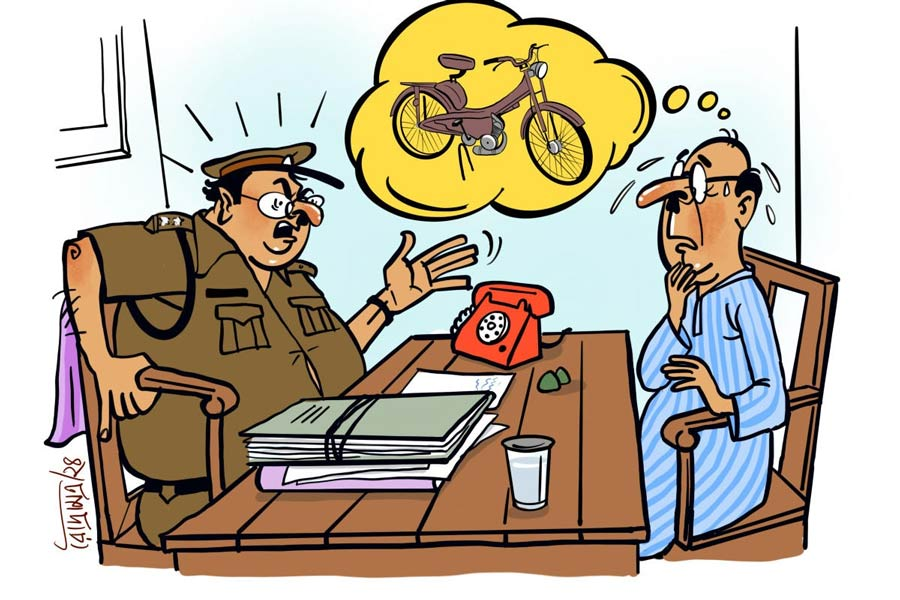

 
 <h1 align=center>কাগুজে চুরি</h1>
<h2 align=center>অধীর সিংহ</h2> 

চোখের ভুল মনে হয়েছিল প্রথমে। চোখ ভাল করে রগড়ে নিয়ে অভয় হালদার তাকিয়ে দেখলেন, সে নেই। এই কিছু ক্ষণ আগে রাস্তার ধারে স্ট্যান্ড করিয়ে চাল আর আটা আনতে বাজারে ঢুকেছিলেন। তার মধ্যে তাঁর চোখের মণি, তাঁর পক্ষিরাজ— সাধের মপেড বেমালুম গায়েব! এ দিক-ও দিক তাকিয়ে দেখলেন। নাহ্‌, নেই! যেন বাতাসে মিলিয়ে গেছে। আশপাশের দোকানে খোঁজ করলেন। কোনও লাভ হল না! কেউ খেয়াল করেনি। বাজারের ভিড়ে কে নিয়েছে কে জানে! কোন শত্তুর এটায় চোখ দিল! ভ্যানরিকশাগুলো? আগে ওদের এক জনকে দু’পিঠের ভাড়া নগদ দিয়ে মাল চড়িয়ে আনতে হত। এখন ওরা জুলজুলে চোখে তার হাওয়ায় ভেসে আসা দেখে। তা থেকেই হিংসে? সেখান থেকেই এই অন্তর্ঘাত? বুঝতে পারলেন না অভয় হালদার।

মাসের প্রথম সপ্তাহে মাসকাবারি করতে পক্ষিরাজ অভয়বাবুকে বারো-তেরো কিলোমিটার দূরের এই পাইকারি বাজারে নিয়ে আসে। ফেরত যান দু’পাশে ব্যালান্স করে ব্যাগ, বস্তা ঝুলিয়ে। মাছের আড়তদার অভয়। তাঁকে কাকভোরে ঘাটে যেতে হয়। মপেডে চেপে হুস করে পৌঁছে যান পুকুরপাড়ে। নেমন্তন্নবাড়িতে গেলে লোকেরা ঈর্ষার চোখে দেখে। গ্রামের লোকের কাছে এটা পক্ষিরাজ, বিনা আওয়াজে গ্রামের রাস্তায়ও মসৃণ ভাবে চলে।

সেকেন্ডহ্যান্ড মার্কেট থেকে অনেক দরদাম করে কেনা এই মপেড। কড়কড়ে ছ’টা পাঁচশো টাকার নোট নগদ ফেলে, বছরপাঁচেক আগে খিদিরপুর থেকে কিনেছিলেন। এক লিটার তেল ভরলে কমসে কম ষাট কিলোমিটার তো চলেই।

বাজারে অনেকে পরামর্শ দিল পুলিশে জানানোর জন্য। অগত্যা তিনি কাছের থানায় হাজির হলেন। পেটমোটা, সদ্য ভাজা আলুর চপের মতো গালের উপর পাকানো মোচওয়ালা এক পুলিশ রাস্তা আটকে জিজ্ঞেস করল, “কী দরকার?”

“রিপোর্ট লেখাব।”

“খুন, জখম, রাহাজানি না ধর্ষণ?”

“রাম রাম! এ কী সব অলুক্ষুনে কথা বলছেন?”

“খামোখা রাম রাম করছেন কেন? দাঙ্গা বাধাবার মতলব নাকি? কোন পার্টি?”

“ভুল বুঝছেন! কোনও পার্টি নয়, আমার দাঁতকপাটি লেগে যাচ্ছে! কারণ আমার মপেড চুরি হয়ে গেছে।”

“মপেড কী জিনিস? পয়সা দিয়ে কেনা? ন্যানোর মতো?”

অভয়বাবুর ঘাম বেরিয়ে গেল মপেড কী, তা বোঝাতে গিয়ে। শেষে বললেন, “এটা ঠিক সাইকেলও নয়, আবার স্কুটারও নয়।”

“তবে কী?”

“মাঝামাঝি।”

“তাই বলুন! জাল স্কুটার কিংবা জাল সাইকেল। জটিল কেস। বড়বাবু এখন নেই। ও বেলায় আসুন।”

“আমি যে অনেক দূরে... সেই দেবগ্রামে থাকি।”

“তাতে কী হল? আপনি কি দেব নাকি! তা যেখানে থাকেন, সেখানে রিপোর্ট লেখান।”

“চুরি এখানে হয়েছে, তারা রিপোর্ট নেবে কেন?”

“তা হলে অপেক্ষা করতে হবে। ওই বেঞ্চে বসুন। বড়বাবু এলে ভিতরে আসবেন।”

বড়বাবু ঘণ্টাখানেক পরে এলেন। আয়তনেও বেশ বড় বপু। পুলিশের মোটা বেল্টে সচল ভুঁড়ি কোনও রকমে ঠেকিয়ে রেখেছেন। ধপাস করে চেয়ারে বসলেন। তার পর জল, চা খেয়ে, রিমলেস চশমা গলিয়ে জিজ্ঞেস করলেন, “কী চাই?”

“আজ্ঞে আমার মপেডটা যে না হলেই নয়। ওটা চাই-ই চাই।”

“শম্ভু, এ কাকে বসিয়ে রেখেছিস? কী সব চাইছে? আমার কাছ থেকে আজ পর্যন্ত কেউ কখনও কিছু চাইতে পারেনি, জানিস?”

“আজ্ঞে, আমার মপেডটা চুরি হয়ে গেছে।”

“কোন হতচ্ছাড়া চুরি করল?”

“সেটা জানতেই আসা হুজুর।”

“হুম! সব খুলে বলুন।”

অভয়বাবু সবিস্তারে বললেন।

“হুম, কাগজপত্র সব এনেছেন?”

“কাগজপত্র? আমি বাজারে এসেছিলাম হুজুর। ফর্দ ছাড়া আর কোনও কাগজ নেই আমার সঙ্গে।”

“বাড়ি গিয়ে নিয়ে আসুন।”

“আজ্ঞে কাগজপত্র?”

“না তো কী? চোরাই মাল নাকি? মপেড কেনার রসিদ, ট্যাক্সো জমার রসিদ সব চাই। তা না হলে এই মপেডের মালিক যে আপনি, তা প্রমাণ হবে কী করে?”

“হুজুর, গেরামের ছেলেবুড়ো সবাই জানে ওই মপেড আমার। প্রত্যেক মাসে আমি এই বাজারে মাসকাবারি জিনিসপত্র কিনতে আসি। আপনি বাজারে যে কোনও দোকানদারকে জিজ্ঞেস করুন, সবাই বলবে ওটা আমার।”

“ও সব ছেঁদো কথায় আমাকে ভোলাতে পারবেন না। মুখের কথা কিছু নয়, কাগজই আধার। না থাকলে জোগাড় করুন। শম্ভু ব্যবস্থা করে দেবে। যান, বাইরে গিয়ে কথা বলুন... আমি এ সব একদম পছন্দ করি না।”

অগত্যা অভয়বাবু শম্ভুর সঙ্গে বাইরে গেলেন। শম্ভু আকাশপানে তাকিয়ে স্থির হয়ে গেল।

“দাঁড়ান, চিন্তা করতে হবে! জটিল ব্যাপার। আপনি এক কাজ করুন, ওই পানের দোকান থেকে দুটো পান নিয়ে আসুন। বলবেন, শম্ভুর চারশোবিশ জর্দা পান।”

পান গালে ভরে মিনিটপাঁচেক পরে পিক ফেলে শম্ভু বলল, “কাজ হয়ে যাবে। সামনের সপ্তাহে পাঁচ নিয়ে আসুন।”

“সামনের সপ্তাহে কেন?” এই বলে অভয়বাবু চটপট পকেট থেকে পাঁচ টাকার একটা কয়েন বের করে শম্ভুর দিকে বাড়িয়ে ধরলেন। শম্ভু কয়েন দেখে তাঁর দিকে তেড়ে গেল।

“মামদোবাজি! ইয়ার্কি নাকি! পাঁচ হাজার নিয়ে আসবেন। আরটিও আর বড়বাবুদের দিতে হবে না!”

“পাঁচ হাজার?” অভয়বাবু চোখে অন্ধকার দেখলেন। বললেন, “একটু কম হবে না?”

শম্ভু উত্তর না দিয়ে চলে গেল।

অভয়বাবু নিরাশ হয়ে মালপত্র নিয়ে ভ্যানরিকশায় চেপে বাজার থেকে ফিরলেন। জলজ্যান্ত জিনিস চলে যাওয়ায় তিনি শোকে মুহ্যমান। পাড়ার এক বিজ্ঞ ব্যক্তি পরামর্শ দিল পিকু মস্তানের সঙ্গে কথা বলতে।

পিকুর নাম শুনে অভয়বাবু থমকে গেলেন। পাড়ার বয়ে যাওয়া ছেলেদের পান্ডা। তাঁর মেয়ের কলেজের গেট পর্যন্ত ধাওয়া করত এই রাস্কেল। ভিনগাঁয়ে মেয়ের বিয়ে দিয়ে স্বস্তির নিঃশ্বাস ফেলেছেন। যাই হোক, সন্ধেবেলায় ছুঁচো গেলার মতো মুখ করে পিকু মস্তানের ডেরায় হাজির হলেন। পাড়ার কিছু চিরবখাটের সঙ্গে তখন ক্যারম খেলা চলছিল পিকুর।

“কী হল কাকু, আজ আমার কাছে? মেয়ের শ্বশুরবাড়িতে কেউ কিচাইন করেছে নাকি? কাউকে টপকাতে হলে বলবেন। আপনি চেনা কাকু। সস্তায় করে দেব।”

পিকুকে সব বলতেই সে ধমকে উঠল, “আপনার সাধের পক্ষিরাজ লোপাট হয়েছে, আগে বলতে পারেননি! সেকেন্ডহ্যান্ড মার্কেটে কেনা অনেক মাল চোরাই রাস্তায় আসে যায়। এত ক্ষণে মাল বর্ডার না টপকে যায়! আচ্ছা দেখছি... তবে খরচাপাতি লাগবে। কাল আসুন। পাঁচ কিলো খাসির মাংস আর দু’বোতল বিলাইতি নিয়ে আসবেন। আমি খোঁজ নিয়ে আপনাকে জানাব। বেশি টেনশন নেবেন না। ও পারে টপকে না গেলে, আপনার পক্ষিরাজ উড়ে উড়ে চলে আসবে।”

পরদিন একটা গোটা খাসি কাটিয়ে, দুটো হুইস্কির বোতল নিয়ে হাজির হতেই পিকুর দলবল তাকে কাঁধে তুলে নিল।

“জিয়ো গুরু জিয়ো! মাইরি বলছি, যে শালা তোমার পক্ষিরাজ হাপিস করেছে তার হাইট আমি ছ’ইঞ্চি ছেঁটে দেব। কিন্তু গুরু, কাল তুমি যাওয়ার পর বড়বাবুর চেলা শম্ভু ফোন করেছিল। বড়বাবু চান ওই পক্ষিরাজ পাওয়া গেলে আগে থানায় নিয়ে যেতে। বড়বাবু পক্ষিরাজ নিয়ে পোজ় দিয়ে ফটো খিঁচবে, কাগজে ছাপবে। বড়বাবুর পোরমোশান আটকে আছে অনেক দিন, তাই। তুমি টেনশন নিয়ো না। খপর পেয়েছি মাল এ পারেই আছে।”

কয়েক দিন পর কাগজে ছবি ছাপা হল। অভয়বাবুর মপেডের সঙ্গে বড়বাবুর। শিরোনাম— ‘অপহৃত মপেড উদ্ধার’। পুলিশ বিশেষ অভিযান চালিয়ে এই চোরাই মাল উদ্ধার করেছে। সঙ্গে চোরের মুখঢাকা ছবি। পিকু বলল, বড়বাবুর জোরাজুরিতে ওকেই চোর সেজে মুখে উল্টো মাঙ্কি ক্যাপ পরে দাঁড়াতে হয়েছিল। কিন্তু ওর লাল টি-শার্টটা দেখে নাকি ওর গার্লফ্রেন্ড চিনে ফেলেছে। ওর সঙ্গে আর কথা বলছে না, ওর ফোন ধরছে না। পিকু তো বড়বাবুর উপর চটে লাল!

পরদিন অভয় হালদার থানায় গেলেন মপেড নিতে। মপেড যখন পাওয়াই গেছে, তখন আর খামোখা পাঁচ হাজার ঢালবেন কেন! তাই খালি হাতেই এসেছেন।

থানার গেটের মুখেই শম্ভু।

“পাঁচ এনেছেন?”

হালদারবাবু মাথা নাড়লেন।

“দেখুন, বড়বাবু এ বার পোরমোশন নিয়ে শহরে চলে যাবেন। কে আসবে জানি না। তখন যদি রেট বেড়ে যায় আমায় দোষ দেবেন না যেন। চার দিকে তাকিয়ে দেখুন।”

থানার চত্বরে অনেক পুরনো দু’চাকা-চারচাকা পড়ে আছে। এদেরও কাগজ ছিল না বোধহয়, অথবা শম্ভুর টাকা দিতে পারেনি। একটা চারচাকার উইন্ডস্ক্রিন ফুঁড়ে একটি নবীন বটগাছ মাথা তুলেছে। এদের এক পাশে তাঁর পক্ষিরাজকে বেশ যুবক লাগছে।

“আপনার মপেড এখন ওদের মধ্যে জায়গা পেয়েছে। ফি বছর নিলাম ডেকে সব বিক্রি করে দেওয়া হয় কাবাড়িদের,” জানাল শম্ভু।

অভয় হালদার একটা দীর্ঘশ্বাস ফেলে ফিরে এলেন।

অভয়বাবু দশটার মধ্যে শুয়ে পড়েন। ভোর চারটেয় উঠে সাড়ে চারটের মধ্যে আড়তে গিয়ে বসতে হয়। মাঝরাতে বাড়ির বাইরে চেঁচামেচি শুনে বেরিয়ে এলেন।

বাইরে পিকু মস্তান আর তার সাঙ্গোপাঙ্গরা দাঁড়িয়ে, তাঁকে দেখে বলল, “ও কাকু, তুমি ঘুমোচ্ছ? ও দিকে তোমার পক্কিরাজ তো থানায় রাত কাটাচ্ছে।”

“আমাকে কী করতে হবে? ওই শম্ভুকে পাঁচ হাজার টাকা ঘুষ দিয়ে আমার নিজের কেনা জিনিস আমি ফেরত নেব না।”

“ঠিক ঠিক! এই তোরা সব্বাই একটা হাত্তালি দে কাকুর হিম্মতের জন্য। তা হলে এক কাজ করো। তুমি ওটা থানা থেকে গেঁড়িয়ে দাও।”

অভয়বাবু কী বলবেন, বুঝতে পারলেন না।

“কী হল কাক্কু? কথাটা খোপড়িতে ঘুসল না মনে হচ্ছে!”

“নিজের জিনিস চুরি করব?” কোনও রকমে বলেন অভয় হালদার।

“আলবাত করবে, নিজের জিনিসই চুরি করবে। কোন স্লা-র কী? তবে তার আগে কাগুজে চুরি হবে।”

“সেটা কী?” বুঝতে পারেন না অভয়বাবু।

“আরেব্বাস! তুমি খবর রাখো না? টিভি দেখো না? আজকাল কেউ বন্দুক-পিস্তল নিয়ে চুরি, ডাকাতি করে নাকি? হেরাফেরি সব কাগজে কলমে হয়। আমরা এখন এ ব্যাপারে জিনিয়াস। বড় বড় ব্যাঙ্ক লুট হচ্ছে এই সেটিং-এ। তোমার মপেডের সব কাগজ, ট্যাক্সো স-অ-ব আমি তোমার নামে করিয়ে দেব। কিন্তু তোমার খাওয়ানো ওই মাটন আর মদের দিব্যি, চুরি তোমাকে করতেই হবে। বড়বাবুর আমাকে চোর সাজিয়ে ফটো তোলা বার করে দেব একেবারে!”

খানিক ভেবে অভয়বাবু রাজি, “আমি চুরি করব।”

“তোরা সব্বাই আবার হাত্তালি দে। কাকুর বুকের পাটার জন্য।”

মাঝরাতে এই তুমুল করতালির আওয়াজে অভয় হালদারের স্ত্রী, ছেলে, বৌমা আর পাড়া-প্রতিবেশীরা যে-যার ঘর থেকে বেরিয়ে এসে ঘটনা লক্ষ করছিলেন।

পাশের বাড়ির রমাদা এ বার এগিয়ে এলেন, “হালদার! এই বয়সে তুমি চুরি করবে! তাও সবাইকে জানিয়ে? ধরা পড়লে কী হবে? ছেড়ে দাও ভাই, পুরনো জিনিস। কতই বা আর দাম ছিল!”

কিন্তু অভয়বাবু পিছু হটলেন না। পিকু মস্তানের সঙ্গে তাঁর চোখে চোখে ইশারা হয়ে গেল।

এক সপ্তাহ পর পিকু সব কাগজপত্র তৈরি করে এনে অভয়বাবুর হাতে দিল।

“এ বার আপনি নিশ্চিন্ত মনে চুরি করতে পারেন। কাগজপত্তর আপনার নামে হয়ে গেছে। একটা শুভ দিন দেখে চুরি করতে বেরিয়ে পড়ুন। তবে বেশি দেরি করবেন না। শুনছি থানার কাবাড়ি নিলাম হবে শিগগিরই।”

দেরি করলেন না অভয় হালদার। পরদিন রাত্তিরের দিকে আড়ত থেকে ফিরে, নতুন জামাকাপড় পরে, ঠাকুরপ্রণাম করে বেরিয়ে পড়লেন অভয়বাবু। পিকু সদলবলে থানার গেটের কাছে এক লিটার পেট্রল নিয়ে দাঁড়িয়ে ছিল। সাহস দিয়ে বলল, “কাকু, আপনি বুক ঠুকে এগিয়ে যান। আমরা পিছনেই আছি।”

গেটে ঢুকে এগিয়ে গেলেন অভয়বাবু। মপেড চোখে পড়ল না। একটু খুঁজতে হল। একটা টায়ারের উপর শোয়ানো। হালদারবাবু তাকিয়ে দেখলেন, না কেউ দেখছে না। মপেড নিয়ে ধীরে ধীরে গেট পেরিয়ে বাইরে আসতেই পিকুরা ট্যাঙ্কে তেল ভরে দিল। দু’-তিন বার প্যাডেলে চাপ দিতেই মপেড জেগে উঠল।

তত ক্ষণে পিকুর চেলাচামুন্ডারা আশপাশ থেকে বেরিয়ে এসে হিপ-হিপ-হুররে দিচ্ছে। পক্ষিরাজ কাগজের দৌলতে যেন হাওয়ায় উড়তে লাগল।

অভয় হালদার বীরদর্পে নিজের পক্ষিরাজ চুরি করে বেরিয়ে গেলেন।

