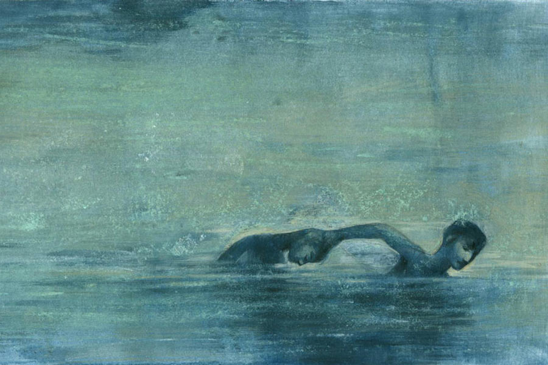

 
 <h1 align=center>কাঞ্চনদা</h1>
<h2 align=center>প্রচেত গুপ্ত</h2> 

এই গল্প সত্যি। এতটাই সত্যি যে, মনে পড়লে তীব্র ভয় পাচ্ছি। নিজেকে নিয়ে ভয়। হাত-পা ঠান্ডা হয়ে যাচ্ছে, কপালে ঘাম জমছে। নিজেকে বোঝাতে চাইছি, এটা ‌‘‌সত্যি’ নয়, এটা ‘‌গল্প’‌, ভয়ের কিছু নেই। তার পরেও ভয় কাটছে না। আমি চাই না, এই গল্প কেউ জানুক। এমনকি আপনিও নয়। তার পরেও বলছি। মনে হচ্ছে, এক জনকে বলা দরকার। দয়া করে আপনি কাউকে বলবেন না।

সে দিনটা ছিল বুধবার। অফিসে নিজের ঘরে বসে কাজ করছি। সবে লাঞ্চ ব্রেক শেষ হয়েছে। কাজের চাপ বেশি। কোনও প্রজেক্ট ফেলে রাখায় আমি বিশ্বাস করি না। মোটে চুয়াল্লিশ বছর বয়সে বড় কোম্পানির এতটা উঁচু পদে চট করে বসার সুযোগ কারও হয় না সহজে। আমার হয়েছে। গাছ থেকে পড়ে হয়নি। পরিশ্রম, বুদ্ধি, সততা দিয়ে হয়েছে। একে ধরে রাখতে চাই। শুধু অফিস নয়, মালিনীর বেলাতেও তাই। আট বছরের দাম্পত্যে আমার ফাঁকি নেই। সুন্দরী স্ত্রী তার স্বামীর কাছ থেকে যাবতীয় আদর ও আবদার মিটিয়ে নিতে পারে। সেই সুযোগ তাকে আমি দিয়েছি। ফলে অফিস যেমন আমার উপর খুশি, খুশি স্ত্রীও। আমি এক জন সফল এবং দায়িত্বশীল মানুষ। এ রকম হলে পুরুষমানুষ খানিকটা অহঙ্কারী হয়ে পড়ে। আমিও তা-ই। এতে দোষের কিছু নেই। তবে কাউকে বুঝতে দিই না।

যা-ই হোক, সে দিন কাজের মধ্যে পিওন ঘরে এসে একটা চিরকুট দিল।

“স্যর, এক জন ভিজ়িটর এসেছেন, বলছেন উনি নাকি আপনার দাদা।”‌

দাদা!‌ আমি তো বাবা-মায়ের একমাত্র সন্তান। দাদা কোথা থেকে এল!‌ বিরক্তমুখে চিরকুটে চোখ বোলাই। আমার ডাকনাম ধরে লেখা।

“‌আমি কাঞ্চনদা। দত্তপুকুরের কাঞ্চনদা। মনে পড়ছে নিশ্চয়ই। খুব বিপদে পড়ে তোর কাছে ছুটে এসেছি, এক বার কথা বলতে চাই।”‌

আমার ভুরু কুঁচকে গেল। কে কাঞ্চনদা?‌ মনে পড়ছে না। তবে ‘‌দত্তপুকুর’‌ অবশ্যই মনে পড়ছে। দশ বছর বয়স পর্যন্ত ওখানেই কাটিয়েছি। তার পর বাবা বদলি হলেন, দত্তপুকুরও জীবন থেকে চলে গেল। আর যাওয়া হয়নি। চৌত্রিশ বছর পরে সেখানকার সব লোককে মনে রাখতে হবে, এমন কারণ নেই। তবু পুরনো পাড়ার কথা যখন বলছে, তখন এক বার‌ দেখাই যাক লোকটা কে। প্রাইভেট সেক্রেটারিকে ইন্টারকমে ধরলাম।

“স্নিগ্ধ, এক জন কে এসেছে, কী বলতে চায় একটু দেখো তো। ঘরে ডাকতে হবে না, রিসেপশনে গিয়ে কথা বলো,”‌ এই পর্যন্ত বলে একটু থামলাম। ফের বললাম, “‌আর শোনো, বলবে আমি ব্যস্ত, যা বলার তোমাকে যেন বলে।”‌

দশ মিনিট পরেই স্নিগ্ধ মোবাইলে ফোন করল। নিচু গলায় আমতা আমতা করে কথা বলল, “‌স্যর, উনি টাকা চাইছেন। পরশু লাংসের কী যেন অপারেশন.‌.‌.‌ শ্বাস নিতে সমস্যা। কিছু টাকা জোগাড় করার পরও লাখখানেক কম পড়েছে। বলছেন, রোজগারপাতি কিছু নেই.‌.‌.‌ আপনি যদি কিছু দেন, পরে নাকি শোধ করে দেবে।”‌

আমি আকাশ থেকে পড়লাম। শ্বাস নিতে সমস্যা তো আমি কী করব?‌ যাকে মনেই করতে পারছি না সে আচমকা এসে, শ্বাসপ্রশ্বাসের জন্য টাকা চাইলেই হল?‌‌ কত রকম ঠগবাজে যে দুনিয়া ছেয়ে গিয়েছে!‌

নিজেকে সামলে বললাম, “কী নাম লোকটার?‌‌”‌

স্নিগ্ধ বলল, “কাঞ্চন, কাঞ্চন চক্রবর্তী, দত্তপুকুরের ঠিকানা। স্যর, সত্যি না মিথ্যে জানি না। ডাক্তারের প্রেসক্রিপশন, নার্সিংহোমের কাগজ দেখালেন। অনেক কষ্টে নাকি আপনার অফিসের খোঁজ পেয়েছেন। বলছেন, আপনি নাকি দেখলেই চিনতে পারবেন এবং কিছু ব্যবস্থা করবেনই। ফোন নম্বর চাইছেন স্যর, বাড়ির ঠিকানাও।”‌

“খবরদার! কিচ্ছু দেবে না।”‌

স্নিগ্ধ বলল, “দেব না স্যর। তবে স্যর আপনার কথা খুব কনফিডেন্টলি বলছেন।”‌

আমি বললাম, “‌ফ্রডেরা অভিনয়‌ ভাল জানে।”‌

স্নিগ্ধ বলল, “‌ঠিকই স্যর।”‌

আমি বললাম,‌ “‌কাল ফোনে তোমার সঙ্গে যোগাযোগ করতে বলো। অফিসে এসে নয়, ফোনে। তত ক্ষণে আমি একটু মনে করার চেষ্টা করি।”‌

ফের কাজে ডুব গেলাম এবং ‘‌কাঞ্চনদা’‌ বিষয়টি একেবারে ভুলে গেলাম। মনে পড়ল বাড়ি ফেরার পথে। গাড়ি তখন লেকের পাশে সিগন্যালে আটকেছে। কাঁধে ব্যাগ নিয়ে হইহই করে কয়েক জন কমবয়সি ছেলে রাস্তা পার হচ্ছে। নিশ্চয়ই সাঁতারে গিয়েছিল। লেকের পাশ দিয়ে যেতে হলে প্রায়ই এদের দেখতে পাই। খেয়াল করি না। আজ যেন কী হল,‌ মাথায় বিদ্যুৎ চমকে উঠল! এক ঝটকায় মনে পড়ে গেল, চৌত্রিশ বছর আগের সেই দিন।

মনে পড়ে গেল, সেই দিঘি। সাঁতারে পটু না হয়েও এক দুপুরে বন্ধুর পাল্লায় নেমে পড়েছিলাম জলে। তখন ঘাটে বসে বিড়ি ফুঁকছিল পাড়ার বখাটে, ফালতু কিশোর ‘‌কাঞ্চনদা’‌। বাড়ির কড়া শাসন ছিল, “এমন ছেলেদের দিকে তাকাবেও না কখনও।”‌ তাকাইওনি। পাশ কাটিয়ে গিয়ে বন্ধুর সঙ্গে জলে ঝাঁপ দিই। কী যে ভয়ঙ্কর ছেলেমানুষি করেছিলাম! মিনিট কয়েকের মধ্যে বুঝতে পারি, ডুবে যাচ্ছি। শ্বাস নিতে পারছি না। কোনও রকমে ভেসে উঠে, হাত তুলে চিৎকার করে উঠি।

‘‌‘‌কা‌ঞ্চনদা.‌.‌. বাঁচাও কা‌ঞ্চনদা.‌.‌.‌”

তখন অন্য কোনও নাম মনে আসেনি, সে কি আমার দোষ? নিশ্চয়ই জলে ঝাঁপিয়ে পড়েছিল কাঞ্চনদা, নইলে চুলের মুঠি ধরে ঘাটে টেনে তুলল কী করে?‌ উপুড় করে শুইয়ে পেটের জল বার করতে করতে বলল, “‌বাড়িতে বলিস না, খুব মার খাবি। এ এমন কিছু নয়, জীবনে অমন সবাইকে এক বার না এক বার ডুবতে হয়, আর কেউ না কেউ ঠিক বাঁচিয়ে দেয়। ভুলে যা।”‌

সেই কাঞ্চনদাই কি আজ এসেছিল?‌ তা-ই হবে। আমার কাছে আসার মতো ‘‌দত্তপুকুরের কাঞ্চনদা‌’‌ আর কে আছে?‌‌ এসি গাড়িতেও ঘাম হতে শুরু করে আমার। ঘটনাটা কেন মনে পড়ল?‌ আমি তো ভুলেই ছিলাম। মৃত্যুমুখের আতঙ্ক কে বয়ে বেড়াতে চায়? যে খুশি চাক, আমি চাই না। জীবনের সব সুখ হাতে নিয়ে আমি আদ্যোপান্ত জীবন্ত। আর মৃত্যুমুখ থেকে যদি বাঁচিয়ে আনে নিষিদ্ধ কেউ, তা হলে তো কথাই নেই। স্মৃতি দ্রুত মুছে ফেলো। এত দিন তা-ই হয়েছে। যত বড় হয়েছি, ‘‌ভাল’‌ হওয়ার তালিম নিয়েছি। লেখাপড়ায়, মার্জিত আচরণে, অফিসের প্রোমোশনে, সুশ্রী বৌয়ের আদরে নিজেকে পালিশ করেছি। সেই পালিশ দত্তপুকুরের হাবুডুবু, শ্বাসকষ্ট, বাঁচার আকুতি এবং শেষ পর্যন্ত ফালতু কাঞ্চনদার হাত ধরে বেঁচে যাওয়ার ঘটনাটিকে ধুলো-কাদার মতো সাফ করে দিয়েছে কোন কালে, তা আমিও খেয়াল করিনি। শুধু জানি, আমি চকচকে হয়েছি।‌ আজ কেন সেই ধুলো-‌কাদার কথা মনে করব?‌

কাঞ্চনদাই তো বলেছিল, “‌ভুলে যা‌।” বলেনি?‌ তা হলে কেন এখন এসেছে? বাঁচিয়ে রাখার দাম চাইতে? সে কি জানে না, আমি ওকে সাহায্য করা মানে সে দিনের সেই মৃত্যুর সম্ভাবনাকে মেনে নেওয়া?‌ সঙ্গে এটাও প্রমাণ হবে, সমাজের এক জন বাতিল মানুষ এক দিন আমাকে চুলের মুঠি ধরে না বাঁচালে আজ কোথায় আমি?‌ কোথায় আমার কেরিয়ার, কোথায় স্ত্রীর মুগ্ধতা‌, কোথায়ই বা লোকের হিংসে?‌ আমার বেঁচে থাকাই যদি একটা ফালতু লোকের জন্য হয়, আমার যাবতীয় কৃতিত্বেরও তো সে কিছুটা ভাগীদার। এ কখনও হতে দেওয়া যায়?‌

বাড়ি পৌঁছনোর আগেই সিদ্ধান্ত নেওয়া হয়ে যায় আমার।

পরদিন কাঞ্চন চক্রবর্তী নামে কেউ এক জন আমার প্রাইভেট সেক্রেটারিকে ফোন করে। সে বলে, “‌ভুল করছেন। আপনি যার কথা বলতে চাইছেন তিনি আমার স্যর নন। স্যর কোনও দিন দত্তপুকুরে থাকেননি।”‌ বলেই ফোন নামিয়ে রাখে।

তার পর আরও পনেরো দিন পেরিয়ে যায়। সে দিনও বুধবার ছিল। কাজের মধ্যেই স্নিগ্ধ ইন্টারকমে ধরল আমাকে।

“‌স্যর, এইমাত্র একটা ব্যাড নিউজ়... আমি কি আপনাকে বলব?‌”

আমি চুপ করে বসে থাকি।‌

