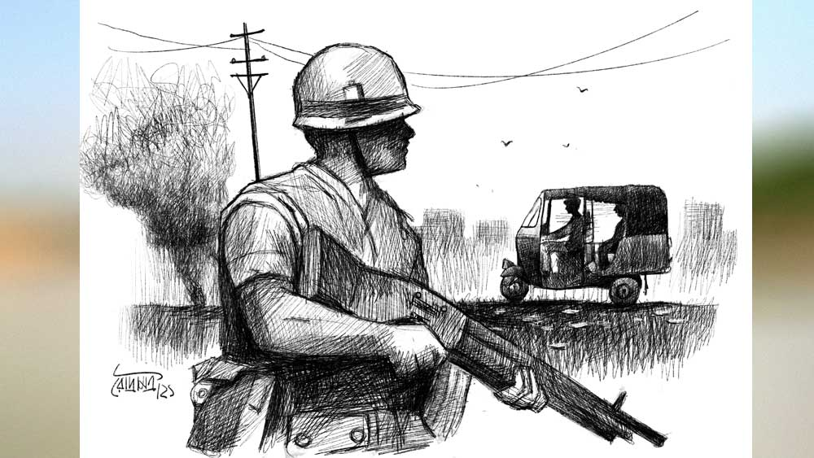

 

<h1 align=center>কালুমিয়াঁ, দয়াভাই  ও ঈশ্বরের হাত</h1>
<h2 align=center>অমিতাভ বন্দ্যোপাধ্যায়</h2>
আমদাবাদ স্টেশনে পৌঁছেই সূর্য টের পেল কিছু একটা গন্ডগোল হয়েছে। কলকাতা থেকে দিল্লি পৌঁছে একটা কাজ সেরে দ্রুতগামী ট্রেনে এসেছে। স্টেশনের পরিচিত চেহারা নয়। একটু পরেই ঘোষণা শুনল, সারা শহরে দুপুর থেকে কার্ফু চালু হয়েছে এবং স্টেশনমাস্টারের ঘর থেকে কার্ফু পাস দেওয়া হচ্ছে। সূর্যাস্ত দেরিতে হয় বলে অতটা রাত মনে হচ্ছে না, তবু আটটা বেজে গেছে। স্টেশনের চায়ের দোকান থেকে চা আর সিগারেট কিনে খুচরো পাঁচ টাকা চার আনা দিল। একটা সিগারেট ধরিয়ে ভাবল, কার্ফু পাস নিয়ে কী করবে সে, তাকে তো যেতে হবে অনেক দূর, সেই সাবরমতী পার হয়ে ভারেজ। ভারেজ থেকেও আরও তিন কিলোমিটার, নয়া ভারেজ। নতুন বসতি। সুন্দর আবাসন প্রকল্প। আয়তক্ষেত্রের মত চার দিকে সারি সারি চারতলা বাড়ি আর মাঝখানে অনেকটা ফাঁকা জায়গা। শীতকালে বিকেলে ভলিবল, রাতে ব্যাডমিন্টন খেলা হয়। সূর্য অবশ্য তার চারতলার ফ্ল্যাট থেকে দেখেই আনন্দ পায়।   স্টেশনের ভিড় কমলে সূর্য স্টেশনমাস্টারের ঘরে যায়। ফাঁকা ঘর। ভদ্রলোকের সামনে গিয়ে বলে, “আমি ভারেজ যাব।”   কাঁচাপাকা চুলের মাঝবয়সি স্টেশনমাস্টার মুখ তুলে মোটা গোঁফ নাচিয়ে বললেন, “আই ডি প্লিজ়।”   সূর্য পকেট থেকে পার্স বের করে আই ডি কার্ড টেবিলে রাখল। বছর তিরিশ পেরনো সূর্যর মুখের দিকে তাকিয়ে স্টেশনমাস্টার চেয়ার ছেড়ে উঠে দাঁড়িয়ে বললেন, “প্লিজ়, সিট ডাউন। লাইক টু হ্যাভ কফি?”   “থ্যাঙ্ক ইউ। আমার বাড়ি ফেরার তাড়া আছে। যদি কিছু একটা ব্যবস্থা করে দেন ভাল হয়।”   সূর্যকে বসিয়ে বেরিয়ে গেলেন স্টেশনমাস্টার। কিছু পরে এক পুলিশ অফিসারকে সঙ্গে নিয়ে এলেন। সূর্যর পাশের চেয়ারে অফিসার বসে বললেন, “একটু বসুন, একটা ব্যবস্থা করছি। বুঝতেই তো পারছেন কার্ফু চলছে সারা শহরে। আপনি যাবেন মুসলমান এলাকার ভেতর দিয়ে সাবরমতী পার হয়ে হিন্দু এলাকায়। পুলিশের গাড়ি দেওয়াটা রিস্কের হয়ে যাবে আপনার পক্ষে। তাই একটা অটো করে দিচ্ছি, সে-ই আপনাকে ঠিক নিয়ে যাবে। আমাদেরই লোক, কোনও ভয় নেই। সিগারেট?”   ভেতরে ভেতরে এ বার টেনশন শুরু হচ্ছে সূর্যর। অবশ্য আমদাবাদে ক’বছর থাকার সুবাদে বেশ কয়েকটা সাম্প্রদায়িক দাঙ্গা সে দেখেছে। বছরে তিন-চার বার তো হয়ই। কখনও সাবরমতীর মুসলমান অধ্যুষিত দিকে, আবার কখনও হিন্দুপ্রধান অঞ্চলে। সাবরমতী যেন দুই সম্প্রদায়ের মধ্যে এক অদৃশ্য সীমারেখা, চোখ খুলে রেখে শুধু রক্ত ধুয়ে চলেছে। কার রক্ত বুঝতে পারে না, কারণ সব রক্তেরই এক রং। অথচ এই সাবরমতীর তীরেই সেই বিখ্যাত মানুষটির আশ্রম, যাঁকে রবীন্দ্রনাথ ‘মহাত্মা’ বলেছিলেন।   প্রায় মিনিট দশেক পর একটা লোক এল। অফিসার বললেন, “আপনি এর সঙ্গে চলে যান। একদম ভয়ের কিছু নেই। গুড নাইট।”   লোকটা সূর্যর হাত থেকে ব্যাগটা নিয়ে হনহন করে এগিয়ে চলল। সূর্যও পেছনে পেছনে যেন ছুটছে। অটোর পেছনে ব্যাগটা রেখে সূর্যকে বসিয়ে স্টার্ট দিয়েই জোরে ছুটতে লাগল।   “মেরা নাম কালুমিয়াঁ। এই কালুপুরেই থাকি,” অটোচালক নিজে থেকেই কথা শুরু করল। হিন্দিতেই। সূর্যর কথা বলতে ইচ্ছে করছিল না। তার টেনশন হচ্ছে। রাস্তা ফাঁকা, শুনশান। কালুপুর রোড ধরে হু-হু করে ছুটে চলেছে অটো। জুনের দুপুরের দাবদাহ এখনও দাপিয়ে রাজত্ব করছে। গরম হাওয়া ঢুকছে অটোর মধ্যে। পুরনো বাড়ির ইট বের করা দেওয়ালে অমিতাভ বচ্চন। সবে রিলিজ় হওয়া ‘আখরি রাস্তা’ সিনেমার পোস্টারে গায়ে-মাথায় কালো চাদর জড়িয়ে বাঁ হাতে পিস্তল নিয়ে রেডি। রাস্তায় টহল দিচ্ছে আধা-মিলিটারি। স্টেনগান হাতে। মাঝে মাঝে ঘুরে যাচ্ছে তাদের গাড়ি। সারাংপুর পার করে কালুমিয়াঁ আবার শুরু করে, “কহাঁ জায়েঙ্গে সাব?”   সূর্য তার গন্তব্যের নাম করে।   “সাব, আপনি কোথা থেকে আসছেন?” প্রশ্ন করে কালু।   এ ব্যাটা তো ছাড়বার পাত্র নয়, সূর্য মনে মনে ভাবে। ব্যাটা আবার খোঁচড় নয় তো! হতেই পারে। সূর্য বলে, “কলকাতা।”   “আপনি বাঙালি? আমি বাঙালিদের খুব ভালবাসি। খুব ভাল লাগে। কত বড় বড় লোক আছে, রবীন্দ্রনাথ, নেতাজি। এদের সবার সঙ্গে গাঁধীবাবার খুব ভাব ছিল। 
আমি একটু একটু বাংলা জানি। আপনি বাংলায় আমার সঙ্গে কথা বলতে পারেন।”   কালু হয়তো ভাবল ওর হিন্দিতে কথা বলতে অসুবিধে হচ্ছে, তাই কম কথা বলছে। অম্বেডকর সার্কল ঘুরে আবার সোজা চলতে চলতে কালু প্রশ্ন করে, “কলকাতা থেকে এখানে এসেছেন চাকরি করতে?” হঠাৎ সে গান শুরু করল, গঙ্গা আয়ে কহাঁ সে, গঙ্গা যায় কহাঁ রে, লহরায়ে পানি মেঁ জ্যায়সে ধুপ ছাঁও রে... গান থামিয়ে তার পরই আবার শুরু করল, “আমি অনেক বার কাবুলিওয়ালা দেখেছি, জানেন? রবীন্দ্রনাথের গল্প আমার ভীষণ ভাল লাগে। বিমল রায় ডিরেক্টর, সলিল চৌধুরীর সুর আর হেমন্ত কুমারের গান। আহা, চোখে জল এসে যায়! বলরাজ সাহনির মতো অভিনয় আর কেউ করতে পারবে না। কী বলেন, সাব?”   “হ্যাঁ, ঠিক বলেছ। তোমার দেশ কোথায়, কালু?”   “জন্মেছি তো এখানেই। চাচারা সব কলকাতায় থাকে, খিদিরপুরে। ছোটবেলায় গেছি। আপনি আজকে না এলেই পারতেন। কাল রাতে সারাংপুরে মুসলমানেরা হিন্দুদের অ্যাটাক করেছে। আজ বদলা। শালে পলিটিসিয়ান লোগ সব জ্বালাকে রাখ  দেগা!” একটু থেমেই বলে, “বাড়িতে কেউ আছে?”   “না, একা থাকি। আজ খুব ভাল খেলা আছে, তাই ফিরে এলাম। তুমি ওয়ার্ল্ড কাপ দেখছ?”   “কোথায় দেখব সাব? আপনার বাড়িতে টিভি আছে? কালার?”   সূর্য মাথা নেড়ে হ্যাঁ বলল। এ বছরই প্রথম বিশ্বকাপ ফুটবল সম্প্রচার হচ্ছে দূরদর্শনে। মারাদোনা-জ্বরে কাঁপছে দেশ। ব্রাজ়িলভক্ত কলকাতার জনগণও অনেকে আর্জেন্টিনার নাম জপ করছে। আজ ইংল্যান্ড-আর্জেন্টিনার খেলা। দেখার জন্য মনে মনে উন্মুখ হয়ে আছে সূর্য।   অটো সাবরমতী নদী পার হয়েই একটা সরু গলির ভেতর ঢুকে দাঁড়িয়ে গেল। “আপনি বসুন, আমি আসছি” বলে একটা বস্তির ঘরে ঢুকে আবার বেরিয়ে এল এক জনকে সঙ্গে নিয়ে। লোকটাকে দেখিয়ে বলল, “এর নাম দয়াভাই, আপনাকে বাড়ি পৌঁছে দেওয়ার ভার এ বার এর। ভয়ের কিছু নেই, আমাদেরই লোক।”   সবাই বলে “আমাদের লোক”, এই ‘আমরা’ যে কারা, ভেবে পায় না সূর্য।   সূর্য ব্যাগসমেত ট্রান্সফার হয়ে গেল দয়াভাইয়ের অটোতে। উঠে ওর বাড়ির ঠিকানা বলে একটা সিগারেট ধরাল। পথে কোনও কথা নেই। দয়াভাই সূর্যর ব্যাগ নিয়ে সিঁড়ি দিয়ে ওপরে চার তলায় উঠে গেল, পেছনে সে। সূর্য তাকে ভাড়া মিটিয়ে চলে যেতে বললে সে বলে, এত রাতে তার এখান থেকে বেরনো মানা আছে, রাতে এখানেই থাকার অর্ডার আছে তার ওপর। সূর্য অবাক হয়ে গেল। তাকে ফলো করছে! আবার টিকটিকি! কথা বাড়াল না। দুর্দিনে উপকার পেলে এ সব সইতে হয়। চট করে চান সেরে দু’জনের মতো চায়ের জল চাপিয়ে টিভি চালাল। ছবি ঝিরঝির করছে। ছাদে গিয়ে অ্যান্টেনা ঠিক করে নেমে এল। তার পর চা করে দূরদর্শনে খেলা দেখা শুরু। প্রথম কোয়ার্টার ফাইনাল শুরু হয়ে গেছে, স্পেন বনাম বেলজিয়াম। খেলার ভাষ্যকারই জানাল যে, সে দিনই স্পেনের প্রধানমন্ত্রী গঞ্জালেজ দ্বিতীয় বারের জন্য নির্বাচিত হয়েছেন। বেলজিয়ামের গোলকিপার পাফ এবং মিডফিল্ডার সুলেমানের দুর্দান্ত খেলার জন্যে খেলা ১-১ ড্র এবং পরে পেনাল্টিতে ৫-৪ গোলে বেলজিয়াম জিতে যায়। খেলা শেষ হওয়ার আগেই সূর্যকে অবাক করে কালুমিয়াঁ খাবারের প্যাকেট হাতে নিয়ে ‘খেলা দেখতে এলাম’ বলে হাজির। পরের দ্বিতীয় কোয়ার্টার ফাইনাল ইংল্যান্ড বনাম আর্জেন্টিনা। সেটা শুরুর আগেই তিন জনে মিলে কালুমিয়াঁর আনা রুটি-মাংস খেয়ে নিল।   খেতে খেতেই সূর্য ওদের বোঝাচ্ছিল চার বছর আগে ফকল্যান্ড দ্বীপ নিয়ে এই দু’টো দেশের যুদ্ধের কথা। যুদ্ধে হেরো আর্জেন্টিনা যে আজ খেলায় প্রতিশোধ নিতে মরিয়া, তা তাদের শরীরের ভাষায় স্পষ্ট। মিনিট পনেরো খেলা চলার পরই দূর থেকে একটা গোলমালের আওয়াজ আসছিল এবং সেটা ক্রমেই সূর্যর আবাসনে ঢুকে এল। ওরা তিন জনেই ব্যালকনিতে একটু আড়াল নিয়ে দাঁড়াল। সব ফ্ল্যাট অন্ধকার। ‘হর হর মহাদেও’, ‘জয় বজরঙ্গবলী’ ইত্যাদি স্লোগান দিতে দিতে জনা পনেরো লোক হাতে লাঠি, তরোয়াল এ সব নিয়ে ফাঁকা জায়গাটায় হুলস্থুল বাঁধিয়ে দিল। একটা একটা করে তিনটে ফ্ল্যাটের দরজা ভাঙল। তিনটেতেই মুসলমান পরিবার থাকে, কিন্তু সে সময় ভেতরে কেউ ছিল না। ওরা ভেতরের সব জিনিস টিভি, ফ্যান, বিছানা, আসবাবপত্র যা পেয়েছে বার করে এনে মাঠে ফেলে, ভেঙে, কেরোসিন ঢেলে জ্বালিয়ে দিয়ে আবার স্লোগান দিতে দিতে চলে গেল। মিনিট কুড়ি তাণ্ডবের পর রাতটা আবার নিশ্চুপ হয়ে গেল।   ঘরে এসে খেলা দেখতে দেখতে অস্বস্তি বোধ করে সূর্য। বেশ নার্ভাস লাগছে। কালু সেটা লক্ষ করে  বলল, “ব্র্যান্ডি খাবেন সাব? সঙ্গে আছে।”   ব্র্যান্ডি খেয়ে একটু ধাতস্থ হয় সূর্য, কিন্তু কিছুতেই সে ভেবে পায় না এই দু’জন কারা? অথচ এদের বিশ্বাস করা যায়। হাফ-টাইম হয়ে গেল। ইংল্যান্ডের গোলি শিলটন দুর্দান্ত কিপিং করছে। আর্জেন্টিনার কয়েকটা তীব্র আক্রমণ বাঁচিয়েছে। দ্বিতীয় দফার খেলায় মন বসাল সূর্য। শুরুর ছ’মিনিটের মাথায় ইংল্যান্ডের স্টিভের ভুল পাসে মারাদোনার দিকে বল উঁচু হয়ে আসে। সাড়ে পাঁচ ফুটের দিয়েগো মারাদোনা তখনই বাঁ পায়ের খেলার জন্যে বিখ্যাত। গোলি শিলটন এগিয়ে এসে পাঞ্চ করে বল দূরে পাঠাতে হাত তুললে মারাদোনাও লাফিয়ে ওঠে, সেই সঙ্গে তার বাঁ হাতও ওপরে ওঠে। বল মারাদোনার হাতে লেগে গোলে ঢুকে যায় এবং রেফারি গোলের বাঁশি বাজিয়ে দেয়।   “গোল!” বলে সূর্য চেঁচিয়ে ওঠে। মাঠে ইংল্যান্ডের খেলোয়াড়দের প্রতিবাদ হলে টিউনিসিয়ার রেফারি আলি বিন নাসির জানায় হাতে লেগে বল গোলে ঢুকে যাওয়া সে দেখতে পায়নি, তাই গোলও বজায় থাকল। মাঠে তখন উত্তেজনার সলতে পাকানো চলছে। মারাদোনা আকাশের দিকে ঘুসি তুলছে বার বার। গোলের পর সেন্টারে বল গড়ানো শুরুর চার মিনিট পর প্রায় মাঝমাঠে মারাদোনার পায়ে বল। বাঁ পায়ে বল নিয়ে তীব্র গতিতে মারাদোনা দৌড় শুরু করল এবং একের পর এক পাঁচ জন ইংল্যান্ডের খেলোয়াড়কে কাটিয়ে ষাট মিটার দৌড়ে এসে তীব্র গতিতে বলকে গোলে ঢুকিয়ে দিল।   “গো-ও-ও-ও-ল!” এ বার সূর্যর সঙ্গে কালুমিয়াঁ, দয়াভাইও আনন্দে চেঁচিয়ে ওঠে।   ফুটবলের ইতিহাসে এত সুন্দর গোল আগে হয়নি, চোখে মাদকতা লেগে যায়, বলতে বলতে ভাষ্যকার কেঁদে ফেলল। “এই গোল দিয়ে মারাদোনা ইংল্যান্ডের যুদ্ধ জেতার প্রতিশোধ নিল,” বলে সঙ্গে সঙ্গে মন্তব্য করল কালু। গ্যালারিতে তখন মেক্সিকোর বিখ্যাত ঢেউয়ে উত্তাল। আর্জেন্টিনা দু’গোলে এগিয়ে থেকে খেলা শুরু করল। বাকি সময়ে ইংল্যান্ড বেশি কিছু আর করতে পারেনি, শুধু গ্যারি লিনেকারের একমাত্র গোলটি দেওয়া ছাড়া। আর্জেন্টিনা ২-১ ফলাফলে ম্যাচ জিতে সেমিফাইনালে উঠে গেল। খেলা শুরু হয়েছিল ভারতীয় সময়ে ২২ জুন ১৯৮৬, আর শেষ হল পরের দিন, মানে ২৩ তারিখ পড়ার পর।   খেলা শেষ হলে তিন জনেই উঠে দাঁড়ায়। দয়াভাই সূর্যকে বলে, “কয়েকমাস আগে আপনি একটা মুসলমান পরিবারকে বাঁচিয়েছিলেন, সেই খবর ওদের কাছে আছে। আজ আপনার ওপর হামলা হওয়ার খবর ছিল, তাই...”   সূর্য অবাক হয়ে ওদের দিকে তাকিয়ে থাকে। কালুমিয়াঁ হেসে বলে, “সাব, ইয়ে রাত ইয়াদ রহেগা মারাদোনাকে লিয়ে, আপকো ভি। হামলোগ তব চলতে হ্যায়। আব আপ আরাম সে শো যাইয়ে। অউর কুছ নেহি হোগা। শায়দ উনলোগোঁ কো ভি খবর মিল গ্যয়া কে আপ আন্ডার প্রোটেকশন হ্যায়। ফির হামারা ভি ডিউটি খতম!”   কালুমিয়াঁ দয়াভাইকে সঙ্গে নিয়ে চলে গেল।   ব্যালকনিতে দাঁড়িয়ে রাতের নিস্তব্ধতা চিরে দু’টো অটোরিকশা অন্ধকারে মিলিয়ে গেল। সিগারেটের ধোঁয়া ছাড়তে ছাড়তে আকাশে তারাদের দিকে তাকিয়ে সূর্য ভাবছিল, মারাদোনার ওই বিতর্কিত গোলে যেমন আর্জেন্টিনা প্রাণ পেল, তেমন আকস্মিক ভাবেই যেন ওরও বিপদ কাটল। ঈশ্বরের হাত যে কখন কী ভাবে কাকে রক্ষা করে...         