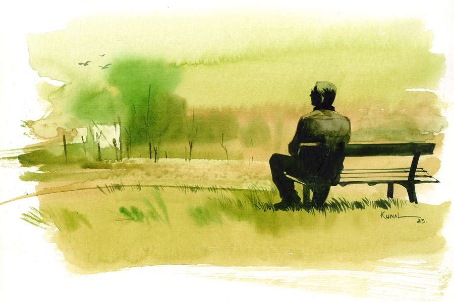

 
 <h1 align=center>কুন্তলার মা-বাবা</h1>
<h2 align=center>সুকান্ত গঙ্গোপাধ্যায়</h2> অনুভূতি অনেকটা যেন ঘুম থেকে জেগে ওঠার মতো। অথচ অনাদিরঞ্জন দে বিছানার বদলে নিজেকে আবিষ্কার করলেন একটা মাঠে, দাঁড়িয়ে থাকা অবস্থায়। মাঠ না বলে পার্ক বলাই ভাল। দোলনা, স্লিপ, ঢেঁকি সবই আছে। মাঝের ফাঁকা জায়গায় ফুটবল খেলছে কিছু বাচ্চা ছেলে। এই পার্কে জীবনে কখনও আসেননি অনাদিবাবু, হঠাৎ কী ভাবে এসে পড়লেন?

মাথা কাজ করছে না অনাদিবাবুর। ভীষণ অবাক হয়েছেন। অতি দ্রুত এই মুহূর্তের আগুপিছু ভাবার চেষ্টা করলেন। একদম ফাঁকা, কিচ্ছু মনে পড়ছে না। তা হলে কি তাঁর স্মৃতিভ্রংশ হল? যে রোগটাকে তিনি সব চেয়ে বেশি ভয় পান! কেন সব চেয়ে বেশি ভয় পান, মনে করতে পারছেন না। কোনও ঘনিষ্ঠ বন্ধু বা আত্মীয়কে এই রোগে কষ্ট পেতে দেখেছেন? কই, তেমন কাউকে মনে পড়ছে না তো! হৃৎপিণ্ডটা বেতালে লাফাতে শুরু করল। অনাদিবাবুর মনে হল, ‘আমি আমার নামটা মনে করতে পারব তো?’ এবং পারলেন না। খুবই ভেঙে পড়লেন অনাদিবাবু। হাঁটুতে জোর পাচ্ছেন না। মাঠের চার পাশে চোখ বুলিয়ে একটা ফাঁকা বসার জায়গা খুঁজে পেলেন। বাঁধানো বেঞ্চটা লক্ষ্য করে হেঁটে চললেন মাঠের ধারে।

সিটে গিয়ে বসলেন অনাদিবাবু। গলা শুকিয়ে গেছে। আশপাশে একটাও জলের কল দেখা যাচ্ছে না। মাঠের অন্য বেঞ্চগুলোয় মহিলারা বসে আছেন, বাচ্চাদের খেলাতে নিয়ে এসেছেন। সঙ্গে নিশ্চয়ই জল আছে। কিন্তু উঠে গিয়ে জল চাইতে কেমন যেন বাধছে অনাদিবাবুর।

বিকেল নিভে আসছে। পড়ন্ত আলোর দিকে তাকিয়ে বসে আছেন অনাদি। ভাবছেন, এ তো আশ্চর্য নিষ্ঠুর রোগ! কোনও লক্ষণ দেখা দিল না আগে! তা হলে অন্তত সাবধান হতে পারতেন।

একগাল হাসি নিয়ে একটি বয়স্ক লোক এগিয়ে আসছে অনাদিবাবুর দিকে। বোঝাই যাচ্ছে অনাদিবাবুকে চেনে। লোকটি সামনে এসে বলল, “কী ব্যাপার অনাদিবাবু, আপনাকে তো পার্কে বড় একটা দেখা যায় না!”

একটু স্বস্তি পেলেন অনাদিবাবু। অর্ধেক নাম তো উদ্ধার হল। তাতে যে খুব সুবিধে হল তা নয়, সারনেমটা মনে পড়ছে না। নামটাকেও মনে হচ্ছে না খুব একটা আপন। ভদ্রলোক সিটটায় বসতে আসছে, সরে বসেন অনাদি। লোকটার সঙ্গে কী ভাবে কথা চালাবেন ভাবছেন।

লোকটি বলে উঠল, “আমি কিন্তু আপনাদের এই পার্কটার আকর্ষণেই এ পাড়ায় জমি কিনে বাড়ি করি। দিব্যি কাটছে আমার অবসরজীবন। শুনেছি আপনারা নাকি যুবক বয়সে এই জায়গাটা মালিকের থেকে আদায় করে পার্ক তৈরি করেন। তখন খুব ছোটাছুটি করতে হয়েছিল আপনাদের।”

লোকটি অনেক কিছুই বলছে। সেই সূত্র ধরে কিছুই যে মনে পড়ছে না অনাদিবাবুর। লোকটার কথা অনুযায়ী এই পাড়াটিতেই তাঁর বসবাস, অথচ এখনও পার্কটাকে চিনতে পারলেন না। ফের লোকটি বলে ওঠে, “কোনও কারণে কি মনখারাপ আপনার? মুখটা শুকনো লাগছে! বৌদির সঙ্গে কি কোনও মনোমালিন্য?”

চুপ করে থাকেন অনাদিবাবু। লোকটির কথামতো তিনি বিবাহিত। মনে না পড়া বৌয়ের জন্য এক ধরনের অপরাধ-মিশ্রিত মন খারাপ হতে থাকে। কিন্তু কত ক্ষণ এ ভাবে চুপ করে থাকবেন? পাশের লোকটিকে খুব তাড়াতাড়ি নিজের অবস্থার কথা বলতে হবে। লোকটি তাঁর সম্বন্ধে সব কিছু জানে, সহজে বাড়ি পৌঁছে দেবে। লোকটি চলে গেলে অনাদিবাবু কার কাছে গিয়ে বলবেন, বাড়ি পৌঁছে দিতে? এ দিকে অন্য একটা সমস্যাও আছে, লোকটি আপাতত অনাদিবাবুকে সাহায্য করলেও, এ ঘটনার কথা পাড়ার দু’-এক জনকে বলবেই। ছড়িয়ে যাবে মুখরোচক গল্পটি। অনাদিবাবুকে নিয়ে আলোচনা চলবে পাড়ায়, বাড়িতে। স্মৃতিভ্রংশ রোগটা যে ভারী লজ্জার। এত দিনের আপনজনদের, এমনকি নিজেকেও ভুলে গিয়ে একটা সঙ্কোচগ্রস্ত নিরুপায় অবস্থা।

“সংসার নিয়ে ঝামেলা বেশি সেন্টিমেন্টে নেবেন না। ও থাকবেই। ওই কারণেই দেখুন না, আমি বাড়িতে বেশি ক্ষণ সময় দিই না। এলাকার নানা জায়গায় এক-দু’ঘণ্টা ধরে আড্ডা মেরে বেড়াই। বলে লোকটি বুকপকেট থেকে সিগারেটের প্যাকেট বার করে। ফের অনাদিবাবুকে বলে, “আপনি বোধহয় স্মোক করেন না। কখনও তো দেখিনি।”

প্রশ্নটা অতি সহজ। কিন্তু এই মুহূর্তে অনাদিবাবুর পক্ষে উত্তর দেওয়া ভীষণ কঠিন। তিনি স্মোক করেন, না কি করেন না। অথবা কম করেন, কিছুই মনে পড়ছে না। নাঃ, লোকটির কাছে অসহায়তার কথা স্বীকার করে নেওয়াই ভাল, নয়তো কথায় কথায় ধরা উনি পড়েই যাবেন।

অনাদিবাবু তাঁর অবস্থার কথা বলতে যাবেন লোকটিকে, দেখেন শেষ বিকেলের ঘোলাটে আলো ভেদ করে একটি মেয়ে খেলার সঙ্গীদের ছেড়ে এগিয়ে আসছে। মেয়েটা দু’বিনুনি আর ফ্রক পরা। আরও খানিকটা এগিয়ে আসতে অনাদিবাবু চিনতে পারলেন তাঁর মেয়ে কুন্তলাকে। বেশ খানিকটা স্বস্তি বোধ করলেও একটা খটকা লাগল তাঁর। কুন্তলা সামনে একটু এসে রাগী গলায় জানতে চাইল, “এত তাড়াতাড়ি নিতে চলে এলে কেন? মা আরও অনেক পরে আসে। রবিবার সবাই  বেশি ক্ষণ খেলে। তোমার জন্য আমার খেলা কম হয়।”

“ঠিক আছে মা, তুই খেল, আমি ওয়েট করছি।”

কুন্তলা ঘুরে গিয়ে হাঁটা দিল। অনাদিবাবু ঘাড় ঘুরিয়ে দেখলেন তাঁর পাশে বসা লোকটি ভ্যানিশ! গেল কোথায়? আচ্ছা, তিনি শুধু রবিবার আসেন কেন মেয়েকে নিতে? অফিসে ছুটি থাকে বলে? তিনি কি এখনও চাকরি করেন?

অনাদিবাবুর পাশ থেকে উঠে যাওয়া লোকটির নাম চিন্ময় সামন্ত। অনাদিবাবুকে শূন্যের সঙ্গে কথা বলতে দেখে ঘাবড়ে গেছেন। পা চালিয়ে চলেছেন মাঠের বাইরে। বুঝতে পারছেন অনাদিবাবুর বড় কিছু একটা হয়েছে। পাড়ার লোকের সঙ্গে আলোচনা করতে হবে।

পার্কের পাশের রাস্তায় আলো জ্বলে উঠেছে। ল্যাম্পপোস্টের আলো এসে পড়েছে অনাদিবাবুর উপর। সন্ধে তো নেমে গেল। এখনও কুন্তলা ফিরছে না তো! এ দিকে অনাদিবাবুর মনের খটকাটা কাটল না এখনও। ল্যাম্পপোস্টের আলোয় নিজের হাত দুটো ঘুরিয়ে ফিরিয়ে দেখছেন অনাদিবাবু, শিথিল চামড়ার নিস্তেজ হাত। এই হাতের অধিকারীর এ রকম ফ্রক পরা কন্যাসন্তান মোটেই স্বাভাবিক নয়, এমনকি চাকরিতে বহাল থাকারও কথা নয়। খানিক আগে পাশে বসা লোকটি অনাদিবাবুর কাছাকাছি বয়সি অথবা একটু ছোটই হবে। সে যখন বলছে রিটায়ার করে গেছে, তার মানে অনাদিবাবুরও বয়স ষাটের উপর। তাঁর কী করে স্কুলে পড়ার বয়সি কন্যা থাকা সম্ভব? অথচ মেয়েটি তাঁরই। কুন্তলাকে চিনতে ভুল হয়নি অনাদিবাবুর। ভুলটা তা হলে কোথায় হচ্ছে?

আরও একটু সময় বয়ে গেল। পার্কে পুরোপুরি সন্ধে নেমে এসেছে। গাছগুলোয় ফিরে এসেছে পাখির দল। মাঠ এখন বেশ ফাঁকা। ফিরে গেছে বাচ্চা ও তাদের মায়েরা। মাঠের হইচই এখন গাছে গাছে। কুন্তলা কেন ফিরছে না? ও না ফিরলে বাড়ি পৌঁছোতে পারবেন না অনাদিবাবু। বাড়ির রাস্তা ভুলে গেছেন তিনি। বাড়িটাও।

“কী হল, আর কত ক্ষণ বসে থাকবে?”

অনাদিবাবুর ডান পাশ থেকে কুন্তলার গলা। কখন এসে দাঁড়াল, কে জানে! ঘাড় ঘোরাতেই চমকে উঠলেন অনাদিবাবু, এ তো অন্য কুন্তলা! বছর বাইশ বয়স, পরনে সালোয়ার-কামিজ, চোখে চশমা। কাঁধে কাপড়ের ঝোলা ব্যাগ। এই পোশাকে গানের টিউশনে যায় কুন্তলা। কিন্তু আগের কুন্তলা গেল কোথায়?

ফের এই কুন্তলা বলে, “বাড়ি চলো। মা চিন্তা করছে।”

মুখ ফিরিয়ে নেন অনাদিবাবু। বোঝার চেষ্টা করেন এখন যেটা ঘটছে, বাস্তব কি না। মেয়ে আবার বলে, “আমি জানি তুমি কেন বসে আছো। বিজনদার সঙ্গে ফিরছি কি না, লক্ষ রাখছ লুকিয়ে।”

থামল কুন্তলা। অনাদিবাবু গভীর ভাবে বিজনকে মনে করার চেষ্টা করছেন। কিছুতেই মনে পড়ছে না। কুন্তলা বলে ওঠে, “চিন্তা কোরো না বাবা, বিজনদা আর আমার সঙ্গে দেখা করবে না। তুমি ওকে যে ভাবে অপমান করেছ, তাতে আমাদের রিলেশন একেবারেই ছিঁড়ে গেছে।”

এ বার বিজনকে মনে করতে পারলেন অনাদিবাবু। ছেলেটি বেকার। নানা বেসরকারি সংগঠনের সঙ্গে যুক্ত। আর্থিক অবস্থা একেবারেই সুবিধের নয়। কুন্তলার সঙ্গে ছেলেটির সম্পর্কের কথা বার বার কানে আসছিল অনাদিবাবুর। দু’বার ওদের গল্প করতে দেখেন কলেজের গায়ে চায়ের দোকানে। এর পরই তিনি কুন্তলাকে দিয়ে বিজনকে বাড়িতে ডেকে পাঠান।

বাড়ির বাইরের ঘরটা এখন মনে করতে পারছেন। সেই ঘরে দাঁড়িয়ে বিজনকে তিনি অনেক অপমানজনক কথা বলেন। কিন্তু কেন যেন মনে হচ্ছে ঘটনাটা অনেক পুরনো। মাঝে অনেক কিছু ঘটে গেছে। কী ঘটেছে, তার কোনও স্মৃতিই নেই অনাদিবাবুর। কুন্তলাকে জিজ্ঞেস করলেও কিছু জানা যাবে না। কারণ ও এসেছেসেই আগের সময় থেকে, যখন বিজনকে বাড়িতে ডেকে অপমান করেছিলেন অনাদিবাবু। অনেকটা যেন টাইম ট্রাভেল।

আপাতত অনাদিবাবুকে বাড়ি ফিরতে হবে। তা হলে যদি স্মৃতি ফেরে। বাড়ির রাস্তা একেবারেই মনে পড়ছে না। অতীত থেকে আসা কুন্তলার সাহায্য নিতে হবে। সিমেন্টের বেঞ্চ থেকে নেমে দাঁড়ালেন অনাদিবাবু। কুন্তলার উদ্দেশে বললেন, “চল, বাড়ি যাই।”

কুন্তলা ঘুরে গিয়ে হাঁটতে থাকে। অনুসরণ করেন অনাদিবাবু। পার্ক থেকে বেরিয়ে রাস্তায় পা রাখতেই ঝপ করে ঘোর কেটে যায়। স্বাভাবিক কারণেই সামনে থেকে উধাও হয়ে যায় পুরনো সময়ের কুন্তলা। সব কিছু মনে পড়ে যায় অনাদিবাবুর। ওজনদার একটা ভয় ফের চেপে বসে কাঁধে। এই ভয়টা নিয়েই বাড়ি থেকে বেরিয়েছিলেন তিনি। খুব বেশি দূর যেতে পারেননি। পার্কের কাছে এসে মাথা গোলমাল হয়েছিল। বোঝাই গেল যেখানে যাওয়ার কথা ছিল, সেখানে তিনি একা যেতে পারেননি।

স্ট্রিট ল্যাম্পের লালচে আলো পড়ে থাকা রাস্তা ধরে ধীরে ধীরে বাড়ির গেটে এসে পৌঁছেিছলেন অনাদিবাবু। বেরিয়েছিলেন দিনের আলো থাকতে। বেল বাজানোর পর দরজা খুললেন ঊষা। অনাদিবাবুর স্ত্রী। জিজ্ঞেস করলেন, “কেমন আছেন হরেনদা?”

কোনও উত্তর না দিয়ে ঘরে ঢুকে চটি ছাড়লেন অনাদিবাবু। তার পর সোজা গিয়ে বসলেন ডাইনিং স্পেসের চেয়ারে। অন্য সময় হলে অবশ্যই বাথরুমে গিয়ে বাইরের মুখ-হাত-পা ধুতেন।

কর্তার আচরণে বেশ অবাক ঊষা। পায়ে পায়ে এগিয়ে এসে খানিক আশঙ্কার কণ্ঠে অনাদিবাবুকে জিজ্ঞেস করলেন, “অবস্থা কি ভাল নয়? কেমন দেখে এলে?”

“হরেনদার কিছু হয়নি। তোমায় মিথ্যে বলেছিলাম...” থমথমে গলায় বলে উঠলেন অনাদিবাবু।

ঊষাদেবী ভারী বিস্ময়ে জানতে চান, “কেন, মিথ্যে বলার দরকার পড়ল কেন?”

“বাড়ি থেকে বেরোনোর আগে যে ফোনটা এসেছিল, সেটা হরেনবাবুর বাড়ি থেকে নয়। কুন্তলার শ্বশুর ফোন করেছিল। বলল, ‘ইমিডিয়েট আমাদের বাড়ি চলে আসুন।  আপনার মেয়ে প্রচণ্ড অসুস্থ হয়ে পড়েছে।’ আমি জিজ্ঞেস করলাম, হঠাৎ কী হল ওর। তারকবাবু বললেন, ‘হঠাৎ নয়, রোগ লুকিয়ে বিয়ে দিলে এমনই হয়। যাই হোক, দেরি করবেন না। তাড়াতাড়ি চলে আসুন। পরে যেন আবার শুনতে না হয় যে, আমরা সময়মতো খবর দিইনি।’”

থামলেন অনাদিবাবু। মাথা নামিয়ে নিয়েছেন। শরীরটা বুঝি একটু একটু কাঁপছে।

ঊষা কিছু ক্ষণ চুপ থেকে বিস্ময়ের গলায় বললেন, “আমরা আবার কী রোগ লুকোলাম! মেয়ে তো আমাদের যথেষ্ট সুস্থ। ওরা আর কত দোষ দেবে আমাদের!”

কথাগুলো আসলে নিজেকেই বলল ঊষা, তাই কোনও উত্তর দিলেন না অনাদিবাবু। ঘরের দেওয়ালে তাঁর আর ঊষার মাঝে কিশোরী কুন্তলার ফোটোর দিকে তাকিয়ে রইলেন। মেয়েটা কী মিষ্টি হাসছে! ফের ঊষা বলে, “তোমারও বলিহারি বাবা! এ রকম একটা ফোন পেয়ে একা একা মেয়ের শ্বশুরবাড়ি যাচ্ছিলে! দাঁড়াও আমি এক্ষুনি তৈরি হয়ে নিচ্ছি। এক সঙ্গে যাব।”

পাড়ার রাস্তা ধরে দু’জনে জি টি রোডে এসে পৌঁছেিছলেন। এখান থেকে বাস বা অটো-টোটো ধরে কুন্তলার শ্বশুরবাড়ি যেতে হবে। বাড়ি থেকে আসার পথে স্বামী-স্ত্রী একে অপরের সঙ্গে একটাও কথা বলেননি। গাড়ির অপেক্ষায় স্টপে দাঁড়িয়ে ঊষা বড় একটা শ্বাস ফেলে বলে ওঠেন, “এ বার মেয়েটাকে বরাবরের জন্য বাড়ি নিয়ে আসব। আর বলব না মানিয়ে নিতে। যথেষ্ট হয়েছে।”

চোখ জলে ভরে উঠল অনাদিবাবুর। বুঝতে পারছেন ঊষা আসলে প্রাণপণে সান্ত্বনা দিচ্ছে নিজেকে। মেয়ের শ্বশুরবাড়ি থেকে আসা সংবাদটার মানে না বোঝার মতো বোকা সে নয়। অনাদিবাবু জল মোছেন চোখের। দু’জনের সামনে একটা অটো এসে দাঁড়ায়।