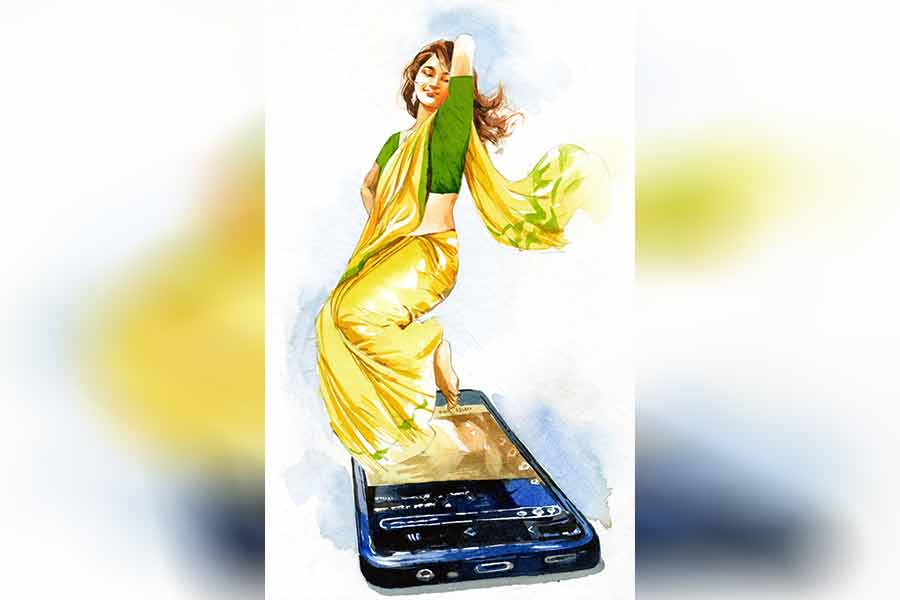

 
 <h1 align=center>কুরূপা</h1>
<h2 align=center>অভিনন্দন সরকার</h2> 

সবুজ মণ্ডলের বুক ধড়ফড় করছে। ঠান্ডা হয়ে আসছে হাত-পা। এই ডিসেম্বর মাসেও তার কপালে বিন্দু-বিন্দু ঘাম।

কলেজ মাঠের প্রকাণ্ড অশ্বত্থ গাছের নীচে বসে সবুজ ডানে-বাঁয়ে তাকাল। তার তাকানোর মধ্যে কেমন একটা চোর-চোর ভাব।

নিজেকে মনে মনে কষে ধমক দিল সে। সত্যিই তো আর সে চুরি করছে না। যা করতে চলেছে, সেটাকে কোনও দিক থেকে গর্হিত অপরাধও বলা চলে না। তবে মিছিমিছি ঘেমে-নেয়ে একশা হচ্ছে কেন সে?

মনের সমস্ত জোর এক করে ফোনের পর্দায় ফুটে ওঠা কি-প্যাডে আঙুল ছোঁয়াল সবুজ।

পুরনো এই স্মার্টফোনের স্ক্রিনের মতোই ফুটিফাটা জীবন সবুজের। না ছিল তার লেখাপড়ায় মাথা, না আছে গায়ে-গতরে খেটে পয়সা উপায় করার মুরোদ। অভাবের সংসারে জন্ম, তার উপরে জ্ঞান হওয়ার আগেই মাথার উপর থেকে বাবার ছায়া গায়েব।

দু’বারের চেষ্টায় মাধ্যমিক পাশ করতে না পেরে পড়াশোনায় ইতি টেনেছিল সবুজ। তার পর সাত ঘাটের জল খাওয়ার পরে শেষমেশ লোকাল কাউন্সিলারের হাতে-পায়ে ধরে মিউনিসিপ্যালিটির জঞ্জাল তোলার কাজটা জুটিয়েছে।

উপরি উপার্জনও কিছু হয়ে যায় মাঝে মাঝে। এলাকার কয়েকটা ফ্ল্যাটের বাথরুম পরিষ্কার করে দেয় সবুজ, রোববার করে বাবুদের দু’-তিনটে গাড়ি ধুয়েমুছে সাফ করে দেয়। সব মিলিয়ে এক রকম চলে যাচ্ছে সবুজের। একা মানুষ, শখ-আহ্লাদেরও বালাই নেই। একগাদা টাকা উপার্জন করেই বা কী করত সবুজ?

যে থাকলে পৃথিবীটা অনেকটা সুন্দর হত, সে নিজেই তো সেই কবে সবুজের হাত ছেড়ে চলে গেছে।

মিউনিসিপ্যালিটির গাড়ি নিয়ে সকালের দিকে পাড়ায় পাড়ায় ময়লা তুলতে বেরোয় সবুজ। সেই নীল ভ্যানগাড়ির পিছনে সাদা কালি দিয়ে গোটা গোটা করে লেখা আছে: ‘সুখ স্বপনে, শান্তি শ্মশানে’।

শ্মশানে শান্তি আছে কি না তা সবুজের জানা নেই, তবে স্বপ্ন দেখে যে সুখ সে পায়, তার তুলনা আর কোথাও নেই।

স্বপ্ন বিষয়ে সবুজের একটা বিশেষ ক্ষমতা আছে। চাইলেই নিজের মনমতো স্বপ্ন দেখতে পারে সে। কথাটা সামান্য ভুল হল। যে কোনও স্বপ্ন নয়... শুধু জবার স্বপ্ন।

আড়াই বছরের সম্পর্ক ছিল জবার সঙ্গে সবুজের। কুলতলা কলোনির জবা ঘোষ। দুর্জনে বলে: রূপ বিতরণের সময় নাকি ঈশ্বর কিঞ্চিৎ কার্পণ্য করেছিলেন জবার ব্যাপারে।

তাই নিজের চেহারা নিয়ে গভীর একটা হীনম্মন্যতা ছিল জবার। হীনম্মন্যতা থাকা আশ্চর্যের নয়। তার বোঁচা নাক, খুদে খুদে চোখ, গালময় ব্রণর অমসৃণতা... রংময়লা, ক্ষয়াটে চেহারা... খামতি তো ছিলই অনেক।

জবার পাশাপাশি সবুজকেও কিছু কিছু কটূক্তি সহ্য করতে হত। বন্ধুমহলে আলোড়ন পড়েছিল সবচেয়ে বেশি। লোকের কথা তেমন গায়ে মাখত না সবুজ, তবে এক দিন বাড়াবাড়ি হল।

অর্জুনপুর মাঠের কোণে অন্ধকারে বসে ছিল ওরা কয়েক জন, সবুজকে দেখে হইহই করে ডাকল। সাইকেল দাঁড় করাল সবুজ।

কৌতুকের স্বরে নেতাই বলল, “কী রে সবুজ, তোর বিশ্বসুন্দরী গার্লফ্রেন্ড কেমন আছে?”

সবুজ সাইকেল ঘুরিয়ে চলে যাচ্ছিল, তখনই কেষ্ট গলায় মধু ঢেলে বলল, “ওকে ও ভাবে বলিস না, সবাই কি রূপে-গুণে অনন্যা হয়? তবে সবুজ যে ওই মেয়েকে উদ্ধার করছে সেটা তো একটা সামাজিক কর্তব্য, তাই না? সবুজ না থাকলে ওই মেয়ের কী গতি হত ভেবেছিস!”

দাঁতে দাঁত চেপে চুপ করে থাকে সবুজ। বাঙাল শিবুর মুখের আগল কম, সে বলে ওঠে, “মিছা প্যাচাল পাড়ো ক্যান তোমরা, শোনো নাই? লাভ ইজ় বেলাইন্ড। যারে দেইহা মজ়ে মন, কিবা হাড়ি কিবা ডোম। সব হরমোনের খেলা বোঝলা, খেঁদি-পেঁচিরে মনে হয় নুরজ়াহান, ফাটা, পুরু ঠোঁটেরে কমলালেবুর কোয়া মনে হয়, হাই পাওয়ার চশমার পিছনে ঢ্যাবলা-মারা ট্যারা চোখ দেইখ্যা মনে হয় অতলচক্ষু...”

সবাই হাসে। ব্যঙ্গের, নিষ্ঠুর হাসি।

নেতাই এগিয়ে এসে বলে, “সেই আসল কথাটাই আমাদের থেকে লুকিয়ে গেলি সবুজ! সারা দিন মেয়েটাকে নিয়ে মেতে আছিস, বন্ধুবান্ধবদের পর্যন্ত ভুলে গেলি, কিছু তো স্পেশাল ট্যালেন্ট আছে পেতনিটার... হরমোন জাগাতে কী কী করে একটু বল, আমরাও শুনি।”

চোখে-মুখে কদর্য ইঙ্গিত। সবুজ আর সহ্য করতে পারে না, নেতাইয়ের নাক লক্ষ করে ঘুসি চালায়। হইহই পড়ে যায়।

সবুজ রোগাপ্যাংলা মানুষ, চার জন জোয়ানের সঙ্গে সে একা পারবে কেন? ফলে দস্তুরমতো আড়ং-ধোলাই খেয়ে সাইকেল হাঁটিয়ে, লেংচে-লেংচে বাড়ি ফেরে।

ছোট শহর। খবর পৌঁছে যায় জবার কাছে। ঝগড়া-মারামারির কারণ জানতে পেরে একেবারেই মুষড়ে পড়ে সে। সবুজের এই অবস্থার জন্যে নিজেকেই দায়ী মনে হতে থাকে তার। বলে, “এত লোকের কথা শোনার থেকে ছেড়ে দাও না আমাকে। তুমিও বাঁচবে, আমিও বাঁচব।”

কালশিটে পড়ে যাওয়া চোখ তুলে জবার দিকে তাকাত সবুজ। আর তার পর তাকিয়েই থাকত। সবুজের চোখে জবা পৃথিবীর সেরা সুন্দরী। গঙ্গার ধারের বিকেলগুলোয় অথবা কোনও সস্তার রেস্তরাঁর ঘুপচি কেবিনে বসে ঘণ্টার পর ঘণ্টা জবার মুখের দিকে তাকিয়ে থাকতে পারত সবুজ। বেশি ক্ষণ সেই দৃষ্টি সহ্য করতে পারত না জবা। শরীরের ইতিউতি যৌবনের পায়ের শব্দ শোনার পর থেকেই রূপ নিয়ে গঞ্জনা তার নিত্যসঙ্গী, সেখানে এই ছেলে অপলক মুগ্ধতা নিয়ে তাকিয়ে আছে তার দিকে!

ভালবাসার এক বিবশ ভাব নামত জবার শরীর জুড়ে, বিব্রত ভাল-লাগা মিশে যেত স্বরে। সে বলত, “এত দেখার আছেটা কী? কী দেখো অমন করে?”

সবুজ চুপ করে থাকত। এ কথার কি উত্তর দেওয়া যায়? কেউ বুঝবে না, জবাও না। সবুজ কী করে বোঝাবে সবাইকে? কাউকে ভাল লাগার হাজার একটা কারণ থাকতে পারে, কিন্তু ভালবাসার কি কোনও কারণ আদৌ লাগে?

ভালবাসা তো এমনি এমনি হয়ে যায়... কোনও কারণ ছাড়াই।

*****

সম্বন্ধটা এনেছিল জবার মামা। হতকুচ্ছিত মেয়ে বলে তো আর তাকে সবুজের মতো কাঠবেকারের গলায় ঝুলিয়ে দেওয়া যায় না... তার থেকে ডিভোর্সি, দুই বাচ্চার বাবা বরং পাত্র হিসেবে অনেক উপযুক্ত। কোন দূর দেশে যে বিয়ে হয়ে গেল জবার, সবুজের সঙ্গে আর কোনও যোগাযোগই রইল না। ইচ্ছে করেই খবর নেয়নি সবুজ। মানুষটাকেই যখন রাখতে পারল না, তখন খবর রেখে কী করবে?

শেষ দেখার দিন কান্না-লুকোনো হাসি হেসে জবা বলেছিল, “নাও, তোমার ঘাড় থেকে আপদ বিদেয় হল। খুব ভাল থেকো তুমি আর চাঁদপানা একটা মেয়ে বিয়ে করে সুখী হোয়ো। কেমন?”

জবার বিয়ে হয়ে যাওয়ার দুই রাত্রি পরে নিজের আশ্চর্য ক্ষমতার ব্যাপারটা প্রথম বার বুঝতে পারে সবুজ। যেমন খুশি স্বপ্ন দেখতে পারছে সে! সেই স্বপ্নে গল্প করতে পারছে জবার সঙ্গে, তার কাছ ঘেঁষে বসতে পারছে, তাকিয়ে থাকতে পারছে জবার মুখের দিকে, এমনকি জবার আঙুলগুলো নিয়ে খেলাও করতে পারছে সবুজ। আর এত জীবন্ত স্বপ্ন! জিওল মাছের মতো কিলবিল করা স্বপ্ন। যেন হাত বাড়ালেই ছুঁয়ে দেওয়া যাবে স্বপ্নকে... হাতে ফুটে যাবে স্বপ্নের কাঁটা!

আট বছর এ ভাবেই চলেছে।

তাল কাটল রোববার সকালে বিশ্বরূপ মুখার্জির গাড়ি ধুতে গিয়ে। প্রথমে ঝাড়ু দিয়ে আলতো করে গাড়ির উপরে জমে থাকা ধুলো ঝেড়ে ফেলতে হবে। তার পর কয়েক বালতি জল ঢালা, শ্যাম্পু দিয়ে ঘষে ঘষে চমকিলা করে দিতে হবে গাড়ির বডি, কাচের মতো, যেন মুখ দেখা যায়।

গাড়ি ধোয়া হয়ে গেলে বিশ্বরূপ মুখার্জি তার হাতে একশো টাকার একটা নোট ধরিয়ে দিয়ে বললেন, “তুই দেখছি সেই মান্ধাতার আমলেই পড়ে রইলি সবুজ।”

প্রথমটায় সবুজ বুঝে উঠতে পারেনি। ও পাড়ার বাঁদনা, লোটে... ওরা সব গাড়ি ধোওয়ার একটা মেশিন জুটিয়েছে কোথা থেকে যেন, পিচকিরির মতো, সোঁ করে জল বেরোয়! সে কী ফোর্স, বাপ রে!

সবুজের তো এখনও ‘আপনা হাত জগন্নাথ’ দশা। সেই কথাই কি বলছেন বিশ্বরূপদা?

জোর করে খানিক স্মার্টনেস আমদানি করে সবুজ বলল, “মেশিনের কথা বলছেন নাকি দাদা? আমার ও সব লাগে না, হাতই কাফি। দেখেন, গাড়ি ঝকঝক করছে কেমন দেখেন, এখুনি শোরুম থেকে বেরোল মনে হচ্ছে।”

বিশ্বরূপ মুখার্জি মুখ বিকৃত করে বলেছিলেন, “আমি কি সেই কথা বলেছি রে হাঁদারাম? এই জমানাতেও যে ছেলে বোতাম-টেপা ফোন নিয়ে ঘোরে, তাকে আর কী-ই বা বলা যেতে পারে? দাঁড়া এক মিনিট...”

ঘরের ভিতর থেকে পুরনো একটা স্মার্টফোন এনে সবুজের দিকে এগিয়ে দিয়ে বিশ্বরূপ মুখার্জি বলেছিলেন, “এই নে। বারকয়েক হাত থেকে আছাড় খেয়ে স্ক্রিনটা একটু চিড় খেয়ে গেছিল, কিন্তু ওয়ার্কিং কন্ডিশনে থাকা ফোন। সিম ভরে নিলেই...”

আজকাল সবার হাতে এমন ফোন দেখে সবুজ, তবে তার নিজের কপাল যে এ ভাবে খুলে যাবে তা ভাবেনি কখনও। ঘুরিয়ে-ফিরিয়ে ফোনটা দেখতে দেখতে সে আমতা আমতা করে বলেছিল, “ইয়ে... মানে, দাদা... কত টাকা দিতে হবে?”

বিশ্বরূপ মুখার্জি স্নেহ-মেশানো ধমক দিয়েছিলেন, “যা... পালা তো এখান থেকে।”

ফোন হাতে পেতেই হঠাৎ মন উচাটন হয়ে উঠেছিল সবুজের। এক ফ্ল্যাটে বাথরুমে পরিষ্কার করতে করতে সবুজ শুনেছিল, সেই বাড়ির জেঠামশাই নাকি ফ্রেন্ডবুকে ঢুকে নিজের ছোটবেলার এক প্রিয় বন্ধুকে খুঁজে পেয়েছেন।

সবুজের হাতেও তো এখন বোতাম-টেপা বোকাফোন নেই, আছে চালাকচতুর স্মার্টফোন। তা হলে সবুজই বা পাবে না কেন?

কেমন আছে জবা? কী করছে আজকাল? সবুজের কথা কি দিনান্তে এক বারও মনে পড়ে তার? সে কি জানে এই আট বছরেও সবুজ ভুলতে পারেনি তাকে?

সে কি জানে, আজও প্রায় প্রতি রাতে জবাকে নিজের কত কাছে অনুভব করে সবুজ? হয়তো রক্তমাংসের জবা নয়, স্বপ্নের জবা... তবু, জবা যে আসে এটা তো আর মিথ্যে নয়।

মিউনিসিপ্যালিটির অ্যাম্বুল্যান্স চালায় অজিত, তাকে গিয়ে ধরল সবুজ। অজিত মোটামুটি খলিফা-স্বভাবের ছেলে। স্মার্টফোন বিষয়ে তাকে অথরিটি বলা চলে। সবুজের ফোনে সব সেটিং করে দিয়ে সে বলেছে, “নাও সবুজদা, পুরো আপ-টু-ডেট হয়ে গেলে। এখন তোমার ফোনে হাউজ় দ্যাট, ফ্রেন্ডবুক... সব আছে।”

আতশকাঁচ আঁকা জায়গাটাতে কাঁপা-কাঁপা হাতে সবুজ টাইপ করল: জবা ঘোষ।

কয়েক মুহূর্ত মাত্র, তার পরেই স্ক্রিন জুড়ে জবা নামের মেয়েদের প্রোফাইলের সারি। আতিপাতি করে খুঁজছে সবুজ। একটি প্রোফাইলে এসে চোখ স্থির হল অবশেষে। জবাকে চিনে নিতে অবশ্য বেশ কিছুটা সময় লাগল তার। প্রোফাইল-ঠাসা স্বল্প দৈর্ঘ্যের ভিডিয়ো। বাজারচলতি বিভিন্ন গানের সঙ্গে নেচেছে জবা!

আট বছরে জবা প্রায় পুরোপুরি পাল্টে গেছে, যেন একটা নতুন মানুষ। গায়ে গত্তি লেগেছে, মেকআপের দৌলতে দুই চোখ ডাগর, আয়ত। কালো মেয়ের গায়ের রং যেন ফেটে পড়ছে, আলো ঠিকরে যাচ্ছে মাছি পিছলোনো ত্বকে... কোন জাদুমন্ত্রে সেদিনকার সেই কুরূপা আজ সোশ্যাল মিডিয়ার সেলিব্রিটি। লাখে লাখে ভিউয়ার, ফলোয়ার... জবার লাস্যে, কটাক্ষে, শরীরী হিল্লোলে কুপোকাত নেটপাড়া।

নতুন একটা ভিডিয়োতে জনপ্রিয় গানের সঙ্গে শরীর দোলাতে দেখা যাচ্ছে জবাকে। অনেক চেষ্টা করেও আঁচল রাখতে পারছে না যথাস্থানে, সরে যাচ্ছে বার বার।

চোখ সরিয়ে নিতে গিয়েও পারল না সবুজ, আশ্চর্য এক আকর্ষণে তাকিয়ে রইল স্ক্রিনের দিকে।

*****

এখন অনেক রাত। সবুজ শুয়ে আছে তার ঘরের নড়বড়ে তক্তপোশে। সারা দিন হাড়ভাঙা খাটনি গেছে, তার পরেও সবুজ অবসন্ন নয়, বরং তাকে খুশি-খুশি দেখাচ্ছে।

বিশ্বরূপ মুখার্জির ফোন আজ বিকেলে তাঁকে ফেরত দিয়ে এসেছে সবুজ। হতবাক বিশ্বরূপ মুখার্জিকে সে জানিয়ে দিয়েছে— তার বোকা ফোনই ভাল, এই বয়সে নতুন করে স্মার্ট হওয়ার ইচ্ছে তার নেই।

কাল সকালে ডিউটি। হুইসল বাজিয়ে পাড়ায় পাড়ায় জঞ্জাল তুলতে যাবে সবুজ। বোতাম-টেপা ফোনে অ্যালার্ম দিয়ে সে পাশ ফিরে শুল।

একটু পরে সে একটা স্বপ্ন দেখবে। বহু বার দেখা স্বপ্ন, তবু এতটুকু পুরনো হয়নি। সেই স্বপ্নে সবুজ এক-পৃথিবী গল্প করবে একটা মেয়ের সঙ্গে, হাত ধরাধরি করে বসে থাকবে তেপান্তরের নিঝুম গাছতলায় অথবা নদীর তীরের নিরালা বেঞ্চে, আর অন্তহীন তাকিয়ে থাকবে পৃথিবীর সুন্দরতম সেই নারীর মুখের দিকে।

এলোমেলো দাঁতের, ক্ষয়াটে চেহারার সেই নারীর ছোপ-ধরা গালে খেলা করে যাবে লজ্জার রক্তিমতা। সে বলে উঠবে, “এত দেখার আছেটা কী? কী দেখো অমন করে?”

