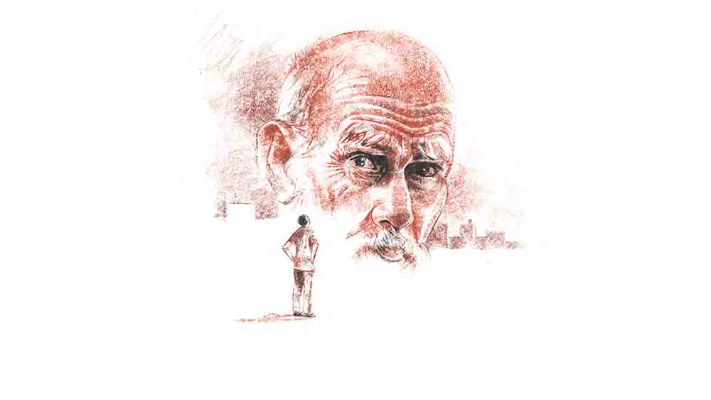

 
 <h1 align=center>কে আপনি?</h1>
<h2 align=center>শুভমানস ঘোষ</h2> বৃদ্ধকে আগে কখনও দেখেনি অমিতাভ। বয়সের গাছপাথর নেই। মাথার সামনে টাক। বাদবাকি চুল পেকে ঝুরঝুরে। একগাল দাড়ি। হুঁকো খেলে যেমন হয়, তেমনই সাদা গোঁফে হলুদের ছোপ। গালে পোড়-খাওয়া দাগ। চোখ তো নয়, ধারালো ছুরি। কেটে বসছে তার মুখে। মোমবাতির ম্যাটমেটে আলোয় দুলছে তার ছায়া।

অমিতাভ চমকে উঠল। সকাল থেকে তার মনখারাপ। ‘‘এখানে থাকা যায় না!’’ বলে সাত সকালেই বাড়ি ছেড়ে মাকে টানতে-টানতে বাবা পিঠটান দিয়েছে কলকাতায়। এত বড় বাড়িতে পড়ে আছে শুধু বউ বিদুষী আর মেয়ে সুজা। কী করে এই বিজন-বিভুঁই গ্রামে সময় কাটবে, এতগুলো ঘরদোর সামলাবে ভেবে চিন্তাই ধরে যাচ্ছিল তার।

শুধু কি বড় বাড়ি? বাইরের ঘেরা কম্পাউন্ডটাও বিশাল। গাছে-গাছে ছয়লাপ। ব্যাঙ্কের লোনের উপরেও ধারদেনা করে কষ্ট করেই কিনে বাবা-মাকেও নিয়ে এসেছিল অমিতাভ। দেখেশুনে তারা তো মহাখুশি। শহরের বাড়িতে জায়গার টানাটানি। বিছানায় টান-টান হয়ে শোওয়াও যায় না। এখানে অঢেল জায়গা। বাগান করো, নার্সারি করো, পুকুর কাটাও, যা ইচ্ছে করো, কেউ দেখার নেই। কেউ বলার নেই।

প্রথম-প্রথম তো বাবার উৎসাহের শেষ ছিল না। বৌমাকে নিয়ে ঘুরে-ঘুরে প্ল্যান করছে, কোথায় কী করবে। বিদুষীর ফুলের শখ। ফুলের বাগান হবে। মায়ের ইচ্ছে আনাজপাতি ফলাবে, সেও হবে। তার পাশেই থাকবে শৌখিন খড়ে-ছাওয়া বাবার পাসোর্নাল রিডিং হাট। সামনে দোলনা। দুলতে-দুলতে বাবা পড়াশোনা করবে। মা খেতে ডাকলে ঘরে-ফলানো সার-খোলের সুস্বাদু টাটকা আনাজের তরিতরকারি
খেয়ে ধন্য-ধন্য করবে, “আহ্‌! কী টেস্ট! কী গন্ধ! কলকাতায় এ জিনিস কোথায় পাবে?”

টাটকা আনাজের মতো ফ্রেশ গ্রামের মানুষজন। হাতে-হাতে মোবাইলে গান বাজছে তারস্বরে। এক মুহূর্ত চুপ করে থাকে না। সব সময় দলবল জুটিয়ে কলরবলর করছে। দোকান-বাজার করতে বেরিয়ে আকাশ দেখার নাম করে চুপ করে দাঁড়িয়ে সাগ্রহে তাদের কথা শুনত বাবা। তাকে দেখে লোকজন একে অন্যকে ঠেলা দিয়ে শুধোত, “কে র‌্যা লোকটা? দেঁইড়ে-দেঁইড়ে কী এত কথা শোনছে আমাদের?”

উত্তরে কেউ বলত, “শহরের বাবু। শখ করে লতুন বাড়ি কিনে এয়েচে এধারে। ক’দিন যাক নে! বোঝবে ঠ্যালা!”

ঠিক তাই। ঠেলা ভাল করেই বুঝেছিল বাবা। ক’দিন যেতে-না-যেতে হাঁপ ধরে গেল তার। বড্ড নির্জন জায়গা, আশপাশে মেশার মতো লোক নেই, রাতে একটু শব্দেই বুক কাঁপে বলে মাকে নিয়ে সটান কলকাতায়। অথচ খোলামেলা জায়গায় শেষ বয়সটা তাদের আনন্দে কাটবে বলেই বাড়িটা কিনেছিল অমিতাভ। কেনার আগে পাঁচ বার শুধিয়েছিল। এনে দেখিয়েছিল। কেউ আপত্তি করেনি। উলটে “ফার্স্ট ক্লাস!” বলে পিঠ চাপড়ে দিয়েছিল তার।

মাথায় আকাশ ভেঙে পড়েছে অমিতাভর। বিশাল বাড়ি খাঁ-খাঁ করছে। বাইরে শিয়াল ডাকছে। ভুস করে যখন-তখন কারেন্ট চলে যাচ্ছে। এমার্জেন্সি লাইট জ্বালিয়ে গজগজ করতে-করতে রান্না করছে বিদুষী। আঁচলে ঘুরছে মেয়ে। ঘরের বিছানায় শুয়ে মাথার চুল ছিঁড়ছে অমিতাভ আর মনে-মনে তার বর্তমান যন্ত্রণার কথা ভাবছে। ঠিক তখনই বৃদ্ধের আবির্ভাব হয়েছিল। তারই ঘরের চেয়ার অধিকার করে জমিদারের স্টাইলে বসে পা নাচাচ্ছে।

“এই বয়সে যন্ত্রণার আর কী দেখলি! এতেই হেদিয়ে পড়ছিস?” অমিতাভ ধড়মড় করে উঠে বসতেই বৃদ্ধ খ্যারখ্যার করে উঠল, “আরে, সবে তো কলির সন্ধে। একেবারে ঘোল খেয়ে যাবি।”

“কে? কে আপনি?”

উত্তরে চোখের সামনেই জাস্ট ভ্যানিশ হয়ে গেল বৃদ্ধ। ছায়া দুলছিল। কাঁপছিল। স্থির হয়ে গেল। প্রেতযোনি না কি রে বাবা! ভয়ে বুক কাঁপতে লাগল অমিতাভের। বাড়ি কিনে তহবিল ফাঁকা। বৃদ্ধের ভ্যানিশ হওয়ার ঘটনা শুনলে পাছে বিদুষীও পালায়, সে ট্যা-ফোঁ করল না। মুখ টিপে রইল। তার মধ্যে কারেন্ট চলে এল। শিয়ালগুলোও ভ্যাবাচ্যাকা খেয়ে থেমে গেল। তবে কি তার মনের ভুল? না, চোখের ভ্রম?

সম্ভবত তা-ই। ওই এক দিনই দেখেছিল বৃদ্ধকে অমিতাভ। তার পর মাসের পর মাস কেটে গেল। বছরও গড়িয়ে গেল। বৃদ্ধ এল না। দেখাও দিল না।

তা নয় না-ই দিল, এ দিকে এই নতুন বাড়ি থেকে অফিস যেতে-আসতে প্রাণ বেরোচ্ছিল অমিতাভের। চোর-ছ্যাঁচড়, চাঁদার আর কারেন্টের উৎপাত দিনে-দিনে বাড়ছিল। শহরের বাবুর ছেলেরও দম বেরিয়ে যাচ্ছিল। তত দিনে হাতে কিছু রেস্ত এসেছে। বাড়ি বিক্রির জন্য লোক খুঁজতে লাগল। লোক তৈরিই ছিল। মুখ খসাতেই হাজির। ভাল দাঁও মারার এই তো সুযোগ!

কিন্তু চাপাচাপি-দরাদরি করেও কাজ হল না। মোটমাট একটু কমের উপর বাড়ি ছেড়ে দিতে হল অমিতাভকে। সেই টাকায় লোন শোধ করে নতুন লোন নিয়ে বাড়ির বদলে ফ্ল্যাট কিনে উঠে গেল কলকাতায়। খবর পেয়ে মাকে নিয়ে বাবাও আনন্দের সঙ্গে চলে এল। আদ্যিকালের ভাগের বাড়িতে আত্মীয়স্বজনের মধ্যে গোঁজাগুঁজি করে থাকতে তাদের কষ্টই হচ্ছিল। এ বার নিজের ছেলে-বৌমা-নাতনিকে নিয়ে নিজের মতো করে বাঁচবে।

না। সময় এগোলে দেখা গেল এখানেও বাঁচা গেল না। ছোট-ছোট ঘর। আলোবাতাস নেই। রোদ্দুর ঢোকে না। শীতে পাঁচ ইঞ্চির দেওয়াল বরফ হয়ে থাকে। ফ্ল্যাট কমিটির মিটিংয়ে রোজ-রোজ অশান্তি। বাবা “রইল তোর ফ্ল্যাট!” বলে আবার মাকে নিয়ে ফিরে গেল। ক্ষোভে-দুঃখে ফ্ল্যাট কমিটির মিটিংয়ের তুলকালাম করে দিল অমিতাভ।

বাবা-মাকে ফ্ল্যাটে আনায় জল বেশি খরচ হচ্ছে বলে কমিটির সেক্রেটারি সকলের সামনে এক বার খোঁটা দিয়েছিল তাকে। তার এমন মুখতোড় জবাব দিল অমিতাভ
যে, রাতারাতি ফ্ল্যাটের সকলে
তার শত্রু হয়ে গেল। আড়ালে-আড়ালে ঘোঁট পাকিয়ে তার জীবন অতিষ্ঠ করে তুলল।

যন্ত্রণার উপর যন্ত্রণা আরও বাড়াল তার ফ্লোরের পাশের ফ্ল্যাটের বাসিন্দা খগেন বড়াল। দু’দিন অন্তর তার ফ্ল্যাটে পুলিশের হানাদারি শুরু হয়ে গেল।

পুলিশ আসার খবর আগেই পৌঁছে যেত খগেনের কাছে। ফ্ল্যাটে তালা মেরে পালাত। ফলে পুলিশের জেরার সব ধকল পোয়াতে হত অমিতাভকেই। তার উপর তার বৌটা আবার যতটা সুন্দরী, তার চেয়েও বেশি গায়ে-পড়া। পাছে অমিতাভ বিগড়ে যায়, তার জন্য সব সময় তাকে চোখে-চোখে রাখে বিদুষী। তার ধারণা, অমিতাভের কান আর চোখ দুটো পাশের ফ্ল্যাটেই চব্বিশ ঘণ্টা গেঁথে আছে। যত তার ধারণা বদলাতে যায়, তত সন্দেহ বাড়ে। উঠতে-বসতে কথা শোনায়। অশান্তি করে মারে। মেয়ে সুজাও আজকাল তার দিকে এমন করে তাকায়, মনে হয় সেও যেন মায়ের দলে। যন্ত্রণার একশেষ। ঠিক তখনই এক দিন রাতে বৃদ্ধ আবার এল।

পাশের ফ্ল্যাটে সে যে কান দিয়ে বসে থাকে না, তা প্রমাণ করতে রোজই অফিস থেকে ফিরে অমিতাভ টিভি খুলে বসে। চোখমুখ কুঁচকে গভীর মনোযোগের ভান করে দেখায়, খবরই শুনছে সে। অন্য কিছু নয়।

আজও তা-ই করছিল। তখনই ঘটল ব্যাপারটা। হঠাৎ খবর ফুঁড়ে স্ক্রিনে ঠেলে উঠল বৃদ্ধের মুখ। হলুদে-সাদায় মেশা গোঁফ। জ্বলজ্বলে তীব্র চোখ। বাঁকা হেসে বলল, “কী রে! বলেছিলাম না, ঘোল খেয়ে যাবি? ঠেলা টের পাচ্ছিস? স্টোরি আভি ভি বাকি হ্যায় জনাব।”

“আ-আপনি আ-আবার এসেছেন? কে-এ-এ আপনি?”

এ বারও উত্তর এল না। বৃদ্ধ ছোট হতে হতে বিন্দু হয়ে মিলিয়ে গেল টিভির স্ক্রিনে। খবর শুরু হয়ে গেল আবার। মুখ শুকিয়ে গেল অমিতাভর। প্রথম দিন ভেবেছিল চোখের ভুল। কিন্তু প্রেতযোনি এখানেও তাড়া করে এসেছে দেখে বুকটা ছমছম করে উঠল। এ বারও বিদুষীকে কিচ্ছু জানাল না। তার উপর সে যা গরম হয়ে আছে, বুঝল এখান থেকেও পাততাড়ি গুটোতে হবে।

ঠিক তাই। বিদুষীর চাপে আর ফ্ল্যাট কমিটির ক্রমাগত কূটকচালির মুখে বছর দুইও টেকা গেল না। ফ্ল্যাটও বেচতে হল। পুরনো বাড়ি তো নয়, ফ্ল্যাট। রাখতে পারলেই সোনা। আসল দামের উপর কয়েক লাখ আরামসে হাতে এসে গেল। দেনা শোধ করে অমিতাভ এ বার ঠিক করল, গ্রাম দেখেছে, শহর ছোট থেকেই দেখছে, এ বার মফস্‌সল দেখতে হবে। ফ্ল্যাটে এসে পাশের ফ্ল্যাটের সুন্দরীর ভয়ে টবেও ফুল ফোটাচ্ছিল না বিদুষী। এই টাকায় বাড়িও হবে, টবের বদলে আস্ত বাগানও হবে। লোন মিটিয়ে সামান্য কিছু লোন করলেই হয়ে যাবে।

অফিসের এক সমাজসেবী প্রকৃতির সদা ব্যস্তবাগীশ সহকর্মী প্রসন্নবদন পণ্ডিতের সৌজন্যে গঙ্গার ও পারেই সুন্দর ব্যবস্থা হয়ে গেল। গ্রামের মতো না হলেও এটাও দোতলা বাড়ি। মোটা-মোটা দেওয়ালের খান পাঁচেক ঘর। সঙ্গে পৌনে এক কাঠা পাঁচিল-ঘেরা খোলা জমিও আছে। সুন্দরী অতীত। আবার নতুন করে সুন্দর ফুল ফুটবে দেখে বিদুষীর আনন্দের শেষ নেই। সুজাও “ওয়াও! ওয়াও!” করছে।

বাবা-মাকে দেখাতে নিয়ে আসতে তারা এত দিনে ঠিকঠাক খুশি হল। অতীতের অভিজ্ঞতা দিয়ে ভাল করে সব দেখেশুনে, পাড়ায় লোকজনের কাছে খোঁজখবর নিয়ে, আলাপ-পরিচয় করে তাড়াই দিল, “দেরি করিস না অমি। কিনে ফ্যাল। প্রসন্ন বলছিল, নগদ টাকা নিয়ে দুটো পার্টি অলরেডি ঘুরে গিয়েছে। হাতছাড়া না হয়।”

“এ তো আর ফ্ল্যাটের পায়রার বাসা নয়। শক্ত ভিতের বাড়ি। বড়-বড় ঘর। চার পাশে ডাক্তার-উকিল-প্রফেসরের বাস...” মাও হাঁপ ছাড়ল, “বাঁচলাম বাবা!”

কিন্তু বাঁচা কি ছেলের হাতের মোয়া? বাড়ি কেনার পর বছরও কাটল না, বর্ষাকাল এল। ঘূর্ণিঝড় নয়, নিম্নচাপও নয়, ক’দিন বৃষ্টি গড়াতেই বোঝা গেল এ বাড়িও আর পছন্দের বাড়ি নেই। না বাবার, না মায়ের। এক তলায় জল থইথই করছে। সিলিন্ডারটাও ভেসে যাচ্ছিল। হাঁটু জলে ডাইভ দিয়ে ঘরের গ্যাসকে ঘরে ফেরানো গিয়েছে। রাস্তায় কোমর-ছাড়ানো জল। প্রসন্ন বদনে নৌকো করে আসছে প্রসন্নবদন। হাতে তার মুড়ি-চিঁড়ে-ভেলিগুড়।

বাবা হুঙ্কার দিল, “এ আমাদের কোথায় এনে ফেললে প্রসন্ন?”

প্রসন্ন একগাল হেসে বলল, “কেন স্যর? বৃষ্টি আর ক’দিন?”

“ক’দিন? পাক্কা দু’মাস! এত দিন এ ভাবেই থাকতে হবে?”

“ডোন্ট ওরি স্যর! আমি তো আছি। পুজোর পর দেখবেন রাস্তা ধোয়ামোছা-তকতকে। একেবারে মুখ দেখতে পারবেন।”

রাগে ফেটে পড়ল অমিতাভ, “বর্ষাকাল ছেড়ে শরৎও দেখিয়ে দিলে? ভাল কোলিগ জুটেছে আমার!”

শুনে প্রসন্নর হাসি প্রায় কান পর্যন্ত উঠে গেল, “তোমার কোলিগ থাকা আর হল না অমিতাভ। সামনের মাসেই আমার ট্রান্সফার হয়ে যাচ্ছে কলকাতা ব্রাঞ্চে।”

সব্বোনাশ! প্রসন্ন আছে বলে যাও বা একটা নৌকো এসেছে, ও না থাকলে তো সেটাও আসবে না! বেগতিক দেখে চিরসজল বাড়ির মায়া চিরতরে কাটিয়ে মাকে নিয়ে বাবা পরদিনই বাক্স-বিছানা গুটিয়ে সিঁড়ি ভেঙে নেমে এক তলার ধাপে এসে দাঁড়াল। সমাজসেবী প্রকৃতির প্রসন্ন বিগলিত হেসে জলে নেমে সব মালপত্র নৌকোয় তুলে বাবাকেও তুলতে যাবে, হঠাৎ তার মুখটা বদলে অন্য মুখ হয়ে গেল। প্রসন্ন হয়ে গেল অবিকল সেই বৃদ্ধ।

বৃদ্ধ খুব হাসছে। হাসতে হাসতে অমিতাভকে বলল, “কী রে, কেমন ঘোল খাচ্ছিস?”

এখানেও মূর্তিমান হাজির! অমিতাভর আর ভয় হল না। রেগেই গেল, “কে আপনি? কেন আমার পেছনে পড়ে আছেন?”

বলার অপেক্ষা। সঙ্গে-সঙ্গে বৃদ্ধ বদলে যেমন ছিল, আবার প্রসন্ন হয়ে গেল। অবাক হয়ে বলল, “কে আমি মানে? তোমায় এত সুন্দর বাড়ি কিনিয়ে দিলাম। জানলা দিয়ে বর্ষার রূপ দেখছ। কী সব যা-তা বলছ আমায় অমিতাভ?”

বাবা-মা চলে যেতে যেটুকু এনার্জি ছিল, সেটুকুও ফুরিয়ে গেল অমিতাভের। বাড়ির পিছনে ছুটে ঘটি-ঘটি ঘোল খেয়েছে। থাক বৃষ্টি, গ্যাসের সিলিন্ডার যেখানে খুশি ভেসে যাক, সঙ্গে একতলাটাকেও নিয়ে যাক, বিদুষীর ও সুজার ঘ্যানঘ্যানানি কানেই তুলল না। দাঁতে-দাঁত চেপে পড়ে রইল। পাছে আবার সেই বৃদ্ধের টিটকিরি হজম করতে হয়, বাঁকা হাসি ফেস করতে হয়, নতুন কোনও আস্তানার চেষ্টা করা দূর, মুখেই আনল না। জেদ করে বছরের পর বছর রয়ে গেল জলে স্যাঁতা-পড়া, দেওয়ালে রস-সরা বাড়ি আঁকড়ে। বছরের দু’মাস একতলা জলে ভাসে। বাকি তিন মাস রাস্তা। সয়ে গেল। সাঁতার জানত না। বাজার-অফিস-আদালত করে তাও শিখে নিল।

একতলার জানলা দিয়ে ঢোকা নাছোড় জল, তাতে ভাসা নোংরা আবর্জনা, কচুঘেঁচু-কচুরিপানা আর জলঢোঁড়া সাপ দেখতে-দেখতে সুজা বড় হল। বিয়ে হল। আদুরে এক মেয়ে হলে যা হয়, বরের সঙ্গে
সাঁ করে আমেরিকায় চলে গেল। বিদুষী বুড়ি হল। বাড়ি-বাড়ি করে বুড়ি হলে যা হয়, পটাং করে সেও তার মেয়ের চেয়েও দূরের দেশ পরলোকে চলে গেল।

একা বাড়ির আয়নার সামনে দাঁড়িয়ে আজকাল অমিতাভ চমকে-চমকে ওঠে। মাথার সামনে টাক। চুল সাদা হয়ে গিয়েছে। মুখময় দাড়িগোঁফ। গালে পোড়-খাওয়া দাগ।

সে নিজেই সেই বৃদ্ধ হয়ে গিয়েছে। হুঁকো ধরাটাই শুধু বাকি।