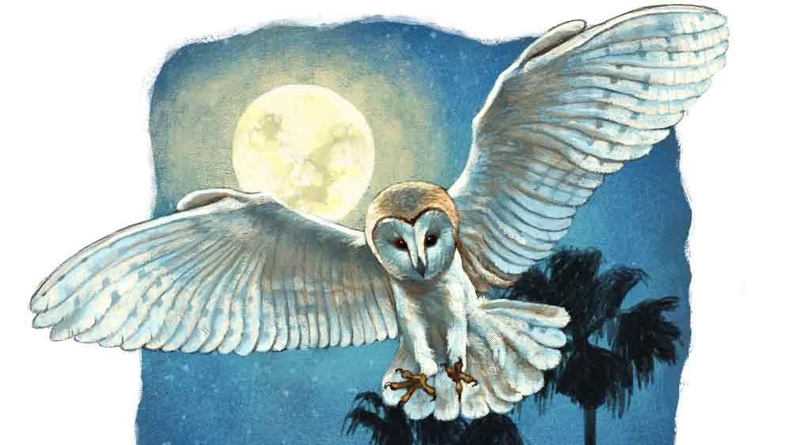

 

<h1 align=center>কোজাগরী</h1>
<h2 align=center>অংশু পাণিগ্রাহী</h2>
সাদা মতো একটা পাখি এসে বসল টালির চালে।   ডানা ঝাপটানোর শব্দে মুখ তুলে তাকায় অনুকূল। গোল গোল চোখ, বাঁকানো ঠোঁট। চাঁদের আলোয় পরিষ্কার দেখা যায়। লক্ষ্মীপেঁচা। ডান হাতের তর্জনী কপালে ঠেকায় অনুকূল। তার পর ছোঁয়ায় বুকে। মায়ের বাহন এসে বসেছে তারই বাড়িতে। এ বড় শুভ ইঙ্গিত। চাঁদের আলো এসে পড়ে অনুকূলের মনের ভিতরেও।   দূরে তালগাছের মাথায় চাঁদ লেগে আছে। বিশাল গোল চাঁদ। তার অকৃপণ রুপোলি আশীর্বাদে ভেসে যাচ্ছে চরাচর। আজ কোজাগরী পূর্ণিমা। বাতাস মুখরিত শাঁখের আওয়াজে। বাড়ি-বাড়ি লক্ষ্মীপুজো হচ্ছে। অনুকূল ব্যস্ত হয়ে ওঠে। আর দেরি করে কাজ নেই। এ বার বেরোতেই হয়।   “আমি প্রতিমা লিকি আইসি, তুই বাকি জোগাড়গুলা করি রাখ..” দাওয়া থেকে হাঁক দেয় অনুকূল।   অনুকূলের বৌ মালতী বেরিয়ে আসে, “হঁ, যা কইচ! বোড়োলোকের ঘরের পূজা বলিকি কথা! বিরাট জোগাড় হবে। লুচির ভোগ হবে। তুমি ঠ্যাংয়ের উপর ঠ্যাং লাদিকি লুচি খাব,” মালতী নিষ্ঠুর ভাবে রাগ আর বিদ্রুপ ছুড়ে দেয়।   অনুকূল গায়ে মাখে না। বরং উৎসাহিত হয়ে লক্ষ্মীপেঁচা দেখায় বৌকে। মালতীর বিরক্তির পারদটা কয়েক গুণ চড়ে যায়। সে ঢিল ছোড়ার ভঙ্গি করে। পেঁচাটা উড়ে যায়।   অনুকূল মনঃক্ষুণ্ণ হলেও মুখে কিছু বলে না। বৌকে চটিয়ে লাভ নেই। কথায় কথা বাড়বে।   “তুমার মতো ভক্ত বাপো কুনোকালে দেখিনি। ভাতের জোগাড় নাই, তবুবি লক্ষ্মীপূজার ঢং কেনি করো! পূজা করিকি লাভ কী? ঠাকুর কুনো কিছু দিচে আজ অবদি? সৌ তো মাগি-মাগিকি সংসার চলে!” গজগজ করে চলে মালতী।   উত্তর না দিয়ে অনুকূল হাঁটা লাগায় জগন্নাথের বাড়ির দিকে। প্রতি বারই মালতী এমন বলে। তবে সে যা-ই বলুক, লক্ষ্মীপুজো করতেই হবে। মা নিশ্চয়ই পরীক্ষা নিচ্ছেন! এক দিন ঠিক মুখ তুলে তাকাবেন। সেই কবে থেকেই নিষ্ঠাভরে পুজোর আয়োজন করে গেছে অনুকূল। হোক না সামান্য আয়োজন। ভক্তির তো অভাব নেই। চাহিদাও এমন কিছু বেশি নয়। শুধু এক দিনের জন্য পায়ের উপর পা তুলে… দীর্ঘশ্বাস ফেলে দ্রুত পায়ে এগোয় অনুকূল।   “হিম পড়েটে, গায়ে জামা দিকি যাও...” পিছন থেকে মালতীর গলা শোনা যায়।   অনুকূল হাত নেড়ে জানিয়ে দেয়, লাগবে না। পরনে শুধু একটা ময়লা গামছা। হাঁটু অবধি। ওতেই হবে। লজ্জার নিবারণই যথেষ্ট। কার্তিকের শুরুতেই শীতকে ভয় পাওয়াটা বিলাসিতা। অন্তত অনুকূলের কাছে।   পুজো নিয়ে যতই ব্যঙ্গ-বিদ্রুপ করুক মালতী, রেগে যাক, বরের স্বাস্থ্যের ব্যাপারে সে উদাসীন নয়। ভাল লাগার একটা আবেশ ঘিরে ধরে অনুকূলকে। কঠিন পাথরের নীচেই তো শান্ত মিষ্টি জলধারা থাকে। মালতী তেমনই। নারকোলের শক্ত খোলার ভিতর নরম শাঁসের মতো। মিষ্টি জলের মতো।   নারকোলের কথায় অনুকূলের মনে পড়ে, বিকেলের কাজ করতে গিয়ে সামন্তদের বাড়ি থেকে কয়েকটা নারকোলের নাড়ু আর গোটা ফল চেয়ে এনেছে মালতী। সামন্তরা আবার নাস্তিক। কথায় কথায় তাদের দৃষ্টান্ত টেনে আনে মালতী। সামন্তরা ঈশ্বরমার্গ অনুসরণ করে না। তবুও কী সমৃদ্ধি তাদের! আর এদিকে বছর-বছর লক্ষ্মীপুজো করেও নিজেদের অবস্থার কী উন্নতি হয়েছে? সেই ছেঁড়া গামছা, রিফু করা শাড়ি আর শাক-ভাত।   সুযোগ পেলেই অনুকূলের লক্ষ্মীভক্তিকে ব্যঙ্গ করে মালতী। তবে সম্পূর্ণ উদাসীনতাও দেখাতে পারে না, কেন কে জানে! নইলে কি আজ সে সাধ্যমতো পুজোর নৈবেদ্য জোগাড় করে রাখত! বেতের ভাঙা সাজিতে থোকা থোকা ফুলও উঁকি দিচ্ছিল। অনুকূল দেখে এসেছে।   প্রতিবেশী অবনীর বাড়িতে শাঁখে ফুঁ পড়ল। লক্ষ্মীপুজো হচ্ছে। ওদের বাড়ির নতুন বৌ ভাল শাঁখ বাজায়। অবনীর পুত্রবধূ। বৌমার প্রশংসায় অবনী পঞ্চমুখ। বহু গ্রাম-গঞ্জ চষে অনেক খুঁজে-পেতে এই লক্ষ্মীপ্রতিমার মতো মেয়েটিকে নাকি পছন্দ করা গেছে। রূপ, গুণ সবেতেই আদর্শ। অবনী পারলে ওই মেয়েকে সিংহাসনে বসিয়ে পুজো করে। অথচ বাপ-মা মরা আপন ভাইঝিটাকে বিনা অপরাধে ঘরছাড়া করেছে। নিঃসন্তান মালতী চেয়েছিল মেয়েটাকে নিজের কাছে রেখে দিতে। কিন্তু অনুকূল রাজি হতে পারেনি। এক দিকে দারিদ্র আর অন্য দিকে অবনী-সহ গাঁয়ের মোড়লদের রক্তচক্ষু ওর সবটুকু সাহস শুষে নিয়েছিল।   এখন আর ও সব ভেবেই বা কী হবে! গতি বাড়ায় অনুকূল।      ‘মৃন্ময়ী স্টুডিয়ো।   আর্টিস্ট: জগন্নাথ পাল।’   চতুষ্কোণ সাইনবোর্ডে লেখা নামটি চাঁদের আলোয় পড়া যায়। ফাঁকা উঠোনে বসে বিড়ির ধোঁয়া ছাড়ছে জগন্নাথ।   অনুকূল একটা বিড়ি চেয়ে নেয়। আগুন ধরিয়ে বলে, “ঝটপট বার কর বাপ। রাত হিচে অনেক। দেরি হি গেলা টুকু আইসতে-আইসতে।”   “আহ, কাকা! তোমার এত তাড়া কিসের! ধার-কর্জর পুজো তোমার। এত সহজে বামুন পাবে? ওই গভীর রাতে কোনও পুজো-ফেরত বামুন যদি জোটে…”   ধার-কর্জর পুজো। ঠিকই বলেছে জগন্নাথ। ফলমূল চেয়ে আনা হয়েছে। প্রতিমাও আপাতত যাবে ধারের ভরসাতেই। কষিতে একশো টাকা গুঁজে এনেছে। বাকিটা পরে সুবিধেমতো শোধ করা যাবে। এর পর পুরুত খুঁজতে বেরনো। সেও নগদহীন কারবার। পায়ে-টায়ে ধরে যদি কোনও দয়ালু বামুনকে রাজি করানো যায়!   অনুকূল চুপ করে থাকে। জগন্নাথের কথার কোনও জুতসই জবাব তার কাছে নেই। শুধু পুঞ্জ পুঞ্জ ধোঁয়া টেনে বার করে মাগনায় পাওয়া বিড়ির পেট থেকে।   সামনের রাস্তায় শোনা যায় মানুষের পায়ের শব্দ। প্যান্ট-শার্ট পরিহিত এক যুবক এসে দাঁড়ায় বাড়ির চৌহদ্দির মধ্যে। চোখ তুলে সাইনবোর্ডটা খুঁটিয়ে পড়ে।   “আপনাদের মধ্যে জগন্নাথবাবু কে?” কাঁচুমাচু মুখ করে বলে যুবকটি।   “আমিই জগন্নাথ পাল। কোথা থেকে আসা হচ্ছে দাদার? কী চাই?” মাটিতে বিড়ির টুকরোটা পিষে দিয়ে বলে জগন্নাথ।   “চাই বলতে… একটা লক্ষ্মীপ্রতিমা। আমি শ্যামগঞ্জ থেকে আসছি। অনেক খুঁজে-খুঁজে শেষে এক জন আপনার নাম বলল।”   “ও। শ্যামগঞ্জ! সে তো অনেক দূর। আপনাদের ও দিকে কোনও আর্টিস্ট নেই?”   “আজ্ঞে?” যুবকটি থমকায়।   অনুকূল মনে মনে হাসে। আর্টিস্ট! জগন্নাথ আবার আর্টিস্ট বলে নিজের পরিচয় দেয়। কলকাতার প্রতি জগন্নাথের একটা আশ্চর্য রকমের দুর্বলতা রয়েছে। কলকাতার প্রসঙ্গ উঠলেই সে গদগদ হয়ে প্রায় গলে যায়। কলকাতার কোনও এক উঠতি ছোকরা কবি নাকি জগন্নাথকে বুঝিয়েছিল, মাটির মূর্তি গড়া হল শিল্পকর্ম। তাই মৃৎশিল্পী মাত্রই আর্টিস্ট। আর আর্টিস্টের কাজের জায়গাকে দোকান বললে শিল্পের অসম্মান করা হয়। দোকান কথাটার সঙ্গে কেমন যেন ব্যবসা-ব্যবসা গন্ধ লেগে রয়েছে! তাই স্টুডিয়ো।   জগন্নাথ যুবকটিকে বলে, “ওই কুমোর-টুমোর আর কী!”   “ও তাই বলুন। হ্যাঁ, তা আছে। কিন্তু আমি বড্ড দেরি করে ফেলেছি। সকলেরই বিক্রি শেষ,” বলে যুবকটি।   জগন্নাথ বলে, “দুঃখিত। এখানেও আপনার সুবিধে হবে না। এই যে, অনুকূলকাকা বসে আছেন। ইনিই আমার শেষ খদ্দের।”   জগন্নাথের কথায় যুবকটি প্রায় লাফিয়ে ওঠে। জগন্নাথের হাত ধরে প্রায় কাঁদো-কাঁদো গলায় বলে, “কোনও ব্যবস্থা কি করা যায় না? আপনি যা দাম বলবেন আমি তা-ই দেব। প্রতিমা না নিয়ে গেলে আমি বাড়ি ঢুকতে পারব না। আমার বৌ ঢুকতেই দেবে না। মারধরও করতে পারে। কলকাতায় চাকরি করি। ফেরার পথে ছাঁচের চমৎকার একটা মূর্তি কিনেছিলাম। ট্রেন থেকে নামতে গিয়ে এমন ঠেলাঠেলি হল, মায়ের মূর্তি ভেঙে চুরমার। প্রতিমাবিহীন পুজোয় বৌয়ের ভীষণ আপত্তি।”   সর্বনাশ! অনুকূল প্রমাদ গোনে। কলকাতার প্রসঙ্গ এসেছে মানেই… না, না আর সময় নষ্ট করা যাবে না।   বিড়ি নিভিয়ে সে উঠে পড়ে। ব্যস্ত গলায় বলে, “কাই রে বায়া, আমারটা ক্লিয়ার করি দে। আমি উঠবা এ বার।”   জগন্নাথ মাথা চুলকে বলে, “কাকা, বৌয়ের মার কী জিনিস আমি জানি। বিশেষ করে রাতের বেলায়। রাত তো আদর সোহাগের সময়। রাতের মার তাই বেশি কষ্টদায়ক। তা, আমি বলি কী, ভদ্রলোক যখন বিপদে পড়েছেন, তাঁকে সাহায্য করাটাই আমাদের কর্তব্য। এ বারটা ঘট দিয়ে চালিয়ে নাও। পরের বার কথা দিচ্ছি, তোমার জন্য বড় করে জমকালো প্রতিমা আমি বানিয়ে দেব। পয়সাকড়ি কিচ্ছু দিতে হবে না। এক্কেবারে ফ্রি।”   অনুকূল কী বলবে ভেবে পায় না। এই না কি আর্টিস্ট! ব্যাটা ঝানু ব্যবসাদার। যেমন-তেমন করে গড়া দু’শোর প্রতিমা দু’হাজারে বেচবে এখন। লোভে চকচক করছে ব্যাটার চোখ। অনুকূল বুঝল, এখানে আর আশা নেই। মনে-মনে জগন্নাথকে অজস্র গালিগালাজ করে বেরিয়ে পড়ল সে।      বেতের চুবড়িতে ধান আর লাল চেলি সাজিয়ে, কলার বাকলে সিঁদুর লেপে, অথবা পট বসিয়ে, লক্ষ্মীপুজোর নানা রীতি আছে। কিন্তু সে সব কিছুতেই অনুকূলের মন ওঠে না। বিনা-প্রতিমার পুজো আবার পুজো না কি!   বাড়ি ফিরতে ইচ্ছে করে না অনুকূলের। মালতী মুখঝামটা দেবে। কত কী শোনাবে তার ঠিক নেই। ধানের মাঠ সামনেই। অনুকূল আলের রাস্তা ধরে। কুয়াশার হিমে ভিজছে চরাচর। অল্প-অল্প শীত করছে। করুকগে। মালতীর বকবকানি শোনার থেকে এই ভাল। কিছু ক্ষণ এলোমেলো ঘুরে তার পর গভীর রাতে বাড়ি ফিরবে সে। দেরি দেখে মালতী বরং উৎকণ্ঠিত থাকবে। দু’-চারটে কথা হয়তো কম শোনাবে।   জ্যোৎস্নাডুবি প্রান্তরে মাথা দোলাচ্ছে ধানের স্বর্ণমঞ্জরি। চাঁদের ঠিক সামনে দিয়ে উড়ে যায় একটা লক্ষ্মীপেঁচা। অনুকূল মনে মনে হাসে। এই প্রাচুর্যপূর্ণ মাঠের একটা ইঞ্চিও তার নয়। এক মুঠো ধানেও তার অধিকার নেই। শস্যশ্যামল এই পটভূমিকায় সে সত্যিই বেমানান।   মালতী এক বার বলেছিল, “তুমার মা কি সত্যিই কানা! তুমার ভক্তি দেখতেই পায়নি! অথচ বছর-বছর পূজা লি যায়টে। আরে বাপো, যদি কিছুই দিবেনি, তবে গরিব ভক্তর ঘাড় মটকি পূজা লিবে কেনি?”   আজ আর পুজো হবে না। এই প্রথম বার মা পুজো প্রত্যাখ্যান করলেন। হতদরিদ্র সন্তানটিকে দুধে-ভাতে রাখা সত্যিই হয়তো তাঁর সাধ্যের বাইরে।   ফুলো-ফুলো গোল চাঁদের দিকে তাকিয়ে লুচির কথা মনে পড়ে যায় অনুকূলের। এক দিন পায়ের উপর পা তুলে বসে সকালে জলখাবারে লুচি খাবে আর দুপুরে কাটাপোনার ঝোল-ভাত। ব্যস, এটুকুই সে চেয়ে এসেছে মায়ের কাছে। এই সামান্য অনুগ্রহটুকুও কি রক্ষা করা অসম্ভব!   বৌকে কিছুই দিতে পারেনি অনুকূল। শুধু দারিদ্র, অভাব আর কষ্টযাপন। এমনকি বৌয়ের গর্ভে একটা সন্তান পর্যন্ত উৎপাদনে সে অক্ষম। মালতীর জন্য হঠাৎ খুব মায়া হয় তার। এত ক্ষণে হয়তো বারোটা বেজে গেছে। বরের জন্য উদ্বিগ্ন মালতী নিশ্চয়ই ঘর-বার করছে। অনুকূল বাড়ির পথ ধরে। লক্ষ্মীপেঁচাটা সামনে-সামনে উড়ছে।   ঘোষদের পুকুরটার কাছে এসে থমকে দাঁড়ায় অনুকূল। ঢালাও জ্যোৎস্নায় দেখার অসুবিধে নেই। পুকুরঘাটায় একটি মেয়ে বসে আছে। তার এক ঢাল কোঁকড়ানো চুল কোমর অবধি ছড়ানো। মুখ দেখা যায় না। রাস্তার দিকে পিছন ফিরে আছে মেয়েটি। পেঁচাটা এসে বসেছে তার পাশে। দূর থেকে ভেসে আসছে পুজোর শাঁখের শব্দ। মেয়েটি অচেনা নয়। তবুও কী এক আকর্ষণে মন্ত্রমুগ্ধের মতো এগিয়ে যায় অনুকূল। মেয়েটি তাকে প্রবল ভাবে টানছে। হঠাৎ ঘুটঘুট করে ডেকে ওঠে পেঁচাটা। মেয়েটি ফিরে তাকায়।   ভবঘুরে রুনুপাগলি। কলাপাতার ঠোঙা থেকে লুচি বার করে ছিঁড়ে-ছিঁড়ে খাচ্ছে। এ দিকে অনেকের বাড়িতেই পুজোর পরে কলাপাতায় মুড়ে কিছু প্রসাদ বাড়ির উঠোনে রেখে দেয়। রুনু চাঁদের উদ্দেশে অর্পিত তেমনই কোনও নৈবেদ্য কোথাও থেকে তুলে এনেছে।   “লুচি খাবে?” রুনু লুচি তুলে অনুকূলকে দেখায়। রুনুর মুখে কী এক অপার্থিব আলো এসে জমা হচ্ছে। অনুকূলের চোখে ঘোর লাগে। অবনীর ভাইঝি রুনু। বছরপাঁচেক আগে গ্রামেরই ক’টা ছোঁড়া যা-নয় তাই করেছিল বছর সতেরোর মেয়েটার সঙ্গে। অবনী ঝুঁকি নেয়নি। পিতৃমাতৃহীন মেয়েটাকে তাড়িয়ে দিয়েছিল ঘর থেকে। ওই মেয়ে বংশের মুখে চুনকালি দিয়েছে। ওকে ঘরে ঠাঁই দেওয়া মহাপাপ। এই ছিল অবনী আর গাঁয়ের মাথাদের সিদ্ধান্ত।   খিলখিল হাসির শব্দে চমকে ওঠে অনুকূল। রুনু হাসছে। তার শতছিন্ন পোশাকে ময়লার আস্তর। জট পাকানো, তেলজলহীন রুক্ষ চুল খামচে ধরে রয়েছে। কষ বেয়ে গড়াচ্ছে আঠালো সুতোর মতো লালা। পাঁচ বছর আগে কোজাগরীর রাতে ধানখেতের মধ্যে পড়ে থাকা রুনুর ক্ষতগুলো সারেনি, সময়ের সঙ্গে সঙ্গে আরও গভীর হয়েছে বরং।   বিহ্বল অবস্থাটা আস্তে আস্তে কেটে যায়। মন ঠিক করে সিদ্ধান্ত নেয় অনুকূল। এ বার থেকে আর মায়ের মৃন্ময়ী মূর্তির আরাধনা করবে না সে। একটা ছোট্ট মাটির মূর্তিতে কি মায়ের সবটা ধরা পড়ে? একশোর নোটটা কষি থেকে বের করে একদৃষ্টে চেয়ে থাকে। একটু চিন্তা করে নেয়। বাড়ি গিয়ে মালতীর কাছে আরও কিছু টাকা চাইতে হবে। আপাতত পাঁচশোর মতো হলেই রুনুর জন্য কাপড়-জামা কেনা যাবে।   লক্ষ্মীভক্ত অনূকুল বাড়ির পথ ধরে। পেঁচাটা উড়ে যায় চাঁদের দিকে।