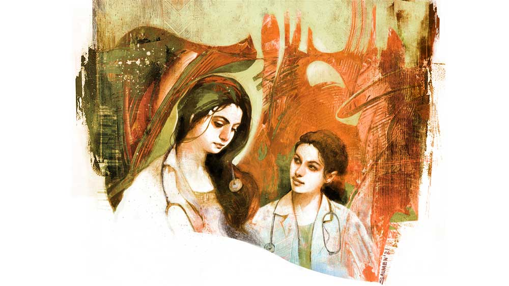

 

<h1 align=center>ক্যাডাভারের মুখ</h1>
<h2 align=center>তাপস রায়</h2>
পেটে মোচড় দিয়ে কয়েক বার ওয়াক উঠতে গার্গী অনেকটা সুস্থ বোধ করল। চোখেমুখে জল দিয়ে বেসিনের আয়নায় তাকাল। নিজেকে ঝাপসা দেখাচ্ছে। বাবার মুখটা ভেসে এল। কারণ বাবার দেহদানের ইচ্ছেটা মাঝে মধ্যেই পানকৌড়ির মতো টুক করে মাথা তোলে, যদিও মায়ের ধাতানি খেয়ে সঙ্গে সঙ্গে টুপ করে ডুব দেয়। বাবা এক দিন মার কাছে নিজের ইচ্ছের কথাটা বলতে মা এমন উত্তর দিয়েছিল যে, বাবা চার্জ-ফুরনো মোবাইলের মতো নিশ্চুপ হয়ে গিয়েছিল। যেমন করে আলুসেদ্ধর সঙ্গে লঙ্কা ঘষে ঘষে মাখে, তেমন করেই মা তাচ্ছিল্য মিশিয়ে বলেছিল, “ওই তো চেহারা, পাঁজরের সব হাড় গোনা যায়, এই শরীর আবার দান! রাখো তোমার বাজে চিন্তা!” এই চার দিন আগে, যে দিন বাবা গার্গীকে কলকাতায় হস্টেলে রাখতে আসছিল, আর রূপসী বাংলা এক্সপ্রেস যখন দু’পাশের শালুক, পলাশ-সহ আরও সব মনোহর দৃশ্য নিষ্ঠুর গতিতে পিছনে ফেলে এগিয়ে যাচ্ছিল, সে দিন বাবা ট্রেনের জানলা দিয়ে স্বপ্নালু চোখে বাইরে দেখতে দেখতে, এটা-ওটার কথার পিঠে ফের কায়দা করে ওই কথাটা জুড়ে দিয়ে বলল, “আজকের দিনটা কী আনন্দের বল! ডাক্তারি পড়তে যাচ্ছিস। আমার বহু দিনের ইচ্ছের গতি হল। এখন তোদের অনুমতি পেলে আমার অন্য ইচ্ছেটা পূরণ হয়। আমাকে পুড়িয়ে দিয়ে কার কী লাভ বল তো মা! পৃথিবীকে আমি কি শুধু এক বস্তা ছাই উপহার দিয়ে যাব?”   গার্গী বাবার পাশে বসে ঝালমুড়ি খেতে খেতে বলেছিল, “কেন, রোজ সন্ধেবেলায় নামমাত্র পয়সায় হোমিয়োপ্যাথি ওষুধ বিলোচ্ছ, তাতে মন ভরছে না? আর বেশি মহান হতে হবে না তোমায়।”   গার্গীর বাবা বাঁকুড়ার বিডিও অফিসের কর্তব্যনিষ্ঠ হেড-ক্লার্ক। সারা দিন ফাইলে মুখ গুঁজে কাজ করে ঘাড়ে ব্যথা নিয়ে ঘরে ফেরে। তার পর ব্যথার তোয়াক্কা না করে সন্ধে ছ’টা থেকে রাত আটটা পর্যন্ত বাজারে ঢোকার মুখে ডিসপেনসারিতে বসে সেই ঘাড়েই স্টেথো ঝুলিয়ে রোগী দেখে। ডিসপেনসারি না বলে টিনের বাক্স বললে ভাল হয়। আমদানি যা হয়, তাতে বাক্সর ভাড়াও ওঠে না। তবু শীত, গ্রীষ্ম, বর্ষা মানুষের প্রতি ভালবাসার টানে বাবার উপস্থিতি সূর্য ওঠার মতোই দৈনিক চিত্র। গার্গীর লেখাপড়া আর সংসারের যাবতীয় খুঁটিনাটি বিষয়ের উপর বাবার চিলের চোখ। কিন্তু নজরের বৃত্ত থেকে শুধু নিজের শরীরটাই ফসকে যায়। অস্থিসার চেহারাটার দিকে তাকালে গার্গীর মনে হয়, বাবা যেন নিজেকে বিলিয়ে দেওয়ার জন্যই জন্মেছে। মায়া হয়, অন্য দিকে বড্ড রাগ।   ফোন বেজে উঠল গার্গীর। অ্যাপ্রনের বাঁ পকেট থেকে বের করে দেখল, জিনিয়া করছে।   জিনিয়া গার্গীর রুমমেট। চার দিনের আলাপ। ওর নাম মেডিকেলের মেরিট লিস্টে ছ’নম্বরে, অর্থাৎ টপার। আর গার্গী অনেকটা নীচে, এক হাজার তিনশো ছাব্বিশে। কিন্তু জিনিয়া উন্নাসিক নয়, মিশুকে, সহজ-সরল। আর খুব স্টুডিয়াস, ওর টেবিলের ওপর স্তূপীকৃত বইপত্রের বহরেই সে কথা স্পষ্ট। জিনিয়া যখন টেবিল ল্যাম্প জ্বেলে মোটা বইয়ের পাতায় মুখ গোঁজে, তখন রুমে দ্বিতীয় কারও অস্তিত্বের কথা বেমালুম ভুলে যায়। আর হ্যাঁ, যে কথা না বললেই নয়, একটা পুরনো খবরের কাগজের দুটো পাতা, সেলোফেন পেপারের প্যাকেটের মধ্যে সযত্নে ভাঁজ করে রাখে। এ নিয়ে চাপা কৌতূহল প্রথম দিন থেকেই গার্গীর মনে চোরের মতো ঘাপটি মেরে আছে। সবচেয়ে অদ্ভুত, জিনিয়া পড়তে পড়তে হঠাৎ উঠে ঘর থেকে বেরিয়ে যায়, তিনতলার ঝুলবারান্দার কোণে দাঁড়িয়ে টিচার্স কোয়ার্টার্সের দিকে চেয়ে থাকে। গত চার দিনে এক দিনও এর অন্যথা হয়নি। হয়তো স্বপ্নে বুঁদ হয়ে থাকে, এক দিন ও-ও মেডিকেল কলেজের প্রফেসর হবে!   জিনিয়ার ফোনটা রিসিভ করল গার্গী, “জিনিয়া বল!”   চাপা গলায় জিনিয়া বলল, “স্যর চলে এসেছেন। তুই কোথায়?”   “ওয়াশরুমে। তোরা তো গটগট করে ঢুকে গেলি। আমি ঢুকতে গিয়েছিলাম, ভেতর থেকে বিশ্রী গন্ধ এল! বমি এসে গিয়েছিল।”   “ওটা ফর্মালিনের। চলে আয়। অভ্যেস হয়ে যাবে।”      *****   ডিসেকশন হলের ঠিক সেন্টারে সবুজ কাপড়ে ঢাকা ক্যাডাভারের টেবিল। চার পাশে সবাই ল্যাব ইউনিফর্ম পরে, গোল ও ঘন হয়ে দাঁড়িয়েছে। প্রফেসর ডক্টর হোড় হাঁক দিলেন, “স্টুডেন্টস! হাউ ডু ইউ ফিল?”   সমবেত ধ্বনি উঠল, “এক্সাইটিং স্যর!” গার্গীর চাপা স্বরও গুড়ি মেরে ঢুকে গেল সেখানে।   স্যর বললেন, “গুড! নাউ আই উইল আনভেল দ্য ক্যাডাভার, বাট বিফোর আই ডু সো উই শ্যাল মেক আ প্রেয়ার।”   কলেজে এসেই গার্গী ‘ক্যাডাভার’ শব্দটা জীবনে প্রথম বার শুনেছে, যে নিষ্প্রাণ শরীরটা ব্যবচ্ছেদ করে হবু ডাক্তাররা হিউমান বডির অন্ধিসন্ধি জেনে নেয় তাকেই ক্যাডাভার বলে।   স্যরের সঙ্গে গলা মিলিয়ে গোটা হল মুখর হয়ে ওঠে প্রার্থনায়, “উই দ্য স্টুডেন্ট অব ফার্স্ট ইয়ার এমবিবিএস অব দিস কলেজ, সলেমলি প্লেজ টু রেসপেক্ট দিস ক্যাডাভার উইথ কমপ্যাশন অ্যান্ড ডিগনিটি...”   প্রেয়ার শেষ হল। স্যর কাপড়টা সরিয়ে দিলেন। উন্মুক্ত করলেন, পা, ঊরু, পেট, বুক, হাত, কাঁধ।  শুধু মুখ ঢাকা রইল। এক জন পুরুষ। নিথর ও নির্বাক। এত জনের  মাঝে দাঁড়িয়েও একটা হালকা শিরশিরানি অনুভব করল গার্গী। জিনিয়ার দিকে আড়চোখে তাকিয়ে বুঝল, মেয়েটার ভয়-ভীতি বা ঘেন্না বলতে কিছুই নেই, ও গভীর মনোযোগে ক্যাডাভারকে দেখছে। স্যর জিনিয়াকে বললেন, “ওকে জিনিয়া?”   জিনিয়া মাথা নাড়ল। জিনিয়া প্রথম থেকেই স্যরদের নেকনজরে। সব স্যরই নামে চেনে। গার্গী চাপা দীর্ঘশ্বাস ফেলল। ভাবল, মেডিকেল কলেজে টপারদের প্রিভিলেজ থাকবে, এটাই বোধহয় স্বাভাবিক। স্যর স্পিচ দিলেন, “আজকের দিনটি তোমাদের অ্যাকাডেমিক লাইফের মোস্ট ভাইটাল ডে। মেডিকেল কলেজে ফার্স্ট উইকেই ডিসেকশন রাখা হয়। কারণ হিউমান বডি ইজ় দ্য বি-অল অ্যান্ড এন্ড-অল অব ইয়োর প্রোফেশন। ঈশ্বর তোমাদেরই অ্যালাও করেন তাঁর অনন্য সৃষ্টিতে একটু-আধটু রদবদল করার। তোমরা একটা কিডনি বদলে দিতে পারো, পেটে ফুটো করে ইন্টেস্টাইনের একটা অংশ কেটে বাদ দিতে পারো, হার্ট ওপেন করে একটা মেটালিক ভাল্ভ বসিয়ে দিতে পারো। কি, পারো তো?”   ভিড়ের মধ্য থেকে কেউ এক জন সহাস্যে বলে উঠল, “এখনও পারি না স্যর, তবে ভবিষ্যতে পারব।”   “রাইট! আর সেই জন্যই হিউম্যান অ্যানাটমির এ-টু-জ়েড তোমাদের জানতে হবে,” স্যর একটা স্ক্যালপেল হাতে নিয়ে বললেন, “হু উইল মেক দ্য ফার্স্ট ইনসিজ়ন?”   স্যরের সন্ধানী চোখ নীরব মুখগুলোয় ডিঙির মতো ভাসতে ভাসতে জিনিয়ার মুখে এসে কাছি বাঁধল, “জিনিয়া, হোয়াই নট ইউ? পারবে না বাবার মতো ডাকাবুকো সার্জেন হতে?”   এক সঙ্গে সব চোখ জিনিয়ার দিকে বিলিয়ার্ড বলের মতো ধাঁ করে ছুটে এল। গার্গীও আড়চোখে জিনিয়াকে দেখল। এক ঘরে চার-চারটি দিন কেটে গেলেও গার্গী এ ব্যাপারে অন্ধকারে।   জিনিয়া মাথা তুলল। চোয়াল শক্ত করে গ্লাভস-পরা হাতটা বাড়িয়ে দিল স্যরের দিকে। স্যর স্ক্যালপেল ধরার কৌশল বুঝিয়ে দিলেন। তার পর বললেন, “ইনসিজ়ন করার আগে মনে রেখো জিনিয়া, আমাদের স্কিনে দুটো লেয়ার, এপিডারমিস আর তার ঠিক নীচে ডারমিস। খালি চোখে তোমরা এই দুটো লেয়ারের পার্থক্য ধরতে পারবে না। এই স্কিনের তলায় থাকে সাব-কিউটেনিয়াস টিস্যু...”   স্যরের বোঝানো শেষ হতেই জিনিয়া স্ক্যালপেল ধরে টেনে দিল ক্যাডাভারের ত্বকে, এমন দক্ষতায় আর অবলীলায়, যেন এ কাজ সে আগেও করেছে।   *****   মাঝরাতে গার্গীর ঘরের দরজাটা হাঁ হয়ে খুলে গেল। অন্ধকারে কে যেন একটা ঢুকল। গার্গী দেখল, তার পায়ের কাছে সকালের সেই ব্যবচ্ছিন্ন শব দাঁড়িয়ে। শরীর থেকে চামড়া ও টিস্যুগুলো ছিঁড়ে ছিঁড়ে মেঝেতে পড়ছে। গার্গী চিৎকার করল। ঘুম ভেঙে ধড়ফড় করে উঠে বসল।   চিৎকারে জিনিয়ারও ঘুম ভেঙে গেছে। সে তড়িঘড়ি আলো জ্বালিয়ে গার্গীর বিছানার কাছে চলে এল, “কী হয়েছে গার্গী?”   গার্গী কান্না জড়ানো গলায় বলল, “ক্যাডাভার! স্বপ্নে দেখলাম...”   জিনিয়া গার্গীর মাথায় হাত দিয়ে বলল, “প্লিজ় গার্গী, ক্যাডাভারকে রেসপেক্ট কর! উনি আমাদের ফার্স্ট অ্যানাটমি টিচার! মনে মনে বল, ‘স্যর, আপনার কাছে আমি কৃতজ্ঞ,’ দেখবি ভয় চলে যাবে।”   জিনিয়ার কথা ওর মনকে অনেকটা শান্ত করল। ও ঘুমিয়ে পড়ল। যখন ঘুম ভাঙল, দেখল জিনিয়ার বিছানা খালি, ও নেই। টেবিলল্যাম্পটা জ্বলছে। নিউজ়পেপারের দুটো পাতা আধখোলা অবস্থায় পড়ে। একটু আগেও জিনিয়া দেখছিল সম্ভবত। গার্গী তাড়াতাড়ি বাথরুম সেরে এসে ভেজানো দরজার দিকে তাকাল। শামুক যে ভাবে খোল থেকে মাথা বের করে, গার্গীর মনের ভেতর ঘাপটি মেরে থাকা কৌতূহল সে ভাবেই হাত-পা-মাথা সব বার করে ফেলল।  গার্গী ঘুম-ঘুম চোখে পেপারটা মেলে ধরল টেবিলে। দু’বছর আগের কাগজ। দেখতে দেখতে দশ লাইনের একটা ছোট্ট খবরে এসে চোখ আটকে গেল। মন দিয়ে পড়ল  গার্গী। দেওয়ালের পেরেকে ঝোলানো জিনিয়ার আইকার্ড সিলিং ফ্যানের হাওয়ায় এ দিক-ও দিক করছিল। কাছে গিয়ে গার্গী জিনিয়ার বাবার নামটা দেখল। তার পর এক 
মুহূর্ত চুপচাপ দাঁড়িয়ে থেকে চোখ ঘষতে ঘষতে দরজা ঠেলে ঝুলবারান্দায় চলে এল।   সদ্য ভোরের আলো ফুটেছে। ক্যাম্পাসের রাস্তার হলুদ আলোগুলো রাত জেগে ডিউটি করার ক্লান্তিতে ধুঁকছে। দূরে এমার্জেন্সি ব্লকের সামনে কয়েকটি অ্যাম্বুল্যান্স দাঁড়িয়ে। আর জিনিয়া এক কোণে রেলিংয়ের উপর দু’হাতের কনুইয়ে ভর দিয়ে টিচার্স কোয়ার্টার্সের দিকে চুপচাপ তাকিয়ে। গার্গী কয়েক পা হেঁটে ওর কাছে চলে গেল। জিনিয়া যেন পিছনে গাছের পাতা খসার শব্দ পেল।   গার্গী অপরাধীর মতো বলল, “সরি! কাল আমার জন্য তোর ঘুমটা ডিস্টার্বড হয়ে গেল।”   জিনিয়া হাসল। গার্গীর মনে হল, ওর হাসিটা যদি স্ক্যালপেল দিয়ে চিরে দেওয়া যেত তা হলে অবশ্যই স্ক্যালপেলের টিপটা তলায় কোনও দুঃখের মোটা আস্তরণে ঘষা খেয়ে যেত। জিনিয়া বলল, “আরে না রে! ভোররাতে আমিও তো স্বপ্ন দেখলাম। মাঝরাতে তুই যা দেখলি, তারই অন্য একটা ভার্শন।”   “রিয়েলি?”   “হ্যাঁ!” জিনিয়া মুখ টিপে হাসল। টিচার্স কোয়ার্টার্সের দিকে আঙুল দেখিয়ে বলল, “ক্যাডাভার হেঁটে এল ওই ওখান থেকে। ঘরে ঢুকে আমায় জিজ্ঞেস করল, ‘তোমার বন্ধু গার্গী ভয় পেল কেন?’”   জিনিয়া লেগপুল করছে বুঝে গার্গীর বরং ভালই লাগল। একটু যেন আশকারা পেল ও। বলল, “কিছু মাইন্ড করিস না জিনিয়া! তোর টেবিলের ওপর রাখা পেপারটা পড়লাম। জানলাম আঙ্কল এই কলেজের প্রফেসর ছিলেন। বিখ্যাত কার্ডিয়ো-থোরাসিক সার্জেন। হঠাৎ ম্যাসিভ কার্ডিয়াক অ্যারেস্ট হয়েছিল। নিজের শরীর কলেজকে ডোনেট করেছিলেন।”   একটা বিরক্তিসূচক ভ্রুকুঞ্চন জিনিয়ার কপালে কয়েক মুহূর্ত নাচানাচি করবার পর আস্তে আস্তে মিলিয়ে গেল, “হ্যাঁ, বলা হয়নি,” বলেই জিনিয়া আবার উল্টো দিকে ঘুরে গেল। মনে হল, নিজেকে লুকোতে চাইল। তাকিয়ে রইল টিচার্স কোয়ার্টার্সের দিকে। ঝুলবারান্দার কোণে খানিকটা নৈঃশব্দ্য জড়ো হল। গার্গী এক পা এগিয়ে গিয়ে নিচু স্বরে  বলল, “জানি, তুই ওই দিকে তাকিয়ে রোজ আঙ্কলের কথা ভাবিস।”   জিনিয়া জবাব দিল, “হ্যাঁ! জানিস গার্গী, ছোটবেলায় আমার হার্টে ভেনট্রিক্যুলার সেপ্টাল ডিফেক্ট ধরা পড়ে। সার্জারি হয়েছিল এই হসপিটালেই। বাপি তখন অ্যাসিস্ট্যান্ট প্রোফেসর। নিজের হাতে আমার বুক চিরে সেপ্টামের ওই হোল স্টিচ করেছিল। আমি বড় হয়ে জিজ্ঞেস করেছিলাম, শুনেছি ডাক্তাররা নিজেদের কারও সার্জারি করেন না। তোমার হাত কাঁপেনি? বাপি বলেছিল, ‘করেন না মানে যে করা যায় না, তা তো নয়। আমি মনে করি, সার্জেনকে কসাইয়ের মতো মন তৈরি করতে হয়, অপারেশন টেবিলে কে আছে ভাবতে নেই।’”   সহমর্মিতার ছোঁয়া দিতে গার্গীর হাতটা স্বয়ংক্রিয় ভাবে জিনিয়ার পিঠের কাছে চলে গেল। জিনিয়া সঙ্গে সঙ্গে সুইং ডলের মতো ঘুরল। ছলছল চোখে তাকাল। ধরা-ধরা গলায় বলল, “কাল তাই ডিসেকশন টেবিলে বাপিকে চাইছিলাম। দু’বছর আগের বডি। জানতাম পাব না। পাওয়ার কথাও নয়। যাকে পেলাম, তাকেই ইম্যাজিন করে নিলাম, আমার বাপি। নিজের হাতে কেটে-ছিঁড়ে দেখিয়ে দিয়েছি, আমিও পারি।”   একটা পাখি ঝুলবারান্দার পাশের গাছটায় ভোরের প্রথম শিসটা দিল জোরে জোরে। কিন্তু গার্গী নির্বাক হয়ে গেল। নিষ্পলক চোখে জিনিয়ার দিকে তাকিয়ে রইল। মনের ক্যানভাসে তখন ক্যাডাভারের ভয়াল মুখচ্ছবিটা বদলে যাচ্ছিল। দেখতে পাচ্ছিল, ডিসেকশন টেবিলে ওর বাবার নিরীহ মুখটা ইচ্ছেপূরণের শান্তিতে চোখ বুজে শুয়ে আছে।
