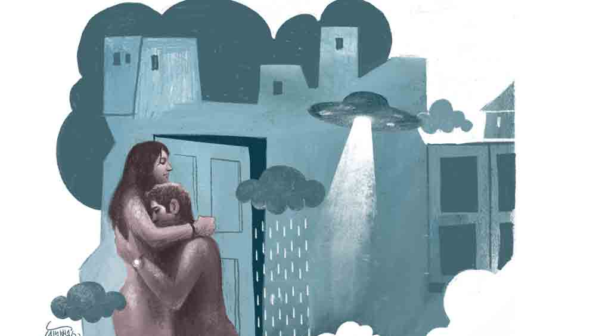

 
 <h1 align=center>ক্যামেলিয়ন</h1>
<h2 align=center>সৌমেন চৌধুরী</h2> তানিয়ার মন খারাপ। অর্ণবকে অফিসের কাজে আজ আগরতলা যেতে হবে, কাজ সেরে কাল সকালে ফিরবে। সবে তিন মাস অর্ণব আর তানিয়ার বিয়ে হয়েছে। তানিয়ারও আজ অফিস ছিল কিন্তু রাতে অর্ণব বাড়ি থাকবে না বলে আজ সে ঠিক করেছে নাইট শিফটে অফিস করবে।

তখন সন্ধে। তানিয়া তৈরি হচ্ছিল অফিস যাওয়ার জন্য। বাইরে মেঘগর্জনের শব্দ হল। বৃষ্টি হবে না কি! তানিয়া জানলা দিয়ে বাইরেটা দেখল। না, আকাশ পরিষ্কার, এতটুকু মেঘ কোথাও নেই। তানিয়া একটু অবাক হল। ড্রেসিং টেবিলের সামনে দাঁড়িয়ে চুল আঁচড়াচ্ছিল তানিয়া, ঠিক তখনই ডোরবেলটা বেজে উঠল।

‘এই সময় আবার কে এল?’ ভাবতে ভাবতে তানিয়া দরজার দিকে এগোয়। দরজা খুলেই সে অবাক হয়ে যায়! তানিয়া ভাবতেই পারছিল না অর্ণব তার সামনে। তা হলে কি ও ফ্লাইট মিস করল?

জিজ্ঞাসা করলে অর্ণব বলে, “আমাদের শিডিউলটা একটু চেঞ্জ হয়েছে, আজ আগরতলা যেতে হচ্ছে না। দু’-এক দিনের মধ্যেই যেতে হবে, তাই লাগেজ অফিসেই রেখে এলাম।”

তানিয়া মুচকি হেসে বলে, “বেশ! তবে এ বার একাই থাকো, আমি অফিস চললাম!”

অর্ণব তানিয়াকে জড়িয়ে ধরে বলল, “আজ আর আমার হাত থেকে তোমার নিস্তার নেই!”

তানিয়া অর্ণবের চোখে দুষ্টুমি ভরা এক অদ্ভুত আকর্ষণ লক্ষ করল! শেষে অর্ণবের সেই আকর্ষণের কাছে ধরা দিয়ে তানিয়া অফিসের বসকে ফোন করে জানিয়ে দিল আজ সে যেতে পারবে না। অর্ণবের হাতে কাগজে মোড়া একটা প্যাকেট! অর্ণব সেটা খুলে একটা ওয়াইনের বোতল বার করে তানিয়াকে বলল, “আজকের দিনটা আমরা সেলিব্রেট করব!”

ওয়াইন খাওয়ার সময় তানিয়া খেয়াল করে, অর্ণবের হাতে একটা অদ্ভুত ব্যান্ড! একদম অন্য রকম দেখতে। তানিয়া হাত দিয়ে দেখল জিনিসটা খুব ঠান্ডা! এর আগে এমন ব্যান্ড তানিয়া কখনও দেখেনি। প্রশ্ন করতে অর্ণব বলল, “ওটা একটা গ্যাজেট! দেহে শুগার, ব্লাড প্রেশারের মাত্রা বাড়লে অ্যালার্ট করবে। শরীর মন ঠান্ডা রাখবে।”

সে দিন সারা রাত অর্ণব তানিয়াকে ঘুমোতে দিল না। তানিয়া হাঁপিয়ে উঠলেও শরীরী খেলায় অর্ণবের এনার্জির খামতি ছিল না। তানিয়া যেন এই অর্ণবকে প্রথম দেখছে। ওকে আজ একদম অন্য রকম লাগছে। ভোর হয়ে এলেও অর্ণবের চোখে ক্লান্তির চিহ্ন নেই!

ডোরবেল বাজার শব্দ শুনে তানিয়া ঘড়ির দিকে তাকিয়ে দেখে, সকাল সাড়ে ন’টা বেজে গেছে!

‘এত বেলা হল অথচ বোঝাই গেল না! কিন্তু এখন আবার কে এল!’ ভাবতে ভাবতে ক্লান্ত শরীর নিয়ে তানিয়া দরজার দিকে এগোয়! দরজা খুলতেই থতমত খায় সে! তার সামনে দাঁড়িয়ে অবিকল অর্ণবের চেহারার এক জন! লোকটাকে একটু ক্লান্ত দেখাচ্ছে, তার সঙ্গে অর্ণবের ল্যাপটপ ব্যাগ আর লাগেজ। তানিয়ার পায়ের তলা থেকে যেন মাটি সরে যাচ্ছে! সে কী দেখছে? কাকে দেখছে? সব তালগোল পাকিয়ে যাচ্ছে।

তানিয়া দৌড়ে বেডরুমে গিয়ে দেখে সেখানে অর্ণব তখনও ঘুমোচ্ছে। অর্ণবকে ধাক্কা দিয়ে উত্তেজিত গলায় তানিয়া বলল, “শিগগির ওঠো! ঠিক তোমার মতো দেখতে এক জন...”

তানিয়ার কথা শেষ হতে না হতেই বাইরের সেই লোকটা ঘরে ঢুকে ব্যাগপত্তর রেখে জুতো খুলতে খুলতে তানিয়ার উদ্দেশে বলে, “কার সঙ্গে কথা বলছ?”

লোকটা ঘরে ঢুকে পড়েছে বুঝতে পেরে তানিয়া রেগে যায়। বেডরুম থেকে বেরিয়ে সবে লোকটাকে ধমকাতে যাবে, এমন সময় বেডরুম থেকে ‘ঝনাৎ’ করে কাচ ভাঙার একটা শব্দ আসে। তানিয়া দৌড়ে বেডরুমে গিয়ে দেখে জানলার কাচ ভাঙা, ঘরে কেউ নেই! এ কী, কোথায় গেল অর্ণব? তবে কি অর্ণব জানলার কাচ ভেঙে পালাল! কিন্তু কেন? কী হচ্ছে এ সব! তানিয়া দ্রুত ভাঙা জানলা দিয়ে বাইরে তাকায়, কিন্তু কাউকে দেখা গেল না। এ দিকে সেই অর্ণবের মতো দেখতে লোকটা তানিয়াকে বলল, “আরে কী হল! এ ভাবে জানালার কাচটা ভাঙল কী করে?”

তানিয়া বুঝতে পারে, কিছু একটা গন্ডগোল হচ্ছে। তবে কি এখন তার সামনে যে দাঁড়িয়ে আছে, সে-ই আসল অর্ণব? কাল সারা রাত যার সঙ্গে ছিল সে তবে কে? অস্বস্তি ও ভয় তানিয়াকে কুরেকুরে খেতে লাগল। তানিয়া ভাবার চেষ্টা করল এ সব তার মনের ভুল! বাথরুম, কিচেন সব দেখে নিয়ে বেডরুমটা আবার ভাল করে দেখতে থাকে তানিয়া। হঠাৎ তার চোখে পড়ে খাটের পাশে অর্ণবের হাতে থাকা সেই ব্যান্ডটা!

সেটা হাতে তোলে তানিয়া। তবে তো মনের ভুল নয়, কাল কার সঙ্গে ছিল সে! অন্য কেউ অর্ণবের রূপ ধরে এসেছিল! সব ওলটপালট হয়ে যায় তার। তানিয়া শুনেছিল, পুরাণে আছে, দেবরাজ ইন্দ্র এক মুনির রূপ ধরে সেই মুনির পত্নীর সঙ্গে লিপ্ত হয়েছিলেন! কিন্তু এখনকার যুগে এ কেমন করে সম্ভব! সে কী করে অর্ণবকে বলবে তার সঙ্গে কী ঘটেছে! এমন সময় বাইরে দরজার সামনে মানুষের গুঞ্জন শুনে তানিয়া আর অর্ণব দরজার সামনে এসে দাঁড়ায়। প্রতিবেশী কয়েক জন এসেছে। তাদের মধ্যে থেকে এক জন বলে উঠল, “আপনারা ঠিক আছেন তো?”

অর্ণব অবাক হয়ে বলে, “কেন আমাদের আবার কী হবে?”

অর্ণবদের বাড়ির উল্টো দিকেই থাকেন রমেশবাবু। তিনি বললেন, “আমি একটু আগেই অফিস যাওয়ার জন্য বেরিয়েছি, হঠাৎ আপনার জানলা ভাঙার শব্দে তাকিয়ে দেখি একটা অদ্ভুত দেখতে প্রাণী সেখান থেকে বেরিয়ে এক লাফে অমিয়দের ছাদে উঠে চলে গেল! আমরা পুলিশে ইনফর্ম করেছি।”

পাড়ার আর এক বাসিন্দা ডক্টর চক্রবর্তী এসে বললেন, “টিভিতে খবরটা দেখলাম! স্যাটেলাইট  ইমেজে দেখা গেছে, কাল সন্ধ্যার দিকে আমাদের এই চত্বরে ভিনগ্রহী একটি ইউএফও ঘোরাফেরা করছিল। এবং সেটা থেকে কিছু একটা নেমেছে কিন্তু আর ফিরে যায়নি। ‘ইসরো’ আর ‘অ্যাস্ট্রোনমিকাল সার্ভে অব ইন্ডিয়া’র গবেষকরা খোঁজার চেষ্টা করছে। প্রশাসন হাই অ্যালার্ট জারি করেছে।”

ডক্টর চক্রবর্তীর কথা শেষ হতে না হতেই সেখানে লোকাল থানার পুলিশ-সহ কয়েকজন অফিসার আসেন অর্ণব আর তানিয়ার সঙ্গে কথা বলার জন্য। অর্ণব জানায় সে কাল ছিল না, আজ সকালেই ফিরেছে। সে শুধু ওই জানলার কাচ ভাঙার শব্দ পেয়েছিল। তানিয়া কালকের সমস্ত ঘটনা চেপে গিয়ে শুধু হঠাৎ জানলা ভাঙার ঘটনাটাই বলে। সে সত্যিটা বলবেই বা কী করে! ফরেনসিক টেস্টের জন্য তানিয়াদের বেডরুম ভাল করে চেক করা হয়।

তানিয়ার খেয়াল হয় সেই ব্যান্ডটার কথা। সেই ব্যান্ডটা ল্যাবে টেস্ট করে হয়তো অনেক কিছু জানা সম্ভব হবে! তানিয়ার হাতের মুঠোতেই ছিল সেই ব্যান্ডটা! এক বার মুঠো খুলে সে দেখে নিল ব্যান্ডটাকে। তার সঙ্গে ঘটা গত রাতের কথা ভেবে চোয়াল শক্ত করে সে! তানিয়া ভাবে, সে নিজেই শাস্তি দেবে সেই শয়তানটাকে, এই ব্যান্ডটা ছাড়া ভিনগ্রহীটার কাছে বিশেষ কিছু ছিল না। এই ব্যান্ডের মাধ্যমেই হয়তো ওরা নিজেদের মধ্যে যোগাযোগ স্থাপন করে। এই ব্যান্ড নিতে ওকে আবার আসতে হতে পারে, তখনই মোক্ষম সুযোগ প্রতিশোধ নেওয়ার।

তানিয়া এটাও ভাবল যে, সেই ভিনগ্রহীটা অন্য কারও রূপ ধারণ করে একই ভাবে অন্য কারও ক্ষতি করবে না তো? তবে কি তার বলে দেওয়া উচিত সব কিছু! কিন্তু তা হলে তো তাকেও অনেক প্রশ্নের সম্মুখীন হতে হবে! অর্ণব কি সব মেনে নেবে! এ সব  ভেবে আপাতত আর কিছু না বলাই ঠিক মনে করল তানিয়া। সেই আধিকারিকরা কিছু একটা ভেবে সাদা পোশাকের কয়েক জন গার্ড অর্ণবদের এলাকায় পাহারার জন্য রেখে চলে গেলেন।

বিকেল শেষ হতে চলেছে, অর্ণব কাছেই একটা দোকানে গেছে। তানিয়া দরজার সামনে দাঁড়িয়ে বাড়ির সামনে বাচ্চাদের খেলা দেখছিল। সেই সময় একটা বাচ্চা এসে তানিয়াকে বলল, “আন্টি, একটু জল দেবে!”

তানিয়া হাসিমুখে বাচ্চাটার মাথায় হাত বুলিয়ে ঘরে গেল জল আনতে। গ্লাসে জল ঢালার সময় বেডরুম থেকে খুটখাট শব্দ পেল। তানিয়া চুপিচুপি বেডরুমের দরজার আড়াল থেকে দেখল বাচ্চাটা ঘরে ঢুকে কী যেন খুঁজছে। তানিয়া রান্নাঘরে ফিরে গেল, তার পর বেডরুমে ঢুকে বাচ্চাটাকে বলল, “তুমি কি এটা খুঁজছ?”

তানিয়ার বাঁ হাতে সেই ব্যান্ডটা আর তার ডান হাতে একটা ছুরি শাড়ির আঁচলে ঢাকা! বাচ্চাটা এগিয়ে এসে সেই ব্যান্ডটা ধরতে যায়... 

একটা প্রচণ্ড চিৎকার শুনে পাহারায় থাকা গার্ড দৌড়ে প্রবেশ করে তানিয়ার বেডরুমে। তারা দেখল একটা বিকট দেখতে বড় গিরগিটির মতো প্রাণী মাটিতে পড়ে ছটফট করছে ক্ষতবিক্ষত শরীরে! তানিয়া ছুরি দিয়ে এলোপাথাড়ি আঘাত করছে তাকে, কিন্তু প্রাণীটার দেহ থেকে রক্তপাত হচ্ছে না। কিছু ক্ষণের মধ্যেই সেই দেহটা নিথর হয়ে গেল। সকলে অবাক হয়ে দেখল প্রাণীটার মাথাটা তেকোনা, পিঠ ধনুকের মতো বাঁকা, চার হাত পা, লেজটা গোল করে বিড়ে পাকানো, হঠাৎ ছোঁয়া লাগলে কেন্নো যেমন কুণ্ডলী পাকিয়ে যায়, ঠিক তেমন। ভিনগ্রহীর দেহটা আস্তে আস্তে ছোট হয়ে আসছে।

তানিয়া নিজের মতো করে একটা ঘটনা সাজিয়ে সেই গার্ডদের বলল। কিন্তু সে এ বারও সেই ব্যান্ড সম্পর্কে কাউকে কিছু জানাল না। তানিয়ার দেওয়া ঘটনার বিবরণ শুনে কারওই বুঝতে অসুবিধে হল না যে, সেই ভিনগ্রহীটাই বাচ্চার রূপ ধরে তানিয়াদের বেডরুমে প্রবেশ করেছিল! তত ক্ষণে অর্ণবও চলে এসেছে, সে তানিয়ার কাণ্ড শুনে অবাক। তবে এক কথায় সবাই তানিয়ার সাহস ও বুদ্ধিমত্তার ভূয়সী প্রশংসা করল। ভিনগ্রহীর দেহটা ধীরে ধীরে ছোট হতে হতে মিলিয়ে গেল। অর্ণব ও তানিয়াকে বলা হল তারা যেন কিছু দিন এই বাড়িতে না থাকে। একটা ভিনগ্রহী এই বাড়িতে এসেছিল, তাই সেই গ্রহ থেকে আর কেউ যদি এখানে খোঁজ করতে আসে! অর্ণব আর তানিয়ার নিরাপত্তার কথা ভেবেই এই সিদ্ধান্ত।

অর্ণব ঠিক করে, সপ্তাহ খানেকের জন্য তানিয়াকে নিয়ে কোথা থেকে ঘুরে আসবে। তানিয়ার প্রতিশোধ নেওয়া শেষ, তাই বেড়াতে যাওয়ার আগে সেই ব্যান্ডটাকে সে বারান্দায় সাজানো একটা ফুলগাছের টবে লুকিয়ে রেখে গেল।

সাত দিন পর অর্ণব আর তানিয়া ফিরে এল। ওদের জীবন আবার আগের মতো স্বাভাবিক ভাবে চলতে লাগল। সেই ঘটনার দশ মাস পর তানিয়া একটা পুত্রসন্তানের জন্ম দিল।

বছর ছয়েক পরের কথা। তানিয়া আর অর্ণবের একমাত্র ছেলে ঋজু বারান্দায় খেলছিল। অর্ণব আর তানিয়া ড্রয়িংরুমে বসে টিভি দেখছিল। হঠাৎ বাইরে মেঘ ডাকার মতো আওয়াজ শুনে চমকে ওঠে তানিয়া। এই আওয়াজটা সে শুনেছিল প্রায় সাত বছর আগের এক সন্ধেয়। তানিয়ার চোখে ভেসে ওঠে সেই দৃশ্যপট! তবে কি আবার...

তানিয়ার বুকটা ধড়াস করে ওঠে। ঋজু কোথায়? তানিয়ার খেয়াল হয় ঋজু বারান্দায় খেলছিল, দৌড়ে সেখানে যায় তানিয়া! কিন্তু কোথায় ঋজু? ওর চোখ যায় ক্যাকটাসের টবের দিকে, সেখানকার মাটিটা অনেকটা খোবলানো! টবের চার দিকে মাটি ছড়িয়ে আছে!

তানিয়া “ঋজু...ঋজু...” বলে ডাকতে শুরু করে। কী মনে হতে সে ছাদের দিকে দৌড়য়, তার পিছু নেয় অর্ণবও। ওরা ছাদে এসে দেখে ছাদের দরজা খোলা। সারা ছাদটা আলোয় ভরে গেছে! ছাদের কিছুটা উপরে গোল প্লেটের মতো বিশাল একটা জিনিস শূন্যে ভেসে রয়েছে। সেটা থেকেই আলো বেরোচ্ছে!

তানিয়া ও অর্ণব দু’জনেরই বুঝতে অসুবিধে হয় না যে এটাই সেই ভিনগ্রহী যান! ছাদের মাঝখানে একটা নীল রঙের আলোর বলয় সৃষ্টি হয়েছে, যেটা আসছে সেই ইউএফও থেকে, আর তার ঠিক মাঝখানে ঋজু দাঁড়িয়ে আছে। তানিয়া আর অর্ণব দৌড়ে গিয়ে ঋজুকে আনতে গেল, কিন্তু তারা শত চেষ্টা করেও সেই নীল বলয় ভেদ করে ঋজুর কাছে পৌঁছতে পারল না। একটা অদৃশ্য পাঁচিল যেন তাদের ঋজুর কাছে যাওয়া থেকে আটকে দিচ্ছে। তানিয়া এ বার চমকে উঠল। সে দেখল, ঋজুর হাতে সেই ব্যান্ডটা বাঁধা, যেটা সে সেই টবের মধ্যে লুকিয়েছিল প্রায় সাত বছর আগে। এই ব্যান্ডটা নষ্ট করে দেওয়া অথবা লোকাল থানায় জমা দেওয়া উচিত ছিল। এটার কথা তানিয়ার একেবারেই মনে ছিল না। ঋজু হয়তো খেলতে খেলতে টবের মধ্য থেকে ব্যান্ডটা পেয়ে হাতে পরে ফেলেছে, আর সেখান থেকেই এই বিপত্তি!

তানিয়া আর অর্ণবের চিৎকার ঋজুর কানে পৌঁছচ্ছে না। ওরা অসহায় হয়ে দেখল, একটা সাদা আলোর মই ইউএফও থেকে ঋজুর সামনে নেমে এল, আর ঋজু সেটা বেয়ে উঠে পড়ল। নিমেষে সমস্ত আলো নিভে গেল, আর তার পরেই প্রচণ্ড শব্দ! পরমুহূর্তেই সব ফাঁকা...

তত ক্ষণে চার দিক লোকে লোকারণ্য। অর্ণব দেখল, তার পাশে মাটিতে বসে পড়েছে তানিয়া। তার চোখে পাগলের দৃষ্টি। সে বিড়বিড় করে কী যেন বলছে। বিল্ডিংয়ের বহু লোক তত ক্ষণে ছাদে উঠে এসেছে। গোলমালে অর্ণব শুনতে পেল না অপ্রকৃতিস্থ তানিয়া মুখস্থর মতো বার বার বলে যাচ্ছে, “ওদের জিনিস, ওরা নিয়ে গেল...ওদের জিনিস...”