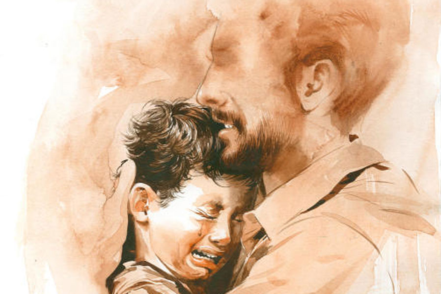

 
 <h1 align=center>ক্ষুদ্র</h1>
<h2 align=center>অভিজিৎ বেরা</h2> এ গল্প যাকে নিয়ে, সে এক ছোট্ট মানুষ। বছর ছয় কি সাত। আমার অফিসের সামনে যে চা-দোকানি, তার নাতি। অফিসের সর্বত্র তার অবাধ বিচরণ। কাজ-অকাজ, মিটিং, টিফিন যে কোনও সময় যে কোনও ঘরে সে ঢুকে পড়ে। ওকে কেউ বারণও করে না। আমি তো নয়ই। বরং ওর জন্য আমার পাশেই চেম্বারে আর একটা চেয়ার এনে রেখেছি। যাতে ও এলে ওখানে বসতে পারে।

আমি এখানকার বিডিও। আমার সঙ্গে দেখা করতে নানা মানুষ আসেন নানা সমস্যা নিয়ে। প্রথমে সবাই ভাবে ও বোধ হয় আমার ছেলে। কিন্তু চেহারার মালিন্য দেখে সন্দেহ হয়। তারা বাইরে বেরিয়ে একে ওকে জিজ্ঞেস করে।

“সাহেবের পাশে বাচ্চা ছেলেটি কে গো? সাহেবের ছেলে না কি?”

স্টাফরা ওদের কথা শুনে হাসে।

“আরে না না। সাহেবের তো বিয়েই হয়নি। ও অনুপম। কার্তিকদার নাতি। কার্তিকদাকে চেনো না? আরে চা দেয় গো! গেটের উল্টো দিকে দোকান। বাচ্চাটা সাহেবকে খুব ভালবাসে, তাই গিয়ে বসে থাকে।”

“ওর জন্য আলাদা চেয়ার?”

“ও, তুমি শোনোনি গল্প?”

“না। কী গল্প?”

“আরে এক দিন সাহেব চেম্বারে ঢুকে দেখে অনুপম সাহেবের চেয়ারে গিয়ে উঠে বসেছে। আর খালি গোল হয়ে ঘুরছে।”

“তার পর?”

“তার পর আর কী? সাহেব যত বলে, ‘অনুপম নেমে এসো।’ সে তত বলে, ‘নামব না, কী করবি কর।’”

“অ্যাঁ? সাহেবকে তুইতোকারি!”

“হ্যাঁ। আর কী বলে শুনলে তো তোমার মাথা খারাপ হয়ে যাবে।”

“আবার কী গো?”

“বলে, ‘আজ থেকে আমি সাহেব। তুই বাইরে গিয়ে বোস।’”

“বাচ্চাটার এত সাহস?”

“খুব ডানপিটে! তার পর সাহেব অনেক কষ্টে ভুলিয়ে ভালিয়ে ওকে চেয়ার থেকে নামিয়ে বাড়ি পাঠাল।”

“তা আলাদা চেয়ার কি তার পরই এল?”

“না। সে আর এক দিনের ঘটনা।”

“আরও ঘটনা আছে?”

“আছে। আর এক দিন সাহেবের ঘরে লোকজন আছে। অনুপম সোজা গিয়ে সাহেবকে বলল, ‘এই সাহেব, ওঠ। আমি চেয়ারে বসব। তোর মোবাইলে গেম খেলব।’”

“ও বাবা! তাই নাকি?”

“হ্যাঁ। তা সাহেব ওকে বলল, “পরে খেলো অনুপম। এখন কাজ করছি।” শুনে সে কী বলল জানো? বলল, ‘আজ অনেক কাজ করেছিস। এ বার আমি কাজ করব। তুই উঠে দাঁড়িয়ে থাক।’”

“সর্বনাশ। এত লোকের সামনে?”

“তা হলে আর বলছি কী! সে দিন সাহেব তো তাকে কিছুতেই ঘর থেকে বার করতে পারে না। সে এক বার বলে, ‘মোবাইল দে। গেম খেলব।’ এক বার বলে, ‘ঠান্ডা হাওয়া খাব।’ এক বার বলে, ‘তুই চেয়ারে বসলে আমি কোথায় বসব? আমি কি দাঁড়িয়ে থাকব নাকি? আমার পা ব্যথা করবে না? জানিস না, আমার ছোট ছোট পা।’ শেষে সাহেব ওকে ওই চেয়ারটার ব্যবস্থা করে দিলেন। তার পর থেকে ও গিয়ে সটান ওখানে উঠে বসে থাকে।”

কাজ সেরে লোকজন বাড়ি চলে যায়। ক্রমে এলাকায় প্রচার হয়ে যায় অনুপমের কথা। লোকজন আমার সঙ্গে দেখা করতে এলে ওর জন্য চকলেট বা বিস্কুট নিয়ে আসে। অনুপম সঙ্গে সঙ্গে প্যাকেট খুলে খাওয়া শুরু করে দেয়। কিন্তু কখনও একা খায় না। আমাকে তো দেয়ই। সঙ্গে আমার চেম্বারে যারা থাকে তাদেরকেও অফার করে।

“ও দাদা, একটু চকলেট নেবা না?” এমন মুখ করে বলে যে, কেউ আর না বলতে পারে না।

ব্লকের নানা জায়গায় আমাকে যেতে হয়। অনুপম ছায়াসঙ্গী হয়ে ঘোরে। আমি ওকে বলি, “অনুপম, এ বার একটু পড়াশোনা করো।”

ও অধৈর্য হয়ে জোরে জোরে মাথা ঝাঁকিয়ে বলে, “আমার পড়তে একদম ভাল লাগে না সাহেব।”

আমি বলি, “না পড়লে বড় হবে কী করে?”

“আমি বড় হতে চাই না চাই না চাই না।”

“তা হলে তো এ রকম ছোটই থেকে যাবে।”

“আমি সব সময় ছোটই থাকতে চাই আর মোবাইলে গেম খেলতে চাই। আর কিচ্ছু না।”

“মোবাইলে বেশি গেম খেলা ভাল নয় অনুপম।”

“ভাল নয় তো নয়। আমি তাও খেলব।”

“তা হলে কিন্তু কেউ তোমার সঙ্গে কথা বলবে না। ভাল হবে তো?”

ও যেতে যেতে থমকে দাঁড়ায়। আমার দিকে ছলছল চোখে তাকিয়ে বলে, “তুইও বলবি না?”

আমি ওর মাথায় হাত বুলিয়ে বলি, “বলব তো। সবাই বলবে। কিন্তু তোমাকে যে তার জন্য পড়াশোনাটাও করতে হবে।”

ও বেজার মুখে বলে, “আচ্ছা বেশ। করব তা হলে।”

পরদিন থেকে ওর অফিসে আসা একটু কমে। কিন্তু টিফিনের সময় এসে ঠিক হাজির হয়। এসেই সটান বলবে, “আজ কী এনেছিস দেখা।”

কোয়ার্টার্সে যে দিদি রান্না করেন, তিনি টিফিনে রোজই কিছু না কিছু করে দেন। অনুপমের কথা তিনিও শুনেছেন। তাই একটু বেশি করেই দেন। সমস্যা হয় না। তবে ও শুধু আমার টিফিনেই সন্তুষ্ট হয় তা নয়, মাঝে মাঝে স্টাফদের টিফিন রুমেও হামলা করে। কিছু পছন্দ হলে তার ভাগ চাই-ই চাই। কেউ তাতে কিছু মনেও করে না।

অবশ্য এর পরের ঘটনাটা একটু অন্য রকম। সে দিন আমার অফিসে ঢুকতে প্রায় দুপুর। সকাল সকাল একটি নাবালিকার বিয়ের খবর পেয়ে ছুটে যেতে হয়েছিল এক গ্রামে। মেয়েটি লুকিয়ে আমাকে ফোন করেছিল। সে পড়তে চায়। কিন্তু বাবা-মা রাজি নয়। অনেক কষ্টে বাড়ির লোকদের বুঝিয়ে ভয় দেখিয়ে বিয়ে রোখা গেছে। বড়ই ক্লান্ত। স্নান করার সময় পর্যন্ত পাওয়া যায়নি। চেম্বারে ঢুকে এসি অন করে পার্স ড্রয়ারে রেখে টয়লেটে ঢুকি। অ্যাটাচড টয়লেট। মুখে ঘাড়ে ভাল করে জলের ঝাপটা দিই। ফ্রেশ হয়ে চেয়ারে এসে বসি। কলিং বেলে চাপ দিই।

মালতীদিকে বলি এক কাপ চা দিতে। সঙ্গে দুটো বিস্কুট। দেখি টেবিল থেকে মোবাইল গায়েব। আশ্চর্য! এই তো নামিয়ে গেলাম। ড্রয়ারে রাখিনি তো? নাহ। শুধু পার্স রাখা। তবে কি গাড়িতে ফেলে এলাম?

ল্যান্ডফোন থেকে ড্রাইভারকে ফোন করলাম, “হরদা, দেখো তো সিটে মোবাইল পড়ে আছে কি না...”

সে দেখে বলল “ কই না তো স্যর! কিছু নেই।”

তা হলে কি বিয়েবাড়িতেই ফেলে এলাম? নাহ! স্পষ্ট মনে আছে ওখান থেকে বেরিয়ে এসডিও স্যরকে ফোন করে খবর জানিয়েছিলাম। তবে? কলিং বেলে চাপ দিলাম। বাইরে যে পিওন বসেন, তাঁকে ডাকলাম।

তিনি বললেন, “কাউকে তো ঢুকতে দেখিনি স্যর। এক বার মাত্র মালতী ঢুকেছিল।”

“প্রকাশবাবুকে বলুন না সি সি ক্যামেরাটা এক বার দেখতে। যাবে কোথায় জিনিসটা?”

“আমি দেখে জানাচ্ছি স্যর।”

ফুটেজে দেখা গেল একটা ছোট্ট মানুষ আমার ঘরে ঢুকে প্রায় সঙ্গে সঙ্গেই দৌড়ে বেরিয়ে গেল। অনুপম! সেই জন্য কারও নজরে পড়েনি। প্রকাশবাবুরা একটু পরেই মোবাইল সমেত ওকে নিয়ে হাজির হলেন। সঙ্গে আরও লোকজন।

“এই যে স্যর আপনার অনুপম। দাদুর দোকানে বসে গেম খেলছিল।”

আমি কিছু বললাম না। মোবাইলটা হাতে নিয়ে ড্রয়ারে ঢুকিয়ে রাখলাম। মালতীদি ওর মাথায় একটা চাঁটি মেরে বলল, “সাহেবের মোবাইল কেন চুরি করেছিলি বল?”

সে নিরুত্তর। মাথা নিচু করে দাঁড়িয়ে আছে। চোখ দিয়ে টসটস করে জল গড়িয়ে পড়ছে। ভয়ে ঠকঠক করে কাঁপছে। পায়ে আঙুলে আঙুল জড়িয়ে পেঁচাচ্ছে।

মালতী বলেই চলল, “এরা স্যর ছোট জাত। এদের মাথায় তুলে ভুল করেছেন। যতই ভালবাসুন, রক্ত আর বদলাবে না।”

ওর দাদু পিছনে দাঁড়িয়েছিল। সে এসে সটান আমার পা জড়িয়ে ধরল, “স্যর, বাচ্চা ছেলে, মাফ করে দিন স্যর। মা-মরা ছেলে। ভাল করে নজর করতে পারি না। আর কোনও দিন ও অফিসে ঢুকবে না। এই সবার সামনে বলছি। এ বারের মতো মাফ করে দিন স্যর।”

মালতী আবার অনুপমের মাথায় চাঁটা মেরে বলল, “বল। কেন নিয়েছিলি? ভাব দেখো, যেন ভাজা মাছটি উল্টে খেতে জানে না।”

আমি ধমক দিয়ে বললাম, “আঃ মালতীদি, কেন বাচ্চাটাকে মারছ?”

ধমক খেয়ে মালতীদি একটু চুপসে গেল, বলল, “লাই দিয়ে দিয়ে মাথায় তুলেছেন স্যর। এখনই শাসন করা দরকার। না হলে এ বাচ্চা বড় হয়ে ডাকাত হবে।” বলেই গজগজ করতে করতে চেম্বার থেকে বেরিয়ে গেল। আমি সবাইকে বললাম বাইরে যেতে। অনেক কাজ জমে রয়েছে। নাবালিকার বিয়ের রিপোর্টটা বানাতে হবে। ডিএম ম্যাম চেয়ে পাঠিয়েছেন।

তার পর থেকে অনুপমের অফিসে আসা প্রায় বন্ধই হয়ে গেল। ওর দাদুর জন্য নয়। তার সাধ্য ছিল না ওকে আটকানোর। ও নিজেই আর আসত না। অভিমানে না লজ্জায়, তা জানি না। তবে লক্ষ করতাম, রোজ সকালে যখন অফিসে ঢুকি বা কোথাও বেরোই, ও বাড়ি থেকে দৌড়ে দোকানে এসে ঢোকে। দোকানটা ওদের বাড়ির লাগোয়া। আর কাচের বয়ামের আড়াল থেকে লুকিয়ে লুকিয়ে আমাকে দেখে। আমি ওকে না দেখার ভান করে গাড়িতে গিয়ে উঠি। গাড়ি চলে গেলে ও ফের বাড়িতে ঢুকে যায়।

ধীরে ধীরে অফিসের সবাই ওর কথা ভুলে গেল। আমিও নানা কাজে ব্যস্ত হয়ে পড়লাম। বিডিওর কাজ যেন শেষই হতে চায় না। একটা না একটা ঝামেলা ঠিক লেগেই আছে। তার উপরে সামনে পঞ্চায়েত ভোট। তখন যে কী অবস্থা হবে, ভেবেই কূলকিনারা পাই না। এই অবস্থায় কয়েক মাস গেল।

গ্রামবাংলায় ঋতু পরিবর্তন খুবই স্পষ্ট। গ্রীষ্ম শেষে বর্ষা নেমেছে। মাঠের পর মাঠ সবুজ হয়ে উঠেছে। গাছে গাছে পাখপাখালির উচ্ছ্বাস। গাড়িতে গেলে এখন এসি বন্ধ করে জানালা খুলে দিই। প্রাণ ভরে শ্বাস নিই। এত অক্সিজেন শহরে কোথায়? গ্রামে গ্রামে পঞ্চায়েত ভোটের দামামা বেজে গেছে। যদিও এখনও দিন ঘোষণা হয়নি।

সে দিন একটা পঞ্চায়েত অফিস থেকে বেরিয়ে অফিসের দিকে যাচ্ছি, দেখি এসডিও স্যরের ফোন, “শোনো, তোমার আড়শা ব্লকে ট্রান্সফার হয়েছে। পুরুলিয়ায়। পারলে কালই বেরিয়ে পড়ো।”

“সে কী! এখানে তো অনেক কাজ বাকি। তা ছাড়া সামনেই ভোট।”

“আরে, ভোটের জন্যই তো ট্রান্সফার। আজ যতটা পারো সেরে নাও। মেলে অর্ডার পাঠিয়ে দিয়েছি।”

আর কিছু বলার আগেই ফোনটা কেটে গেল। মনটা বিষণ্ণ হয়ে ওঠে। যতই গণ্ডগ্রাম হোক, জায়গাটা ভাল লেগে গিয়েছিল আমার। যেতেই যখন হবে, মায়া বাড়িয়ে লাভ নেই। ভাসমান উদ্ভিদের শিকড় বেশি গভীরে না যাওয়াই ভাল। আমি অফিসে গিয়ে সইসাবুদ যা বাকি আছে সেরে ফেলি। বড়বাবু তড়িঘড়ি করে একটা ফেয়ারওয়েলের ব্যবস্থা করেন। কিন্তু আমার সময় নেই। কোয়ার্টার্সে গিয়ে সব গোছাতে হবে।

সন্ধের আগেই বেরিয়ে পড়ি। অফিস থেকে বেরিয়ে গাড়ির দিকে হাঁটছি। সমস্ত স্টাফরা আমার পেছন পেছন আসছেন। গিফট, ফুলের বোকে, সব গাড়ির ডিকিতে তুলে দেওয়া হচ্ছে। হঠাৎ কার্তিকদার দোকান থেকে অনুপম তীব্র বেগে বেরিয়ে এসে আমার কোমর জড়িয়ে ধরে, “কোথায় যাচ্ছিস সাহেব? কোথায় যাচ্ছিস? বল, বল...” সে তার ছোট্ট দু’হাতে আমাকে মারতে থাকে। আমি ওকে কোলে তুলে নিই। তার দু’চোখ বাষ্পাচ্ছন্ন। সে কাঁদতে কাঁদতে বলে, “তুই যাস না সাহেব। আমায় ছেড়ে কোথাও যাস না।”

আমি ওর চোখ মুছিয়ে বলি, “ছিঃ! কাঁদে না অনুপম। যেতে তো হবেই। এটাই  নিয়ম। কিন্তু আবার আসব তো আমি। ফোন করব। তুমি কেঁদো না আর।”

কিন্তু তার দু’চোখে অবিশ্রান্ত ধারা কিছুতেই বন্ধ হয় না, “আমি তোর মোবাইল চুরি করিনি সাহেব। বিশ্বাস কর, শুধু গেম খেলার জন্য একটু নিয়েছিলাম।”

অবুঝ শিশুর এত দিনের অভিমান বাঁধভাঙা নদীর মতো দু’চোখ ছাপিয়ে গড়িয়ে পড়ে। আমার বুকের কাছে জামা ভিজে ওঠে। সে তার ছোট্ট দু’হাতে আমাকে শক্ত করে আঁকড়ে ধরে, “আমি চুরি করিনি। সত্যি বলছি।”

আমি ওকে শান্ত করার চেষ্টা করি, “হ্যাঁ জানি, তুমি চুরি করোনি। আমি বিশ্বাস করেছি। তুমি মন দিয়ে পড়াশোনা কোরো, কেমন?”

“না। করব না, করব না, করব না। বল, তুই যাবি না?”

দূরে কোথাও বিসমিল্লার সানাই বেজে ওঠে। কী রাগ? এত করুণ! প্রশাসনের চাকরি করি। অতিরিক্ত আবেগ দেখানো চলে না। তবু আমার দু’চোখের কোণ চিকচিক করে ওঠে। আমি ওর গায়ে-মাথায় হাত বুলিয়ে শান্ত করার চেষ্টা করি।

“শান্ত হও অনুপম। এত কেঁদো না। এ বার নামো। আমায় যেতে দাও...” ওর দু’হাত ছাড়িয়ে নীচে নামিয়ে দিই। সে কিছুতেই নামতে চায় না। আরও জোরে কেঁদে ওঠে। কিন্তু ছোট্ট হাতে জোরও পায় না। নীচে নেমে সে আমার পা জড়িয়ে ধরে।

“যাস না সাহেব। তোর পায়ে পড়ি। তুই যাস না, যাস না, যাস না...”

আমি যতই ছাড়াতে যাই, সে সারা শরীরের সমস্ত শক্তি দিয়ে আমার পা আঁকড়ে ধরে রাখে। আমি হাঁটতে পারি না। বড়বাবুরা এগিয়ে এসে ওকে সরিয়ে নেন। সে তীব্রস্বরে কেঁদে ওঠে।

“যাস না রে সাহেব। আমায় ছেড়ে যাস না।”

আমি এগিয়ে গিয়ে গাড়িতে উঠি। হরদা গাড়ি স্টার্ট করে দেয়। আমি পিছনের কাচ দিয়ে ওকে দেখি। যেন সেই অবোধ দুরন্ত বালকের প্রাণভ্রমরা আমি। আমার চলে যাওয়ায় তার প্রাণের সংশয় তৈরি হয়েছে। সে বড়বাবুদের হাত ছাড়িয়ে গাড়ির পেছন পেছন দৌড়ে আসতে থাকে। দু’হাত বাড়িয়ে “সাহেব… সাহেব…” বলে ডাকতে থাকে। আমার দু’চোখ ছাপিয়ে জল ভরে আসে। ক্ষুদ্র মানুষটি আরও ক্ষুদ্র হতে হতে চোখের ঝাপসায় পেছনে মিলিয়ে যায়।

আবার কবে এখানে ফেরা হবে জানি না। তত দিনে হয়তো বড় হয়ে যাবে অনুপম। আমায় কি তখনও মনে থাকবে ওর? কে জানে!