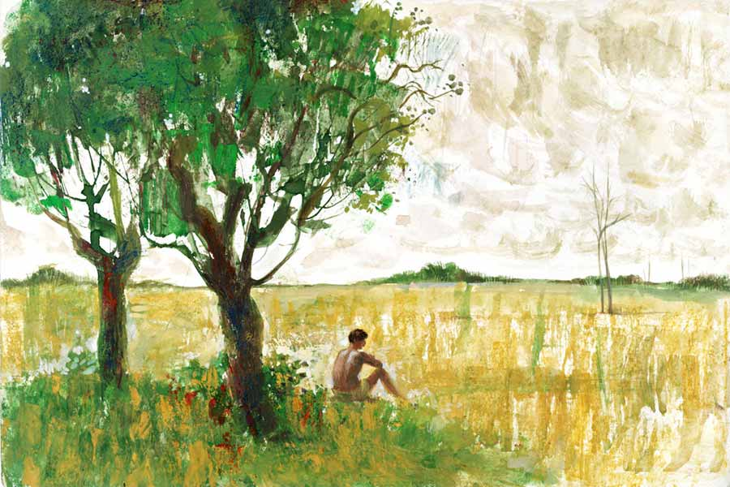

 
 <h1 align=center>খরালি</h1>
<h2 align=center>ইমদাদুল হক মিলন</h2> 

জামাল হালদার বাড়ি ফিরল ভরদুপুরে। বলদ দুটো মাঠে চরাতে দিয়ে সে বসেছিল নিজের জমিটুকুর পাশে। সেখানে তিন-চারটে হিজল গাছ। গাছের ছায়ায় বসেও আরাম হয়নি। সকাল থেকেই সূর্য যেন আগুনের গোলা। দেশগ্রাম পুড়িয়ে ছারখার করছে। এমন রোদ, গরম জন্মে দেখেনি লোকে। মাঠঘাট খাঁ খাঁ। গরু-ছাগলগুলো পর্যন্ত হাঁসফাঁস করছে। মাঠ ছেড়ে হিজলের ছায়া খুঁজছে। হালদারের বলদ দুটো খানিক মাঠে চরেই ফিরে এসেছে। তার পাশে বসে জাবর কাটছিল।

এলাকার লোকে এ বার ব্রি-২৯ বুনেছে। ব্রি-২৮ পাকে বৈশাখের শুরুতে। ২৯ পাকে মাসের শেষ দিকে। মাস দেড়েক পর ধান পাকবে। থোড় উঁকি দিচ্ছে। এ সময় গোড়ায় পানি থাকতে হয়। পানি কই? মাটি ফুটিফাটা। রোদ শুষে নিয়েছে সব পানি। পোয়াতি ধান ধুঁকতে শুরু করেছে। রোদের তেজে বুঝি শুকিয়ে চিটা হবে, খড়নাড়া হবে।

মাঠের যে দিকে তাকাও, একই দৃশ্য। বিলের ধারের খাল শুকিয়ে গেছে। আগে হাতে-টানা সেচ ছিল। এখন চলে পাম্প মেশিন। পানিই যদি না থাকে, মেশিন দিয়ে কী হবে?

হিজলতলায় বসে এ সব ভেবেছে হালদার। পরনে মালকোঁচা দেওয়া লুঙ্গি। মাজায় বাঁধা গামছা। হোগলাপাতার মাথলাটা হাতের কাছে। হালদার অসহায় চোখে মাঠের দিকে তাকিয়ে ছিল। হাওয়া নেই। দূরে তাকালে মনে হয় রোদ যেন ভেসে ভেসে আসছে। ধানগাছ চুটপুট চুটপুট শব্দে পুড়ছে। হিজলতলায় বসে সেই শব্দ পাচ্ছিল হালদার।

এই অবস্থা আর কয়েক দিন চললে সর্বনাশ হয়ে যাবে। মাঠের ধান চিটা হয়ে ঝরে যাবে মাঠে। কৃষকের মাথায় হাত। না খেয়ে মরণ। আল্লাহতায়ালার দুনিয়ায় এ কোন গজব নেমে এসেছে? এ তো দোজখের আগুন! এমন খরালিও হয়?

এ সব ভাবতে ভাবতে বাড়ি ফিরেছে হালদার। কিসানির নাম পরিবানু। স্বামী বাড়ি ফিরেছে দেখে সে এক মগ পানি নিয়ে এল। মাটির ঠিলায় রাখা পানি ঠান্ডা থাকে। আজ সেই পানিও গরম। খেয়ে আরাম পেল না হালদার। বসতঘরের চালে ঝুঁকে আছে বড় আমগাছটা। বিস্তর গুটি ধরেছিল। ক’দিন ধরে টিনের চালে টুপটাপ শব্দে ঝরছে আমের গুটি। কিচ্ছু থাকবে না এ বার। এই খরালি সব মিসমার করে দেবে।

স্বামীকে বসে থাকতে দেখে পরিবানু বলল, “কী হইল? কত বইয়া থাকবা? নাইয়া আসো। ভাত খাও।”

হালদার কিসানির মুখের দিকে তাকাল, “পরে যাই। বয়, কথা কই।”

ঘরের দাওয়ায় সামান্য ছায়া। স্বামীর পাশে সেই ছায়ায় বসল পরিবানু। এই অঞ্চলে আগে ছিল টিনের ঘর। গরিববাড়ির ঘরগুলো একচালা, দোচালা। চটিবাঁশের বেড়া আর কাঠের দরজা। অবস্থাপন্ন লোকের বাড়িতে চৌচালা ঘর। পাটাতন করা দোতলা। একতলা পাটাতন ঘরও বিস্তর। ছিল নিম্নাঞ্চল। বছরে পাঁচ-ছ’মাস মাঠঘাট ডুবে থাকে। বর্ষায় বাড়ির উঠোনে আসে পানি। এ জন্য মাঠ থেকে ভিটেবাড়ি অনেক উঁচুতে। পুকুর কেটে বাড়ি বাঁধা হয়। তার উপর উঁচু খুঁটির পাটাতন করা ঘর। যাতে বর্ষায় ঘরে পানি ঢুকতে না পারে। তবে উঠোন পালানে ঢুকত। গরিব মানুষের ঘরেও ঢুকত। এই অঞ্চলে খাল-বিলের অভাব নেই। বর্ষার মুখে পদ্মা উপচে খাল দিয়ে ঢোকে পানি। সঙ্গে প্রবল বৃষ্টি! মাঠঘাট তলিয়ে পানি উঠে যায় বসতভিটায়। আজকাল সেই বর্ষা নেই। পানি নেই।

তখন দু’রকমের ধান হত। আমন আর আউশ। আউশ পাকে বর্ষাকালে। আমন হেমন্তে। কী সুন্দর সুন্দর নাম ধানের। সোনাদিঘা, লক্ষ্মীদিঘা। কত সুখের দিন গৃহস্থের। গোলাভরা ধান। গোয়ালভরা গরু। পুকুরভরা মাছ। এমন খরালি কি তখন হয়েছে!

পরিবানুর দিকে তাকিয়ে হালদার বলল, “তামুক দে।”

“অহন আবার তামুক খাইবা?”

“খাই এক ছিলিম। মনটা ভাল না। তর লগে কথা কইয়া মন জুড়াই।”

পরিবানু নারিকেলের হুঁকোয় তামাক সাজিয়ে আনল। হুঁকোয় দু’-তিনটে টান দিয়ে হালদার বলল, “তর হাত ধইরা মেহেরপুর থিকা এই দেশে আইছিলাম! আমার তখন একুশ-বাইশ বছর বয়স। তর হইব ষোলো। যাইতে চাইছিলাম বরিশাল। ধানের দেশ। আইসা পড়লাম বিক্রমপুর। এইটাও ধানের দেশ। কত সুখের দিন আছিল। খরালিকালেও গরম লাগত না। চইত-বইশাখ মাসেও আরাম। বর্ষাকালে বিষ্টি আর মাছ আর আউশ ধান। আউশ চাউলের ভাত, লগে ট্যাংরা মাছের ঝোল! আহা কী স্বাদ! অঘ্রাণ মাসে দেশগেরামে আমোদের সীমা নাই। আমন কাটা চলতাছে। মাড়াই হইতাছে। মেহেরপুরে কয় নবান্ন। এই অঞ্চলে হইল খুদাইশিরনি। চকে মাঠেই বিরাট ডেগে পায়েস রান্না হইতাছে। মাঠে বইসাই খাইতাছে গিরস্থে। সারা রাত চলতাছে গানের আসর। আনন্দের সীমা নাই। কোথায় হারাইয়া গেছে সেই সব দিন?”

পরিবানু এক বার আকাশের দিকে তাকাল। ঘরের ছায়ায় বসেও গরমে হাঁসফাঁস করছে। স্বামীর রোদে-পোড়া কালো কুচকুচে শরীরটা দেখল। নিজের দিকেও তাকাল। কত গ্রীষ্ম বর্ষা শীত বসন্ত চলে গেছে জীবনের উপর দিয়ে। কত দিনকার কত মধুর স্মৃতি, কত সুখ দুঃখ আনন্দ বেদনার স্মৃতি ধরে আছে এই শরীর, মন। সেই সব দিনের কথা মনে পড়ে।

বড় গৃহস্থবাড়িতে কাজ পেয়েছিল হালদার আর পরিবানু। বাড়ির পিছন দিকে একটা কুঁড়েঘর দিয়েছিল থাকার জন্য। সেই ঘরে জন্মেছিল আসমানতারা। কবে বিয়ে হয়ে মেয়েটি চলে গেছে দিনাজপুরে। দু’-চার বছরেও মা-বাবার সঙ্গে দেখা হয় না। স্বামী-সন্তান নিয়ে সুখে আছে।

সুখে আছে হালদার আর পরিবানুও। দিনে দিনে দিন কেটে গেছে। হালদার করেছে কামলা মজুরের কাজ। পরিবানু ধান ভানার কাজ, পাটের আঁশ ছাড়াবার কাজ। এই করে দু’জন মানুষ পায়ের তলায় মাটি পেয়েছিল। বাড়িটুকু হল, তিরিশ শতাংশ চাষজমি হল। গাইগরু হল।

তামাক শেষ করে হুঁকোটা পৈঠার সঙ্গে হেলান দিয়ে রাখল হালদার। পায়ের কাছে গড়িয়ে পড়া কয়েকটা আমের গুটি হাতে নিয়ে বলল, “এ বার একটা আমও থাকব না গাছে। রইদে বেবাক ঝইরা যাইতাছে। আল্লাহর গজব। আল্লাহপাকের দুনিয়া আমরা নষ্ট কইরা ফালাইছি। গাছ কইমা গেছে। বন নাই। ঝোপজঙ্গল নাই। টিনের ঘরও কইমা গেছে। খালি ইটের ঘর। দালান। গাছ কাইটা নিতাছে ইটভাটার মালিকরা। বন উজাড় হইয়া গেছে। রইদের তাপ তো বাড়বই! তেরশ’ নদী আছিল বাংলাদেশে। অহন আছে চাইরশ’। নদীগুলি মাইরা ফালাইছে মানুষে। ভরাট কইরা ঘরবাড়ি কলকারখানা তুলছে। বালু তুইলা জমি ভরাট করছে। যেই চাইরশ’ নদী আছে, সেইগুলিরও মরণদশা। যমুনা শুকাইয়া গেছে। নদীভর্তি চর। যখন এই এলাকায় আসলাম, তখন পদ্মা আছিল সমুদ্রের মতন। এই পার থিকা ওই পার যাইতে দিন পার। এখন পদ্মায়ও গহীন বালুর চর। মানুষ সব ধ্বংস কইরা ফালাইছে। নদীতে পানি না থাকলে খালে পানি আইব কই থিকা? খেতে সেচ দিমু কেমনে? ধান বাচামু কেমনে?”

তার পরই চোখ দুটো স্বপ্নময় হয়ে উঠল হালদারের, “তর মনে আছে পরি, সেই দিনে এক জমিতে কয় রকমের ফসল হইত?”

পরিবানুর রোদে-পোড়া বুড়ো হয়ে আসা মুখটা উজ্জ্বল হল, “আছে, মনে আছে। চাইর রকমের ফসল বুনা হইত একলগে। আমন আউশ আর তিল কাউন।”

“ঠিক। তিল ফুলে মধু নিতে আসত মৌমাছি। ফুলের ভিতরে ঢুইকা যাইত। পোলাপানে তিলখেতের সামনে যাইত। যেই দেখত ফুলের ভিতরে মৌমাছি, ফুলের মুখটা টিপা ধরত। ভিতরে মৌমাছি। বন্দি।”

পরিবানু উচ্ছ্বসিত গলায় বলল, “আমার মনে আছে বাউইপাখির কথা। কাউন পাকলে ঝাঁক ধইরা আসত। কাউনের ছড়া কাইটা লইয়া উড়াল দিত। পুরানবাড়ির তালগাছে আছিল বাসা। গাছের পাতা দেখা যায় না। খালি বাউইয়ের বাসা। আহা কই হারাইয়া গেছে সেই সব!”

“ওই যে কইলাম, আল্লাহর সুন্দর দুনিয়া নষ্ট করছি আমরা। কত মাছ আছিল দেশে। আমন আউশ বিদায় কইরা ইরি ধান আসল। ডবল ফলন। লগে আসল ইউরিয়া সার। কীটনাশক। সব পোকা-মাকড় মইরা গেল। বিল থিকা উধাও হইয়া গেল মাছ। এখন শুধু চাষের মাছ। খাল-বিলে মাছ নাই। নদীতে মাছ নাই। পদ্মায় পানি কইমা গেছে। আগের মতন ইলিশ হয় না। ইলিশের আগের স্বাদও নাই। পাখি কইমা গেল। এত কাক আছিল দেশে, শুকুন আছিল, চিল আছিল, এখন সেই সব খুঁইজাই পাওয়া যায় না। ধানখেত ভরা আছিল ঘাসফড়িংয়ে। অহন কিচ্ছু নাই। কত শিয়াল খাডাস আছিল। বাঘডাসা আছিল। কিচ্ছু নাই। ডাহুক চোখেই দেখা যায় না। বক কইমা গেছে। ধানের দিনে ফাঁদ পাইতা কত ডাহুক ধরছি। বক ধরছি। বেবাক শেষ হইয়া গেছে। সাপ ব্যাঙও নাই।”

এ বার অন্য কথা বলল পরিবানু। আঁচল দুলিয়ে হাওয়া খাচ্ছিল সে। যদিও হাওয়া বলতে কিচ্ছু নেই। রোদের তাপই খাচ্ছিল। সে-সব ভুলে বলল, “এই খরালি আর কত দিন চলব? বিষ্টি না হইলে তো দুনিয়া ঠান্ডা হইব না! ফসল নষ্ট হইয়া যাইব। কী খাইয়া বাঁচুম?”

হালদার চিন্তিত গলায় বলল, “মরণ ছাড়া পথ নাই। এক দিকে গরমে মরণ, আর এক দিকে না খাইয়া মরণ। শুনলাম বিলে-মাঠে বিষ্টির আশায় নামাজ পড়তে শুরু করছে মানুষ। আল্লাহর রহমত চাইতাছে। রহমতের বিষ্টি না হইলে দেশ-গেরাম পুইড়া ছারখার হইব। এই আগুন রহমতের বিষ্টি ছাড়া নিভব না।”

পরিবানুর মুখের দিকে তাকাল হালদার, “কাইল আমিও নামাজে বসুম। বিয়ানবেলা গোসল কইরা, অজু কইরা ধোয়া লুঙ্গি-পাঞ্জাবি পরুম। মাথায় টুপি দিয়া নিজের জমিতে গিয়া নামাজে দাঁড়ামু। বিষ্টির জন্য আল্লাহর রহমত কামনা করুম। আল্লাহ পরম দয়ালু। নিশ্চয় বিষ্টি দিবেন। এই খরালি থিকা মানুষ বাঁচাইবেন, ফসল বাঁচাইবেন।”

*****

ফজরের ওয়াক্তে গোসল করেছে হালদার। ধোয়া লুঙ্গি-পাঞ্জাবি পরেছে। মাথায় সাদা টুপি। নিজের খেতের আইলে দাঁড়িয়ে ফজরের নমাজ আদায় করেছে। তার পর গিয়ে বসেছে খেতের মাঝখানে। বৃষ্টির আশায় নমাজ পড়তে শুরু করেছে। সূর্য উঠল জ্বলতে জ্বলতে। পাড়ার কোনও কোনও কৃষক হালদারকে দেখে নমাজে শরিক হতে এল। দশ-বারো জন লোক লাইন ধরে নমাজ পড়তে লাগল। মোনাজাত তুলে বসল ধানের খেতে।

রোদ বাড়ছে। আগুনের হলকা ছুটছে দশ দিক থেকে। এই তাপ বেশি ক্ষণ সহ্য করতে পারল না কেউ। এক জন দু’জন করে লোক কমতে লাগল। শেষ পর্যন্ত একা বসে রইল হালদার। মোনাজাত তুলে আছে পরম করুণাময়ের উদ্দেশে। রোদে ভাজা ভাজা হচ্ছে। তবু কোনও দিকে খেয়াল নেই। বিড়বিড় করে শুধু দোয়া পড়ছে। দেশগ্রাম পুড়িয়ে রোদের তেজ বেড়েই চলে। দুপুর হয়। বিকেল হয়। সন্ধ্যা হয়। হালদার বসেই থাকে।

সারাটা দিন স্বামীর জন্য অপেক্ষা করেছে পরিবানু। সকালে পান্তা খেল না মানুষটি। দুপুরে ভাত খেল না। স্বামীকে রেখে কখনও এক লোকমা ভাত মুখে তোলেনি সে। আজও উপোস। সন্ধ্যা নামছে দেখে সে আর স্থির থাকতে পারল না। মাঠে এল। স্বামীর পাশে দাঁড়িয়ে বলল, “বাড়িত চল হালদার। সন্ধ্যা হইয়া গেছে।”

হালদার উদাস চোখে কিসানির দিকে তাকাল, “না, যত ক্ষণ বিষ্টি না নামব, তত ক্ষণ বাড়িত যামু না। তুইও বইসা থাক। সারাটা জীবন আমার লগে কাটাইলি। নিদানকালেও পাশে থাক। আল্লাহর দরবারে হাত তোল। পানাহ চা। আল্লাহপাক রহম করব। বিষ্টি হইবই।”

স্বামীর কথা শুনে বুকটা তোলপাড় করে উঠল পরিবানুর। চোখ দুটো ছলছল করে উঠল। মাথায় ঘোমটা টেনে পাশে বসল। স্বামীর মতো করে মোনাজাত তুলল।

সন্ধ্যার পরও গরম কমে না। ধানখেত থেকে তাপ উঠছে। মৃদু হাওয়াটুকু গাই-গরুর শ্বাস ফেলার মতো। দু’জন মানুষের কেউ তা খেয়াল করে না। তারা মোনাজাত তুলে বসে থাকে। সন্ধ্যা পেরিয়ে রাত হয়। অন্ধকার আকাশ ভরে ওঠে তারায় তারায়। সেই আকাশের তলায় ভোর হয়। মানুষ দু’জন বসেই থাকে।

নতুন করে ওঠে সূর্য। তাপ ছড়াতে থাকে। সেই তাপ আজ আরও প্রখর। দুপুরের দিকে দু’জন মানুষের মগজ ভাতের মতো ফুটতে থাকে। তবু তারা নড়ে না। তবু তারা বসে থাকে। রোদে ভাসা আসমানের দিকে তাকিয়ে তারা শুধু আল্লাহর পানাহ চায়।

বৃষ্টি দাও আল্লাহ! বৃষ্টি দাও। বৃষ্টি...

বিশেষ দ্রষ্টব্য: ইরি (IRRI) ইন্টারন্যাশনাল রাইস রিসার্চ ইনস্টিটিউট। ব্রি (BRRI), বাংলাদেশ রাইস রিসার্চ ইনস্টিটিউট। ব্রি-২৮, ব্রি-২৯ দু’রকমের ধান।

