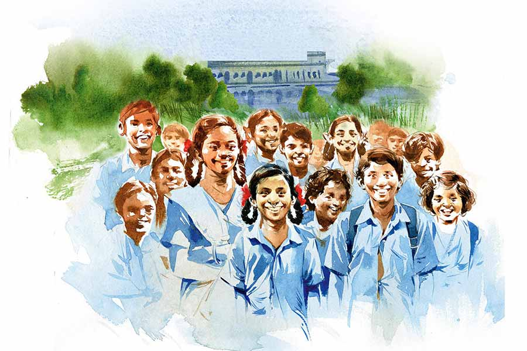

 
 <h1 align=center>খিদে</h1>
<h2 align=center>কমলেশ কুমার</h2> নীলবাতি লাগানো গাড়িটা যখন ধুলো উড়িয়ে স্কুলগেটের বাইরে এসে দাঁড়াল, শুভময়বাবু ক্লাস টুয়েলভে কিটসের কবিতা পড়াচ্ছেন। চার জন পুরুষ এবং দু’জন মহিলা নামলেন।

বিল্বমঙ্গল উচ্চ বিদ্যালয়ের গ্রুপ ডি জগবন্ধুদা শুভময়বাবুকে যখন ক্লাসের মধ্যেই ডাকতে এলেন, শুভময়বাবু হাতঘড়ির দিকে তাকিয়ে বললেন, “ওঁদের বসতে বলুন। ক্লাসটা শেষ করে আমি যাচ্ছি।”

আর দেড় বছর পর জগবন্ধু মাজির অবসর। তিরিশ বছরের চাকরি জীবনে তিনি চার জন হেডমাস্টারকে পেয়েছেন। তাঁদের তুলনায় শুভময় মিত্রকে তরুণই বলা চলে। ঊনচল্লিশ বছরের সুঠাম চেহারার মানুষটিকে জগবন্ধুদা একটু আমতা-আমতা করে বললেন, “স্যর, ওঁরা শিক্ষা দফতর থেকে আসছেন। সরাসরি রাজ্য স্তর থেকে। ওঁদের সঙ্গে দিল্লির প্রতিনিধিও রয়েছে।”

শুভময় মিত্র মৃদু হাসলেন, ছাত্রছাত্রীদের দিকে তাকিয়ে বললেন, “এদের আর দেড় মাস পরই উচ্চ মাধ্যমিক। খুব গুরুত্বপূর্ণ একটি কবিতা পড়াচ্ছি এখন।” জগবন্ধুদা কিছু বলতে যাচ্ছিলেন, তাঁকে থামিয়ে দিয়ে শুভময়বাবু আবার বললেন, “আপনি ওঁদের জন্য চা-বিস্কুটের ব্যবস্থা করুন। আমি আসছি।”

জগবন্ধু মাজি এই সাত মাসে বুঝে গিয়েছেন, শুভময় মিত্র আর পাঁচ জনের চেয়ে আলাদা। এ রকম একবগ্গা হেডমাস্টার তিনি তাঁর চাকরিজীবনে আর দেখেননি। 

ছাত্রছাত্রীরা এ রকম দরদি কিন্তু কঠোর প্রধান শিক্ষক আগে পায়নি। শুভময়বাবু ছাত্র-অন্ত-প্রাণ, কিন্তু কোনও বেয়াদবি সহ্য করেন না।

কয়েক মাসেই বিল্বমঙ্গল হাই স্কুলের ভোল বদলে গিয়েছে। স্মার্ট ক্লাসরুম তৈরি হয়েছে, প্রোজেক্টর-সহ আধুনিক যন্ত্রপাতি বসেছে সেখানে। ক্লাসে ক্লাসে সিসিটিভি ক্যামেরা বসেছে। শুভময়বাবু নিজে মনিটরে নজরদারি চালান।

শিক্ষকরা ক্লাসে যেতে পাঁচ মিনিট দেরি করলে তিনি বলেন, “আমি চাই, আপনারা ঠিকমতো সময়কে কাজে লাগান। জানেন তো, আমরা যা কিছু ব্যয় করি, সময় তার মধ্যে সবচেয়ে বেশি দামি!”

আবিরবাবু, মঞ্জুলিকা ম্যাডামের মতো কেউ কেউ বলেছিলেন, “সরকারি ইস্কুলে চাকরি করি, রীতিমতো পরীক্ষা দিয়ে সেই চাকরি পেয়েছি, সেখানেও যদি বেসরকারি সংস্থার মতো সময়ের টার্গেট বেঁধে দেন মশাই, তবে কোথায় যাই!”

শুভময়বাবু খুব শান্ত, দৃঢ় গলায় সে দিন বলেছিলেন, “সময়ের অভাবটা সমস্যা নয়, সমস্যা হল সদিচ্ছার অভাব। প্রতিটি মানুষের দিনই কিন্তু চব্বিশ ঘণ্টার!”

তার পরেও দু’-এক জন শিক্ষক ক্লাসে যেতে দেরি করলে সেই ক্লাসে চক-ডাস্টার হাতে নিজেই ঢুকে পড়তেন শুভময়বাবু। হেডস্যার নিজে ক্লাসে চলে গিয়েছেন জানতে পেরে যখন নির্দিষ্ট শিক্ষক ছুটতে ছুটতে ক্লাসে যেতেন, শুভময়বাবু দরাজ হেসে বলতেন, “ঠিক আছে স্যর, আপনি আপনার কাজ মিটিয়ে আসুন, আমি আছি ক্লাসে।”

গত তিন-চার মাসে স্কুল নিজের ছন্দ ফিরে পেয়েছে। ছাত্রছাত্রীরা বুঝেছে, স্কুলে শৃঙ্খলা মানতেই হবে, পড়াশোনা করতে হবে। সহবত শেখা বাধ্যতামূলক। শিক্ষক-শিক্ষিকারা বুঝে গিয়েছেন, বেতন শুধু একটি সংখ্যা নয়, তাঁদের পেশার নির্দেশক।

বাকিটা সামলে নিচ্ছেন শুভময় মিত্র। গ্রামের প্রায় তেরোশো ছাত্রছাত্রী নিয়ে চলা উচ্চ মাধ্যমিক স্কুলটির খোলনলচে বদলে দিতে গেলে যে বেশ খানিকটা সময় দরকার, সেটা বুঝেও তিনি হাত গুটিয়ে বসে থাকতে রাজি নন। প্রতি মুহূর্তে নিজেদের প্রয়োজনগুলো তুলে ধরছেন প্রশাসনিক কর্তাব্যক্তিদের কাছে। বিডিও অফিস, ডিআই অফিসে নিয়মিত প্রতিনিধি পাঠিয়ে নিজেদের জায়গাটা পরিষ্কার করে নিচ্ছেন।

আর প্রভূত উন্নতি ঘটিয়েছেন মিড-ডে মিলে। আগের প্রধান শিক্ষকের আমলের ভাত আর কুমড়োর ঘ্যাঁট এখন অতীত। মাসে দু’দিন মাংস, ডিম হচ্ছে প্রতি সপ্তাহে। নিত্যনতুন খাবারের মেনু ঠিক করে ছাত্রছাত্রীদের মধ্যে আলোড়ন ফেলে দিয়েছেন শুভময় স্যর।

“আমরা রাজ্য এবং কেন্দ্রীয় যুগ্ম সমীক্ষক দলের একটি টিম। কমিশনার, রাজ্য মিড-ডে মিলের অধিকর্তা-সহ জয়েন্ট রিভিউ মিশনের সদস্য আমরা। আপনার স্কুল পরিদর্শনে এসেছি মূলত মিড-ডে মিলের জন্য,” চকচকে টাকমাথা ভদ্রলোকটি শুভময়বাবু ঘরে ঢোকার সঙ্গে সঙ্গে কথাটা বললেন।

শুভময়বাবু হাত তুলে নমস্কার করলেন সকলকে। হাসিমুখে চেয়ারে বসতে বসতে বললেন, “আমার জন্য আপনাদের একটু অপেক্ষা করতে হল। খুব দুঃখিত। টুয়েলভের একটা দরকারি ক্লাস নিচ্ছিলাম!”

টাকমাথা ভদ্রলোক গম্ভীর গলায় বললেন, “এক জন প্রধান শিক্ষক যখন কমিশনার স্যরকে পর্যন্ত অপেক্ষা করাতে পারেন, তখন সেই শিক্ষকের পড়ানোর প্রতি অনুরাগ তো বোঝাই যায়!”

শুভময় মিত্র খোঁচাটা শুনে মৃদু হাসলেন, ভদ্রলোকের দিকে তাকিয়ে বললেন, “সর্বশিক্ষা মিশনের বিভিন্ন কাজ, আর রাজ্য সরকারের অসংখ্য প্রজেক্টের টার্গেট গ্রুপ এখন স্কুলের ছাত্রছাত্রীরা, সে সব কাজ এখন আমাকেই সামলাতে হয় স্যর, তার পর যতগুলো পারি ক্লাস নিই। টেন-টুয়েলভের মতো ক্লাসগুলোয় কোনও ঢিলেমি বরদাস্ত করতে পারি না...”

আরও কিছু বলতে যাচ্ছিলেন শুভময়বাবু, তাঁকে থামিয়ে প্রতিনিধি দলের মহিলাটি বললেন, “বর্তমানে আপনার রোল স্ট্রেংথ কত?”

“তেরোশো বাহান্ন।” একটুও না ভেবে জবাব দিলেন শুভময়স্যর।

“হাউ মেনি অব দেম টেক মিড-ডে মিল ডেলি?” দলের অবাঙালি ভদ্রলোকটি প্রশ্ন করলেন।

শুভময় স্যর প্রশ্নকর্তার চোখে চোখ রেখে ঝরঝরে ইংরেজিতে বললেন, “ক্লাস ফাইভ থেকে এইট পর্যন্ত এই স্কুলে ছাত্রসংখ্যা আটশো বারো। তাদের বেশির ভাগই আসে আদিবাসী পরিবার থেকে। অর্ধাহার বা অনাহারে থাকা পরিবার এখানে অসংখ্য। তাই আমাদের স্কুলে নব্বই শতাংশের বেশি ছেলেমেয়ে মিড-ডে মিল খায় নিয়মিত।”

“আজ কী মেনু হয়েছিল?” দলের আর এক জন প্রশ্ন করলেন।

“বিভিন্ন আনাজ দিয়ে পোলাও আর আলুর দম। আনাজ নিজেদের। স্কুলে কিচেন-গার্ডেন রয়েছে।”

“কত জন স্টুডেন্ট মিড-ডে মিল খেয়েছে আজ?”

“একটু জেনে বলতে হবে,” শান্ত ভাবে বললেন শুভময়বাবু।

“ফুডগ্রেন রেজ়িস্টার আছে আপনাদের?” দলের মহিলা সদস্যটি প্রশ্ন করলেন।

“হ্যাঁ ম্যাডাম,” শুভময়বাবু বললেন, “স্টক রেজিস্টার, ফুড গ্রেন রেজিস্টার, টেস্ট রেজিস্টার সবই রয়েছে, সেগুলো ঠিকঠাক মেনটেন করা হয়।”

টাকমাথা ভদ্রলোকটি বললেন, “গ্রেন রেজিস্টারের সঙ্গে চালের স্টক মিলবে তো স্যর?”

শুভময়বাবু কিছু বললেন না। সামান্য হাসলেন।

জগবন্ধুদা চায়ের কেটলি আর বিস্কুট হাতে হাজির। বাইরে ছাত্রছাত্রীরা উঁকিঝুঁকি দিতে শুরু করেছে। গ্রামের স্কুলে নীলবাতির গাড়ি এসে থামা মানেই মানুষের আগ্রহ বেড়ে ওঠা।

“শুভময়বাবু, আমার নাম মানসপ্রতিম রায়। আমি বর্তমানে শিক্ষা বিভাগের কমিশনার পদে রয়েছি।” এত ক্ষণ চুচচাপ থাকা ব্যক্তিটি চায়ের কাপে এক বার চুমুক দিয়ে বললেন, “মিড-ডে মিল থেকে যে টাকা পান, তাতে পোলাও খাওয়াতে পারেন? একটি ছেলের জন্য প্রতিদিনের বরাদ্দ মাত্র আট টাকা, আপনার কি মনে হয় না, টাকাটা খুব কম?”

“অবশ্যই কম। বাজারদরের নিরিখে তুলনাতেই আসে না। তবে এটাও ঠিক, একটু পরিকল্পনা করে চলি বলেই হয়তো মাসে দু’বার চিকেনও খাওয়াতে পারি আমরা।”

“অবাক কাণ্ড!” এক জন মহিলা সদস্য বললেন, “মিড-ডে মিলের চাল চুরি, কিংবা টাকা চুরির ঘটনা যেখানে আকছার ঘটছে, সেখানে চিকেন খাওয়াচ্ছেন! বেশ অদ্ভুত তো!”

“আমাদের বেশির ভাগ ছাত্রছাত্রীর কাছে বাড়িতে দু’বেলা খেতে পাওয়াটাই চ্যালেঞ্জ ম্যাডাম। আর আমি জানি, কেউ যখন খিদেয় কাতর, তখন তার কাছে পড়াশোনা সেকেন্ডারি...” একটু থেমে শুভময়বাবু বললেন, “খাবারের মেনুটা যদি একটু প্ল্যান করে করা যায়, বাচ্চাদের উপস্থিতি বাড়ে, পড়াশোনায় মনোযোগী হয় তারা, এ সব কিছু মাথায় রেখেই আমরা মিড-ডে মিলটা চালাতে চেষ্টা করি।”

“গ্রেন রেজিস্টারটা এক বার দিন তো, দেখি!” সেই টাকমাথা ভদ্রলোক চায়ের কাপটা টেবিলের নীচে নামিয়ে বললেন, “আমরা স্টোরহাউসটাও দেখব এক বার।”

অন্য আর এক জন মহিলা মিড-ডে মিলের শেডের দিকে তাকিয়ে বললেন, “রান্নার জায়গা, হাত ধোওয়ার জায়গা, সবই দেখতে হবে... চলুন, উঠি।”

সকলে উঠে দাঁড়াল। শুভময়বাবু ঘর থেকে আগে বেরিয়ে এলেন, তাঁর পিছনে বাকি সদস্যরা।

শুভময়বাবু দলটিকে প্রথমে আনাজের বাগানে নিয়ে এলেন। বাগান ফুলকপি, লাউ, উচ্ছে, টমেটো, লঙ্কায় ভর্তি।

দিল্লির প্রতিনিধিরা মোবাইল বার করে ছবি তুলতে লাগলেন।

তার পর তাঁরা গুদামঘরে গেলেন। ঝকঝকে একটি ঘর। ঝুল-ময়লা, কিংবা আরশোলা, টিকটিকির চিহ্নমাত্র নেই। সারি দেওয়া চালের বস্তা ছাদ ছুঁয়ে ফেলেছে।

টাকমাথা ভদ্রলোকটি বস্তা গুনতে শুরু করলেন। গোনার শেষে ভুরু কুঁচকে তিনি শুভময়বাবুর দিকে তাকালেন। কয়েক মুহূর্ত তাকিয়ে থেকে আবার গুনতে শুরু করলেন। হাতে রাখা গ্রেন রেজিস্টারটির দিকে তাকালেন এক বার।

“এনিথিং রং?” দিল্লির প্রতিনিধি প্রশ্নটি করার সঙ্গে সঙ্গে সেই টাকমাথা ভদ্রলোক বললেন, “ইয়েস স্যর। গ্রেন রেজিস্টার অনুযায়ী একশো সাতচল্লিশ বস্তা চাল থাকার কথা, কিন্তু রয়েছে মাত্র সাতাশি বস্তা।”

“মানে?” এক জন মহিলা সদস্য অবাক হয়ে তাকালেন শুভময়বাবুর দিকে। কমিশনার-সহ সকলে ঘুরে দাঁড়ালেন প্রধান শিক্ষকের দিকে।

শুভময়বাবু কিছু বললেন না। চোখ নামিয়ে নিলেন।

কমিশনার অবিশ্বাসের সুরে টাকমাথা ভদ্রলোককে বললেন, “ঠিকঠাক গুনেছেন তো আপনি? এতটা পার্থক্য হওয়ার তো কথা নয়!”

“হয়েছে স্যর। ঠিকঠাক গুনেছি।”

“শুভময়বাবু! কী বলবেন আপনি?” এত ক্ষণ নীরব থাকা দিল্লির অপর প্রতিনিধি প্রশ্ন করলেন।

“এত যে কথা বললেন, এত উদারতা দেখালেন, সেই তো চালে গরমিল! দু’-চার বস্তা তফাত হতেই পারে... তা বলে...” বিড়বিড় করলেন এক মহিলা প্রতিনিধি।

“ম্যাডাম,” খুব শান্ত গলায় চোখ তুলে বললেন শুভময়বাবু, “এক বার ক্লাসরুমগুলোয় চলুন, ছাত্রছাত্রীদের সঙ্গে কথা বলুন প্লিজ়!”

“আর এখান-ওখান গিয়ে কী হবে!” চাপা গলায় বললেন সেই টাকমাথা, “যা বোঝার বোঝা হয়ে গিয়েছে। আপাতত কমিশনার স্যর কী সিদ্ধান্ত নেন দেখা যাক।”

দীর্ঘশ্বাস ফেললেন কমিশনার, “ষাট বস্তা চালের ফারাক কী করে হল শুভময়বাবু? এ তো সাধারণ ব্যাপার নয়! তবে আপনি চাইছেন যখন, সব ক্লাসের ছাত্রছাত্রীকে ডাকুন, আমরা কথা বলব!”

বিশাল মাঠের মধ্যে প্রেয়ার লাইনের মতো করে দাঁড় করানো হল ছাত্রছাত্রীদের। প্রতিনিধি দল, স্কুলের শিক্ষক-শিক্ষিকা-সহ সকলে এসে দাঁড়াল সেখানে।

কমিশনার প্রথম প্রশ্ন করলেন, “কে কে নিয়মিত মিড-ডে মিল খাও? হাত তোলো!”

এক সঙ্গে অগুনতি হাত উঠল।

একটি মেয়েকে নির্দেশ করে তিনি পুনরায় বললেন, “তোমার নাম আর ক্লাস বলো!”

মেয়েটি স্পষ্ট উচ্চারণে বলল, “আমার নাম মেহুলি সরেন। আমি নাইন বি সেকশনের ছাত্রী।”

কথাটা শুনে ভুরু কুঁচকে গেল কমিশনারস্যরের, “নাইন! হাউ ক্যান ইট বি পসিবল!”

একটু থেমে সামনের ডান দিকে দাঁড়ানো আর এক জনকে প্রশ্ন করলেন তিনি, “তুমি?”

“টেন বি স্যর। আমার নাম লক্ষ্মীমণি টুডু।”

“টেন!” মারাত্মক বিস্মিত হয়ে শুভময়বাবুর দিকে তাকিয়ে তিনি বললেন, “মিড-ডে মিল তো ক্লাস এইট পর্যন্ত দেওয়ার নিয়ম!”

দীর্ঘক্ষণ চুপ থাকার পরে শুভময়বাবু বললেন, “কিন্তু খিদে তো কোনও ক্লাস মানে না স্যর! ওরা এইট পাশ করে গিয়েছে বলে ওদের আর খিদে পাবে না, সেটা তো হয় না!”

“তাই বলে...” কিছু বলতে যাচ্ছিলেন টাকমাথা ভদ্রলোক, তাকে থামিয়ে দিয়ে একটি ছাত্র বলে উঠল, “স্কুলটা না থাকলে আমরা ঠিকমতো খেতেই পেতাম না স্যর! এইট পাশ করে যাব ভেবে ভয়ে ভয়ে ছিলাম, কারণ নাইন থেকে মিড-ডে মিল নেই। শুভময় স্যর এসে আমাদের সেই ভয় দূর করে দিয়েছেন।”

ভিড়ের মধ্যে থেকে একটি ছেলে চিৎকার করে বলে উঠল, “আমার নাম লসো মুর্মু। আমি টুয়েলভে পড়ি। রাতে খাবার জোটে না। শুভময় স্যরের জন্যই এক বেলা খেতে পাই।”

পরিদর্শনকারী দলটি এ সব কথা শুনে একটা ধাক্কা খেল যেন।

দলের এক মহিলা প্রতিনিধি বললেন, “এইটের উপরে কোন কোন ছাত্রছাত্রী নিয়মিত মিড-ডে মিল খাও, হাত তোলো!”

সকলে বিস্ময়ে দেখল, প্রায় তিনশো হাত নিঃশব্দে উঠে গেল।

প্রতিনিধি দলের সকলে নিশ্চল।

নীরবতা ভেঙে কথা বললেন শুভময় স্যর, “আপাতত আপনারা খিদের বিচার করুন স্যর, আর বিশেষ কিছু বলার নেই আমার। আশা করি বুঝতে পেরেছেন, চালের বস্তা রেজিস্টারের সঙ্গে না মেলার কারণ!”

প্রতিনিধি দলের কেউ কোনও কথা বলল না। কমিশনার শুধু বললেন, “চলুন, আরও কয়েকটা স্কুলে যেতে হবে আমাদের!”

ধীরপায়ে তাঁরা হেঁটে গেলেন নীলবাতি লাগানো গাড়িটার দিকে। যাওয়ার আগে ছাত্রছাত্রীদের দিকে তাকিয়ে এক বার হাত নাড়লেন।

গাড়ি স্টার্ট করতেই টাকমাথা বললেন, “কী স্টেপ নেবেন স্যর এইচএম-এর বিরুদ্ধে? এ তো মুশকিল কাণ্ড!”

কমিশনার নীরবে কী যেন ভাবছেন। তিনিও প্রত্যন্ত এক গ্রামের হতদরিদ্র পরিবার থেকে উঠে এসেছেন। শৈশব-কৈশোরে খিদের কষ্ট তাঁর অজানা নয়।

টাকমাথা গলাখাঁকারি দিয়ে ফের তার প্রশ্নটি করলেন। এ বার শুনতে পেলেন কমিশনার। খুব অন্যমনস্ক গলায় বললেন, “আপাতত বিল্বমঙ্গল স্কুলের চালের স্টকটা বাড়িয়ে দেব, আর দিল্লিকে অনুরোধ করে চিঠি লিখব, মিড-ডে মিল সব স্কুলেই যেন ক্লাস টুয়েলভ পর্যন্ত করে দেওয়া হয়।” তার পর নিজের মনেই বিড়বিড় করলেন তিনি, “কারণ সত্যিই খিদের কোনও ক্লাস হয় না...”