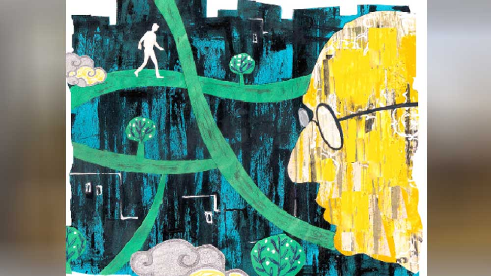

 

<h1 align=center>খোঁজ</h1>
<h2 align=center>দেবাশিস দাস</h2>
অফিসেই শিবুর ফোনটা এসেছিল, “দাদা, চলে আয়, মা-র অবস্থা ভাল বুঝছি না। শ্বাসকষ্ট হচ্ছে। ডাক্তার বলেছে বাড়িতে না রেখে হসপিটালে ভর্তি করে দিতে। কাল সকালেই 
নিয়ে যাব।”   ঘণ্টাখানেকের মধ্যেই অফিস আর নিজের সংসারের সব বন্দোবস্ত করে রেখে বিকেলেই বেরিয়ে পড়েছিল শঙ্খ। কিন্তু ফ্লাইট ডিলে হয়ে পৌঁছতে ভোররাত হয়ে গেল।   এয়ারপোর্ট থেকে গাড়ি করে বাড়ি আসার পথে নাগরিক ভোরের ফুটে ওঠা লক্ষ করছিল শঙ্খ। রাস্তার ধারের একটা শিউলি গাছের নীচে পড়ে থাকা সাদা ফুল আর শিরশিরানি বাতাস জানান দিচ্ছিল উৎসব আসছে। ক্লান্ত আর নির্ঘুম চোখদুটো বুজে এল তার।   গানের স্কুলটা ফুল দিয়ে সুন্দর করে সাজানো হয়েছে। আজ এক্সটারনাল এগজ়ামিনারের মুখোমুখি গানের পরীক্ষা শঙ্খর। ক্লাস ফোরে পড়লেও গানের পরীক্ষা এই প্রথম। কাজেই ভয় লাগছিল। যদি সুর না লাগে বা যদি তাল কেটে যায়? কাল রাতে মা বলেছিলেন পরীক্ষার সময় থাকবেন। মা-ই একমাত্র ভরসা শঙ্খর। কিন্তু সকাল সাড়ে ন’টায় পরীক্ষা শুরুর আগে কী করে নিজের স্কুল থেকে মা এখানে আসবেন? পরীক্ষার ঘরে পাতা ফরাসের এক দিকে বসে আছেন এগজ়ামিনার, আর উল্টো দিকে পরীক্ষার্থীদের জন্য রাখা হারমোনিয়াম ও তবলা। বাইরে থেকেই শুনল প্রথম মেয়েটি দুর্দান্ত গাইল। সে হাসিমুখে বেরিয়ে আসতেই ডাক পড়ল শঙ্খর। এত তাড়াতাড়ি? মা তো এসে পৌঁছলেন না এখনও! পরীক্ষার ঘরের পর্দা-ফেলা নীরবতা তার ভেতরের ভয়টাকে আরও ঘনিয়ে তুলছিল। পরীক্ষককে নমস্কার করে বসতেই উনি গান শুরু করতে বললেন। কিন্তু এত নার্ভাস লাগছে কেন? আজ গলা দিয়ে স্বর বেরোবে কি? ঘরের এক কোণে রাখা মা সরস্বতীর মূর্তি দেখে ভয় দূর করার চেষ্টা করল সে। কিন্তু সে এটা কী বাজাচ্ছে? নিজের পছন্দের ভূপালি রাগ? রিডে আঙুলের অবিন্যস্ত চলনের মাঝেই একটা পরিচিত মিষ্টি গন্ধ নাকে এল। ঘাড় না ঘুরিয়েই সে বুঝতে পারল দরজাটা একটু খুলে ঘরে ঢুকে এক কোণে বসে তার দিকে তাকিয়ে আছেন মা। যে সুর আজ বেরোতে চাইছিল না কিছুতেই, স্বচ্ছন্দ কণ্ঠে সেই সুরই যেন পথ খুঁজে পেয়ে ছড়িয়ে পড়ল ঘরের মধ্যে, ‘ধন ধন কৃষ্ণ মুরারি’। সেই থেকে এই গন্ধটাই ছিল তার আশ্রয়। মাঝখানে বড় হয়ে ওঠার ইঁদুরদৌড়ে শামিল হওয়ার পর গন্ধটা অজান্তেই হারিয়ে গিয়েছিল, কিন্তু আজ সকালের ছড়ানো শিউলির সুবাসে কেন মনে এল তার কথা? চটকা ভেঙে গেল। ট্যাক্সি থেকে নেমে বাড়ির বারান্দায় কয়েকজোড়া ছড়ানো জুতো আর চটি দেখেই শঙ্খ বুঝতে পারল যে, শিবুর বন্ধুরা এসে গেছে মাকে হসপিটালে নিয়ে যেতে।      “মাসিমা, অত নড়াচড়া করলে কিন্তু হাত দুটো খাটের রেলিংয়ের সঙ্গে বেঁধে রাখতে হবে। ঠিক যে ভাবে নিজের ছেলেদের বেঁধে রেখে ঘরের কাজ করতেন, সেই ভাবে। না হলে স্যালাইনের ছুঁচ খুলে যাবে...” নার্সের কথা কানে গেলেও চোখ দুটো আবার বুজে এল সরযূবালার। অত্যাধুনিক হাসপাতালের জানলার অস্বচ্ছ পর্দা চুঁইয়ে আসা হিমায়িত ভোরের আমেজ আবার তাঁকে নিয়ে ফিরে গেল আচ্ছন্নতার এক অনুভূতিতে। ছেলেদের কি কখনও বেঁধে রাখতেন তিনি? কী এক কারণে এক বার ওদের বাবা শঙ্খকে খুব মেরেছিলেন। সে দিন রাতে তাঁর ঘুম হয়নি। বার বার উঠে দেখছিলেন ঘুমন্ত ছেলের মুখ। কোথাও কি কোনও যন্ত্রণা উঁকি মারছে? স্বামী বলেছিলেন, ‘শক্ত হও সরযূ, এ রকম করলে ছেলে মানুষ হবে না।” আবার কষ্ট করে চোখ দুটো খুলে পাশে ঘুমন্ত শঙ্খকে দেখতে চাইলেন। হাত বুলিয়ে দিতে গেলেন ওর ঘুমন্ত শরীরে।   “আরে করছেন কী? এ বারে কিন্তু বেঁধে রাখতেই হবে...”   দড়ি দিয়ে খাটের রেলিংয়ে হাত দুটো বেঁধে দিয়ে গেল নার্স। শঙ্খকে না পেয়ে আবার চোখ বুজলেন সরযূ। ভোর হয়ে গেছে। এখন না উঠলে সাড়ে পাঁচটার লোকাল ট্রেন ধরতে পারবেন না তিনি। স্কুলে দেরি হয়ে যাবে যে।      “ওঁর রক্তে হিমোগ্লোবিন একদম কমে গিয়েছিল। তিন বোতল রক্ত দেওয়াতে অনেকটা নর্মাল হয়েছে,” ডাক্তারবাবু তাদের দুই ভাইকে একটা আলাদা ঘরে ডেকে আরও বললেন, “দিন পনেরো পর আবার ব্লাড টেস্ট করিয়ে দেখে নেবেন হিমোগ্লোবিন কমে কি না। মনে হচ্ছে শরীরে কোথাও ব্লাড লস হচ্ছে। ম্যালিগন্যান্ট কিছু থাকার আশঙ্কা বেশি। তবে খোঁচাখুঁচি করার আগে কিছু দিন দেখে নেওয়া যেতে পারে।”   শঙ্খর বুক খালি হয়ে গেল। মায়ের বয়স হয়েছে। স্কুলের গণ্ডি পেরনোর পরই বাবা চলে গেছেন এই মারণরোগে। মারও কি তেমন হল?   “ডাক্তারবাবু, কিছু করার নেই?”   “আগে থেকেই বলা যাচ্ছে না। তবে সে রকম কিছু হয়ে থাকলে সার্জারি বা কেমো কোনওটাই উনি এই বয়সে নিতে পারবেন বলে মনে হয় না। আপাতত বাড়ি নিয়ে যান আর ওপরওয়ালার কাছে প্রার্থনা করুন। আয়া রেখে দিন দু’বেলার। আর উনি তো অ্যালঝাইমারের রোগী, কিছুই মনে রাখতে পারেন না। কোথাও যেন একা না যান।”      সপ্তাহখানেকের মধ্যেই বাড়ি ফেরার জন্য ভীষণ অধৈর্য হয়ে উঠেছেন সরযূ। গত দু’দিন ধরে নার্সদের বিরক্ত করেছেন, “আমার মানিব্যাগ কোথায়? আমাকে একটা রিকশা ডেকে দাও... বাড়ি যাব। শঙ্খ বা শিবু এলে বলে দিয়ো, আমি নিজেই বাড়ি চলে গেছি।”   “কাল সকালে ছেলেরা এলে বাড়ি যাবেন। এখন বরং একটু ঘুমিয়ে নিন তো।”   “ঘুমোব কেন? এখন তো তোমাদের ক্লাস শুরু হবে। সবাই এসে গেছে? কৃষ্ণা আসেনি? কাল তো অসুস্থ ছিল। কী করে যে পরীক্ষা 
দেবে মেয়েটা?”   হাসল নার্সটি, “ক্লাস তো নিলেন একটু আগে। মনে নেই? এখন একটু ঘুমিয়ে পড়ুন প্লিজ়। জেগে উঠেই দেখবেন ছেলেরা এসে গেছে।”   চোখ বোজেন সরযূ। এখন ঘুমোলে চলবে তার? স্বামী তো কাজে বেরিয়ে গেছেন সকাল ন’টায়। শিবু আর শঙ্খ দু’জনেই স্কুল থেকে ফিরে আসবে দুপুর দুটো নাগাদ। তার আগে বাড়ি ফিরে ডিমের ঝোলটা করে ফেলতে হবে। একটু পরেই ‘ডি আই’ অফিস থেকে লোকজন আসবে, স্কুলের মিটিং তাড়াতাড়ি শেষ করতে হবে। কারা যেন কথা বলছে... আঃ! বড় অস্পষ্ট সব কিছু। কে যেন বলল, “মাসিমা, আপনার ছেলে এসেছে।”   বন্ধ চোখ দুটো খোলার চেষ্টা করলেন তিনি।      বেশ কিছু দিন ছুটি নেওয়া হল শঙ্খর। অফিসে এই লেভেলে উঠতে কাজ করা ছাড়াও অনেক কিছু ম্যানেজ করতে হয়েছে তাকে। এখনও অনেকটা দৌড় বাকি। ছুটি নেওয়ার ফলে প্রচুর কাজ জমে আছে। এই সব কাজের সঙ্গে একটা বিদেশ যাওয়ার ব্যাপারও জড়িয়ে আছে। অফিসে অনেকে তার কাজের দায়িত্ব নিতে চাইছে। কিন্তু বসই সব কিছু ঠেকিয়ে রাখছেন। তবে হেড অফিসের চাপ আছে, বেশি দিন এ ভাবে চলবে না। আর অন্য কাউকে এই কাজের দায়িত্ব দিলে শঙ্খর একটা বড় সুযোগ হাতছাড়া হবে। বস বলেছেন, ক’দিনের জন্য অফিসে ফিরে এসে দরকার হলে আবার যেতে। তা ছাড়া শঙ্খর নিজের সংসারেও বাজারহাট, মেয়ের পরীক্ষা ইত্যাদি সুকন্যাকে একা সামলাতে হচ্ছে। মা হাসপাতাল থেকে বাড়ি ফেরায় শঙ্খ আপাতত ফিরে যাবে ঠিক করল। শয্যাশায়ী মায়ের এই অবস্থায় তার চলে যাওয়া যদিও সমীচীন নয়। শিবুর একার ওপর পুরো চাপটা পড়বে। তবু আয়া রেখে, মায়ের রক্তপরীক্ষার পর আবার আসবে ঠিক করে দিনদুয়েক পরের ফ্লাইট বুক করল শঙ্খ। বস বলেছেন ভোরের ফ্লাইটে যেতে, কারণ দুপুরে হেড অফিসের লোকজন আসছে। শঙ্খকে থাকতেই হবে।   মায়ের অবস্থা মাসখানেক ধরেই বেশ খারাপ হয়েছে। ভুলে যাওয়ার রোগটা এতটা ভীষণ ভাবে আগে ছিল না। রক্ত কমে যাওয়ার ব্যাপারটা যে অন্য কোনও মারণরোগের জন্য হচ্ছে, সে বিষয়ে ডাক্তার প্রায় নিশ্চিত। তারাও বুঝে গেছে যে, মা যে ক’দিন বাঁচবেন এই ভাবেই থাকবেন। শিবু আর ওর বৌ শমিতা বেশ ভেঙে পড়েছে। বাবা চলে গেছেন প্রায় তিরিশ বছর। প্রাথমিক ধাক্কা কাটিয়ে উঠে মা-ই সংসারটার হাল শক্ত হাতে ধরেছিলেন। শরীর-স্বাস্থ্য এত দিন ঠিকই ছিল, শুধু হাঁটুর ব্যথায় মাঝে মাঝে ভোগা ছাড়া। তবে বড় অভিমানী হয়ে উঠেছিলেন আজকাল। বার বারই ফোন করতেন শঙ্খকে, “এক বার সবাইকে নিয়ে আয়, অনেক দিন তোদের দেখি না।”   শঙ্খ বলত, “এই তো মাসদুয়েক আগেই ঘুরে এলাম। যাব আবার, তুমি চিন্তা করো না।”   “বুঝি রে, এখন তো আমাকে আর দরকার নেই তোদের। ভাবিস না, বেশি দিন আর এ ভাবে ফোন করব না। দিন শেষ হয়ে এল। তোদের দেখতে বড় ইচ্ছে করে তাই...” মা হয়তো বুঝতেন, শঙ্খ এখন অনেক দূরে চলে গেছে।   ফ্লাইট ধরার জন্য সেট করা ভোরের অ্যালার্ম বাজার আগেই একটা চেঁচামেচি শুনে ঘুমটা ভেঙে গেল শঙ্খর। উঠে মা-র ঘরে গিয়ে দেখল, শমিতা আয়াকে খুব বকাবকি করছে। শিবু বলল, “শেষ রাতে আয়া একটু ঘুমিয়ে পড়েছিল। সেই ফাঁকে মা নাকি কখন দরজা খুলে বাইরে বেরিয়ে গেছে। আয়া উঠে 
দেখেছিল বাইরের দরজাটার পাল্লাটা খোলা, মা ঘরে কোথাও নেই। তারা দু’ভাই বেরিয়ে পড়ল মায়ের খোঁজে।   অনেক ক্ষণ খুঁজেও মাকে কোথাও পাওয়া গেল না। খুব ভোরে রাস্তায় কেউ নেই। দু’-এক জন পথচারীকে জিজ্ঞেস করে জানা গেল না কিছুই। শঙ্খ শিবুকে বলল, “তুই থানায় খবর দে। আমি এ দিকটা খুঁজে দেখি। মা তো ভাল হাঁটতে পারে না, আছে হয়তো আশপাশেই কোথাও।”   ভোরের ফ্লাইট আর ধরা যাবে না। এত ভোরে বসকে কি ফোন করা যাবে? বিরক্ত লাগল শঙ্খর। আজই এ সব হওয়ার ছিল? পরক্ষণেই 
নিজেকে ভীষণ স্বার্থপর মনে হল তার। সে তো মায়ের কথা বিশেষ ভাবেনি। মা ফেরার পর থেকে সে শুধু ভেবেছে কী করে এত দিনের অনুপস্থিতি সামাল দিয়ে নিজের কেরিয়ার বাঁচাবে।   ঘণ্টাখানেক আরও কাটল। কোথাও দেখা নেই মায়ের। এরই মধ্যে শিবু ফোনে জানিয়েছে, পুলিশে ডায়েরি করা হয়েছে।   অনেকটা রাস্তা চলে এসেছে শঙ্খ। এ দিকটা বেশ খোলামেলা আছে এখনও। খুব ছোটবেলায় বাবা নতুন বাড়ি করে উঠে যাওয়ার আগে এখানেই থাকত তারা। তখনও শিবু জন্মায়নি। সে নিজে নাকি ছোটবেলায় খুব চঞ্চল ছিল। উঠোনের দরজা খোলা পেলেই বাইরে বেরিয়ে যেত। প্রায়ই পাড়ার লোকজন তাকে খুঁজে বাড়ি দিয়ে যেত। সেই কবেকার কথা?   কোথায় গেল মা? এ দিকে এসেছে? এটা তো সেই হরিসভা। বড় পুকুরটা তো ও দিকে এখনও আছে দেখা যাচ্ছে। আজকাল পুকুর বোজানো যায় না। মাথাটা চড়াক করে উঠল। যদি মা পুকুরের দিকে যায়? ত্রস্ত পায়ে পুকুরের ঘাটে পৌঁছল সে। বুড়ো বটগাছের নীচে ঘাটের কাছে একটা জটলা। বুকটা ধড়াস করে উঠল। তবে কি মা...   তখনই চোখে পড়ল, মা বসে আছে ঘাটের সিঁড়িতে, জলে পা ডুবিয়ে। যেন এখনই জলে নামবে। কয়েকজন নারী-পুরুষ তাকে ধরে রেখেছে। মা-র অসংলগ্ন কথা কানে আসছে, “তোমরা আমার শঙ্খকে দেখেছ? ভীষণ দুরন্ত। ভোরবেলা মাছওয়ালা চলে যাওয়ার পর দরজা খোলা পেয়ে কোন ফাঁকে বেরিয়ে গেছে। পুকুরে পড়ে গেল না তো? একরত্তি ছেলে, সাঁতার জানে না, কী যে করি! ওর বাবাও বাড়ি নেই। তোমরা আমার শঙ্খকে খুঁজে দাও।”   শঙ্খর হঠাৎ চারদিক খুব অচেনা লাগল। কে হারিয়ে গেছে? সে নিজেই কি? এই বৃদ্ধা খুঁজে বেড়াচ্ছেন তাঁর ছোট্ট শঙ্খকে। কোথায় গেল তা হলে এতগুলো বছর? এই অতিক্রাম্ত সময়ের গোলকধাঁধা পেরিয়ে সে কি আর কখনও ফিরতে পারবে তার মায়ের কাছে?   পুকুরের জোলো বাতাসে ছোটবেলার সেই হারিয়ে যাওয়া গন্ধটা মরিয়া হয়ে খুঁজতে লাগল শঙ্খ।