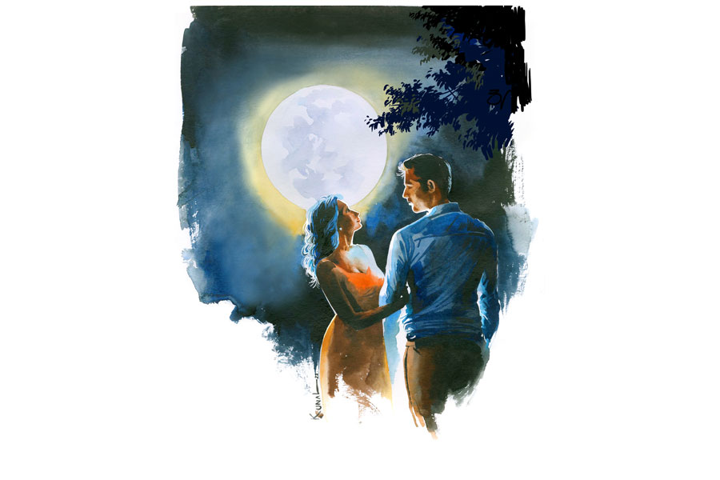

 
 <h1 align=center>গল্পের আড়ালে</h1>
<h2 align=center>চঞ্চল ঘোষ</h2> খুব ক্লান্তি লাগছিল সুতপার। কোনও রকমে জুতোজোড়া খুলে বাথরুমে ঢুকে যায়। মিনিট দু’-তিন চোখ বুজে শাওয়ারের তলায় নীরবে দাঁড়িয়ে রইল। ঠান্ডা জলটা শরীরে পড়ে গরম হয়ে নীচে নামছে। সচরাচর রাতে স্নান করে না সুতপা। আজ আর পারছিল না। শুধু শরীর নয়, মনের ক্লান্তি দূর করতেও সুতপা কৃত্রিম জলধারায় আপাদমস্তক ভিজতে লাগল...

অথচ সকালটা আনন্দ-বেদনার এক মিশ্র আবেশ নিয়ে শুরু হয়েছিল। গত এক মাস এই দিনটার সাগ্রহ প্রতীক্ষাও ছিল। সায়ন্তনকে নিয়ে সকলে কী বলেন, তা শোনার এক দুর্নিবার কৌতূহল কয়েক দিন ধরে সুতপার মনে ঘুরপাক খাচ্ছিল। চল্লিশ বছর সহধর্মিণীর চোখ দিয়ে সায়ন্তনকে দেখেছে, এখন অন্যের চোখে সায়ন্তনকে দেখবে। অবশ্য চল্লিশ কেন, বিয়ের আগে পাঁচ বছরের প্রেমপর্ব ধরলে পঁয়তাল্লিশ বছর। প্রায় অর্ধশতক!

কবি সাহিত্যিকরা সাধারণত একটু বোহেমিয়ান, একটু খেয়ালি হয়; সংসারের দায়-দায়িত্ব সম্পর্কে উদাসীন— বিয়ের আগে সায়ন্তন কথাগুলো বার বার বলত সুতপাকে। সুতপা তো তখন সায়ন্তনের সাহিত্যিক সত্তাকেই ভাল বেসেছিল; সায়ন্তনের মধ্যে এক উদাসী বাউলের সন্ধান পেয়েছিল। তাই হাসতে হাসতে বলত, “মেয়েরা খুব হিসেবি পুরুষ পছন্দ করে না। সংসারের খুঁটিনাটি সব ব্যাপারে নাক গলাবে, সেরকম হাজ়ব্যান্ড আমি চাই না।”

সাহিত্যের ছাত্রী সুতপাও এক সময় টুকটাক লিখত। সেই সূত্রেই সায়ন্তনের সঙ্গে আলাপ। সায়ন্তন তখন উদীয়মান সাহিত্যিক। সুতপা ছিল সায়ন্তনের গল্পের তন্নিষ্ঠ পাঠক। সায়ন্তনের গল্পের ভাষা, বুনন, বিষয়বস্তু সুতপাকে ভীষণ টানত। সায়ন্তনের ব্যক্তিত্বও সুতপাকে চুম্বকের মতো আকর্ষণ করত। সায়ন্তনের ব্যক্তিত্বে, কথা বলার ধরনে এমন কিছু ছিল, যা সহজেই মহিলাদের আকৃষ্ট করত। অচিরেই সুতপা সায়ন্তনের প্রেমে পড়ে। সায়ন্তন প্রথমে উদাসীন থাকলেও সুতপার আন্তরিক আর্তির কাছে এক সময় আত্মসমর্পণ করে।

তার পর গঙ্গা দিয়ে অনেক জল বয়ে গেছে। অল্প দিনের মধ্যেই সায়ন্তন গল্পকাররূপে সাহিত্যজগতে স্বতন্ত্র জায়গা করে নেয়। এক সময় দু’জনে ঘর বাঁধে। নিয়মমাফিক দু’জনের সংসার এক দিন তিন জনের হয়। অর্ক আসে। সায়ন্তন ক্রমশ অন্য জগতের মানুষ হয়ে পড়ে। লেখালিখি, সাহিত্যসভা, সেমিনার এই সব নিয়েই দিন চলে যায়। মাসের মধ্যে আট-দশ দিন বাড়িতেই থাকে না। হয় সাহিত্য সম্মেলন, না হয় সংবর্ধনা জ্ঞাপন অনুষ্ঠান, না হলে স্মরণসভা লেগেই থাকে। সংসারের দায়দায়িত্ব মূলত সুতপার কাঁধেই এসে পড়ে। সুতপা হাসিমুখে সবই সামলায়। সে তো জেনেশুনেই সায়ন্তনের জীবনবৃত্তে পা রেখেছে। তা ছাড়া স্বামীর খ্যাতি, জনপ্রিয়তা সুতপাকে খুশিই করে; গর্বিত করে। সায়ন্তনের সুখ-দুঃখের খোঁজ রাখতে রাখতে আর অর্ককে মানুষ করতে করতে কোথা দিয়ে সুতপার বেলা গড়িয়ে যায় সুতপা বুঝতেই পারে না।

এমনি করেই চার দশক কেটে গেল। আজ মনে হচ্ছে এক ছাদের নীচে পাশাপাশি এত বছর থাকলেও পাশের মানুষটিকে বোধহয় পুরো বুঝে উঠতে পারেনি সুতপা। যাকে এত দিন একান্ত ভাবে নিজের বলে ভেবে এসেছে, আজ যেন তার অনেক দাবিদার। নানা জনের স্মৃতিচারণায় যে সব অজানা কথা, অজানা তথ্য আজ জানতে পারল, তাতে অন্তত তাই মনে হচ্ছে সুতপার।

মাসদুয়েক আগে এক ম্যাসিভ সেরিব্রাল অ্যাটাকে মারা যায় সায়ন্তন। চিকিৎসার সময়টুকু দেয়নি। অর্ক সেই সময় অফিসের কাজে বেঙ্গালুরুতে। প্রাথমিক ধাক্কা-সহ সব কিছু সামলেছিল সায়ন্তনের বন্ধুবান্ধব আর অনুরাগীরা। সুতপাকে কিছুই দেখতে হয়নি। এক দিন পরে অর্ক এসে মুখাগ্নি করে।

শ্রাদ্ধশান্তি মিটে গেলে সায়ন্তনের খুব কাছের কয়েক জন বন্ধুবান্ধব এক দিন সুতপার সঙ্গে দেখা করে আজকের এই স্মরণসভা আয়োজনের প্রস্তাব দেয়। সুতপারও মনে ধরে ব্যাপারটা; সানন্দ সম্মতি দেয়।

তার পর মাসখানেকের প্রস্তুতি। এই ক’দিন সুতপা যেন এক ঘোরের মধ্যে ছিল। সায়ন্তনের পড়ার ঘর, আলমারি, লেখার টেবিল ঘাঁটতে ঘাঁটতে কত স্মৃতির সঙ্গে দেখা! খুঁজে পায় প্রথম প্রকাশিত বইটা। প্রথম গল্পগ্রন্থটি সায়ন্তন বাবাকে উৎসর্গ করেছিল। শ্বশুরমশাই তখন বেঁচে আছেন। সুতপার তখনও বিয়ে হয়নি। চার বছর পর দ্বিতীয় গল্পগ্রন্থ। সুতপাকে উৎসর্গ করে সায়ন্তন। উৎসর্গপত্রে সুতপার নামটা সুতপার মনে হয় যেন আজও জ্বলজ্বল করছে।

বেশ মনে আছে, বইটা প্রকাশিত হয়েছিল এক বছর কোজাগরী লক্ষ্মীপূর্ণিমার দিন। পূর্ণিমা রাত বরাবরই প্রিয় সায়ন্তনের। তার মধ্যে দোলপূর্ণিমা আর কোজাগরী ছিল বিশেষ প্রিয়। সচেতন ভাবেই সায়ন্তন ওই দিনটা বেছে নিয়েছিল। সায়ন্তন সে দিন একটু রাত করেই বাড়ি ফিরেছিল। অর্ক তখন খুবই ছোট। খেতে খেতে সুতপা বলে, “কেমন অনুষ্ঠান হল? সকলে এসেছিল?”

“খুব সুন্দর হয়েছে। অরুণাংশুদা ছাড়া সকলেই এসেছিল,” সায়ন্তনের গলায় খুশির আভাস।

“তোমার অনুরাগিণীরা কী বলল? নাতাশা, দেবলীনা, শামিমা সবাই এসেছিল? সায়ন্তনদা বলতে তো সব অজ্ঞান!” টিপ্পনি কাটে সুতপা।

“আমার সবচেয়ে বড় অনুরাগিণী আগে কী বলে দেখি!” সুতপার চোখে চোখ রেখে বলে সায়ন্তন।

“থাক, অনেক হয়েছে। বাইরে বেরোলে বাড়িতে যে একটা বৌ আছে, মনে থাকে?” সুতপার কণ্ঠে কপট রাগ।

দু’জনেরই খাওয়া হয়ে গিয়েছিল। সুতপা বলে, “কই, বইটা দেখি!” সুতপা ইচ্ছা করেই বইটা আগে দেখেনি। সুতপার বরাবরের সংস্কার, প্রকাশের আগে বই দেখবে না।

“ছাদে চলো, দেখাচ্ছি। অনেক দিন ছাদে যাওয়া হয়নি। সুন্দর চাঁদ উঠেছে!” সায়ন্তনের বয়স যেন দশ বছর কমে গেছে।

“তোমার মতো লুনাটিক আমি নই! ছেলেটা ঘরে একা শুয়ে রয়েছে, রাতদুপুরে ওঁর এখন চাঁদ দেখতে যাওয়ার শখ হল!”

সায়ন্তন প্রায় জোর করে সুতপাকে ছাদে নিয়ে যায়। সত্যিই! রুপোলি আলোয় ভেসে যাচ্ছে চরাচর। নারকেল আর সুপারি গাছের পাতা বেয়ে নিঃশব্দে গড়িয়ে পড়ছে মায়াবী জ্যোৎস্না। বাতাসে হিমগন্ধ।

কাগজের খাম থেকে সায়ন্তন বইটা বার করে। সুতপার হাতে দেয়। সুতপা মুগ্ধ দৃষ্টিতে প্রচ্ছদের দিকে কিছু ক্ষণ তাকিয়ে থাকে। তার পর একে একে পাতা ওল্টায়। উৎসর্গপত্রে চোখ আটকে যায়। চাঁদের আলোয় নিজের নামটা ঠিকই চিনতে পারে সুতপা।

অদ্ভুত ভাল-লাগা জড়িয়ে ধরে সুতপাকে। শুধু উৎসর্গপত্রে নিজের নামটা দেখার জন্য নয়; সায়ন্তনের কাছে এতখানি গুরুত্ব পাওয়ার জন্যও। মাঝে মাঝে মনে হয় সুতপার, ও বোধহয় সায়ন্তনের যোগ্য হয়ে উঠতে পারেনি। চোখ ভিজে যায়।

হঠাৎই পিছন থেকে নিবিড় আশ্লেষে সুতপাকে গভীর ভাবে কাছে টেনে নেয় সায়ন্তন।

“কী হচ্ছে! ছাড়ো। কেউ দেখে ফেলবে।”

“অনুষ্ঠানের সমাপ্তি সঙ্গীতটাই তো বাকি!” সায়ন্তনের দৃষ্টিতে দুষ্টুমি।

সুতপা গররাজি, কিন্তু তার দুর্বল প্রতিরোধ অচিরেই ভেঙে পড়ে। নিঃশর্ত আত্মসমর্পণ করে সে। রাতের আকাশের নীচে দুই আদিম নরনারী আপাদমস্তক জ্যোৎস্নায় ভিজতে থাকে। সময়ের খেয়াল থাকে না।

 

বাথরুম থেকে বেরোতেই পার্বতী জানতে চায়, “বৌদি, চা করি?”

পার্বতী অনেক দিন এই বাড়িতে কাজ করছে। বিধবা মানুষ। রাতেও এখানেই থাকে। সুতপার পছন্দ অপছন্দ তার নখদর্পণে।

“না, থাক।”

অবাক হয় পার্বতী। এ রকমটা সচরাচর ঘটে না। বাইরে থেকে এলে সুতপার এক কাপ চা চাই-ই।

“আমার শরীরটা ভাল নয়। আমি শুয়ে পড়ছি। অর্ক ফিরলে খাবারগুলো একটু গরম করে দিয়ো,” পার্বতীকে কোনও কথা বলতে না দিয়ে শোবার ঘরের দিকে পা বাড়ায় সুতপা।

ফ্যানটা ফুল স্পিডে চালিয়ে শরীরটাকে বিছানায় এলিয়ে দেয়। চোখ বুজে কিছু ক্ষণ শুয়ে থাকে। তবু স্বস্তি পায় না। শুরু থেকে স্মরণসভার প্রতিটি মুহূর্ত ফিল্মের রিলের মতো মস্তিষ্কের এক প্রান্ত থেকে অন্য প্রান্তে ঘুরে চলেছে। সুতপার মাথাটা এখনও দপদপ করছে। কত কথার ফানুস উড়ল দু’-আড়াই ঘণ্টায়। অথচ তার জন্য বরাদ্দ মাত্র পাঁচ মিনিট! সুতপা যেন সায়ন্তনের কেউ নয়! সায়ন্তনের সাফল্যে তার কোনও অবদানই নেই! দেখে মনে হচ্ছিল কে বেশি সায়ন্তনের কাছের মানুষ ছিল; কে সায়ন্তনের জীবনের কত অজানা কথা জানে তা প্রকাশ করার প্রতিযোগিতা চলছে। আর এই প্রতিযোগিতার নেশায় কোন কথা সর্বসমক্ষে বলা উচিত আর কোনটা অনুচিত সেই বোধটুকুও হারিয়ে ফেলেছিল সকলে।  

দেবলীনার কথাগুলো এখনও কানে ধাক্কা মারছে। প্রকৃত সত্য যাচাইয়ের আজ কোনও উপায় নেই। আর সুতপার সে ইচ্ছেও নেই। রামপুরহাটে এক গল্পপাঠের আসর থেকে ফেরার পথে দেবলীনা, সায়ন্তন আর এক জন তরুণ কবি, যিনি এখন লেখালিখি ছেড়ে পুণেয় কর্মরত, নাকি শান্তিনিকেতনে একটা সুন্দর রাত কাটিয়েছিল। তরুণ কবি তাড়াতাড়ি ঘুমোতে চলে গেলেও জ্যোৎস্নারাতে হোটেলের ব্যালকনিতে বসে সায়ন্তন খালি গলায় একের পর এক রবীন্দ্রসঙ্গীত শুনিয়েছিল দেবলীনাকে। দেবলীনার জীবনে সে এক পরম প্রাপ্তি।

মঞ্চে বসে শুনতে শুনতে সুতপার মুখ লাল হয়ে গিয়েছিল। রাগে, লজ্জায়। এ রকম কোনও ঘটনার কথা সায়ন্তন তো কোনও দিন বলেনি। রামপুরহাটে গল্প পাঠের আসরে সায়ন্তন বেশ কয়েক বার গিয়েছিল। কিন্তু দেবলীনার সঙ্গে শান্তিনিকেতনে… আর ভাবতে পারেনি সুতপা। একটা কান্না গলার কাছে এসে আটকে গিয়েছিল। সায়ন্তনের সেই দুর্লভ এক কোজাগরীটুকুই কি শুধু তার ভাগ্যে জুটেছিল? বাকি সব জ্যোৎস্নাই কি তা হলে অন্যদের?

অরুণাংশুদার মতো কবি, সায়ন্তনের সাহিত্যসৃষ্টি নিয়ে আলোচনা চুলোয় যাক, কবে কোথায় সায়ন্তনের সঙ্গে মদ খেয়েছেন তার ফিরিস্তি দিতে দিতেই স্মৃতিচারণ শেষ করলেন! নিজে যেমন পাঁড় মাতাল, সকলকে তাই ভাবেন। শিলিগুড়িতে গিয়ে এক বার নাকি সায়ন্তন প্রচুর ড্রিঙ্ক করে এমন অসুস্থ হয়ে পড়েছিল, নার্সিংহোমে ভর্তি করতে হয়েছিল। সে দিনও দেবলীনা আর অরুণাংশুদা গভীর উৎকণ্ঠায় সারা রাত রিসেপশনে জেগে বসেছিল। সুতপা তো থ! এ সব সত্যি? সে তো কিছুই জানে না। সায়ন্তনও কোনও দিন কিছুই বলেনি। সায়ন্তন কখনও সখনও একটু-আধটু ড্রিঙ্ক করত ঠিকই কিন্তু…। মঞ্চে উপস্থিত সায়ন্তনের বন্ধুদের মুখের অভিব্যক্তিতে, তাদের ঘাড় নাড়ায় অরুণাংশুর কথার সমর্থনই খুঁজে পায় সুতপা। সুতপার মাথার ভিতরটা দপদপ করেই চলে। স্মরণসভা অর্থহীন মনে হয়। নিজের মানুষটার অন্তরঙ্গ অভিব্যক্তি বাইরের লোকের মুখ থেকে জানতে হলে যে অভিমান মাথার ভিতরটা ছেয়ে ফেলে, তাতে শোকও লঘু হয়ে যায়।

দু’চোখের কোল বেয়ে দু’ফোঁটা জল গড়িয়ে পড়ে সুতপার। ওদের কাছে যেটা স্বাভাবিক, সুন্দর; সুতপার মতো সাধারণ গৃহবধূর কাছে সেটা চরম অপমানের। একটা ঘোরের মধ্যে সুতপা উঠে দাঁড়ায়; পায়ে পায়ে পাশেই সায়ন্তনের ঘরের দিকে এগিয়ে যায়। এক বার শুধু সায়ন্তনকে জিজ্ঞাসা করবে, ‘স্মরণসভায় ওরা যা বলল, সব সত্যি?’

লেখার টেবিলে সায়ন্তনের আবক্ষ প্রতিকৃতিতে সকালে পরানো রজনীগন্ধার মালা। বিষণ্ণ এক গন্ধ ঘরের বদ্ধ বাতাসে। সুতপার অসহ্য লাগে। ফোটোটা তুলে নিয়ে সশব্দে টেবিলের উপর উল্টে রাখে। কাচটা ভেঙে টুকরো টুকরো হয়ে যায়। চাপা কান্নায় কেঁপে ওঠে সুতপা। 

কত কথা, কত স্মৃতি। সবই যেন আজ সাজানো মনে হচ্ছে। প্রথম দিকে নামী পত্রিকায় পাঠানো সব গল্পই মনোনীত হত না। অনেক যত্ন নিয়ে লেখা কোনও গল্প অমনোনীত হলে ভীষণ হতাশ হয়ে পড়ত সায়ন্তন। গভীর মমতায় সুতপা সান্ত্বনা দিত। রাতের পর রাত একা একা বিছানায় কাটিয়েছে। রাত জেগে সায়ন্তন লেখালিখি করত। কখন এসে পাশে শুত, বেশির ভাগ দিন সুতপা বুঝতেই পারত না। কোনও কোনও দিন শরীর ভীষণ ভাবে চাইত সায়ন্তনকে। সায়ন্তন তখন হয়তো বহু দূরে কোনও গল্পপাঠের আসরে, না-হয় পাশের ঘরে লেখার টেবিলে মুখ গুঁজে লিখছে। মুখ বুজে এ সব অপ্রাপ্তি স্বেচ্ছায় মেনে নিয়েছিল সুতপা। একটাই প্রাপ্তি, একটাই ভাল লাগা, সে সাহিত্যিক সায়ন্তনের স্ত্রী।

সুতপার এত দিনের সযত্নলালিত বিশ্বাস আজ এক বড় প্রশ্নচিহ্নের মুখে। খুব কি দরকার ছিল সকলের ওই কথাগুলো বলার? যে মানুষটাকে সারা জীবন দেবতার আসনে বসিয়ে এল, তাকে এত তাড়াতাড়ি মাটিতে নামিয়ে আনবে কেমন করে? কী নিয়ে বাঁচবে এখন সুতপা? প্রিয়জনের স্মৃতিকে অবলম্বন করেও বেঁচে থাকা যায়। আজ যেন সেই সাঁকোটাও ভেঙে পড়ল।

ধীরে ধীরে ধাতস্থ হয় সুতপা। দেওয়ালজোড়া বড় বইয়ের আলমারিটার দিকে অনেক ক্ষণ একদৃষ্টে তাকিয়ে থাকে। হঠাৎই চোখের সামনে এক আলোর দরজা খুলে যায়। আলমারির একেবারে উপরের তাক থেকে তারই একটা পুরনো ডায়েরি বার করে নিয়ে নিজের ঘরে ফিরে আসে। ডায়েরির গায়ে খাপে আটকানো বহু দিনের প্রিয় ধাতব কলমটায় মরচের চিহ্ন। কত দিন স্পর্শ করা হয়নি এদের!

কয়েকটি কবিতা ছাড়া সুতপা ডায়েরিতে কিছুই লেখেনি। ডায়েরির সাদা পাতাগুলোকে আজ ফের খোলা আকাশ মনে হয় সুতপার। আর নয়, আর দেরি নয়। আজই, এখনই শুরু করবে। একটাই গল্প লিখবে সে। কোনও শৌখিন সাহিত্য নয়; নিজেরই জীবনের জলছবি। আজ থেকে তাকে নিজের পরিচয়ে বাঁচতে হবে। দাঁতে দাঁত চেপে সুতপা মরচে-লাগা কলমটাকে চেপে ধরে। শুরু হয় গল্প…

“খুব ক্লান্তি লাগছিল সমাদৃতার। কোনও রকমে জুতোজোড়া খুলে বাথরুমে ঢুকে যায়। মিনিট দু’-তিন চোখ বুজে শাওয়ারের তলায় নীরবে  দাঁড়িয়ে রইল। ঠান্ডা জলটা শরীরে পড়ে গরম হয়ে নীচে নামছে। সচরাচর রাতে স্নান করে না সমাদৃতা...”

লিখতে লিখতে দু’চোখ ঝাপসা হয়ে আসে। তবুও মনের গহন তল থেকে একটার পর একটা শব্দ তুলে এনে সাদা পাতার ওপর এক মনে অক্ষরের আলপনা এঁকে চলে সুতপা। এক আকাশ লিখতে হবে তাকে।