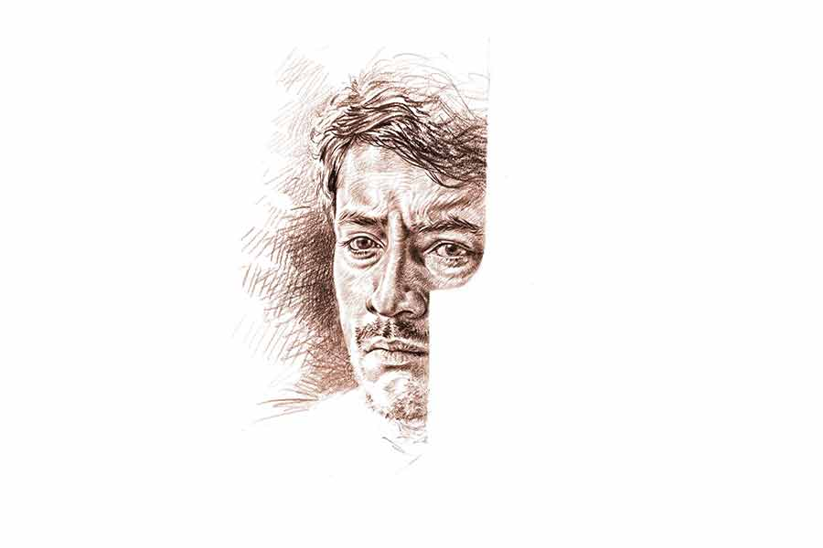

 
 <h1 align=center>গাওস্কর সিনড্রোম</h1>
<h2 align=center>সুব্রত নাগ</h2> 

ছুটে আসছে ম্যালকম মার্শাল।

ক্লাইভ লয়েড খুব মন দিয়ে ফিল্ড সাজিয়ে রেখেছে। তিনটে স্লিপ, গালি, ফরোয়ার্ড শর্ট লেগ। সেকেন্ড স্লিপ থেকে ভিভ রিচার্ডসের হেঁড়ে গলা ভেসে আসে, “তেক হিম কুইক ম্যান, তেক হিম কুইক!” যেন তর সইছে না আর।

ড্রাম আর বিউগলের উল্লাসে ফেটে পড়ে সাবাইনা পার্ক। একটা পাখি উড়ে যায় মিড অফ থেকে মিড অনের দিকে। চোয়াল শক্ত করে স্টান্স নিয়ে দাঁড়াই।

আপনারা নিশ্চয়ই অবাক! ফলো অন এড়াতে ইন্ডিয়ার প্রায় দুশো রান বাকি, এমন সিচুয়েশনে তো পাঁচ ফুট পাঁচ ইঞ্চির লিটল মাস্টারেরই ব্যাট হাতে দাঁড়ানোর কথা, কিন্তু বিশ্বাস করুন, গাওস্করের উপরে এখন আর আমার তেমন আস্থা নেই। আর নেই বলেই ‘ডু অর ডাই’ ম্যাচে ব্যাট হাতে ভয়ঙ্কর ক্যারিবিয়ান পেস ব্যাটারির সামনে নিজেই এগিয়ে এসেছি। তবু এক বারও গাওস্করকে মাঠে নামার জন্য রিকোয়েস্ট করিনি।

অথচ জীবনভর এই লোকটার জন্য কম হেনস্থা সহ্য করিনি, আর স্যাক্রিফাইসও কিছু কম করিনি। সে সব খুলে না বললে আপনারা বুঝতে পারবেন না।

গাওস্করের জন্য প্রথম যখন বেইজ্জত হয়েছিলাম, তখন আমি খুবই ছোট। বড় জোর থ্রি-তে পড়ি। বাড়িতে এক বয়স্ক মাস্টারমশাই ইংরেজি পড়াতে আসতেন নিয়ম করে। গম্ভীর মানুষ। খেলাধুলো পছন্দ করতেন না। মনে হত যেন, এ রকম বুড়োসুড়ো হয়েই জন্মেছেন, কখনও ছোট ছিলেন না, তাই খেলাধুলো পছন্দ করার প্রশ্নও নেই। শীতের দুপুরে ব্যাট-বল-উইকেট নিয়ে মাঠে রোদ পোহানো ছাড়া ক্রিকেট খেলার আর কোনও সদর্থক গুণ তাঁর চোখে পড়ত না।

এক দিন পড়ার সময় কী ভাবে যেন গাওস্করের প্রসঙ্গ উঠেছিল। আমি তো প্রবল উৎসাহে গাওস্করের ক’টা সেঞ্চুরি, ডাবল সেঞ্চুরি, রান ইত্যাদি ক্রিকেটীয় রেকর্ডই শুধু নয়, গাওস্করের বাবা-মায়ের নাম, বৌ, বোন এমনকি ভগ্নিপতি বিশ্বনাথের নাম অবধি গড়গড় করে আউড়ে নলেজ ব্যাঙ্ক উজাড় করে দিয়েছিলাম।

পিঠ চাপড়ে দেওয়ার বদলে মাস্টারমশাই চোখ সরু করে, গলা খাঁকরে বললেন, “গাওস্করের ঠিকুজি-কুষ্ঠি তো কণ্ঠস্থ, তা তোমার ঠাকুরদা-ঠাকুরমার নাম কী?”

অপ্রত্যাশিত প্রশ্ন হলেও আত্মবিশ্বাস টসকায়নি আমার। ঢোঁক না গিলেই ফটাস করে বলে দিয়েছিলাম, “ঠাকুদ্দা সুশীল বসু আর ঠাকুমা নিভাননী বসু।”

ব্যাপারটা ওখানেই মিটে যেতে পারত। কিন্তু মিটল না। কপালে গেরো থাকলে যা হয়। আমার বিভীষণপন্থী মা ঝামেলাটা পাকিয়েছিলেন। কী কুক্ষণে ঠিক তক্ষুনি চা-বিস্কুট দিতে এসেছিলেন স্যরকে। ঘরে ঢুকেই আমার উত্তর শুনে হাঁইমাই করে উঠেছিলেন, “কী সব উল্টোপাল্টা বলছিস তাতাই? তোর ঠাকুরদার নাম তো সুরেশ বসু, সুশীল বলছিস কেন? ছি ছি ছি...”

ব্যস! স্যরকে আর পায় কে? তিনি তখন ফুলটস বল পেয়ে গেছেন। মায়ের আন্তরিক সমর্থনে আমার দু’কান আচ্ছা করে মলে দিয়ে বলেছিলেন, “হতভাগা ছেলে! গাওস্করের চোদ্দো পুরুষের নাম জানো, আর নিজের ঠাকুরদার নাম ঠিকঠাক বলতে পারো না?” আমি আমার ঠাকুরদা নাম বলতে গিয়ে দু’-একটা অক্ষর গুলিয়ে ফেললে ওঁর ঠাকুরদার কী এসে যায়— এ রকম একটা প্রতিবাদ মনে বুড়বুড়ি কাটলেও মুখে উচ্চারণ করে উঠতে পারিনি। সে কালে শাসনটাসন খুবই অন্য রকম ছিল কি না।

দ্বিতীয় বার অপদস্থ হয়েছিলাম সিক্সে পড়ার সময়। তার আগের দিনই ওভালে গাওস্কর দু’শো একুশ রানের ঐতিহাসিক ইনিংসটি খেলেছেন। তখন সন্ধেবেলায় আমাদের বাড়ির বৈঠকখানায় বাবাদের জমাটি তাসের আসর বসত। সঙ্গে দফায় দফায় চা, স্টোভের ধোঁয়া আর মায়ের গজগজানি— সব চলত এক সঙ্গেই।

তা রুটিনমাফিক সে দিন সন্ধ্যাবেলাতেও আসরের আড্ডাধারী প্রতিবেশীরা, মানে অরূপকাকু, বীরেনকাকু আর বাদলকাকু এসে হাঁক দিয়েছেন, “কই গো সুবীরদা, সাতটা যে বেজে গেল, এখনও মাদুর পাতা হয়নি দেখছি...”

বাবা তখন কানে রেডিয়ো লাগিয়ে বসে আছেন। প্রায় ধ্যানস্থ ভাব। আশপাশে কেউ জোরে কথা বলে উঠলে অসম্ভব বিরক্তির দৃষ্টিতে তাকাচ্ছেন। হাত নেড়ে সটান বললেন, “আজ তাস-টাস বন্ধ— শুধু ক্রিকেট কমেন্ট্রি।”

অরূপকাকু গাঁইগুঁই করেছিলেন, “সারা দিন খাটাখাটনির শেষে তাসের মজলিশটাই তো দাদা আমাদের অক্সিজেন, তা সেটাও যদি না হয়...”

ওভালে গাওস্কর তখন দেড়শো ছুঁলেন। কমেন্টেটর কিশোর ভিমানির গমগমে গলা শোনা যাচ্ছে, “সানি ইজ় প্লেয়িং দ্য ইনিংস অব হিজ় লাইফ!” বাবা প্রবল উত্তেজনায় রেডিয়োতেই এক চাপড় মেরে বলেন, “শুনলেন কী বলছে? লোকটা জীবনের সেরা ইনিংসটা খেলছে! এই অবস্থায় খেলা শোনা ছেড়ে তাস পেটানোটা পাপ বুঝলেন, পাপ!”

অগত্যা পাপ এড়াতেই সম্ভবত, বাবার সঙ্গে সঙ্গে আরও তিনটে মাথা ঝুঁকে পড়ল রেডিয়োর উপরে।

সে যাত্রা ওঁরা পাপটা এড়াতে পারলেও পরের দিন আমি স্কুলে বিপদটা এড়াতে পারলাম না। ছাত্রমহলে কুখ্যাত, অঙ্কের বিকাশস্যর ধরে ধরে সবার হোমটাস্ক চেক করছিলেন। মাস্টারমশাইরা সেকালে খেলা দেখতেন কি না জানি না, তবে ছাত্রদের খেলা দেখাকে যে মহাপাপ বলে মনে করতেন, তাতে আমার সন্দেহ নেই। হোমটাস্কের নাকা-চেকিংয়ে আমার পালা আসতেই বীরের মতো স্পষ্ট জানিয়ে দিলাম, “করা হয়নি স্যর।”

হোমটাস্ক না করে আসার মতো বুকের পাটা তখন টেন-ইলেভেনের ছাত্রদেরই ছিল না, তো ক্লাস সিক্সের এক পুঁচকে! কিন্তু গাওস্করের ব্যাটিং- প্রভাবিত উদ্দীপনাতেই সম্ভবত, আমার মধ্যে কিছুটা বীররসের সঞ্চার হয়ে থাকবে। তাই কোনও ভণিতার মধ্যে যেতে মন চাইল না।

স্যর বোধহয় এতটা সাহস, কিংবা বলা ভাল দুঃসাহস, আশা করেননি। চিবিয়ে চিবিয়ে জিজ্ঞেস করলেন, “করা হয়নি কেন, বাছাধন?”

একই রকম অকুতোভয়েই জবাব দিয়েছিলাম, “রেডিয়োতে গাওস্করের ব্যাটিংয়ের কমেন্ট্রি শুনছিলাম, স্যর।”

স্যরের গলা দু’পর্দা চড়েছিল, “জ্বর-জ্বালা নয়, পেটব্যথা নয়, সর্দিকাশি নয়— রেডিয়োতে খেলা শোনার জন্য হোমটাস্ক করিসনি?”

হেলমেট ছাড়া গাওস্কর টমসন, রবার্টস, হোল্ডিংকে সামলেছেন, আর আমি পারব না? বুক ফুলিয়েই জবাব দিয়েছিলাম, “গাওস্কর কাল তার জীবনের সেরা ইনিংসটা খেলছিল স্যর, ওই খেলা না শুনে হোমটাস্ক করাটা পাপ।”

সে আমলে ছাত্র ঠেঙানোর ক্ষেত্রে গার্জেনদের হুমকি, সোশ্যাল মিডিয়ার মাতব্বরি কিংবা মানবাধিকার কমিশনের গুঁতো— কোনও রক্ষাকবচই ছিল না। ফলে হাতের কঞ্চিটার যথোচিত সদ্ব্যবহার করে বিকাশস্যর হুঙ্কার ছাড়লেন, “গাওস্করের ভূত যদি তোর ঘাড় থেকে না নামিয়েছি...”

না, নামাতে পারেননি স্যর। নামাবেন কী করে? শুধু ঘাড়ে তো নয়, রক্ত-মাংস-শিরা-মজ্জায় মিশেছিল গাওস্কর সিনড্রোম। আর প্রতিদিন অল্প অল্প করে এই সিনড্রোম শরীরে ঢুকিয়েছিল প্রকাশদা, আমাদের পাড়ার অবিসংবাদিত ক্রিকেট কোচ। ব্যাট হাতে উইকেটের সামনে দাঁড়ালেই প্রকাশদার রানিং কমেন্ট্রি শুরু হয়ে যেত, “গাওস্করের ব্যাটিং এ টু জ়েড ফলো করবি, ব্যাট-প্যাডের মাঝে একটা ছুঁচও যেন না গলে।” ড্রাইভ করতে গিয়ে দু’হাত বল উঠলেই হাঁ হাঁ করে উঠত, “গাওস্করের কভার ড্রাইভ টিভিতে দেখিসনি? এক ইঞ্চি উঠবে না বল, মাটি কামড়ে ছুটবে বাউন্ডারিতে।” প্র্যাকটিসের শেষে আমাকে আলাদা করে ডেকে বলত, “মাঝে মাঝে কনসেন্ট্রেশন হারিয়ে ফেলিস কেন? উইকেটের পিছনে বোমা ফাটলেও গাওস্কর ফিরে তাকায় না। অর্জুন যেমন পাখির চোখ ছাড়া আর কিছু দেখেনি, তেমনই বোলারের হাত থেকে বেরিয়ে আসা লাল বলটা ছাড়া আর কিছু দেখবি না।”

তবু কনসেন্ট্রেশন নষ্ট করার মতো পাবলিকের অভাবও ছিল না। যেমন ছিল রিনি, আমার কলেজের বন্ধু নীহারের সুন্দরী, চটকদার, ‘আবার খাব’ টাইপের বোন রিনি। বহু শাঁসালো পাত্র রিনির জন্য ইট পেতে রাখলেও কী কুক্ষণে যে আমি ওর নেকনজরে পড়েছিলাম কে জানে! কাজে-অকাজে নীহারদের বাড়ি গেলেই বিপজ্জনক সব সিগন্যাল দিত। তাকাতাম না আমি। যত দূর সম্ভব এড়িয়ে চলতাম, কারণ প্রকাশদা শিখিয়েছিল— প্রলোভন জয় না করলে ভাল ব্যাটসম্যান হওয়া যায় না। স্পিনাররা ফ্লাইট করাবে, ক্রিজ় ছেড়ে বেরিয়ে আসার টোপ দেবে, কিন্তু ফাঁদে পা দিলেই সর্বনাশ। লোভে পাপ, পাপে আউট।

এক দিন কিন্তু বাগে পেয়ে গেল রিনি। ইংরেজির দুটো নোট আনতে গিয়েছিলাম নীহারের কাছে। ভর সন্ধেবেলায় বাড়িতে যে রিনি ছাড়া আর কেউ নেই, সেটা আগে বুঝতে পারলে ভিতরে ঢুকতামই না। কিন্তু নীহারের ঘরের চৌকিতে বসে যখন জানলাম ব্যাপারটা, তখন অনেক দেরি হয়ে গেছে, মানে প্যাভিলিয়ন ছেড়ে ব্যাট-প্যাড নিয়ে মাঠে নেমে পড়েছি। আর স্লিভলেস একটা ম্যাক্সি পরে দামি পারফিউম মেখে রিনি যখন ঘরে ঢুকল, তখনই বুঝতে পারলাম ব্যাটিং করাটা মোটেও সহজ হবে না। লর্ডস কিংবা ওল্ড ট্র্যাফোর্ডের স্যাঁতসেঁতে পিচ, মেঘলা আকাশ— টিপিক্যাল ইংলিশ ওয়েদার। বোথাম-উইলিস তো আছেই; কিন্তু মিড উইকেটে দাঁড়িয়ে আরও এক জন ঠোঁট চাটছে, ডেরেক আন্ডারউড। ইংল্যান্ডে ভেজা পিচে আন্ডারউড যে কী খতরনাক বোলার, তা বিশ্বের বাঘা বাঘা ব্যাটাররাও হাড়ে হাড়ে টের পেয়েছে। ভাবতে না ভাবতেই আন্ডারউড, থুড়ি রিনি শরবতের গ্লাস হাতে বসল নাকের ডগায়। ওর শরীরের দুরন্ত আঁকবাঁকগুলো ক্লোজ়-ইন ফিল্ডারের মতো ঘিরে ধরছিল আমায়। প্রকাশদার কথাটা মাথায় ঘুরপাক খাচ্ছিল, “অলওয়েজ় ফলো গাওস্কর’স ডিফেন্স— রক সলিড।”

ফিল্ড সাজাচ্ছিল আন্ডারউড। এক বার হাসল রিনি, “কত দিন আসোনি দেবুদা!”

শুকনো গলায় কোনও মতে বললাম, “ক্-কাজ ছিল।”

রিনি এ বার ঠোঁটে নয়, চোখে হাসল, “লায়ার! ভয় পাও আমাকে?”

ওর বন্য ক্লিভেজের মায়াবী হাতছানি ক্রমশ অনিবার্য হয়ে উঠছিল। গাওস্কর সিনড্রোমের চূড়ান্ত পরীক্ষা! একের পর এক বিষাক্ত ডেলিভারি বেরিয়ে আসছে আন্ডারউডের হাত থেকে, প্রায় ক্রিজ়ের উপরেই হায়নার মতোওত পেতে বসে রয়েছে সিলি মিড অফ। পা বাড়িয়ে স্রেফ ডেড ডিফেন্স। ফ্যাঁসফেঁসে গলায় রিনিকে বললাম, “আ-আমার দেরি হয়ে যাচ্ছে।বাড়ি যাব।”

গোটা শরীরে একটা মোচড় দিয়ে রিনি বলল, “যাবেই তো, কিন্তু তার আগে শেষ ডেলিভারিটা খেলে যাবেনা? দেখি, তুমি আউট হও, না কি চার-ছয় মারো?”

আন্ডারউডের লাস্ট বলটা অফ-মিডলের উপর পড়ে ছোট স্পিন করে বেরিয়ে যাচ্ছে। বেশির ভাগ ব্যাটারই সম্মোহিতের মতো স্টিয়ার করতে যাবে আর ব্যাটে আলতো চুমু খেয়ে বল চলে যাবে স্লিপে। কিন্তু আমরা যারা গাওস্কর সিনড্রোম বুকে নিয়ে খেলতে নামি, তারা খুব ভাল ভাবেই জানি অফ স্টাম্পটা ঠিক কোথায়। প্রকাশদার সাবধানী গলা শুনতে পেলাম, “খেলিস না বলটা, ছেড়ে দে।”

রিনির লিপস্টিক-মাখা ঠোঁট এগিয়ে আসছে। শেষ মুহূর্তে ব্যাট, মানে ঠোঁট সরিয়ে নিলাম আমি, তার পর একছুটে ঘরের বাইরে। ওভার শেষ! কমেন্টেটর উচ্ছ্বসিত, “ওয়েল লেফ্ট!” রিনি ঘৃণা আর আফসোসে চিৎকার করে উঠল, “কাওয়ার্ড!”

*****

সেই মন ছুঁক-ছুঁক করা বয়সেও যার জন্য রিনিকে ফিরিয়ে দিয়েছিলাম, সেই গাওস্করই অদ্ভুত ভাবে বদলে যেতে লাগলেন। বদলটা প্রথম ধরা পড়ে তিরাশির বিশ্বকাপের পরে ওয়েস্ট ইন্ডিজ়ের ভারত সফরের সময়। দিল্লি টেস্টে ঝোড়ো সেঞ্চুরি করে ব্র্যাডম্যানকে ছুঁলেন, হুক করে মার্শালকে ফেললেন গ্যালারিতে; পরের আমদাবাদ টেস্টে নব্বই, গালির উপর দিয়ে আপার কাটে বাউন্ডারি! ইডেন টেস্টের সেকেন্ড ইনিংসে হোল্ডিংয়ের ওয়াইড বলকে তাড়া করে কট বিহাইন্ড! বার বার শিউরে উঠলেও ভরসার শেষ আলোটা তখনও নেবেনি। কিন্তু সাতাশিতে রিলায়েন্স বিশ্বকাপে নিউ জ়িল্যান্ডের বিরুদ্ধে নাগপুর ম্যাচে মারকাটারি ব্যাটিং করে যখন প্রথম ওয়ান ডে সেঞ্চুরিটা করলেন গাওস্কর, স্তম্ভিত হয়ে গেলাম। একই ম্যাচে চেতন শর্মার হ্যাটট্রিক আর গাওস্করের সেঞ্চুরি— ডবল সেলিব্রেশনের ধামাকায় পাড়াময় বাজি-পটকা। অসহ্য লাগছিল আমার। প্রিয়জন হারানোর যন্ত্রণা বার বার ফেনিয়ে উঠছিল বুকের মধ্যে। চুপচাপ বাড়ি থেকে বেরিয়ে হাঁটতে থাকি আমি। দ্রুত পা চালাই, কারণ আমি জানতাম ঠিক কোথায় যেতে হবে আমাকে।

বাড়িতেই ছিল প্রকাশদা। যাবেই বা কোথায়? ক্রিকেটের নেশায় ঘর-সংসার না করা বাউন্ডুলে জীবন এখন দারিদ্র আর রোগের চাপে ধুঁকছে। আধময়লা বিছানায় রংচটা একটা চাদর গায়ে বসে ছিল। খোলা জানলা দিয়ে সন্ধ্যা ছুঁই-ছুঁই বিকেলের আলো ঢুকছিল ঘরে। প্রকাশদার মুখে অকালবার্ধক্যের ভাঙচুর। একটা মোড়া টেনে বসে জিজ্ঞেস করলাম, “কেমন আছ?”

কত দূর থেকে যেন ভেসে আসে প্রকাশদার গলা, “ভাল নেই রে। আজকাল খুব বিট্রে করছে শরীরটা, ডিফেন্সটাই ভেঙে পড়েছে।”

“খেলাটা দেখলে? গাওস্করের সেঞ্চুরি?” প্রসঙ্গে আসি আমি।

প্রায় ফাঁকা হয়ে আসা মাথার চুলে হাত বোলাতে বোলাতে প্রকাশদা জিজ্ঞেস করল, “তোদের কি আমি ভুল শিখিয়েছিলাম, দেবু? তোদের যে বার বার বলতাম কপিবুক ডিফেন্স মানেই গাওস্কর, সেটা কি ভুল?”

কোন যন্ত্রণা থেকে প্রকাশদা এ কথা বলছে, সেটা বুঝতে পারছি। সান্ত্বনা দিতে গেলাম না।

প্রকাশদা আবার সরব হয়, “যার ব্যাট-প্যাডের মধ্যে মাছি গলত না, সেখানে ক্রিকেট বল কেন, ফুটবলও গলে যাবে! চ্যাটফিল্ডকে একের পর এক তুলে তুলে চার-ছয় মেরে গেল! স্কোয়ার লেগ দিয়ে যে চারটা মারল সেটা স্রেফ তাড়ু শট রে, ভাবতে পারিস দেবু?” বড় অস্থির লাগে প্রকাশদাকে, “লোকটা এ ভাবে আমাদের ধোঁকা দিল?”

জীবনে বোধহয় এই প্রথম প্রকাশদা গাওস্করকে ‘লোকটা’ বলে সম্বোধন করল! সে দিন আরও অনেক ক্ষণ আমরা চুপ করে বসে রইলাম। আস্তে আস্তে দিনের আলো ফুরিয়ে গেলে ঘরে অন্ধকার উঁকিঝুঁকি মারতে লাগল। দু’-চারটে তারা আর এক ফালি ফ্যাকাসে চাঁদ জানলার পাশের নিমগাছের পাতার ফাঁকে ঝুলে রইল। সে দিন উঠে আসার আগে স্খলিত গলায় প্রকাশদা বলেছিল, “আজ থেকে লোকটা আমার কাছে মরে গেল দেবু।”

সুইচ টিপে ঘরের আলো জ্বালিয়ে দিয়ে বলেছিলাম, “তুমি আমাদের ভুল শেখাওনি প্রকাশদা। গাওস্কর মারা গেলেও গাওস্কর সিনড্রোম ঠিক বেঁচে থাকবে, দেখো।”

সে দিন প্রকাশদাকে কথা দিয়ে এসেছিলাম বলেই তো এই মুহূর্তে প্রোমোটার আগরওয়ালের অফিসে শিরদাঁড়া সোজা করে বসে আছি। বিদেশি সিগারেটে টান দিয়ে ধোঁয়ার রিং ছাড়তে ছাড়তে আগরওয়াল বলে, “ফাইনাল ডিসিশন তা হলে কী হল দেবুবাবু?”

আগরওয়ালের চোখে চোখ রেখেই বলি, “সেটা তো অনেক বারই বলেছি। বিক্রি করব না।”

“সেই গোঁয়ার্তুমি! অফিসেও নাকি টেন্ডারের বেপারে এক পয়সা নেন না?” অবাক হয় আগরওয়াল।

বিড়বিড় করে বলি, “গাওস্কর সিনড্রোম। ও সব বুঝবেন না।”

‘‘ঠিক কথা; আমরা প্রোমোটাররা ও সব মর‌্যাল ভ্যালুজ় বুঝব না,” মাথা নাড়ে আগরওয়াল, “কিন্তু আপনিও তো বুঝতে পারছেন না, গ্র্যান্ডফাদারের আমলের এই থুত্থুরে বাড়িটা আর আট কাঠা বাগান আগলে রেখে আপনি হাতের লক্ষ্মীকেপায়ে ঠেলছেন।”

মাঠে নামতে বেশি দেরি নেই। প্যাড-গ্লাভস পরে তৈরি হতে হবে।

আগরওয়াল আমার দিকে ঝুঁকে আসে, “আপনার সব খবরই নিয়েছি দেবুবাবু। ছেলেটা তো বেকার, কাজ-কাম কিছুই জোটেনি। মেয়ের বিয়ের বয়স ক্রস করে যাচ্ছে, কিন্তু পায়ে ডিফেক্ট আছে বলে পাত্র জোগাড় করতে পারছেন না। মোটা অ্যামাউন্টের ডাউরি না দিলে জোগাড় করতে পারবেনও না।”

আম্পায়ার দু’জন মাঠে চলে গেছেন। ক্যারিবিয়ান টিমও মাঠে নামছে। ব্যাটে হাতে ড্রেসিংরুমে দ্রুত কয়েক বার শ্যাডো করে নিতে হবে।

আগরওয়ালের মুখ আরও ঝুঁকে আসে, “আপনার মিসেসের দুটো কিডনিই তো ড্যামেজড। বাঁচিয়ে রাখতে গেলে আইদার ডায়ালিসিস অর ট্রান্সপ্ল্যান্টেশন! মাস গেলে বাঁধাধরা মাইনে, উপরি নিবেন না, কোথায় পাবেন এত টাকা?”

ওপেনিং পার্টনারকে নিয়ে নেমে পড়লাম মাঠে। সাবাইনা পার্ক আজ আরও উত্তাল।

“ফাইনাল অফার দিচ্ছি। জমি-বাড়ি ছেড়ে দিন, সত্তর লাখ দেব আপনাকে। সেভেন্টি ল্যাকস! প্লাস একটা থ্রি-বিএইচকে ফ্ল্যাট, কোটি টাকার বেশি অফার।”

লয়েড আজকে তিনটের জায়গায় চারটে স্লিপ রেখেছে, ল্যারি গোমস একটু এগিয়ে শর্ট গালিতে। ফরোয়ার্ড শর্ট লেগ তো থাকেই, হেইনসকে ব্যাকওয়ার্ড শর্ট লেগে নিয়ে এল লয়েড। বাউন্সার দেবে, নাকি টোপ দেখিয়ে ইয়র্কার?

সেকেন্ড স্লিপ থেকে রিচার্ডস যথারীতি হেঁড়ে গলায় চেঁচাল, “তেক হিম কুইক ম্যান।”

ফিচেল হেইনস ফুট কাটে, “অর হিত হিম হার্ড।”

এক কোটি মানে একের পরে সাতটা শূন্য! এত টাকা দেবে আগরওয়াল! আমার চিন্তাভাবনার ব্যাট-প্যাড কি বলের লাইন মিস করে ফেলবে! চোখটা ধাঁধিয়ে যাচ্ছে কি! আহ্, নিজেই নিজেকে দাবড়ালাম। গাওস্কর সিনড্রোমে লস অব কনসেন্ট্রেশনের কোনও জায়গা নেই।

নিঃসঙ্গ পাখিটা আজও মাঠে উড়ছে। এক প্রান্ত থেকে অন্য দিকে।

আম্পায়ার হাঁকেন, ‘প্লে।’

ব্যাটটা শক্ত করে ধরে বোলারের দিকে তাকালাম।

ছুটে আসছে মার্শাল। স্টান্স নিয়ে দাঁড়াই। ফলো অন এড়াতে এখনও একশো বিরাশি রান দরকার। পৃথিবীর শেষ গাওস্কর নেমেছে ব্যাট করতে, তাকে কোনও ভাবেই আউট হলে চলবে না।

