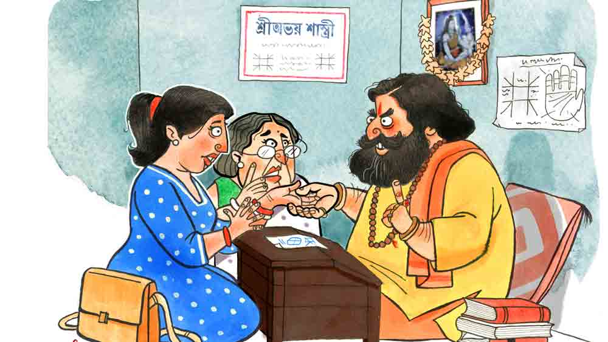

 

<h1 align=center> গোড়ায় গলদ</h1>
<h2 align=center>সোমজা দাস</h2>
মেয়েটির দু’হাতের পাতা চোখের সামনে মেলে ধরে গম্ভীর মুখে মাথা নাড়লেন অভয় শাস্ত্রী। সামনে উপবিষ্ট দুই মহিলা উৎকণ্ঠা নিয়ে তাঁর মুখের দিকে তাকিয়ে আছে। অভয় শাস্ত্রী জানেন, এখন এদের খেলাতে হবে। নিজের শক্ত কড়া পড়া হাতের ভিতর ধরা শ্যামলা নরম হাতের প্রতিটি রেখা গভীর মনোযোগে খুঁটিয়ে দেখতে থাকেন তিনি। তাঁর দাড়িগোঁফে ঢাকা মুখে খেলা করে যায় নানা অভিব্যক্তির রেখা। সময় নেন তিনি। মক্কেলের উত্তেজনার পারদ চড়াতে না পারলে খেলাটা জমবে না। এই খেলা অভয় শাস্ত্রী গত পনেরো বছরের বেশি সময় ধরে খেলে আসছেন। তিনি খুব ভাল করে জানেন, তাঁর পেশাটাই অভিনয়ের উপর দাঁড়িয়ে। আর এই অভিনয়টা যিনি যত ভাল করেন, তিনি তত সফল।   বেশ কিছু ক্ষণ ঘুরিয়ে ফিরিয়ে দু’হাতের তালু পর্যবেক্ষণ করার পর হতাশ দৃষ্টিতে মক্কেলের মুখের দিকে তাকালেন অভয় শাস্ত্রী। মেয়েটির বয়স সাতাশ-আঠাশের কম নয়। গায়ের রং বেশ চাপা। নাক চোখ অবশ্য মন্দ নয়, কিন্তু সামনের পাটির দাঁত সামান্য উঁচু। শাখাসিঁদুর নেই। সঙ্গী মহিলা নিশ্চিত ভাবেই মেয়েটির মা, কারণ মেয়েটি তাকে ‘মামণি’ বলে ডাকছে। অভয় শাস্ত্রী এই শহরের খ্যাতনামা জ্যোতিষী। বেনারস থেকে অনেক টাকা খরচা করে ‘জ্যোতিষাচার্য’, ‘জ্যোতিষার্ণব’ গোছের বেশ কিছু উপাধি আনিয়েছেন। নিজের বাড়ির নীচতলায় বিশাল চেম্বার খুলে বসেছেন। এ ছাড়াও সপ্তাহে চার দিন দু’টি গয়নার দোকানে গ্রহরত্ন বিভাগে বসেন। এই অঞ্চলে তাঁর খুব সুনাম, তিনি নাকি মুখ দেখেই মক্কেলের সমস্যা বুঝে যান। এ ক্ষেত্রে অবিশ্যি তাকে বিশেষ কষ্ট করতে হয়নি। ঘরে ঢুকে সামনে বসেই মহিলাটি কাঁচুমাচু অপ্রস্তুত মুখে বলেছিলেন, “একটা বিয়ের সম্বন্ধের ব্যাপারে আপনার পরামর্শ চাইতে এসেছি।”   অভয় শাস্ত্রীর মতো ঘাঘু জ্যোতিষীর পক্ষে কেস বুঝে নেওয়ার জন্য একটা বাক্যই যথেষ্ট। কালো মেয়ের বিয়ে হচ্ছে না। এ সব কেস তাঁর কাছে আকছার আসে। মেয়েটির মুখের দিকে আড়চোখে চেয়ে দেখে মেপে নেন তিনি। বিয়ের বাজারে খুব লোভনীয় পাত্রী বলা যাবে না। সহজ বিধান না খাটার আশঙ্কাই বেশি। কারণ বিধান মানার পরেও যদি বিয়ে না হয়, তা হলে অভয় শাস্ত্রীর সুনামে কালির পোঁচ পড়বে। সুতরাং তাদের আর কিছু বলতে না দিয়ে মেয়েটির হাতটা টেনে নিলেন তিনি। মেয়েটি উসখুস করে কিছু বলার চেষ্টা করেছিল। তাকে হাত তুলে থামিয়ে দিলেন অভয় শাস্ত্রী। অনেক ক্ষণ ধরে উল্টেপাল্টে দেখে ধ্যানস্থ হলেন। ভাবার জন্য একটু সময় দরকার, যাতে সাপও মরে, লাঠিও না ভাঙে।   মিনিট খানেক চোখ বুজে থাকার পর চোখ মেললেন জ্যোতিষার্ণব। বেশি সময় নেওয়ার উপায় নেই। বাইরে আরও অনেক সাক্ষাৎপ্রার্থী অধীর আগ্রহে অপেক্ষা করছে। শান্ত দৃষ্টিতে তাকালেন মেয়েটির মায়ের দিকে। বললেন, “আমি জানি, এই মুহূর্তে আপনারা অনেক রকম মানসিক দোলাচলে ভুগছেন। শনির সাড়ে সাতী চলছে, তবে আর কিছু সময়ের মধ্যেই কেটে যাবে।”   মেয়েটি আবার উসখুস করে উঠল। বলল, “কিন্তু আমরা তো...”   “আমি জানি, মা,” স্মিতমুখে বললেন অভয় শাস্ত্রী, “আমি জানি তোমরা কতটা মনোবেদনা নিয়ে আমার দ্বারস্থ হয়েছ। চিন্তা কী, আমি তো আছি! জানি অপেক্ষার প্রহর বড় দীর্ঘ মনে হয়। কিন্তু সব কিছুর উপরে তো দয়াময় ঈশ্বরের বিধান। তবে ভেবো না মা, একদম ঠিক জায়গায় এসেছ তোমরা। আমার কাছে যখন এসেই পড়েছ, তখন শুকনো মুখে তো ফেরত যেতে দেব না মাকে। বাইরে বোর্ডে লেখা দেখোনি? ‘সব জ্যোতিষী বার বার, অভয় শাস্ত্রী একবার’। তোমার মুখ দেখেই বুঝেছি, কালসর্প যোগ চলছে। তাই বিয়েতে বাধা পড়ছে। ঠিক হয়ে যাবে, সব ঠিক হয়ে যাবে। আর যদি না-ও হয়, আমি আছি কী করতে? যজ্ঞ করে সব ঠিক করে দেব।”   “না না, আমরা আসলে…” এ বার বাধা দিয়ে বলে উঠল মেয়েটির মা। কিন্তু অভয় শাস্ত্রী হাত তুলে থামিয়ে দিলেন ভদ্রমহিলাকে। বললেন, “কিচ্ছু বলতে হবে না মা। অভয় শাস্ত্রী মানুষের মুখ দেখে মনের কথা বোঝে। আমায় কিচ্ছু বলে দেওয়ার প্রয়োজন নেই। কে কী জন্য আমার দরজায় এসে দাঁড়ায়, আমি সব জানতে পারি। এই বিদ্যা সকলের আয়ত্ত নয় মা। এর জন্য হিমালয়ের দুর্গম অঞ্চলে কনকনে ঠান্ডায় কৌপীন পরিধান করে, তিন দিনে এক বার ফলমূলাদি আহার্য হিসেবে গ্রহণ করে টানা পাঁচ বছর তপস্যা করতে হয়। সে অনেক কষ্টে অর্জিত বিদ্যা।”   ভদ্রমহিলার মুখে সম্ভ্রমের ভাব ফুটে উঠল। অভয় শাস্ত্রী এই অভিব্যক্তির অর্থ জানেন। এর মানে ওষুধে কাজ ধরছে। মনে মনে আত্মপ্রসাদ অনুভব করেন অভয় শাস্ত্রী। এই শহরে কত জ্যোতিষীই তো আছে, কিন্তু অভয় শাস্ত্রীর মতো সফল ক’জন? তিনি জানেন, শুধু ভেক ধরলে ভিখ মেলে না, বুদ্ধিটাও খরচ করা চাই। জায়গা বুঝে অস্ত্র প্রয়োগ করতে জানতে হবে। যেমন এ ক্ষেত্রে। জলের মতো কেস। ভদ্রমহিলা মেয়ের বিয়ে নিয়ে দুশ্চিন্তায় অর্ধেক মরেই আছেন, আলতো করে খাঁড়ার ঘা দিতে হবে শুধু। তাই অভয় শাস্ত্রী মাথা নেড়ে বললেন, “আমি জানি মা, যাগযজ্ঞের নাম শুনে ভয় পাচ্ছেন আপনারা। কিন্তু মা, যে রোগে যে ওষুধ। আপনার মেয়ের বিয়ের গ্যারান্টি আমার।”   মেয়েটি এ বার অভয় শাস্ত্রীর হাতের মধ্যে ধরা নিজের হাত টেনে নিয়ে বলল, “দেখুন আপনি বুঝতে ভুল করছেন। বিয়ের ব্যাপারটা…”   “বিয়ের ব্যাপার বলেই তো দুশ্চিন্তা করছি মা,” মেয়েটিকে থামিয়ে দিয়ে গম্ভীর মুখে বললেন অভয় শাস্ত্রী, “জন্ম-মৃত্যু-বিয়ে, সবই বিধির লিখন। কোটি কোটি মাইল দূরে গ্রহনক্ষত্রের অবস্থানে একটু গড়বড় থাকলে পাকা সম্বন্ধও কেঁচে যায়। আর যদি বা হয়েও যায় কোনও রকমে, সেও টেকে না। আজকাল সব দু’পাতা পড়ে আধুনিক হয়েছে। জ্যোতিষ-কবচে বিশ্বাস করে না। কিন্তু এ সব কি আর আজকের শাস্ত্র? কত বড় বড় মুনি-ঋষি ব্রহ্মজ্ঞানী পণ্ডিত এই শাস্ত্র রচনা করেছেন! তবেই না... যাক সে কথা... তবে আপনারা একদম ঠিক জায়গায় এসেছেন। কত মেয়ের বিয়ে দিলাম আমি, কত ভাঙা সংসার নিপুণ করে জুড়ে দিলাম, তার ইয়ত্তা নেই।”   অভয় শাস্ত্রী হয়তো আরও কিছু বলতেন। কিন্তু মেয়েটি এ বার থামিয়ে দিল তাকে। বলল, “দেখুন আপনি পুরোপুরি ভুল বুঝছেন। আগে আমার কথাটা শুনুন। যাগযজ্ঞ করাতে আসিনি আমরা। শুধু একটা কথা জানার ছিল। শুধু মায়ের মনের শান্তির জন্য আসা এখানে। নইলে…”   “তিষ্ঠ! আমি সব জানি। আমায় নতুন করে কিছুই বলার দরকার নেই। এখানে আসার আগে কেউ আপনাদের বলে দেয়নি যে, অভয় শাস্ত্রী মুখ দেখে মনের কথা বুঝতে পারে?” রীতিমতো হুঙ্কার দিলেন অভয় শাস্ত্রী। এই ধরনের বেআক্কেলে মক্কেল মাঝে মাঝে সামলাতে হয় তাকে। যা বোঝার বুঝে নিয়েছেন তিনি। মেয়েটি আধুনিকা, জ্যোতিষে বিশ্বাস করে না। উড়ে বেড়িয়ে বিয়ের সময় পার করে দিয়েছে। এখন বর জুটছে না। মায়ের মন রাখার জন্য এসেছে এখানে। তবে তুচ্ছ সমস্যায় ডরানোর লোক অভয় শাস্ত্রী নন। এই ধরনের মক্কেলদের জন্যও অস্ত্র আছে তাঁর তূণীরে। যে মক্কেল অন্য কিছুতে ঘায়েল হয় না, সেও এই অস্ত্রে কাত হয়। আর সে অস্ত্র হল আদি অকৃত্রিম ভীতি প্রদর্শন। এই মেয়েটি অত্যন্ত ঢ্যাঁটা। সুতরাং অন্তিম অস্ত্রটিরই শরণাপন্ন হলেন অভয় শাস্ত্রী। এক মক্কেলকে নিয়ে আর কত সময় নষ্ট করা যায়? বাইরে তার দর্শনপ্রত্যাশীদের লম্বা লাইন পড়েছে। সবারই সমস্যার সমাধান করতে হবে তাকে। এক জনকে নিয়ে পড়ে থাকলে তো আর তাঁর চলবে না। তাই এ বার জলদগম্ভীর স্বরে মেয়েটির মায়ের দিকে তাকিয়ে তিনি বললেন, “দেখুন, আমি আপনাদের ভয় দেখাতে চাইনি। তাই এত ক্ষণ খুলে বলিনি। কিন্তু এখন মনে হচ্ছে খুলে না বললে, পরিস্থিতির গুরুত্ব আপনারা বুঝতে পারছেন না। শুনুন তবে, আপনার মেয়ের হাতে চল্লিশ বছরের আগে কোনও বিবাহ যোগই নেই। আর সেই বিয়েও নামেই বিয়ে। কারণ বিয়ের ছ’মাসের মধ্যেই নিশ্চিত বৈধব্যযোগ আছে আপনার মেয়ের। স্বামীসুখ, সন্তানসুখ কিছুই তার ভাগ্যে নেই। সেই জন্যই সাবধান করতে চাই। তবে আমি যখন আছি, তখন দুশ্চিন্তা করবেন না। আপনার মেয়ে, সে তো আমারও মেয়েরই মতো। তার মঙ্গলের জন্য সব চেয়ে কঠিন যজ্ঞটা করব আমি। সুদূর মহাকাশে গ্রহনক্ষত্রের অবস্থানের সামান্য ভুলচুকের জন্য এরকম বিপদ নেমে আসে।”   কথা বলতে বলতে অভয় শাস্ত্রী মা মেয়ের মুখের দিকে তাকালেন। শিকার ফাঁদে পা দিয়েছে মনে হচ্ছে। আর কোনও কথা বলছে না কেউ। দু’জনেরই দৃষ্টি অভয় শাস্ত্রীর মুখের উপর নিবদ্ধ। অভয় শাস্ত্রী হেসে বরাভয় দেখিয়ে বললেন, “কিন্তু চিন্তার কিছু নেই। আমার নিজস্ব গবেষণাগার থেকে রকেট পাঠিয়ে আমি সে সব গ্রহনক্ষত্রের অবস্থান পরিবর্তন করে দেব। একদম খাপে খাপ করে বসিয়ে দেব, বুঝলেন কি না? মেয়ের হরোস্কোপ নতুন করে লেখা হবে। ভৌমদোষের স্থান থেকে মঙ্গলকে সরিয়ে দিতে হবে। সে বড় কঠিন যজ্ঞ। টানা তিন দিন অভুক্ত থেকে অন্ধকার ঘরে এক পায়ে দাঁড়িয়ে মহাসিদ্ধ বীজমন্ত্র জপ করতে হবে এক কোটি বার। ব্যস! তা হলেই কেল্লা ফতে। আর কোনও চিন্তা থাকবে না। আর একটা ইয়ে, মানে খাঁটি রক্তপ্রবাল ধারণ করতে হবে। বিশ রতি। ইটালিয়ান। অক্স ব্লাড। সে সব আমি ভাল জায়গা থেকে কমসম করে করিয়ে দেব। মেয়ের বৈধব্যযোগ বলে কথা, ও কোনও ব্যাপারই নয়। খরচটা ধরুন হোমযজ্ঞ-রত্নধারণ ওই সব মিলিয়ে লাখখানেকের মধ্যেই...”   এ বার মেয়েটির মা উঠে দাঁড়ালেন। অভয় শাস্ত্রীর মুখের দিকে জ্বলন্ত দৃষ্টি নিক্ষেপ করে মেয়ের দিকে তাকিয়ে বললেন, “রিনি, আমি বাইরে গাড়িতে গিয়ে বসছি। তুই আয়,” বলে গটগট করে বাইরে বেরিয়ে গেলেন কোনও দিকে না তাকিয়ে।   মা বেরিয়ে যেতে মেয়েটিও উঠে দাঁড়াল। মায়ের নির্গমন পথের দিকে তাকিয়ে হঠাৎ হাসতে শুরু করল। সে হাসি আর তার থামে না। হেসেই যাচ্ছে তো যাচ্ছেই! অভয় শাস্ত্রী তার দিকে হতভম্ব হয়ে তাকিয়ে থাকেন। ভয় দেখানোটা কি বেশি হয়ে গেল? এ রকম তো হয় না কখনও! মেয়েটি এ বার হাসতে হাসতেই ব্যাগ খুলে দুটো পাঁচশো টাকার নোট বের করে অভয় শাস্ত্রীর সামনে গদির উপর রাখল। সে দরজার দিকে এগোতে শাস্ত্রীমশাই পিছন থেকে খুবই বিস্মিত স্বরে বললেন, “তা হলে যজ্ঞটা?”   মেয়েটি ঘুরে দাঁড়াল তাঁর দিকে। তার পর হেসে বলল, “আর যজ্ঞ করে কী হবে জ্যোতিষঠাকুর! আপনি তো অলরেডি দক্ষযজ্ঞ বাধিয়ে দিয়েছেন মশাই, আগে ও দিক সামলাই।”   “মানে?” অভয় শাস্ত্রীর বিস্ফারিত চোখ থেকে বিস্ময় চুঁইয়ে পড়ছে। তিনি আবার কী দক্ষযজ্ঞ বাধালেন? তাঁর করুণ মুখের দিকে তাকিয়ে মেয়েটির বোধহয় দয়া হল। সে এগিয়ে এসে বলল, “ব্যাপারটা বুঝলেন না তো?”   অভয় শাস্ত্রী বোকা বোকা মুখে মাথা নাড়লেন। মেয়েটি মুখ টিপে হেসে বলল, “আচ্ছা, আমি বুঝিয়ে দিচ্ছি আপনাকে। আমি রিনি, আর যিনি বাইরে বেরিয়ে গেলেন তিনি আমার মামণি, মানে আমার শাশুড়িমা। আমি একটি বহুজাতিক সংস্থায় সিনিয়র ম্যানেজার পদে চাকরি করি। পাঁচ বছর হল বিয়ে হয়েছে আমার। একটি চার বছর বয়সি ছেলেও আছে। আমার শ্বশুরমশাই যখন মারা যান, আমার স্বামী খুব ছোট। মামণি নিজে একা কষ্ট করে মানুষ করেছেন ছেলেকে। মামণির এক বন্ধু তাঁকে বিয়ে করতে চেয়েছিলেন, ছেলের দায়িত্বও নিতে চেয়েছিলেন। কিন্তু মামণির মনে বদ্ধমূল ধারণা হয়ে গিয়েছিল তাঁর বৈধব্যযোগ আছে। পরে কোনও জ্যোতিষী তাঁকে বলেছিলেন এই কথা। সেই কারণেই নাকি তিনি বিধবা হয়েছেন। আবার বিয়ে করলে আবারও তিনি বিধবা হবেন। সেই জন্য বন্ধু ভদ্রলোককে ফিরিয়ে দেন। ভদ্রলোক কিন্তু আর বিয়ে করেননি, বন্ধুর মতো বরাবর পাশে থেকেছেন। এখন আমরা, মানে আমি আর আমার স্বামী চাই ওঁরা বিয়ে করুন। 
এই বয়সে এসে দু’জন একা মানুষ দু’জন দু’জনের পাশে থাকুন বাকি জীবনটা। কিন্তু মামণির সেই এক বৈধব্যযোগের ভীতি।   “ক’দিন হল আমরা বুঝিয়ে-সুঝিয়ে মামণিকে নিমরাজি করিয়েছি। কিন্তু তিনি চাইছিলেন, কোনও জ্যোতিষীর কাছে গিয়ে ভাল করে নিঃসন্দেহ হতে যে বিয়ে করলে কোনও ক্ষতি হবে না। বা যদি কোনও প্রতিকারে তা নিরসন করা যায়। আর মশাই, আপনি কি না আমারই বৈধব্যযোগের কথা শুনিয়ে দিলেন তাঁকে! মায়ের সামনে ছেলের মৃত্যুযোগের কথা উচ্চারণ করে দিলেন তো তাকে খেপিয়ে? কিন্তু যা-ই হোক, এত দিনে আমরা যা পারিনি, আপনি মশাই তা করে দিয়েছেন। মামণির জ্যোতিষে বিশ্বাস চিরদিনের মতো ঘুচিয়ে দিয়েছেন। ধন্যবাদ জ্যোতিষঠাকুর। বিয়েতে নেমন্তন্ন করব, আসতে হবে কিন্তু!”   হতভম্ব জ্যোতিষীকে আর কিছু বলতে না দিয়ে হাসতে হাসতেই চেম্বার থেকে বেরিয়ে যায় মেয়েটি।   