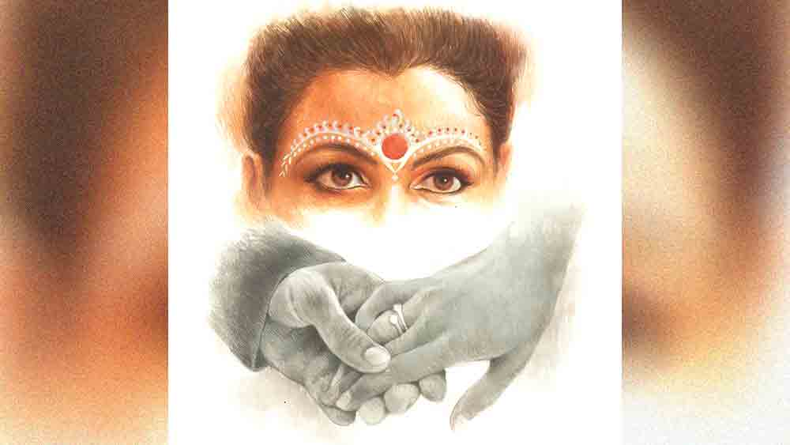

 

<h1 align=center> ঘটকালি</h1>
<h2 align=center>পুলক চট্টোপাধ্যায়</h2>
দ   ুপুর দেড়টা নাগাদ অতন্দ্রর মোবাইল বেজে উঠল। বন্ধু ছন্দকের ফোন। অতন্দ্রর অফিস একটা বহুতলের দশ তলায়। ছন্দকের অফিস আলাদা, কিন্তু ওই বিল্ডিংয়েরই ছ’তলায়। মাঝে মাঝেই এক বন্ধু অন্য বন্ধুকে তার ক্যান্টিনে ডেকে নেয়, এক সঙ্গে টিফিন করে। আজ ছন্দক অতন্দ্রকে ফোনে বলল, “আমাদের ক্যান্টিনে চলে আয়। দীপা একটা ভাল খাবার করে এনেছে, জমিয়ে খাওয়া যাবে।” অতন্দ্র আর তার স্ত্রী অগ্নিদীপার একই কলেজ। চাকরিও একই অফিসে। কলেজ থেকেই প্রেমের শুরু। চাকরির পর একটু থিতু হয়ে ওরা বিয়ে করেছে।   অতন্দ্র রাজি হয়ে যায়। বলে, “দশ মিনিটের মধ্যে আসছি।”   একটু পরে অতন্দ্র ছ’তলার ক্যান্টিনে এসে দেখে, ছন্দক এবং তার স্ত্রী অগ্নিদীপা ছাড়াও একটা মেয়ে বসে আছে অগ্নিদীপার পাশের চেয়ারে। অতন্দ্র একটা খালি চেয়ারে বসল ছন্দকের পাশে। অগ্নিদীপা বলল, “অতন্দ্রদা, তোমার সঙ্গে পরিচয় করিয়ে দিই, এ হচ্ছে আমার বন্ধু, উৎসা। কিছু দিন হল আমাদের অফিসে জয়েন করেছে। উৎসা, ছন্দকের এবং আমারও খুব ভাল বন্ধু। ওরা দু’জন একই স্কুলে এক সঙ্গে পড়েছে দীর্ঘ দিন।”   অতন্দ্র উৎসাকে বলল, “ভালই হল, এখন থেকে আমারও বন্ধু হলে।”   ছন্দক বলল, “বাড়ির খবর কী?”   অতন্দ্র বলে, “আরও খারাপ। বাবা বড্ড বাড়াবাড়ি করছে। বিয়ে করার সময় নাকি পেরিয়ে যাচ্ছে। প্রতিদিন এক কথা! আজকালকার ছেলেরা নাকি দায়িত্ব নিতে চায় না, তাই আমি বিয়ে করছি না।”   “এই! আমারও তো একই অবস্থা। এত দিন শুধু মা বলত, ক’দিন ধরে বাবাও গলা মেলাচ্ছে!” উৎসা বলল, “কাল আমি বলে দিয়েছি বাড়াবাড়ি করলে আমি কলকাতার বাইরে ট্রান্সফার নিয়ে নেব।”   দীর্ঘশ্বাস ফেলে অতন্দ্র বলে, “আমার সমস্যা আমি একমাত্র সন্তান। বাবা কিছু দিন হল রিটায়ার করেছে। মায়েরও বয়স হয়েছে। নানা রোগে ভোগে। আমি যে ট্রান্সফার নেব, তার উপায় নেই। ট্রান্সফারের কথা শুনলে মা এমন কান্নাকাটি শুরু করে দেয় যে কী বলব।”   উৎসা বলে, “আমার দুর্বলতা আমার বাবা। ছোটবেলা থেকে আমার সব ব্যাপারে বাবা গাইড করেছে। যা চেয়েছি তা-ই এনে দিয়েছে। বাবা থেকে থেকেই বলে ‘মা, তুই বিয়েটা কর না। তোর যদি কোনও ছেলে পছন্দ হয়ে থাকে বল, আমি যোগাযোগ করব।’ আশ্চর্য! আমি এখন বিয়ে করব না মানেই আমি প্রেম করছি! আমার বয়ফ্রেন্ড আছে! কিছুতেই বোঝাতে পারি না।”   ছন্দক দু’জনকেই সান্ত্বনা দেয়, “অত ভাবিস না, বিয়ে যে দিন হওয়ার, ঠিক হবে।”   “তা-ই যদি হয়, তা হলে বিয়ের জন্য চাপ দেওয়া কেন? যে দিন হওয়ার সে দিন তো হবেই!” অতন্দ্র ক্ষোভ প্রকাশ করে।   “চাপ দেওয়াটা বাবা-মা’র কর্তব্য,” গম্ভীর হয়ে বলে ছন্দক।   “তোকে চাপ দিয়েছিল কাকু বা কাকিমা?” জানতে চায় অতন্দ্র।   “আমার ঘটনা উল্টো। দাদাকে জ্বালিয়ে মেরেছি বিয়ে করার জন্য। বাবা-মা দু’জনেই বলে দিয়েছিল, বড় ছেলের বিয়ে না দিয়ে ওঁরা আমার বিয়ে দেবেন না। ও দিকে তাদের বড় ছেলে প্রেমে হাফসোল খেয়ে বিয়ে না করার প্রতিজ্ঞা করেছে। অনেক কষ্টে দাদাকে রাজি করাতে হয়েছে। তা না হলে অগ্নিদীপা কবে আমাকে অগ্নিতে নিক্ষেপ করত।”   “করতামই তো! প্রেম করার সময় মনে ছিল না! সাত-আট বছর প্রেম করার পর যদি বিয়ে না-হয়—ভাবতে পারছ?” বলে ওঠে অগ্নিদীপা।   অতন্দ্র বলে, “আমার সমস্যাটা অন্য, আমি চিনি না, জানি না, একটা মেয়েকে হুট করে বিয়ে করে ফেলব? এ রকম হয় না কি? আজকাল জীবন অনেক জটিল। ও রকম হুট করে বিয়ে করা যায় না কোনও মেয়েকে।”   একমত হয় উৎসাও, “ঠিক তাই। কোনও ছেলেকেও  বিয়ে করা যায় না ও ভাবে। তার পর কোনও দিন আমাকে গলা টিপে বা আগুন জ্বালিয়ে মেরে ফেলবে। না হলে বাবার কাছ থেকে টাকা আনার জন্য অত্যাচার করবে। তা ছাড়া বিয়ে তো আমি করব। বাবা-মা কেন ছেলে দেখবে, ছেলে ঠিক করবে? আমি রীতিমতো ক্যারেক্টার অ্যান্ড পাস্ট ভেরিফাই করে পাত্র নির্বাচন করব।”   “কী করে ভেরিফাই করবি?” অগ্নিদীপার প্রশ্ন।   “সেটা ভাবতে হবে। কিন্তু বাবা-মা একটা ছেলেকে ধরে এনে বলল, ‘একে বিয়ে কর’— আর আমি তা-ই করব— সেটি হবে না।”   “ঠিক কথা,” অতন্দ্র বলল, “পাত্রী নির্বাচনে বাবা-মার কোনও ভূমিকা থাকবে না। আমি জানিয়ে দেব, আমি একে বিয়ে করতে চাই। তার পরের দায়িত্ব বাবা-মার।”   সে দিনের মতো আড্ডা এবং টিফিন খাওয়া শেষ হল। তবে প্রায় দিনই এই প্রসঙ্গটা ওঠে। কিন্তু কোনও সমাধানের পথ না পেয়েই যে যার কাজে ফিরে যায়।      দিন পনেরো পর এক দিন টিফিন করতে করতেই ছন্দক বলল, “দেখ, তোদের দু’জনের বাড়িতেই অশান্তি এড়ানোর একটাই রাস্তা আছে। তোরা যদি রাজি থাকিস তো আমি সেই রাস্তাটা বলতে পারি।”   “প্রস্তাবটা আগে শুনে দেখি,” বলে অতন্দ্র।   “দেখ, তোদের যে জায়গায় আপত্তি তার সঙ্গে আমি আর দীপা একমত। অচেনা, অজানা কাউকে বিয়ে করার কোনও মানে নেই। তার দৃষ্টিভঙ্গি কী রকম, সে ঠিক কী চায়, কী পছন্দ-অপছন্দ করে সেটা না জানলে এক জন বুঝবে কী করে যে, বাকি জীবনটা তার সঙ্গে কাটাতে পারবে কি না। সমাজে ডিভোর্সের সংখ্যাটা ক্রমশ বাড়ছে তার কারণই হচ্ছে, জীবনবোধের বিরোধ।”   “ভূমিকাটা অনেক বড় হয়ে যাচ্ছে...” অতন্দ্র বলল।   ছন্দক বলল, “আমি তোকে এবং উৎসাকে একটা প্রস্তাব দিচ্ছি। তোরা এক জন অন্য জনকে এখন চিনিস এবং জানিস। তোদের যদি আরও কিছু জানার বা চেনার থাকে সেটাও কথা বলে নিতে পারিস। যদি মনে হয় তোদের চিন্তাভাবনার মিল আছে, তোরা বিয়ে করার সিদ্ধান্ত নিতে পারিস। ফর্মাল নেগোশিয়েশনে অ্যারেঞ্জমেন্টের অনেক ঝামেলা। তোর পছন্দ হল তো ফ্যামিলির পছন্দ হল না, আবার ফ্যামিলির পছন্দ হল তো তোর উপর চাপ দিতে শুরু করল... তার চেয়ে তোরা চুপচাপ ম্যারেজ রেজিস্ট্রেশন অফিসে নোটিস দিয়ে দে। এক মাস পর রেজিস্ট্রি ম্যারেজ করে বাড়িতে জানিয়ে দিবি। বাড়ির লোকেরা মেনে নিলে সোশ্যাল ম্যারেজ হবে ধুমধাম করে। আর না মানলেই বা কী, বিয়ে তো হয়েই গেল! তোদের ইচ্ছেমতো।”   অতন্দ্র এবং উৎসা পরস্পর মুখ চাওয়াচাওয়ি করে নিল। একটু চুপ করে থেকে উৎসা বলল, “ভাবতে একটু সময় লাগবে।”   “আমারও,” অতন্দ্র বলল।   “ভাল কথা। সাত দিন সময় নে। দু’জনেই ভাব। দরকার হলে দু’জন দু’জনের সঙ্গে আলাদা দেখা কর, কথা বল। সাত দিন পর ঠিক কর, কী করবি। এই সাত দিনে আমরা এ প্রসঙ্গে কিছুই আলোচনা করব না,” দু’জনকে আশ্বাস দেয় ছন্দক।      পরের সাত দিন টিফিনে বিয়ে সংক্রান্ত আলোচনা কেউ করল না বটে, তবে ছন্দক যেমন অতন্দ্রকে ফোন করে উৎসাকে বিয়ে করার পক্ষে নানা যুক্তি দেখাল, তেমনই অগ্নিদীপাও কয়েকবার উৎসাকে ফোন করে অতন্দ্রকে বিয়ে করার পক্ষে নানা যুক্তি দেখাল। সাত দিন পর যখন ওরা ক্যান্টিনে মিলিত হল, তখন অতন্দ্র মনে মনে উৎসার প্রতি দুর্বল হলেও সে জানে না উৎসার প্রতিক্রিয়া কী হতে পারে। আবার উৎসাও জানে না তার সম্পর্কে অতন্দ্রর কী মনোভাব, যদিও তার অতন্দ্র সম্পর্কে অনেকটাই ইতিবাচক মতামত গড়ে উঠেছে।   ছন্দক একটা কপট গাম্ভীর্য নিয়ে বলল, “আজ আমরা টিফিন খেতে খেতে সিদ্ধান্ত নেব, অতন্দ্র এবং উৎসা আমার প্রস্তাবে রাজি কি না। আমি মনে করি, সমস্যা সমাধানের এটাই একমাত্র পথ। এতে দু’জনেই তাদের বাবা-মাকে বোঝাতে পারবে, বিয়ের ব্যাপারে তাদের মতামতই চূড়ান্ত। তাই প্রস্তাব করছি, প্রথমে অতন্দ্র বলুক সে কী ঠিক করেছে।”   “কেন, আমি কেন, লেডিজ় ফার্স্ট!” অতন্দ্র বলল।   “না। এ ক্ষেত্রে তোকেই বলতে হবে,” ছন্দক বেশ গম্ভীর হয়ে বলল।   অতন্দ্র একটু সময় নিয়ে বলল, “উৎসা যদি রাজি থাকে, আমার আপত্তি নেই।”   ছন্দক উৎসার দিকে তাকাল। উৎসা চোখ নামিয়ে ডান হাতের নখের দিকে তাকিয়ে মৃদু গলায়  বলল, “আমারও আপত্তি নেই। তবে বাড়িতে কিন্তু ঝড় উঠবে।”   ছন্দক বন্ধুর দিকে তাকিয়ে বলল, “আজকালের মধ্যে গিয়ে বিয়ের নোটিস দিয়ে আসবি। মনে রাখিস উৎসা দত্ত, ডটার অব ইন্দ্রনাথ দত্ত।”      রেজিস্ট্রি বিয়ের কয়েক দিন আগে টিফিন করতে করতে ছন্দক বন্ধুকে বলল, “রেজিস্ট্রিটা তা হলে বুধবার। তার পর তুই আমাদের লাঞ্চ খাওয়াবি। লাঞ্চ খেয়ে আমরা একটু আড্ডা মেরে উৎসার বাড়ি যাব। সেখানে দীপা উৎসার মা-বাবাকে জানাবে বিয়ের ব্যাপারটা। আশা করা যায় একটা ঝড় উঠবে। গর্জন এবং বর্ষণও হবে। তার পর সে দিনই আমরা অতন্দ্রর মা-বাবাকেও ব্যাপারটা জানাব। এ ধরনের খবর ফোনে জানানো ঠিক নয়।”   নির্দিষ্ট দিনে নির্বিঘ্নে অতন্দ্র এবং উৎসার বিয়ের রেজিস্ট্রি হয়ে গেল। ওরা চার জন একটা ভাল রেস্তরাঁয় খাওয়াদাওয়া করল। অগ্নিদীপার কথায় উৎসা শাড়ি পরে এসেছিল। এক সময় অতন্দ্র বলল, “তোমাকে শাড়ি পরে বেশ সুন্দর লাগছে তো!”   সলজ্জ ভঙ্গিতে উৎসা বলল, “থ্যাঙ্ক ইউ।”   তার এই ধন্যবাদ দেওয়ার ভঙ্গিটিও বেশ লাগল অতন্দ্রর।   লাঞ্চ সেরে খানিক ক্ষণ আড্ডার পর ছন্দক বলল, “অতন্দ্র, এ বার তোর শ্বশুরবাড়ি যাব। তার আগে দীপা তুই এক বার উৎসার বাবা-মাকে ফোন করে বলে দে আমরা আসছি। উৎসার বাড়ি গিয়ে বাকি যা বলার দীপা বলবে।”   এর মধ্যে ছন্দকের ফোন বেজে উঠতে ও তাড়াতাড়ি ফোন ধরে কাউকে বলে, “আমরা রওয়ানা দিচ্ছি। ঠিক সময়মতো পৌঁছে যাব।”   “উৎসার বাড়িতে ফোনটা তো দীপার করার কথা, তুই করলি কেন?” প্রশ্ন করে অতন্দ্র।   “দীপাও করবে,” ছন্দকের নির্লিপ্ত উত্তর। ঘটনাটা কিছুই স্পষ্ট হল না অতন্দ্রর কাছে।      অতন্দ্র এবং উৎসা ভেবেছিল, উৎসার বাড়িতে ঢোকার পর তাদের বাক্যবাণের মুখোমুখি হতে হবে। অগ্নিদীপা যখন উৎসার বাবা-মাকে জানাল যে, উৎসা এবং অতন্দ্র আজ বিয়ে করেছে, উৎসার বাবা বেশ সহজ ভাবেই বললেন, “এটা একটা ভাল কাজ হয়েছে।” তার পর অগ্নিদীপার মাথায় হাত রেখে বললেন, “এত দিন আমরা যা পারিনি, তুমি তা-ই করে দেখালে মা।”   অগ্নিদীপা মাথা নিচু করে হাসে। উৎসার মা অগ্নিদীপার থুতনি ধরে আদর করে বলেন, “মেয়ের আনন্দ যে ধরে না!”   উৎসার বাবা-মা সাদরে মেয়ে-জামাইকে ঘরে ডেকে বসান। অতন্দ্রর পুরো ব্যাপারটা কেমন গোলমেলে লাগতে শুরু করে। তার বিস্ময় আরও কয়েক গুণ বাড়িয়ে দিয়ে হঠাৎ সেখানে এসে হাজির হন অতন্দ্রর বাবা-মা।   অতন্দ্র প্রায় চমকে উঠে তার মাকে জিজ্ঞেস করে, “মা, তোমরা হঠাৎ এখানে কেন? কী ব্যাপার?”   ছদ্মগাম্ভীর্য নিয়ে অতন্দ্রর মা বললেন, “আমরা তো এ বাড়িতে মেয়ে দেখতে এসেছি। ইন্দ্রনাথবাবুর মেয়ে, কী যেন নাম, উৎসার সঙ্গে তো তোর সম্বন্ধ করেছিলাম। তুই তো কিছু না দেখেশুনেই নাকচ করলি... ছন্দক, বাবা তোকে অনেক ধন্যবাদ। তুই ভালয় ভালয় ব্যাপারটা মিটিয়ে দিলি। এ বার একটা দিনক্ষণ দেখে সামাজিক বিয়েটা হয়ে গেলেই আমার মুক্তি। এই যে বৌমা, আমার ছেলে এখন থেকে তোমার সম্পত্তি, সামলেসুমলে রেখো কিন্তু...”   “সে নিয়ে চিন্তা করতে হবে না, আমাকে যখন তুমি সামলেছ, বৌমাও তোমার ছেলেকে সামলাবে,” অতন্দ্রর বাবা, চার্বাক সরকার বললেন।   “সে যাই হোক... অতন্দ্র বাবা-মার কাছে যখন আমি জানতে পারি ওঁদের পছন্দ করা পাত্রী আমার স্কুলমেট, আবার ঘটনাচক্রে একই অফিসে জয়েনও করেছে, তখনই আমি আর অগ্নিদীপা উৎসার বাবা মার সঙ্গে দেখা করি। তার পর সূক্ষ্মভাবে অনেক রকম কাঠখড় পোড়াতে হয়েছে! রেস্তরাঁ থেকে বেরোনোর আগে অতন্দ্রর মা আমাকে ফোন করেছিলেন, আমরা কখন এখানে আসছি জানার জন্য। তখনও আমি কিছু ভাঙিনি। সে যা-ই হোক, মধুরেণ সমাপয়েৎ তো হয়েই গেল! এ বার দুই কাকু এবং দুই কাকিমা... আমাদের ভুলে গেলে কিন্তু চলবে না... আমাকে আর আমার বৌকে ভাল করে ঘটক-বিদায় দিতে হবে কিন্তু!” হাসতে হাসতে ছন্দক বলল।   ঘর-ভর্তি আনন্দ-উজ্জ্বল উচ্ছ্বসিত হাসিমুখের মাঝখানে একে অপরের দিকে বোকার মতো তাকিয়ে রইল অতন্দ্র আর উৎসা।
