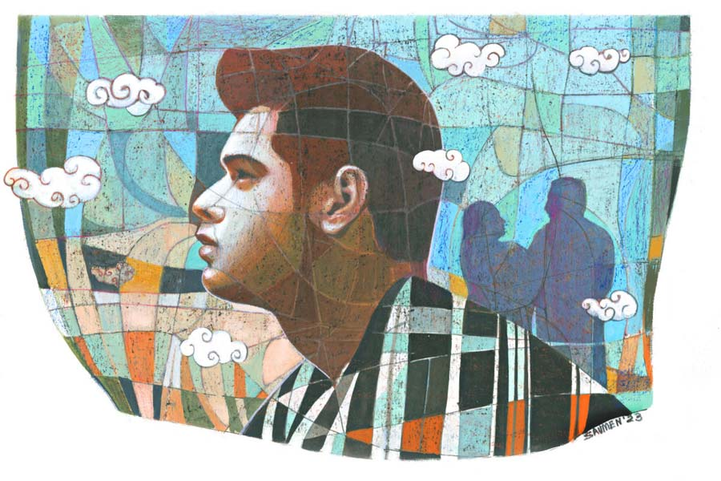

 
 <h1 align=center>ঘুমের দেশে</h1>
<h2 align=center>উল্লাস মল্লিক</h2> আশ্বিনের শারদপ্রাতে বেজে উঠেছে আলোকমঞ্জীর... ঘুম ভেঙে গেল। পাশের বাড়ির রেডিয়োতে মন্দ্রগম্ভীর বীরেন্দ্রকৃষ্ণ ভদ্র। আমাদের রেডিয়ো নেই। জেঠামশাই যত দিন ছিলেন, তত দিন ছিল। ছোট থেকেই দেখতাম, মহালয়ার দিন খুব ভোরে উঠে রেডিয়ো চালিয়ে দিয়েছেন জেঠামশাই। ‘মহিষাসুরমর্দিনী’। এক-একটা বিশেষ দিন এক-এক জনকে মনে করিয়ে দেয়। আজ মহালয়ার সুরেই যেন সেই প্রবল মানুষটি চলে এলেন স্মৃতির মেঠো পথ ধরে।

তখন বন্ধুদের সঙ্গে ঝামেলা হলেই বলতাম, আমার জেঠুকে বলে দেব। জেঠু মানে আমার জেঠামশাই। বাবার থেকে ষোলো বছরের বড়। জেঠামশাইয়ের যখন বিয়ে হয়, বাবার তখন সাত। তার ঠিক দু’বছর আগেই ঠাকুমার ডাক এসেছিল ও পার থেকে। পাঁচ বছরের ছোট্ট ছেলেকে ফেলে চলে যেতে হয় তাঁকে। দাদু বুঝি তাই একটু তাড়াতাড়িই বিয়ে দিয়েছিলেন জেঠামশাইয়ের। জেঠিমার বাপের বাড়ি তালডাঙার ঘোষালপাড়ায়। প্রায় দশ মাইল পথ। জেঠামশাই ফুলে সাজানো মোটরগাড়ি হাঁকিয়ে বিয়ে করতে গিয়েছিলেন তালডাঙায়। পাশে বাবা। জেঠামশাই ছ’ফুট লম্বা, শ্যামবর্ণ, উন্নত নাসা আর খাঁজকাটা চিবুক। মোটা কালো গোঁফ তাঁর ব্যক্তিত্বকে যেন ডবল প্রমোশন দিয়েছিল। গোঁফ নিয়ে বড় অহঙ্কার ছিল তাঁর। নেতাজি ছাড়া অন্য কোনও পুরুষকে পুরুষমানুষ বলে স্বীকারই করতেন না তিনি। নেতাজিকে ছাড় কেন, জিজ্ঞেস করলে বলতেন, “নেতাজি ইজ় নেতাজি। ওখানে কেউ দাঁড়াতে পারবে না।” কেন দাঁড়াতে পারবে না, সে ব্যাপারে কোনও ব্যাখ্যা দিতেন না জেঠামশাই। একটাই কথা, নেতাজি ইজ় নেতাজি।

বিয়ের দিন বরাসনে বসা জেঠামশাইকে দেখে প্রশংসার বান ডেকে গেল। জেঠিমার গায়ের রং খুব ফর্সা, কিন্তু চোখ-মুখ সাদামাটা। বিয়ের আগে জেঠিমাকে দেখেননি জেঠু। দাদু আর তাঁর এক বোন গিয়েছিলেন দেখতে। সঙ্গে সাত বছরের বাবাও। চেয়ারে গুটিগুটি পায়ে এসে বসেছিল জেঠিমা। তার আগে এসেছে প্লেট-ভর্তি মিষ্টি। প্লেট দেখে দাদু আঁতকে উঠেছিলেন, “করেছেন কী ঘোষাল মশাই!”

দাদুর ওই কথাটা মনঃপূত হয়নি বাবার। কী আর এমন বেশি! কেউ তো তাড়া দিচ্ছে না। একটু ধরে বসে খেলেই তো হয়। মাথা নিচু করে চেয়ারে বসে ছিল জেঠিমা। বাবা দাদুর কানে ফিসফিস করে বলেছিলেন, “একেই বৌদি করে নাও, ভাল দেখতে।” সে দিন আমার পিতৃদেবের এই রায়দানের পিছনে প্লেট-ভর্তি মিষ্টির কতটা প্রভাব ছিল বলা মুশকিল।

জেঠামশাইয়ের বিয়েতে বাবা বাসর জেগেছিলেন। কথা ছিল বিয়ে মিটে গেলে অন্য বরযাত্রীদের সঙ্গে ফিরে যাবেন বাবা। কিন্তু বাবা হঠাৎ বাসরে থাকবেন বলে বায়না জুড়লেন। হতে পারে নতুন বৌদির প্রতি টান। দু’-এক জন আপত্তি তুলেছিল। জেঠামশাই বলেছিলেন, “থাকবে বলছে, থাক না। বিয়ের বাসর তো আর মদের আসর নয়।”

এমনই কাটা-কাটা কথা বলতেন জেঠামশাই। ভরাট কণ্ঠস্বর। কথার মধ্যে প্রবল আত্মবিশ্বাস।

জেঠামশাইয়ের হস্তক্ষেপে বাসরঘরে প্রবেশাধিকার পেয়ে গেলেন পিতৃদেব। তবে বেশি ক্ষণ জাগতে পারেননি। রাত একটু হতেই বাবা এমন সাইজ়ের হাই তুলতে লাগলেন যে টেনিস বল ঢুকে যাবে ভেতরে। দেখে শুনে নববধূ বলল, “ঘুম পেয়েছে তোর, শুয়ে পড়।”

পিতৃদেব কিঞ্চিৎ লজ্জিত হলেন। লজ্জা আরও বাড়ল, যখন নতুন বৌদি বলল, “আমার কোলে শুয়ে পড়, মাথায় হাত বুলিয়ে দেব।”

মাতৃহারা বালক একটু ইতস্তত করেছিলেন বটে, কিন্তু শুয়েও পড়েছিলেন তাঁর পছন্দ করা বৌদির কোলে। এটা সেই সময়ের কথা, যখন সন্ধের পর মানুষ চাঁদের আলোয় সুখ-দুঃখের কথা বলত, গরম ভাত থেকে মন-মাতানো গন্ধ আসত, আর কখনও কখনও অজান্তেই মায়ের বিকল্প হয়ে উঠত বৌদি বা জেঠিমা।

জেঠিমা সে দিন হাত বুলিয়ে দিয়েছিল বাবার মাথায়। গায়ে মাথায় বহু দিন এমন কোমল হাতের স্পর্শ পায়নি বাবা। নতুন শাঁখা-পলা আর চুড়ির রিনঝিন শব্দে খুব দ্রুত ঘুমিয়ে পড়েছিলেন। রাত গভীর হলে অনেকেই ঘুমিয়ে পড়েছিল। একদম ভোর রাতে জেঠামশাই তাকিয়ায় মাথা ঠেকিয়ে চোখ বুজেছিলেন। কিছু ক্ষণ পর সবাই জেগে উঠল। জেঠামশাইয়ের নাক ডাকছে।

আমাদের পাড়ায় নাক ডাকার জন্য জেঠামশাইয়ের খ্যাতি ছিল বেশ। কেউ বলত মেঘের ডাক, কেউ বলত সিংহের গর্জন। এই মানুষটার শয্যাসঙ্গী হওয়া যে সুখকর নয়, সে ব্যাপারে সবাই সহমত।

এক বার রানাঘাট থেকে জেঠামশাইয়ের এক কোলিগ এসেছিলেন। দিন দুয়েক থাকবেন। জেঠামশাইয়ের সঙ্গে শুয়েছিলেন রাতে। ঘুমিয়েও পড়েছিলেন। কিন্তু সে ঘুম বড় ক্ষণিকের। জেঠামশাইয়ের নাসিকাগর্জন বুলডোজ়ারের মতো ধাক্কা দিল বন্ধুর ঘুমকে। ধড়মড় করে উঠে বসলেন তিনি। প্রথমে ভেবেছিলেন বুনো জন্তুটন্তু ঢুকে পড়েছে ঘরে। তার পর শব্দের উৎস সন্ধানে গিয়ে টের পেলেন জীবজন্তু নয়, জেঠামশাই। বাকি রাত কোনও প্রকারে কাটিয়ে পরদিন সকালেই বেরিয়ে পড়েছিলেন। যাওয়ার সময় বলে গিয়েছিলেন, “যা অবস্থা দেখলাম, তোর ভাবী বৌয়ের জন্যে চিন্তা হচ্ছে; সে বেচারি তো বিধবা না হলে ঘুমোতেই পারবে না!”

যাই হোক, ফিরে আসি জেঠামশাইয়ের বাসরঘরে। জেঠিমা জেগেই ছিল, বাকিরাও জেগে উঠল। নতুন জামাই নাক ডাকছে। একটু পরে শ্বশুরমশাইও উঁকি দিলেন ঘরে। বুঝলেন, জামাই বাবাজির নাকের দাপট আছে।

শুধু নাক নয়, সর্বত্রই দাপট ছিল জেঠামশাইয়ের। সচ্চরিত্র, স্পষ্টবাদী, পরিশ্রমী। আর দরদি একটা মন। আর নাসিকাগর্জন। যেন সরব ঘোষণা— আমি আছি, তোমরা তোমাদের ধর্ম থেকে, আদর্শ থেকে সরে যেয়ো না কিন্তু। আমি সব হিসাব মিলিয়ে নেব।

মুখের গর্জনও এতটুকু কম নয়। অফিসে এক জন এক বার নাকি ঘুষের প্রস্তাব দিয়েছিলেন জেঠামশাইকে। জেঠামশাই এমন প্রবল রবে ‘নো’ বলে উঠেছিলেন যে, সিলিং থেকে একটা টিকটিকি খসে পড়েছিল লোকটার মাথায়। 

বাসবকাকার বাড়ি ডাকাত পড়ল এক রাতে। ‘বাঁচাও বাঁচাও’ চিৎকার। ভাঙা কলের একটা হ্যান্ডেল পড়েছিল উঠোনের এক পাশে। সেটা নিয়েই দৌড়লেন জেঠামশাই। চিৎকার করছিলেন, “ভয় নেই... ভয় নেই...”

ভীষণ শীতের রাত। সবাই লেপের তলায়। জেঠামশাইয়ের চিৎকারে আমারও ঘুম ভেঙে গিয়েছিল। আমিও লাফিয়ে বাইরে এলাম। বাবাও বেরিয়ে এসেছেন। দেখলাম জেঠিমা উদ্‌ভ্রান্তের মতো সদর দরজার দিকে যাচ্ছে।

বাবা বলল, “বৌদি, তুমি এর মধ্যে কোথায় যাচ্ছ!”

জেঠিমা বলল, “দেখ না, মানুষটা যে একা বেরিয়ে গেল!”

“তুমি বেরিয়ো না...” বলতে বলতে বাবা বেরিয়ে গেলেন। তত ক্ষণে পাড়ার লোকজনও বেরিয়ে পড়েছে। ডাকাত দলও বোধহয় গতিক সুবিধের নয় বুঝে চম্পট দিয়েছে। ডাকাত তো পালাল, এ বার কী হবে!

জেঠামশাই বললেন, “পুলিশে খবর দিতে হবে।”

পুলিশের কথায় সবাই একটু থতমত খেল। এমনকি বাসবকাকারও সায় নেই। কিন্তু জেঠামশাইয়ের অন্য কথা। অপরাধ করতেই এসেছিল তারা। সুতরাং আইনরক্ষকদের খবর করা উচিত। না হলে অন্যায়কে প্রশ্রয় দেওয়া হয়। তাই শেষ পর্যন্ত জোরালো হেডলাইট জ্বালিয়ে জিপে করে পুলিশ এল। খাকি ইউনিফর্ম, মাথায় টুপি, অফিসার জিপ থেকে নামলেন। সেই সময় পুলিশের বাহন ছিল জিপগাড়ি, আর ছাপোষা মানুষজন পুলিশ দেখলে অকারণে কুঁকড়ে যেত। ওরে বাবা, পুলিশ! তাই অফিসার নামতেই একটু থমথমে হয়ে গেল পরিবেশ। টয়লেটের নাম করে কয়েক জন তো বাড়িতেই ঢুকে গেল! কিন্তু অকুতোভয় জেঠামশাই গটগট করে এগিয়ে গেলেন। কথা বললেন অফিসারের সঙ্গে। আমার বুকের মধ্যে ঢিপঢিপ। এক বার চোখ বুজছি, আবার কৌতূহলে খুলেও ফেলছি। জেঠামশাইয়ের কিছু হবে না তো। না, কিছুই হল না। বাধ্য ছাত্র যেমন মাস্টারমশাইয়ের কথা শোনে, অফিসার তেমন শুনছেন জেঠামশাইয়ের কথা।

সে দিন মনে হয়েছিল, জেঠামশাই ইজ় জেঠামশাই। টারজান অরণ্যদেব আর গব্বর সিং মিলিয়ে আমার জেঠামশাই। পুলিশ তো পুলিশ, মিলিটারি পর্যন্ত সমঝে চলে। তাই বন্ধুদের সঙ্গে ঝামেলা হলেই বলতাম, জেঠামশাইকে বলে দেব কিন্তু।

সেই যে বাসরঘরে বাবা মাথা রেখেছিলেন জেঠিমার কোলে, যে কোল বাবাকে বড় করে তুলেছিল, বাবার জন্য পছন্দ করে এনেছিল আমার মাকে, আমার জন্মের পর সেই কোলই টেনে নিল আমায়। তখন সবাই এক রকম ধরেই নিয়েছে, জেঠিমার আর সন্তান হওয়ার সম্ভাবনা নেই। জেঠিমা মাকে বলল, “তোমাকে ছেলে নিয়ে ভাবতে হবে না প্রতিমা, তুমি ও দিকগুলো দেখো।”

নাওয়ানো, খাওয়ানো, তেল মাখানো, ঘুম পাড়ানো— সবই ওই জেঠিমা। সোজা কথা, আমার ঘুনসি জেঠিমার আঁচলের খুঁটে বাঁধা হয়ে গিয়েছিল সেই শৈশবেই।

*****

আঁচলের গিঁট আলগা হল এক সময়। তখন আমার নাকের নীচে হালকা গোঁফের রেখা। জেঠিমার চুলে অনেক দিনই পাক ধরছিল একটা-দুটো। আমি খুব অবাক হতাম। এক দিন বললাম, “তোমার চুল সাদা হয়ে যাচ্ছে কেন!”

জেঠিমা বলল, “রং উঠে যাচ্ছে রে বাবা।”

“তা হলে জেঠুর কেন উঠছে না!”

“তোর জেঠুর পাকা কালো রং।”

“পাকা রং মানে!”

“দামি রং।”

“তোমার চুলের রং সস্তা?”

জেঠিমা হাসল।

বললাম, “আমার চুলের কী রং?”

আমার মাথাটা বুকে জড়িয়ে ধরে জেঠিমা বলল, “তুমি আমার সোনা ছেলে, তোমার সব রং পাকা।”

ইউনিভার্সিটিতে পড়ি যখন, তখন জেঠিমার সব চুল সাদা। মুখের টান-টান চামড়ায় বলিরেখা। যেন একটা কাগজকে মুঠো পাকিয়ে আবার মেলে ধরা হয়েছে। জেঠামশাই অবশ্য একই রকম। কদমছাঁট চুল। তাতে অল্প একটু নুনের ছিটে। রোজ সকালে মুগুর ভাঁজেন। কথায় কথায় বলেন, “রবীন্দ্রনাথ ইজ় রবীন্দ্রনাথ, নেতাজি ইজ় নেতাজি, নজরুল ইজ় নজরুল— দুর্গম গিরি কান্তার মরু দুস্তর পারাবার…”

রিটায়ারমেন্টের পরও সারা দিন পরিশ্রম করেন। রাতে অঘোরে ঘুম আর সেই শব্দব্রহ্ম। প্রবল প্রতাপান্বিত মানুষটা যেন ঘুমিয়েও তাঁর অস্তিত্ব জানান দিতেন। আমি আছি, আমি আছি। কেউ বেচাল কোরো না কিন্তু।

ইউনিভার্সিটিতেই আলাপ তনয়ার সঙ্গে। একই ব্যাচ। তনয়াকে বলতাম জেঠিমার কথা, জেঠামশাইয়ের কথা। জেঠামশাইয়ের নাক ডাকার কাহিনি। তনয়ার বাপ-ঠাকুরদা কেউ কোনও দিন নাকি নাক ডাকেনি। ও এক দিন আমাকে বলল, “বিপ্লব, তুইও ঘুমের সময় নাক ডাকিস নাকি?”

আমি বললাম, “কী জানি। আমি তো একা শুই। এক কাজ করি চল, দু’জনে এক দিন শুয়ে দেখি কী হয়!”

আমার পিঠে কিল মেরেছিল তনয়া। বলেছিল, “বিয়ের পর যদি দেখি নাক ডাকছে তোর, আমি কিন্তু ঘর থেকে বার করে দেব। জানিস কি, উন্নত দেশগুলোয় নাক ডাকার কারণে খুব সহজে ডিভোর্স পাওয়া যায়।”

আমি অবাক হয়ে বলি, “সত্যি!”

তনয়া বলে, “একদম সত্যি।”

আমি বলি, “সত্যি কত এগিয়ে যাচ্ছে পৃথিবী, আর আমাদের এই পোড়া দেশের কোনও উন্নতি নেই।”

তনয়া বলল, “আচ্ছা, এক দিন রেকর্ড করে আনবি তোর জেঠামশাইয়ের নাক ডাকা?”

আমি হাসলাম।

না, রেকর্ড করা হয়নি। তার আগেই এক দিন মাঝরাতে জেঠামশাইয়ের নাক ডাকা বন্ধ হয়ে গেল। প্রথম এবং শেষ বারের মতো। 

*****

জেঠিমা তার পর বছরখানেক বেঁচে ছিল। সেই সময়টা আমি মাস্টার্স কমপ্লিট করে বাড়িতেই। অ্যাপ্লিকেশন ছাড়ছি। নিজের দেশে এবং সেই সব উন্নত দেশে, যেখানে নাক ডাকার কারণে ডিভোর্স হয়। জেঠিমাকে দেখতাম, চলাফেরা করছে কাঠপুতুলের মতো। চোখের দৃষ্টিতে তেপান্তরের শূন্যতা। আর সারা রাত বোধহয় জেগেই থাকে। একটা গ্র্যান্ডফাদার ক্লক ছিল ঘরে। জেঠামশাই চাকরি পেয়েই কিনেছিলেন। জেঠামশাইয়ের মতোই নিয়মনিষ্ঠ। সেই ঘড়ির দিকে গভীর রাত পর্যন্ত অপলক তাকিয়ে থাকত জেঠিমা। অসহ্য রকমের নিস্তব্ধ ঘরে সময়ের চলন দেখত। আমরা অবাক হতাম।

এক দিন তনয়াকে বাড়ি এনেছিলাম। জেঠিমাকে প্রণাম করল তনয়া। জেঠিমাও থুতনিতে আঙুল ছুঁইয়ে চুমু খেল। যুগ যুগ ধরে স্নেহময়ী মায়েরা যেমন চুমু খায়। অনেক ক্ষণ ধরে গল্প করল তনয়ার সঙ্গে। বেশির ভাগই আমার ছোটবেলার দুষ্টুমির গল্প। অনেক দিন পর এত কথা বলল জেঠিমা।

তার পর জেঠিমাও চলে গেল এক দিন। সেই ঘুমের মধ্যেই। জেঠিমাকে শোয়ানো হল বারান্দায়। চোখ বোজা। মাথার দু’পাশে ধূপ। গলায় রজনীগন্ধার মালা। বুক ভারী হয়ে ওঠা একটা গন্ধ। মাথার কাছে বসে আছে মা। আঁচলে চোখ মুছছে। বাবা বসে আছে পায়ের কাছে। নিজের মায়ের স্নেহ ভালবাসা না পাওয়া বাবা শেষ বারের মতো দেখছিলেন সেই নারীকে, যে নিজের বাসররাতেই তার ছোট্ট দেওরের মাথাটা কোলে টেনে নিয়েছিল।

আমিও দেখেছিলাম সেই নারীকে, যে আমার ছেলেবেলাকে আঁচলের খুঁটে বেঁধে রেখেছিল, যে রাতে ঘুম পাড়াবার সময় মাথায় হাত বুলিয়ে দিতে দিতে ব্যাঙ্গমা-ব্যাঙ্গমীর গল্প বলত, মেলা দেখতে যাওয়ার সময় হাতে আলাদা করে পয়সা দিত, কিংবা নিজের ভাগের ডিমভাজা থেকে অনেকটা ভেঙে নিয়ে টুক করে তুলে দিত আমার পাতে। আমার সেই জেঠিমা, যে আমায় গল্পের রাজপুত্র বানিয়ে চাপিয়ে দিত ডানাওয়ালা পক্ষীরাজ ঘোড়ায়। 

আসলে সে দিন আমি আর বাবা দু’জনেই দেখছিলাম এমন এক নারীকে, যার আঁচলে দুটো প্রজন্ম মুখ মুছতে মুছতে বড় হয়ে উঠেছে!

কে যেন বলল, “আহা, দেখে মনে হবে মানুষটা যেন নিশ্চিন্তে ঘুমোচ্ছে।”

অন্য এক জন বলল, “সত্যি তাই। ঘুমোচ্ছে যেন।”

কিন্তু আমি জানি, জেঠিমা ঘুমোচ্ছে না। চোখ বুজে আছে শুধু। শেষ যাত্রার সময় চোখ বুজে থাকতে হয়। এটাই নিয়ম। জেঠিমার সব ঘুম নিয়ে চলে গেছে এক জন।

জেঠিমা যাচ্ছে তাঁর কাছে। দু’জনে আবার পাশাপাশি শোবে। তার পর সেই পরিচিত শব্দের মধ্যে নিশ্চিন্তে ঘুমিয়ে পড়বে জেঠিমা।