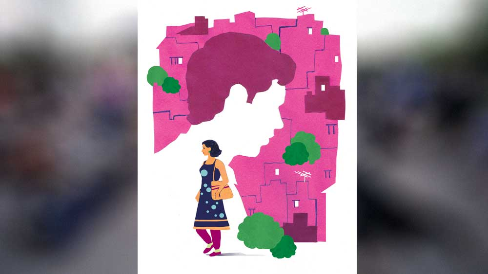

 

<h1 align=center>চব্বিশে ছাব্বিশ</h1>
<h2 align=center>অনিন্দ্য মুখোপাধ্যায়</h2>
রোজই বাড়ি ফেরার সময় ভাবি, যদি পাশে একটু রোগাপাতলা কেউ বসে, বাকি পথটা একটু আরামে যেতে পারি। সুন্দরী কাউকে বাসে উঠতে দেখলেই চেপেচুপে বসি, যাতে অনেকটা জায়গা দেখায় পাশে। তবু সবাই পাশ কাটিয়ে পিছনে গিয়ে অন্য সিটে বসে পড়ে। আর এমনই বরাত যে আজ অতিশয় হৃষ্টপুষ্ট এক জন এসে বসে পড়ল আমার পাশে। এতখানিই চওড়া যে, ওঁর অর্ধেক সিটে, আর বাকি অর্ধেক ঝুলছে। কিন্তু অর্ধেকেই আমার করুণ অবস্থা।   এই শাটল বাসগুলো পুরোটাই সিটিং। দাঁড়িয়ে কেউ থাকে না। যত ক্ষণ সিট, তত ক্ষণই লোক নেয়। অফিসযাত্রীই শুধু। ভাড়া একটু বেশি। মোবাইল অ্যাপে বুক করতে হয়।   মাসখানেক হল, নিউ টাউনের এক প্রাইভেট কোম্পানিতে আমার চাকরি জুটেছে। তাই বেশ ফুরফুরে আছি। মানে প্রেমটেম পাচ্ছে আর কী। কাজটাও বেশ লাগছে। ঠিকমতোই পারছি। পঁচিশ পেরিয়ে ছাব্বিশ আমি এখন। এ বয়সে একটু-আধটু প্রেম সবারই পায়।   মেয়েদের সঙ্গে বেশি সদ্ভাব নেই, সবই মনে মনে। যেমন ধরুন, বাসে ওঠা সুন্দরী ললনাদের মনে মনে রেটিং করে তাদের মধ্যে থেকে কাউকে তিলোত্তমা গোছের একটা খেতাব দিলাম। এ বারে ধরুন তার নেমে যাওয়ার হল, আমি ও দিকে যশ চোপড়ার শেখানো সবুজ সর্ষেখেতে বসে ‘পলট, পলট’ করলাম। আসলে সিটে বসে, মনে মনে। কিন্তু শেষে নিজেই পলটে পল্টু। আর এই ‘পলট পলট’-এর সময় আমায় কিন্তু নিজেকে মোটেই শাহরুখ মনে হয় না, একেবারে আমির! অবশ্য এটাও কল্পনায়। আমি বেশ ক্যাবলা টাইপ দেখতে। যা-ই হোক, কাউকে পল্টানো গেল না দেখে আমি কিছুই হয়নি গোছের মুখ করে ‘তুম নেহি তো কোই অওর সহি’ গোছের দীর্ঘশ্বাস ছাড়ি!   অফিস আসার সময় বাসে এলেও ফেরার সময় এ রকম এসি শাটলে ফিরি আমি। একটু চোখ বন্ধ করে কানে একটা ইয়ারফোন গুঁজে গান শুনছিলাম আজ। বেশ লাগছিল। গানটা শেষ করে হেডফোন পকেটে রেখে নানা হিজিবিজি ভাবছিলাম। ভাবছিলাম, সূর্য থাকলেও চাঁদের সৌন্দর্য নিয়ে কবিরা কত কী লিখে যান। চাঁদ বেশ শান্ত, স্নিগ্ধ। জানলা থেকে দেখি, ছাদে উঠে দেখি, রাস্তায় হাঁটতে হাঁটতে দেখি। যেন আমারই জন্যে। ওই জন্য কবিরা শুধু চাঁদ নিয়ে লিখে যান! সূর্যের চেয়ে কত ছোট, কিন্তু তেজ-দীপ্তিতে পিছিয়ে পড়া নেই এতটুকু! তবে হ্যাঁ, চাঁদের কলঙ্ক থাকে। কলঙ্ক শুনলেই আমার আবার কেমন কঙ্কাবতী কঙ্কাবতী মনে হয়!   এই সব ভাবতে ভাবতে ঘুমিয়ে পড়েছিলাম বোধ হয়, হঠাৎ ঘুম ভেঙে দেখি আমার পাশের আমজাদ খান কখন উঠে গেছেন, আর পাশে এসে কখন বসেছে শ্যামলা কিন্তু মিষ্টি মুখের অল্পবয়সি একটি মেয়ে। মানে এই তেইশ-চব্বিশ হবে হয়তো। একমনে মোবাইল ঘাঁটছে। আমি মনে মনে যা-ই হই না কেন, যথেষ্ট ভদ্র বাইরে। অবশ্য মনেও অভদ্র নই, কিন্তু ওকে দেখে একটা রিনরিনে অনুভূতি হল। এক অদ্ভুত ভাল লাগায় মনটা ভরে উঠল। একটা সুর বেজে উঠল কি? দূরে কোথাও?   এখানে বলে রাখি, আমি কিন্তু ওই প্রেমে-ব্যর্থ টাইপ নই। এমন একটা লোক, গোঁফটোফসুদ্ধ, নিজের মতে, যাকে দেখে কেউ কখনও প্রেমে পড়া তো দূর অস্ত, ‘পলট’ পর্যন্ত হয় না! আমায় কেমন দেখতে বলিনি, না? ক্লাস টুয়েলভে পড়ার সময় পাড়ার মধুদা এক বার বলেছিলেন, “সুনীল শেট্টির মতো দেখতে হয়েছিস, একেবারে গোপীকিষান!” সবাই হো হো করে হেসেছিল। তবে আমি স্পোর্টিংলি নিয়েছিলাম। যাই হোক, ফিল্মস্টারের সঙ্গে তুলনা। কম কী! মধুদা পরে কোচিং সেন্টার খুলেছিলেন। উনি খুব খুশি হলে বলতেন, “দশে বারো দিলাম।”   তা, যে কথা বলছিলাম। আমি কিন্তু বেশ দিব্যি টুপটাপ প্রেমে পড়ি। যদিও কেউই জানতে পারে না। নিজের মনে একটা কল্পনায় খেলা চলতে থাকে। মানে আলাপটাও বেশ রংচঙে ভাবে শুরু আর তার পর গল্পের গরু গাছ পেরিয়ে আকাশে।   এখানেও বেশ একটা গল্প মনে মনে ভাবছি শুরু করব, হঠাৎ কেমন খটকা লাগল। মনে হল, একে আগে দেখেছি। চিনি চিনি মনে হচ্ছে। মুখটায় কার সঙ্গে যেন মিল! কিন্তু আর এক বার যে চেয়ে দেখব তার উপায় নেই। মনে হচ্ছে কে যেন যুদ্ধের শিরস্ত্রাণ পরিয়ে রেখেছে। মাথার ওজনই বিশ কিলো। একটা মেয়ের দিকে অমন ভাবে তাকানো যায় নাকি? যথারীতি অসম্ভব একটা লজ্জা চেপে বসল।   “আরে আপনি তমালদা, না?”   চমকে পাশে ফিরতেই বলে উঠল, “চিনতে পারছেন না? আমি রিনি। আপনার কাছে অঙ্ক করতে আসতাম। মা প্রায়ই বলে আপনার কথা। আসুন না এক দিন আমাদের বাড়ি। ওহ, দেখেছেন বলাই হয়নি, আমি একটা জব পেয়েছি সেক্টর ফাইভে। আপনিও এই সময় ফেরেন? কী ভাল হল! দু’জনে এক সঙ্গে ফিরব, আর বোর হব না। অবশ্য আপনি যদি বোর হন, তা হলে আলাদা কথা।”   আমি তাড়াতাড়ি বলে ফেললাম, “আরে না না...”   একটু জোরেই বলে ফেলেছি বোধহয়, পাশ থেকে চমকে উঠে মেয়েটি বলল, “কিছু বললেন?”   আমি হকচকিয়ে বললাম, “না না। স্যরি, ভেরি স্যরি।”   মানে বুঝলেন তো? ওপরের ঘটনাটি ঘটেইনি। রিনি বলে কেউ ছিল না। মানে পড়াইনি এ রকম কাউকে। আমার গল্পের গরু সবে গাছে উঠতে শুরু করেছিল, আর শুরুতেই ধুতিতে পা জড়িয়ে কুপোকাত! মনে মনে ভাবতে গিয়ে কথা বাইরে চলে এসেছে আমার। থিঙ্কিং অ্যালাউড!   নাহ, অন্য ভাবে ভাবতে হবে। গুণিজনরা বলে গেছেন, কোথাও না কোথাও আমার জন্য কাউকে না কাউকে তৈরি করা হয়েছে। এমনকি এটাও বলে গেছেন, কিছু যদি অন্তর থেকে চাওয়া হয়, সব ঘটনা-পরম্পরা, পরিবেশ পরিস্থিতি সেই ঘটনাটাকে সত্যি করে তোলার জন্য উঠে পড়ে লাগে। এটা আমি নই, বড় বড় মুনি-ঋষি বলে গেছেন। ওহ, বড়র কথায় মনে পড়ল, বড় বড় দেশে ছোট ছোট ভুল হয়েই থাকে। এই ‘না’-টা জোরে বলে ফেলা অমনই একটা ছোট্ট ভুল।   ধুস, আমি একেবারে যা তা! এত জোরে ‘না’-টা না বললেই হত। সব কেমন জট পাকিয়ে গেল! আমার প্রেমকাহিনি কোনও দিনই কি শুরু হবে না ভগবান! অবশ্য জানিও না, মেয়েটি স্বভাব-চরিত্রে কেমন! অনেক বয়ফ্রেন্ডও থাকতে পারে। কথাবার্তায় ভাল না-ও হতে পারে, বড়দের সঙ্গে মুখে মুখে তর্ক করতে পারে। বাবা-মায়ের সঙ্গে বিয়ের পর যদি বনিবনা না হয়? ওদের সামনে আমাকে কটু কথা বললে আমিও ছাড়ব না কিন্তু! রাগলে আমি বাপের কুপুত্তুর। আমার রাগ দেখেনি তো! যা নয় তা-ই বলবে, সহ্য করব না কি? এতটাই রেগে গেছি যে, গরম নিঃশ্বাস বেরোচ্ছে এ বার। উফ এ বারে বিয়ে পর্যন্ত ভেবে ফেলেছি! রঘুবীর রক্কে করো!   জোরে জোরে নিঃশ্বাস ফেলে এ বারে নিজেই একটু ভয় পেয়ে বোঝার চেষ্টা করলাম। নাহ, বুঝতে পারেনি কিছু। চুপচাপ বসে আছে, মোবাইল আর হাতে নেই। সরাসরি না তাকিয়েও বুঝতে পারলাম। আমি একটু সিঁটিয়েই বসে আছি।   ভেবে দেখলাম, এ রকম কিছু হতেই পারে না। মুখ হচ্ছে মনের আয়না। এক বার দেখলেই আমি বুঝতে পারি। খুবই সুশীল হবে। শান্ত, ভদ্র, মিষ্টভাষী। হ্যাঁ মিঠে গলা, ওই যে জিজ্ঞেস করল, ‘কিছু বললেন?’ এটা শুনেই গলাটা বোঝা গেল। একদম সুরেলা। মারাত্মক ভাল গান গাইবে এ মেয়ে। সন্ধেয় আমি বাড়ি ফিরব আর ও গাইবে ‘ফুলে ফুলে ঢলে ঢলে বহে কিবা মৃদু বায়।’ আহা, কী সুন্দর শোনাবে! এই মেরেছে, এটা কী ভাবলাম! আমি বাড়ি ফিরলাম আর ও বসে গান গাইছে! মানে আমি কি পুরুষতন্ত্র ফলাচ্ছি? বিয়ের পরই ওর চাকরি করা বন্ধ করে দিয়েছি? না না মোটেই নয়। ও নিজেই ছেড়ে দিয়েছে। কিন্তু ছাড়তে চাইলেই বা! আমি ছাড়তে দিলাম কেন?   আর তা ছাড়া এখন যা দিনকাল, দু’জনেই চাকরি করব বরং। দু’টিতে বেশ চালিয়ে নেব। আর তা ছাড়া ঘরে বসে রান্না বান্না করলেই বোর হবে, ঘরে অশান্তি হবে, ঝগড়াঝাঁটি— অলস মস্তিষ্ক শয়তানের কারখানা।   ভাবতে ভাবতেই মেয়েটি উঠে দাঁড়িয়েছে, এ বারে নামবে বোধ হয়। আমার গল্প শেষ এ বারেও।   কিন্তু পিকচার আভি বাকি হ্যায় মেরে দোস্ত। এ বারে আর আমিরি না, পুরো শাহরুখি কায়দায় আস্তে করে চার পাশটা দেখে নিয়ে বললাম, ‘পলট!’ যে খেলার যে নিয়ম, যস্মিন দেশে যদাচার। আমিরি চালে আর হচ্ছে না। বাসটা দাঁড়িয়েছে স্টপেজে। আমি দ্বিতীয় বার মরিয়া হয়ে, ‘পলট!’   দরজা খুলছে। খেয়াল হল, আমারই স্টপেজ! আরে, আমাকেও তো নামতে হবে! ধড়মড় করে উঠতেই মেয়েটি ফিরে তাকাল আমার দিকে। তার পর মেয়েটি নামছে আর আমি বন্ধ হওয়ার আগেই দরজাটা ধরার চেষ্টা করছি। হঠাৎ একটা বাইক দরজার সামনে! মেয়েটি নেমে দরজাটা বন্ধ করে বাইকটাকে যাওয়ার রাস্তা দিতেই আমি ককিয়ে উঠলাম। আমার তর্জনী দরজার ফাঁকে আটকে মট করে শব্দ! আঙুলটা গেল!   “আই অ্যাম ভেরি স্যরি। আমি একদম বুঝতে পারিনি। আসলে বাইকটা এমন এসে পড়ল সামনে! আপনার ভীষণ লেগেছে, না? কই, দেখি হাতটা... এ বাবা! আঙুল তো ভেঙে গেছে মনে হচ্ছে! বেঁকে গেল তো একদম। আমার যে কী খারাপ লাগছে! আমার জন্য আপনার এ রকম হল...”   আমার কল্পনার রিনি বাস্তবের মাটিতে দাঁড়িয়ে কী সব বলে চলেছে! আমি চেঁচাতেও ভুলে গেলাম! এই প্রথম সিনেমা গল্পের বদলে আমার সামনে। বাস্তবের নায়িকা কত কী বলে চলেছে! তাও আমায়! এক বার নিজের ব্যাগ থেকে একটা সুগন্ধি অ্যান্টিসেপ্টিক বার করে লাগাল, আবার পরক্ষণেই জলের বোতল বার করে ঠান্ডা জল ঢালতে লাগল! আমি কেমন বোকার মতো ভেবলে গেছি! হাতে বেশ যন্ত্রণা হওয়ার কথা, কিন্তু আমি সে সব টের পাচ্ছি না তো!   আঙুলের দিকে তাকিয়ে দেখি ছ’টা বাজতে পাঁচ। মানে মাঝখান থেকে তলাটা সোজা, তর্জনীর মাঝখান থেকে ওপরের দিকে কেমন বাঁ দিকে বেঁকে গিয়ে অবিকল ছ’টা বাজতে পাঁচ! আমার জীবনও কি তা হলে উল্টো পথে হাঁটতে শুরু করল?   আমার ভাঙা আঙুল আজ একটু হলেও সিনেমা শুরুর গল্প দিয়েছে। এখন ভাল করে ওর মুখটা দেখলাম। না, না, তেইশ কিংবা পঁচিশ নয়, ঠিক চব্বিশই হবে। আমার মন বলছে। আমার ছাব্বিশ, ওর চব্বিশ।   হঠাৎ কেন যেন মধুদার কথা মনে পড়ল, দশে বারো!   আমি মনে মনে বললাম, ‘নাঃ! দশে বারো নয়। আজকের সন্ধে, চব্বিশে ছাব্বিশ দিলাম তোমায়!’   