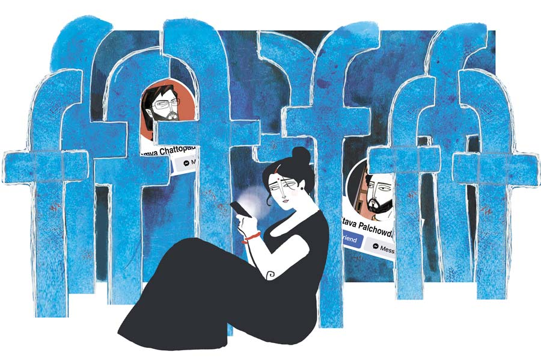

 
 <h1 align=center>চাওয়া পাওয়া</h1>
<h2 align=center>সিজার বাগচী</h2> কিছু দিন আগে মায়ামি গিয়েছিল জয়দীপ। সেই ছবি দিয়েছে ফেসবুকে। নীল জলে সুইমিং ট্রাঙ্ক পরে দাঁড়িয়ে। পাশে লাল বিকিনিতে লিন্ডা। ওর স্ত্রী।

অনেক ক্ষণ ধরে ছবিটা খুঁটিয়ে দেখল অর্পিতা। জয়দীপের জিম করা চেহারা। কে বলবে ওর বয়স চল্লিশ ছুঁই-ছুঁই! শুধু মাথার চুলগুলোই যা বিদ্রোহ শুরু করেছে। কালোর মাঝে জায়গায়-জায়গায় সাদা ঝিলিক। তবু বেশ লাগছে। সমুদ্রের ঢেউয়ের মতো উচ্ছ্বাস ওর চোখ-মুখে। সব পেয়েছি গোছের ভাব। দেখে বোঝার উপায় নেই, এই লোক এক সময় সাইকেল চালিয়ে দুর্গাপুরের বাড়ি-বাড়ি গিয়ে টিউশন করত। তখন জয়দীপের চেহারা ছিল রোগা। শুধু চোখের চাউনি জ্বলজ্বলে।

অন্ধকার ঘরে অর্পিতার মুখে এসে পড়েছে মোবাইলের আলো। জয়দীপের ছবির আলো। ব্লটিং পেপারের মতো ও সেই আলো শুষে নিতে থাকল। অর্পিতার মুখও উজ্জ্বল হয়ে উঠল। এক সময় যখন আর পারল না, ফেসবুক বন্ধ করে দিল।

ফেসবুক চলে যেতেই ঘরের অন্ধকার এসে ধাক্কা মারল অর্পিতার চোখে। উজ্জ্বল আলো ঝপ করে নিভে গেলে এমনই হয়। সেই চোখ-ধাঁধানো অন্ধকারে ও তাকাল বিছানার দিকে। দশ মিনিট হল বাবলু ঘুমিয়েছে। মোবাইলের আলোয় আবার জেগে উঠল না তো? ঘুম নিয়ে চার বছরের ছেলেটার খুব সমস্যা। সামান্য আলো থাকলে ওর ঘুম আসে না। ছটফট করে। তাই জানলার পর্দা টেনে, ঘরের সব আলো নিভিয়ে বাবলুকে ঘুম পাড়ায় অর্পিতা। ঘুমিয়ে পড়লেও কি নিশ্চিন্ত হওয়ার উপায় আছে? এক বার যদি সেই ঘুম ভাঙে, তা হলে হয়তো সারা রাত জাগিয়ে রেখে দেবে। তখন আবার প্রীতমের সমস্যা। রাগারাগি শুরু করে দেয়।

এমনিতেই প্রীতমের মেজাজ সব সময় চড়া তারে বাঁধা। যার মূলে ওর ব্যবসা। না, প্রীতম কোনও বিরাট ব্যবসায়ী নয়। একটা ছোটখাটো সাপ্লাইয়ের ব্যবসা রয়েছে ওর। সেই ব্যবসা প্রবল মার খেয়েছে কোভিড পর্বে। পরিস্থিতি এমন পর্যায়ে গিয়েছিল, এক সময় ব্যবসার মূলধন দিয়ে ওদের সংসার চলেছে। কোভিডের ছায়া সরে যেতে যখন সবাই আবার নতুন করে জীবন শুরু করল, তখন দেখা গেল ব্যবসা করার মতো কোনও পুঁজি প্রীতমের হাতে নেই। সব টাকা খরচ হয়ে গিয়েছে সংসার টানতে-টানতে। বাধ্য হয়ে মোটা টাকা ধার নিয়ে ওকে নতুন করে কারবার শুরু করতে হল। সেই কারবারের অবস্থাও এখন সুবিধের নয়। প্রতি রাতে খেতে বসে প্রীতম আফসোস করে, “কোনও বাজার নেই। কেউ মাল নিতেই চাইছে না। নেবে কী? আগের মালই তো বিক্রি হয়নি। লোকে এখনও তেমন কেনাকাটা করছে না।”

অর্পিতাকে তাই সতর্ক থাকতে হয়। এই পরিস্থিতিতে বাবলু ঘুম থেকে উঠে কান্না জুড়লে প্রীতম আরও রেগে যাবে। তবু সমস্যার কি শেষ আছে? এক সমস্যা যায় তো আর একটা আসে। বাবলু ঘুমিয়ে পড়ার পরও ঘরের আলো জ্বালার উপায় নেই। এ দিকে ঘড়িতে এখন সাড়ে দশটা। প্রীতমের ফিরতে-ফিরতে এগারোটা বাজবে। আধ ঘণ্টা কী করবে ও? ভূতের মতো অন্ধকারে বসে থাকবে?

এই দেড় কামরার ছোট ফ্ল্যাটে টিভি চালানোর উপায় নেই। শব্দ হবে বেশ। ইয়ারফোন লাগিয়ে ওয়েব সিরিজ় দেখা যায়। মুশকিল হল, ওটিটি প্ল্যাটফর্মের সাবস্ক্রিপশন ফুরিয়েছে। মাস দুয়েক ধরে যা টানাটানি, আপাতত কিছু দিন সেটা করাও যাবে না। বাকি থাকল ইউটিউব। সেখানে ঘন ঘন বিজ্ঞাপন।

আনমনে জানলার ধারে এসে দাঁড়াল অর্পিতা। তিনতলার উপরের এই ফ্ল্যাট থেকে রাস্তাটা ভাল দেখা যায়। অনেক দিন এমনও হয়েছে এখানে ঠায় দাঁড়িয়ে ও রাস্তা দেখেছে। কিন্তু গত তিন দিন ধরে রাস্তারআলো জ্বলছে না। বোধ হয় টিউবলাইট চুরি হয়ে গিয়েছে। এই পাড়ায় ছিঁচকে চোরের খুব উৎপাত। প্রীতম বলে, “পাতাখোর।”

অগত্যা ফের ফেসবুক।

এ বার আর জয়দীপের প্রোফাইল নয়। আনমনে কিছু ক্ষণ স্ক্রল করল অর্পিতা। দু’-তিনটে পোস্টে লাইক দিল। একটা মজার পোস্ট পড়ল। ছোট্ট হাই তুলে রিল দেখতে থাকল। কী মনে হওয়ায় সার্চে গিয়ে লিখল, অমিতাভ পালচৌধুরী। পর পর অনেক অমিতাভ পালচৌধুরী এল। তার মধ্যে থেকে নিজের পছন্দের অমিতাভর প্রোফাইলে ও ঢুকল।

গড়িয়ায় বাড়ি ছিল অমিতাভর। এখন থাকে বেঙ্গালুরু। নাদুসনুদুস চেহারা। মাথার চুল পাতলা। টেডি বিয়ারের মতো হাঁটাচলা। তবে মানুষটা অঙ্কে তুখোড়। অমন আমুদে চেহারা হলেও চোখের দিকে তাকালে বোঝা যায়, অমিতাভের মগজ ভোজালির মতো ধারালো।

গড়িয়ার বাড়ি এখনও আছে কি না, অর্পিতা জানে না। তবে বেঙ্গালুরুতে অমিতাভর ঘ্যামা ফ্ল্যাট। স্ত্রী সন্দীপ্তাও আছে আইটি-তে। আর আছে অমিতাভর বাবা-মা। একমাত্র সন্তান হিব্রু।

কয়েক সপ্তাহ অমিতাভর খোঁজ নেওয়া হয়নি। আজ দেখা গেল ও নতুন গাড়ি কিনেছে। সিক্স সিটার। তার সামনে দাঁড়িয়ে ছবি তুলেছে গোটা পরিবার।

সেই ছবি মন দিয়ে দেখল অর্পিতা। বাবা-মায়ের মুখে সেই মার্কামারা অভিব্যক্তি। দু’জনকে দেখলেই বলা যায়, গড়িয়া ছেড়ে বেঙ্গালুরুতে এসে তাঁরা একই সঙ্গে সুখী এবং দুঃখী। সুখী ছেলের সাফল্যে। দুঃখী বাগান থেকে উপড়ে এনে টবে বসানো হয়েছে তাই। অমিতাভর মুখে আত্মতৃপ্তির হাসি। সন্দীপ্তার মুখটাই যেন কেমন। সুখী নাকি দুঃখী ঠিক বোঝা গেল না। আর হিব্রু? ওর হাতে চিপসের প্যাকেটই তো বলে দিচ্ছে হিব্রু এখন বিন্দাস।

শুধু গাড়ির ছবিই দেয়নি অমিতাভ। ওদের বাড়িতে গত রবিবার একটা পার্টি হয়েছিল। আছে তার ছবি। সেই সব ছবিতে ওদের বন্ধুবান্ধবরাও রয়েছে।

ছবিগুলোর প্রতিটি চরিত্রকে অর্পিতা ভাল করে জরিপ করল। বিশেষ করে অমিতাভ-সন্দীপ্তাকে। দেখল ওদের ফ্ল্যাটের ইন্টিরিয়র। এক কথায় দুর্দান্ত। কে করাল? অমিতাভ, না কি সন্দীপ্তা? অন্য কেউ করাতে পারে। তবে এমন কাজে দশ লাখের কম খরচ হবে না।

দীর্ঘশ্বাস ছাড়ল অর্পিতা। দশ লাখ! ওই টাকা থাকলে প্রীতমের ব্যবসা খরস্রোতা নদীর মতো ছুটত। মানুষটা দিনরাত খাটছে। ও দিকে অমিতাভরা শুধু ফ্ল্যাট সাজাতেই সেই টাকা উড়িয়ে দিয়েছে।

সন্দীপ্তার শাড়িও খেয়াল করল। কাঞ্জিভরম। কুড়ি হাজারের মতো দাম হবে নির্ঘাত। গলার যে হিরের পেনডেন্ট, সেটাও লাখের কাছাকাছি। কানের দুলগুলোও জবরদস্ত। ইদানীং সন্দীপ্তা অল্প মুটিয়েছে। মাস ছয়েক আগেও জিম করার ছবি দিত। আজকাল সেটা বন্ধ। তা হলে কি জিমে যাওয়া ছেড়ে দিল? কেন? অফিসের কাজের চাপ? না কি ছেলের পিছনে সময় দিতে হচ্ছে?

সেটা বোঝার জন্য অর্পিতা এ বার সন্দীপ্তার প্রোফাইলে যেতে গেল। কিন্তু সেখানে বাধা। সন্দীপ্তার প্রোফাইল লকড। চিচিং বন্ধ।

থামতে হল অর্পিতাকে। এ বার? একটু ভেবে ও আবার ফিরে গেল সার্চ অপশনে। লিখল, সাম্য চট্টোপাধ্যায়।

দিল্লিতে থাকে সাম্য। ডাক্তার। আগে বাড়ি ছিল উত্তর কলকাতার পাথুরিয়াঘাটায়। বছর দশেক হল ও দিল্লিতেই পাকাপাকি থিতু হয়েছে। কলকাতায় আর ফিরবে না। হয়তো ওদের সাবেকি বাড়ি বিক্রি করে দেবে। তাতে কি সাম্যর বিশেষ কিছু এসে যাবে? দিল্লির নামী নার্সিংহোমে ও চাকরি করছে। ওর স্ত্রী অদিতিও ডাক্তার। তবে আলাদা জায়গায় প্র্যাকটিস করে। ওদের ছেলেপুলে নেই। দু’জনের একটাই শখ, বার্ডওয়াচিং। সুযোগ পেলে গাড়ি নিয়ে ওরা পাহাড়েও চলে যায়। মুসৌরি কিংবা শিমলা। একটু বেশি সময় পেলে মানালি।সঙ্গে থাকে কামানের মতো লেন্সওয়ালা ক্যামেরা।

ছ’বছরের বিবাহিত জীবনে অর্পিতা দিঘা-মন্দারমণি ছাড়া কোথাও ঘুরতে যায়নি। আদৌ কোনও দিন কোথাও যাওয়া হবে কি না ঠিক নেই। আগে মাসের শেষে টানাটানি শুরু হত। এখন মাসের শুরু কিংবা শেষ বলে কিছু নেই। রোজই টানাটানি। প্রতিটি টাকা গুনে-গুনে খরচ করতে হয়। থাকার মধ্যে ওদের আছে শুধু এই মাথা গোঁজার ঠাঁইটুকু। প্রীতমের ব্যবসা যদি এর পরও না চলে, তখন হয়তো ফ্ল্যাটে হাত পড়বে। ছেলেকে নিয়ে ওদের গিয়ে দাঁড়াতে হবে রাস্তায়।

এই সব ভাবতে-ভাবতে অর্পিতা আবার ফেসবুকে মন দিল। সাম্যর চেহারা অল্প ভারী। চোখে রিমলেস চশমা। অদিতি অবশ্য ছিপছিপে। মেয়েটাকে কোনও দিন শাড়ি পরতে দেখেনি অর্পিতা। হয় জিন্স টি-শার্ট, না হলে সালোয়ার কামিজ়। সাম্য খুব টেক-স্যাভি। ওর ডান হাতের কব্জিতে যে স্মার্টওয়াচ বাঁধা, তার দাম লাখের কাছাকাছি। মোবাইলও তাই। স্বামী-স্ত্রীর আলাদা গাড়ি। সাম্যর গাড়িটা বেশি দামের। দু’জনের গাড়ির কত দাম এবং কী-কী বৈশিষ্ট্য, সেটা ইন্টারনেটে পড়েছে অর্পিতা।

সাম্যর রুচিবোধও প্রখর। অভিজাত। বরাবরই ছেলেটা অমন। সেই যখন আর জি কর মেডিক্যাল কলেজে ডাক্তারি পড়ত, তখনকার গ্রুপ ফোটোতেও ওকে আলাদা করে চেনা যায়। তার মূলে ওই আভিজাত্য। সেটা হবে না কেন, ওর বাবা অপরাজিত চট্টোপাধ্যায় ছিলেন রাজাবাজার সায়েন্স কলেজের নামী অধ্যাপক। মায়ের বাপের বাড়ি বালিগঞ্জে। কলেজ জীবনে ভদ্রমহিলা দেবব্রত বিশ্বাসের কাছে গান শিখতেন। রবীন্দ্রসদন, কলামন্দিরে প্রচুর অনুষ্ঠান করেছেন। বোধ হয় একটা-দুটো রবীন্দ্রসঙ্গীতের ক্যাসেটও বেরিয়েছিল। ইউটিউবে মায়ের গান নিয়ে একটা চ্যানেল খুলেছে সাম্য। সেখানে অনেক গান শোনা যায়। অর্পিতা শুনেওছে তেমন কয়েকটা গান। সুন্দর গলা। তবে জনপ্রিয় হওয়ার উপাদান কম। এই ধরনের গায়িকারা গানের মূল ভাব প্রকাশে জোর দেন। বাজারি স্রোতে গা ভাসান না। এমন মা-বাবার ছেলের তো অমন রুচিবোধ থাকবেই।

সাম্যর ছবি দেখতে-দেখতে এই সব মাথায় ঘুরছিল অর্পিতার। এক সময় ছবি দেখা শেষ হল। মোবাইল অফ করে ও আবার অন্ধকারে গিয়ে পড়ল।

সেই অন্ধকারে কিছু ক্ষণ চুপচাপ দাঁড়িয়ে থাকল অর্পিতা। ধীরে-ধীরে চোখ সয়ে এল। ও দেখতে পেল, বিছানার যে চাদরের উপর বাবলু ঘুমিয়ে সেটা তেলচিটে ময়লা। এক পাশে ডাঁই করে রাখা জামাকাপড়। কাল সকালে ওকে কাচতে হবে। ও দিকে খাবার টেবিলের উপর কয়েকটা আরশোলার শুঁড় নড়ছে। রান্নাঘরে খচখচ শব্দ। নেংটি ইঁদুর না কি? নর্দমা দিয়ে উঠে আসে ইঁদুরগুলো। বাবলুর স্কুলের একটা বইয়ের মাথা অল্প কেটে দিয়েছিল সপ্তাহদুই আগে।

প্রীতমের ফেরার সময় এগিয়ে আসছে। এখন রান্নাঘরে গিয়ে খাবার গরম করতে হবে। খাবার মানে আলুর চচ্চড়ি আর রুটি। সঙ্গে আধখানা পেঁয়াজ। প্রতি রাতে এই ওদের খাওয়া-দাওয়া। কিন্তু আজ কিছু করতে ইচ্ছে করল না অর্পিতার।

পায়ে-পায়ে ও জানলার ধারে গিয়ে দাঁড়াল। এক মাতাল টলতে-টলতে ফিরছে। তাকে দেখে দুটো কুকুর প্রবল চিৎকার করতে লাগল। মাতালটাও জড়ানো গলায় ধমকাতে লাগল কুকুরগুলোকে। বলতে থাকল, “একদম চিৎকার নয়। সেলাম ঠোক সেলাম! জানিস আমি কে? কোন বংশের ছেলে? চাইলে এক্ষুনি তোদের গর্দান নিতে পারি।”

আলো নেই। তাই মাতাল লোকটাকে দেখা যাচ্ছে না। অন্ধকারে শুধু পায়ের শব্দ আর গলার আওয়াজ। তবু তার থেকে বোঝা যাচ্ছিল, মাতাল মানুষটা এক অন্য বাস্তবে চলে গিয়েছে। সেখানে সে চাইলে এই মুহূর্তে কুকুরদুটোর গর্দান নিতে পারে। যেমন অন্য বাস্তবে একটু আগে পৌঁছে গিয়েছিল অর্পিতা।

জয়দীপ, অমিতাভ কিংবা সাম্য— কাউকে ও চেনে না। ফেসবুক ঘাঁটতে-ঘাঁটতে ওই তিন প্রোফাইলের হদিস পেয়েছে। কখনও তিন জনকে বন্ধুত্বের আহ্বান পাঠানোর সাহসও হয়নি। তবু প্রায় নিয়ম করে ওদের প্রোফাইলে ঢুঁ মারে অর্পিতা। দেখে ওরা কী খাচ্ছে, কী পরছে, কেমন ঘুরছে। মনে-মনে অর্পিতাও সেই জগতে ঘুরে বেড়ায়। সারা দিনে এইটুকুই ওর মুক্তি। নিষিদ্ধ আনন্দ।

অর্পিতা জানে, ওর মতো বড়বাজারের দোকানের কর্মচারীর পাস গ্র্যাজুয়েট মেয়ের প্রীতমের চেয়ে ভাল পাত্র জুটবে না। ওর জীবন জুড়ে থাকবে অভাব। অনিশ্চয়তা। এই দেড় কামরার ফ্ল্যাটই ওর বিশ্ব। কিংবা কয়েদখানা।

এমন পরিস্থিতিতে অর্পিতাকে স্বস্তি দেয় জয়দীপ, অমিতাভ, সাম্য। শুধু ওই তিন জন নয়। আরও আছে। আছে নয়ডার অসিতাভ। গুরুগ্রামের সুব্রত। সিঙ্গাপুরের কিংশুক। তাদের প্রোফাইলে গিয়ে ও কখনও মলদ্বীপের ঢেউয়ে দোলে। কখনও হিমালয়ে ট্রেক করতে যায়। সেই সব সময় ও হয়ে যায় ওই পুরুষদের সহধর্মিণী। সারা দিনের হাড়ভাঙা পরিশ্রমের পর যা পড়ে থাকে, সেটা ওই ফেসবুকের পুরুষদের জন্য রেখে দেয় অর্পিতা। কারণ ও জানে, রণক্লান্ত প্রীতম খেয়ে উঠেই ঘুমিয়ে পড়বে। বাবলুর মতো। তখন ঘোর অন্ধকারে ওকে একা জাগতে হবে। সেই মুহূর্তে এই পুরুষেরা আসে। প্রীতমের হয়ে প্রক্সি দেয়।

কেমন হত যদি লিন্ডা, সন্দীপ্তা, অদিতির বদলে ও থাকত? জীবনে যেমন অনেক কিছু হয় না। হবে না। আবার হয়ও। লিন্ডা হয়তো জয়দীপকে এক ভাবে পেয়েছে। কিন্তু ও কি জানে, বেলুড়ের এক ছোট্ট ফ্ল্যাটে বসে অর্পিতা কী ভাবে জয়দীপকে পাচ্ছে! প্রায় প্রতি দিন। নিয়মিত। এই পাওয়াও তো পাওয়া। শুধু চোখে ধরা পড়ে না।