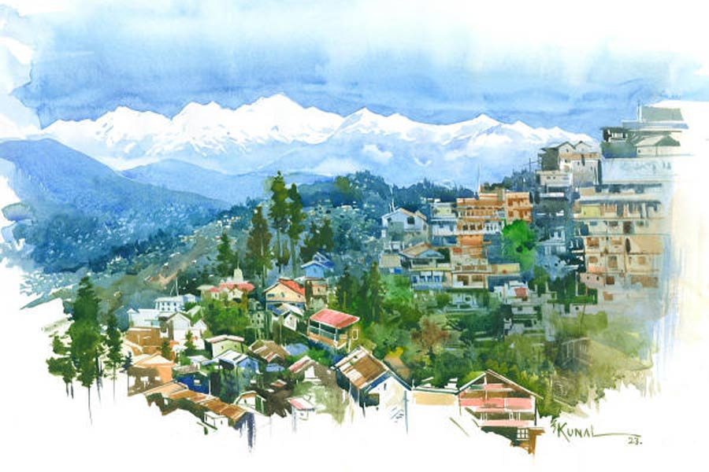

 
 <h1 align=center>চাদর</h1>
<h2 align=center>চন্দন চক্রবর্তী</h2> তোমার ট্রলি ব্যাগটা রেখে গেলাম। গরম পোশাক ছাড়া বাড়ির পোশাকও রইল। গুছিয়ে নিয়ো...” অনুরাধা কথাটা বলে হনহন করে আমার ঘর থেকে বেরিয়ে গেল। লেখালিখির মধ্যে ছিলাম। ঘাড় ঘুরিয়ে দেখলাম। আমার ফালি খাটটা মোটামুটি হাওড়া স্টেশনের বড় ঘড়ির চত্বর হয়ে গেছে। মিনিট খানেকের মধ্যে ঘাম মুছতে মুছতে চলে এল অনুরাধা। গমরঙা ভেজা ঘাম মুখে, বেশ লাগছিল। জুন মাসের মাঝামাঝি। বৃষ্টি টুকটাক হলেও গরম কমার নাম নেই। কে বলবে এখন সকাল ন’টাও বাজেনি!

ও বলল, “জামাকাপড়গুলো মিশিয়ে ফেলো না। ঝামেলায় পড়ে যাব। গুছোতে দিন কাবার হবে।”

বললাম, “ঠিক আছে।”

কোভিডের উৎপাতে দু’বছর সবাই ঘরে আটক ছিলাম। নয়ানজুলিতে আটকে যাওয়া জলের মতো। মজে যাওয়া অংশটা পরিষ্কার করতেই ফের কলকল বয়ে চলা। ছেলে আই টি সেক্টরে মস্ত চাকরি করে। এখন আবার অফিস চালু হচ্ছে। বাড়িতে থাকলেও সময় দিতে পারে না। ল্যাপটপ, কানে বোতাম আর দুটো মোবাইল খোলা সব সময়। ডাক্তার বৌমাও খুব ব্যস্ত। শুধু রোগী দেখা নয়, এখন বিভিন্ন হেলথ সেন্টারে বুস্টার ডোজ় দেওয়া ছাড়াও হাজার রকম কাজ। অ্যাডমিনিস্ট্রেশনের কাজও দেখতে হয়। দু’জনেরই সময় প্রায় নেই। তাই যত দায়িত্ব মা-বাবার উপর। অনুরাধা রান্না, জলখাবারের ব্যাপারটাও নিজে সামলায়। কাজের লোকরা ঘর ঝাঁট, বাসন ধোয়া, মেশিনে কাচাকুচি বা ঘর, ফার্নিচার পরিষ্কার করে।

পরশু আমাদের দার্জিলিং যাওয়ার কথা। এ বারে বিশেষ ঘোরাঘুরি নয়। ম্যাল থেকে একটু দূরে একটা বড় হোটেল বুক করা হয়েছে। ক’দিন জানলা থেকে কাঞ্চনজঙ্ঘা দেখা হবে। হোটেলের সামনে অনেকটা জায়গা। ছোট পার্ক মতো। সেখানে নাতি খেলবে। আর ইচ্ছে হলে বাইরে ঘুরতে যাবে।

হঠাৎ দার্জিলিং ম্যালটা আমার চোখের সামনে ভেসে উঠল। শুধু পাহাড়পুরের গল্প। চোখ ধাঁধানো কাঞ্চনজঙ্ঘার রূপ, যৌবন, হিমেল হাওয়ায় চাদর গায়ে বেঞ্চে বসে চেয়ে থাকা, অপূর্ব মেঘের খেলা... এই মুহূর্তে আমার কত কিছু মনে পড়ছে। ম্যাল ছাড়িয়ে একটা রাস্তা নীচের দিকে গড়াচ্ছে। রাস্তার দু’ধারে ভুটিয়া মেয়েরা বসে রঙিন উলের পোশাক বেচত। এখনও কি বেচে? ভোরের কুয়াশা ভেদ করে যেমন সূর্যের আলো উঁকি মারে, ঠিক সেই ভাবেই যেন উঁকি মারতে লাগল দার্জিলিং-এ কাটানো দিনগুলো।

আচ্ছা, সেই চাদরটা কোথায়? সেটা কি অনুরাধা বার করে দিয়েছে! ডিপ মেরুন রঙের চৌকো চৌকো কাজ করা। সম্ভবত পিয়োর উলের। খুব আরাম লাগে। গত বারে শীতেও গায়ে দিয়ে বেরিয়েছিলাম। মাঝে মাঝে মনে হয়, মরে যাওয়ার পরেও যদি এই চাদরটা গায়ে দেওয়া থাকে! ঠান্ডা হয়ে যাওয়া নিথর দেহটার কি শীত করে না তখন! কিন্তু এ বারে শীতে কি গায়ে দিয়েছিলাম! না, দেওয়া হয়নি।

দু’-এক বার জিজ্ঞেস করেছিলাম, “অনুরাধা, আমার সেই দার্জিলিং-এর চাদরটা এ বারে বার করলে না তো?”

আসলে শীতকাল কবে আসবে আর চাদরটা কবে গায়ে চাপাব, সেটা ছিল আমার সারা বছরের এক অপেক্ষা! এই অপেক্ষার সঙ্গে আর কোনও অপেক্ষার তুলনা চলে না। অনুরাধার প্রেমপত্রের জন্য অপেক্ষা, বা মাঝে মাঝে ফোর্ট উইলিয়ামে বা গঙ্গার ধারে ওর জন্য অপেক্ষার মধ্যেও প্রচণ্ড আকর্ষণ, ভাল লাগা, গোপন প্রেমের হাতছানি লুকিয়ে থাকত। কখনও অপেক্ষা করতে করতে ধৈর্যের বাঁধ ভাঙার উপক্রম হয়েছে। কিন্তু শেষ অবধি ভাঙেনি কিছুই। যে-হেতু অনুরাধা ছিল আমার স্পর্শের গণ্ডির মধ্যে। আমি জানতাম অনুরাধা আসছে, আসবে।

কিন্তু চাদরের মধ্যে যে অন্য গোপন রহস্য। যে চপলতার মধ্যে লুকোনো এক মনকাড়া টান ছিল, তা তো আর কখনও স্পর্শ করা যাবে না। সে বহু দূরের এক উজ্জ্বল রঙিন জ্যোতিষ্কের মতো। আমার প্রথম চাকরিজীবনের এক পরম পাওয়া। চাদরটা গায়ে দিলে আমি তা অনুভব করি। সেই দুষ্টু হাসি কলকলিয়ে ওঠে। চাদরটা আমার সঙ্গে দার্জিলিং-এর ম্যাল থেকে চলে এল কলকাতায়।

অনেকটা শীতের পরিযায়ী পাখির মতো ছিল দার্জিলিং-এর গোল গোল কমলালেবু আর ওয়েলিংটন স্কোয়ার বা ধর্মতলায় ভুটিয়া পোশাকের সারি সারি দোকান। কত ধরনের উলের পোশাক নিয়ে বসত সেই কমলারঙের মেয়েগুলো। তখন আমার বিয়ে তো দূরের কথা, প্রেমও হয়নি। সেলস-এর কাজ করতাম। শীতের দুপুরে শুধু খুঁজে বেড়াতাম তাকে। কী অদম্য ইচ্ছে আমাকে তাড়া করত! প্রতিটি দোকানের ভুটিয়া মেয়েদের দেখেছি। খুঁজেছিলাম সেই দুষ্টু মুখটাকে। পাইনি, ইস, নামটাও জানা হয়নি। জানা হয়নি তার ঠিকানা।

হ্যাঁ, চাদরটা নিয়ে গত কয়‌েক বছর ধরে খুবই অশান্তি হচ্ছিল। অনুরাধাই বলেছিল, “এই আবাসনে তোমার ছেলে, বৌমার একটা স্টেটাস আছে। কোনও বয়স্ক মানুষকে দেখেছ, এই রকম একটা পুরনো ম্যাড়মেড়ে রংচটা ভুটিয়া চাদর গায়ে দিয়ে ঘুরতে! প্রত্যেকে দামি গরম পোশাক কিংবা শাল গায়ে বেরোয়। একমাত্র তুমি ওই চাদরটা ছাড়তে চাও না। এই পরিবেশে ও রকম চলে না। ছেলের সম্মান রক্ষা করাও বাবার দায়িত্ব।”

বয়সকালে রাগের চেয়ে অভিমান বেশি হয়। কষ্ট হয়। কত কী মনে হয় তখন। আজ ছেলের আপত্তিকে গুরুত্ব না দিয়ে অনেক কথাই বলা যেত। সন্তানকে দাঁড় করানোর জন্য কত রকম আত্মত্যাগ, কত শখ-শৌখিনতায় পাথরচাপা দেওয়ার ইতিহাস, সাধ-আহ্লাদ হিসেবে আর কিছুই প্রায় অবশিষ্ট না থাকার সে কাহিনি আমিই বা বলতে পারলাম কোথায়? পৃথিবীতে কোনও বাবাই বোধহয় বলতে পারে না। নীরবে স্মৃতি রোমন্থন ছাড়া একটা বয়সের পর থাকেই বা কী!

অফিসের কাজেই গিয়েছিলাম দার্জিলিং। চা প্রসেসিং করার একটা বিশেষ ধরনের স্টেনলেস স্টিল বডির মেশিন তৈরি করত আমার কোম্পানি। শুকনো চা পাতা গুঁড়ো করা এবং ব্যাগ ফিল্টারের মাধ্যমে কালেকশন করার টোটাল প্যাকেজ। সেই কারণে টি গার্ডেনে ভিজ়িট!

সেই প্রথম দার্জিলিং যাওয়া। কাঞ্চনজঙ্ঘা দেখতে গিয়ে যে তার দেখা পাব, ভাবতেই পারিনি। সস্তায় ভুটিয়া সোয়েটার চাদরের সন্ধানে বেরিয়েছিলাম। তখন বিকেল। পাহাড়ে বিকেলের রোদ দেখা, কাঞ্চনজঙ্ঘার রূপ দেখাও উপরি পাওনা। নিচু হয়ে কোয়ালিটি পরখ করছিলাম। কখনও রং, কখনও ডিজ়াইনে আটকে যাই। অনুরাধা তখন প্রেমিকা হব-হব করছে। ভাল লাগার পর্যায়ে। কিছু উপহার দিয়ে চমকে দিলে কেমন হয়! ঢ্যাপকা ঢ্যাপকা ইমিটেশনের গয়না বিশেষ ভাল লাগল না।

যাই হোক, চমকে গেলাম শেষ পর্যন্ত। মেয়েটি বসেছিল একেবারে শেষের দিকে লালচে আলোয়। যেন কাঞ্চনজঙ্ঘা মেঘ সরিয়ে হেসে উঠল। ভুটানি, অথচ তাদের মতো টিপিক্যাল দেখতে নয়। যত্ন না নেওয়া একটা ঝলমলে সবুজ গাছ। সরু চোখ, পাতলা ঠোঁটে গোপন রহস্য। গালে টোল পড়া হাসি। সেই হাসিতে ছিল অদম্য হাতছানি। সে-ও বেশ অবাক হয়ে আমাকে দেখেছিল। প্রথম দেখাতেই বুকের ভেতর এক আলোড়ন। ছোট্ট ছোট্ট ঢেউ। চকিতে দেখা সে চাউনি মনের মধ্যে গেঁথে গেল। কিন্তু কত ক্ষণ ও ভাবে দেখা যায়? মেয়েটির দোকানের সামনে উবু হয়ে বসে পড়েছিলাম। মেয়েটির চো‌খেমুখেও ছিল এক লুকোনো ভাল লাগা। সে সোয়েটার, কার্ডিগান, মাফলার, চাদর ইত্যাদি দেখাতে শুরু কর‌ল। সুন্দর শিল্পীর হাত যেন। কাঁচকলার মোচার মতো হলদেটে রঙ। সরু সরু আঙুল। দেখতে গিয়ে  হাতে হাতে ঠেকে যায়। সে লজ্জা পেয়েছিল। সে দিনই চাদরটা মেয়েটি পছন্দ করে দিয়েছিল। বলেছিল, “ইয়ে আপকী বিবিকে লিয়ে।”

মেয়‌েটির দোকানটা ছিল সবার শেষে। খদ্দেরের ভিড় তেমন ছিল না। তবুও দু’-এক জন তো আসতই। পাশে খালি জায়গায় দাঁড়িয়ে সিগারেট ধরাতাম। ফ্যালফ্যাল করে দেখতাম। এত সুন্দর মিস্টিরিয়াস হাসি তার আগে দেখিনি। যে ক’দিন ছিলাম, সে ক’দিনই বিকেলে হাজির হতাম। সেই ভুটিয়া মেয়েটির দিকে চেয়ে থাকতাম। যেন ভোরের কাঞ্চনজঙ্ঘা! সে-ও যেন অপেক্ষায় পথ চেয়ে থাকত।

এক পাগলামিতে পেয়ে বসেছিল। কিছুই ভাল লাগত না। শুধু মনে পড়ত তার শেষ দিনের মুখ।

শুধু বলেছিলাম, ‌“চাদরটা নিয়ে কাল কলকাতায় ফিরে যাচ্ছি। রেখে যাচ্ছি মনটা... কিছু বলবে?”

মুহূ‌র্তে কাঞ্চনজঙ্ঘার উড়ো জলমেঘ দেখেছিলাম ওর মুখে। মৃদু ঘাড় নেড়েছিল। হয়তো সে ঘাড় নাড়ার অর্থ,‌‘কিছু বলার নেই’, অথবা ‌‘এ হয় না। ফিরে যাও।’

ফিরে এসেছিলাম।

সেই মেয়েটিকে কি এ বারেও দেখতে পাব? সে কি আর তেমন করে হাসবে? চিনতে পারবে কি আদৌ! তারও তো এখন বয়স বেড়েছে। না কি সে নেই! হয়তো ম্যালের সেই রাস্তায় কোনও দোকানই এখন বসে না! যদিও বা বসে, সেখানে সে বসে না। অন্য কেউ বসে। সে কি বলতে পারবে মেয়েটির ঠিকানা? এলোমেলো ভাবনায় জেরবার লাগল নিজেরই। 

এক সময়ে সম্বিৎ ফিরল গিন্নির ডাকে, “কী হল, কিছুই তো গুছোওনি? সব সময় গল্পের কথা ভাবলে চলবে?”

বলতে পারি না যে, ‌‘গল্প নয়। এক ‌সত্য ছিল গল্পের মতো, সে কথাই ভাবছিলাম।’

বললাম, ‌“চাদরটা না দিলে গোছানো শুরু করতেই পারছি না।”

“চাদর! কোন চাদর? সেই দার্জিলিং-এর ম্যাড়মেড়ে পুরনো চাদর! কী মধু আছে ওটায়?”

‌“হুম! সবার পুরনো ভিটেমাটি, বৃদ্ধ বাবা-মাকে দেখতে ইচ্ছে করে আর চাদর দেখতে ইচ্ছে থাকবে না?” আমি হাসি।

‌“কবেকার পুরনো চাদর! সেটা নিয়ে বেড়াতে যাবে? তা হবে না। তোমার ছেলে-বৌমা তা হতে দেবে না...” ঘর থেকে ও বেরিয়ে গেল। কিছু ক্ষণের মধ্যেই ফিরে এসে একটা ঘিয়ে রঙের কাশ্মীরি শাল ধরিয়ে দিয়ে বলল, ‌“এটা নিয়ে চলো।”

শালটা অনুরাধা কাশ্মীর থেকে কিনে দিয়েছিল। সেই দোকানদারের সুন্দর ফর্সা মুখটার কথা মনে পড়ল।

অনুরাধা হেসে বলেছিল, ‌“ভাল হবে তো?”

লোকটা বলেছিল, ‌“খুব নরম। গায়ে দিলে আরাম লাগবে।”

দোকানদারের নাম বাদশা। সে একটা হালকা শেওলা রঙে কালো কাজ করা স্টোল দিয়ে বলেছিল, “ইয়ে আপকে লিয়ে, ম্যাডাম।”

অনুরাধা গায়ে জড়িয়ে বলেছিল, “বাহ! সুন্দর রং, ওটা দিয়ে দিন।”

দেখলাম, অনুরাধা কাশ্মীরের শাল আর স্টোল দু’টিই বার করল।

‌আমার কেমন বাচ্চাদের মতো জেদ চেপে গেল। বললাম, ‌“আমার দার্জিলিং-এর চাদরটাই চাই। ওটা বার করে দাও। দার্জিলিং তো তোমার এই আবাসন নয় যে সবাই স্টেটাস সিম্বল বয়ে বেড়াবে।”

অনুরাধা ইতস্তত করে বলল, ‌“সেটা আমি দিয়ে দিয়েছি।‌”

আমার গলার স্বর আচমকা চড়ে গেল, ‌“কাকে দিয়ে দিলে?”

‌“আচ্ছা মুশকিল তো! তুমি একটা পুরনো ভুটিয়া চাদরের জন্য এ রকম করছ কেন?”

‌“সে দিনের ভুটিয়া চাদর আজও আমার কাছে দামি। আমাকে জিজ্ঞেস না করে দিলে কেন!”‌

“পুরনো জামাকাপড় কোভিডের সময় অনেককে দিয়েছি। সেগুলো কি তোমাকে জিজ্ঞেস করে দিয়েছি?”

আমার আর যুক্তি আসে না। চাদরটা ফিকে হতে হতে কেমন হারিয়ে যেতে থাকে।

‌“কাকে দিয়েছে? আবাসনের কোনও কাজের লোককে?”

‌“মোড়ের বৃদ্ধা ফুলওয়ালিকে। ঠান্ডায় কষ্ট পাচ্ছিল, তাই।”

ফিকে হতে হতেও যেন হারাল না চাদরটা। একটু নিশ্চিন্ত হলাম। অন্তত সামনের শীতে বুড়ির গায়ে চাদরটা তো আবার দেখতে পাব! কিন্তু দার্জিলিং-এর সেই মেয়েটি, যদি ঘটনাচক্রে সে সেখানেই তার পসরা নিয়ে এখনও বসে, যদি আবার তার মুখোমুখি হতে পারি, চাদর ছাড়া সে কি আমায় চিনতে পারবে?

আমাকে হঠাৎ চুপ করে যেতে অনুরাধা খুব নরম গলায় বলল, ‌“তোমার কী হয়েছে বলো তো?”

মনের কষ্ট বিজবিজ করে উঠল। মলিন হেসে বললাম, ‌“কিছু না।”