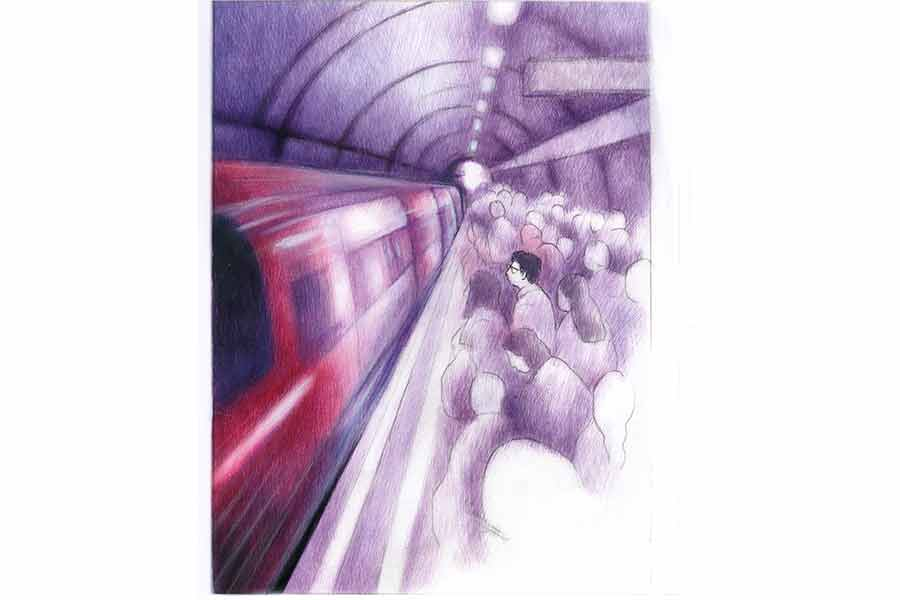

 
 <h1 align=center>চাবি</h1>
<h2 align=center>সমরনাথ চট্টোপাধ্যায়</h2> কনক রোজ মেট্রোয় অফিস যায়। বাড়ি থেকে মেট্রো স্টেশন হেঁটে মিনিট সাতেক। ন’টা বারোর ট্রেনটা ধরে। না পেলে ন’টা উনিশ। দশটার আগেই পৌঁছে যায়। অনেক দিনের অভ্যেস ওর। গতে বাঁধা চাল। কোথাও বেতাল নেই। পথে কেউ ডাকলে শুধু হাত নাড়ে, থামে না।

আজ যাওয়ার পথে অনু, মানে অনুষ্কাকে দেখতে পেল। রাস্তার অন্য প্রান্ত দিয়ে আসছিল। অনু ওর মাসতুতো বোন। ওর থেকে কয়েক বছরের ছোট। ওরা বন্ধুর মতো। একটু দুষ্টু-মিষ্টি সম্পর্ক আছে ওদের মধ্যে। বেশ কিছু দিন পর অনুকে দেখে একটু কুশল জানতে চাইল। কোনও সাড়া পেল না। আবার ডাকল, একটু জোরে। তবু নিরুত্তর হেঁটে চলেছে অনু। কনক অনুর দ্রুতলয়ে হেঁটে যাওয়া দেখল। দেখতে দেখতে নিজেকে কয়েকটা প্রশ্ন করল। অনু কি ওকে দেখতে পায়নি? অনু কি ওর ডাক শুনতে পায়নি? না কি ও কনককে দেখতে বা ওর ডাক শুনতে পেলেও না দেখার বা না শোনার ভান করে চলে গেল? ভাবতে ভাবতে কিছুটা সময় নষ্ট হল। স্টেশনের সামনে পৌঁছে কনক দেখল ন’টা আঠেরো। চলমান সিঁড়ির শেষ ধাপ থেকে দেখতে পেল, ন’টা উনিশের ট্রেনটা তখনও দাঁড়িয়ে। ছুট্টে ট্রেনে উঠতে গেল। তখনই ঘটাং আওয়াজে কামরার দরজা বন্ধ হয়ে চোখের সামনে ট্রেনটা ছেড়ে দিল। হতাশ কনক ট্রেনটার দিকে তাকিয়ে দীর্ঘশ্বাস ছাড়ল। একটা ফাঁকা চেয়ারে বসল পিছিয়ে এসে। এই মুহূর্তে ট্রেনটাকে ওর অনুষ্কা বলে মনে হল। ঠিক অনুর মতো চলে গেল। ফিরেও তাকাল না। কিন্তু কেন? ট্রেনটা কি অনুষ্কা? অনুষ্কা কি একটা ট্রেন? কিংবা অনুষ্কা নয়, ওর মতো দেখতে আর কেউ? এতটা ভুল হবে!

ভাবতে ভাবতে হুড়মুড় করে পরের ট্রেনটা ঢুকল। দেখে মনে হবে ট্রেনটার খুব তাড়া। অনেকটা কনকের স্ত্রী ইতিকার মতো। সবেতেই তাড়া। কিন্তু এতে কনকের কোনও হেলদোল নেই। ইতির কথা ভাবতে ভাবতে অফিসের দেরির কথাও ভুলে গেল। ধীরেসুস্থে ট্রেনে উঠতে গেল। অফিসযাত্রীর ভিড়। একটু ঠেলাঠেলি করে ট্রেনের কামরায় উঠে প্রায় দরজা ঘেঁষে দাঁড়াল। ঘটাং করে দরজা বন্ধ হয়ে গেল। দু’-এক জন আওয়াজ তুলল, এক জন কনককে একটু সামনের দিকে টেনে ধরল। কনক ব্যাপারটা তখনও বুঝতে পারেনি। একটু অবাক হয়ে পিছনের দিকে তাকাতে ওর ডান পায়ে একটু টান পড়ল। বুঝতে পারল ওর পায়ের  প্যান্টের ঝোলা অংশটা দরজায় আটকে গেছে। ডান পা-টা জোরে টেনে সেটা ছাড়িয়ে নিল। ট্রেন তত ক্ষণে নিজস্ব গতি প্রাপ্ত হয়ে গেছে। ইতিমধ্যে স্থির হয়ে দাঁড়ানোর জায়গা করে নিয়েছে কনক।

 

*****

কনক রোজ মেট্রোয় অফিস যায়। মিনিট কুড়ির যাত্রাপথ। হাসিঠাট্টা গল্পগুজব করে কেটে যায়। আজ কোনও চেনামুখ নেই। আজ ও নির্দিষ্ট ট্রেন ধরতে পারেনি। এর জন্যে দায়ী অনু। কিংবা তার ডুপ্লিকেট...

ট্রেনটা তীব্র গতিতে সুড়ঙ্গে ঢুকে পড়ল। কনকের ভাবনাও গতিপ্রাপ্ত হল। অনু থেকে ইতি। ইতি থেকে বনানী। বনানী ওর সহকর্মী। সহকারী এবং সহযোগী। পাশের টেবিলেই বসে। প্রায়ই দেরি করে অফিস আসে। কোনও না কোনও অজুহাত ওর মজুত থাকে। কিন্তু কনক? কনক আজ কী অজুহাত দেবে? কনককে ওর জিএম যখন জিজ্ঞেস করবেন, ‘আজ এত লেট?’

তখন কনক বলবে, ‘স্যর, ট্রেনটা মিস করলাম। প্লাটফর্মে ঢুকতে ঢুকতে ট্রেনটা ছেড়ে দিল।’

‘তা হলে আগের ট্রেনটা টার্গেট করেন না কেন?’

‘তাই তো করি স্যর।’

‘তার মানে আজ দু’-দুটো ট্রেন মিস করেছেন। তাই তো? আপনার জন্যে সি-ফোর সেকশন এখনও বন্ধ। পাবলিক বাইরে চেঁচামেচি করছে। এ হ্যাপা কে সামলাবে?’

তখন মাথা নিচু করে নখ খুঁটতে খুঁটতে, ‘সরি স্যর’ বলা ছাড়া আর কিছু করার থাকবে না কনকের। যদিও এগুলো সবই সত্যি। তবু... না না, এ সব শুনতে ওর ভাল লাগবে না। একটা জুতসই অজুহাত চাই। সত্যি না হলেও যথেষ্ট বিশ্বাসযোগ্য। বনানীর একটা সাজেশন নিলে কেমন হয়? বনানীর কাছে অনেক নতুন নতুন অজুহাত মজুত থাকে। অসত্য, কিন্তু অকাট্য। ভাবতে ভাবতে মেট্রো স্টেশনের বাইরে বেরিয়ে মোবাইল বার করল। বনানীকে কল করল। বাঁ-কানে ফোনটা ধরে রিংটোন শুনতে পেল। হ্যালো শোনার অপেক্ষা করতে হল না। ডান কানের কাছে ‘কনকদা’ ডাক শুনে চমকে উঠল।

“কে? আরে, বনানী! তোমাকেই  তো কল করছিলাম।”

“আপনি আজ এখনও অফিস যাননি কনকদা?” বড় বড় চোখ করে প্রশ্ন করল বনানী।

“একটু দেরি হয়ে গেল। তাইতো তোমাকে...”

“আজ অফিসে ম্যাডাম আসছেন। আপনি জানেন না?”

“ম্যাডাম মানে? কাঞ্চন ম্যাডাম? আমাদের এম ডি?”

“হ্যাঁ। আজই সারপ্রাইজ় ভিজ়িটে আসার কথা তো। এত ক্ষণে বোধহয় এসেও গেছেন।”

“সে কী? আমার সি-ফোর সেকশন কে খুলবে? ওটা তো আমারই দায়িত্বে! কী হবে?”

“কথা না বাড়িয়ে তাড়াতাড়ি চলুন!” স্বগতোক্তি করল বনানী, “আমাদের সি-ফোরটা কেউ খুলল কি না কে জানে! চাকরিটা গেল বোধহয়।” কনকের বুক কেঁপে উঠল। হাঁটার গতি ধীর হয়ে গেল। পায়ে কেউ যেন শেকল পরিয়ে দিয়েছে। বুকে কেউ হাতুড়ি ঠুকছে। চোখের সামনে ভেসে উঠছে সি-ফোরের বন্ধ দরজা। গুচ্ছের কাস্টমার জড়ো হয়ে ওর পিণ্ডি চটকাচ্ছে। হয়তো ম্যাডামকে নিয়ে জিএম বন্ধ সি-ফোর দেখে গেছেন। ম্যাডাম ঠান্ডা গলায় বলেছেন, ‘হু ইজ় ইন চার্জ অব দিস সেন্টার? স্যাক হিম ইমিডিয়েটলি।’

জিএম কনক মিত্তিরের পিঙ্ক স্লিপে সই করছেন। পাওয়ারপয়েন্ট প্রেজ়েন্টেশনের মতো ছবিগুলো পর পর স্লাইড করে যাচ্ছে। ঝনঝন করে কনকের মোবাইল বেজে উঠল। জিএম-এর কল। পেটটা গুলিয়ে উঠল কনকের। কপালে ঘাম। পায়ের রগে টান। কাঁপা কাঁপা আঙুলে সোয়াইপ করে ফোনটা কানে চেপে ধরল, “গুড মর্নিং স্যর। বলুন স্যর...”

“সেন্টারে আছেন তো? কাঞ্চন ম্যাডামকে নিয়ে যাচ্ছি। উনি সি-ফোরটা দেখতেই আজ এসেছেন। ঠিক আছে?”

“হ্যাঁ... হ্যাঁ স্যর।  স্যর... স্যর...” কিছু একটা বলতে চাইল কনক। তত ক্ষণে স্যর ফোন কেটে দিয়েছেন। বনানী জিজ্ঞেস করল, “জিএম?”

ফোনটা পকেটে রাখতে রাখতে কনক বলল, “হ্যাঁ। ম্যাডামকে নিয়ে সি-ফোর দেখতে নামছেন। ভাবলাম একটু সময় চেয়ে নিই। স্যর ফোনটা কেটে দিলেন। দূর! আজ নির্ঘাত পিঙ্ক স্লিপ। নো ওয়ে। আই অ্যাম ফিনিশড বনানী, আমি শেষ।”

“চুপ করুন তো! আপাতত একটু জোরে পা চালান।” 

*****

অফিসের মূল প্রবেশপথে পাঁচ ধাপ সিঁড়ি। উঠে কাচের দরজা। ঠেলে ঢুকতে হয়। ডান হাতে দরজা ঠেলতে ঠেলতে বাঁ পকেটে হাত রাখল কনক।

“এই, যাঃ!” প্রায় চমকে থমকে দাঁড়িয়ে পড়লো কনক।

“কী হল?” আচমকা এরকম থমকে দাঁড়ানোয় কনকের পিছন পিছন আসা বনানী প্রায় পড়ে যাচ্ছিল। কোনও ক্রমে সামলে নিল।

“সেন্টারের চাবিটা পকেটে নেই।”

“সে কী? ব্যাগে রাখেননি তো?”

“ব্যাগেও তো নেই!” ব্যাগটা ঘেঁটে দেখে কনক জবুথবু দাঁড়িয়ে রইল।

“বাড়িতেই ফেলে এসেছেন বোধহয়। যাক্‌গে। অত চিন্তা করার কিছু নেই। একটা ডুপ্লিকেট চাবি তো সুরেশ স্যরের কাছে আছে। কাউকে পাঠিয়ে দিন। নিয়ে আসুক।”

“ব্যস! আর কী! একে লেট, তার ওপর চাবি নেই। একেবারে সোনায় সোহাগা! স্যর আমাকে এখান থেকেই বাড়ি পাঠিয়ে দিন আর কী! ওফ্‌, ভগবান! আজ আমায় এ কী চক্রে জড়ালে?” পাশে তটস্থ নিরপত্তারক্ষী। যান্ত্রিক অভ্যেসে ‘মর্নিং স্যর’ বলে কপালে হাত ঠেকাল। কনক আজ কোন প্রত্যুত্তর করল না।

কিংকর্তব্যবিমূঢ় দাঁড়িয়ে রইল।

“স্যর, কাঞ্চন ম্যাডাম ভিজ়িটে এসেছেন।” নিরপত্তারক্ষীর সতর্কতায় সংবিৎ ফিরল কনকের। অন্য দিনের তুলনায় এরা আজ সন্ত্রস্ত।

“চলুন, চলুন...” পিছন থেকে তাড়া মারল বনানী।

“ও, হ্যাঁ। চলো। যা হয় হবে...” সেন্টারের দিকে পা বাড়াল কনক। সঙ্গে বনানী। ও দিক থেকে সি-ফোরের সুপারভাইজ়ার সরস্বতী হন্তদন্ত হয়ে আসছিল। কনককে দেখতে পেয়ে যেন হাতে চাঁদ পেল, “স্যর, এসে গেছেন? তাড়াতাড়ি চলুন। সার্ভারটা অন করুন। সবাই আপনার জন্যে অপেক্ষা করছে।”

কিন্তু দরজা খুলল কে? ভাবল কনক। সরস্বতী আপন মনে বলল, “বড়সাহেব দরজা খুলে দিয়েছেন। কিন্তু সার্ভারের পাসওয়ার্ড তো জানেন না।  তাই কেউ মেশিন খুলতে পারছে  না।”

“ও, হ্যাঁ হ্যাঁ। চলো চলো...” সেন্টারের দিকে প্রায় ছুট লাগাল কনক। সার্ভার অন করে বসল। সার্ভার রুমের এসির হাওয়া এখন কনকের প্রাণবায়ু। রুমাল বার করে কপালের ঘাম মুছল। কাচের দেওয়াল থেকে বনানীকে দেখল। বনানী এখন ব্যস্ত। সব কাউন্টার ঘুরে ঘুরে মনিটরগুলো চেক করছে। অপারেটররা কাজ শুরু করে দিয়েছে। লাইন দিয়ে দাঁড়িয়ে থাকা মানুষজনের মুখে সন্তুষ্টির রেখা। কনকের হৃৎপিণ্ড স্বাভাবিক হচ্ছে। নাড়ির স্পন্দন তালে ফিরছে। টান ধরা পায়ের রগ শিথিল হয়ে আসছে। মনোবল ফিরে পাচ্ছে কনক। এখন এই মুহূর্তে নিজেকে এই সেন্টারের হর্তা-কর্তা-বিধাতা মনে হচ্ছে। ওর ঠোঁটে লুকিয়ে থাকা চওড়া হাসিটা আস্তে আস্তে প্রকাশ পাচ্ছে। ঠিক তখনই জিএম সুরেশস্যর সেন্টারে ঢুকলেন এম ডি কাঞ্চন ম্যাডামকে নিয়ে। এ দিক-ওদিক দেখতে দেখতে সোজা সার্ভার রুমে। কনকের মুখোমুখি। রুমে বিদেশি পারফিউমের গন্ধ ছড়িয়ে পড়ল। কনক উঠে দাঁড়িয়ে দু’জনকেই ‘গুড মর্নিং’ বলল। ম্যাডাম মিষ্টি সুরে জিজ্ঞেস করলেন, “কেমন চলছে সেন্টার?”

“ঠিকঠাকই আছে ম্যাডাম।”

“কাস্টমার কেয়ার সেন্টার থেকে কাস্টমাররা ঠিকমতো কেয়ারপাচ্ছে তো?”

“আমরা সবাই যথাসাধ্য চেষ্টা করছি ম্যাডাম।”

“কাস্টমাররা কী বলছে?” ম্যাডাম সার্ভার রুম থেকে বাইরে

বেরিয়ে একটা কাউন্টারে দাঁড়ালেন। লাইনে দাঁড়িয়ে থাকা কাস্টমারদের দিকে একটা হালকা প্রশ্ন ছুড়ে দিলেন, “আপনারা ঠিকমতো সার্ভিস পাচ্ছেন তো?”

“হ্যাঁ ম্যাডাম, পাচ্ছি।”

“ভেরি গুড।”

কিন্তু শেষরক্ষা হল না। দু’নম্বর কাউন্টার থেকে এক বয়স্ক বলে উঠলেন, “আজকে ম্যাডাম কাউন্টার খুলতে কিন্তু বেশ দেরি হয়েছে। প্রায় কুড়ি মিনিট কোনও কাজ হয়নি। এখানকার ইন-চার্জ আজ বেশ লেটে এসেছেন।”

“তাই না কি? কী ব্যাপার মিস্টার মিত্র?” কনকের দিকে প্রশ্নটা ছুড়ে দিলেন ম্যাডাম কাঞ্চন।

“না, মানে আজকে...”

“আমি বলছি ম্যাডাম। আজকে একটা ইউনিক ঘটনা ঘটেছে!” বনানী এগিয়ে এল।

“হোয়াট ওয়াজ় দ্যাট?”

“আমরা দু’জনেই মেট্রোয় আসি। আজ যে ট্রেনটায় রোজ আসি, সেটা প্ল্যাটফর্মে ঢোকার মুখে কনকদা পকেট থেকে রুমাল বার করতে গিয়ে তাড়াহুড়োয় সেন্টারের চাবিটা রেল ট্র্যাকে পড়ে গেল।”

“হো...য়া...ট? তার পর?”

“লোকজন হইহই করে উঠল। আমরা থম মেরে দাঁড়িয়ে রইলাম। কী করব বুঝতে পারছিলাম না। ট্রেনটা ছেড়ে দিলাম। ট্রেনটা চলে যেতে দেখলাম চাবিটা তখনও ট্র্যাকে পড়ে। মেট্রোর অফিসে গিয়ে যোগাযোগ করলাম। ওরা দেখেটেখে বলল, একটা অ্যাপ্লিকেশন দিয়ে যান। আর আপনাদের এক জনের আইডেন্টিটি কার্ড জমা রেখে যান। এখন অফিস টাইম। ট্র্যাকে নামা সম্ভব নয়। বিকেলে আসুন।”

“ভেরি ইন্টারেস্টিং। অ্যান্ড ভেরি ডেঞ্জারাস অলসো। আপনাদের কিছু হয়নি তো?”

“না ম্যাডাম। আমাদের একটু দেরি হয়ে গেল, এই যা।” 

“এটা খুবই সিরিয়াস, আই এগ্রি। বাট কাস্টমারের কেয়ারটাও ইকুয়ালি ইম্পর্ট্যান্ট। বি কেয়ারফুল মিস্টার মিত্র। ও কে?” তার পর সেই বয়স্ক ভদ্রলোককে উদ্দেশ্য করে বললেন, “আমি খুব দুঃখিত স্যর, আজকের ইনকনভিনিয়েন্সের জন্য। আশা করছি আর এ রকম হবে না। চলুন মিস্টার সুরেশ।”

ওঁরা চলে যাওয়ার পর সার্ভার রুমে ফিরে এল কনক। নিজের চেয়ারে থপ করে বসে পড়ল। বনানী পাশে এসে দাঁড়াল। ওকে দেখে কনক ঠোঁটে একটা ম্লান হাসি ফোটাল। বলল, “অসাধারণ! অভিনব! তোমার উর্বর মস্তিষ্কের জন্য আজ আমার পিঙ্ক স্লিপটা আটকে গেল। কিন্তু যদি... আমার চাকরিটা আজ নট হয়ে যেত, ইতিকে আমি কী বলতাম!”

“কেন এ সব ভাবছেন বলুন তো? আপনার স্ত্রীকে কি আপনি অফিসের সব কথা রোজ বলেন?”

“হয়তো বলি না। কিন্তু, কিন্তু আজকে যদি তুমি না থাকতে!” বলে কনক স্নেহ ভালবাসা শ্রদ্ধা আর কৃতজ্ঞতা মাখা দৃষ্টি নিয়ে বনানীর দিকে তাকিয়ে রইল। বনানী শরীর ঝাঁকিয়ে একটু চটুল ভঙ্গিতে বলে উঠল, “কী ব্যাপার কী! এ রকম করে কী দেখছেন বলুন তো?”

‘কী যে দেখছি তা তো আমি নিজেই জানি না!’ ভাবল কনক। মুখে বলল, “দেখছি না, ভাবছি। ভাবছি এ রকম একটা রোমহর্ষক ঘটনা স্ত্রীকে কি বলা যায়? বিশেষত তোমার অজুহাত তৈরির ফ্যাক্টরির কথা? যা আজ আমার রক্ষাকবচ হয়ে...”

“থাক, থাক, অনেক হয়েছে। আজ বরং বৌদিকে গিয়ে একটু বেশি করে আদর করবেন। দেখবেন সব টেনশন রিলিফ।”

সলজ্জ হাসে কনক।

বনানী বলে, “বসুন। ঠান্ডা হয়ে বসুন তো একটু। আমি ও দিকটা দেখে আসি আর দুটো কফি বলে আসি।”

বলে ধীর পায়ে, যেন কনকের চেতনায় নূপুরের শব্দ ছড়িয়ে চলে গেল বনানী। সেই দিকে তাকিয়ে ভাবছিল কনক, বৌদিকে নয়, আজ কাকে ওর সবচেয়ে বেশি আদর করতে ইচ্ছে করছে, তা সে-ই জানে। সে কথা কি আর মুখে আনা যায়!

কনক রোজ মেট্রোয় অফিস যায়। কিন্তু এই গল্পটা আর মেট্রোয় ‘হারিয়ে যাওয়া’ সেই চাবিটা আজও কনকের ড্রয়ারের এক কোণে পড়ে আছে। এটা বনানী ছাড়া আর কেউ জানে না। ইতিও নয়।