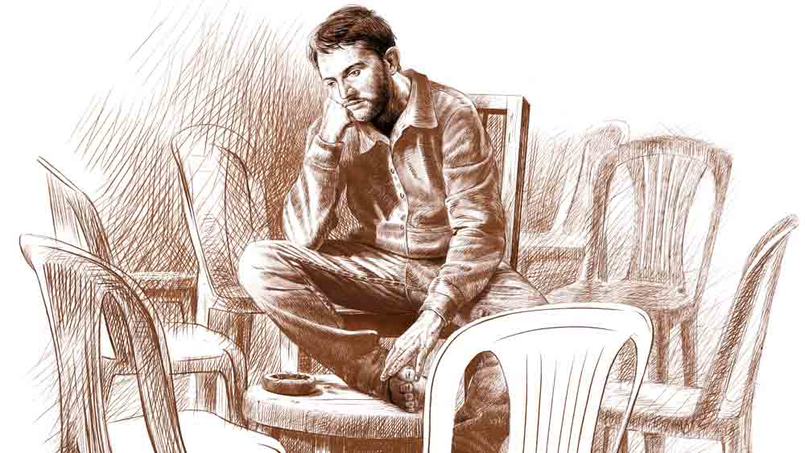

 

<h1 align=center> চৈত্রবসন্ত</h1>
<h2 align=center>সুদর্শন মুখোটী</h2>
ফণী ফোনটা সুইচ অফ করে একটা বিড়ি ধরাল। এই বিড়িটা না ফুঁকলেও পারত।   ‘বারণ করার কেউ নেই বলে বিড়ি ফোঁকার মাত্রা বাড়িয়েই চলেছ। ফণিভূষণ মিত্র, তোমার কি জানা নেই, ধূমপান স্বাস্থ্যের পক্ষে ক্ষতিকর, ক্যানসারের কারণ! নিজের সঙ্গে আজকাল নিজেই কথা বলছ ফণী! আর কার সঙ্গেই বা কথা বলবে, কে-ই বা কথা বলবে তোমার সঙ্গে! পুরনো বন্ধুরা আজ দূর গ্রহের বাসিন্দা। এই বিড়িটা না ধরালে এক চিলতে স্বাস্থ্যহানি কমত, একটা বিড়ির পয়সা বাঁচত। অভাব তো সারা অঙ্গে, পোশাকে, চলনে-বলনে। গরিবের কথা কেউ ভাবে না। স্কুলবেলার বন্ধু রজত আজ প্রখ্যাত সাহিত্যিক। সুমনের জীবনের ছায়া অবলম্বনে উপন্যাস লিখে কী একটা পুরস্কার পেয়েছে, সেই উপন্যাস নিয়ে তৈরি ফিল্ম চলছে মাল্টিপ্লেক্সে। একটা গল্পেও তোমার জীবনের ছায়ার ছোঁয়াও নেই।’   আধাবন্ধু বান্টু সে দিন জ্ঞানগর্ভ ভাষণ ভাসিয়ে দিয়েছিল, “নিজের দোষেই আমি গরিব। অনেক রাস্তা খোলা রোজগারের। আনাজ বিক্রি করে বুধো আজ দামি স্কুটি চড়ছে, দু’-কামরার ঝকঝকে ফ্ল্যাট কিনেছে, বৌ-বাচ্চা নিয়ে বিন্দাস সংসার...”   স্মৃতিকাতর ফণী এসে পৌঁছল তাদের সেই বসার জায়গায়। তাদের মানে, ফণী, সুমন, মদন, রজত, দেবু আর তরুণ। শহরতলির স্টেশনের কাছেই রেললাইনের ধারে, ঘাস-নুড়ি মাখামাখি এক ফালি জমিটা ওদের আড্ডার নিখরচার গালচে। এখন ফণী ছাড়া আর কেউ আসে না। সবাই আজ প্রতিষ্ঠিত, তাই ব্যস্ত। ফণীও রোজ পারে না, রবিবার বিকেলগুলোতেই আসে। সোম থেকে শনি সকাল-বিকেল-সন্ধে প্রাইভেটে গুটিকয় বাচ্চা পড়াতে হয় জঠর-ইঞ্জিনের গতি বজায় রাখতে। প্রাইমারি ক্লাসের ওপরে পড়ানোর যোগ্যতা তার নেই। স্কুলের গণ্ডি পেরোতে পারেনি। মেধার অভাবে নয়, অভাবের তাড়নায়। সব বন্ধুর কলেজি শিক্ষায় প্রবেশ-প্রস্থান ঘটেছে যথা সময়ে। ইউনিভার্সিটির সীমা ছাড়িয়েছে কেউ কেউ। সরকারি উঁচু পদে আসীন সুমন আজ উজ্জ্বল তারকা। সুসফল এক মানুষ। বাকিরা চাকরি নিয়ে যে যার মতো ব্যস্ততায় ভালই আছে। এই বৈঠকি ঠেক হয়তো ভুলেই গেছে বাকিরা।   বহু যোজন দূরে পিছিয়ে পড়েছে ফণী। বিদ্যালয়ের অষ্টম মান ভর করে কোনও অর্থকরী কাজ জোটেনি, খুদে ছাত্র-ছাত্রী পড়ানো ছাড়া। তবু সে খারাপ ছাত্র ছিল না, পড়ানোর ধরনে কিছু সুনামও হয়েছে। শহুরে ইংরেজি মাধ্যম স্কুলগুলোর ক্রমবর্ধমান দাপট বাঁচিয়ে ভাগ্যিস বাংলা মাধ্যমের প্রাথমিক ইস্কুলগুলো এখনও টিমটিম করে জ্বলছে!   আজন্ম গরিব ফণীর বাবা মারা গেল এইটে পড়ার সময়, যাকে বলে মড়ার ওপর খাঁড়ার ঘা। ঘাড়ে এসে পড়ল মা আর দু’-বছরের ছোট বোনের দায়িত্ব। তিন প্রাণীর অন্ন-বস্ত্রের অভাব নিত্যসখা হয়ে রইল। ভাগ্য কিঞ্চিৎ সহায় তাই শরিকি বাড়ির একফালি কামরাটুকু জুটেছে।   টালির নালা দিয়ে এর পর অনেক নোংরা জল বয়ে গেছে। বোন আরতি আধবেকার এক ছেলেকে ভালবেসে বিয়েটা সেরে ফেলেছে। গত বছর গত হয়েছে মা।   ঘরটায় এখন একলা ফণীর দিন গড়ায়। রাত কাটে। দু’-এক জনের উপদেশের মৃদুমন্দ বাতাস বয়, “এ বার একটা বিয়ে কর।”      আত্মসংলাপ আবার পেয়ে বসে। স্মৃতিবন্ধুরা কেউ আসে না।   ‘ফণী, তুমি এখনও কেন আসো এখানে? ভাঙা আড্ডায় স্মৃতির আবেশ ধরে রাখতে চাইছ কেন?   ‘তখন সুমনের সঙ্গে আসতে শুরু করল সুমনের রতন, অন্য বন্ধুদের রত্না। সবাই সদা ব্যস্ত, তুমি প্রায় বেকার। সিনেমার টিকিটের জোগান, নেমন্তন্ন বাড়ির গিফ্ট কেনা... সব দায়িত্ব তোমার। ইনামও পেতে... বিনা খরচে সিনেমা, থিয়েটার আর নেমন্তন্ন খাওয়া। মনে যদিও মৃদু বিবেকের আঁচড় লাগত।   ‘সুমন আর সুমনের রতনের মাঝে হাইফেন হয়ে বসতে শুরু করলে তুমি। সুমনের আজ্ঞাবাহী হয়ে রত্নার শাড়ি বদলে আনা, দামি জুতো সারিয়ে আনা, রেস্তরাঁর টেবিল বুক করা ইত্যাদি কাজে লেগে পড়লে। সুমনের প্রশ্রয়ে রত্নাকে রতন বলতে শুরু করলে। মুখ-আলগা বন্ধুরা বলতে শুরু করল, তুমি রত্নার প্রতি দুর্বল হয়ে পড়েছ। প্রতিক্রিয়ায় তোমার মন কি কিছু বলেছিল?   ‘বন্ধুদের বিয়ে হতে থাকল একে একে। ঘোরতর রহস্য তৈরি করে চমক দিয়ে সুমন সুবোধ বালকের মতো বিয়ে করল বাবা-মায়ের পছন্দ করা মেয়েকে। রতন খারিজ হল কিসের ভিত্তিতে, গরিব ঘরের মেয়ে, অল্পশিক্ষিত, না কি ডানা কাটা পরি নয় বলে! মন প্রতিবাদী হয়েছিল তোমার, ওর বিয়ের নেমন্তন্ন বয়কট করেছিলে। বাকি বন্ধুদের মনে হয়েছিল অভাবী মানুষ, একটা উপহার কেনার খরচ বাঁচালে।’      ধীর পায়ে ফণী সেই বসার জায়গায় পৌঁছে গেল। গিয়ে আশ্চর্য চমক লাগল ওর। কেন বার বার সকাল থেকে পুরনো কথা, রতনের কথা মনে হচ্ছিল ওর! মন কি আগে থেকে কিছু টের পায়? কিছু জানান দেয়? মানুষই সে সব ইঙ্গিত ধরতে পারে না?   আড্ডার জায়গায় পৌঁছে ফণী দেখল সেখানে রতন বসে আছে! সতেরো বছর পর রতন! সুমনের ফিরিয়ে দেওয়া সেই রতন বা রত্না! এও কি সম্ভব! এত দিন কোথায় ছিল সে? কেমন ছিল? কিছুই তো জানা নেই ফণীর!   কাছে আসতেই রত্না বলে ওঠে, “ফণীদা, তোমার জন্যই অপেক্ষা করছিলাম।”   আকাশ থেকে পড়ে ফণী, “আমার জন্য অপেক্ষা! মানে?”   “অপেক্ষা করতে পারি না? খুব কি অসম্ভব ব্যাপার?”   “সতেরো বছর পেরিয়ে যাওয়ার পর কিছুটা হলেও অসম্ভব ব্যাপার।”   “সতেরো বছর পেরিয়ে এসে তুমি কেমন, ফণীদা? চেহারায় কিছু পরিবর্তন হলেও চেনা যায়।”   “কিন্তু তুমি এখানে? এ ভাবে?”   “তোমার সঙ্গে দেখা করতেই। এখানে না পেলে তোমার বাড়িও 
তো চেনা।”   এ প্রসঙ্গে ফিরতি কিছু বলা উচিত, এ কথা ভুলে ফণীর মগজে জড়ো হয় পুরনো দিনের স্মৃতি। স্মৃতিসাগরে ডুবে, মুখে ভাবলেশহীনতার আভা ছড়িয়ে নির্বাক হয়ে থাকে ফণী। ফণীর নীরবতায় কিছু ক্ষণ বাক্যহারা হয়ে থাকল রত্না। শেষে ভাসিয়ে দিতেই হল বাক্য, “তোমার গুরুত্বপূর্ণ খবরটা আমার জানা আছে।”   বুঁদ হয়ে থাকা ভাবনায় ছেদ পড়ে ফণীর। আলতো করে বলে, “আমার আবার গুরুত্ব, তার আবার খবর, তা শুনি গুরুত্বপূর্ণ খবরটা?”   “তুমি বিয়ে করোনি।”   “না, বিয়েটা আর করা হয়ে ওঠেনি,” বলে ফণী।   “পরিস্থিতি তোমার সহায়, এখনও বিয়ে করতে পারো।”   “পরিস্থিতি সহায়? কী রকম?”   “থাকার মতো একটা ঘর আছে। কিছু রোজগারও তো করো তুমি।”   “এই বয়সে, এই রোজগারে বিয়ে করে সংসার গড়ার স্বপ্ন দেখা চলে না,” ভাঙাচোরা হাসে ফণী।   “একশো বার উচিত। সেই কথা বলতেই আজ এই বিকেলে এসেছি।”   ফণীর কানে কেমন বেসুরো লাগল কথাটা, সে বিরস মুখে বলল, “আমার জন্য ঘটকালি করতে এসেছ? বায়োডেটা জানলে কেউ বিয়ে করতে চাইবে না আমাকে।”   “আমি চাইছি।”   “তুমি কি ঠাট্টা করতে এলে এত বছর পরে!”   “ঠাট্টা করতে কেউ এত বছর পরে আসে? এটা ঠাট্টার ঠিক উল্টো পিঠ, নির্মম সত্যি।”   “মেয়ে হয়ে নিজের মুখে এই প্রস্তাব দিতে পারলে?”   “পাল্টে যাওয়া এই যুগে, পরিস্থিতির চাপে পড়ে পারলাম।”   “প্রস্তাব দিয়ে কোনও বাহককে পাঠাতে পারতে!”   “অনেক দেরি হয়ে যেত। প্রস্তাবের প্রতিক্রিয়া আজকে এই মুহূর্তে আমাকে জেনে যেতে হবে।”   শেষের কথাগুলো উচ্চারণের সময় রত্নার চোখে-মুখে বিষণ্ণতার ছায়া ফণীর চোখে পড়ল। সে বলল, “আসল ব্যাপারটা খুলে বলো তো, কোনও সমস্যা?”   শোনার কিঞ্চিৎ আগ্রহ নিয়ে ফণী নুড়িভরা ঘাসে রত্নার উল্টো দিকে বসে পড়ে।   “মরণ-বাঁচন সমস্যা। এটার সমাধান করতে হবে, হাতে বেশি সময় নেই।”   “এক বিকেলেই মরণ-বাঁচন সমস্যার সমাধান!”   “আইন মোতাবেক পৈতৃক বাড়িতে থাকি, তবু ওখানে আমাকে তিষ্ঠোতে না দেওয়ার পরিস্থিতি সৃষ্টি করা হচ্ছে। বুঝিয়ে দেওয়া 
হচ্ছে, নিজস্ব রোজগার নেই। দাদা-বৌদির বোঝা হয়ে উঠছি। সুমনকে নিয়ে খোঁচা দেওয়া কথা এখনও শুনতে হয়।”   ফণী আকাশের দিকে চেয়ে কোনও কথা না বলে রত্নার কথায় কান রাখে। রত্নার চোখে মৃদু অশ্রু দেখা দেয়। সে বলে চলে, “দিনরাত শোনানো হচ্ছে, নিজেই কেন যেমন-তেমন বিয়ে করে তাদের সম্মানজনক রেহাই দিচ্ছি না। কারণ ভাইপো-ভাইঝিকে উপযুক্ত মানুষ করার স্বপ্ন পূরণ করতে হবে বলে, তাদের টাকাপয়সার এক কণাও তারা আমার জন্য খরচ করতে পারবে না।”   ফণী নির্বাক শ্রোতার ভূমিকা বজায় রাখে। রত্নার সমস্যার কথার স্রোত বয়ে চলে, “অবস্থা চরমে উঠল আজ। সকাল থেকে কাজিয়া। বুলি-বুলেট বর্ষণ কত দিন, কত ক্ষণ সহ্য করা যায়? এক কাপড়ে বেরিয়ে এসেছি আজ।”   ফণীর মুখে এ বার আলতো বুলি ফোটে, “সব সংসারেই এমন হয়ে থাকে। ঘরে ফিরে যাও, বাড়ি ছেড়ে যাবেই বা কোথায়?”   “স্পষ্ট ভাষায় শেষ সিদ্ধান্ত জানিয়ে দিয়ে এসেছি, আর বাড়ি ফিরব না।”   “রাগের মাথায় বলা কথা ওটা, মনে রাখতে নেই।”   “আমি মনে রাখছি। তোমার কথা মনে পড়ল। তোমার কাছে তাই এসেছি, ফণীদা।”   “তা, আমি কী করব?”   “আমাকে বিয়ে করো। কথাটা দ্বিতীয় বার বলতেই হল।”   “অসম্ভব ব্যাপার। কানা রোজগারে আমারই খুঁড়িয়ে চলে... আবার এক জনের দায়িত্ব...”   “দায়িত্ব নেওয়া যায়। গরিবের যেমন চলে, তেমনই চলবে। টুকটাক সেলাই-ফোঁড়াইয়ের কাজ করি আমি। সংসারে আমিও সাহায্য করব।”   ফণী আবার চুপ করে গিয়ে বিড়ি ধরায় একটা। উসাদীনতা দেখানোর প্রচেষ্টায় আকাশের দিকে ধোঁয়ার কুণ্ডলী উদ্গীরণ করে চলে।   রত্নার কণ্ঠে এ বার কাতর আর্জি, “ফিরিয়ে দিয়ো না, ফণীদা। চেষ্টা করো প্রস্তাবটা রাখতে, আমার বাঁচার শেষ চেষ্টা বিফল কোরো না।”   ফণী আকাশের দিক থেকে মুখ না নামিয়ে বলে, “মানে আর কোনও খুঁটি না পেয়ে আমার কাছে এসেছ!”   “যা ইচ্ছে বলো, যত ইচ্ছে বলো, একটা আশা নিয়ে এসেছি, আশায় জল ঢেলে দিয়ো না।”   ফণী নীরবতার আড়াল থেকে বেরোয় না। সে জানে, সময় যা হতে দেয় না, সময় পেরিয়ে গেলে তা আর করা যায় না।   কিছু কিছু কথার উত্তর হয় না। সেখানে হ্যাঁ বললেও সমস্যা, না বললেও গোলমাল। তখন নীরবতার আড়ালে আত্মগোপন করাই শ্রেয়। নীরবতার মেয়াদ দীর্ঘতর হয়। ভগ্নহৃদয়ে রত্না আস্তে আস্তে উঠে দাঁড়ায়, “ফণীদা, চলি তা হলে। একটু বিরক্ত করে গেলাম, ক্ষমা করে দিয়ো। বুঝেছি সত্যি আমি হেরো, আমার আর কাউকে প্রয়োজন নেই।”   আকাশের দিক থেকে ফণী চোখ ফেরাল রত্নার চলে যাওয়া ঘাস-নুড়ি পথের দিকে। মনের একান্ত গভীর থেকে কে যেন বলে উঠল, রত্নার আর্জি কি সত্যি মেনে নেওয়া অসম্ভব ছিল! জীবনের যে স্বপ্ন ফিকে হয়ে গিয়েছিল তার বিলম্বিত হালকা একটু পরশ তো পাওয়া যেত। তলিয়ে দেখার জন্য নাহয় কটা দিন সময় চেয়ে নেওয়া যেত। কিন্তু মনটা কেমন যেন বেঁকে রইল ফণীর। মনের মধ্যে কেউ যেন বার বার বলতে চেষ্টা করছে, এত দিন কোথায় ছিল? দায়ে পড়ে যদি কেউ কাঠকুটো খোঁজে, তার জন্য তুমি কেন বন্ধনে জড়াবে? এ পৃথিবীর আলো হাওয়া মাটি গন্ধ সব কিছু ঝাড়া হাত-পা ভোগ করে নাও... পিছুটান বড় খারাপ জিনিস হে...   ফণী বাড়ির দিকে পা বাড়ায়। একটু দূর গিয়ে দেখতে পায় এক জটলা, কানে আসে চাপা গোলমাল। এগিয়ে গিয়ে মুখরিত জটলাকারীদের কথাবার্তায় বোঝা গেল, বছর চল্লিশের এক মহিলা ট্রেনে কাটা পড়েছে। দুর্ঘটনা বা আত্মহত্যা।   ফণীর বুকের ভেতরটা হঠাৎ মোচড় দিয়ে উঠল, রতন নয় তো! একটু এগিয়ে জটলার ফাঁক দিয়ে উঁকি দিয়ে দেখবে নাকি এক বার!   ক্ষণিকের জন্য মন চাইলেও ফণীর পা ও দিকে সরে না। দু’নম্বর লাইনে পড়ে থাকে মৃতদেহ। চার নম্বর লাইনের পাশ দিয়ে শান্ত গতিতে ফণী বাড়ির দিকে পা চালায়।   সব কথার যেমন উত্তর দিতে নেই, সব দৃশ্য দেখতে নেই, তেমন সব কথা জানতেও নেই। জানা বড় দায়, অজ্ঞতাই শান্তি। এই আশ্চর্য বিকেলটা থেকে নিজেকে প্রত্যাহার করে নেয় ফণী। সে জানে, তাকে বাকি জীবনটা নেই হয়েই বেঁচে থাকতে হবে।   খানিক দূর গিয়ে ফণী পকেট থেকে কি-প্যাড ফোনটা বার করে সুইচ অন করল। আজ একটা নতুন টিউশনির অফার আসার কথা। সময় প্রায় হয়েই গেল।   ফণী পায়ে পায়ে বাস্তবে ফেরে।