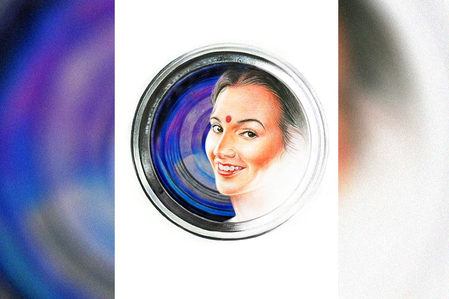

 
 <h1 align=center>ছবি</h1>
<h2 align=center>অন্বেষা রায়</h2> মণিমার ছবি তোলার একটা আলাদা উৎসাহ ছিল। ক্যামেরার সামনে এলে মণিমা নিজের ছবি তোলাবেই তোলাবে। ক্যামেরার লেন্সের দিকে মুখের ডান দিকখানি সামান্য ফিরিয়ে, ঠোঁটে হালকা বা কখনও ঝকঝকে হাসি সাজিয়ে একখানা একক ছবি।

তখন ডিজিটাল ক্যামেরা ছিল না। হাতে হাতে মোবাইল স্বপ্নেরও বাইরে। ভরসা বলতে বাক্সবন্দি ছবি তোলার যন্ত্র।

মণিমা আমার ছোটবেলার বন্ধু সুজনের বড় জেঠিমা। জেঠুর দ্বিতীয় পক্ষ। সুজনরা আর আমরা প্রতিবেশী হলেও সম্পর্ক ছিল একেবারে নিজের লোকের মতো। মণিমা যখন প্রথম ও বাড়িতে পা রাখেন, তখন স্বাধীনতার বয়স দশ বছর। আলতা মেশানো দুধে রাঙা পা ডুবিয়ে ঘরে পা রেখেছিলেন মণিমা। পাশে টোপর মাথায় দাঁড়িয়ে থাকা সারা পাড়ার সর্বজনীন জেঠামশাই। রাশভারী শিক্ষক। বিয়ের মতো রঙিন, তরুণ ঘটনা তাঁর ইমেজের সঙ্গে বড়ই বেমানান।

আমাদের বয়স তখন আট কি নয়। মণিমা ঘরে ঢোকার সময় মা, কাকিমাদের ভিড় ঠেলে আমরা উঁকি দিয়েছিলাম নতুন বৌ দেখার উৎসাহে। ছিপছিপে, ফর্সা দোহারা গড়ন। ঘাড়ের ওপর বেলফুলের মালা জড়ানো বিরাট খোঁপা। পাতলা, সরু নাকের দু’পাশে চোখ। পদ্মদিঘির ঘাটে বাঁধা হারান মাঝির নৌকোয় আঁকা চোখের মতো। তবে নৌকোর চোখের মতো ধমক নয়, বরং বেশ কৌতুকভরা ছিল মণিমার দৃষ্টি।

বিয়ের রাতে শিবেনদা ওর বাক্স-ক্যামেরা নিয়ে এসেছিল ছবি তুলতে। বর-বৌকে মাঝখানে রেখে, পারিবারিক ছবি তুলে দিয়েছিল। হলদেটে হয়ে আসা সাদা-কালো সে ছবিতে সকলের হাসিমুখের মাঝখানে মণিমার পাশ ফেরানো মুখ আজও একেবারে অন্য রকম লাগে। নববধূসুলভ লজ্জা মুহূর্তের জন্য সরিয়ে, চোখের সেই সপ্রতিভ লাস্যময়তা আমাকে ওই বয়সেও চমৎকৃত করেছিল। তাক লেগেছিল অনেকেরই। মায়েদের কারও মুখে শুনেছিলাম, “নতুন বৌ একেবারে চোখেমুখে কথা কয়। অনাথ, জন্মদুঃখী দেখে মনে হয় নাকো।”

“তা এ সব করে যদি সন্ন্যাসীর ধ্যান ভাঙে তো ভাল। একটা আধটা বাচ্চা আসলেই শান্তি...” ফুট কেটেছিল অন্য কেউ।

সুজনরা পাঁচ ভাই দুই বোন হলেও ওদের জেঠামশাইয়ের ঘরে ছেলেমেয়ে ছিল না। বড় জেঠিমা মারা যাওয়ার পর তাই ঠাকুমা তড়িঘড়ি কমবয়সি দ্বিতীয় বধূটি জোগাড় করে এনেছিলেন। তবু নিজের কুড়ি বছরের বিবাহিত জীবনে সন্তানের মুখ দেখতে পায়নি মণিমা।

*****

শিবেনদার চোখ ছিল টান টান। ভিড়ের মধ্য থেকে যা কিছু সুন্দর, তাকে চিনে নিতে পারত ঠিক। সাদা-কালো পারিবারিক ছবিটা দেখে সে বলেছিল, “তোমাদের জেঠাইমার মুখখানা বেশ ফোটোজেনিক।”

শিবেনদার সেই আনমনে বলা কথা ক’খানা আমি অতি সাবধানে, সকলের কান এড়িয়ে রেখেছিলাম যথাস্থানে। নতুন বৌ মুচকি হেসে বলেছিল, “তোমরা আমাকে জেঠাইমা বলে ডাকো কেন? মণিমা বলে ডাকবে।”

মণিমার সঙ্গে আমার আর সুজনের বন্ধুত্ব সেই থেকে। শিবেনদার স্টুডিয়ো ঝাড়পোঁছ সাফ সাফাইয়ের বিনিময়ে মণিমার একক ছবি আদায় করেছিলাম আমরা। গ্রুপ ফোটো থেকে বাকিদের বাদ দিয়ে, কী কায়দায় কে জানে শিবেনদা ছবিটা করে দিয়েছিল। মণিমার চোখ ঝকমক করে উঠেছিল ছবিটা দেখে।

অনেক বার দেখার পর ঘোরলাগা গলায় বলেছিল, “শোনো, আমি মারা গেলে, এই ছবিটা দেওয়ালে টাঙাতে বলবে সকলকে। আর এটাও জানিয়ে দেবে, কেউ যেন আমার ছবিতে মালা না পরায়। মালায় অর্ধেক ছবিই ঢেকে যাবে। তার পর মালা শুকিয়ে কেলেকুষ্টি হয়ে গেলেও বদলানোর কথা খেয়াল থাকবে না কারও।”

কথাটা শুনে খারাপ লেগেছিল খুব। তবু জিজ্ঞেস করতে পারিনি, কেন হঠাৎ মারা যাওয়ার কথা বলছে মণিমা।

*****

সুজনের বড়দা লেখাপড়া করতে গিয়েছিল দেশের বাইরে। ফেরার সময় বিদেশিনি বৌ আর আধুনিক ক্যামেরা হাতে ফিরেছিল। মণিমা তত দিনে জাঁকিয়ে বসেছে সংসারে। পরিবারের বড় বৌ বলে কথা। তবু ‘গিন্নি’ শব্দটা যেন মানুষটাকে মানাত না। ছিপছিপে, ফর্সা দোহারা গড়ন, পাতলা নাক, বড় বড় চোখ...

বড়দা সম্পর্কে আর বয়সে ছোট বলেই হয়তো একক ছবি তোলার কথা তাকে সরাসরি বলতে পেরেছিল মণিমা। সেই প্রথম, সকলের চোখের সামনে, বাগানে, সারি সারি ফুটে থাকা চন্দ্রমল্লিকার মাঝখানে লেবুরঙা ঢাকাই পরে এসে দাঁড়িয়েছিল মণিমা। বয়সোচিত মেদ আর পরিণতমনস্কতা মণিমার সৌন্দর্যকে অনেকখানি বাড়িয়ে দিয়েছিল। কানের পিছনে, ঘাড়ের উপর বসে থাকা বিরাট খোঁপাটা যেন শিকারি প্যান্থার।

বাড়িতে হইহই পড়ে গিয়েছিল। ছিছিক্কারে কান পাতা দায়। স্বামী রোগে শয্যাশায়ী আর স্ত্রী কি না...

কুৎসিত ইঙ্গিত একেবারে গায়ে না মেখে প্রতি বারের মতো ছবিগুলো গয়নার বাক্সে তুলে রেখেছিল মণিমা। গুছিয়ে রাখার সময় আমাকে বলেছিল, “যে দিন মরে যাব, এই ছবিগুলোই টাঙিয়ো। মনে থাকে যেন, ফুলের মালা পরাবে না একদম।”

*****

ছেলে হওয়ার পর, হুট করে এক দিন একটা ক্যামেরা কিনেই ফেললাম। সত্তরের দশক। মণিমাদের বাড়ি অনেকখানি ফাঁকা। ঠাকুমা, জেঠামশাই, সুজনের বাবা মারা গিয়েছেন। সুজন ওর বড়দার মতোই দেশের বাইরে থিতু। মণিমা রঙিন শাড়ি ছেড়ে সাদা থান পরলেও চোখ মুখের সেই ঝকঝকে সপ্রতিভতা ম্লান হতে দেয়নি এতটুকু।

আমি ক্যামেরা কেনায় পৃথিবীতে সবচেয়ে খুশি মণিমাকেই মনে হয়েছিল। প্রচুর ছবি তুলেছিলাম। মহিলাদের গ্রুপ ফোটো, ছেলে কোলে ঠাকুমাদলের ছবি, স্বামী-স্ত্রী জোড়ায় জোড়ায় ছবি, মণিমার কোলে আমার ছেলেকে বসিয়েও একখানা শট নিয়েছিলাম।

ছবি তোলা শেষ হলে সবাই যখন ফিরে যাচ্ছে যে যার ঘরে, মণিমা এসে দাঁড়িয়েছিল আমার কাছে। হারান মাঝির নৌকোয় আঁকা চোখদু’টিতে কৌতুক। বলেছিলাম, “মণিমা, চলো তোমার একখানা সিঙ্গল তুলে দিই।”

সাদা থানে, চক মিলানো মেঝের উপর দাঁড়ানো মূর্তিটা একেবারে অন্য রকম। মুখের ডান পাশ ক্যামেরার দিকে ফেরানো। ঘাড়ের উপর লুটিয়ে থাকা মাঝারি মাপের খোঁপাটা যেন পোষ-মানা বেড়াল। ভুরুর নীচে শান্ত সুখ। কিংবা আবছা দুঃখ।

ছবিটার দিকে অনেক ক্ষণ তাকিয়ে থেকে মণিমা বলেছিল, “আমি মারা গেলে এই ছবিটাই টাঙিয়ো পরিমল। আর দেখো, মালা পরিয়ো না যেন।”

রঙিন ছবির যুগে এক পুজোয় আমরা মণিমাকে তুঁতেপেড়ে সাদা তাঁতের শাড়ি উপহার দিলাম। আমাদের পৈতৃক বাড়ি তত দিনে ফ্ল্যাট হয়ে গেছে। গৃহপ্রবেশের দিন, এক থালা ফুল হাতে, সেই তুঁতেপাড় সাদা শাড়ি পরে এসে লেন্সের সামনে দাঁড়িয়েছিল মণিমা। চোখের শান্তি গাঢ়। কানের পিছনে, ঘাড়ের উপর বসে থাকা বুনো খরগোশ।

প্রথম একক রঙিন ছবি তুলেছিলাম মণিমার। অ্যাপার্চার, শাটার স্পিড আমি ঠিক করে দিলেও শাটার টিপেছিল আমার ছেলে। বাপের শখ তত দিনে ছেলের মনেও শেকড় ছড়িয়েছে। রঙিন ছবি দেখে মণিমা আবারও ওই একই কথা বলেছিল। মৃত্যুর পর দেওয়ালে টাঙানো আর মালা না দেওয়ার নির্দেশ। প্রতি বার একক ছবি তোলা হলে একই কথা। আমিও জানি না কোন বোধে বা অভিমানে মণিমার বলা কথাগুলোর প্রতিবাদ করতে পারতাম না। মণিমাকে কাঁদতে দেখিনি কখনও। নিজের ছবি দেখতে দেখতে বলা কথাগুলো মণিমার কান্না বলে মনে হত। আমি সেই সম্ভ্রান্ত কান্নার সম্মানে মৌন থাকতাম। 

*****

সুজনের মৃতদেহ দেশে এসেছিল কফিনে। ওর মা তখন জীবিত। ছেলের মৃত্যুশোক সামলাতে পারেননি কাকিমা। মণিমাও কেমন স্থির চোখে তাকিয়েছিল আকাশের দিকে। মাত্র এক মাসের মধ্যেই বিদায় নিয়েছিলেন সুজনের মা। মণিমা তখন গোটা বাড়িতে প্রায় একা। সুজনের খুড়তুতো ভাইবোনেরাও চাকরি বা বিবাহসূত্রে বাইরে। প্রাসাদের মতো বাড়িটার দেওয়ালে দেওয়ালে মৃত মানুষের ছবি টাঙানো থাকত। সে সব ছবির সামনে দিয়ে চলাফেরা করতেন সাদা থান পরা মানুষটা। গয়নার বাক্সটা খুব ভর্তি কোনও কালেই ছিল না, বাড়ির সঙ্গে তাল রেখে আরও ফাঁকা হচ্ছিল দিনে দিনে। শুধু নীচের চওড়া খাপে একটার পর একটা একক ছবি জমা হচ্ছিল নিঃশব্দে।   

আমার ছেলে প্রথম চাকরির টাকায় শখ করে দামি ক্যামেরা কিনল। ডিএসএলআর। মণিমা কিছু বলেনি, আমিই বলেছিলাম একটা একক ছবি তুলে দেওয়ার কথা। শেওলা-পড়া চাতালের এক পাশে, ফলবতী উচ্ছে গাছের সামনে, সোনালি রোদের মধ্যে এসে দাঁড়িয়েছিল মণিমা। হারান মাঝির নৌকোয় আঁকা চোখে অভিজ্ঞতার সমৃদ্ধি। ঘাড়ের কাছে, কানের পিছনে জড়সড় হয়ে বসে আছে এক বৃদ্ধ ও প্রাজ্ঞ সাদা পেঁচা।

ভারী চমৎকার ছবি তুলেছিল বাবান। মণিমা ছবিটা দেখতে দেখতে ইঙ্গিতপূর্ণ দৃষ্টিতে তাকিয়েছিল আমার দিকে। হাতের ইশারায় মালা দেখিয়ে মাথা নেড়েছিলেন দু’দিকে। আমিও হাত তুলে আশ্বস্ত করেছিলাম।

সুজনদের বাড়িটাকে বিক্রি করে দেওয়াই সমীচীন, সে কথা এক বাক্যে সকলেই মেনে নিয়েছিল। শুধু মণিমার অস্তিত্ব প্রকট আপত্তি হয়ে দাঁড়িয়েছিল ভাবনা আর সিদ্ধান্তের মাঝখানে। পরিবারের সদস্য বলতে তখন সুজনের দুই খুড়তুতো দাদা আর বোন। সেটাও বছর দশেক আগেকার কথা। আমি সদ্য সদ্য অবসর নিয়েছি। ছেলে ভিন্‌ শহরের বাসিন্দা। মণিমা তখনও চলে ফিরে বেড়াত। এখনকার মতো শয্যা নেয়নি।

হাসপাতালে, যখন ছেলের পাঠানো স্মার্টফোনটা দেখালাম, তাঁর মধ্যে ক্যামেরা দেখে অবাক হয়ে তাকাল মণিমা। অনাবিল হাসি, মেঘের আড়াল থেকে উঁকি দেওয়া আলোর মতো ভেসে উঠল মুখে। আমার দিকে মুখের ডান পাশ ফিরিয়ে তাকাল মণিমা। বুকের ভিতরটা মুচড়ে উঠল। হারান মাঝির নৌকোয় আঁকা চোখ মুছে গিয়েছে ঢেউয়ে। শুধু দৃষ্টিটুকু পড়ে আছে ফেলে রাখা দড়ির মতো। কানের পিছনে, ঘাড়ের উপর অদৃশ্য হয়েছে প্যান্থার, বেড়াল, খরগোশ আর প্রাজ্ঞ পেঁচা। তাদের চলে যাওয়ার আভাসটুকু রয়ে গিয়েছে। আমি অনভ্যস্ত হাত ছোঁয়ালাম লাল বৃত্তে। খ্যাচাক শব্দ হল। মণিমা কিছু বলবে বলে ঠোঁট নাড়ল। শুনতে পেলাম না। শোনার দরকারও নেই। সেই তো এক অনুরোধ। কে-ই বা টাঙাবে মণিমার ছবি! বয়সে বড় এবং ছোট, সমবয়সি বা সমকালীন যারা ছিলেন, তাঁরা সকলেই চলে গিয়েছেন। কোথায় টাঙানো হবে ছবি? হাসপাতালে ভর্তি হওয়ামাত্র বাড়ি বিক্রির জন্য উঠেপড়ে লেগেছে সকলে। নব্বইয়ের কাছাকাছি বয়স মণিমার। হাসপাতাল থেকে ফিরবে না, সেটাই ধরে নিয়েছে। নার্সের গলায় হুঁশ ফিরতেই চমকে উঠি। মণিমা একই ভঙ্গিতে স্থির হয়ে আছে। কত ক্ষণ কে জানে।

*****

মণিমার খালি গয়নার বাক্সটা আমাকে দিতে আপত্তি করেনি কেউ। নীচের চওড়া খাপ থেকে পাওয়া সাদা-কালো, রঙিন অসংখ্য ছবি আমি চোখের সামনে মেলে বসেছিলাম গোটা দুপুর। কানে বাজছিল মণিমার চেনা স্বর, “যে দিন মরে যাব, এই ছবিগুলোই টাঙিয়ো। আর মনে থাকে যেন ফুলের মালা পরাবে না একদম।”

কত ক্ষণ বসেছিলাম কে জানে, নাতনির ডাকে মুখ তুলে দেখি, বাইরে সন্ধে নামছে। নাতনি ছবিগুলো হাতে তুলে নিল। অবাক গলায় বলল, “মণিঠাম্মা? কী সুন্দর দেখতে ছিল গো! আমাকে ছবিগুলো দেবে?”

আমি মাথা নাড়লাম। কী-ই বা করব ছবিগুলো রেখে? এ ছবি টাঙাবে কে? এ ছবি টাঙানোর মতো দেওয়াল আর যে নেই।

পরের দিন সকালে নাতনির উত্তেজিত ডাকে ঘুম ভাঙল।

“দাদাই ওঠো, ওঠো, দেখো। আমার ভিডিয়ো ভাইরাল হয়েছে।”

কোনও রকমে চোখে চশমা এঁটে ওর মোবাইলের দিকে তাকাই। সেখানে একের পর এক ফুটে উঠছে মণিমার ছবি। কনের সাজ, ঢাকাই সাজ, থান, তুঁতেপেড়ে সাদা শাড়ি... হাসপাতালের বিছানায় শেষ ছবি। অবাক চোখে দেখি মণিমার গোটা জীবনটাকে কেমন দশ সেকেন্ডে বেঁধে ফেলেছে মেয়েটা। শুধু কি মণিমা, এ যে আমাদের সকলের জীবনের ছবি। যৌবন ঢলে যাওয়ার চিরাচরিত নিয়ম। উত্তেজিত গলায় নাতনি চিৎকার করেই যাচ্ছে, “সোশ্যাল মিডিয়ায় সকলের দেওয়ালে দেওয়ালে এই ভিডিয়ো ঘুরছে দাদাই। মণিঠাম্মা ফেমাস এখন।”

হারান মাঝির ভেসে যাওয়া নৌকো থেকে ভেসে আসে আবছা কণ্ঠস্বর, “যে দিন মরে যাব, এই ছবিগুলোই দেওয়ালে টাঙিয়ো। আর মনে থাকে যেন, ফুলের মালা পরাবে না একদম।”