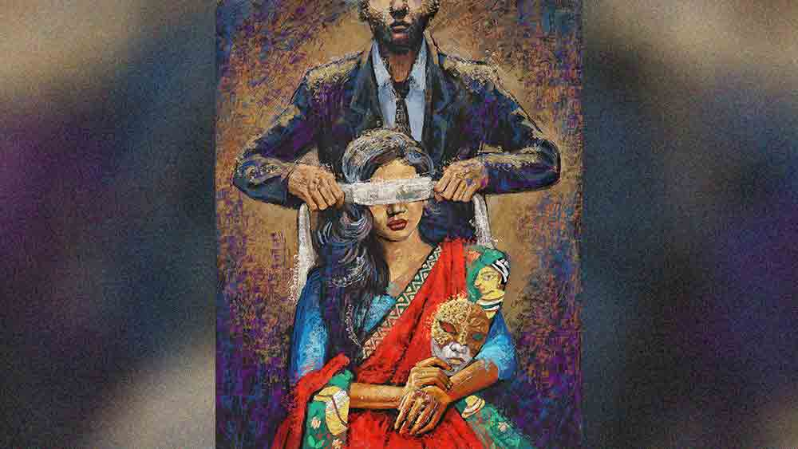

 

<h1 align=center>ছলনা</h1>
<h2 align=center>সীমা জানা</h2>
শোক, শোচনা, শঙ্কা সব মিলিয়ে রাহীর খুব করুণ অবস্থা। মঙ্কুও বাকহীন পুতুল। বাবার কথা জিজ্ঞেস করছে না পর্যন্ত। সিলিং থেকে ঝোলা চিত্রক আর আত্মঘাতী শব্দটার মধ্যে একটা সুতো আবিষ্কার করতে চাইছে ও। পারছে না! রাহীর মা বাবা এসেছিলেন সপ্তাহখানেকের জন্য। কিন্তু এখন শুধু ওরা দু’জন আর চিত্রকের স্মৃতি।   ফ্ল্যাটে রাহীরা তিন জনেই থাকত। শ্বশুর-শাশুড়ির সঙ্গে সম্পর্ক ভাল নয়। অবশ্য সেখানে রাহী পরোক্ষ। পুরোটাই চিত্রক আর তার দিদির টাকা-পয়সার টানাপড়েন। বিয়ের পর রাহী দু’-এক বার গেছে শ্বশুরবাড়ি। চিত্রকও তেমন একটা যেত না। বাবা-মায়ের সঙ্গে সম্পর্ক বলতে কদাচিৎ এক-আধ বার ফোন। গত ডিসেম্বরে বাবা মারা যাওয়ার পর অবশ্য চিত্রক দু’-এক বার মায়ের কাছে গেছে, কিন্তু সম্পর্কের ক্ষয় কাটিয়ে উঠতে পারেনি। ওর একমাত্র দিদি মাকে কলকাতায় নিজের কাছে এনে রেখেছে। এক শহরে থেকেও ওদের মধ্যে মেরুর দূরত্ব।   মঙ্কু ঘুমোচ্ছে। বালিশে মাথা দিয়ে এ পাশ-ও পাশ করছিল রাহী। মোবাইল টিপে সময় দেখল। দুটো বাইশ। এসি চলছে। তবু গত দশ দিনে এক মুহূর্তের জন্যও তার ঘাম শুকোয়নি। খুব একা লাগছে। পারবে সারা জীবন এই নিঃসঙ্গতার ভার বয়ে বেড়াতে! পরশু ও জয়েন করবে। কোলিগদের চাটনির ফোড়ন হবে। ভালবাসা ফুরিয়ে যাওয়া একটা সম্পর্ক প্রতি মুহূর্তে কাঁটা হয়ে বিঁধবে তাকে। রাহুলের সঙ্গে এক বার কথা বলতে খুব ইচ্ছে করছে। কিন্তু রাহুলের বারণ। পুলিশি হুজ্জোতি এড়াতে এ ছাড়া পথও নেই। রাহীর বিশ্বাস, রাহুলই পারবে তার এই শূন্যতা মুছে দিতে। রাহুলের হাত ধরে এ তুমুল ঢেউ পার হতে চায় ও।   মঙ্কু দশ দিন হাসেনি। মৃত্যু সম্পর্কে একটা ধারণা ওর হয়ে গেছে। কিন্তু চিত্রককে ও যে অবস্থায় দেখেছে, তাতে জীবন সম্পর্কেও একটা ভয়াবহতা তৈরি হয়েছে। এখন একটু বেশি সময় দিয়ে, ওর মন থেকে যাবতীয় ভয় মুছে ওকে সহজ করে তোলা দরকার। রাহী স্বাভাবিক হওয়ার চেষ্টা করে। ভগবানের কাছে প্রার্থনা করে যেন ব্যাপারটা দ্রুত মিটে যায়। চিত্রা রাহীর এগেনস্টে কেস করেনি। কিন্তু ভাইয়ের মৃত্যুর তদন্ত চেয়ে থানায় আবেদন করেছে। পুলিশ তদন্তের স্বার্থে ওকে কিছু দিন শহরের বাইরে যেতে বারণ করেছে। রাহুলের সঙ্গে ওর সম্পর্কের ভার্চুয়াল প্রমাণ তেমন নেই, তবুও ভয় করছে। যদি কোনও ভাবে ধরা পড়ে যায়!   “ক’দিনে এ কী অবস্থা হয়েছে রাহী? চোখ বসে গেছে, মুখ শুকিয়ে গেছে, সারা শরীর ঝলসে গেছে একেবারে!” রাহী আজ রাহুলের অফিসে এসেছে, দেখা করতে।   “আর পারছিলাম না রাহুল। খুব একা লাগছিল...” কথাগুলো বলতে বলতে কান্নায় ভেঙে পড়ে রাহী। রাহুল ফিসফিস করে বলে, “প্লিজ় সোনা, এ রকম কোরো না। সবাই দেখছে। কেন কাঁদছ? আমি আছি না? ক’টা দিন যেতে দাও, পরিস্থিতি থিতিয়ে আসুক, সব ঠিক হয়ে যাবে।”   “কিচ্ছু ঠিক হবে না।”   “ভরসা রাখো আমার ওপর। আমরা আবার আগের মতো সময় কাটাব। শুধু একটু ধৈর্য ধর।”   “তুমি থাকবে তো আমার সঙ্গে?”   “এ দিকের কেসটা মিটে যেতে দাও।”   “তুমি যে বলেছিলে মাসখানেকের মধ্যে সব মিটে যাবে?”   “হিয়ারিংয়ের দিন ও আসেনি।”   রাহুলের ডিভোর্সের কেস চলছে। কাগজে বিজ্ঞাপন দেখে বিয়ে হয়েছিল ওদের। মাসদুয়েক এক সঙ্গে ছিল ওরা। তার পর হঠাৎ এক দিন অজন্তা পুরনো প্রেমিকের সঙ্গে পালিয়ে যায়। এক বছরের মাথায় আসে ক্ষমা চাইতে। এত সবের পরেও রাহুল ওকে বুঝিয়েছিল, ভেঙে ফেললে কিন্তু আর কোনও অপশনই হাতে থাকবে না। বলেছিল, “হয়তো এ ভাবেও চলতে চলতে এক দিন আমরা পরস্পরকে ভালবেসে ফেলব।”   অজন্তা নাছোড়। তারও বছরদুয়েক পর বাধ্য হয়ে রাহুল ডিভোর্স চায়। অজন্তা বেঁকে বসে। আসলে তত দিনে ও বাবা-মায়ের কাছে ফিরে এসেছে। কিন্তু হিয়ারিংয়ের গত দুটো ডেট ও অ্যাবসেন্ট। অজন্তার ব্যাপারে কিছুই রাহীর থেকে লুকোয়নি রাহুল। আজ ওকে শক্ত করে জড়িয়ে ধরে বাঁচতে চাইছে রাহী। সে ইচ্ছে রাহুলেরও। মুঠোর ভেতর ওর হাতটা ভরে নেয়। বলে, “লাইফ একটা লং ড্রাইভ, রাহী। চলার পথও সব সময় এক রকম থাকে না। কখনও টিলা, তো কখনও খাদ। বাঁচতে জানাটাই হল আসল কথা। সেই প্রপার এডুকেশন যার আছে, সে ঠিক চড়াই-উতরাই পেরিয়ে এগিয়ে যেতে পারবে। নিজেকে কখনও পরিস্থিতির কাছে অসহায় হতে দিয়ো না। তা হলে, মঙ্কুকে বড় করবে কী করে?”   মঙ্কু খেলছে। হাসছে। সুতপা হাত-পা নেড়ে ম্যাজিক দেখাচ্ছে। ওকে প্রায় বছরখানেক সামলাচ্ছে সুতপা। মেয়েটা আনম্যারেড, অথচ কী সুন্দর বাচ্চা সামলায়! এ বাড়িতে গত পনেরো দিনের ব্যতিক্রম বলতে সুতপা। সুতপার মনে কষ্ট থাকলেও শোক নেই, তাই ওর সঙ্গে সহজ হতে পেরেছে মঙ্কু। যেন আর সবার ভেতর থেকে মুছে গিয়ে চিত্রক শুধু রাহীর ভেতরেই রয়ে গেছে।   কিন্তু সত্যিই কি পেরেছে ও নিজেকে মুছে ফেলতে? সেই উদ্দাম ভালবাসা, ঘোরাঘুরি, বিয়ে, বিয়ের পর আবেশ মাখানো দিন-রাত সব শেষ? চিত্রকের ওপর যে পাহাড়প্রমাণ অভিমান জমে আছে, তার ভেতরে কোথাও ভালবাসা নেই! চিত্রকের বদলে যাওয়াটা ঠিক দুঃস্বপ্নের মতো মনে হয়।   ফ্ল্যাট কেনার পরের কথা। রাহী তখন পাঁচ মাসের প্রেগন্যান্ট। যে ভাবে প্রমোশন হবে ভেবেছিল চিত্রক, হয়নি। লোনের চাপ, অন্য দিকে রাহীর পেছনে খরচ। মঙ্কু হল। খরচ বাড়তে শুরু করল। নিজেকে গুটিয়ে নিল ও। বাড়ি ফিরেই কম্পিউটার খুলে বসে যেত। শেয়ার মার্কেট, অনলাইন জুয়া। সারাক্ষণ শুধু টাকা আর টাকা! অথচ ওদের সংসারে তেমন অভাব ছিল না। তবুও ঘোর থেকে বেরোতে পারেনি চিত্রক। ওর ভেতরের সেই ইনোসেন্ট ছেলেটা একটু একটু করে যেন ভ্যানিশ হয়ে গেল। সেই নিঃসঙ্গ সময়ে রাহুলের সঙ্গে আলাপ হয়েছিল রাহীর। রাহুলকে ভালবেসে ফেলল ও।   তবুও চিত্রকের জন্য কোথাও একটা টান থেকে গিয়েছিল মনে মনে। চিত্রকের জীবনে দ্বিতীয় কোনও নারী ছিল না। অফিস ছুটির পরে কোথাও যেত না। অফিস ট্যুরেও নয়। কিন্তু টাকার প্রতি ওই মোহ, নারীর চেয়ে কমই বা কোথায়? কেউ না জানুক, রাহী জানে শেয়ার বাজারের এই হঠাৎ ধস আর চিত্রকের মৃত্যুর মধ্যে সম্পর্ক কোথায় ।   অনেক দিনের কাজ পড়ে আছে। ফাইলগুলো মন দিয়ে দেখছিল রাহী। কাজে মন দিতে পেরে হালকা লাগছে ওর। হঠাৎ মোবাইলটা টুংটাং করে উঠল। রাহুলের মেসেজ। আজ এক বার দেখা করতে চায়। ওর ফ্ল্যাটে। আর্জেন্ট। মনে মনে হাসল রাহী। এই আর্জেন্সি সে-ও চাইছিল! তার প্রিয় টেক্সট। হৃদ্‌যন্ত্রটা আজ একটু বেশিই লাফাচ্ছে। কয়েক মিনিটের মধ্যে বেরিয়ে পড়ল ও।   “একটা কথা বলব বলে তোমায় ডেকেছি রাহী। জানি কষ্ট পাবে। এই মুহূর্তে কথাগুলো শুনে তোমার নিজেকে ইনসিকিয়োর্ড মনে হবে। তবু এ কথাগুলো একটা মুহূর্তের জন্যও গোপন করা অন্যায়,” ভূমিকা না করেই কথাগুলো বলল রাহুল।   রাহী বুঝতে পারে সিরিয়াস কিছু। সে ভীরু ও জিজ্ঞাসু চোখে রাহুলের দিকে তাকায়। রাহুল শান্তস্বরে বলে, “আজ সকালে অজন্তা ফোন করেছিল। ও নিজের ভুল বুঝতে পেরেছে। কেসটা উইথড্র করার জন্য রিকোয়েস্ট করছে। আবার এখানে ফিরতে চাইছে।”   “তুমি কী বললে?”   “অজন্তা খুব অসহায় রাহী। এই মেন্টাল সাপোর্টটা না পেলে আরও বড়সড় কোনও ভুল করে ফেলবে।”   “আর আমি?”   “আমরা একই বাড়িতে হয়তো থাকতে পারব না, কিন্তু তুমি যখন চাইবে, আমাকে পাশে পাবে রাহী।”   পাথরের মতো স্থির হয়ে বসেছিল রাহী। হাতের পাতার ওপর রাহুলের হাতটা কোল্ড কফির মতো মনে হচ্ছিল, আঙুল বেয়ে যা ছড়িয়ে পড়েছিল শরীরের সব কোণে। রাহী অনুভব করছিল তার চার পাশের পৃথিবীটা ক্রমশ শীতল হয়ে আসছে। বরফের মতো কঠিন।   ঝড়ের ধকল শরীর বইতে পারছে না। সব ভুলে কী ভাবে নতুন করে শুরু করবে রাহী! পেরিয়ে আসা সময় তাকে ঝাঁঝরা করে দিয়েছে। এখান থেকে বেরোতে না পারলে মঙ্কুর যাত্রাপথ মাঝখানে হারিয়ে যাবে! আজ অফিসে যেতে মন চাইছে না। মঙ্কুকে পুল কারে তুলে দিয়েছে। বিছানায় শরীর এলিয়ে দিল রাহী। ঠিক তখনই ফোনটা বেজে উঠল। স্ক্রিনের দিকে তাকিয়ে বুকের ভেতরটা ধড়াস করে উঠল তার। চিত্রক! হ্যালো বলার শক্তি হারিয়ে ফেলেছে ও। ফোনটা কেটে গিয়ে আবার বাজছে। সবুজ বাটনটা টেনে কানে রাখতেই একটা ভারী গলা কথা বলে উঠল, “গুড মর্নিং ম্যাডাম, থানা থেকে বলছি। আপনার হাজ়ব্যান্ডের সিমটা ইনভেস্টিগেশনের জন্য কন্টিনিউ করা ছিল, তাই ওটা থেকেই কল করলাম।”   “বলুন।”   “আজ এক বার থানায় আসতে হবে।”   “কখন?”   “আসুন না দুটো-আড়াইটে নাগাদ।”   চিত্রক লাল রং পছন্দ করত। রাহীর জন্য যতগুলো ড্রেস কিনেছিল, তার সবগুলোতেই লালের ছোঁয়া আছে। অনেক দিন ওর পছন্দের তোয়াক্কা করেনি রাহী। আজ একটা গাঢ় লাল রঙের সিল্ক পরল। সে যেন আজ নতুন করে চিত্রকের সঙ্গে দেখা করতে যাচ্ছে।   দুটোর মধ্যেই পৌঁছে গিয়েছিল রাহী। গার্ড ওকে ভেতরে নিয়ে গেল। অফিসারের সামনে দুটো চেয়ারে চিত্রকের মা ও দিদি। রাহীকেও উনি ইশারায় বসতে বললেন।   “আপনার মনের অবস্থা বুঝতে পারছি ম্যাডাম। এই টপিকটা থেকে বেরোতে না পারলে আপনার বেঁচে থাকাটা ডিফিকাল্ট হয়ে যাবে। কী করব বলুন! এগুলো আমাদের করতেই হয়।”   রাহীর মনে হল বেঁচে থাকা কথাটা উনি ব্যঙ্গ করে বলছেন। অর্থাৎ তার আর রাহুলের সম্পর্কটা ওরা আবিষ্কার করে ফেলেছে। কী বলবে সে? রাহুল তার অতীত? চিত্রকের চেয়েও নিষ্ঠুর অতীত?   “আপনাকে কয়েকটা কথা জানানোর জন্য এখানে ডাকা। কেসটা ক্লোজ করা হচ্ছে। তাই ওঁদেরও আসতে বলেছি,” বলে চিত্রকের মা দিদির দিকে তাকালেন উনি।   তিন জনকে দেখে নিয়ে অফিসার বলেন, “দেখুন ম্যাডাম, ডাক্তার, পুলিশ আর উকিলকে মিথ্যে বলতে নেই। সত্যি বলুন তো আপনার সঙ্গে আপনার হাজ়ব্যান্ডের সম্পর্ক ঠিক কেমন ছিল?”   রাহী বুঝল, ও ধরা পড়ে গেছে। পালানোর রাস্তা নেই। তবুও নিজেকে বাঁচানোর মরিয়া চেষ্টা করল, “আর পাঁচ জন স্বামী-স্ত্রীর মতো। কিন্তু লোনের প্রেশার ওকে আস্তে আস্তে করে নিষ্ঠুর করে তুলেছিল।”   “কোনও মেয়ে বন্ধুটন্ধু ছিল কি না, জানেন?” গলায় রহস্যকৌতুক মাখিয়ে জিজ্ঞেস করলেন অফিসার।   “একেবারেই না। অফিস ছুটির পর সোজা বাড়ি আসত ও। ফেসবুক-টেসবুক করত না। মোবাইলটাও পড়ে থাকত ওপেন জায়গায়।”   “আমদের তথ্য কিন্তু অন্য কথা বলছে ম্যাডাম। লোনের চাপ ছিল, তবে ততটা নয়। এমনকি, ওঁর স্যালারি আপনি যা জানেন তার চেয়ে অনেক বেশি। আর শেয়ার মার্কেট-ফার্কেট সব বাজে কথা। ওঁর এ লাইনে কোনও ইনভেস্টমেন্টই নেই। বাড়ি ফিরে উনি শেয়ারের নাম করে ওই মহিলার সঙ্গে চ্যাট করতেন। সাক্ষাৎ-টাক্ষাতও হয়েছে। মহিলা সবটা স্বীকার করে নিয়েছেন।”   “তা হলে এ ভাবে সুইসাইড করল কেন?” চিত্রা প্রশ্ন করল।   “ইল্লিগ্যাল রসদ কত দিন ভাল লাগে বলুন? মেয়ে বড় হচ্ছে, বৌয়ের কাছে ধরা পড়ার ভয়ও আছে। তা ছাড়া এ সব ক্ষেত্রে চার্মও খুব বেশি দিন থাকে না। দু’চার বার মধু পান করলেই মোহ কেটে যায়। সেটাও অবসাদগ্রস্ত হওয়ার একটা কারণ। মেয়েটিও টাকার জন্য বড্ড বেশি রকমের চাপ দিচ্ছিল। ব্ল্যাকমেলের ভয় দেখাচ্ছিল,” তার পর রাহীর দিকে তাকিয়ে বললেন, “আপনাকে শুধু শুধু কিছু দিন শহরবন্দি হয়ে থাকতে হল। নিজেকে অপরাধী ভাববেন না ম্যাডাম। দু’নৌকোয় পা দিয়ে চলতে চাইলে দুটোই ফসকাবে, এটাই 
তো স্বাভাবিক।”   রাহী উঠে দাঁড়াল। পা জড়িয়ে যাচ্ছিল, তবুও দাঁড়াল। অফিসার বললেন, “ওই মহিলাও আজ থানায় উপস্থিত আছেন। কথা বলবেন?”   রাহী দু’দিকে ঘাড় নাড়ল। নিজেকে আর আয়নার সামনে দাঁড় করাতে ইচ্ছে করছে না। আবার কে যেন ডাকল, তার নাম ধরে। চিত্রকের মা। এক বার দাঁড়াল রাহী। কিন্তু পেছন ফিরল না। বেরিয়ে এল।   বাইরে বেরিয়ে ছাতা খুলল রাহী। পা ফেলেই চমকে উঠল। কেউ এক জন আসছে সঙ্গে। পাশে তাকিয়ে থমকাল আর এক বার। ভাল করে দেখে আবার পা বাড়াল। ওরই পড়ন্ত রোদের ছায়া। এ ছাড়া কী-ই বা অর্জন করতে পেরেছে জীবন! কিন্তু ওটাই আজ তার সব চেয়ে কাছের সঙ্গী। একটু হেলিয়ে ছাতাটা ছায়ার মাথায় রাখল রাহী।   
