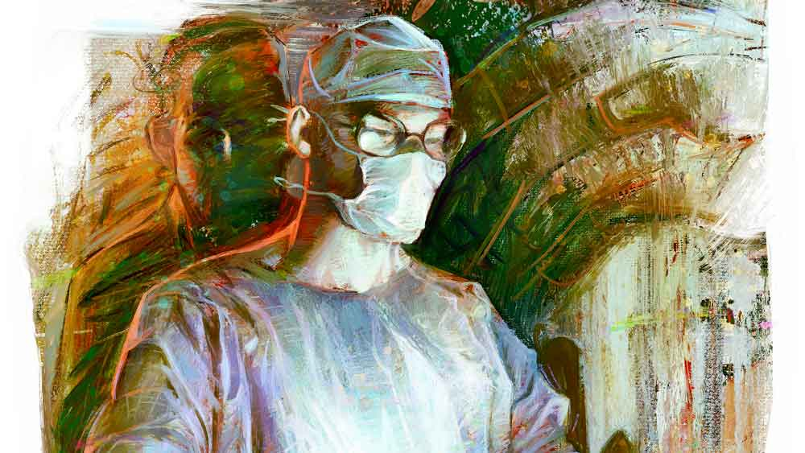

 
 <h1 align=center>ছায়া</h1>
<h2 align=center>সৌভিক সমাদ্দার</h2> ঘরটা আলোকিত নয়, নিশ্ছিদ্র অন্ধকারও নয়। নিস্তব্ধ, আবার শব্দহীন নয়। কিছু মানুষ এখানে নিঃশ্বাসবিহীন হয়েও জীবিত থাকে। ঘরটা যেন পৃথিবী আর অন্তরীক্ষের ঠিক মাঝখানে এক অনন্ত শূন্যতায় নিরালম্ব ভাসমান। সেই ঘরে একটা খোলা পেটের ভিতর রক্তমাখা গ্লাভস-পরিহিত হাত দুটো ঢুকিয়ে জট পাকানো অন্ত্রগুলো ছাড়াতে ছাড়াতে এক জন সার্জেন টের পেল, ও পারের দেওয়ালের গায়ে এক ছায়া কম্পমান। 

প্রথমে চোখের ভুল মনে হলেও খেয়াল করতেই সে বুঝতে পারল যে, সেই ছায়া নিরাকার নয়। তাতে রক্তমাংসের এক মানুষের অবয়ব, কিন্তু হাওয়ার মতো হালকা। তিরতির করে কাঁপছে। মোমবাতির আলোর মতো অন্ধকারে তার দাঁত জ্বলজ্বল করছে। সে তার দিকে তাকিয়ে হাসছে। চোখাচোখি হতেই সে বলে উঠল, “ডাক্তার! খবর কী ভায়া?”

ডাক্তারের মনে পড়ল, আজ বহু ক্ষণ কিছু খাওয়া হয়নি। সকাল ন’টায় ব্রেকফাস্টের পর আউটডোরে প্রায় পাঁচশো পেশেন্টের ভিড় সামলে, ইমার্জেন্সিতে আসতেই দেখে আরও তিনটে কেস অপেক্ষারত। অ্যানাস্থেটিস্টকে ডেকে হাত ধুয়ে এই তিন নম্বর এবং সর্বাধিক খারাপ কেসটা অবধি আসতে আসতে রাত ঘনিয়ে এল। পেট খালি, শরীর ও মস্তিষ্কে গভীর ক্লান্তি। চোখ মেলে তাকিয়ে থাকা দায়। এ রকম অবস্থায় হ্যালুসিনেট করাটা কিছু আশ্চর্যের নয়। তাই সেই কণ্ঠস্বরকে পাত্তা দিল না সে। যদিও সেই বহু চেনা কণ্ঠস্বর শুনলে হাড় হিম হয়ে যাওয়ার কথা।  

“এ রকম ভাবে ইগনোর করবি তা বলে? না হয় মানলাম অনেক বড় ডাক্তার হয়ে গেছিস। কিন্তু প্রথম প্রেমপত্রটা তো আমাকে দিয়েই লিখিয়েছিলি রে ব্যাটা! এখন চিনতেই পারছিস না?” বলে খিলখিল করে হেসে উঠল ছায়াটি।

ডাক্তার ও দিকে তাকিয়ে ভাবল, এ-হেন ‘হ্যালু’কে ইগনোর করা চলে না। খানিক এনগেজড হলে বরং ঘুমটাও দূরে থাকবে। সে উত্তর দিল, “এ রকম হুট করে কেউ ওটি-র ভিতর ঢুকে পড়ে? এটা স্টেরাইল জ়োন!”

“ওব্বাবা! শরীর থাকলে তবে না স্টেরাইল? ফালতু বকিস না তো!”

ডাক্তার খেয়াল করল যে, সে বেশ জোরেই উত্তর দিয়ে ফেলেছে। চার দিকটা চেয়ে দেখল যে এক নার্স, অ্যানাস্থেটিস্ট, স্টাফ দাদা এবং অ্যাসিস্ট্যান্ট— কেউই মাস্কের ভিতর দিয়ে কিছু টের পায়নি। হয়তো ভেবেছে সার্জেন একাগ্রতার চরমে এসে পৌঁছে, নিজের মনের ভাবনাগুলো অজান্তে জোরে বলে ফেলেছেন। এমনটা যে হয় না তা নয়।

“ডাক্তার, অত এ দিক-ও দিক তাকিয়ে লাভ নেই। কেউ কিছু টের পাবে না। এখন শুধু তুই আর আমি। আর তোর ওই টেবিলের ওপর জিনিসটার যদি কিছু গতি করতে পারিস আর কী!”

“তুই আর সময় পেলি না? ব্যস্ততা যখন মধ্যগগনে, তখনই তোর মনে পড়ল আমার কথা?”

“উঁহু। তোর কথা আমার মোটেও মনে পড়েনি। আমি এসেছি অন্য কাজে। তোর সঙ্গে দেখা হওয়াটা কাকতালীয়। বরং তুই বলেই দেখাটা দিলাম। না হলে ঘাপটি মেরে অন্ধকারে বসে থাকতাম, তার পর কাজ সেরে পালাতাম!”

কী কাজ? কথাটা বুঝল না ডাক্তার। কতকটা আনমনেই যেন বলল, “অনেক বছর তো হল...”

“যাক! ভাবলাম বুঝি আউট অব সাইট আউট অব মাইন্ডকরে দিয়েছিস।”

“সেটা করতে পারলে তো বেঁচে যেতাম রে ভাই।”

“অ্যাই অ্যাই... উঁহু! আবেগ পরে। যেখানে হাত ঢোকানো ওতে মন দাও। ওর এখনও চান্স আছে।”

চান্স? সম্ভাবনা? হঠাৎ চোখের সামনে ভেসে উঠল সেই দিনটা। সত্যিই কি কিছু করা সম্ভব ছিল না সেই দিন?

দিনটা ছিল মেঘলা। মৃদু বসন্তবাতাস বইছিল বাইরে। ঘুমটাও ভেঙেছিল বেশ দেরিতে। ফোনের ঝঙ্কারে। তার পর থেকেই যেন দুলে উঠেছিল পৃথিবী। চেনা ভূগোল অচেনা লাগছিল। অলিগলি, রাস্তাঘাট সব গুলিয়ে যাচ্ছিল। কী করে হল?

হলুদ রঙের ঘরটায় সিগারেটের গন্ধ তখনও জমাট। সকালে বাসিমুখ থেকেই সিগারেট খেতে না শুরু করলে পেটটা পরিষ্কার হত না ওর। তার পর সারা দিনে অসংখ্য। ওর এই বিছানাটা ফাঁকা দেখতেই তো সে অভ্যস্ত। এত বেলা হয়ে গেল তাও শুয়ে আছে, কেউ ডাকেনি কেন? পর্দাগুলো টানা কেন? ও যে অন্ধকার ভালবাসে না। উফ্...!

“সাতপাঁচ ভাবিস না অত। ভবিতব্যকে কে আটকাতে পারে!” বলে ওঠে ছায়া।

“তা হলে এখনই গ্লাভস খুলে ফেলি?”

“আহ্হা, তা কেন! তুই চেষ্টাটা তো করে যা। তাতে তোর জীবনের অর্থ খুঁজে পাবি।”

“আর যে জীবনটা চলে গেল? তার কৈফিয়ত কে দেবে?”

“সে তো আর নেই রে ভায়া! তবে তুই তো আছিস! যত দিন থাকবি তত দিন এই চেষ্টাটা চালিয়ে যাবি। এ ছাড়া আর আমাদের হাতে আছেটাই বা কী বল? এই ধর তুই। অজ পাড়াগাঁয় এসে মানুষটার পেট খুলেছিস। দেখ আমি লেখাপড়া তেমন করিনি বটে, কিন্তু তোকে তো ভাই চিনি। এত স্ট্রাগল করারতো তোর দরকারই নেই! কিন্তু তা সত্ত্বেও তুই পেশেন্টটাকে টেবিলে তুলেছিস। কেন?”

“কারণ আমার টেবিলে পেশেন্টটার বাঁচা মরার থার্টি-সেভেন্টি চান্স। আর রেফার করে দিলে সেটা সেন্ট পার্সেন্ট ডেথ।” 

“একেবারে ঠিক কথা বন্ধু! মানে হাতে যা আছে, তা দিয়েই চেষ্টা করে যেতে হবে।”

“তুই নেতা হলে বেশ মানাত, বুঝলি? এই ‘কাজ চালিয়ে নিন’ ধরনের কথাবার্তা ওঁরাই সচরাচর বলে থাকেন।”

“হেঃ হেঃ... আমি তো চির-মাতব্বর, কিন্তু তোর কদ্দূর ভাই?” বলে সে খানিকটা এগিয়ে এসে খোলা পেটের ভিতর উঁকি মারল, তার পর নাক সিঁটকে বলল, “ইশ! এ সব কী? হা... মানে পটি না কি?”

“হ্যাঁ। ফিক্যাল ম্যাটার। পেরিটোনিয়াম ভর্তি। অন্ত্র ফুটো হয়ে বেরিয়ে এসেছে। আমি এটাই ভয় পেয়েছিলাম।”

“যা-তা গন্ধ তো রে ভাই।”

“হুম! অবস্থাটাও তাই। আজ আর মিরাকল হওয়া মুশকিল।”

“মানে?”

“মানে এই পেশেন্ট মারা যাবে।”

“সে আশঙ্কার কথাআমি জানতুম।”

“কী করে জানলি? আমি তো এইমাত্র টের পেলাম। তুই ওখান থেকে বসে বসে জেনে গেলি পারফোরেশন হয়েছে?”

“হুঁ হুঁ বাবা। না হলে আমি এখানে এসেছি কেন? তোর সঙ্গে গ্যাঁজাতে? দূর দূর!”

“কী বলছিস, কিছুই বুঝতে পারছি না।”

“দেখ বস! এখন না-হয় প্রমাণ পেলি, কিন্তু তুই পেশেন্টটাকে দেখেই তো সন্দেহ করেছিলি যে খারাপ কেস? তাই না? এটাকে কী বলে?”

“কী বলে?”

“ইনটুইশন।” 

“আজ্ঞে না! একে বলে নলেজ আর এক্সপিরিয়েন্স। এই দুটোর যুগলবন্দিতে একটা রিফ্লেক্স তৈরি হয়। আর সেটা সাবকনশাসে গেঁথে বসে যায়। তাই পেশেন্ট দেখলে বোঝা যায় কে ভাল আর কে খারাপ আছে। পরীক্ষা করালে সাসপিশন কনফার্ম হয়। পাতি বাংলায় বোঝাতে গেলে, বিধান রায় যে রোগীর ছায়া দেখে বলে দিতে পারতেন কী রোগ, তারও পিছনে কাজ করে এক গভীর মনস্তত্ত্ব ও প্রকাণ্ড জ্ঞানভান্ডার।”

“উনিশ আর বিশ। ওটাকেই ইনটুইশন বলে। তুই যেটা বললি তাতে পরীক্ষায় নম্বর পাওয়া যায়। যাই হোক, আমার যে বস,তারও ইনটুইশন ব্যাপারটা বেশ স্ট্রং। তাই সে আমাকে পাঠিয়ে দিয়েছেএই কেসটায়।”

“মানে?”

“মানে তুই যাকে টেবিলে তুলেছিস তাকে আমি চালান করব।”

“কোথায়?”

“আজব পাবলিক তো তুই! সে আমি কী করে জানব? আমি শুধু আত্মাটাকে হাত ধরে চলমান বেল্টে তুলে দেব, ব্যস!”

“আচ্ছা বেশ! তা এই চাকরির বেতন কেমন?”

“ধুস! কাজটাই রেমুনারেশন! বডি-পিছু আধবেলা ছায়া হয়ে কাজটা করতে পারা। তার আগেও শুন্যি, পরেও শুন্যি।”

“মানে?”

“এই যেমন তোর সঙ্গে বসে গ্যাঁজাচ্ছি। এটাই আমার রিওয়ার্ড। বড় বড় পুজোয় যেমন ভিআইপি এন্ট্রি হয় সে রকম। সংসার নামক এই বিশাল বড় পুজোটাকে একটু কাছ থেকে দেখার আর একটা সুযোগ। জায়গা, বডি ইত্যাদি নিজে বেছে নাও। তোর কাজটা হলে, মালটাকে চালান করে আমার টাইম আপ। আসছে বছর আবার হবে!”

“তার পরের জন? কত লোক তো মরছে রোজ!”

“তা হলে তুই-ই ভাব! এই লোকটাও তো ঘণ্টাখানেক পর গিয়ে আমার কম্পিটিশন বাড়াবে। আরে ক্যান্ডিডেট কি কম না কি?”

“আর আমি যদি তোর কম্পিটিশন কমিয়ে দিই?”

“বলিস কী রে? বেঁচে যাবে?”

“আজকের রাতটা টিকে যেতে পারে। কাল কী হবে জানি না। ইনফেকশন না হলে তাও একটা সুযোগ আছে। তবে ইনফেকশন হবেই। ক্রিটিক্যাল কেয়ার লাগবে। এখানে আর কী করে দেব সেটা!”

“অ! তা বেশ... চালিয়ে যাও।”

ফের ফিনকি দিয়ে রক্ত বেরোচ্ছে। ছোট কোনও ধমনী কেটে গেছে। গরম জলে মপ ডুবিয়ে চেপে রেখেছে ডাক্তার। ছায়া গুনগুন করে গান করছে। 

“কষ্ট হচ্ছে?” গান থামিয়ে বলে উঠল ছায়া।

“হুম!”

“কষ্ট হোক। কষ্ট পাওয়া ভাল। কষ্ট পাওয়া মানে জীবনের লিটমাস পরীক্ষা। তোর আর আমারমধ্যে এখানেই প্রধান তফাত। আমার কোনও কষ্ট হয় না। মৃত্যু সবসারিয়ে দেয়।”

“ভাই, আমি যদি পারতাম...”

“আহা! আমি তো ওই বিষয়ে যাচ্ছিই না। ওটা বাদ দে। ওটা কারও হাতে ছিল না। তোর হাতে তো নয়ই। তুই যত ক্ষণে খবরটা পেলি, আমি ঠান্ডা হয়ে গেছি।”

“উফ্...”

“কষ্টটা উপভোগ করো বন্ধু। পাহাড়ে ওঠার মতো। প্রত্যেকটা পেশি যখন আর্তনাদ করে উঠবে, তখনই জানবি এই তোর বেঁচে থাকার শ্রেষ্ঠ মুহূর্ত। তোর শরীর তোকে জানান দিচ্ছে যে সে বাঁচতে চায়!”

মপ সরিয়ে ডাক্তার দেখল যে রক্তের ধারা খানিক কমেছে। 

“আর বেশি দেরি নেই।”

“তবে? কেউ পারলে তুই-ই পারবি। তোকে কি আর এক দিন চিনি রে ভাই? কিন্তু আমি বুঝে আর কী হবে? পৃথিবী জানল কোথায় যে, তুই কত বড় মাপের ডাক্তার? পৃথিবী জানল কোথায় যে, আমাকে জীবন দিয়েছিলি তুই! সিগারেটটা ছাড়তে পারলে হয়তো আজ আমি আর তুই এক সঙ্গে কোথাও বসে...”

ডাক্তারের হাতটা একটু কেঁপে উঠল। সামনে দাঁড়ানো ছায়ামানুষটি, যার সঙ্গে সে এত ক্ষণ ধরে কথা বলছে, সত্যিই তার মনের কল্পনা তো? নাকি স্যমন্তকের জীবৎকালীন ফেলে যাওয়া কিছু  চেতনা, চেনা রূপ ধারণ করে এসে দাঁড়িয়েছেতার পাশে?

পাঁচ বছর আগে স্যমন্তকের অ্যাপেন্ডিক্স-এর অস্ত্রোপচার নিজে হাতে করেছিল ডাক্তার। দু’দিনে বেড থেকে নামিয়ে হাত ধরে হাঁটিয়েছিল। তার পর বাড়ি পৌঁছে দিয়ে দু’সপ্তাহ রোজ বাড়িতে ভিজ়িট দিয়েছিল কাজের পর। তবু...

সে দিনটা মেঘলাই ছিল। মৃদু বসন্তবাতাস বইছিল বাইরে। ঘুমটাও ভেঙেছিল বেশ দেরিতে। ফোনের ঝঙ্কারে। স্যমন্তক সেই রবিবারে আর ঘুম থেকে ওঠেনি। পাগলের মতো গাড়ি চালিয়ে চেনা বাড়িটায় পৌঁছে গেছিল সে। স্যমন্তকের নিথর দেহ শোওয়ানো ছিল তার খাটের ওপর। পায়ের কাছে ওর স্ত্রী একদৃষ্টে ওর মুখের দিকে চেয়ে বসেছিল। এই বুঝি উঠে পড়েই বলবে, ‘কী গো, চা-টা দেবে না?’ ডাক্তার এসে দাঁড়াতেই সে মুখ তুলে এক বার তাকিয়েছিল তার দিকে, তার চোখের মধ্যে। উঃ! বৈধব্যের ওই চাহনি নশ্বর চোখে সহ্য করা যায় না কি? নজর সরিয়ে নিতে বাধ্য হয়েছিল ডাক্তার। কিন্তু এ কী করে সম্ভব? অপারেশনের ক্ষত তো সম্পূর্ণ শুকিয়ে গিয়েছিল। এটা ম্যাসিভ কার্ডিয়াক অ্যারেস্ট ছাড়া আর কিছু নয়। তবু যেন ওই চাহনি অদৃশ্য এক হাতকড়া পরিয়ে দিয়েছিল তাকে। কেউ যেন নীরবে তাকে জিজ্ঞেস করেছিল, কেন সে আগে থেকে কিছু বুঝতে পারেনি! সে তো ডাক্তার! বিভ্রান্তের মতো সে এ দিক-ও দিক তাকিয়েছিল। এ কী! কাকিমার চোখেও যে সেই একই চাহনি। পাশের ঘরে বসে ছিল ঋষি আর কৌস্তুভ। তাদের চোখেও! আর এই বাড়িতে দাঁড়িয়ে থাকতে পারছিল না সে। এ যেন এক দুঃস্বপ্ন। এই বাড়ি, যে সাক্ষী থেকেছে তার ও স্যমন্তকের ছোটবেলার বহু মুহূর্তের, সে আজ স্যমন্তকের অনুপস্থিতিতে মুখ ফিরিয়ে নিয়েছিল যেন! শরীর খারাপ আর ডিউটির অজুহাত দিয়ে কোনও রকমে সে পালিয়ে এসেছিল। পোস্টিং বদলে চলে এসেছিল শহরের থেকে বহু দূরে উত্তরবঙ্গের এক প্রত্যন্ত হাসপাতালে। যেখানে কেউ তাকে চিনবে না।

গ্লাভস খুলতে খুলতে হাই তুলল ডাক্তার। ছায়া চলে গেছে। নিঃশব্দে। নিরাপদে। ঠিক যেমন গিয়েছিল বছর পাঁচেক আগে। কারও আত্মা জোটেনি তার ভাগ্যে। অপারেশন টেবিলে অসম্ভবকে সম্ভব করেছে ডাক্তার। সে কেন এসেছিল? সত্যিই কি টেবিলের রোগীর প্রতি তার কোন দায়বদ্ধতা? না কি ফেলে যাওয়া কোনও অসম্পূর্ণ কাজ? না কি এই ভাবে অতীত ব্যর্থতা বন্ধুর ছায়া হয়ে আসে ভবিষ্যতের সাফল্য উস্কে দিতে? কে জানে এই সব প্রশ্নের উত্তর? তবে ছায়া যে গেল, তার সঙ্গে নিয়ে গেল ছোটবেলার বন্ধুর মনে জমে থাকা নিকষ কালো অনেকটা অন্ধকারও।

অ্যানাস্থেটিস্ট ম্যাডামের গলা ভেসে আসছে, “জিভটা দেখান! জিভটা দেখান! অপারেশন হয়ে গেছে... সাকসেসফুল!”

শুকনো একটা জিভ যেন ঠোঁট দুটোর ফাঁকে দেখা দিল এক বার।

ক্লান্ত শরীরটা চেয়ারে এলিয়ে দিল ডাক্তার। পাঁচ বছর পর আজ আবার নতুন করে একটা সকাল হয়েছে। এ বার ফিরতে হবে চেনা মানুষদের কাছে। ছায়ার জীবন ত্যাগ করে ফিরতে হবে সশরীরে, স্বক্ষেত্রে। তার যে এখনও চান্স আছে!

সবচেয়ে আগে সব খবর, ঠিক খবর, প্রতি মুহূর্তে। ফলো করুন আমাদের Google News, Twitter এবং Instagram পেজ।