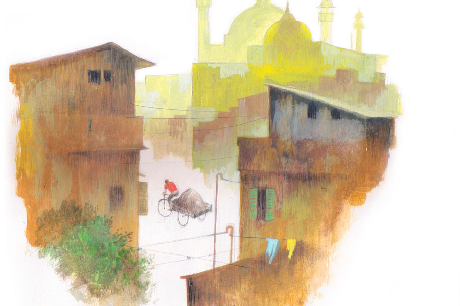

 
 <h1 align=center>ছায়ামানুষ</h1>
<h2 align=center>সমীরণ বন্দ্যোপাধ্যায়</h2> কাগজের পাঁজার আকৃতি দেখে চোখ চকচক করে উঠল মদনার!

পাঁজা না বলে ওটাকে ছোটখাটো স্তূপ বললেই ঠিক হয়। সিঁড়িঘরের অর্ধেকের বেশি জায়গা দখল করে রেখেছে রাশি-রাশি খবরের কাগজ, ম্যাগাজ়িন আর ঢাউস-ঢাউস এক একটা বই। সবসুদ্ধু ওজন প্রায় তিন কুইন্টাল তো বটেই!

সারা বছর টুকটাক চললেও পুজোর আগের একটা মাস মদনার ব্যবসার সেরা সময়। সংসারের বাতিল জিনিস বিদায় করে ঘরদোর পরিপাটি করে তোলার জন্য ওই সময়টাই বেছে নেয় বেশির ভাগ গৃহস্থ। শালুক-শিউলি-কাশের প্রসাধনে প্রকৃতির রূপটান সম্পূর্ণ হওয়ার পাশাপাশিই সেজে ওঠে গৃহী মানুষের ঘরদোর। কিন্তু ঘর সাজানোর আগে এক কাঁড়ি বাতিল জিনিসের কী গতি হবে? সারা বছরের খবরের কাগজ, বিকল কম্পিউটর, আয়ু-ফুরনো ইনভার্টার ব্যাটারি, হাতল-ভাঙা প্রেশার কুকার, স্টোর রুমের কোণে জমে ওঠা শিশি-বোতল-কৌটো তো এক কথায় মিউনিসিপ্যালিটির ডাস্টবিনে উপুড় করে দেওয়া যায় না! তা হলে উপায়?

উপায় মদনা!

বেলা একটু গড়ালেই পাড়ায়-পাড়ায় শোনা যায় মদনার হাঁক, “ভাঙাচোরা জিনিসপত্তর দেবে গো মায়েরা? প্লাস্টিক-অ্যালুমিনিয়াম-কাচের শিশিবোতল! আছে না কি পুরনো খবরের কাগজ...”

বাতিল জিনিস যত বেশি, তত চওড়া মদনার মুখের হাসি। ঝোলায় বাতিল জিনিসপত্রের ঢল নামলে নিয়মিত হাঁড়ি চড়বে তার ঘরে। সপ্তাহে এক দিন ফুর্তি করা যাবে চুমকির কোঠায় গিয়ে!

তবে পুজো এগিয়ে এলেও কারবারটা এ বছর তেমন জমছিল না মদনার। এই কাজে এখন কম্পিটিশন অনেক বেশি। সেই গোঁফ-ওঠা বয়সে মদনা যখন প্রথম এই কাজ শুরু করেছিল, তখন হাতে গোনা কয়েক জন ছিল এই লাইনে। এখন বনগাঁ লোকালের ভিড়!

গত দু’দিন আশপাশের ফ্ল্যাটপাড়ায় ঘোরাঘুরি করে তেমন সুবিধে করতে পারেনি মদনা। আজ সকাল-সকাল তাই চলে এসেছে একটু দূরের মহল্লায়। জায়গাটা শান্ত, নির্জন। বেশির ভাগ বাড়ি পাঁচিল ঘেরা। পেল্লায় সব লোহার গেটের এ পাশ থেকে বোঝা মুশকিল, গাছপালার আড়ালে ঢাকা ঘরগুলোয় মানুষজন থাকে কি না।

অনেকগুলো বাড়ির সামনে নিষ্ফল হাঁকাহাঁকির পর মদনা যখন সবে ভাবতে শুরু করেছে ‘ভুল জায়গায় আসা হয়ে গেল’, তখনই এক বয়স্ক মানুষের গলা, “অ্যাই শুনছ, একটু এ দিকে এস তো, আমার কিছু জিনিস রয়েছে।”

ঘাড় ঘুরিয়ে পিছনে তাকাল মদনা। গলা শুনে যেমন মনে হয়েছিল, মানুষটার বয়স তার তুলনায় বেশ বেশি। সাদা পাজামা-পাঞ্জাবি, চোখে মোটা ফ্রেমের চশমা। ঈষৎ ঝুঁকে পড়া শরীরের ভারসাম্য রাখার জন্য হাতে লাঠি।

লোকটাকে দেখে মনে-মনে দারুণ খুশি হল মদনা। এই ধরনের বিক্রেতা পেলে তার লাভের অঙ্ক চড়চড় করে বেড়ে যায়। বুড়োগুলো ওজনের হিসাব ঠিকঠাক রাখতে পারে না। সাধারণ যোগ-বিয়োগেও ভুল করে হামেশাই। একটু হাতের কায়দার সঙ্গে মাথা খাটিয়ে সামান্য অভিনয় করতে পারলেই একশো টাকার মাল বাগিয়ে নেওয়া যায় ষাট-সত্তরে!

রাস্তা পার হয়ে বয়স্ক মানুষটার কাছে এসে মদনা জিজ্ঞেস করল, “কী মাল কাকাবাবু, কাগজ? না কি ভাঙাচোরা জিনিসপত্র?”

‘স্যর’-এর বদলে লোকটাকে ‘কাকাবাবু’ বলেই ডাকল মদনা। ফ্ল্যাটের অল্পবয়সি বাবু-বিবিরা ইংরেজি ডাক শুনতে পছন্দ করে কিন্তু পুরনো মানুষেরা কাকাবাবু-জেঠামশাই অথবা মাসিমা-কাকিমায় খুশি হয়। 

“কিছু কাগজপত্র। আমি তোমার গলা শুনে বারান্দায় আসতে-আসতে দেখি তুমি চলে এসেছ এ দিকে। আবার তাড়াহুড়োয় সিঁড়ি ভাঙতে হল। ওই আমার বাড়ি।”

লোকটার কান বাঁচিয়ে একটা দীর্ঘশ্বাস ফেলল মদনা। এতটা পথ পেরিয়ে এসে মাত্র কয়েক কেজি কাগজ! এই মহল্লায় আসাই আজ ভুল হল। এখানকার বাড়িগুলো দেখতেই বড়সড়, ভিতরে শাঁস কম! এর থেকে মল্লিকপাড়ার দিকে গেলে বোধহয় লাভ হত।

কয়েক পা হেঁটে একটা পাঁচিলঘেরা ছোট দোতলা বাড়ির সামনে এসে থামলেন ভদ্রলোক। বাড়ির সামনে আপন খেয়ালে বেড়ে ওঠা আগাছার ঝোপ। খুঁটিয়ে দেখলে বোঝা যায়, অনেক আগে ওখানে সাজানো বাগান ছিল। ফুটত শখের সব ফুল। এখন তেলাকুচো ঝোপের ফাঁকফোকর থেকে কোনও রকমে নিজেদের অস্তিত্ব জানান দিচ্ছে কয়েকটা গোলাপ, স্থলপদ্ম, গন্ধরাজ।

মলিন দশা বাড়িটারও। বহু দিন রঙের পোঁচ পড়েনি দেয়ালে। ঝুলবারান্দার সুদৃশ্য কাস্ট আয়রন রেলিংয়ে মরচের প্রলেপ। বয়স্ক মানুষটা লোহার গেট ঠেলে ধীর পায়ে পাথর বাঁধানো সরু রাস্তা পেরিয়ে দরজার তালা খুলতে লাগলেন।

গল্পটা আন্দাজ করে নিল মদনা। বুড়ো সম্ভবত একাই থাকে বাড়িতে। বুড়োর বুড়ি আছে কি না সেটা এখনও পরিষ্কার নয়, তবে ছেলেমেয়ে থাকলেও তারা যে এ বাড়ির চৌহদ্দি মাড়ায় না, তা নিশ্চিত। হয়তো তারা বিদেশে, বাপ-মাকে কালেভদ্রে দেখতেও আসে কি না সন্দেহ।

একটু পয়সাওলা মহল্লায় এমন গল্প অজস্র। পয়সার অভাব না থাকলেও এই বয়স্ক মানুষগুলো বড্ড একা। অসহায়ও। তাই চেনা-অচেনা যাকে পায় তার সঙ্গেই বকবক শুরু করে দেয়। মদনাকেও বহু বার তেমন পরিস্থিতিতে পড়তে হয়েছে। সে এক বিরক্তিকর ব্যাপার বটে!

ভারী কাঠের পাল্লা ঠেলে সরিয়ে বয়স্ক মানুষটা বললেন, “এস, ভিতরে এস। এখানেই আছে সব।”

ভিতরে ঢুকে প্রথমে কিছুই ঠাহর করতে পারল না মদনা। কিন্তু একটু পরে ঘরের মৃদু আলোয় চোখ সয়ে যেতেই উল্লসিত হয়ে উঠল সে। রোদে পুড়ে, ঘামে ভিজে পাড়ার পর পাড়ায় চক্কর কেটেও সারা দিনে এক ভ্যান মাল জোগাড় হয় না, সেখানে এক জায়গাতেই প্রায় তিনকুইন্টাল কাগজ!

মনে-মনে মালের দাম হিসাব করে চিন্তার ভাঁজ ফুটল মদনার কপালে। দাঁড়িপাল্লার কারসাজিতে তিনকে অনায়াসে আড়াই, এমনকি সোয়া দুইয়ে নামিয়ে আনার টেকনিক সে জানে, কিন্তু সেই পরিমাণ কাগজেরও যা দাম হবে, তত টাকা নেই তার পকেটে! বড়জোর এক কুইন্টাল মালের দাম এখন মেটাতে পারবে সে। মহাজনকে গিয়ে বললে টাকা পাওয়া যাবে, কিন্তু যাওয়া-আসা কমপক্ষে দু’ঘণ্টা। সেই ফাঁকে বুড়ো যদি মালটা অন্য কাউকে দিয়ে দেয়! এই ধরনের মানুষেরা বড্ড অধৈর্য হয়।

সিঁড়িঘরের আলো জ্বেলে বয়স্ক মানুষটা গুটিকয় কাগজ হাতে করে বয়ে আনার উদ্যোগ করতেই শিউরে উঠল মদনা, “ছি ছি! করছেন কী কাকাবাবু! আমি আপনার ছেলের বয়সি। আমি থাকতে আপনি কেন খাটতে যাবেন খামোখা!“

মুখ দেখে বোঝা গেল খুশি হয়েছেন ভদ্রলোক। মওকা বুঝে আর একটু সুতো ছাড়ল মদনা, “তা ছাড়া আমাদের সারা দিন রোদ্দুরে পুড়ে, জলে ভিজে ঘুরে বেড়াতে হয়। ভগবান তো এক ফোঁটাও সুখ লেখেনি আমাদের কপালে, যত দিন বাঁচব এই কাজই করতে হবে। কিন্তু আপনারা লেখাপড়া শেখা মানুষ, এ সব কি আপনাদের মানায়! আপনি বরং ওই চেয়ারে গিয়ে বসুন। এই বয়সে কোমরে চোট-টোট লেগে গেলে কী বিপদ হবে বলুন তো!”

বারান্দায় গিয়ে চেয়ারে বসে একটা দীর্ঘশ্বাস ফেললেন ভদ্রলোক। মদনা বুঝল ওষুধ ধরেছে। এ বার একটু-একটু করে নিজের দুঃখের কথা বলতে শুরু করবে বুড়োটা। একঘেয়ে লাগলেও তাকে শুনতে হবে মন দিয়ে, অন্তত মনোযোগী শ্রোতা হওয়ার ভানটুকু করতে হবে!

হলও তাই। হাহাকার মেশানো গলায় ভদ্রলোক শুরু করলেন, “আর লেখাপড়া! কী হল জীবনে এত লেখাপড়া শিখে। অক্সফোর্ডের সেই আমলের পিএইচ ডি আমি! কিন্তু সেই তো শেষ বয়সে একলা পড়ে থাকতে হচ্ছে ভূতের মতো! গিন্নি চলে যাওয়ার পর থেকে একটা কথা বলার লোক নেই। কাজের মেয়েটা কোনও মতে রান্না সেরে পালাতে পারলে বাঁচে। ছেলে-মেয়ে-নাতি-নাতনি কারও সময় হয় না দিনে অন্তত এক বার ফোন করে দু’-চারটে কথা বলার! কাগজ ম্যাগাজ়িন পড়ে, টিভি দেখে কত আর সময় কাটানো যায়! গত সপ্তাহে তাই ভাবলাম...”

ভদ্রলোকের কথার ফাঁকে-ফাঁকে ‘ইস’, ‘আহা’, ‘তাই তো’, ‘কী আশ্চর্য’, ‘ছি-ছি’ শব্দের ঠেকনা গুঁজতে শুরু করল মদনা। যে খেলার যেমন দস্তুর!

সমস্ত কাগজ বারান্দায় আনা হলে বয়স্ক মানুষটার হাতে একটা ছোট নোটবুক আর কলম ধরিয়ে মদনা বসল দাঁড়িপাল্লা নিয়ে। এ বার সে ঝড়ের বেগে কাগজ মাপবে, আর বুড়ো হিসেব লিখবে। মদনার গতির সঙ্গে কিছুতেই তাল রাখতে পারবে না বুড়ো, হোঁচট খাবে বার বার। সেই ফাঁকে প্রয়োজনীয় হাতসাফাই সেরে ফেলবে মদনা।

শেষ পর্যন্ত কাগজপত্রের ওজন দাঁড়াল দুই কুইন্টাল বারো কেজি। যদিও মদনা নিশ্চিত, মহাজনের গুদামে মাপলে মালের ওজন সাড়ে তিন কুইন্টালের একটুও কম হবে না। হিসাব লেখায় ব্যস্ত বুড়ো এক বারের জন্যও দাঁড়িপাল্লার দিকে তাকানোর ফুরসত পায়নি। প্রতি পাল্লায় ইচ্ছেমতো কারসাজি করেছে সে!

এ বার আসল অভিনয়! একটা মানানসই গল্প বলে ভেজাতে হবে বুড়োর মন! পুজোর আগে এতগুলো মাল হাতছাড়া করা যাবে না কিছুতেই!

মানিব্যাগ থেকে কুড়িটা একশো টাকার নোট বের করে মদনা বলল, “মালের দাম হয়েছে চার হাজার দুশো চল্লিশ টাকা। আপাতত দু’হাজার রাখুন কাকাবাবু। গরিব মানুষ, ক্যাপিটাল কম! কথা দিচ্ছি বাই ইভিনিং আপনার বাকি টাকা মিটিয়ে দেব। যদি আমাকে বিলিভেবল মনে না হয়, তবে সব মাল এখেনেই রেখে যাচ্ছি, টাকা শোধ করে নিয়ে যাব। শুধু একটাই রিকোয়েস্ট, আমার আসতে দেরি হলে মালগুলো অন্য কাউকে দিয়ে দেবেন না! এই সময় দুটো পয়সা রোজগার না হলে পুজোয় বাচ্চাদের নতুন জামাকাপড় কিনে দেব কী করে!”

কথার মাঝে ইচ্ছে করেই দু’-তিনটে ইংরেজি শব্দ গুঁজে দিল মদনা। বুড়ো বুঝুক, মদনার পেটেও কালির আঁচড় আছে, নেহাত কপালের ফেরে তাকে এই কাজ করতে হচ্ছে!

বয়স্ক মানুষটা টাকা হাতে নিয়ে কী যেন ভাবছে! মুখে চিন্তার রেখা ফুটিয়ে গেটের দিকে তাকিয়ে থাকল মদনা। বুড়োর মর্জির উপরেই আপাতত তার জীবন-মরণ!

“ক’টা বাচ্চা তোমার? বাড়িতে কে কে আছে?”

স্নেহ মেশানো কৌতূহল বুড়োর গলায়। তিরটা ঠিক জায়গায় বিঁধেছে! ছলছল চোখে, ভিজে গলায় মদনা উত্তর দিল, “আজ্ঞে কাকাবাবু মা, বৌ, ছেলেমেয়ে। সাত বছর আগে একটা রোড অ্যাকসিডেন্টে বাবা চলে গেল। ছেলেমেয়ে দুটোকে ইস্কুলে পড়াচ্ছি...বড় হয়ে ওরা যেন ভাল থাকে...আমার মতো খাটুনির কাজ করতে না হয়!”

ডাহা মিথ্যে! বস্তিতে আগাছার মতো বেড়ে উঠেছে মদনা, জ্ঞান হয়ে থেকে মা-বাবাকে চোখে দেখেনি! বৌ-বাচ্চা-সংসার তো রূপকথার গল্প!

মিনিটখানেক চুপ করে বসে থাকার হঠাৎ মদনাকে ভেবলে দিয়ে বয়স্ক মানুষটা বলে উঠলেন, “আচ্ছা ঠিক আছে, দাম লাগবে না, কাগজগুলো তুমি এমনিই নিয়ে যাও। পরিবারের সবাইকে নিয়ে পুজোয় আনন্দ কোরো।”

আজ পর্যন্ত এতটা ভ্যাবাচ্যাকা কখনও খায়নি মদনা। হাড়ভাঙা খাটুনির সঙ্গে খানিক ছলচাতুরি মিশিয়ে ডালভাতের জোগাড় করতে হয় তাকে। সবার চেষ্টা থাকে বাতিল মাল বেচে তার কাছ থেকে যে ভাবে হোক দুটো বেশি পয়সা বাগিয়ে নেওয়ার। হকের পাওনা এক কথায় ছেড়ে দেওয়ার মানুষ এত দিনে একটাও চোখে পড়েনি তার!

কোনও কথা খুঁজে না পেয়ে বেকুবের মতো হেসে বুড়োর ফিরিয়ে দেওয়া টাকাটা পকেটে পুরল মদনা। কিছু একটা বলার জন্য মনের ভিতর আঁকুপাকু করছে, কিন্তু মেকি কথা সাজাতে-সাজাতে কৃতজ্ঞতা প্রকাশের ভাষা ভুলে গিয়েছে সে!

মিনিট দশেকের মধ্যেই পেল্লায় লোহার গেটটা পিছনে ফেলে রাস্তায় নামল মদনা। এক জন ভাল মানুষকে অনেকগুলো মিথ্যে বলার জন্য মনটা খচখচ করছে বটে, কিন্তু বড় দাঁও মারা গেছে আজ! ভ্যানরিকশার ডালায় ঠাসা মাল অথচ অক্ষত তার মূলধন!

সব মিলিয়ে কত লাভ হল আজ?

মনে-মনে হিসেব কষতে শুরু করল মদনা। পাইকারি বাজারের রেট জানে সে। অজানা নয় মালের ওজনও। কিন্তু অনেক ক্ষণ চেষ্টা করেও সামান্য গুণ অঙ্কটা কিছুতেই মিলিয়ে উঠতে পারল না মদনা।

অবাক হয়ে সে খেয়াল করল, প্রতি বার অঙ্কের শেষ লাইনে পৌঁছনোর সঙ্গে সঙ্গে কে যেন একটা বড়সড় কাটা চিহ্ন বসিয়ে দিচ্ছে তার উত্তরের পাশে!