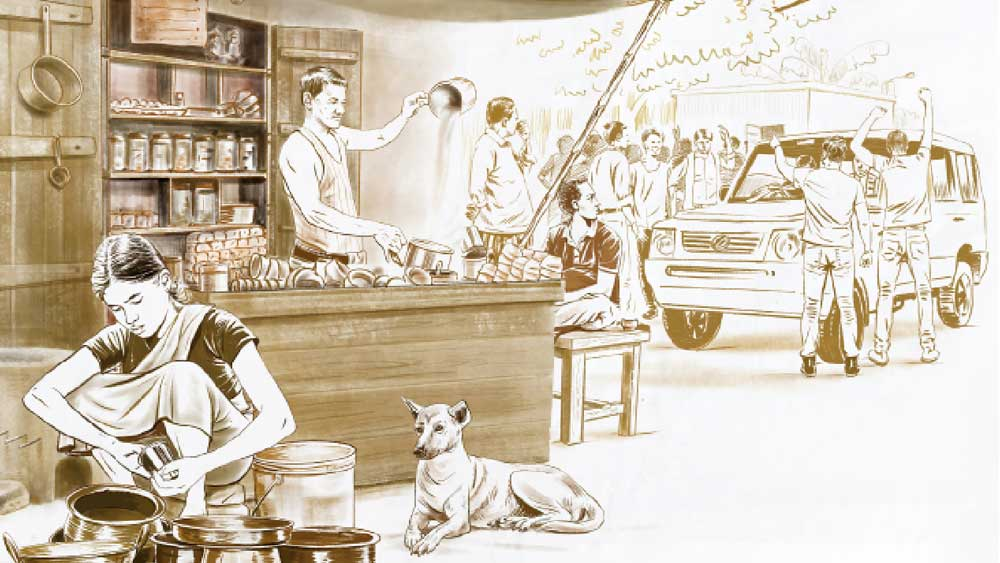

 

<h1 align=center>জনসংযোগ</h1>
<h2 align=center>সঞ্জীব চৌধুরী</h2>
ইনকিলাব... জিন্দাবাদ। সমাজবন্ধু পার্টি... জিন্দাবাদ। গরিবের বন্ধু কালীপদ হাজরা যুগ যুগ জিও...”   রবিবারের সকাল। সমাজবন্ধুর জনাপঁচিশ মেম্বার পার্টি অফিসের সামনে কেশবদার দোকানে টোস্ট, ডিম, চা খেয়ে গলা সাধছে। সামনে ভোট। তাই হাইকম্যান্ডের নির্দেশ, জনসংযোগ বাড়াতে হবে। সমাজের সর্বস্তরে, বিশেষত নিচুতলার মানুষের কাছে যেতে হবে। কালীপদ হাজরার গাড়ি এলেই মিছিল বেরোবে।   পার্টি অফিসের উল্টো দিকে, বাড়ির পাঁচিল থেকে ফুটপাতে প্লাস্টিক নামিয়ে কেশবদার চায়ের দোকান, সংসার। মা-মরা মেয়ে মঞ্জরী জন্ম থেকেই বোবা। ইদানীং শাড়ি ধরেছে। খদ্দেরের সামনে বড্ড লজ্জা! মুখ গুঁজে উনুন সামলায়। রাতে কাপড়ের আড়ালে মঞ্জরী ঘুমিয়ে পড়লে, কেশবদা রাতভর বসে থাকে। ফুটপাতের মানুষ মানুষকেই ভয় পায় বেশি। বৌদি থাকতে মঞ্জরীকে কাজ করতে দিত না। বলত, “অনেক দুঃখ রেখে যাব, তখন খাটিস।”   গত বছর ডেঙ্গিতে বৌদি ফুটপাতেই ফুরিয়ে গেল। কেশবদা পার্টি অফিসে অনেক বলেছিল যদি কোনও হাসপাতালে ব্যবস্থা হয়। পার্টির সদিচ্ছা হয়তো ছিল, কিন্তু আরও জরুরি কাজে হয়ে ওঠেনি! অবশ্য পোড়ানোর খরচ কেশবদাকে দিতে হয়নি।      পার্টির ফ্ল্যাগ উড়িয়ে, কালীপদ হাজরার বিশাল সাদা এসইউভি সশব্দে ব্রেক কষল। জবরদস্ত নেতার দুর্দান্ত ড্রাইভার স্টান্টম্যানের স্টাইলে দরজা খুলতেই কালীপদ হাজরা কালো কাচের আড়াল থেকে আবির্ভূত হলেন। কাউন্টি ক্যাপ, সানগ্লাস, মলমলের পাঞ্জাবি, জিন্সের নীচে স্নিকার। স্লোগান এখন আরও জোরালো, “গরিবের বন্ধু কালীপদ হাজরা... যুগ যুগ জিও।” যারা চান্স পেল, হুমড়ি খেয়ে কালীদার হাঁটু ছুঁল। কালীপদ অভয়মুদ্রায় ডান হাতটা হালকা উঠিয়ে, সোজা পার্টি অফিসে ঢুকে গেলেন। কেশবদা সব ফেলে লেবু-চা নিয়ে দৌড়ল।   মোহনলাল কালীপদ হাজরার কাছের লোক। আড়ালের ডাক, চামচে। অফিস ঘরে কালীপদ ঢুকতেই একটা ধূপকাঠিতে দেশলাই মেরে এগিয়ে দিল। কেশবদা দরজায় অপেক্ষা করছিল। মোহনলালের ইশারায় গ্লাসটা টেবিলে নামিয়ে কানে কানে বলে গেল, “তেইশ।”   কালীপদ ধূপটা মা কালীর ছবিতে দেখিয়ে মোহনলালকে, “অ্যাটেন্ডেন্স?”   মোহনলাল মেম্বারের গুনতি দশ বাড়িয়ে বলল, “তেত্রিশ। বাকি রানিংয়ে ঢুকচে। এস্টাট করাই?”   “রুট কী?”   “এখেন থেকে সিধে বাজারমোড়। তার পর বিশু দত্ত লেন ধরে মন্দিরতলা। লাস্টে ঘোষপাড়ায় মিছিল টার্মিনেট করে ঝোড়োবস্তিতে ঢুকব। লাল্টুকে দিয়ে বস্তি উন্নয়নের ভিডিয়ো করাচ্চি।”   বাইরে তুমুল উদ্যমে “ইনকিলাব... জিন্দাবাদ। সমাজবন্ধু পার্টি...”   মিছিল রেডি। পাঁচ হাত গ্যাপে দুটো সিঙ্গল লাইন। হাতে হাতে প্ল্যাকার্ড। পার্টি অফিসের চাবি কেশবদার জিম্মায় থাকে। কেশবদা মোহনলালের থেকে চাবিটা নিয়ে বলল, “দুশো চুরাশি টাকা হয়েছে। তোমার আর কালীদারটা ধরিনি। কিছু দিয়ে গেলে ভাল হত। বউনি হয়নি।”   মোহনের ঠোঁটে লাল প্লাস্টিকের হুইস্‌ল। পিঁপ পিঁপ করে দু’বার বাজিয়ে বোঝাল, “হবে, হবে।” কেশবদা এই ভয়টাই করছিল। মুদির দোকানে টাকা বাকি। দুপুরের চালটা কি ধারে দেবে?   ট্রামরাস্তা ধরে মিছিল এগোচ্ছে বাজার মোড়ের দিকে। মোহনলাল ঘন ঘন হুইস্‌ল বাজিয়ে ট্রাফিক সামলাচ্ছে। মিছিলের মুখে দশ হাত লম্বা পার্টি ব্যানার। জোরালো স্লোগান তুলে মিছিল বিশু দত্ত লেনে ঢুকতেই দুর্গাপুজো কমিটির সদস্যরা নেতার অভ্যর্থনায় এগিয়ে এল। সভাপতি আগরওয়ালজি নামজাদা প্রোমোটার। কালীপদর গলায় জবার মালা ঝুলিয়ে, “আপনার নামসে মা কালীর পূজা চড়িয়েসে। ইসবার ডাবোল মার্জিনসে জিতনা হ্যায় কালীদাদা।”   সদস্যরাও সমস্বরে, “জিতেগা ভাই জিতেগা... কালীদাদা জিতেগা।”   আগরওয়ালজি আবদার করলেন, কালীপদকে কমিটির সঙ্গে সে‌লফি তুলতে হবে। রিটায়ার্ড স্কুলমাস্টার নীলমণি দত্ত ফার্মেসি থেকে ইসবগুলের ভুসি কিনে বেরিয়েই দেখলেন, আগরওয়ালজি কালীপদ হাজরার সঙ্গে সেলফি তুলছে। নীলমণি বছরখানেক আগে আগরওয়ালজিকে গ্র্যাচুইটির সব টাকা অ্যাডভান্স করে আজ পর্যন্ত ফ্ল্যাটের একটা ইটও দেখেননি। শুনেছেন, বাড়িটা বেআইনি উঠছিল বলে ভিতেই আটকে রয়েছে। ক’দিন ধরেই ভাবছিলেন কালীপদ হাজরার সঙ্গে দেখা করে বিহিত চাইবেন। আগরওয়ালজি নীলমণিকে দেখেই, “আসেন, মাস্টারমোসাই, আপনি ভি ফোটোমেঁ চলিয়ে আসেন।”   নীলমণি রাগে, হতাশায় ফ্যালফ্যাল করে তাকিয়ে রইলেন।   মিছিল এগোচ্ছে। জবার মালায় ভূষিত কালীপদ রাস্তার দু’পাশের মানুষকে হাত নেড়ে জনসংযোগ করছেন। কালীপদ জানেন, এই সস্তার মানুষগুলোর কাছে জনসংযোগ মানেই দাও, দাও। উপায় নেই, পার্টির চাপ। মন্দিরতলায় ফি রবিবার চাষিদের বাজার বসে। শাকটা, ডাঁটাটা সস্তায় পাওয়া যায়। মিছিল ঢুকতেই নেতা দেখার হুজুগে বাজারের ছন্দটা গেল চটকে। এক বুড়ি থোড় আর শাক বেচছিল। কালীপদকে আসতে দেখে ভিড় ঠেলে একেবারে সামনে। কালীপদ হাতজোড় করে বলে ওঠে, “মাসিমা, শরীর ভাল তো?”   বুড়ি দোক্তার থুতুটা সামলে বলে, “ভাল আর কই রাক্‌লে বাবা! রেশনকাটটা তো পেলুম না। গেল ভোটে বললে, দু’দিনে পাঠ্যে দিচ্চি। তা কত দু’দিন চলে গেল! বাজারের চাল কি আমাদের মুকে ওঠে, বলো?”   মোহনলাল কালীপদর পাশেই ছিল। পাবলিকের সামনে কেসটা ঘেঁটে যাচ্ছে দেখে বলে উঠল, “আরে মাসি, তুমি যে ঠিকানা দিয়েছিলে সেখেন থেকে তো কার্ড ফিরে এয়েচে। কাল এক বার কষ্ট করে পার্টি অফিসে এসে কার্ডটা নিয়ে যেয়ো দিকি। কত বার লোক পাঠালুম!”   বুড়ির কথাটা দোক্তায় আটকে গেল। বলতে যাচ্ছিল, ‘আমায় মুখ্যু পেয়ে বোকা বানাচ্চিস? কাট ফিরে গেছে? দরখাস্তটাই তো জমা নেয়নি। বললে, ঠিকানা চাই। রেললাইনের ঝুপড়ির নাকি ঠিকানা হয় না।’   মিছিল তত ক্ষণে বেরিয়ে গেছে। যে খদ্দের থোড় দর করছিল, বলল, “সব নকশা! ওই চামচেটাকে মাল না ছাড়লে কিস্যু পাবে না।”   বুড়ি বলল, “মুকে আগুন হারামজাদার! মিথ্যুকের ঝাড়!”      ঘোষপাড়ায় টাইম লাগল। সমাজবন্ধুর মিছিলের খবর পেয়েই বিরোধী পার্টি তড়িঘড়ি রক্তদান শিবিরের আয়োজন করে পাল্টা জনসংযোগ করছে। ক্লাবের মাঠে ব্যানার ঝুলিয়ে, ত্রিপল খাটিয়ে সার সার ক্যাম্প খাট। মাইকে দেশাত্মবোধক গান, চার দিকে খিচুড়ি-বেগুনির গন্ধ। ব্যাপারটায় ছক আছে বুঝে কালীপদ মিছিল দাঁড় করিয়ে দারিদ্র এবং ভ্রষ্টাচারের বিরুদ্ধে সমাজবন্ধুর আপসহীন সংগ্রামের কথা সবাইকে মনে করিয়ে দিলেন। হাততালিও পড়ল প্রচুর।      দুপুর দেড়টায় মিছিল ভাঙতেই মেম্বাররা হাওয়া। রোববারের অর্ধেকটাই শেষ। এ বার কালীপদ হাজরার ‘বস্তি উন্নয়ন’ প্রকল্প পরিদর্শন। গত বার ভোটের পর সরকারি প্রকল্পের টাকায় ঝোড়োবস্তির সব খোলার চাল বদলে অ্যাসবেস্টস বসেছে। আগরওয়ালজি মানুষ ভাল। বরাত পেয়ে তিনগুণ বিল করে লাভের ফিফ্‌টি-ফিফ্‌টি মিটিয়ে দিয়েছেন। কালীপদ মোহনলালকে ডেকে, “এখানে তো টোটালটাই করে দিয়েছি। চটপট নে। বড্ড ঘামচি।”   “তিনটে ঘর সেটিং করা আছে। তুমি ঘরে ঢুকবে, লাল্টু ভিডিয়ো নেবে। একটু পাবলিকের বাইট, ব্যস। কাল থেকে ভিডিয়োটা কেবিলে চব্বিস ঘণ্টা রান করাচ্চি।”   কালীপদ, মোহনলাল আর পার্টির জনাকয়েক মাতব্বর ঝোড়োবস্তিতে ঢুকল। প্রথম ঘরে ডাবের জল, পরেরটায় দানাদার। যাদের ঘর, তারা ক্যামেরায় বলল, “কালীদার মতো জনদরদি নেতা হয় না। এ ছাদ পার্টির ছাদকেও মজবুত করেছে। বস্তির একটা ভোটও সমাজবন্ধুর বাইরে যাবে না।” কালীপদও কথা দিলেন, জিতে ফিরলে ক্লাবঘরে ছাপ্পান্ন ইঞ্চি কালার টিভি বসবে।   তিন নম্বর ঘরটা বস্তির শেষ প্রান্তে। দু’পাশে ঘিঞ্জি ঘরগুলোর মাঝখান দিয়ে এক ফালি রাস্তা। জলের ড্রাম, এঁটো বাসন, সাবান-কাচার গামলার ফাঁক দিয়ে যেতে যেতে কালীপদ আর মোহনলাল লক্ষ করল, বস্তির লোকগুলো টুকটাক সটকে যাচ্ছে। কারণটা বোঝা গেল না। লাল্টু এর মধ্যেই এগিয়ে তিন নম্বর ঘরের ভেতর থেকে দরজায় ক্যামেরা ফোকাস করে দাঁড়িয়ে। কালীপদ ঢুকলেই ক্যামেরা অন। কালীপদ সদলবলে ঢুকলেন। ঘরে লোক বলতে এক বিধবা বুড়ি। বয়স আশির ও দিকে, মাথা কামানো, 
সাদা থান। তক্তপোশে বসে চোখ বুজে মালা জপছে। মোহনলাল ঝুঁকে পড়ে বলে, “ঠাকুমা, সমাজবন্ধু 
থেকে এয়েছিলুম।”   ক্যামেরা চলছে। বুড়ির চোখ বন্ধ। জপের মালা ঘুরছে। মোহনলাল আবার বলে, “ঠাকুমা, কালীপদ হাজরা এয়েচেন।” বুড়ি তাও চোখ খুলছে না, মোহনলাল কানে মুখ লাগিয়ে, “যিনি অ্যাসবেস্টো দিয়েচেন, তিনিই এয়েচেন।”   এই বার বুড়ি চোখ খুলল। জপের মালা নামিয়ে বলল, “সে সুপুত্তুরটি কই দেখি।”   বুড়ির গলায় বেশ তেজ। মোহনলাল খুশি হয়ে কালীপদকে দেখাতেই, “অ! তুই বুঝি আমার সব্বোনাশটি করেছিস?”   লাল্টুর ভিডিয়ো উঠছে। কালীপদ থতমত, “কেন? কোন ফুটো টুটো...”   বুড়ি খপ করে কালীপদর ডানহাতটা ধরে কাছে টেনে, “কানে মোটে শুনি না। একটা উবগার করবি বাবা? দিব্যি দিয়ে বল।”   “বলুন।”   “তিতিবিরক্ত করে মারছে রে! তিস্টোতে দেয়নাকো মোটে! দিন নেই, রাত নেই ঘরে ঢুকে শাসাচ্ছে।”   কালীপদর অস্বস্তি, “শাসাচ্ছে? কে? কেন?”   “বস্তির হারামজাদাগুলো। বলে, ‘ঘরটা এক্ষুনি লিখে দাও। তোমার আর ক’ঘণ্টা? এই তো মরলে বলে!’ পেটের ছেলে, দুটো বাত্‌সাও কোনও দিন দেয়নিকো। সকাল-সন্ধে বৌকে সঙ্গে করে নে’ এসে চমকাচ্ছে, ঘরটা না লিখে দিলে গলা টিপে মারবে। ভয় করে রে বাবা! যদ্দিন ছাদ ফুটো ছিল, শান্তিতে ছিলুম। যবে থেকে তুই অ্যাসবেস্টো করেছিস, এই উৎপাত মোটে সহ্যি হয় না...”   মোহনলাল এত ক্ষণে বুঝেছে, বস্তির লোকগুলো কেন সট্‌কেছে। কাগজ-কলম বার করে বলে, “নামগুলো শুধু এক বার বলুন তো ঠাকুমা। কালীপদ হাজরা থাকতে শাসাচ্ছে? এত বড় আস্পদ্দা!”   “কথায় আর পেত্যয় হয় না বাবা! তার চে এক কাজ কর,” বলে বুড়ি তোশকের তলা থেকে একটা প্লাস্টিকের প্যাকেট বের করে। “কত্তা চোখ বোজার আগে এইটে ধরিয়ে বলেছিল, ‘ভদ্দরলোকের পেট থেকে ছাদ বড়। দলিলটা হাতছাড়া কোরো না।’ তা তুই এটা নিয়ে যা। টিপ দে দিচ্চি। আমি মল্লে ধম্মে যার পাওয়ার কথা, তাকেই ঘরটা দিবি। খবরদার, আমার ছেলে আর ছেলের বৌ যেন এ ঘরের চৌকাঠও না ডিঙোতে পারে।”   বুড়ি একেবারে নাছোড়বান্দা। ক্যামেরার সামনে দলিলটায় টিপসই দিয়ে কালীপদকে ধরিয়ে জপের মালাটা তুলতেই হাতটা ঝপ করে তক্তপোশের ওপর পড়ে গেল। লাল্টুর ক্যামেরা বুড়ির মুখে জ়ুম। মোহনলাল ডাকল, “ঠাকুমা, ঠাকুমা...”   শরীরটা টানটান, ঠান্ডা। সবাই হতভম্ব। মোহনলাল কপালে হাত ঠেকাতেই মাথাটা হেলে গিয়ে দেয়ালে ধাক্কা খেল। লাল্টু ভ্যাবাচ্যাকা খেয়ে ভিডিয়োটা পজ় করে দিল।   সংযোগ যে চিরবিচ্ছিন্ন হয়ে গেছে, সে ব্যাপারে নিঃসন্দেহ হয়ে মোহনলাল কালীপদকে ইশারায় ঘরের বাইরে ডেকে এনে বলল, “এ দিকটা আমি দেখে নিচ্চি। চলো, তোমাকে গাড়িতে তুলে দিয়ে আসি।”   বস্তির জানলায়, দরজায় সন্দিগ্ধ মুখ। কালীপদর হাতে দলিলটা ধরা। মনটা ভারী হয়ে গেছে। বুড়ির কথাগুলো কানে বাজছে, ‘ধম্মে যার পাওয়ার কথা, তাকেই ঘরটা দিবি।’ গাড়িতে ওঠার সময় আনমনা কালীপদ মোহনলালকে বলল, “মোহন, চায়ের দোকানের ওই যে কেশবদা, ওর মেয়েটার নামটা যেন কী?”   “মঞ্জরী।”   কেশবদার দোকান আজকাল সকাল-সন্ধে ছাড়াও দুপুরে খোলা থাকে। বেলা বারোটা নাগাদ মঞ্জরী ঝোড়োবস্তি থেকে রিকশা করে ভাত, ডাল, তরকারি আর ডিমের ঝোল রান্না করে নিয়ে আসে। ডেকচিগুলো ফাঁকা হয়ে গেলেই কেশবদা উনুনে গুল-কয়লা ফেলে বিকেলের চায়ের জল চাপায়। রাতে পার্টি অফিসের আলো নিভে গেলে ফুটপাতের ঝাঁপ ফেলে বস্তিতে ফিরে যাওয়ার সময় কেশবদা প্রায়ই মঞ্জরীকে বলে, “তোর মাকে কোনও দিন ঘরে তুলতে পারিনি রে মঞ্জরী। তোর ঘরে যেতে কেমন যেন লাগে!”   মঞ্জরী বোঝে সবই, কিন্তু বলতে তো পারে না কিছু! সে শক্ত করে বাবার হাতটা ধরে থাকে।