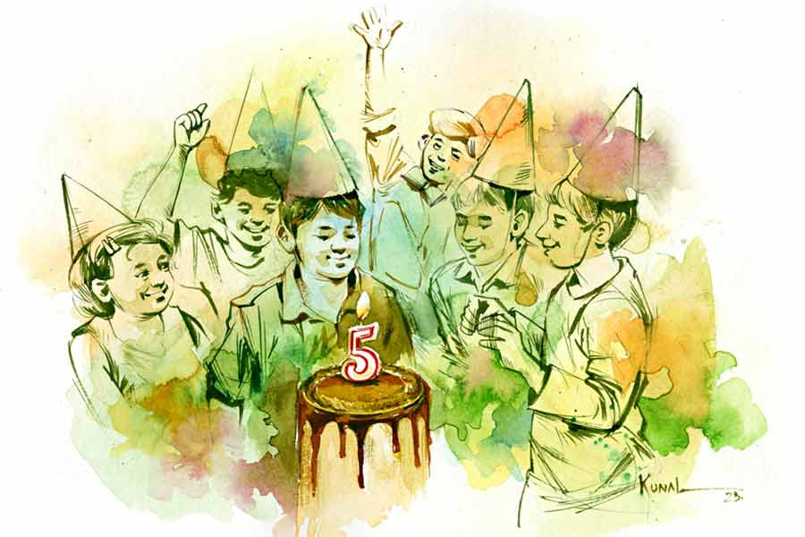

 
 <h1 align=center>জন্মদিন</h1>
<h2 align=center>শ্রীকান্ত অধিকারী</h2> হরিপদ মোটরসাইকেলটাকে গেটের বাইরে স্ট্যান্ড করাতে
না
করাতেই জোরে হাঁক দেয়, “শুনছ, তাড়াতাড়ি হাজার
তিনেক টাকা দাও তো। কেক আর আইসক্রিমটা নিয়ে আসি।”

লক্ষ্মী আলমারি খুলে ছোট একটা ব্যাগের চেন টেনে বলে, “তখন তোমায় পইপই করে বললাম, অত হ্যাপা নিতে হবে
না, ক্যাটারিংকে সব দায়িত্ব দিয়ে দাও। তা না ফ্যাচাং
করে বড় দোকান থেকে নিজে নিয়ে আসবে। কেন, অত বাড়াবাড়ি না
করলেই কি নয়!”

হরিপদ মানিব্যাগে পাঁচশো টাকার নোট ছ’টা ঢুকিয়ে রাখতে রাখতে বলে, “ঠিক সময়েই মনে করিয়েছ লক্ষ্মী, পাঁচটা বেজে গেল
ক্যাটারারদের কাউকে উঁকি মারতে দেখছি না। ফোনটা দাও তো।”

ফোন হাতে দিয়ে লক্ষ্মী আরও কিছু একটা এগিয়ে দেয়, বলে, “চট করে এটা পরে ফেলো। হাতটা কেমন খালি-খালি
লাগছে।”

“না না! এ আমি পরব না!” ভয়ঙ্কর কিছু দেখে ফেলার
মতো হরিপদ চমকে ওঠে, “কোথায় হারিয়ে ফেলব। কিংবা কেউ আমার আঙুল
কেটে আংটিটাই চুরি করে নেবে, দাম কত বলো তো! বড্ড রিস্ক হয়ে যাবে।”
হরিপদ কিছুতেই আংটি পরতে রাজি হয় না।

“আজ পরবে না তো কবে পরবে?”
লক্ষ্মী
জোর দিয়ে বলে, “উৎসব-অনুষ্ঠানে পরার জন্যই তো বাবা তোমাকে বিয়েতে
দিয়েছিল... পরো তো। কিচ্ছু হবে না।”

শেষ পর্যন্ত লক্ষ্মীর আবদারের কাছে হার মানে হরিপদ। হাতটা বাড়িয়ে দেয়।
লক্ষ্মী হরিপদর ডান মধ্যমায় সোনার আংটি পরিয়ে দেয়। 

*****

এর মধ্যে লক্ষ্মীর ঘরদোর কাপড়কানি গুছিয়ে সন্ধে-আরতি দেখানো, বাবাইকে সাজানো হয়ে গেছে। বারান্দায় মানিপ্ল্যান্ট আর ছাঁচিপানের লতা
দুটোর ম্যাড়মেড়ে পাতাগুলো ছেঁটে বাড়ির প্রবেশপথটা যতটা পেরেছে দৃষ্টিনন্দন করেছে।
ডাইনিং আর পাশের রুমে কেটারারদের কাছ থেকেই ভাড়া করা প্যান্ডেলের চেয়ার ক’টা বসিয়েছে।
ওরা মা-ছেলেতে বেলুন ফোলাচ্ছে, হরিপদ তাড়াতাড়ি দরজায় দরজায় দেয়ালে দেয়ালে
লাল নীল সবুজ নানা রঙের বেলুন লাগাচ্ছে। অতিথিরা আসার আগেই কাজটা সামলে উঠতে হবে।
বেসিন সিঙ্ক ভাল করে স্ক্রাব প্যাড দিয়ে ঘষে পরিষ্কার করে দিয়েছে। পর্দাগুলো আগেই
কেচেছে। শুধু বাবাইয়ের পেনসিলে হিজিবিজি আঁকিবুকিগুলো কানি দিয়ে কিছুতেই ওঠাতে
পারেনি।

বাবাইয়ের পড়ার টেবিল থেকে বই-খাতাপত্র সব আলমারিতে তুলে দিয়ে ডাইনিংয়ে
টেবিলটা রেখেছে। এই টেবিলেই জন্মদিনের কেক কাটা হবে। টেবিলের পায়াগুলো রঙিন কাগজ
দিয়ে লক্ষ্মীই মুড়েছে। এমনিতে আজ রান্নাবান্না নেই, তাই সময়ের অভাবও
নেই। যতটা পেরেছে ঘরটাকে ফিটফাট করে তুলেছে। খুঁতখুঁত করে শুধু টেবিলটাকে রাখা
নিয়ে। আর একটা ঘর হলে খুব ভাল হত। একটায় খাট-বিছানা, আর একটায় সেলাইয়ের
মেশিনপত্র। অবসর সময়ে শাড়ির ফলস পাড় লাগানো, টুকিটাকি
সেলাই-ফোঁড়াই পাড়ার মধ্যে বেশ চলে।

গত বছরের মতো কালীমন্দিরে পায়েস ভোগ দিলেই হয়ে যেত, কিন্তু বাবাইয়ের পাঁচ বছরের জন্মদিন তো বার বার আসবে না। তা ছাড়া এই
অছিলায় বন্ধুবান্ধবদের বাড়িতে এনে সামাজিক পরিচিতি আর উচ্চতার গিঁটটা শক্ত করার
সুযোগ কে হাতছাড়া করে! শুধু লোকের বাড়ি গিয়ে খেয়ে এলেই হবে! ওদেরও কি খাওয়াতে সাধ
যায় না!

*****

আমন্ত্রিতরা প্রায় সবাই হরিপদর বাড়িতে এসে গেছে। জন্মদিনের কেক কাটাও
হয়ে গেছে। বাচ্চারা নিজেদের মধ্যে খুনসুটি খেলাধুলোয় ব্যস্ত।

হাতে একটা পকোড়ার প্লেট নিয়ে গিয়ে লক্ষ্মী তুলে ধরে মহিলামহলে।
সেখানে কে নেই! বাবাইয়ের ক্লাসের ফার্স্ট গার্লের মা সুতপা, সেকেন্ড বয়ের মা পামেলা, বাবাই অবশ্য থার্ডই
হয়। তবে ঘাড়ে নিঃশ্বাস ফেলে আরও বেশ কয়েক জন। তাদের সবাইকে সে নেমন্তন্ন করেছে।
আসেনি শুধু দীপিকা। পামেলা একটা পকোড়া মুখে দিয়ে বলে, “ও আসবে না জানতাম।
স্কুলেও দেখিসনি কেমন আলাদা হয়ে থাকে।”

সোনালি বলে ওঠে, “ওর বর তো বড় গাইনো।”

“তাই তো মাটিতে পা পড়ে না।”

“হবে না! ফিগারটা দেখেছিস!”

“শুনেছি নাকি জিমে যায়।”

এরই মাঝে আরও এক প্লেট বেবি কর্ন পকোড়া নিয়ে আসে লক্ষ্মী। সঙ্গে
ঠান্ডা পানীয়। হাসি মুখে এক বার মহিলাদের দলে, তো আর এক বার
পুরুষদের দলে ঘুরে ঘুরে প্লেট দিয়ে আসে। কেটারার ছেলেটাও রেডি আছে স্ন্যাক্স
দেওয়ার জন্য।

“তবে যে যা-ই বলে বলুক বাপু, তোমার চেহারাটা একেবারে মা লক্ষ্মী!” পামেলা বলে, “নোজ়-পিনটাও তোমার গোল মুখে বেশ মানিয়েছে। হিরে তো, না কি?”

লক্ষ্মী লজ্জায় মরে যায়। গ্রাম ছেড়ে আসা থেকেই দেখেছে শহরের মেয়েরা কী
সুন্দর সাজে। যেন সিরিয়ালের নায়িকা। তাকে নিয়েও যে এমন কথা কেউ বলতে পারে, এই প্রথম দেখল। তবে হরিপদ প্রায়ই ওকে পার্লার যাওয়ার জন্য জোরাজুরি
করে। সে নিজেই আগ্রহ দেখায়নি। বলে, “এই বেশ আছি। শুনেছি
এক বার ভুরুর লোম ক’টা তুললেই একশো টাকা। কী দরকার! তার চেয়ে পাঁচ কেজি আলু হবে।
খেয়েদেয়ে বাঁচব। আমরা মধ্যবিত্ত।”  

হরিপদ ছদ্মরাগ দেখিয়ে বলে, “মধ্যবিত্তরাও সাজে, বুঝলে।”

লক্ষ্মীর চোখে খুশি ছড়িয়ে পড়ে। নাকে হাত দিয়ে নাকছাবিটা ছুঁয়েও নেয়।
মনের সমস্ত লজ্জা ও ভাল-লাগা শরীরে ঢেলে গদগদ হয়ে বলে, “প্রথম
বিবাহবার্ষিকীতে ও দিয়েছিল। এক মাসের পুরো বেতন দিয়ে।” 

পুরুষদের মধ্যে লিড করছে একটু গ্রাম্ভারি গোছের সুবীর। হরিপদর পিঠ
চাপড়ে দিয়ে সুবীর বলে, “পজ়িটিভ স্টেপ। গ্রামে এখন আছেটা কী! না
আছে কালচার, না আছে এডুকেশন। ওনলি পরনিন্দা পরচর্চা।”

হরিপদ ভাবে, সত্যি কথা। গ্রামে আগের মতো পড়াশোনার
হিড়িক নেই, চেষ্টা নেই, কেবল রেষারেষি আর
হিংসে। শহরে থেকে ছেলে মানুষ করার খরচা আছে, কিন্তু এক বার মানুষ
হয়ে গেলে আর চিন্তা নেই।

“বুঝলে হরিপদ, তুমি প্রাইমারি
টিচার হতে পারো, কিন্তু দূরদর্শিতা আছে!” একটা বড় পকোড়ায় নুন
ছিটিয়ে কামড় বসিয়ে পার্থবাবু বলে, “কী তেলে ভেজেছ ভাই? ফ্যান্টাস্টিক টেস্ট! খেয়ে দেখুন সৌম্যবাবু।”

“আর দুটো দিই দাদা!” হরিপদর গর্বে বুক ফুলে ওঠে। 

হরিপদ এটাই তো চেয়েছিল! শহরের শিক্ষিত মানুষজন তার বাড়িতে আসবে, তাদের কালচারের সঙ্গে ছেলে মিশবে, তাদের মতো হবে। এক
বাবা এর বেশি কী চায়। সঙ্গে সঙ্গে নিজেদের স্টেটাসটাও উঠিয়ে নেওয়া হবে।

হরিপদ ছেলেটার দিকে নিষ্পলক চেয়ে থাকে। কী সুন্দর শহরের ছেলেদের সঙ্গে
মিশে গেছে। ভাগ্যিস ওর মা আজকেই শার্ট-প্যান্টটা কিনেছিল! ইংরেজিতে ঝরঝর করে কথা
বলছে। ভাবা যায়! বাবাইয়ের মানুষ হওয়া মানে তো ওর স্বপ্নপূরণ।

হুল্লোড় যখন তুঙ্গে, কেটারার এসে জানিয়ে যায়, ওরা রেডি।

কে যেন বলল, “এক সঙ্গে সবার হবে না, প্লেসটা বড্ড ছোট। তার চেয়ে বাচ্চারা আগে খেয়ে নিক। পরের ব্যাচে না-হয়
আমরা বড়রা বসব।”

হরিপদ ভাড়া করা স্ট্যান্ডফ্যানটা দরজার সামনে লাগিয়ে দেয়।

খাওয়া শেষে টুথপিক আর এক গ্লাস করে ঠান্ডা পানীয় ধরে দিলে, সুবীরবাবুরা একযোগে বলে, “এ সব আবার কেন!”

তার পর টুথপিক তুলে নিয়ে মৃদু ঢেকুর তোলে, “ওহ! মাটন কষাটা
ফ্যান্টাস্টিক! যা জমিয়েছে না।”

আর এক জন বলে ওঠে, “এমন জমাটি খাওয়া অনেক দিন খাইনি ভাই। আসলে
কী জানো হরিপদ, শুধু টাকা থাকলেই হয় না,
চওড়া মন
থাকা চাই।”

কিছু একটা গুরুত্বপূর্ণ জিনিস ভুলে গিয়েছিল এখন মনে পড়েছে, এমন ভাব দেখিয়ে লক্ষ্মী বলে, “এই যাঃ দেখুন দেখি!
ভুলেই গেছি একদম...” বলেই ঘর থেকে একটা করে রংপেনসিলের বাক্স আর ড্রয়িং খাতার সেট
এনে বাচ্চাদের হাতে তুলে দেয়। তাদের গ্রামে এ সব রিটার্ন গিফ্টের চল নেই। শহরে
এসেই এ সব আদবকায়দা শেখা। লক্ষ্মীর মুখচোখ থেকে চুঁইয়ে পড়ে প্রচ্ছন্ন গর্বের
হাসি।

*****

কেটারার ছেলেটা দাঁড়িয়ে ছিল তখনও। সে হরিপদকে ডেকে বলে, “দাদা, প্লেটের হিসেবটা একটু দেখুন। পঁচিশটা
প্লেট বেশি হয়েছে।”

“কিন্তু আপনারা যে সে দিন বললেন, নিমন্ত্রিতের টোয়েন্টি পার্সেন্ট আসে না, তাই তো টোটালের থেকে
জনাকুড়ি কমিয়ে...”

“আমাদের অভিজ্ঞতা তো তাই বলে। কিন্তু ওই হিসেব
এখানে খাটেনি। উপরন্তু বেশ ক’টা মিল অনেকে বাড়ির জন্য নিয়ে গেছে। অর্থাৎ বাড়তি
হয়েছে আপনার পঁচিশটা। আপনাকে জানাইনি, কারণ আপনি তখন
ব্যস্ত ছিলেন, তবে আমরা কায়দা করে ম্যানেজ করে দিয়েছি। যাই হোক
যা কথা ছিল, তার চেয়ে আপনি পঁচিশ ইন্টু সাড়ে চারশো মানে এগারো
হাজার দু’শো পঞ্চাশ টাকা হয়, আপনি এগারো হাজার টাকাই দিন।”

এক রাশ দুশ্চিন্তা ধস নামার মতো মাথায় নামে হরিপদর। সে ভেবেছিল ওর
কাছে যা আছে, তা দিয়েই কোনও মতে চালিয়ে নেবে। হরিপদ আঁতিপাঁতি
করে আলমারি, বাক্সের খাঁজ-খোঁজ, ব্যাগ, কাপড়ের ভাঁজ হাতড়ায়। ব্যাঙ্কের পাসবইয়ে মিনিমামটুকুই পড়ে। সে জানে
তার বাড়তি টাকা নেই, তবু খোঁজে। যদি পেয়ে যায়।

হঠাৎ বিদ্যুৎ চমকানোর মতো মাথায় বুদ্ধি খেলে। কিছুটা এগিয়ে থমকে
দাঁড়ায়। এমন কাজ সে কোনও দিন করেনি। অন্য সময় হলে বন্ধুদের কাছে দু’-দশ দিনের জন্য
টাকা ধার মেলে, কিন্তু আজকের দিনে ধার চাওয়া অপমানজনক। আর কোনও
পথ খোলা আছে কি! যেটা আছে, সে পথে সে কোনও দিন হাঁটেনি।

*****

বাবাই ঘুমে আচ্ছন্ন। লক্ষ্মী বিছানায় শুয়ে এ পাশ-ও পাশ করে। সারা
দিনের ধকলে সহজে ঘুম আসে না। তবে একটা স্বস্তি অনুভব করে,
ভাল কাজ
ভাল ভাবে সম্পন্ন হলে মন ভাল হয়ে ওঠে। লক্ষ্মী বলে, “ক্যাটারিংটা বাপু
খুব ভাল করেছিলে। সব রান্নাগুলোই মুখে লেগে থাকার মতো। নাহ, আমার বাবা বেছে বেছে জামাইটা ভালই করেছে।” লক্ষ্মী খুশিতে হরিপদর বুকে
হাত রাখে।

হরিপদ চিত হয়ে শুয়ে। ঠান্ডা গলায় বলে, “হুঁ, নামকরা ক্যাটারার কি না।” বলার ইচ্ছে থাকলেও বলতে পারে না, গুড়ও ভালই ঢালতে হয়েছে, না হলে মিষ্টি কম
হয়ে যেত।

আর কথা নেই। ও দিকে লক্ষ্মী কখন ঘুমিয়ে গেছে,
ঘুম আসে
না হরিপদর। চোখের পাতা বন্ধ করলেই কেটারার ছেলেটার কথা সামান্য বিরক্ত মুখ মনে পড়ে, “মাস্টার! যেমন পাঞ্জাবি, তেমন পকেটই ভাল।
বুঝেশুনে খরচ করলেই পারতেন। মাটন কষা, চিকেন চাঁপ, দই কাতলা— ঘটা করার সময় খেয়াল রাখেননি, এখন পিছিয়ে গেলে
চলবে! আমার কিন্তু কালকেই লাগবে। আমি পেমেন্ট ডিউ রাখি না।”

সকালে ঘুম থেকে উঠতে দেরি হয়েছে হরিপদর। আজ অবশ্য স্কুলে যাবে না।
ঘরটা ভাল করে পরিষ্কার করতে হবে। বাথরুম থেকে বেরিয়েই হরিপদর মেজাজ বিগড়ে যায়।
ডাইনিংয়ে ডাঁই হয়ে পড়ে থাকা উপহারের স্তূপে মা ছেলে হুমড়ি খেয়ে লুটোপুটি খাচ্ছে।
হরিপদকে দেখে লক্ষ্মী বেশ খুশিতেই বলে, “তোমার বন্ধুরা কত
গিফ্ট দিয়েছে গো।”

রাগে চিৎকার করতে ইচ্ছে হল হরিপদর। কিন্তু রাগটাকে গিলে নিয়ে লক্ষ্মীর
কাছে এসে বলে, “একটু শোনো তো। তোমার কাছে হাজার দশ-বারো টাকা হবে? খুব দরকার...” 

হরিপদর কথায় লক্ষ্মী আকাশ থেকে পড়ে, “আমার কাছে যা ছিল
তুমি তো কালকেই সব নিয়ে নিলে। আর আমার নিজের আলাদা যেটুকু জমানো ছিল, তা থেকেই বাচ্চাগুলোকে রিটার্নিং গিফ্ট দিলাম,
দেখলে
না।” উত্তেজনায় সদ্য-শেখা ইংরেজি গুলিয়ে গেছে লক্ষ্মীর। 

“আরে দেখোই না... এ দিক-ও দিক করে যদি কিছু থাকে।
তোমার লক্ষ্মীর ভাঁড়?”

“সে তো ডিসেম্বরেই মাসাঞ্জোর বেড়াতে গিয়ে ভেঙেছিলে।
আর তো ভাঁড় কেনাই হয়নি।”

নির্বাক হয়ে হাতের আঙুল মটকানো ছাড়া হরিপদর উপায় থাকে না। বজ্রাঘাতের
মতো কেটারার ছেলেটার কথাটা ফের মাথায় বেজে ওঠে, “মাস্টার! যেমন
পাঞ্জাবি, তেমন পকেটই ভাল।” 

“এখন কী হবে?” এক রাশ অন্ধকার
লক্ষ্মীর চোখেমুখে।

নিরুত্তর হরিপদ শুধু লক্ষ্মীর অসহায় মুখের দিকে চেয়ে থাকে। তার
অন্ধকার মুখ থেকে নাকছাবিটা জ্বলজ্বলে উপহাস ঠিকরে দেয়।

*****

সে দিন দুপুরবেলা এ দিক-ও দিক দেখে নিয়ে হরিপদ টুক করে একটা গয়নার
দোকানে ঢোকে। দোকানে মালিক ছাড়া কেউ নেই। জানে এ সময় খরিদ্দার থাকে না। তাই সাহস
করেই বলে, “দাদা, বলছিলাম এই আংটিটা
দিয়ে ক্যাশ কত পাব? ভীষণ জরুরি দরকার।”

তার হাতে বিয়ের আংটি। যেটা কাল সে পরতেই চাইছিল না।

লিচুপট্টির একমাত্র জুয়েলারি শপের মালিক হরিপদর পরিচিত। আংটি হাতে
নিয়ে বলে, “এমনি বলা মুশকিল। ওজন করে দেখতে হবে। তার আগে বলো
তো ভাই, বৌমা একটু আগে এসে একটা হিরের নাকছাবি বেচে গেল, বলল খুব নাকি দরকার। আবার তুমিও আংটি দিতে এসেছ... কী এমন জরুরি
ব্যাপার?

হরিপদ কোনও জবাব দিতে পারে না। অন্যমনস্ক ডান হাতের মধ্যমায় আটকে থাকা
আংটিটা ঘুরিয়েই যায়। ছেলের জন্মদিনের সন্ধেয় কেনা উঁচু শহুরে স্টেটাসের দামটা ঠিক
কত পড়ল, বুঝে উঠতে পারে না।