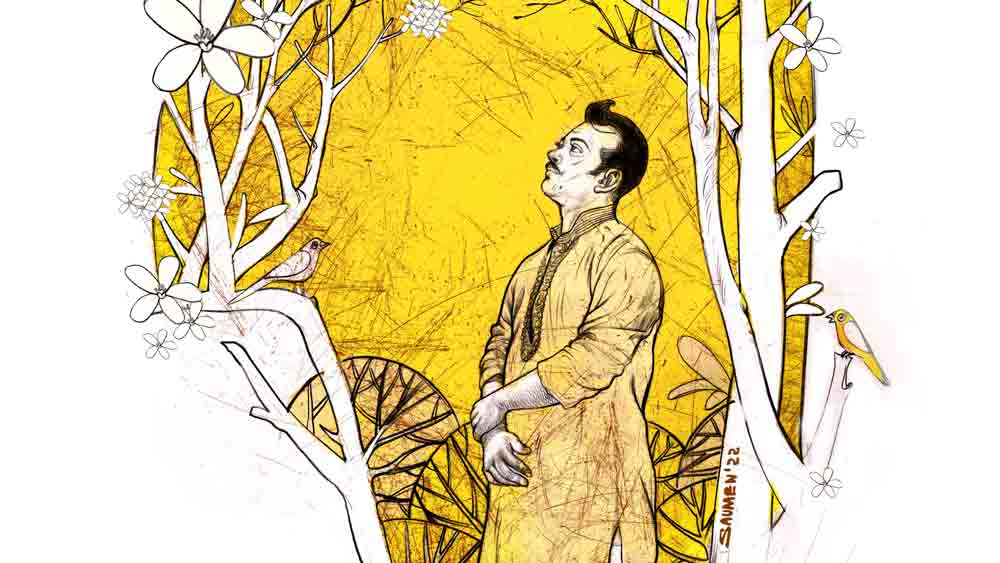

 
 <h1 align=center>জন্মদিনের উপহার</h1>
<h2 align=center>সুমন মহান্তি</h2> সদর দরজায় কয়েকবার টোকা দিল কেউ। দরজা খুলে চমকে গেল শাশ্বত। বাবা এসেছে! সাদা হাফশার্ট আর নীল প্যান্ট পরনে, নিখুঁত ভাবে শেভ করা গাল, মাথার পাকা চুল মৃদু উড়ছে হাওয়ায়, বাদামি স্লিপার পায়ে। বাবাকে বেশ উজ্জ্বল এবং ঝলমলে দেখাচ্ছে। মহীন ড্রয়িংরুমে বেতের চেয়ারে বসে বললেন, “বাহ! ঘরটা একেবারে অন্য রকম দেখাচ্ছে।”

শাশ্বত বলল, “হ্যাঁ। দেয়ালে নোনা ধরছিল, চাকলা খসে খসে পড়ছিল। মেঝেটাও ফেটে যাচ্ছিল। তাই রিনোভেট করালাম।”

“তাই তো দেখছি। মেঝেতে মার্বেল বসিয়েছিস, দেয়ালের প্রায় পুরোটাই টাইলস দিয়ে মুড়েছিস।”

শাশ্বত বলল, “এ ছাড়া উপায় ছিল না।”

মহীনের মুখে মৃদু হাসি, “ঠিক করেছিস। তুই এমনিতে ঘরের কাজ করানোর ব্যাপারে উদাসীন। তাও ভাল যে সময়ে কাজটা করিয়েছিস। বৈষয়িক দিক থেকে মুখ ঘুরিয়ে থাকাটা ঠিক কথা নয়। বাগানের গেটটাও নতুন করিয়েছিস দেখছি। সুন্দর হয়েছে গ্রিলের গেটটা। ডিজ়াইনটা খাসা, রংটাও বেশ। শুরুতেই মন ভরে গেল।”

শাশ্বত বলল, “তোমার ঘরটাও রিনোভেট করিয়েছি। মেঝে বসে গিয়েছিল, জায়গায় জায়গায় ফাটল ধরেছিল। কত বার বলেছিলাম যে মেঝেটা খুঁড়ে মার্বেল বসিয়ে দিই। ওটা করতে বড়জোর চার-পাঁচ দিন লাগত। তুমি কিছুতেই রাজি হলে না। নিজের ঘর ছেড়ে অন্য ঘরে নাকি ঘুম হবে না, কত রকম আপত্তি। শেষে তুমিই কিন্তু বলেছিলে, ঘরে ফিরে মেঝেটা নতুন করে করাতে হবে, পুরনো তক্তপোশ ফেলে দিয়ে একটা নতুন ডিভান কিনতে হবে।”

মহীনের মুখে লজ্জার আভাস, “বলেছিলাম বুঝি?”

“হ্যাঁ। তোমার মনে থাকার কথাও নয়। তখন তুমি এক রকম ঘোরের মধ্যে ছিলে। দেখে যাও এক বার  ভেতরে এসে।”

মহীন যেন একটু বিব্রত হলেন, বললেন, “ওই রুমে তো আমি যেতে পারব না।”

“কেন?”

ঘাড় নাড়লেন মহীন, “বুঝছিস না কেন? এই বাইরের ঘর কাম ড্রয়িংরুম হল আমার লক্ষ্মণরেখা। এই বাড়ির অন্দরমহলে আমার পা রাখা নিষেধ।”

“কে নিষেধ করেছে? সত্যি তোমাকে নিয়ে আর পারা যায় না। বড় জেদি স্বভাব তোমার,” শাশ্বত রাগত গলায় বলল।

মহীন মুচকি হাসলেন, “তোর তর্ক করার স্বভাবটা এখনও যায়নি দেখছি। আমার সঙ্গে তোর ঝগড়াও কম হত না। তুইও বেশ জেদি। অন্দরমহলে আমার যাওয়া চলবে না। এত দিন পরে এসেছি, এটাই অনেক। তুই বরং একবার পর্দাটা তুলে দে। পর্দা তুলে দিলেই আমার ঘরটা দিব্যি দেখা যাবে।”

শাশ্বত পর্দাটা তুলে দিল। নিজের রুমের দিকে এক দৃষ্টে কিছু ক্ষণ তাকিয়ে চোখ ফিরিয়ে নিলেন মহীন। নিঃশ্বাস ফেলে বললেন, “বেশি ক্ষণ তাকালেই মায়া পড়ে যাবে। রং করিয়েছিস। মেঝেটাও বেশ সুন্দর হয়েছে। তবে তক্তপোশটা রেখেছিস কেন এখনও? নতুন মেঝে, দেয়ালে সূর্যমুখী হলুদ রং, ওখানে ওটা বেমানান লাগছে।”

“ঘরটা ফাঁকাই পড়ে থাকে। খুব গরমে দুপুরবেলা নীচে এসে তোমার ঘরটায় শুই। এ ছাড়া ঘরটা তেমন ব্যবহার হয় না। তক্তপোশ বদলানোর ইচ্ছে তাই হয়নি।”

“ড্রয়িংরুম আর আমার ঘর রিনোভেট করালি, বাগানে বড় গ্রিলের গেট, পাঁচিলে পেরেক বসিয়েছিস। তার মানে তো সব মিলিয়ে ভালই খরচা হয়েছে। তা মোট কত খরচ হল?”

শাশ্বত উত্তর দিল, “হিসেব রাখিনি। এক লাখ বা এক লাখ দশ ও রকমই লেগেছে।”

“এ কী রকম কথা! কত খরচ-খরচা হল তার এগজ়্যাক্ট হিসেব রাখবি না? একটু তো বিষয়বুদ্ধি রাখতে হবে। বয়স কম হল
না তোর,” মহীনের গলায় মৃদু তিরস্কার, “গ্যারেজ করানোয় খরচা পড়ল কত?”

শাশ্বত অস্বস্তির স্বরে বলল, “জানি না। তোমাকে বলাই হয়নি যে, একটা ফোর-হুইলার কেনা হয়েছে চার বছর আগে।”

“তুই কিনেছিস?”

“না, আমি নই। রিনি কিনেছে। গ্যারেজটা ও করিয়েছে। তাই ও সব খরচের অঙ্ক রিনিই জানে।”

মহীন হাসেন, “না বললেও দেখামাত্রই বুঝেছি। গাড়ি কেনার এলেম তোর নেই। রিনি যথেষ্ট হিসেবি, বৈষয়িক। ও-ই সমস্ত কিছু করিয়েছে। এই যে এত ক্ষণ রিনোভেশনের গল্প শোনাচ্ছিলি ওটারও সম্পূর্ণ দেখাশোনা রিনি করেছে। মালপত্র এনে দেওয়া ছাড়া তুই কিচ্ছুটি করিসনি। কী রে, ঠিক বলেছি তো?”

শাশ্বত হেসে ফেলল, বলল, “একটুও ভুল নেই। এই সংসারে সবার ধাত তোমার থেকে ভাল কে আর বুঝবে?”

মহীন বাগানের দিকে তাকিয়ে বললেন, “বাগানটা মোটামুটি পরিষ্কার আছে। গ্যারেজ করার জন্য কোনও গাছ কাটার দরকার পড়েনি। তবে দুটো গাছ দেখতে পাচ্ছি না। কাঞ্চন ফুলের গাছটার কী হল?”

“মরে গেছে।”

“পাতাবাহার গাছ?”

“মা বাগান পরিষ্কার করার সময়ে কাটিয়ে দিয়েছে।”

মহীন অন্যমনস্ক ভঙ্গিতে বললেন, “গাছ লাগানো, গাছের পরিচর্যা, মাটি খোঁড়া এই সব নিয়েই থাকতাম। টবের সুপুরি গাছগুলো বেশ যত্নেই রয়েছে দেখছি। করবী গাছটায় প্রচুর ফুল এখন, পাঁচিল ছাড়িয়ে রাস্তার ওপরে ঝুঁকে পড়েছে। আসার সময় দেখলাম অনেকটা রাস্তা জুড়ে ঝরা ফুলগুলো
ছড়িয়ে পড়েছে।”

শাশ্বত বলল, “কিছু দিন আগেও ওই ফুলটার নাম জানতাম না। এক কোলিগ এসেছিল বাড়িতে। সে দেখে নাম বলল। করবী। বৃষ্টি এলেই করবী ফুল প্রথম ফোটে। এ সব কিছুই জানতাম না।’’

“গাড়িটা দেখে আনন্দ হলেও ভয় হচ্ছে। তুই ড্রাইভ করিস?”

“না। শেখার চেষ্টা করেছিলাম। দেড় মাস ধরে শেখার পরে টুকটাক চালাচ্ছিলাম, পাশে অবশ্য ট্রেনার থাকত। এক দিন ল্যাম্পপোস্টে ধাক্কা মেরে দিলাম, খেয়ালই করিনি যে রাস্তার পাশেই ওটা আছে। গাড়ির বনেট কিছুটা তুবড়ে গেল। ব্যস, রিনি গাড়ির চাবি কেড়ে নিয়ে রেখে দিল। আর চালাতেই দিল না। এখন কোথাও গেলে ড্রাইভার নিয়েই যাই।”

মহীন স্বস্তির নিঃশ্বাস ফেলে বললেন, “শাপে বর হয়েছে। তোর হাতে গাড়ির স্টিয়ারিং! ভাবতেই বুকটা ছ্যাঁত করে উঠেছিল। সব সময় যে অন্যমনস্ক, নিজের খেয়ালে ডুবে থাকে, সে গাড়ি চালালে বিপদ হতে কত ক্ষণ?”

“চিরকাল তুমি আমাকে আন্ডারএস্টিমেট করেই এলে!” শাশ্বতর গলায় অনুযোগের সুর।

“ভুল বললি। ঠিকঠাক এস্টিমেটই করেছি,” মহীনের গালে হাসির ভাঁজ, “তুইই বরং আমাকে হতাশ করেছিস। তোর বিদ্যেবুদ্ধির ওপর আমার বরাবরই খুব আস্থা ছিল, কিন্তু তুই সে ভাবে প্রতিষ্ঠিত হতে পারলি না।”

শাশ্বত ঈষৎ বিরক্তি নিয়ে তাকাল, “এই বয়সেও আমার কেরিয়ার নিয়ে হা-হুতাশ করাটা হাস্যকর। এখন আমার মেয়ের কেরিয়ার তৈরির সময়, বুঝেছ?”

মহীনের চোখের তারায় অস্থিরতা ফুটে ওঠে, “হ্যাঁ, তাই তো! স্নেহার এখন কলেজে পড়ার কথা। কী অন্যায় বল তো! নাতনিটার খোঁজই নেওয়া হয়নি এত ক্ষণ।”

“ও তো এখন ওপরে অনলাইন ক্লাস করছে। ওকে এক বার এখানে ডাকি তা হলে?”

মহীন অসহায় চোখে তাকালেন, “না। ওকে ডাকিস না। একমাত্র তোর সঙ্গে দেখা করারই অনুমতি মিলেছে। অন্য কারও সঙ্গে দেখা
করা চলবে না। রিনি, স্নেহা, এমনকি তোর মায়ের সঙ্গেও দেখা করা যাবে না। খুব ইচ্ছে করছে, জানিস? তবুও আমি নিরুপায়।”

“এই সব অনুমতি-শর্ত কে দিয়েছে তোমাকে?”

“আছে কেউ এক জন। যাকে চোখে দেখা যায় না, অনুভব করা যায় না। বুঝেছিস?”

“তুমি ঈশ্বরের কথা বলছ?”

“হ্যাঁ।”

শাশ্বত গভীর তাচ্ছিল্যে গলা উচ্চগ্রামে তোলে, “যত্ত সব ভুলভাল ধারণা। তুমি এখনও এই সবে বিশ্বাস রাখো? চিরকাল দেখে আসছি, পৃথিবীতে ভাল মানুষেরা কষ্ট পায় আর বদের হাঁড়িরা দিব্যি রসেবশে আরামে তোয়াজে বেঁচেবর্তে থাকে। তুমিও কি কম কষ্ট পেয়েছ? মনে করে দেখো, হার্টের অপারেশন দিয়ে শুরু, তার পর তো…”

হাত তুলে থামিয়ে দিলেন মহীন, “ও রকম বলিস না। তোর তর্ক করার ভঙ্গিটা এখনও আছে। বলেইছি তো, যে আজ এত দিন পরে বাবা-ছেলের পুরনো তর্কের অভ্যেসটা আর না ফিরে আসাই ভাল। তা স্নেহা কী পড়ছে এখন?”

“নিউট্রিশন অনার্স। কলকাতার সুধীরলাল কলেজে পড়ছে। তোমার নাতনি কিন্তু পড়াশোনায় খুব সিরিয়াস, রেজ়াল্টও ভাল করছে। ওর মধ্যে প্রতিষ্ঠিত হওয়ার তাগিদটা আছে।”

“বাহ!” মহীন খুশিতে মাথা দোলালেন, “জানতাম যে দিদিভাই আমার ভালই করবে। হস্টেলে থাকে?”

“হ্যাঁ।”

“ঠিকঠাক খাওয়াদাওয়া করে?”

“না, ওই অভ্যেসটা আজও বদলায়নি,” শাশ্বতর গলায় আক্ষেপ, বলল, “এত খোঁজখবর নিচ্ছ সবার, এ দিকে কাউকে দেখতেও চাইছ না। তুমি তো এ রকম ছিলে না। সংসারসর্বস্ব মানুষ এত দিন পরে নিজের পরিবারের কাউকে দেখতে চাইছে না, এড়িয়ে যাচ্ছে! স্ট্রেঞ্জ!”

মহীন কিছু ক্ষণ চুপ থেকে মৃদু গলায় জিজ্ঞেস করলেন, “তোর মা কেমন আছে?”

“সুস্থ, স্বাভাবিক।”

“কী ভাবে সময় কাটায় এখন?’’

শাশ্বত হালকা গলায় বলল, “ফোন করে খুব। যত চেনাজানা, আত্মীয়-স্বজন, বন্ধুবান্ধব। ওতেই অনেক ক্ষণ কাটে। তার পর সন্ধে থেকেই টিভিতে সিরিয়াল দেখে একটার পর একটা।”

“আর কী করবে?” মহীন বললেন, “কখনও বাইরের জগতে মিশল না। গুটিকয় বাতিকগ্রস্ত আত্মীয়স্বজন ছাড়া কিছুই চিনল না!”

শাশ্বত মজা পেল, “দু’জনে তো সারা জীবন ঝগড়া করেই কাটালে। আজ যখন এসেছ আর এক রাউন্ড হয়ে যাক।”

মহীন গম্ভীর হয়ে বললেন, “বয়স হলে তোদেরও হবে, বুঝেছিস? মধ্যবিত্ত জীবনে ওটাই নিয়ম। যাকগে, আসল কথায় আসি। একমাত্র তোর কারণ দেখিয়েই আসার ছাড়পত্র মিলেছে। বেশি ক্ষণ থাকা যাবে না, এ বার উঠতে হবে। বলছি, বার্থডে কেক অর্ডার দেওয়া হয়েছে?”

শাশ্বত মাথা নেড়ে জবাব দিল, “না, না। ওদের বারণ করে দিয়েছি।”

মহীন নড়েচড়ে বসেন, “কেন বারণ করেছিস?”

শাশ্বত বলল, “ধুর! এই বয়সে আবার জন্মদিন! বুড়ো হতে চললাম। মেঘে মেঘে অনেক বেলা হল। এখন ওই সবে কেমন লজ্জা করে, বিড়ম্বনা মনে হয়।”

“বাহানা দেখাস না। কত আর বয়স হয়েছে তোর? মাত্র পঞ্চাশ। বার্থডের গোল্ডেন জুবিলি বলে কথা! সেটা এ রকম নিষ্প্রভ, ম্যাড়মেড়ে হবে? খবরদার, তুই ওদের বারণ করবি না। ভীষণ রাগ হবে আমার। প্রমিস কর আমার গা ছুঁয়ে!” বেশ উত্তেজিত দেখায় মহীনকে।

শাশ্বত মহীনের ডান হাত ছোঁয়ামাত্র কেঁপে উঠল। বিস্মিত গলায় জিজ্ঞাসা করল, “তোমার শরীর এত ঠান্ডা কেন?”

মহীন কোনও উত্তর না দিয়ে দ্রুতপায়ে বাগানের গেট পর্যন্ত এগিয়ে গেলেন। শাশ্বত প্রায় দৌড়ে গিয়ে মহীনের সামনে গিয়ে বলল, “সে কী! তুমি চলে যাচ্ছ? এটা কি ঠিক হচ্ছে? এই ঘর, এই পরিবার সবই তোমার। তুমি এত নিষ্ঠুর!”

মহীন শান্ত ভাবে বললেন, “জীবনের যা নিয়ম! তা তোকে-আমাকে সবাইকেই মেনে নিতে হবে। আমিও দেখছি তোর মতোই ভুলোমনা হয়ে যাচ্ছি। ছেলের কাছে এসেছি, পকেটে একটা টাকাও নেই। তোর জন্মদিনে আমি যে কিছুই দিতে পারলাম না! খুব ভুল হয়ে গেল।”

“এটা কিন্তু নিজের ছেলের সঙ্গে বড় বেশি ফর্মালিটি হয়ে যাচ্ছে বাবা!” শাশ্বত মুখ ব্যাজার করল।

মহীন পাঁচিলের ওপরে ঝুঁকে পড়া করবী গাছটির দিকে তাকালেন। তার পর হাসিমুখে বললেন, “না রে, ফর্ম্যালিটি নয়। নিজের ছেলের পঞ্চাশতম জন্মদিনে কিছু যে দিতে ইচ্ছে হয়।”

মহীন তার পর হাত বাড়িয়ে দিলেন করবী গাছের ডালটির দিকে। অবিশ্বাস্য ভাবে লম্বা হয়ে চলেছে তার হাত, সেই প্রসারিত হাতে কয়েকটি ফুল তুলে তিনি ক্রমশ মিলিয়ে যাচ্ছেন শূন্যে, হারিয়ে যাচ্ছেন সুরভিত বাতাসে।

 

সকালের নরম আলোয় করবী গাছটির নীচে দাঁড়িয়ে রয়েছে শাশ্বত। ওর প্রতিটি জন্মদিন উপলক্ষে বাবা উতলা হতেন। সারা দিন ব্যস্ত হয়ে থাকতেন। দু’তিন দিন আগে থেকে নিজে দোকানে গিয়ে ছেলের জন্য কেকের অর্ডার দিয়ে রাখতেন। জন্মদিনে ছেলে কী খাবে, কী মেনু হবে তা নিয়ে তাঁর অস্থিরতার শেষ ছিল না। শরীরে মারণরোগ বাসা বেঁধেছে, তবু ওই দিনটায় যেন নতুন উদ্যমে ঘরময় ছুটে বেড়াতেন।

শাশ্বত দাঁড়িয়ে রয়েছে। তার স্থির বিশ্বাস যে করবী গাছ হাওয়ায় দুলে উঠবে এক সময়, থোকা থোকা সাদা ফুলগুলো আশীর্বাদ হয়ে ঝরে পড়বে তার মাথায়। বার্থডে কেক, পঞ্চাশটি মোমবাতি, সুস্বাদু মেনু এই সব পার্থিব আয়োজনের ঊর্ধ্বে এক চিরকালীন আশীর্বাদের জন্য সে মাথা নিচু করে দাঁড়িয়েই থাকবে।

জন্মদিনের সেরা উপহারটির জন্য সে অপেক্ষায় থাকতে চায় আজ...

সদর দরজায় কয়েকবার টোকা দিল কেউ। দরজা খুলে চমকে গেল শাশ্বত। বাবা এসেছে! সাদা হাফশার্ট আর নীল প্যান্ট পরনে, নিখুঁত ভাবে শেভ করা গাল, মাথার পাকা চুল মৃদু উড়ছে হাওয়ায়, বাদামি স্লিপার পায়ে। বাবাকে বেশ উজ্জ্বল এবং ঝলমলে দেখাচ্ছে। মহীন ড্রয়িংরুমে বেতের চেয়ারে বসে বললেন, “বাহ! ঘরটা একেবারে অন্য রকম দেখাচ্ছে।”

শাশ্বত বলল, “হ্যাঁ। দেয়ালে নোনা ধরছিল, চাকলা খসে খসে পড়ছিল। মেঝেটাও ফেটে যাচ্ছিল। তাই রিনোভেট করালাম।”

“তাই তো দেখছি। মেঝেতে মার্বেল বসিয়েছিস, দেয়ালের প্রায় পুরোটাই টাইলস দিয়ে মুড়েছিস।”

শাশ্বত বলল, “এ ছাড়া উপায় ছিল না।”

মহীনের মুখে মৃদু হাসি, “ঠিক করেছিস। তুই এমনিতে ঘরের কাজ করানোর ব্যাপারে উদাসীন। তাও ভাল যে সময়ে কাজটা করিয়েছিস। বৈষয়িক দিক থেকে মুখ ঘুরিয়ে থাকাটা ঠিক কথা নয়। বাগানের গেটটাও নতুন করিয়েছিস দেখছি। সুন্দর হয়েছে গ্রিলের গেটটা। ডিজ়াইনটা খাসা, রংটাও বেশ। শুরুতেই মন ভরে গেল।”

শাশ্বত বলল, “তোমার ঘরটাও রিনোভেট করিয়েছি। মেঝে বসে গিয়েছিল, জায়গায় জায়গায় ফাটল ধরেছিল। কত বার বলেছিলাম যে মেঝেটা খুঁড়ে মার্বেল বসিয়ে দিই। ওটা করতে বড়জোর চার-পাঁচ দিন লাগত। তুমি কিছুতেই রাজি হলে না। নিজের ঘর ছেড়ে অন্য ঘরে নাকি ঘুম হবে না, কত রকম আপত্তি। শেষে তুমিই কিন্তু বলেছিলে, ঘরে ফিরে মেঝেটা নতুন করে করাতে হবে, পুরনো তক্তপোশ ফেলে দিয়ে একটা নতুন ডিভান কিনতে হবে।”

মহীনের মুখে লজ্জার আভাস, “বলেছিলাম বুঝি?”

“হ্যাঁ। তোমার মনে থাকার কথাও নয়। তখন তুমি এক রকম ঘোরের মধ্যে ছিলে। দেখে যাও এক বার  ভেতরে এসে।”

মহীন যেন একটু বিব্রত হলেন, বললেন, “ওই রুমে তো আমি যেতে পারব না।”

“কেন?”

ঘাড় নাড়লেন মহীন, “বুঝছিস না কেন? এই বাইরের ঘর কাম ড্রয়িংরুম হল আমার লক্ষ্মণরেখা। এই বাড়ির অন্দরমহলে আমার পা রাখা নিষেধ।”

“কে নিষেধ করেছে? সত্যি তোমাকে নিয়ে আর পারা যায় না। বড় জেদি স্বভাব তোমার,” শাশ্বত রাগত গলায় বলল।

মহীন মুচকি হাসলেন, “তোর তর্ক করার স্বভাবটা এখনও যায়নি দেখছি। আমার সঙ্গে তোর ঝগড়াও কম হত না। তুইও বেশ জেদি। অন্দরমহলে আমার যাওয়া চলবে না। এত দিন পরে এসেছি, এটাই অনেক। তুই বরং একবার পর্দাটা তুলে দে। পর্দা তুলে দিলেই আমার ঘরটা দিব্যি দেখা যাবে।”

শাশ্বত পর্দাটা তুলে দিল। নিজের রুমের দিকে এক দৃষ্টে কিছু ক্ষণ তাকিয়ে চোখ ফিরিয়ে নিলেন মহীন। নিঃশ্বাস ফেলে বললেন, “বেশি ক্ষণ তাকালেই মায়া পড়ে যাবে। রং করিয়েছিস। মেঝেটাও বেশ সুন্দর হয়েছে। তবে তক্তপোশটা রেখেছিস কেন এখনও? নতুন মেঝে, দেয়ালে সূর্যমুখী হলুদ রং, ওখানে ওটা বেমানান লাগছে।”

“ঘরটা ফাঁকাই পড়ে থাকে। খুব গরমে দুপুরবেলা নীচে এসে তোমার ঘরটায় শুই। এ ছাড়া ঘরটা তেমন ব্যবহার হয় না। তক্তপোশ বদলানোর ইচ্ছে তাই হয়নি।”

“ড্রয়িংরুম আর আমার ঘর রিনোভেট করালি, বাগানে বড় গ্রিলের গেট, পাঁচিলে পেরেক বসিয়েছিস। তার মানে তো সব মিলিয়ে ভালই খরচা হয়েছে। তা মোট কত খরচ হল?”

শাশ্বত উত্তর দিল, “হিসেব রাখিনি। এক লাখ বা এক লাখ দশ ও রকমই লেগেছে।”

“এ কী রকম কথা! কত খরচ-খরচা হল তার এগজ়্যাক্ট হিসেব রাখবি না? একটু তো বিষয়বুদ্ধি রাখতে হবে। বয়স কম হল
না তোর,” মহীনের গলায় মৃদু তিরস্কার, “গ্যারেজ করানোয় খরচা পড়ল কত?”

শাশ্বত অস্বস্তির স্বরে বলল, “জানি না। তোমাকে বলাই হয়নি যে, একটা ফোর-হুইলার কেনা হয়েছে চার বছর আগে।”

“তুই কিনেছিস?”

“না, আমি নই। রিনি কিনেছে। গ্যারেজটা ও করিয়েছে। তাই ও সব খরচের অঙ্ক রিনিই জানে।”

মহীন হাসেন, “না বললেও দেখামাত্রই বুঝেছি। গাড়ি কেনার এলেম তোর নেই। রিনি যথেষ্ট হিসেবি, বৈষয়িক। ও-ই সমস্ত কিছু করিয়েছে। এই যে এত ক্ষণ রিনোভেশনের গল্প শোনাচ্ছিলি ওটারও সম্পূর্ণ দেখাশোনা রিনি করেছে। মালপত্র এনে দেওয়া ছাড়া তুই কিচ্ছুটি করিসনি। কী রে, ঠিক বলেছি তো?”

শাশ্বত হেসে ফেলল, বলল, “একটুও ভুল নেই। এই সংসারে সবার ধাত তোমার থেকে ভাল কে আর বুঝবে?”

মহীন বাগানের দিকে তাকিয়ে বললেন, “বাগানটা মোটামুটি পরিষ্কার আছে। গ্যারেজ করার জন্য কোনও গাছ কাটার দরকার পড়েনি। তবে দুটো গাছ দেখতে পাচ্ছি না। কাঞ্চন ফুলের গাছটার কী হল?”

“মরে গেছে।”

“পাতাবাহার গাছ?”

“মা বাগান পরিষ্কার করার সময়ে কাটিয়ে দিয়েছে।”

মহীন অন্যমনস্ক ভঙ্গিতে বললেন, “গাছ লাগানো, গাছের পরিচর্যা, মাটি খোঁড়া এই সব নিয়েই থাকতাম। টবের সুপুরি গাছগুলো বেশ যত্নেই রয়েছে দেখছি। করবী গাছটায় প্রচুর ফুল এখন, পাঁচিল ছাড়িয়ে রাস্তার ওপরে ঝুঁকে পড়েছে। আসার সময় দেখলাম অনেকটা রাস্তা জুড়ে ঝরা ফুলগুলো
ছড়িয়ে পড়েছে।”

শাশ্বত বলল, “কিছু দিন আগেও ওই ফুলটার নাম জানতাম না। এক কোলিগ এসেছিল বাড়িতে। সে দেখে নাম বলল। করবী। বৃষ্টি এলেই করবী ফুল প্রথম ফোটে। এ সব কিছুই জানতাম না।’’

“গাড়িটা দেখে আনন্দ হলেও ভয় হচ্ছে। তুই ড্রাইভ করিস?”

“না। শেখার চেষ্টা করেছিলাম। দেড় মাস ধরে শেখার পরে টুকটাক চালাচ্ছিলাম, পাশে অবশ্য ট্রেনার থাকত। এক দিন ল্যাম্পপোস্টে ধাক্কা মেরে দিলাম, খেয়ালই করিনি যে রাস্তার পাশেই ওটা আছে। গাড়ির বনেট কিছুটা তুবড়ে গেল। ব্যস, রিনি গাড়ির চাবি কেড়ে নিয়ে রেখে দিল। আর চালাতেই দিল না। এখন কোথাও গেলে ড্রাইভার নিয়েই যাই।”

মহীন স্বস্তির নিঃশ্বাস ফেলে বললেন, “শাপে বর হয়েছে। তোর হাতে গাড়ির স্টিয়ারিং! ভাবতেই বুকটা ছ্যাঁত করে উঠেছিল। সব সময় যে অন্যমনস্ক, নিজের খেয়ালে ডুবে থাকে, সে গাড়ি চালালে বিপদ হতে কত ক্ষণ?”

“চিরকাল তুমি আমাকে আন্ডারএস্টিমেট করেই এলে!” শাশ্বতর গলায় অনুযোগের সুর।

“ভুল বললি। ঠিকঠাক এস্টিমেটই করেছি,” মহীনের গালে হাসির ভাঁজ, “তুইই বরং আমাকে হতাশ করেছিস। তোর বিদ্যেবুদ্ধির ওপর আমার বরাবরই খুব আস্থা ছিল, কিন্তু তুই সে ভাবে প্রতিষ্ঠিত হতে পারলি না।”

শাশ্বত ঈষৎ বিরক্তি নিয়ে তাকাল, “এই বয়সেও আমার কেরিয়ার নিয়ে হা-হুতাশ করাটা হাস্যকর। এখন আমার মেয়ের কেরিয়ার তৈরির সময়, বুঝেছ?”

মহীনের চোখের তারায় অস্থিরতা ফুটে ওঠে, “হ্যাঁ, তাই তো! স্নেহার এখন কলেজে পড়ার কথা। কী অন্যায় বল তো! নাতনিটার খোঁজই নেওয়া হয়নি এত ক্ষণ।”

“ও তো এখন ওপরে অনলাইন ক্লাস করছে। ওকে এক বার এখানে ডাকি তা হলে?”

মহীন অসহায় চোখে তাকালেন, “না। ওকে ডাকিস না। একমাত্র তোর সঙ্গে দেখা করারই অনুমতি মিলেছে। অন্য কারও সঙ্গে দেখা
করা চলবে না। রিনি, স্নেহা, এমনকি তোর মায়ের সঙ্গেও দেখা করা যাবে না। খুব ইচ্ছে করছে, জানিস? তবুও আমি নিরুপায়।”

“এই সব অনুমতি-শর্ত কে দিয়েছে তোমাকে?”

“আছে কেউ এক জন। যাকে চোখে দেখা যায় না, অনুভব করা যায় না। বুঝেছিস?”

“তুমি ঈশ্বরের কথা বলছ?”

“হ্যাঁ।”

শাশ্বত গভীর তাচ্ছিল্যে গলা উচ্চগ্রামে তোলে, “যত্ত সব ভুলভাল ধারণা। তুমি এখনও এই সবে বিশ্বাস রাখো? চিরকাল দেখে আসছি, পৃথিবীতে ভাল মানুষেরা কষ্ট পায় আর বদের হাঁড়িরা দিব্যি রসেবশে আরামে তোয়াজে বেঁচেবর্তে থাকে। তুমিও কি কম কষ্ট পেয়েছ? মনে করে দেখো, হার্টের অপারেশন দিয়ে শুরু, তার পর তো…”

হাত তুলে থামিয়ে দিলেন মহীন, “ও রকম বলিস না। তোর তর্ক করার ভঙ্গিটা এখনও আছে। বলেইছি তো, যে আজ এত দিন পরে বাবা-ছেলের পুরনো তর্কের অভ্যেসটা আর না ফিরে আসাই ভাল। তা স্নেহা কী পড়ছে এখন?”

“নিউট্রিশন অনার্স। কলকাতার সুধীরলাল কলেজে পড়ছে। তোমার নাতনি কিন্তু পড়াশোনায় খুব সিরিয়াস, রেজ়াল্টও ভাল করছে। ওর মধ্যে প্রতিষ্ঠিত হওয়ার তাগিদটা আছে।”

“বাহ!” মহীন খুশিতে মাথা দোলালেন, “জানতাম যে দিদিভাই আমার ভালই করবে। হস্টেলে থাকে?”

“হ্যাঁ।”

“ঠিকঠাক খাওয়াদাওয়া করে?”

“না, ওই অভ্যেসটা আজও বদলায়নি,” শাশ্বতর গলায় আক্ষেপ, বলল, “এত খোঁজখবর নিচ্ছ সবার, এ দিকে কাউকে দেখতেও চাইছ না। তুমি তো এ রকম ছিলে না। সংসারসর্বস্ব মানুষ এত দিন পরে নিজের পরিবারের কাউকে দেখতে চাইছে না, এড়িয়ে যাচ্ছে! স্ট্রেঞ্জ!”

মহীন কিছু ক্ষণ চুপ থেকে মৃদু গলায় জিজ্ঞেস করলেন, “তোর মা কেমন আছে?”

“সুস্থ, স্বাভাবিক।”

“কী ভাবে সময় কাটায় এখন?’’

শাশ্বত হালকা গলায় বলল, “ফোন করে খুব। যত চেনাজানা, আত্মীয়-স্বজন, বন্ধুবান্ধব। ওতেই অনেক ক্ষণ কাটে। তার পর সন্ধে থেকেই টিভিতে সিরিয়াল দেখে একটার পর একটা।”

“আর কী করবে?” মহীন বললেন, “কখনও বাইরের জগতে মিশল না। গুটিকয় বাতিকগ্রস্ত আত্মীয়স্বজন ছাড়া কিছুই চিনল না!”

শাশ্বত মজা পেল, “দু’জনে তো সারা জীবন ঝগড়া করেই কাটালে। আজ যখন এসেছ আর এক রাউন্ড হয়ে যাক।”

মহীন গম্ভীর হয়ে বললেন, “বয়স হলে তোদেরও হবে, বুঝেছিস? মধ্যবিত্ত জীবনে ওটাই নিয়ম। যাকগে, আসল কথায় আসি। একমাত্র তোর কারণ দেখিয়েই আসার ছাড়পত্র মিলেছে। বেশি ক্ষণ থাকা যাবে না, এ বার উঠতে হবে। বলছি, বার্থডে কেক অর্ডার দেওয়া হয়েছে?”

শাশ্বত মাথা নেড়ে জবাব দিল, “না, না। ওদের বারণ করে দিয়েছি।”

মহীন নড়েচড়ে বসেন, “কেন বারণ করেছিস?”

শাশ্বত বলল, “ধুর! এই বয়সে আবার জন্মদিন! বুড়ো হতে চললাম। মেঘে মেঘে অনেক বেলা হল। এখন ওই সবে কেমন লজ্জা করে, বিড়ম্বনা মনে হয়।”

“বাহানা দেখাস না। কত আর বয়স হয়েছে তোর? মাত্র পঞ্চাশ। বার্থডের গোল্ডেন জুবিলি বলে কথা! সেটা এ রকম নিষ্প্রভ, ম্যাড়মেড়ে হবে? খবরদার, তুই ওদের বারণ করবি না। ভীষণ রাগ হবে আমার। প্রমিস কর আমার গা ছুঁয়ে!” বেশ উত্তেজিত দেখায় মহীনকে।

শাশ্বত মহীনের ডান হাত ছোঁয়ামাত্র কেঁপে উঠল। বিস্মিত গলায় জিজ্ঞাসা করল, “তোমার শরীর এত ঠান্ডা কেন?”

মহীন কোনও উত্তর না দিয়ে দ্রুতপায়ে বাগানের গেট পর্যন্ত এগিয়ে গেলেন। শাশ্বত প্রায় দৌড়ে গিয়ে মহীনের সামনে গিয়ে বলল, “সে কী! তুমি চলে যাচ্ছ? এটা কি ঠিক হচ্ছে? এই ঘর, এই পরিবার সবই তোমার। তুমি এত নিষ্ঠুর!”

মহীন শান্ত ভাবে বললেন, “জীবনের যা নিয়ম! তা তোকে-আমাকে সবাইকেই মেনে নিতে হবে। আমিও দেখছি তোর মতোই ভুলোমনা হয়ে যাচ্ছি। ছেলের কাছে এসেছি, পকেটে একটা টাকাও নেই। তোর জন্মদিনে আমি যে কিছুই দিতে পারলাম না! খুব ভুল হয়ে গেল।”

“এটা কিন্তু নিজের ছেলের সঙ্গে বড় বেশি ফর্মালিটি হয়ে যাচ্ছে বাবা!” শাশ্বত মুখ ব্যাজার করল।

মহীন পাঁচিলের ওপরে ঝুঁকে পড়া করবী গাছটির দিকে তাকালেন। তার পর হাসিমুখে বললেন, “না রে, ফর্ম্যালিটি নয়। নিজের ছেলের পঞ্চাশতম জন্মদিনে কিছু যে দিতে ইচ্ছে হয়।”

মহীন তার পর হাত বাড়িয়ে দিলেন করবী গাছের ডালটির দিকে। অবিশ্বাস্য ভাবে লম্বা হয়ে চলেছে তার হাত, সেই প্রসারিত হাতে কয়েকটি ফুল তুলে তিনি ক্রমশ মিলিয়ে যাচ্ছেন শূন্যে, হারিয়ে যাচ্ছেন সুরভিত বাতাসে।

সকালের নরম আলোয় করবী গাছটির নীচে দাঁড়িয়ে রয়েছে শাশ্বত। ওর প্রতিটি জন্মদিন উপলক্ষে বাবা উতলা হতেন। সারা দিন ব্যস্ত হয়ে থাকতেন। দু’তিন দিন আগে থেকে নিজে দোকানে গিয়ে ছেলের জন্য কেকের অর্ডার দিয়ে রাখতেন। জন্মদিনে ছেলে কী খাবে, কী মেনু হবে তা নিয়ে তাঁর অস্থিরতার শেষ ছিল না। শরীরে মারণরোগ বাসা বেঁধেছে, তবু ওই দিনটায় যেন নতুন উদ্যমে ঘরময় ছুটে বেড়াতেন।

শাশ্বত দাঁড়িয়ে রয়েছে। তার স্থির বিশ্বাস যে করবী গাছ হাওয়ায় দুলে উঠবে এক সময়, থোকা থোকা সাদা ফুলগুলো আশীর্বাদ হয়ে ঝরে পড়বে তার মাথায়। বার্থডে কেক, পঞ্চাশটি মোমবাতি, সুস্বাদু মেনু এই সব পার্থিব আয়োজনের ঊর্ধ্বে এক চিরকালীন আশীর্বাদের জন্য সে মাথা নিচু করে দাঁড়িয়েই থাকবে।

জন্মদিনের সেরা উপহারটির জন্য সে অপেক্ষায় থাকতে চায় আজ...