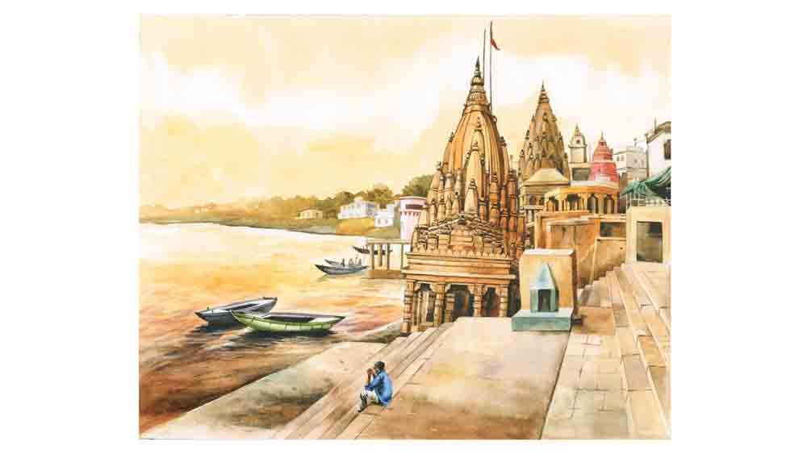

 

<h1 align=center>জলের পাশে</h1>
<h2 align=center>শ্যামলী আচার্য</h2>
একাত্তর দিন। কী ভাবে কেটে গেল। ঘরের চৌকাঠে পা দিয়ে চোখে পড়ে ছবিটা হাসছে। মায়ের ছবি। সম্রাট একদৃষ্টে তাকায় ছবির দিকে— ‘আমি পেরেছি মা। তুমি ছিলে বলেই তো।’   অনেকে অপেক্ষা করছিল বাইরে। মিডিয়া, ক্যামেরা, সাংবাদিক, আত্মীয়, বন্ধু। ভিড় ভাল লাগছে না।   “কী খাবি বল,” মুকুলের গলা। মুকুল। সম্রাটের ছেলেবেলার বন্ধু। একই পাড়ার। সম্রাট যখন রোগা পাতলা পাখির মতো হালকা, মুকুলরা খেলতে নিত না ওকে।   “ধুস, ও তো প্যাংলা! ফুটবলে লাথি মারতে গেলে নিজেই পড়ে যাবে। ক্রিকেট তো ছেড়েই দে। ব্যাটটা হাতে তুলতে পারে কি না দেখ।”   সম্রাট খেলত না। চুপচাপ মাঠের পাশে দাঁড়িয়ে দেখত সকলকে। ওরা ছুটছে, ওরা খেলছে। সম্রাট দলছুট। একটা বড় গাছের নুয়ে পড়া ডালে বসে পাখির ডাক শোনে। দল বেঁধে হেঁটে যাওয়া ব্যস্ত পিঁপড়েরা ওকে এক ঝলক দেখে। প্রজাপতি উঁকি দিয়ে যায়। মৌমাছি উড়ে যেতে যেতে ভাবে... ‘আহা, বেচারা! ছেলেটা বোধ হয় রুগ্ণ।’ 
চোখে মাইনাস টু পাওয়ারের চশমা সেই পাঁচ বছর বয়স থেকেই। একলা থাকার শুরু। আর সেখান থেকেই একলা হয়ে যাওয়ার নেশা। সেই নেশাই গত কয়েক মাসে একা টেনে নিয়ে গেল এগারো হাজার কিলোমিটার। একা এবং একা। সঙ্গী শুধু দুটো চাকা।   মুকুলের দিকে তাকাতে ইচ্ছে করে না। সে অন্য দিকে তাকিয়ে বলে, “একটু জল খাব। বড় ক্লান্ত লাগছে।”   গালে একাত্তর দিনের বাসি দাড়ি। উলোঝুলো চুল। রুক্ষ চেহারা। সাড়ে চার বছরের মেয়েটা বাবাকে দেখে চিনতেই পারে না। হাঁ করে তাকায়। তার বাবা হা হা করে হেসে চেঁচিয়ে ওঠে, “অলি, কাল সকাল সকাল উঠতে হবে। মনে আছে তো? আমরা রোজ রেস রেস খেলি? কাল সকালে ছুটে ছুটে আমাকে হারাতে হবে কিন্তু!” অলি তা-ও অবাক হয়ে তাকায়। আড়াই মাস পরে বাবা ফিরেছে। যে লোকটা তার বাবা, যে একটা সাইকেল নিয়ে বাড়ি থেকে বেরোনোর সময় চুমো খেয়ে তাকে টা টা বলেছিল, সে এমন রোগা কালো আর দাড়িওয়ালা হয়ে গেল কী করে? মা এসে অলির মাথার চুল ঘেঁটে দেয়।   “পাপাকে স্নান-টান করে ফ্রেশ হতে দে আগে। কত দিন ধরে রাস্তায় ঘুরছে বল তো? যাওয়ার দিনের সেই তারিখটা মনে আছে তোর?”   “কেন মনে থাকবে না? ওই তো, ক্যালেন্ডারে দাগ দিয়ে রেখেছি আমি,” অলি ছুটে গিয়ে দেওয়াল ক্যালেন্ডারের তারিখে আঙুল রাখে।   সেভ দ্য গঙ্গা অ্যান্ড প্রোটেক্ট উইমেন। এ বারের মিশন সেটাই। মা প্রথমে রাজি হননি। একটামাত্র ছেলে। কত কষ্টে মানুষ।   “এত বড় চাকরি ছেড়ে শেষে তুই সাইকেল চালিয়ে বেড়াবি?”   “অনেক দিন তো চাকরি করলাম মা। আরামে থাকার অভ্যেস হয়ে যাচ্ছে। আমি আরাম চাই না। আর সাইকেল চালিয়ে বেড়াতে তো যাচ্ছি না। আমার একটা মিশন আছে... একটা লক্ষ্য, উদ্দেশ্য...”   সেই ছেলেবেলা থেকে কত অভাব, কত অবহেলা। তবু বেঁচে থাকার চেষ্টা। টিকে থাকার জেদ। আর সাফল্যের সমীকরণ খোঁজা। সাফল্য। শব্দটার মধ্যেই ঘন কুয়াশার মতো ধোঁয়া। ধরাছোঁয়া যায় না। কিন্তু আছে। দশমিক বিন্দুর মতো।   লোকটা ওকে জিজ্ঞেস করেছিল, “কী খুঁজতে এসেছ বাবু?”   “প্রকৃতিকে খুঁজছি ভাই। চার দিকে আমার মাকে খুঁজছি।”   সম্রাটের উত্তর শুনে হেসেছিল লোকটা। ফুটিফাটা মুখের ভাঁজে বয়সের চিহ্ন। মানুষকে চেনার সবচেয়ে সহজ উপায় তার চোখের দিকে তাকানো। ওখানে সব ফাঁকি ধরা পড়ে যায়।   “ঘুমিয়ে আছে সব। ক্লান্ত হয়ে ঘুমিয়ে পড়েছে। কাউকে এখন খুঁজে পাবে না বাবু। কেউ কোত্থাও নেই।”   শীত করে সম্রাটের। নদীর ধারে হাওয়া দেয়। জোলো হাওয়া। নোনা জল কাছেই। সমুদ্র। মোহনা। আরব সাগরের খুব কাছেই বসে আছে ওরা। এখান থেকে কয়েকশো কিলোমিটার। যেখানে তাপ্তী নদী এঁকেবেঁকে মিশে গেছে। অথচ তার শাখানদীতে জল শুকিয়ে এসেছে। পাড় ভাঙে একের পর এক। মাঝির ভাঙা নৌকোয় কোনও পাল তোলা নেই। বৈঠায় সময়ের আঁচড়। জলের গন্ধ লেগে আছে। জলের স্পর্শ নেই। জলের প্রাণ নেই। শুধু জলের শবদেহ পড়ে আছে। মৃত নদীর ভাঙাচোরা শরীর। যে এক দিন মাঝি ছিল, যে এক দিন জলের গান গাইত, যে এক দিন জলের মধ্যে থেকে নিংড়ে নিত তার জীবিকা, সে আজ মাছ পায় না। জেলের পেট চলে না। সংসারে অনাহার। মাঝিদের গ্রাম, জেলেদের জীবিকা বন্ধ। নদী মুছে যাচ্ছে। গ্রামের মরদরা এখন ভাগচাষি।   জল দেখতে বেরিয়েছিল সম্রাট। শুধু জল। আর নদী। তার উৎস, গতিপথ আর মোহনা। অনেক কথা লেখা আছে ভূগোল বইয়ের পাতায়। একের পর এক অক্ষর, শব্দ, বর্ণমালা। ছবি আর মানচিত্র। যে কথা লেখা নেই, সেই কথা শোনার টান তাড়িয়ে নিয়ে বেরিয়েছে সম্রাটকে। সভ্যতার ইতিহাসে যে নদীবাহিত উপত্যকার কথা, সেই নদীমাতৃক দেশের প্রকৃত রূপ খুঁজে দেখতে চেয়েছে সে। তাই তো এই অজানা পথের টান।   সুমি জল এনে রাখে এক গ্লাস। বাঁ হাতে বড় প্লাস্টিকের বোতল।   কাচের গ্লাসের মধ্যে ঝকঝক করে পানীয় জল। স্বচ্ছ, স্বাদু জল। যার আর এক নাম জীবন। সম্রাট হাত বাড়ায় গ্লাসের দিকে। গ্লাসের একেবারে কিনারায় এক কুচি বুদ্বুদ। ওটাই কি পৃথিবী? যার তিন ভাগ জল?   “প্লাস্টিকের বোতলটা ফেলে দাও সুমি। ঠাকুমার কাঁসার ঘটিটা বের করে নাও। আমি ওটাতেই জল খাব। মনে আছে, মা গরমে মাটির কুঁজোয় জল রাখত। এখন আর পাওয়া যায় না, তাই না?”   সুমি হাসে। হাসলে ওর বাঁ গালে একটা চমৎকার টোল পড়ে। গভীর কালো জলের পুকুরের মতো ওর চোখ। শান্ত, স্নিগ্ধ।   পাঁচটা রাজ্য। উত্তরাখণ্ড, উত্তরপ্রদেশ, বিহার, ঝাড়খণ্ড, পশ্চিমবঙ্গ। ভারতবর্ষের মধ্যে গঙ্গার গতিপথ। সেই গঙ্গোত্রী মন্দিরের কাছ থেকে সাইকেলের চাকা ঘুরতে শুরু করেছে। ভারত পেরিয়ে এ বার বাংলাদেশ। রাজনীতির কাঁটাতার দুটো দেশ ভাগ করেছে। নদীর পথকে রুদ্ধ করতে পারেনি। বাংলাদেশের নবাবগঞ্জ, রাজশাহী, কুষ্টিয়া, ফরিদপুর, বরিশাল হয়ে কুয়াকাটা। প্রায় তিন হাজার কিলোমিটার পাড়ি। সাইকেলের চাকা ছুঁয়ে যায় জমির আলপথ। রুক্ষ মাটির ধুলো। শুকিয়ে যাওয়া নদীখাত। ঘুঘু ডাকে।   “কেমন মাঝি আপনি? একখানা গানও জানেন না? ভাটিয়ালি? একটা বাঁশিও নেই কোঁচড়ে? শখ করেও তো রাখতে পারতেন কর্তা।”   পিছনে জলের মধ্যে দুলতে থাকে মনসুরের ডিঙি। কচুরিপানায় আটকে যায় তার ছোট্ট নৌকো। প্রত্যেক বার পানা ঠেলে যাত্রা। প্রাণপাত পরিশ্রম। যাত্রীদের হাতে ধরিয়ে দিতে হয় বৈঠা, লাঠি। মাঝিও ঠেলে, তারাও ঠেলে। পানা সরিয়ে এগোনো-পিছোনো। জল কেটে যাওয়া। জীবনের মতোই। সুরে ভাসার সময় কোথায়?   বাঁওড়, খাল, বিল, নালা... সব এখন সমার্থক। জল কমছে। জোয়ার-ভাটার টান এলে নিশ্চিন্ত। বাকি দিনে ঘাড়ের কাছে নিঃশ্বাস ফেলতে থাকে শুকিয়ে ওঠা চর। ঘাটের কাছ থেকেই নাকে আসে ধানসিদ্ধ আর গোবর শুকোনোর গন্ধ। ভাটফুলের বনে দিকভুল মধুমাস। মেঠো ইঁদুরের দাপাদাপি। এক দিন বাঁশবন সাফ হয়ে যায়। জনপদ গড়ে ওঠে। মানুষ বাঁচতে চায় প্রকৃতিকে মুছে ফেলে।   সাইকেলের চাকা ঘোরে। পিচরাস্তা থেকে সীমান্তের দিকে। এক গ্রাম থেকে অন্য গ্রাম, সদর, জেলা পেরিয়ে রাজ্য। রাজ্য ছাড়াতে ছাড়াতে কখন অন্য দেশ। ভারত পেরিয়ে বাংলাদেশ। একই জল, একই পানি। শব্দ করে ছুটে যায় গাড়ি। পথ সোজা পৌঁছয় কাছারি বাড়িতে। জমিদারের নায়েব বসতেন এক কালে। বিশাল চেহারার প্রহরী থাকত দরজায়। নোনা ধরে খসে পড়ে যাওয়া ইটের সেই ইতিহাস এখনও তাজা। মুখে মুখে ফেরে ইতিহাসের গল্প। পাশের চায়ের দোকানি হাঁক দেয়, “কোত্থিকে আইলেন? ইন্ডিয়া না কি?”   “কেমন বেড়ালি রে? খুব এক্সাইটিং না!” কোনও এক আত্মীয়ের কথায় চমকে তাকায় সম্রাট। তার পর হেসে ফেলে। অনাবিল পবিত্র একগাল হাসি। প্রকৃতির মতো নির্মল, কলুষহীন। বেড়ানোই বটে। চাকায় ভর দিয়ে নদীর সঙ্গে দেখা। কোথাও উৎস, কোথাও মোহনা, কোথাও শাখানদী, কারও উপনদী। কেউ অতীতের স্মৃতি। কেউ দাপট জাগিয়ে টিকে গেছে আজকের দুনিয়ায়। যুঝে চলেছে সভ্যতার সঙ্গে। তাদের পাশে পাশে জেগে থাকা জনপদ আর তাদের বুকে ভর দিয়ে বেঁচে 
থাকা মানুষের অস্তিত্বের খোঁজ। প্রকৃতির পাঠশালায়।   আনাজ আর মাছের পসরা নিয়ে বসে থাকা হাট, গাই-বাছুর, ক্ষেত-জমি-আলপথ আঁকা গ্রামের মানচিত্রে বিভিন্ন রং। জমির টুকরো ছুঁয়ে যে জলধারা, তাতে মিশে যায় কীটনাশক। জলবাসী প্রাণীর শরীরে মিশতে থাকে বিষ। সেই বিষ উঠে আসে পর পর। হাতে হাতে ধরে তৈরি করে বিষ-শৃঙ্খল। শুধু একটু একটু করে বেড়ে যাওয়া বিষের পরিমাণ গলা দিয়ে নামে। গাছেরা গ্রামপতনের শব্দ পায়। গোধূলির ঝিরঝিরে হাওয়ায় বুলডোজারের শব্দ। অনেক দূরের শুকনো মরুশহরে জলের হাহাকার। অনন্ত বালি খুঁড়ে কয়েক ফোঁটা জীবন। হাঁটাপথে কয়েক মাইল। গভীর নলকূপে আর্সেনিক। জলস্তর কমছে ক্রমশ। বৃষ্টির জল শহরের ড্রেন বেয়ে চলে যায়। মাটির গভীরে পৌঁছনোর উপায় নেই তার। চার পাশ বাঁধানো। নদীকে আটকে রেখেছে বাঁধ। তার গতিপথে বোল্ডার। মাথা কুটে কুটে কাঁদে জেলেপাড়া, মাঝিদের গ্রাম। কুচো মাছের দমবন্ধ হয় ঝাঁঝালো কীটনাশকের গন্ধে। মজা পুকুর। গঙ্গার ধুয়ে যাওয়া পলিতে পায়ের ছাপ রেখে যায় ক্লান্ত বক আর ব্যস্ত ফড়িং। ঘাটের পাশে বুড়ো বট। ঝুরিতে টাঙানো মানত। বেদিতে বাতিল দেবতার ভিড়। সে নির্বাক তাকিয়ে থাকে। তার থানে কপাল ঠুকছে পথচারী। পচা ফুলের গন্ধে ভক্তি গুলিয়ে ওঠে। শুধু পাড় ভাঙার শব্দ জেগে থাকে একটানা।   বেনারসের মণিকর্ণিকার ঘাট। সন্ধ্যার অন্ধকার। সঙ্গী সাইকেলটিকে রেখে ঘাটে বসেছিল সম্রাট। অনেকক্ষণ। পোড়া গন্ধে চার পাশের বাতাস ভারী।   “আপনে কিসিকা দাহসংস্কার করনে আয়ে বাবুজি?”   ছোট্ট ছেলেটি প্রশ্ন করেছিল। খালি গা। গলায় গামছা। পরনে খাকি হাফপ্যান্ট। রোদে পোড়া তামাটে মুখ। ভাবলেশহীন।   সম্রাট তাকায়। ছেলেটা অলির চেয়ে সামান্য একটু বড়। ও এই ভর সন্ধেবেলা হাতমুখ ধুয়ে পড়তে বসেনি কেন?   “ইধার আ। বৈঠ মেরে পাস। ইঁহা পর কেয়া করতা হ্যাঁয় রে তু?” সব জেনেশুনেই প্রশ্ন করে সম্রাট। সভ্য লোক যেমন সব জেনে না জানার ভান করে। ঠিক সেই রকম।   “ডেডবডি লেকে সব আতেঁ হ্যাঁয় ইঁহা পে। অওর কেয়া করনা? ইয়ে জাগা মালুম নেহি হ্যাঁয় আপকো?”   জানে সম্রাট। মণিকর্ণিকার ঘাটের শ্মশানে মৃতদেহ দাহ হলে মৃতের আত্মা মোক্ষলাভ করে। পুনর্জন্মের চক্র থেকে মুক্তিলাভ...   “ফির তু ভি?”   সম্রাটের অস্বস্তি হয়। অতটুকু ছেলে কাঠের চুল্লিতে মড়া পোড়ানোর কাজে সাহায্য করে। জীবন যে রকম।   “তুঝে ইয়ে কাম ...”   সম্রাট প্রশ্ন করতে গিয়েও থেমে যায়। অতটুকু ছেলেকে কিছুতেই জিজ্ঞেস করা যায় না, এই কাজটা করতে তোর কেমন লাগছে?   “বাবুজি, দোঠো রুপেয়া দোগে? সির্ফ দো, জাদা নেহি।”   ছেলেটি হাত মেলে দাঁড়ায়।   “কেন রে?”   “ছোটি বহেন হ্যাঁয় ঘরমে। বুখার হ্যায় উসকি। সুবহা নমকিন খানে কো মাঙ্গি থি। মেরে পাস কুছ ভি নেহি হ্যাঁয়। আজ সব গরিব আদমিকা ডেডবডি থা... কুছ ভি নেহি মিলা।”   সম্রাটের ঠান্ডা লাগে। গঙ্গার হাওয়া। জলীয় বাষ্প জমা হয় চোখে। চোখের কোণে জ্বালা করে। রোজ মৃত মানুষের প্রাণহীন শরীর পোড়ায় ছেলেটা। শুধু শরীর। মৃত শরীরের কোনও টান থাকে না। টান শুধু জীবিতের জন্য। চিন্তা শুধু বেঁচে থাকাকে ঘিরে।   জলের বৃত্ত গড়িয়ে যায় হালকা তরঙ্গে। নাড়া লাগে ইতিহাসে।