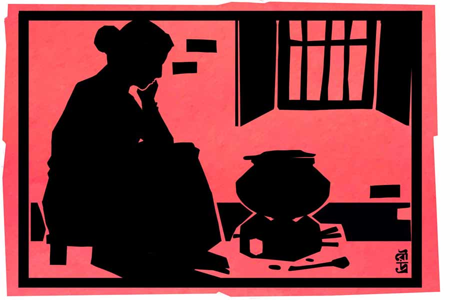

 
 <h1 align=center>জাগতিক</h1>
<h2 align=center>তৃপ্তিভাষা পাত্র</h2> 

ঘুম থেকে উঠে বাসিপাট সেরে, স্নান করে এসে অণিমা দেখে, বাচ্চাদুটো তখনও ঘুমোচ্ছে। যত ক্ষণ ঘুমিয়ে থাকে তত ক্ষণই ভাল, ভাবে সে। কী যে হবে আজ, কে জানে! পুজো করতে বসে দু’চোখে গড়ায় জল। চিৎকার করে কাঁদতে ইচ্ছে করে। আজ আর ভাল করে পুজো হয় না। চেষ্টা করেও মন বসাতে না পেরে সে আসন ছেড়ে উঠে পড়ে। পিছন ফিরে দেখে, বাবু আর মনা উঠে বসে আছে বিছানায়। বাচ্চারা তার খুবই শান্ত। মুখ ধুইয়ে দু’জনকে দুটো বাটিতে খই আর দুটো করে বাতাসা দেয়। সরকারবাড়ির বেশ কিছু দিন আগের ষষ্ঠীপুজো করে প্রসাদ এনেছিল বিমল, এইটুকু অবশিষ্ট রয়েছে। বাচ্চারা খেয়ে, জল খেয়ে, বই খাতা নিয়ে বসে। করোনার কৃপায় ইশকুল বন্ধ। বাড়িতে মায়ের কাছেই পড়ে ওরা। কিন্তু আজ আর অণিমার পড়াতে বসতে ইচ্ছে করছে না।

“মা, নামতা বইটা নিয়ে বসিনি। আটের ঘরের নামতাটা একটু লিখে দাও না মা!” বাবুর আবেদন।

“আজ আমার খাতায় একটা বড় বেড়াল এঁকে দাও না, মা। আমিও তার উপর হাত বুলিয়ে বুলিয়ে আঁকব!” মনার আবদার।

পারে না অণিমা। আজ আর কিছুই সে পারবে না মনে হয়। ক্লান্ত চোখ দুটো তুলে ছেলেমেয়েদের বলে, “যাও, আজ আর তোমাদের পড়তে হবে না, আজ ছুটি। উঠোনে খেলা করোগে যাও।”

খুশি হয়ে চলে যায় বাচ্চারা, আর তক্তপোশে নিঝুম হয়ে বসে থাকে অণিমা। কী হবে আজ কে জানে! কাকভোরে উঠে পঞ্চায়েত অফিসে গেছে বিমল। দিন দুই-তিন ধরেই যাতায়াত করছে। বলেছিল আজ তাড়াতাড়িই ব্যবস্থা করে ফিরবে। কিন্তু এখনও তো এল না! বিহ্বল হয়ে বসে থাকে অণিমা।

শ্বশুরের আমলের পুরনো দেওয়ালঘড়িতে দশটা বাজতে সংবিৎ ফেরে অণিমার। তক্তপোশ থেকে উঠে বিছানাটা ঝেড়েঝুড়ে গোছাতে শুরু করে সে। ঘরদোর গুছিয়ে সময় কাটানোর চেষ্টা করে। ঘড়ির কাঁটার পায়ে-পায়ে বেলা গড়ায়। সূর্য পাড়ি দেয় মাঝ-আকাশের দিকে।

*****

“মা খেতে দাও, খুব খিদে পেয়েছে,” খানিক পরে ঘরে ঢোকে বাবু।

“মা, ভাত হয়ে গেছে? খেতে দাও না, বড্ড খিদে পেয়েছে।”

অণিমা শুনতে না পাওয়ার ভান করার চেষ্টা করে। কিন্তু তাতে সমস্যা মেটে না।

“রান্না হয়ে গেছে মা?” একনাগাড়ে বলেই চলে বাবু।

উত্তর না পেয়ে সে হঠাৎ দৌড়ে চলে যায় রান্নাঘরে। ফিরে এসে বলে, “ও বাবা! এখনও তো তুমি উনুন ধরাওনি। রান্না করবে না মা আজ?”

অণিমা কাছে টেনে নেয় ছেলেকে, বলে, “স্নান করে নাও, আমি এখনই উনুন ধরিয়ে দিচ্ছি। কত ক্ষণ আর লাগবে? এক্ষুনি ভাত হয়ে যাবে।”

ছেলেমেয়েদের স্নান করানোর ইচ্ছেটুকুও আজ আর নেই অণিমার। ওরা নিজেরাই তোলা জলে স্নান করে নেয়। অণিমা বসে উনুন ধরাতে। প্রধানমন্ত্রীর প্রকল্পে গ্যাস তারও জুটেছে, কিন্তু গ্যাসের সিলিন্ডার কেনার টাকা নেই। উজ্জ্বলার গ্যাস শিকেয় তুলে আরও অনেকের মতো উনুনে ফিরতে হয়েছে।

উনুন জ্বেলে, ছেলেমেয়েদের গা-মাথা মুছিয়ে, অনেক দিন কৌটোর কোণে সেঁটে থাকা খানদুই ন্যাতানো বিস্কুট আর জল খাইয়ে দেয় ওদের।

ছোট্ট মনা হাততালি দিয়ে চিৎকার করে ওঠে, “ওই তো, আঁচ উঠে গেছে, ভাত বসাও মা! এক্ষুনি ভাত হয়ে যাবে আর আমরা খাব, বলো?”

“হ্যাঁ, এই তো বসাব!” নিরুত্তাপ জবাব অণিমার।

বসিয়ে দেয় সে ভাতের হাঁড়িটা উনুনে। খুশিতে ঝলমল করে ওঠে মনা, “আয় দাদা, আমরা বিছানায় বসে থাকি, ভাত হলেই মাটিতে নেমে খাব। মা, দুটো বেশি করে আলু দেবে কিন্তু, কালকের মতো অতটুকু আলুভাতে আমি খাব না।”

নিঃশব্দে মেঝেয় বসে থাকে অণিমা। বিমল সংস্কৃত কলেজ থেকে সংস্কৃতে সাম্মানিক স্নাতক। অণিমাও গ্র্যাজুয়েট। চাকরি অবশ্য কেউই জোটাতে পারেনি। স্কুল সার্ভিস কমিশনের তৈরি প্যানেল বার বার বাতিল হয়েছে। কাগজে দেখেছে চাকরিপ্রার্থীদের বিক্ষোভ। কাগজে পড়েছে মামলা-মকদ্দমার খবর। অণিমাও পরীক্ষা দিয়েছিল, কিছুই মেলেনি। শেষে পূর্বপুরুষের পৌরোহিত্য ব্যবসাটাই ধরেছে বিমল।

গ্রামে অবস্থাপন্ন ঘরের পুজোআচ্চা আর দু’-পাঁচ জন ছাত্র পড়িয়ে কোনও রকমে চলছিল ছোট সংসার। কিন্তু বাদ সাধল অতিমারি। লোকের বাড়িতে পুজোর ডাক পড়ে না আর। শীতলার থানে রোজের পুজো সেরে মাস গেলে সামান্য কিছু মেলে, সেই এখন বিমলের উপার্জন। তার উপরে লকডাউন। কাজ নেই মানুষের, খাবার যোগাতেই হিমশিম, মাস্টারের মাইনে দেবে কী করে লোকে! অতএব ছাত্ররা আর আসে না। এত দিনকার জমানো, সামান্য টাকা দিয়ে কোনও ক্রমে চলেছে। কিন্তু সে জলও গড়াতে গড়াতে এক সময় শেষের দিকে।

এ বারে কী হবে? বিমল তাই গিয়েছে পঞ্চায়েত অফিসে, সেখানকার স্লিপ নিয়ে এলে তবু কিছু সরকারি চাল-ডাল মিলবে। বিমল শান্ত, মুখচোরা মানুষ। রাজনীতি করে না, চেনাশোনা নেই তেমন। ফলে আশাও কম। তবুও মরিয়া চেষ্টা, যদি কিছু জোগাড় করতে পারে।

*****

চিন্তার জাল ছিঁড়ে যায় বাবুর চিৎকারে, “ও মা, এখনও ভাত হল না? খুব খিদে পেয়ে গেছে। আর কত ক্ষণ লাগবে গো?”

“এই যে হয়ে এল বাবা!” মাটি থেকে তাড়াতাড়ি উঠে দাঁড়ায় অণিমা।

“সে তো কখন থেকেই বলছ!” ঝাঁজিয়ে ওঠে বাবু।

ছেলের মুখের দিকে তাকিয়ে থাকে অণিমা, হঠাৎ দেখে ছোট্ট মনা এগিয়ে এসেছে উনুনের কাছে।

“মা, ঢাকাটা এক বার তোলো না, দেখি আর কত বাকি আছে?”

“পুড়ে যাবি, পুড়ে যাবি, উনুনের সামনে যাস না!” মেয়েকে ব্যস্ত হয়ে টেনে আনে অণিমা, কিন্তু পারে না কান্না থামাতে। মাটিতে লুটিয়ে মেয়ে কাঁদতে থাকে। বোনকে কাঁদতে দেখে বাবুও কাঁদতে শুরু করে।

অণিমা শুধু একই কথা বলে চলে, “আর একটুখানি।”

কিন্তু এ বার আর মায়ের কথায় কান্না থামায় না ওরা। কেঁদেই চলে, কেঁদেই চলে, একটু ক্ষণ পরেই আর কাঁদার শক্তিও থাকে না তাদের, ফোঁপাতে থাকে বসে। অনেক কষ্টে দু’জনকে কোলে নিয়ে বসে অণিমা। আস্তে আস্তে ঘুমে আচ্ছন্ন হয়ে পড়ে বাচ্চারা। অণিমা উঠে ওদের বিছানায় শুইয়ে দেয়। মেয়ের গালের উপর জমে থাকে জল। অণিমা সে জল মুছে দেয় না, পাছে ঘুম ভেঙে যায়।

এই সময় বিমল যদি এসে পড়ে চাল নিয়ে, তা হলে ওদের ঘুম থেকে তুলে পেট ভরে ভাত খাওয়াবে। নিজেদের খাওয়ার প্রশ্নই নেই। গত কয়েক দিন ধরেই একবেলা একমুঠো খেয়ে ওদের চলে যাচ্ছে। উনুনের আঁচটা অযথা নষ্ট হচ্ছে দেখে কষ্ট হয় অণিমার, অভাবের সংসারে কয়লাও দামি। বাচ্চাদের শুইয়ে রেখে উনুনের আঁচ কমাতে যাবে, এমন সময় দরজায় ছায়া পড়ে।

“হ্যাঁ রে বামুন মেয়ে, বলি তোর ভাতের হাঁড়ির ঢাকাটা এক বার খোল তো দেখি।”

পাশের বাড়ির মণ্ডল মাসিমা। সর্বনাশ করেছে!

“কেন মাসিমা?”

“হঠাৎই দরকার হল যে মা।”

খুব একটা কথা হয় না এমনিতে এঁর সঙ্গে। শুনেছিল, এঁরা বড় ঝগড়াটে। আশপাশের লোকজন নাকি অতিষ্ঠ হয়ে যায় এঁদের অশান্তির ঠেলায়। এঁদের এড়িয়েই চলে লোকে। আজ হঠাৎই ইনি এসে হাজির। সে বার কাঁঠালগাছ কাটা নিয়ে সে কী তুলকালাম কাণ্ডটাই না...

“কী রে বামনি, তুই নিজে খুলবি, না আমি জেতে কৈবর্ত হয়ে তোদের হাঁড়ি ছোঁব?” ভাবনার মাঝখানেই বেজে ওঠে মণ্ডলগিন্নির খনখনে গলা।

“আমি তো ও সব মানি না মাসিমা,” শান্ত গলায় বলে অণিমা।

গর্জে ওঠেন মণ্ডল মাসিমা, “ফের মুখে মুখে চোপা। খোল বলছি হাঁড়ির ঢাকা, মুখপুড়ি! তুই না মানলে না মানবি, আমি কেন জেনেশুনে পাপ করতে যাব!”

পায়ে পা দিয়ে এমন কুঁদুলে আচরণ সহ্য হয় না আর। ঝামেলা এড়ানোর জন্যই অণিমা খুলে দেয় হাঁড়ির ঢাকা।

“তখনি বুঝেছিলুম রে বামনি, তোর চালাকি! গোয়ালঘরের জানলায় দাঁড়িয়ে এত ক্ষণ সব শুনেছি। হ্যাঁ রে, একমুঠো চাইতে পারলিনি বাচ্চাদের জন্যে? লোকে বলে, লেখাপড়া-জানা মেয়ে তুই, ভদ্র, সভ্য। এই তোর বোধগম্যি! অমন লেখাপড়ার মুখে নুড়ো জ্বেলে দিতে হয়! এই ভাবে দুধের বাছাদের ঠকানো! কালে কালে কতই দেখব!” হাত-পা নেড়ে বিচিত্র অঙ্গভঙ্গি করে একতরফা বকে চলেন মণ্ডলগিন্নি।

অণিমা কী বলবে বুঝতে না পেরে চুপচাপ দাঁড়িয়ে থাকে।

“দাঁড়া, এই আমি এলাম বলে!” দুমদুম পা ফেলে খিড়কি দিয়ে বেরিয়ে যান মণ্ডলগিন্নি।

এত কথার আওয়াজেও বাচ্চাদের ঘুম ভাঙে না। কাঁদতে কাঁদতে ক্লান্ত হয়ে পড়েছিল আসলে বেচারারা। শূন্যদৃষ্টিতে দু’জনের দিকে তাকিয়ে থাকে অণিমা।

হঠাৎ দেখে, মণ্ডলগিন্নি একেবারে ঘরের মধ্যে এসে ঢুকছেন। একটা প্লাস্টিকের প্যাকেটে কিছুটা চাল, দু’-চারটে আলু, আর একটা মাঝারি ঠোঙায় কিছু একটা।

“নে, নে। চড়িয়ে দে, আর দাঁড়িয়ে থাকিস না সঙের মতো। এর পর তো আঁচ ঝিমিয়ে যাবে। ঠোঙায় ডাল রয়েছে, একটু ন্যাকড়া বেঁধে ভাতে দে, ডাল রান্নার সময় নেই, ওই ভাতে মেখে খাবে এখন...” নির্দেশ এবং তাড়া, দুই-ই দেন মণ্ডলগিন্নি।

কারও কাছে হাত পেতে কিছু নিতে অণিমার মন সায় দেয় না। তাই মৃদু স্বরে বলে, “আপনার ছেলে তো রেশন আনতেই গেছে, হয়তো এখনই এসে পড়বে...”

কথা আর শেষ হয় না, তাক থেকে কাঁসার থালাবাসন পড়ে যাওয়ার মতো আওয়াজে ঝঙ্কার দিয়ে ওঠেন মণ্ডলগিন্নি, এ বার আর তাঁর মুখের আগল থাকে না, “অ্যাই হারামজাদি, চাল ধুবি কি না বল? তুই না পারিস তো আমিই বসিয়ে দিই, সে তোর জাত থাক আর যাক। তোর বর বাড়ি বাড়ি পুজো করে বেড়ায়, সে ছাঁদা বেঁধে কতটুকু পায়, সে তো জানা আছে! আমি বামুনবাড়িতে দুটো ভুজ্যি দিতে এসেছি, তাতে তোর এত দেমাগ কিসের রে ছুঁড়ি!”

অবাক হয়ে মণ্ডলগিন্নিকে দেখে অণিমা। তার পর একটা হাঁড়ি এনে চাল, আলু ধুয়ে দেয় অণিমা। ডালটাও একটু ধুয়ে ন্যাকড়া বেঁধে হাঁড়িতে দিয়ে দেয়। ভর্তি হাঁড়ির জল ফুটে ফুটে তলানিতে ঠেকেছে, খানিক জলও দিতে হয়। মুখে বাচ্চাদের কথা বললেও, মণ্ডলগিন্নি যা এনেছেন, তাতে ওদের চার জনেরই এ বেলাটা চলে যাবে।

ঠায় দাঁড়িয়ে থাকেন মণ্ডলগিন্নি। ভাত বসানো হয়ে গেলে আর একটাও কথা না বলে নিঃশব্দে বেরিয়ে যান।

মুখরা, ঝগড়ুটে এই মণ্ডলগিন্নি গত বারের ঝড়ে কাঁঠালগাছ কাটা নিয়ে ও পাশের বসাকদের সঙ্গে কী অশান্তিই না করেছিল! পারলে এই মারে কি সেই মারে! আজও যথেষ্ট চিৎকার চেঁচামেচি করে গেলেন ঠিকই, কিন্তু যে কারণে করলেন, তা কী কখনও ভুলতে পারবে অণিমা!

এক জন মানুষের মধ্যে কত জন লুকিয়ে থাকে!

খিড়কি দিয়ে বেরিয়ে যাওয়া মণ্ডলগিন্নির দিকে দেখতে দেখতে বুকের উপরে জড়ো করা হাত দুটো আপনা-আপনিই কপালের উপর উঠে আসে অণিমার।

