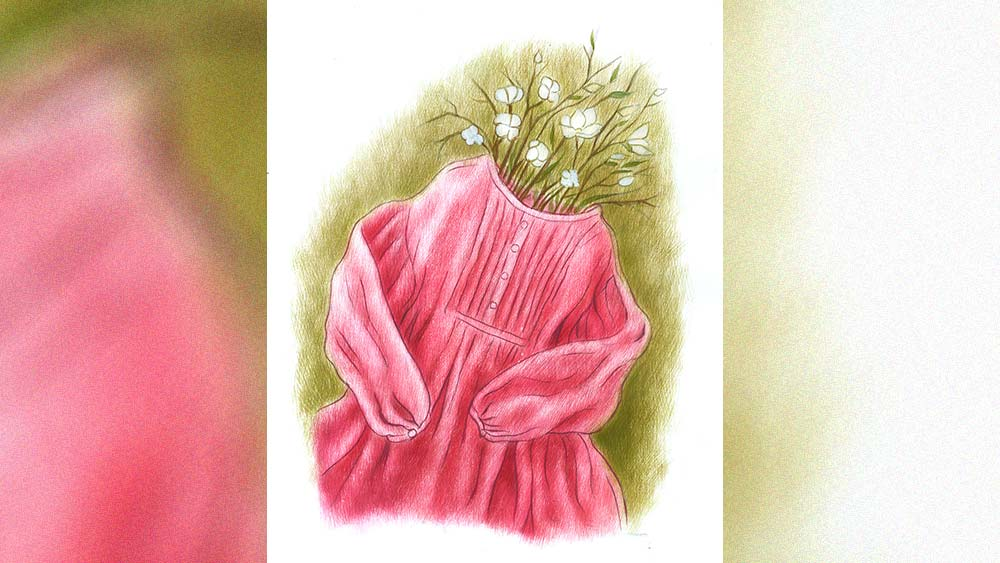

 
 <h1 align=center>জানাজানির পর</h1>
<h2 align=center>ইন্দ্রনীল সান্যাল</h2> কোথায় গিয়েছিলি রে?” সন্ধে সাতটার সময় মেয়েকে কলেজ থেকে ফিরতে দেখে জিজ্ঞেসকরল মায়া।

“আমি তোমাকে কখনও জিজ্ঞেস করি, তুমি কোথায় গিয়েছিলে?” মিষ্টি হেসে উত্তর দিল আরশি।

“আমি তোর মা! আমার জানতে চাওয়ার রাইট আছে,” ঝাঁঝিয়েউঠল মায়া। 

“চেঁচাচ্ছ কেন?” ভুরু তুলে মায়াকে দেখল আরশি, “আমার বয়স একুশ। ভোট দেওয়ার এবং বিয়ে করার অধিকার সরকার বাহাদুর আমাকে দিয়েছে। সরকারের যখন আমার ওপরে ভরসা আছে, তখন তোমারও থাকা উচিত!”

মেয়েটা কলেজে ঢুকে অসৎ সংসর্গে পড়েছে। মায়া স্পষ্ট বুঝতে পারছে। মায়া বাড়ির বৌ হলে মেয়ের বদমায়েশি ধরতে পারত না। কিন্তু তাকে খেটে খেতে হয়।

মায়া নিজেও একটু আগে ফিরেছে। বাথরুমে ঢুকে স্নান করতে করতে মনে পড়ে যাচ্ছে বাইশ বছর আগের কথা, যখন সে গোপালগঞ্জের আঠেরো বছরের তরুণী। যখন সে উন্মাদের মতো প্রেমে পড়েছিল সুজিতের। উনিশ বছরের ছেলেটি স্ট্রাইকার পজ়িশনে খেলত।

গোপালগঞ্জ কলকাতার কাছেই। তবে বাইশ বছর আগে যাতায়াতের ব্যবস্থা ছিল না বললেই হয়। হাইওয়ে হয়নি, রেললাইন থাকলেও স্টেশন ছিল না। প্রাইভেট বাসে কলকাতা যেতে ঘণ্টা আড়াই লাগত। ইস্কুল, কলেজ, খেলার মাঠ আর নদী নিয়ে নিপাট এক গঞ্জ। কলেজে ঢুকেই সেকেন্ড ইয়ারের সুজিতের চোখে চোখ পড়ল মায়ার। 

সুজিত প্রথম দিকে মায়াকে পাত্তা দেয়নি। কারণ মায়া সুন্দরী নয়। তবে শরীর-স্বাস্থ্য ভাল ছিল। টাইট সালোয়ার-কুর্তি পরলে পুরুষমাত্রেই ঘুরে দেখত।

মায়া যখন সেকেন্ড ইয়ার, সুজিত প্রেমে সিলমোহর দিল। ওর বাড়ির খবর আগেই নিয়ে রেখেছিল মায়া। সুজিতে বাবার কাঠের গুদাম আছে। দুই ছেলের মধ্যে সুজিত ছোট। বড়টির নাম অজিত। 

মায়ার গ্র্যাজুয়েশনের পরে বিয়েটা হল। মায়া তখন একুশ, সুজিত বাইশ। অনেক পরে মায়া শুনেছিল, এই বিয়ে নিয়ে অজিতের আপত্তি ছিল। কারণ তখনও তার বিয়ে হয়নি।

বাবার সঙ্গে কাঠের ব্যবসা সামলাত অজিত। সুজিত ফুটবল নিয়ে ব্যস্ত। খেপ খেলতে গোপালগঞ্জের তারকা স্ট্রাইকারকে প্রতি মাসে চার- পাঁচ বার দূরের জেলায় যেতে হয়। অজিতকে পাশে বসিয়ে বাবা গর্জন করতেন, “আমি মরলে কে এ সব সামলাবে? ফুটবলে লাথিমেরে সারা জীবন চলবে? বৌমা, তুমি ওকে সামলাও!”

বিয়ের এক বছরের মাথায় মেয়ে হল। সুজিতই নাম রেখেছিল আরশি। মেয়েকে নিয়ে খুব আদিখ্যেতা ছিল।

আরশি বড় হচ্ছে। মায়ার বাবা-মা প্রয়াত হলেন। সুজিত বয়সের কারণে খেলা ছেড়ে কাঠের গুদামে বসা শুরু করল। তত দিনে অজিতের বিয়ে হয়ে গেছে। গুদাম থেকে দুই ভাইয়ের কথা কাটাকাটির আওয়াজ আসত, বাপ-বেটার ঝামেলা শোনা যেত। কিন্তু মায়া কখনও শাশুড়ি বা জাকে এই নিয়ে কিছু জিজ্ঞেস করেনি। 

মাথায় আকাশ ভেঙে পড়ল বাস অ্যাক্সিডেন্টে সুজিত মারা যাওয়ার পর। আরশি তখন বারো, মায়া চৌত্রিশ। ভাল করে শোক পালন করার সুযোগ পর্যন্ত পায়নি মা আর মেয়ে। তার আগেই অজিত ওদের দু’জনকে বাড়ি থেকে বার করে দিয়েছিল। সম্বল বলতে কিছু টাকা আর নিজস্ব খাট-বিছানা-আলমারি।

শাশুড়ি গোপনে একটা বিছেহার দিয়ে বলেছিলেন, “এর বেশি পারলাম না রে! বুড়ো বয়সে ওদের বশে থাকতে হবে। অজিতকে বলে রেললাইনের ধারে এক কামরার ভাড়াবাড়ি জোগাড় করেছি। ওখানে তোরা চলে যা। আর যোগাযোগ রাখিস না।”

স্নান শেষ করে শাওয়ারের নব পেঁচিয়ে বন্ধ করছে মায়া। গামছা দিয়ে হিংস্র ভাবে গা মুছছে। অতীত থেকে উড়ে আসা জলবিন্দুর একটি কণাও যেন শরীরে লেগে না থাকে!

 

*****

“হ্যাঁ স্যর। কাল আমি ঠিক সময়ে পৌঁছে যাব,” নিজের ঘরে বসে ফোন কাটল আরশি। জানলা দিয়ে বাইরে তাকিয়ে ভাবল, মা কি কিছু আন্দাজ করেছে? কলেজে গিয়ে খবর নিচ্ছে না তো? তা হলে মুশকিল। গত এক মাসে আরশি মাত্র দুটো ক্লাস করেছে। কলেজে মুখ দেখিয়েই বেরিয়ে যেতে হচ্ছে এ দিক-সে দিক। বাড়ি ফিরতে ফিরতে সন্ধে।

পাখার তলায় বসে মাথা ঠান্ডা হচ্ছে আরশির। মনে হচ্ছে, মাকে ওই ভাবে কথাগুলো না বললেই ভাল হত। কিন্তু আরশি এই রকমই! গোটা জীবনটাই আবেগতাড়িত।

ছোটবেলায় বাবার থ্যাঁতলানো চেহারা দেখে সে আঁতকে উঠেছিল। যে লোকটা তাকে সব থেকে বেশি ভালবাসে, যে লোকটার সামনে নিজেকে সম্রাজ্ঞী বলে মনে হয়, সেই লোকটার চলে যাওয়ায় চূড়ান্ত মানসিক আঘাত পেয়েছিল। দাহকার্য, পিণ্ডদান, নিয়মভঙ্গ— সবই জানা ছিল আরশির। জানা ছিল না পারিবারিক রাজনীতি। অতিথিরা বিদায় নেওয়া মাত্র বাড়িতে ঝগড়া শুরু হয়। জেঠু আর জেঠির মুখে বাবা-মায়ের নামে খারাপ কথা শুনে শরীর খারাপ হয়ে গিয়েছিল। মায়ের সঙ্গে একবস্ত্রে বাড়ি থেকে বেরিয়ে আসার পর থেকে সে সবাইকে ঘৃণা, অবিশ্বাস আর সন্দেহের চোখে দেখে। 

এই বাড়ির ঘুপচি ঘরে কেটে গেল অনেক বছর। মায়ের প্রতি আরশি কৃতজ্ঞ। মা যে ভাবে এখানে-সেখানে গিয়ে, এর-তার উমেদারি করে কাজ জুটিয়েছে, তার জন্যে স্যালুট করতে হয়। আয়া সেন্টারে নাম লিখিয়ে বয়স্ক মানুষদের দেখাশোনার কাজ করে এতগুলো দিন চালিয়ে তো দিল!

কিন্তু স্ট্রাগল করছে বলেই মেয়ের উপরে গোয়েন্দাগিরি করার অধিকার জন্মায় না। একরাশ বিরক্তি নিয়ে বসে রয়েছে আরশি। পুরনো বাড়িতেই তারা আজও থাকে। তবে একতলার বদলে দোতলার দু’কামরার ফ্ল্যাটে চলে এসেছে। গোপালগঞ্জ গত কয়েক বছরে অনেক বদলে গেছে। পাশ দিয়ে চলে গেছে ন্যাশনাল হাইওয়ে। তৈরি হয়েছে গোপালগঞ্জ স্টেশন। ট্রেনে কলকাতা যেতে এখন সওয়া ঘণ্টা লাগে।

বাথরুম থেকে রাতপোশাক পরে বেরিয়েছে মায়া। স্মার্টফোনে এক বার চোখ বুলিয়ে রান্নাঘরে ঢুকে বলল, “চা করছি। বারান্দায় আয়। রাত্তিরেকী খাবি?”

মায়ের উপর রাগ করে বেশি ক্ষণ থাকা যায় না। ঘর থেকে বেরিয়ে আরশি বলল, “রাতে রান্নাবান্না করতে হবে না। আমি ফোন করে পিৎজ়া আনাচ্ছি।”

দু’কাপ চা নিয়ে এক ফালি বারান্দায় বসে মায়া বলল, “পিৎজার বড্ড দাম। অনেক টাকা খরচ হবে।”

দু’জনের ফোনেই পিঁকপিঁক করে মেসেজ ঢুকেছে। দু’জনেই ফোনের পর্দায় চোখ বুলিয়ে মোবাইল নামিয়ে রাখল। আরশি বলল, “আমি টিউশনি করি। আমার জন্যে তোমাকে কোনও খরচা করতে হয় না। কেন এখনও টাকা নিয়ে চিন্তা করো? গত পুজোয় যে গোলাপি রঙের সালোয়ার কামিজ়টা দিলাম, সেটা এখনও পরলেই না।”

“আচ্ছা, কাল পরে ডিউটি যাব,” চায়ে চুমুক দিল মায়া, “কিন্তু তোর এখন লেখাপড়া করার বয়স। টিউশনি করলে সময় নষ্ট হয়। তা ছাড়া, তোকে কারা সব ফোন করে। আমার খুব ভয় করে আরশি!”

চায়ে চুমুক দিতে গিয়ে ঠক করে কাপ নামিয়ে আরশি তীক্ষ্ণ কণ্ঠে বলে, “ফোন পার্সোনাল জিনিস। এতে যে হাত দেওয়া উচিত নয়, সেই সেন্সটাও নেই? আমি কখনও তোমার ফোনে হাত দিই?”

“রাগ করিস না,” টেনশনে হাত কাঁপছে মায়ার। তুই যখন চানকরতে যাস, তখন ফোন এলে ধরি।বলি যে ও বাথরুমে। এর মধ্যে কী অপরাধ আছে?”

“ফ্রম নাউ অন, তুমি আমার ফোনে হাত দেবে না!” রাগে গরগর করছে আরশি।

“রঞ্জিত স্যর নামের যে লোকটা তোকে ফোন করে, তার গলা শুনে বোঝা যায় যে অনেক বয়স। মলিদি বলে খ্যারখেরে গলার যে মহিলা ফোন করে, সে তো প্রথম বারের পর থেকে আমার গলা শুনলেই ফোন কেটে দেয়। এরা কারা, আরশি?”

“এরা আমার কলেজের টিচার!” চিৎকার করে কণ্ঠস্বরে বিশ্বাসযোগ্যতা ফোটাচ্ছে আরশি, “তুমি আর কোনও দিন আমার ফোনে হাত দেবে না। যদি দাও, তা হলে আমি বাড়ি থেকে বেরিয়ে যাব!” চা না খেয়ে দুপদাপিয়ে নিজের ঘরে যায় আরশি।

মায়ার ফোন বাজছে। ফোন ধরে সে বলল, “বিধাননগর তো? হ্যাঁ দাদা। আমি কাল পৌঁছে যাব।” 

*****

কলকাতার কলেজে পড়তে আসার কোনও ইচ্ছেই আরশির ছিল না। ডিগ্রির কাগজটা নিয়ে কাজ খুঁজতে বেরনো যেখানে মূল উদ্দেশ্য, সেখানে কলকাতা আর গোপালগঞ্জের মধ্যে কোনও তফাত নেই।

তবে কলকাতায় পড়তে এসে আরশি নতুন পথের সন্ধান পেয়েছে। যাঁরা তাকে সেই পথ দেখিয়েছেন, তাঁদের মধ্যে সর্বাগ্রে পড়েনরঞ্জিত স্যর। কলেজ থেকে বেরিয়ে শিয়ালদা স্টেশনের দিকে হাঁটতে হাঁটতে আরশির মনে পড়ছে প্রথম দিন স্যরের সঙ্গে দেখা হওয়ার কথা। বছর পঞ্চাশের মানুষটিকে দেখে বাবার কথা মনে পড়ছিল আরশির। ইচ্ছে করছিল আলাদা করে কথা বলতে। প্রথম মাসে সাহসসঞ্চয় করতে পারেনি। তবে দ্বিতীয় মাসে কথা বলেছিল। লেখাপড়ার অজুহাতে প্রশ্ন করেছিল উন্নয়ন ও উচ্ছেদ নিয়ে।

ছ’ফুট লম্বা মানুষটি মৃদু হেসে ডেকে নিয়েছিলেন চেম্বারে। আফটার শেভ আর সিগারেটের গন্ধে বুক ভারী হয়ে এসেছিল আরশির। রঞ্জিত স্যরের কাছে সব কথা উজাড় করে দিয়েছিল। গোপালগঞ্জ, কাঠের ব্যবসা, অ্যাক্সিডেন্টে মৃত বাবা, উচ্ছেদ, অর্থনৈতিক টানাটানি, মায়ের আয়ার কাজ করা... সব!

সেই দিন থেকে রঞ্জিতের সঙ্গে সম্পর্ক স্বাভাবিক হয়ে যায়। উনিই কিছু দিন পরে আলাপ করিয়ে দেন মলিদির সঙ্গে।

মলিদি অধ্যাপক নন। এই কলেজের প্রাক্তন ছাত্রী। বছর পঁয়তাল্লিশের মহিলা নিয়মিত কলেজে আসেন। কলেজ স্ট্রিট পাড়ার সব কলেজেই ওঁর অবাধ যাতায়াত। উনিই এক দিন আরশিকে নিয়ে গেলেন মানিকতলার ফ্ল্যাটে।

ওখানে গিয়ে কত কিসিমের মানুষের সঙ্গে যে আরশির আলাপ হল তার ঠিক নেই। প্রথম দিকে তাকে সাহস দিতে রঞ্জিত নিয়মিত আসতেন। ধীরে ধীরে অন্য লোকেদের সঙ্গে আলাপ হল। আলাপ হল মেয়েদের সঙ্গেও। একটু সিনিয়ররা শুক্রবার সন্ধেয় কলকাতার বাইরে চলে যায়। সোমবার সকালে ফেরে।

ট্রেনে উঠে আরশি ভাবল, এ সব কথা মা জানে না। এ বার থেকে মোবাইলটা ড্রয়ারে রেখে চাবি দিতে হবে। মায়ের হাতে আবার ফোন পড়লে খুব মুশকিল।

এই সব হাবিজাবি চিন্তার মধ্যে মোবাইল বেজে উঠেছে। অচেনা ল্যান্ডলাইন নম্বরের ফোন দেখে আরশি বলল, “হ্যালো?”

“বিধাননগর পুলিশ স্টেশন থেকে বলছি,” কেজো পুরুষ কণ্ঠ বলল, “এক্ষুনি থানায় আসুন।”

আরশির বুক ধড়াস ধড়াস করছে। সব জানাজানি হয়ে গেল না কি? কী হবে তা হলে? মা কী ভাববে?

ভয়ে ভয়ে সে জিজ্ঞেস করল, “কেন ডাকছেন জানতে পারি?”

“আপনার মায়ের ব্যাপারে,” ফোন কেটে দিয়েছে পুলিশকর্মী।

গুঁতোগুঁতি করে বিধাননগর স্টেশনে নেমে প্ল্যাটফর্ম ধরে দৌড়চ্ছে আরশি। যাক বাবা! পুলিশ তাকে ডেকে পাঠায়নি। এটা ভাল খবর। কিন্তু মায়ের কী হল? অ্যাক্সিডেন্ট? বেঁচে আছে না মারা গেছে? না কি অজ্ঞান অবস্থায় উদ্ধার করে মোবাইল থেকে মেয়ের নাম জোগাড় করেছে? এই সব চিন্তা নিয়ে থানার সামনে এসে আরশি দেখে, গাদা গাদা মিডিয়ার লোক ক্যামেরা আর বুম নিয়ে দাঁড়িয়ে। কনস্টেবলরা তাদের আটকাচ্ছে। চিৎকারে কান পাতা দায়।

সবাইকে ঠেলেঠুলে ভিতরে ঢুকতে যাচ্ছে আরশি, এমন সময় পনেরো জন মহিলা আর গোটা দশেক পুরুষকে লাইন দিয়ে বাইরে বার করে আনল পুলিশ। মেয়েরা ওড়না বা শাড়ির আঁচল দিয়ে মুখ ঢেকেছে, ছেলেরা রুমাল দিয়ে। সবাইকে প্রিজ়ন ভ্যানে তোলা হচ্ছে। এক চ্যানেলের সঞ্চালিকা বলছে, “বিধাননগরের একটি ফ্ল্যাটে দীর্ঘ দিন ধরে মধুচক্র চলছিল। আজ সোর্স মারফত খবর পেয়ে ফ্ল্যাটটি রেড করে পঁচিশ জন মহিলা ও পুরুষকে গ্রেফতার করেছে পুলিশ। এখনই তাঁদের আদালতে পেশ করা হবে।”

গোলাপি রঙের সালোয়ার কামিজ় পরা মাকে প্রিজ়ন ভ্যানে উঠতে দেখে ঝরঝর করে কেঁদে ফেলে আরশি। হাতের কাছে যে পুলিশকে পায় তাকে বলে, “আমার মাকে নামিয়ে দিন, প্লিজ়!”

কোনও কথা না বলে ভিড় সামলাচ্ছে পুলিশ। তাকে ধাক্কা দিয়ে আরশি থানার ভিতরে ঢুকতে যাচ্ছে, এমন সময় মোবাইল বেজে উঠল। রঞ্জিতের ফোন ধরে আরশি বলল, “বলুন স্যর।”

“মলিকে ঝাড়খণ্ড পুলিশ গ্রেফতার করেছে,” দ্রুত কথা বলছেন রঞ্জিত, “ওর কাছে ভাঙড় পাওয়ার গ্রিড, শালবনি প্রজেক্ট আর ডেউচা পাঁচামি নিয়ে আমাদের যাবতীয় ডকুমেন্ট ছিল। দলের প্যামফ্লেটআর কর্মসূচিও ছিল। আপাতত কয়েক দিন মানিকতলার স্টাডি সার্কলে যাস না, কলেজেওআসিস না। বাড়িতে মায়ের সঙ্গে সময় কাটা। পরিস্থিতি স্বাভাবিক হলে আমিই তোকে ডেকে নেব।”

প্রিজ়ন ভ্যান স্টার্ট দিয়েছে। ভ্যানের জানলার গরাদের ফাঁক দিয়ে মাকে খুঁজছে আরশি।

মায়াও কি খুঁজছে মেয়েকে?