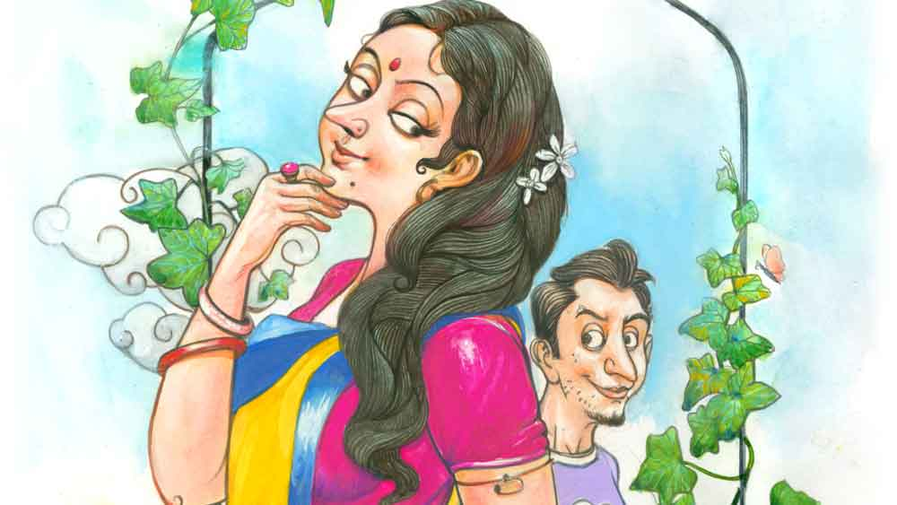

 
 <h1 align=center>জানালার ফিসফিস</h1>
<h2 align=center>তাপস রায়</h2> পুব দিক হলেও এই ঘুপচি জানালায় যে রোদ বসে তাই সে জানত না! তা হলে আজ হঠাৎ যে রোদ উঁকিঝুঁকি দিচ্ছে!

রাতে ঘুম হয় না। বেতো শরীর জুড়ে এখানে ব্যথা, সেখানে ব্যথা। সারা রাত উঃ আঃ করতে করতেই ফুরিয়ে যায়। ভোরের দিকে যখন অন্ধকার নরম, তখন একটু ব্যথার দপদপানি থামে। একটু চোখে টান ধরে। কিন্তু সে আর কত ক্ষণ! দশ-পনেরো মিনিট হলেই মনে হয় জম্পেশ ঘুম হয়েছে।

এর মধ্যেই দোতলার ডাক্তার দিদিমণি হয়তো হাঁক পাড়বে, “ননীমাধব, সিঁড়ির দরজা খুলেছ?”

তখন ধড়ফড়িয়ে উঠে পড়তে হয়। মশারি গুটিয়ে ঘুমচোখে সিঁড়ির মুখের তালা খুলে দিতে হয়। তিনি গাড়ি নিয়ে বেরোন ঠিক সাড়ে ছ’টায়। ছটা চল্লিশে গার্ডেনরিচের জল  ঢোকে নীচের ট্যাঙ্কে। দশ মিনিটের ভিতর পাম্প না চালালে ছ’তলার উপরের এই হাউজ়িংয়ের ট্যাঙ্ক ভর্তি হবে না। অল্প সময়ের ভিতরেই ওই জল খরচ শুরু হয়ে যাবে। স্কুল-কলেজ, আপিস, মায় গৃহিণীদের স্নান আটকে যাবে। সে হুলস্থুল ব্যাপার। তবে রবিবারে এই তাড়নাটা কম।

ননীমাধব রবিবারের আলস্যটা বেশি করে গায়ে মাখছিল বিছানায় শুয়ে। অভ্যেস মতো সাড়ে পাঁচটায় ঘুম ভেঙে গেছে। কিন্তু এই ফ্ল্যাটের বাবুদের মতো তারও রবিবারে বাবুগিরি করতে ইচ্ছে করে। দড়ির খাটিয়ায় ঝুলে থেকে তার শরীর একটু এ দিক-ও দিক করে। চিত হয়ে বড় করে একটা হাই তুলে বাঁ দিকে আড়মোড়া ভাঙতেই আজ এই অবাক কাণ্ড। থমথমে জানালাটা যেন ঝলমলে লাগছে!

ননীমাধব চোখ পিটপিট করে। বিড়বিড় করে, “স্বপন নয় তো!”

স্বপ্ন দেখার রোগ তার অনেক দিন হল ভেগেছে। সে সব এক সময় ছিল। কাঁচা বয়সে সবার যেমন থাকে। তখন মাঝে মাঝেই স্বপ্ন দেখত, জুড়নের বৌরে ভাগিয়ে নিয়ে সে মালাচন্দন করে নিচ্ছে। 

তাদের গাঁয়ের জুড়ন বৈরাগীর বৌ ছিল বেমক্কা সুন্দরী। ওই কাঠি-কাঠি শরীরের জুড়ন বাউলের আছেটা কী! এক মাথা চুল বাদ দিলে আর সব হাড়গোড়। হ্যাঁ, তার গলায় সুর আছে। বাউল গান ধরলে মনসাগাছতলায় ভিড় হয়। তাতে দু’দশ টাকা জমাও পড়ে। কিন্তু ওই মানুষটার শরীর বলে তো কোনও পদার্থ নেই! একটা সুন্দরী যুবতী সোমত্থ মেয়ে কদ্দিন আর ওই গলা ধুয়ে জল খাবে! ওই কাঠি শরীল দে সোমত্ত মেয়ের শরীরের তাপ জুড়োতি পারবে না কি!

ননীমাধব স্বপ্ন দেখত সেই ছিপছিপে সুন্দরীরে সাইকেলে বসায়ে নদীর পাড়ের রাস্তা দিয়ে সে দুপুরের হাওয়া কাটতি কাটতি অনেক দূরি যাচ্ছে। তার পর ঘুরে এসে বসেছে রূপনারানের পাড়ে। রূপনারানের ঠান্ডা হাওয়া খাচ্ছে আর প্রাণ জুড়নো গল্প করছে।

ননীমাধব সে স্বপ্ন প্রায় সত্যি করে ফেলেছিল। জুড়ন বৈরাগী মাঝে মধ্যে ট্রেনে চেপে গান গেয়ে মাধুকরী করে। তাতে ইনকাম একটু বেশি হয়। ননীমাধব বেশ কতক দিন ধরে নজরে রেখেছিল। এমনকি এক দিন জুড়নের পিছু-পিছু স্টেশনে গিয়ে দেখেছিল সে বিশ্বভারতী এক্সপ্রেসে উঠেছে। আর ফেরাটা নজর করতে গিয়ে ননীমাধব সে দিন দোকানে বেশি বেশি কাজ করছিল। মালিক দোকান বন্ধ করতে বললেও দোকান বন্ধ করছিল না। জুড়ন কখন ভ্যানরিকশায় বাড়ি ফিরবে তা সে জানতে চায়।

পরের দিন দুপুরবেলায় দোকানের মালিক বাড়িতে খেতে গেলে একটা সাইকেল নিয়ে ঝাঁ করে চলে এসেছিল ননীমাধব। হাতের বিশাল তরমুজখানা মাটির দাওয়ায় নামিয়ে রেখে সাইকেলে ক্রিং-ক্রিং দিলে সেই বাউলসুন্দরী ঘরের বাইরে বেরিয়ে এসে ওকে দেখে কিছুটা তো ঘাবড়েই গিয়েছিল।

ননীমাধব উত্তেজনার হাঁপ সামলে কথা ফেলে, “বৌঠান, দুপুরে বাড়ি আসতিছিলাম। পথে ভাল তরমুজ পালাম তাই নিয়ে আলাম। কিন্তু এ সব কেটেকুটে কে দেবেনে ভাবতি ভাবতি আপনার দোরে।”

বাউলসুন্দরী যে ননীমাধবকে নতুন দেখছে তা নয়। তার ঘরের জানালার উল্টো দিকেই তো ননীমাধবের জানালা। দুই জানালার মাঝখানে দূরত্বও বেশি নয়। মেরেকেটে পাঁচ ফুট। ননীমাধব মাঝেমধ্যেই টের পায় উল্টো দিকের জানালা যেন ফিসফিস করে কথা বলছে। ননীমাধব নিজের জানালায় দাঁড়াতেই একখানা লম্বা হাওয়া সরে যায়। দু’দিকের জানালাই সব সময় খোলা থাকে। তবে ননীমাধবের জানালাই বেশি উসখুস করে।

তরমুজ কেটেকুটে সুন্দর করে থালায় সাজিয়ে নিয়ে এসে বাউলসুন্দরী বলে, “খান গো বৈরাগী।” তার পর একটু চোখ মটকায়। ওই চোখের ইশারায় ননীমাধবের যা-তা অবস্থা। তার মাথায় একটু ঘুরঘুট্টি ঘোর লাগে। সেই ঘোরের ভেতর বসে থেকেই দেখে, তার সাইকেল গ্যারেজের মালিক শানবাবু বাইক থেকে নেমে দাওয়ার কোণে বসা ননীমাধবের দিকে না তাকিয়ে সোজা বাউলসুন্দরীর ঘরে গিয়ে দোর দিল। তখন ননীমাধবের সামনে রাখা থালার লাল তরমুজের কালো কালো দাঁত তার পানে চেয়ে ফিকফিক করতে লেগেছে।

ননীমাধব কী করবে! নিজের বাড়িতে তো আর ফিরতে পারবে না। বাড়িতে গেলেই সেই খোলা জানালা হাঁ করে তার দিকে তেড়ে আসবে। পারলে কালো দাঁত বার করে ভেংচি কাটতেও পারে।

“নিকুচি করেছে ঘরদোরের!”

সাইকেলের প্যাডেলে চাপ দিয়ে ননীমাধব ভাবে উধাও হয়ে যাবে। যেমন ভাবা তেমন কাজ। গ্যারেজে সাইকেল রেখে ট্রেনে চেপে সোজা হাওড়া। সেখানে ট্রেন থেকে নেমে তো আর এক গেরো। ‘এই কুলি, এই কুলি’ করতে করতে মোটাসোটা তিন জন মানুষ তাকে পাকড়াও করে। আর তার মাথায় চাপিয়ে দেয় তাদের বাক্স-প্যাঁটরা। ব্যস, দিনকতক নাগাড়ে কুলিগিরির কাজ করে মনের ব্যারাম মেটায় ননীমাধব।

কুলিতে কুলিতে ঝগড়া যেমন আছে, ভাব-ভালবাসাও আছে। ননীমাধবের গলার কণ্ঠি দেখে এক কুলি ভাব করে ফেলেছে তার সঙ্গে। ননীমাধবের যুবক শরীরে একটা আলগা শ্রী আছে। চোখমুখ কেমন মায়ালাগা। কুলির ঘরে কুলি থাকবে তা এমন বড় কথা কী! তো সেই সর্দার কুলি ননীমাধবকে নিয়ে যায় নিজের বাড়ি। রামরাজাতলায়। তার তো মনে উদ্দেশ্য আছে। নিজের কালোকুলো মেয়ে সেয়ানা হয়েছে। তারে যদি ননীমাধবের হাতে গছানো যায়। খরচাপাতি নাই। বোষ্টমের মালাচন্দন করতে কী আর খরচ!

কিন্তু সেখানেও গেরো! হরেরাম কুলি যত তার সতেরো বছরের মেয়েকে ননীমাধবের দিকে ঠেলে দেয়, ননীমাধব তত এগিয়ে যায় পঁয়ত্রিশ বছর বয়সি কুলির বৌ, হরেরামের বোষ্টমির দিকে।

এক দিন ননীমাধব নিজের ঘরের জানালায় উঁকি মেরে দেখে সে বোষ্টমি উবু হয়ে রাস্তায় বসে কয়লার উনুন ধরাচ্ছে। তার চোখ চলে যায় কুলির বৌয়ের আঁচল খসা বুকে। সে বোষ্টমি মনে হয় টের পায়। সে ইচ্ছে করেই আঁচল খসায়। মাঝেমধ্যে চা-বিস্কুট দিতে এসে কুলির বৌ ঝুঁকে পড়ে দেখায় তার সম্পদ, আর অকারণে হাসে। ননীমাধব ওই বোষ্টমির কথা ভাবতে ভাবতে হাওড়া স্টেশনে মাল টানে। আর ভাবে এই বোষ্টমিকে নিয়ে পালিয়ে সে কোথায় যেতে পারে! বোষ্টমির হাবভাব দেখে তো মনে হয়, রাজি হয়ে যাবে।

কিন্তু হরেরাম সে সুযোগ দিতে রাজি হল না। ননীমাধবকে পুষে মেয়ের গতি হবে না বুঝে এক সকালে সে নতুন এক বিহারী ছেলেকে ঘরে ঢুকিয়ে ননীমাধবের বাসন-কোসন বাইরে ছুড়ে দিল। বলল, “এ বার বিদেয় হও বাবাজি। এমুখো আর এস না।”

হরেরামের মেয়েকে পাত্তা দেওয়া দূরে থাক, ননীমাধব এই মাস ছয়েকের ভেতর এক বারও মুখ তুলে তাকে দেখেওনি। মেয়ে নিশ্চয়ই বাবাকে নালিশ করেছে। কুলিসর্দার বসে থাকার মানুষ নয়। নতুন হবুজামাই ধরে এনেছে।

ননীমাধব কী করবে! থাক পড়ে হাঁড়িকুঁড়ি। এক বার বোষ্টমির মুখটা দেখতে চেয়েছিল যাওয়ার সময়। তা সে ঘর থেকে বেরোলই না। তবে কি সে ননীমাধবকে পছন্দ করে না! না কি ননীমাধব কোনও কাণ্ড ঘটাতে পারে ভেবে সে ভয় পেয়েছে! সে বোষ্টমিও তো এত কাল তাকে উস্কেছে! তা হলে?

বিস্ময় আর ব্যথা নিয়ে ননীমাধব পায়ে পায়ে চলে আসে গঙ্গার পাড়ে। কী করবে! কী করতে পারে সে! যা পারে আপাতত, চার টাকা দিয়ে ফেরির টিকিট কেটে এই পারকে পরিত্যাগ করতে।

*****

প্রাণগোপাল দেখল, তার ট্রলির ভিতর কুঁকড়ে-মুকড়ে একটা মানুষ ঘুমিয়ে আছে। তার মাথায় গরম চড়ে যায়। কিন্তু ঝপ করে একখানা মায়ামাখা গঙ্গার হাওয়া মুখের উপর ঝাপট মারতেই সে রাগ ধুয়ে গেল। কত দিন তো রাস্তার কুকুর এসে শুয়ে থাকে, তখন তো কিছু বলে না! মানুষ শুয়ে থাকলে এত গায়ে লাগবে কেন! প্রাণগোপাল মনে মনে ক্ষমা চেয়ে নিল বাঁকেবিহারীর কাছে।

রাস্তায় ইলেকট্রিক পোস্টের সঙ্গে ট্রলি চেন আর তালা দিয়ে রেখে প্রাণগোপাল বড়বাজারের পগেয়াপট্টিতে একটা চুন-সুরকি ঝরা বাড়ির তিন তলায় থাকে। থাকে আরও জনা পাঁচেকের সঙ্গে। সেখানে মেঝেয় বস্তা পেতে শোওয়া। এক ঘুমে রাত কাবার। ভোরে উঠে সরকারি শৌচালয়ে কাজকম্ম সেরে গঙ্গায় চান। বড়বাজার জাগতে জাগতে বেলা আটটা। প্রাণগোপালেরা তার মধ্যে স্নানাদি সেরে দুপুরের রান্নাও করে ফেলে। খেয়ে নেয় সারা দিনের জন্য। তার পর লরি থেকে মাল ট্রলিতে তুলে গদিতে পৌঁছনো, কখনও গদি থেকে পার্টির গাড়িতে তুলে দেওয়া তাদের কাজ।

প্রাণগোপাল চান করতে যাচ্ছিল। তখনই তার ট্রলির উপরে ঘুমন্ত মানুষকে দেখে রাগ করে ফেলেছিল। প্রাণগোপালের চোখ ঘুমন্ত মানুষটার মুখের উপর পড়তেই কেমন মায়া হল। এই মুখে শহরের জটিলতার ছাপ নেই যেন। চান করে ফিরে এসে প্রাণগোপাল লোকটিকে আস্তে করে ডাকল, “এই যে শুনছেন, বেলা হয়েছে, এ বার ঘুম থেকে উঠে পড়ুন।”

প্রাণগোপালের মনে হল, লোকটি হয়তো খিদের চোটেই ঘুমিয়ে পড়েছে। যা হয় হবে, নিজের ভাগের ছ’টা রুটি থেকে তিনটেএকে খাওয়াবে। সে আবার ডাকল ঘুমন্ত লোকটিকে, “এই যে শুনছেন? উঠে পড়ুন।”

কী যে মায়াভরা ডাক! ননীমাধবের মনে হল মা ঘুম থেকে ডেকে তুলছে। 

প্রাণগোপালের কথায় কলাকার স্ট্রিটের সাহাবাবুর কাপড়ের গদিতে কাজ জুটে গেল। ননীমাধবের কোয়ালিফিকেশন হল সে বৈষ্ণব। আর তার সার্টিফিকেট গলায় ঝোলানো তুলসীর মালা। প্রাণগোপালের দু’-তিনটি বাঁধা গদি আছে, তার একটা এই সাহাবাবুর। ব্রিটিশ আমল থেকেই বংশপরম্পরায় কাপড়ের গদি চালায় এরা। সাহাবাবুরা বৈষ্ণব। আর তার গদির সব কর্মচারীও বৈষ্ণব। মাল নামিয়ে নিয়ে আসার জন্য এক জন পুরুষ আর পার্টিকে কাপড় দেখানোর জন্য দু’জন মেয়ে আছে। কাজের যা চাপ, পুরুষ কর্মচারীর দরকার ছিল। প্রাণগোপালের কথায় সাহাবাবু ননীমাধবকে রেখে দিলেন।

এই গদিতে এসেও ননীমাধবের যা দোষ, তা লাগল। নিউ ব্যারাকপুর থেকে আসে, কপালে রসকলি আঁকা, ফর্সা চেহারার বৌ অন্তরার সঙ্গে তার ভাব হতে লাগল এক সপ্তাহ। রোজই সে অন্তরাকে শেয়ালদা স্টেশনে পৌঁছে দিয়ে আসে রাত আটটার পরে। বড়বাজার থেকে দু’জনে হাঁটতে হাঁটতে যায়। ন’টা পাঁচের বনগাঁ লোকাল ছেড়ে দিলে ননীমাধব আবার হেঁটেই ফিরে আসে পগেয়াপট্টির ডেরায়। ননীমাধব মতলব করে অন্তরাকে ভাগাবে। বলেও ফেলে, “যে-বর বৌকে খাতি দিতে পারে না, তার কাছে থাকা কেন?”

সে মেয়ে চোখ নাচিয়ে বলে, “দেখো মরণ! সেকেন্ড হ্যান্ড এই আমাকে নিয়ে কী করবা! তুমি জোয়ান ছেলে একটা কুমারী মেয়েকে পাবা না! ঠিক পেয়ে যাবা।”

ফ্লাইওভারের নীচের দোকান থেকে একটা লেডিজ় ব্যাগ কিনে অন্তরার হাতে দিয়েছে ননীমাধব। ট্রেনের জানালায় দাঁড়িয়ে ননীমাধব অন্তরার সে কথার উত্তর না দিয়ে পারল না। বলল, “ না। অন্য কাউকে চাই না। আমি এই বৈষ্ণবীকেই চাই। কবে পালাবে, ঠিক করো।”

সে সুন্দরী তার গজদাঁত বার করে ভুবনভোলানো এক মুখ হাসি উপহার দিয়ে বলে, “বৈরাগী, এখন তো জানালা ছাড়ো। ট্রেন ছাড়ার ভোঁ পড়ে গেছে। যাও, কাল কথা কবানে।”

অন্তরা দাস আর ননীমাধবকে জড়িয়ে নানা কথা কানে আসছিল মালিক সাহাবাবুর। সমস্যা জিইয়ে না রেখে তিনি সমস্যা নির্মূল করলেন। কারও পেটে লাথি মারলেন না কৃষ্ণভক্ত সাহাবাবু। শুধু ননীমাধবকে গদি থেকে তুলে নিয়ে এসে তাঁর সিকিয়োরিটি সার্ভিসের ব্যবসায় লাগিয়ে দিলেন। না থাকবে বাঁশ, না বাজবে বাঁশি।

ননীমাধব শুয়ে থেকেই টের পেল আজ তার জানালা যেন ফিসফিস করে কথা বলছে।  কিন্তু কী কথা! ননীমাধব নিজেকে গুছিয়ে নিতে নিতে ছোট্ট মতো জানালাখানির কাছে এসে দেখল, উল্টো দিক থেকে হলুদ রোদ এসে ঢুকছে এ দিকে। সেই রোদই কথা বলছে। ননীমাধবের কানে গেল, “হ্যাঁ গো আমি, আমি। আমি তোমার সেই বাউলসুন্দরী। দেউলটি গাঁয়ের জুড়ন বৈরাগীর বৌ। বাবুদের সঙ্গে এই নতুন ফ্ল্যাটে আসতি না আসতিই আমি তোমারে দেখতি পাই। সেইথে কথা কবার তাল করচি। বাবু-বিবিরা এখনও ঘুমের থে ওঠেনি। বাসন মাজতি মাজতি তাই তো রান্নাঘরের জানালায় এয়েচি। আমি দেখিচি তুমি এখানে শোও। ভোরবেলায় ওঠো। তাই তো জানালায় দাঁড়ালাম। তোমারে এক বার ভাল করে দ্যাখপো বলে।”

সেই কোন ছোটবেলা থেকে ননীমাধবের কানে জানালার ফিসফিস মায়া হাওয়া কাটে। আজ যেন তা কণ্ঠ পেয়েছে! ননীমাধব হাঁ করে তাকিয়ে থাকে। সে দেখতে পায় একখান ছিপছিপে রোদ প্রজাপতির মতো ডানা মেলতে মেলতে তার জানালার ভেতর ঢুকে এল।

রবিবারটা বড্ড ভাল হয়ে গেল ননীমাধবের। লাজুক হেসে দিন শুরু করে সে।

সবচেয়ে আগে সব খবর, ঠিক খবর, প্রতি মুহূর্তে। ফলো করুন আমাদের Google News, Twitter এবং Instagram পেজ।