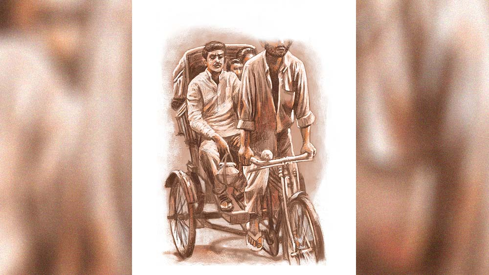

 
 <h1 align=center>জামাইষষ্ঠী</h1>
<h2 align=center>মানস দে</h2> কী  হল রে, একটু তাড়াতাড়ি চালা!”

“চেষ্টা তো করতিছি, বাবু রাস্তাটা একটু আপ আছে...”

এই বলে খগেন রিকশার প্যাডেলটায় শরীরের সমস্ত ভার সঁপে দেয়। একে পুরনো রিকশা, তার উপর আবার আপ রাস্তা। যতই সকাল হোক, জ্যৈষ্ঠ-আষাঢ়ের যে কোনও দিনই অসহ্য গরম। তার ওপর আজ জামাইষষ্ঠী। সকাল ন’টার মধ্যেই চারটে ট্রিপ দেওয়া হয়ে গেছে। শরীরটা যেন ছেড়ে দিয়েছে। ভেবেছিল জামাইষষ্ঠীর বাজার বলে দশ টাকা বেশি হাঁকবে, কিন্তু শালা জামাইয়ের বাচ্চারা আজকাল বেশ শয়তান হয়ে গেছে। একটা পয়সাও বেশি দিতে রাজি নয়। আসলে মার্কেটে এখন হেব্বি কম্পিটিশন। লাইনে এত রিকশা হয়ে গেছে যে, একটু বেশি দর হাঁকলে খদ্দের পালিয়ে যায়। এ দিকে মিষ্টি থেকে ফল, মাছ থেকে সব্জি সবার দাম আজ দেড় থেকে দ্বিগুণ। আমাকে তো একটা টাকাও বেশি দিলি না, কিন্তু দশ টাকা পিসের রসগোল্লা আজ পনেরো টাকা দিয়ে কিনে নিয়ে যাচ্ছিস। কই দোকানদারকে তো বললি না, কেন দাম বেশি। যত রোয়াব এই রিকশাওয়ালাদের ওপর!

কথাগুলো ভাবতে ভাবতে একটা বাঁক একটু জোরে নেওয়া হয়ে গেছে। তখন আবার গদাধর মানে জামাই বাবাজীবনের বাক্যবাণ শুরু, “কী, আজ সকাল থেকেই মাল টেনে চালাচ্ছিস নাকি? একটু দেখে চালা। আমাদের মারবি নাকি?”

এই বলে কত্তা আর গিন্নি সাইডের হাতলটাকে চেপে ধরে বেশি জোরে, আর কোলের ওপর বসা বাচ্চাটা রিকশার সিটের পিছনটা। খগেন কিছু বলেনি আর। শুধু বলে হাতলটা একটু চেপে ধরে বসে থাকতে। যাই হোক এক রিকশায় বর-বৌ আর একটা বাচ্চাকে নিয়ে রিকশাটা ক্যাঁচ-কোঁচ করতে করতে চলতে থাকে। আর গদাধর এক বার হাতের ঘড়িটার দিকে, আর এক বার প্রায় তিনশো টাকা দিয়ে কেনা মিষ্টির হাঁড়িটার দিকে বারবার দেখে। নিজে পড়ে গেলেও ক্ষতি নেই, কিন্তু অত দাম দিয়ে কেনা মিষ্টির হাঁড়িটা রিকশা থেকে পড়ে গেলে কেলেঙ্কারি! তা ছাড়া সকাল থেকে কিছু খায়নি। সব জমা আছে শ্বশুরবাড়ির জন্যে। ‘শালা, তিনশো টাকা দিয়ে মিষ্টি কিনেছি, তিন হাজার টাকা যদি এই জামাইষষ্ঠীতে উসুল করতে না পারি, তা হলে আমার নাম গদাধর নয়,’ মনে মনে ভাবে গদাধর। বার বার ঘড়ি দেখে আর ভাবে কত ক্ষণে শ্বশুরবাড়িতে পৌঁছে খ্যাঁটনটা দিতে পারবে। এ দিকে বাচ্চাটা বলে, “বাবা, আর কত ক্ষণ, আমার যে খুব খিদে পেয়ে গেছে, তুমি তো বাস স্ট্যান্ডে কিছুই খাওয়ালে না!”

গদাধর এ বার একটু বিরক্ত হয়ে বলে, “সব সময় এত খাইখাই করিস কেন বল তো! বাস স্ট্যান্ডে কিছু খেলে মামাবাড়ি গিয়ে লুচি, আলুর দম আর পান্তুয়া সাঁটাতে পারবি?” আসলে গদাধর মনে মনে হিসেব কষে চলে যে, তিন জনের আজকের জলখাবার, দুপুরের ভাত, বিকেলের টিফিন আর রাতের খাবার মিলে মোট কত হতে পারে। তিনশো টাকার মিষ্টি আর তিন জনের গাড়ি ভাড়া যদি কড়ায় গণ্ডায় তুলতে না পারে, তা হলে ডাহা লস। তাই আবার খগেনকে তাড়া দেয়, “কী রে, তুই যে ভাবে চালাচ্ছিস তো মনে হচ্ছে একদম বিকেলে গিয়ে পৌঁছব। টেনে চালা।”

খগেন ক্লান্ত গলায় বলে, “এই তো বাবু, চলে এলাম। আর বড় জোর মিনিট পাঁচেক।”

এই করতে করতে অবশেষে রিকশাটা এসে থামে গদাধরের শ্বশুরবাড়িতে। তত ক্ষণে শ্বশুরমশাই হাজির। ভাড়াটা মেটাতে যাবে, বুক পকেটে হাত দিয়ে বলে, “আরে, পঞ্চাশ টাকার নোটটাকোথায় রাখলাম!”

শ্বশুর বলেন, “আমি ভাড়া মিটিয়ে দিচ্ছি তোমরা ভিতরে যাও।”

গদাধর বলে, “আসলে এই ক্রেডিট কার্ডের চক্করে এখন ক্যাশ রাখতেই ভুলে যাই...দাঁড়ান এই পেয়েছি...” বলে একটা অতিমলিন পঞ্চাশ টাকার নোট বের করে খগেনকে দেয়।

খগেন নোটটা উল্টেপাল্টে দেখে বলে, “বাবু, এ যে অনেকটা ছেঁড়া। এটা পাল্টে দিন।”

গদাধর বলে, “এই মাত্র নোটটা মিষ্টির দোকান থেকে দিয়েছে। আমি যখন নিতে পারলাম তুই নিবি না কেন? এটা নিয়ে দশ টাকা ফেরত দে। রিকশা টানতে পারিস না, আবার বড় বড় কথা?” এই বাদানুবাদের মধ্যে শ্বশুরমশাই এসে দুটো কুড়ি টাকার নোট খগেনের হাতে দিয়ে ওকে বিদায় করেন। গদাধর একটু ক্ষুণ্ণ হওয়ার ভান করে বলে, “আপনাদের জন্যেই এই রিকশাওয়ালারা মাথায় চড়ে বসছে।”

 হঠাৎ খগেনের আজ খুব রাগ হয়। তারা রিকশাওয়ালা বলে কি মানুষ নয়? শালা, তোর জামাইষষ্ঠী, তো আমার কী? হাড়কিপ্পন, লজ্জাও করে না, সামান্য চল্লিশ টাকা ভাড়া, সেটাও নিজে দিলি না, আবার বড় বড় বাত। শালা বেহায়া, নির্লজ্জ! শ্বশুরের পয়সায় গান্ডেপিন্ডে গুষ্টি নিয়ে গিলতে এসেছে। পুরো মেজাজটাই দিল বারোটা বাজিয়ে। এই ভাবতে ভাবতে খগেন আবার খালি রিকশা ঘুরিয়ে প্যাডেলে চাপ দেয়। কিছুটা যাওয়ার পর এক জন বলল, “বাস স্ট্যান্ড যাবি?”

 ঘাড় নেড়ে না বলে আরও গতি বাড়িয়ে দেয় খগেন। ভাবে ওর তো কখনও জামাইষষ্ঠী হয়নি। হঠাৎ কী ভেবে রিকশা ঘুরিয়ে ঘরমুখো হয় সে। কিছু ক্ষণ পর ঘরে ফিরে বৌকে বলে, “লতা, আজ জামাইষষ্ঠী, চল তোর বাপের বাড়ি যাই ছেলেটাকে নিয়ে।”

লতা বলে, “তুমি কি পাগল হয়ে গেছ? বলা নেই কওয়া নেই, এমনি করে কি যাওয়া যায়। তা ছাড়া আমাদের তো জামাইষষ্ঠীতে কুনও দিন ডাকেওনি। তার উপর আমার বাবা তো এখন আর গায়ে-গতরে খাটতেও পারেনি, তুমাকে খাওয়াবে কী গো?”

খগেন বলে, “তোকে এই লিয়ে ভাবতে হবেনি। আমি সব ভেবে রেখেছি। তুই শুধু ব্যাগে জামাকাপড় লিয়েআর বাবুকে লিয়ে বেরিয়ে পড়।”

সবেধন নীলমণি একটাই প্যান্ট আর ভাল জামা ছিল খগেনের, তাই গায়ে গলিয়ে নেয়। বিয়ের সময় একটা ঘড়ি পেয়েছিল, কোন কালে খারাপ হয়ে গেছে, সেটাকেই ট্রাঙ্ক থেকে বার করে একটু মুছে পরে নেয়। মাথার চুলে টেরি বাগিয়ে চেহারাটাকে একটু ভদ্রস্থ করার চেষ্টা করে। বাস স্ট্যান্ডে গিয়ে শুধু দাড়িটা কমিয়ে নিলেই অনেকটা জামাই জামাই লাগবে। বাড়ি থেকে বেরোবার আগে কষ্টেশিষ্টে জমানো হাজার তিনেক টাকা যা ছিল, সেটা পকেটে পুরে নেয়। হিসেব করে দেখে যে সাড়ে এগারোটা নাগাদ শ্বশুরবাড়ি পৌঁছে যাবে। এমনিতে ওরা দুপুরের ভাত খায় তিনটের সময়, সুতরাং চিন্তা নেই।

বেশ ফুরফুরে লাগছে খগেনের। বাচ্চাটার খুব ফুর্তি। বাসে চড়বে কত দিন পর। মিনিট পনেরো হেঁটে বাস স্ট্যান্ডে পৌঁছয় খগেনরা। সেখানে দাড়িটা কামিয়ে বাসের জন্যে অপেক্ষা করতে থাকে। আজ খগেনকে ওই পোশাকে দেখে অনেকেই জিজ্ঞেস করে, “কী রে, জামাইষষ্ঠী নাকি?”

সে বুক ফুলিয়ে বলে, “হ্যাঁ, ওই আর কী! প্রতি বছর শ্বশুরবাড়িতে বলে, যাওয়া হয় না, এই বার ভাবলাম যাই, ষষ্ঠীটা এক বার করেই আসি।”

অন্য রিকশাওয়ালারা বলে, “তোর ভাগ্য ভাল রে খগেন। আমাদের তো আর এ জম্মে কেউ জামাইষষ্ঠীতে ডাকবেনি।”

হঠাৎই খগেনকে যেন সবাই বেশ সমীহ করছে আজ। ব্যাপারটা উপভোগ করে খগেন। দশটার বাসটা এলে সপরিবার তাতে উঠে বসে। মিনিট চল্লিশ পর নিকুঞ্জপুর এলে বাস থেকে নেমে যায়। তার পর বাস স্ট্যান্ডেই একটা মিষ্টির দোকানথেকে কিছু মিষ্টি কিনে জিজ্ঞেস করে, “কত হল?”

“আড়াইশো টাকা।”

মন ওঠে না ওর, “আরও একশো টাকার মিষ্টি দাও।”

‘শালা তিনশো টাকার মিষ্টি কিনে আমার উপর আজ হেব্বি রোয়াব নিচ্ছিলি। দেখ, তোর থেকে বেশি টাকার মিষ্টি কিনে আমি ষষ্ঠী করতে যাচ্ছি!’ মনে মনে ভাবে খগেন। এ দিকে বৌ বলে, “আরে অত মিষ্টি খাবে কে?”

খগেন বলে, “কেন, আমরা সবাই মিলে খাব।”

তার পর বাজার থেকে পাকা আম, লিচু, আনাজপাতি আর মুরগির মাংস কেনে। বাস স্ট্যান্ড থেকে ওর শ্বশুরবাড়ি খুব বেশি হলে তিরিশ মিনিটের হাঁটা পথ। এটা কিছুই না খগেনের কাছে। কিন্তু আজ জামাইষষ্ঠী বলে কথা। খগেনকে দেখে তিন-চারটে রিকশাওয়ালা এগিয়ে এসে বলে, “কুথা যাবেন?”

খগেন ভাবে, নিশ্চয়ই তাকে জামাই জামাই লাগছে, না হলে তিন-তিনটে রিকশাওয়ালা ওর কাছে কেনই বা আসবে! ও বলে, “বৈকুণ্ঠপুর”।

রিকশাওয়ালা বলে, “চলুন,পঞ্চাশ টাকা লাগবে।”

খগেন বলে, “তিরিশ টাকা ভাড়া হয়, এক পয়সাও বেশি দেব না। জামাইষষ্ঠী বলে যা ইচ্ছে তাই নিবি?”

কিন্তু মনে মনে বেশ খুশি হয়, কারণ জামাই না ভাবলে কেনই বা ওরা বেশি দর হাঁকবে। এক জন তিরিশ টাকাতেই রাজি হয়। এই প্রথম রিকশায় সওয়ারি হয় খগেন।

রিকশাওয়ালা বলে, “বাবু, হাতলটা ধরে থাকবেন।”

জিনিসপত্রগুলো সযত্নে পায়ের কাছে রেখে ছেলেটাকে কোলে বসিয়ে রওয়ানা দেয় শ্বশুর বাড়ির দিকে। “কী রে, একটু তাড়াতাড়ি চালা...” উঠেই রিকশাওয়ালাকে বলে খগেন।

রিকশাওয়ালা বলে, “বাবু, চিন্তা করবেননি, ঠিক তাড়াতাড়ি পৌঁছে যাব। ক’টা বাজে এখন?”

খগেন বলে, “তোর টাইম জেনে কী দরকার? তুই রিকশা চালাচ্ছিস, চালা না।”

রিকশাটা এক বার জোরে বাঁক ঘুরতেই খগেন বলে ওঠে, “কী রে! মাল খেয়ে চালাচ্ছিস নাকি?”

রিকশাওয়ালা বলে, “বাবু, আমি মাল খাই না।”

খগেন বলে, “ও রকম সবাই বলে।”

খগেনের মধ্যে এখন পুরো জামাই সত্তা ঢুকে পড়েছে। ও দেখতে চাইছে নিজে যাত্রী হয়ে ওর মতো আর এক রিকশাওয়ালাকে তুই-তোকারি, হালকা গাল-মন্দ করতে কেমন লাগছে। ‘দূর, ঠিক ভাল লাগছে না। জানি না কেন রিকশায় উঠে লোকজন গালমন্দ করে,’ ভাবে খগেন।

যাই হোক, এর মধ্যেই রিকশা হেলতে-দুলতে ওর শ্বশুরবাড়ির সামনে এসে দাঁড়ায়। পকেট থেকে পঞ্চাশ টাকার নোট বের করে বলে, “যা তোকে পঞ্চাশই দিলাম।”

রিকশাওয়ালা ভাবে, এত গাল-মন্দ করার পর কেউ তাকে এক্সট্রা কুড়ি টাকা দিচ্ছে, এ রকম জীবনে প্রথম। এমনিতেই যা রফা হয় কেউ তার চেয়ে এক পয়সাও বেশি দেয় না! খুশিতে গদগদ হয়ে বাজারটা নামিয়ে একেবারে ঘরে ঢুকিয়ে দেয় রিকশাওয়ালা।

অসময়ে বলা নেই কওয়া নেই একদম জামাইষষ্ঠীর দিন সবাই মিলে শ্বশুরবাড়ি হাজির! একটু ঘাবড়ে যায় খগেনের শ্বশুর-শাশুড়ি। তার ওপর এত বাজার। যাদের কোনও ক্রমে দুবেলা দু’মুঠো জোটে, তার বাড়িতে আজ মন্ডা-মিঠাই, আম, লিচু, মুরগির মাংস। এই সব দেখে শ্বশুর-শাশুড়ির ভিরমি খাওয়ার জোগাড়। এত বাজারপাতি দেখে, জামাইকে একটা চাটাই পেতে বসতে দেয়। একটা তালপাতার ছেঁড়া পাখা এনে শাশুড়ি খগেনকে হাওয়া করতে থাকে। খগেনের বেশ লাগে, তা হলে সেও জামাই। তারও খাতির আছে।

যাই হোক কিছু ক্ষণ পর শাশুড়ির হাত থেকে পাখাটা নিয়ে বলে, “আপনি রান্নার দিকে মন দিন, হাওয়া করতে হবেনি।” বেলা তিনটে নাগাদ সবাই এক সঙ্গে খেতে বসে। তবে জামাইয়ের পাতটা যেন সবার থেকে একটু আলাদা। পঞ্চব্যঞ্জন রান্না করে কবে ওরা শেষ খেয়েছে কেউই মনে করতে পারে না। বাচ্চাটার আজ খুব আনন্দ। কত দিন পর মুরগির মাংস খাচ্ছে। আহা! কী সুন্দর খেতে। শেষ পাতে প্রত্যেকের জন্যে একটা রসগোল্লা আর একটা করে সন্দেশও থাকে। খাওয়ার পর ঘরের পেছনে আমগাছের তলায় গিয়ে মৌজ করে একটা সিগারেট ধরায় খগেন। বিড়ি খাওয়া তোবড়ানো গালে শেষ কবে সিগারেটে টান দিয়েছে মনে করতে পারে না। হাতটা মুঠো করে ধরে এক এক বার টান দেয় আর আস্তে আস্তে নাক দিয়ে মুখ দিয়ে ধোঁয়া ছাড়তে থাকে। কখনও এই ভাবে সিগারেটে খেতে কোন একটা বাংলা সিনেমায় রঞ্জিত মল্লিককে দেখেছিল।

কিছু ক্ষণ পর শাশুড়ি ঘরের মধ্যে থেকে চাটাই আর বালিশ এনে গাছতলায় পেতে দেয়। মাঝে মাঝে হালকা হাওয়ায় বেশ এক গা জুড়নো অনুভূতি। চোখটা আস্তে আস্তে বন্ধ হয়ে আসে। তার পর কখন যে ঘুমিয়ে পড়ে আর মনে নেই। উঠল যখন, তখন একেবারে রোদ পড়ে গেছে। চাটাইয়ের ওপর একটা হাঁটুর ওপর আরেকটা হাঁটু রেখে, লোকনাথ বাবার মতো ভঙ্গিতে বসে চা খেতে খেতে আর একটা সিগারেট ধরায় খগেন। সন্ধে হয়ে আসছে। অদ্ভুত এক আমেজে যেন ভেসে যায় আজ। বোধহয় জামাই হওয়ার আনন্দে।

পরের দিন খগেন একাই রওনা দেয় শ্বশুরবাড়ি থেকে। বৌ আর ছেলে সপ্তাহ খানেক পরে আসবে বলেছে। আজ হেঁটেই ফিরে যাবে বাস স্ট্যান্ডে। কিছু ক্ষণ হাঁটার পরই পেছন থেকে দেখে সেই কালকের রিকশাওয়ালা ডেকে বলছে, “বাবু স্ট্যান্ডে যাবেন নাকি? চলুন পৌঁছে দিব।”

“না, দরকার নাই।”

“বাবু আজ পঁচিশ টাকাই দিবেন। একা আছেন, পাঁচ টাকা কম দিবেন।”

“আমি বাবুটাবু নই রে। আমি তোর মতো রিকশাওয়ালা। আমাকে বাবু বলে ডাকার দরকার নাই।”

খগেনের কথা ঠিক বিশ্বাস করতে পারে না রিকশাওয়ালাটা। সে বলে, “বাবু, কেন রসিকতা করতিছেন?”

 “এক কাজ করি, তুই বরং তোর রিকশায় বোস, আমি ওটা টেনে নিয়ে যাই। তুই তো জানিস, রিকশা সবাই চালাতে পারে না। একটা টান থাকে। চালাতে না জানলে উল্টে যাবে। তা হলেই বুঝতে পারবি আমি রিকশাওয়ালা কি না।”

রিকশাওয়ালা যাত্রী হয়ে নিজের রিকশায় বসে আর খগেন রিকশা চালাতে শুরু করে। রিকশাওয়ালাকে খগেন বলে, মেজাজে আরাম করে বসতে, সে আজ তাকে যাত্রী হওয়ার সুখ দিতে চায়। 

রিকশা টানতে টানতে খগেনের মনে হয় সব যাত্রীই এক একটা রিকশাওয়ালা, সে যে শালা যতই জামাই সাজুক আর ফুলবাবু সাজুক। কোনও না কোনও রিকশা সব শালাকেই টেনে নিয়ে যেতে হয় আজীবন। নিজে যেমন ওপরওয়ালার কাছে হুড়কো খায়, তেমনই নিজে কাউকে বাগে পেলে তাগত ফলিয়ে নিতে ছাড়ে না। নিজের জগতে সবারই কোনও না কোনও ‘জামাই’ আছে যে সব সময় বাকিদের তুইতোকারি, গালমন্দ করে। মানুষকে মানুষের সম্মান দেয় না। সব মাছই জানে তার চেয়ে বড় মাছ তাকে বাগে পেলে গিলে নেবে ঠিক, কিন্তু যত ক্ষণ না সেটা হচ্ছে, তত ক্ষণ সে শালা তার চেয়ে ছোট মাছকে গিলতে ছাড়ে না। এই ভাবেই চলে শালার জীবন!

এই সব ভাবতে ভাবতে রিকশার ডান চাকাটা একটা ছোট গর্তের মধ্যে পড়তেই রিকশাওয়ালা যাত্রীর আরাম টলে যায়, সে তেতো গলায় বলে ওঠে, “কী রে ব্যাটা, আজ সকাল সকাল মাল টেনে এসেছিস নাকি! দেখে চালা।”

এই কথায় দু’জনেই হো হো করে হেসে ওঠে।