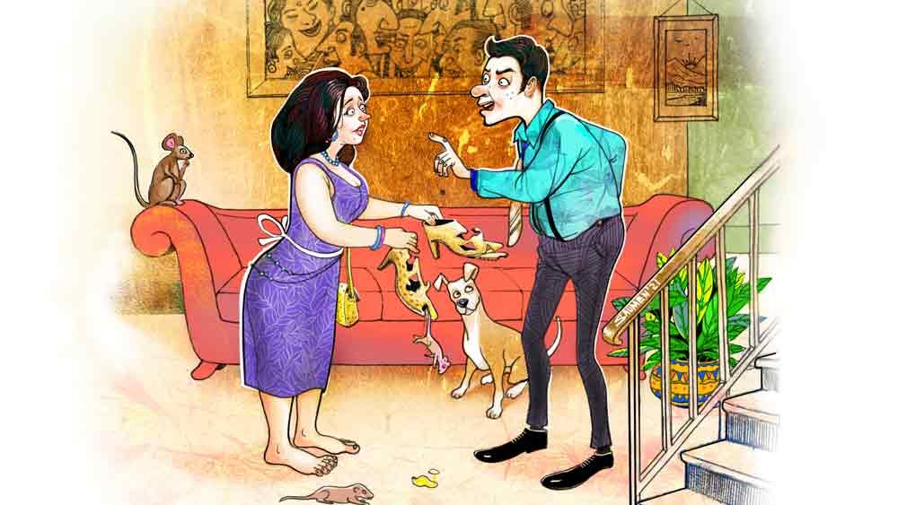

 

<h1 align=center> জুতো</h1>
<h2 align=center>সঞ্জীব ঘোষ</h2>
আমার একমাত্র বৌয়ের নাম সুচেতনা। ছেলের নাম উৎসব। আট বছরের বিবাহিত জীবন। তিন জনের ছোট্ট সংসার। মোটামুটি শান্তিপূর্ণ বলা যায়।   মাস ছয়েক আগে, তখন অফিসে অডিট চলছিল, অনেক দেরিতে ফিরেছি। শরীর-মন ক্লান্ত। রাতে বিছানায় শুয়েও ঘুম আসছিল না। এ পাশ-ও পাশ করছিলাম। সুচেতনা বিছানায় আমার পাশে বসে মোলায়েম গলায় জিজ্ঞেস করল, “কী গো, তুমি ঘুমিয়ে পড়েছ? কপালটা টিপে দেব? তোমার আরাম লাগবে।”   সুচেতনা ওর নরম আঙুল দিয়ে আমার কপাল টিপতে শুরু করল। আমার চোখ বুজে এল। হঠাৎ সুচেতনা বলল, “তোমাকে না জানিয়ে একটা কাজ করে ফেলেছি। জানি তুমি রাগ করবে।”   আমার ঘুমের আবেশ পলকে উধাও। বললাম, “কী করেছ সু?”   সু আমার বৌয়ের আদরের ডাকনাম। লাজুক মুখে সুচেতনা বলল, “অনলাইনে এক জোড়া জুতোর অর্ডার দিয়েছি।”   আমার উৎকণ্ঠার অবসান হল। বললাম, “ভালই করেছ। সামনেই তো পুজো, এখন অফার দিচ্ছে সর্বত্র।”   “সেই জন্যই তো কিনলাম। মোবাইলে দেখে এত পছন্দ হয়ে গেল যে অর্ডার করে দিলাম। কাল ডেলিভারি। ডেলিভারির সময় তো তুমি অফিসে থাকবে। তাই বলছিলাম টাকাটা এখনই দিয়ে দাও।”   “কাল সকালে দিয়ে দেব। কত?”   টাকার অ্যামাউন্ট শুনে আমার মূর্ছা যাওয়ার জোগাড়। মেজাজ হারিয়ে ফেললাম। গলা তুলে বললাম, “মানে! জুতো কেনার জন্য এত টাকা বাজে খরচা! আমার কি চুরির টাকা? কত ধানে কত চাল বোঝো? শোনো জুতোর পিছনে এত টাকা খরচা করার ক্ষমতা আমার নেই— স্পষ্ট বলে দিলাম।”   গলার আওয়াজটা এতটাই উঁচু হয়ে গিয়েছিল যে বিছানার ধারে শুয়ে থাকা উৎসব ঘুমের মধ্যেই কেঁপে উঠল। আমার কপালে সুচেতনার নরম আঙুল আর নেই। আমি চোখ বন্ধ করে বিছানায় পড়ে আছি। হঠাৎ কান্নার আওয়াজে আমার হৃদয় চুরমার হয়ে গেল। আমার সুচেতনা কাঁদছে। ফুঁপিয়ে কান্না। আমি সহ্য করতে পারলাম না। সুচেতনার কাঁধে আমার ডান হাত রাখলাম। সুচেতনা হাত সরিয়ে দিল। কান্না দ্বিগুণ হল। সুচেতনাকে দু’হাত দিয়ে কাছে টানার চেষ্টা করলাম। ব্যর্থ হলাম। কী বলব বুঝে উঠতে পারলাম না।   সুচেতনা কান্নাভেজা গলায় বলতে লাগল, “আমি আর কখনও তোমার কাছে কিছু চাইব না। জুতোর অর্ডার আমি আজই ক্যানসেল করে দেব। আমি খালি পায়ে ঘুরে বেড়াব। আমার জন্য তোমাকে আর টাকা খরচ করতে হবে না।”   মনে মনে বললাম, ‘তুমি টাকা খরচ না করলে আমি বেঁচে যাব। তাজমহল না পারি, এই বাড়িটা দোতলা করে ফেলব।’   মুখে বললাম, “অফিসের নানা ঝামেলায় মাথার ঠিক নেই। আমাকে এ বারের মতো ক্ষমা করো। আমি তোমাকে আর এ ধরনের কথা বলব না। তুমি জুতোর অর্ডার ক্যানসেল কোরো না।”   সুচেতনা কোনও উত্তর দিল না। কান্নার শব্দও আর নেই। আমার পাশে শুয়ে পড়ল। আমি সুচেতনাকে কাছে টেনে নিলাম। সুচেতনা বাধা দিল না।      সত্যি সুচেতনার রুচির প্রশংসা করতে হয়। জুতো এত সুন্দর হতে পারে, আমার অজানা ছিল। কী মোলায়েম আর নরম। বলছে হরিণের চামড়া। এ সব জুতো পায়ে না পরে সাজিয়েও রেখে দেওয়া যায়। সুচেতনা জুতো পরে বারান্দা দিয়ে হাঁটতে লাগল। আর মুখে খুশির অভিব্যক্তি প্রকাশ করে বলল, “কেমন লাগছে গো দেখতে?”   আমি সুচেতনার মিষ্টি মুখের দিকে এক পলক তাকিয়ে নিয়ে বললাম, খুব ভাল লাগছে। সুচেতনা খুব খুশি হল। জুতো জোড়ার স্থান হল সিঁড়ির নীচের ছোট্ট কুঠুরিতে অন্যান্য জুতোর সঙ্গে। তিন প্রস্থ খবরের কাগজ জড়িয়ে পলিথিনের ভিতরে ঢুকিয়ে রেখে দিল পরিত্যক্ত ছোট কাঠের সেফের মধ্যে। আমি বললাম, “তুমি জুতো পরবে না?”   হেসে উত্তর দিল সুচেতনা, “পরব। বিশেষ অনুষ্ঠানে পরব।”   বিশেষ অনুষ্ঠান এল প্রায় মাস চারেক পর। অফিসের বড় সাহেবের বিবাহবার্ষিকীতে সস্ত্রীক নেমন্তন্ন। না গেলে প্রমোশন আটকে যেতে পারে।   সুচেতনা নির্দিষ্ট দিনে সময়ের আগেই সাজগোজ কমপ্লিট করে সাধের জুতো জোড়া পরার জন্য সিঁড়ির নীচের কুঠুরিতে ঢুকে গেল। কিছু ক্ষণ পর সেখান থেকে আর্তনাদ শোনা গেল। আমি ভয় পেয়ে ছুটে গেলাম সিঁড়ির নীচে। সেখানে গিয়ে দেখলাম, আমার সুসজ্জিতা বৌ দু’হাতে দুটো জুতো ধরে স্ট্যাচুর মতো দাঁড়িয়ে। দেখলাম, দুটো জুতোই নেংটি ইঁদুরে কুচি কুচি করে কেটে নতুন ডিজ়াইন করে দিয়েছে। হুঙ্কার দিল সুচেতনা। বলল, “তোমার জন্যই আমার সাধের জুতো জোড়ার আজ এই হাল। কত দিন বলেছি ইঁদুরের উৎপাত বেড়েছে, বিষের ব্যবস্থা করো। শুনেছ এক বারও?”   আত্মপক্ষ সমর্থনে বললাম, “বিষ দিয়ে ইঁদুর মারলে মরা ইঁদুর খুঁজে পাওয়া যাবে না। পচে গন্ধ উঠবে, পোকা হবে— ঘরে থাকা যাবে না।”   “ঘরে থাকতে না পারলে বাপের বাড়ি গিয়ে থাকতাম। কিন্তু আমার যে এত বড় ক্ষতি হয়ে গেল, এর কী হবে? আমি জুতোজোড়া পরে কাউকে দেখাতেই পারলাম না। এতগুলো টাকা আমার জলে গেল।”   আমিও নিজেকে সামলাতে পারলাম না, “টাকাটা তোমার না আমার? তোমার জুতোর টাকায় একটা একান্নবর্তী পরিবারের এক সপ্তাহ চলে যায়। তোমার মতো বেহিসেবি মেয়ের জন্য আমার জীবনটা জ্বলে গেল।”   “কী বললে তুমি?”   “যা বলেছি ঠিকই বলেছি। তোমার তো কোটিপতি ব্যবসাদার দেখে বিয়ে করা উচিত ছিল। তোমার আনলিমিটেড শখ পূরণ করার ক্ষমতা আমার নেই। আমি আর একটা পয়সাও খরচ করতে পারব না। এর পর তুমি যা কিনবে, তোমার বাবা-মায়ের কাছ থেকে নেবে।”   “একদম বাবা-মাকে টেনে আনবে না। আমার শখ-আহ্লাদ পূরণ করতে পারবে না তো বিয়ে করেছিলে কেন? বিয়ের আগে তো ফোন করে করে ঘুমের বারোটা বাজিয়ে দিয়েছিলে। তখন বুঝতে পারিনি তুমি কী জিনিস! ভাল করে শুনে রাখো, এই জুতো আমি আবার কিনব। সেই জুতোর দামও তোমাকে মেটাতে হবে।”   কঠিন হলাম, “অসম্ভব! তোমার সঙ্গে আর থাকা যাবে না। তুমি যেখানে খুশি যেতে পারো। আমি ডিভোর্স করব।”   “আমি কালই বাড়ি ছেড়ে চলে যাব। তোমার সঙ্গে আমার কোর্টেই দেখা হবে। তোমার হাড়ে দুব্বো গজাতে না পারি তো আমার নাম সুচেতনাই নয়।”   “কাল কেন? আজই চলে যাও। দেখি তোমার কত মুরোদ!”   কোনও উত্তর না দিয়ে সুচেতনা ঘরের মধ্যে চলে গেল। আমি একাই বড়সাহেবের বিবাহবার্ষিকীতে যোগ দেওয়ার জন্য গৃহত্যাগ করলাম।   রাতে ফিরে বিছানায় শুয়ে অনুভব করলাম, আমি আর সুচেতনা দুই ভিন্ন গ্রহের বাসিন্দা। বড়সাহেবের পার্টিতে পেগ দুই মদ পেটে পড়ার জন্য সকালে ঘুম থেকে উঠতে দেরি হয়ে গিয়েছিল। উঠে দেখলাম, সুচেতনা বিছানায় নেই। ভাবলাম কিচেনে গিয়েছে। কিংবা মর্নিং ওয়াকে। কিন্তু কোথাও খুঁজে পেলাম না। উৎসবও নেই। মোবাইল ফোনটা হাতে নিয়ে সুচেতনাকে ফোন করলাম। সুচেতনা ফোন ধরেই বলল, “আমি বাপের বাড়ি চলে যাচ্ছি। উৎসবকেও নিয়ে যাচ্ছি। আর ফিরব না।”   বলেই ফোনটা কেটে দিল সুচেতনা। আমি বহু বার ফোন করলাম। এক বারও ধরল না।      সাত দিন অতিক্রান্ত। সুচেতনার দেখা নেই। ফোন করলেও রেসপন্স নেই। শুধু রিংটোন বেজে যায়। আমি শ্বশুরবাড়ির পথ ধরলাম না। জেদ আমারও কম নয়। আমার রুটিন তৈরি করে নিলাম। সকালে পাঁচুর দোকানে চা-বিস্কুট। তার পর নিজে রাঁধা সেদ্ধ ভাত। অফিস যাত্রা, অফিস ক্যান্টিনে টিফিন, রাতে সুনীলের দোকান থেকে রুটি-তরকা।   বিয়ের আগের একটা মধুর অভ্যেস ফিরিয়ে এনেছি। এখন ফ্রিজ-ভর্তি বিদেশি মদ। নিয়ম করে প্রতিদিন খাই। বিন্দাস লাইফ। মাঝে মাঝে স্বপ্নে সুচেতনা এসে ডিস্টার্ব করে। মন খারাপ করে দেয়।   আমার বন্ধু দুলালের সঙ্গে কথা বললাম। দুলাল উকিল। আমার কেস হিস্ট্রি শুনে দুলাল বলল, “ডিভোর্স ছাড়া উপায় নেই। ওই রকম দজ্জাল মহিলার সঙ্গে ঘর করার কোনও মানেই হয় না,” বলে মিনিট খানেক কী যেন ভাবল। তার পর বলল, “তোর সুস্মিতাকে মনে আছে? আমার মাসতুতো বোন সুস্মিতা, মানে সুমির কথা বলছি।”   বললাম, “কেন মনে থাকবে না। তোর বাড়িতে কত বার দেখেছি। শ্যামবর্ণা রোগাটে চেহারা। চোখ দুটো খুব সুন্দর।”   “সুমি আর রোগা নেই। আর গায়ের রংও ফর্সা হয়ে গিয়েছে। দেখতেও চমৎকার।”   “হঠাৎ সুমির কথা কেন?”   “সুমির কপালটাও তোর মতো। বিয়ের পর মদ্যপ স্বামীর অত্যাচারে ডিভোর্স নিতে বাধ্য হল। এখন একটা বেসরকারি অফিসে চাকরি করে। তুই সুমির সঙ্গে কথা বল।”   “কেন? সুমি কী করবে?”   “তোর ভাল বন্ধু হবে। তোর সুখ দুঃখ ভাগ করে নেবে।”   আমি দুলালের কথা ঠিক বুঝতে পারলাম না। চুপ করে থাকলাম।   দুলাল বলল, “সামনের রবিবার আমার বাড়িতে তোর নেমন্তন্ন। ওই দিন সুমি নিজে হাতে রান্না করবে। তুই এলে আমি খুশি হব।”   বললাম, “ঠিক আছে। আমি রবিবার যাব।”   বাড়ি ফিরে এলাম। বেডরুমে ঢুকতেই হু হু করে উঠল বুকটা। সুচেতনার কথা মনে পড়ল। মন শক্ত করলাম। সুচেতনাকে ভুলতেই হবে। এনিহাউ।   রবিবারের সকালে পৌঁছে গেলাম দুলালের বাড়ি। সুস্মিতার চেহারা সত্যি পাল্টে গিয়েছে। অনেক আকর্ষক হয়েছে। দুপুরে কব্জি ডুবিয়ে খাওয়াদাওয়া করলাম। সুস্মিতার রান্নার হাত বড়ই চমৎকার। এত সুন্দর রান্না সুচেতনা রাঁধতে পারবে না।   সুস্মিতা ক্রমশ আমার মনের কাছাকাছি চলে এল। ফোনে ‘হ্যালো, কেমন আছেন’ দিয়ে শুরু হল। তার পর পালতোলা নৌকো নিয়ে মাঝসমুদ্রে পাড়ি দিলাম দু’জনে। সফর যেন শেষ হয় না। চ্যাট করে, ভিডিয়ো কল করে দু’জনে সীমা লঙ্ঘন করতে শুরু করলাম। দুলাল ডিভোর্সের মামলার তোড়জোড় করতে লাগল।   এক দিন কথায় কথায় দুলাল বলল, “কদ্দিন আর হাত পুড়িয়ে খাবি! সুস্মিতাকে তোর বাড়িতে নিয়ে আয়। লিভ টুগেদারে কোনও অসুবিধে নেই। তা ছাড়া ডিভোর্স হয়ে গেলে তো বিয়ে হবেই।”   অবাক হয়ে বললাম, “লিভ টুগেদার! লোকে কী বলবে?”   “লোকের কথায় গুলি মার। তুই রাজি থাকলে আমি সুমির সঙ্গে কথা বলতে পারি। ভদ্রসমাজে লিভ টুগেদার এখন জলভাত।”   দুলাল দরাজ সার্টিফিকেট দিলেও আমি মেনে নিতে পারলাম না। তাই সুস্মিতা আর আমার সম্পর্ক ফোনেই সীমাবদ্ধ রাখলাম। ভবিষ্যতে যা ঘটার ঘটবে। তখন দেখা যাবে।   বেশি দিন অপেক্ষা করতে হল না। পর দিন সকালে ঘুম ভাঙল মোবাইলের আওয়াজে। বালিশের পাশে রাখা ফোন তুলে নিলাম হাত বাড়িয়ে। কিন্তু ফোন দেখে আমি থ। সুচেতনা করেছে! নিজেকে সামলে নিয়ে ফোন ধরলাম। উৎসবের গলা ভেসে এল, “বাবা, দরজা খোলো। আমি আর মা গাড়িতে বসে আছি।”   “ঠিক আছে। আমি আসছি,” বলে ফোন কেটে দিলাম। তার পর দ্রুত পায়ে সদর দরজার দিকে এগিয়ে গেলাম। দরজা খুলে দিতে ঘরে ঢুকল আমার অর্ধাঙ্গিনী। পিছনে আমার ছেলে উৎসব। সুচেতনার দু’হাতে দুটো বড় ব্যাগ। চেহারা আগের থেকে স্লিম। আমার দিকে এক বারও পিছন ফিরে দেখল না।   দশ দিন পেরিয়ে গেল। সুচেতনার হাতের ছোঁয়ায় সারা বাড়ির হাল ফিরেছে। যেখানে যে জিনিস থাকার কথা সেটা সেখানেই আছে। শুধু ফ্রিজ থেকে উধাও আমার বিদেশি মদের বোতল। সেগুলো কোথায় জানতে চাওয়ার সাহসও নেই। এই দশ দিনে সুচেতনা আমার সঙ্গে একটি কথাও বলেনি। অথচ দিব্যি খাবারদাবার পাচ্ছি সময়ে সময়ে। পাচ্ছি না শুধু সুচেতনার মুখের ভাষা আর মিষ্টি হাসি। সুচেতনার সারা মুখ জুড়ে শুধু বর্ষার কালো মেঘ। যে কোনও মুহূর্তে বৃষ্টি নামতে পারে। কিন্তু বৃষ্টির দেখা নেই। রাতের বিছানায় দু’জনে দু’প্রান্তে। মাঝে উৎসব।   দুলাল সব শুনে বলল, “তুই সুচেতনাকে বাড়ি থেকে বার করে দে। যে বৌ বাড়ি থেকে বিনা কারণে চলে যায়, তার সঙ্গে থাকা আর পরস্ত্রীর সঙ্গে থাকা একই ব্যাপার।”   দুলালের উপমা ভাল লাগল না। সুচেতনা আমার অগ্নিসাক্ষী করা বৌ। এক কথায় কি ছাড়া যায়? সুস্মিতাকে ফোন করে পরামর্শ চাইলাম। সুস্মিতা কাঁদতে কাঁদতে জবাব দিল, “ইউ আর আ চিট। আমার ভালবাসার কোনও মূল্য নেই তোমার কাছে। আমাকে আর ডিস্টার্ব করবে না।”   আমি সুস্মিতার কাছে ব্রাত্য হয়ে গেলাম। আর সুচেতনা আমার কাছে থেকেও নেই। বুকের মধ্যে যন্ত্রণা অনুভব করলাম। কিন্তু যত বার সুচেতনার সামনাসামনি হওয়ার চেষ্টা করি, তত বারই অদৃশ্য বাধা আমাকে আটকে দেয়।   পেরিয়ে গেল আরও সাত দিন।   বিছানায় শুয়ে আছি। চোখে ঘুম নেই। পুরনো দিনের সুখস্মৃতি মনে পড়ছে। সুচেতনার দিকে তাকালাম। নাইট বালবের হালকা আলোয় দেখলাম সুচেতনা ঘুমোচ্ছে। হঠাৎ আমার দু’চোখ জলে ভরে গেল। কাঁদলে মানুষের মন হালকা হয়। যন্ত্রণা কমে। কিন্তু আমার যন্ত্রণা কমল না। দেওয়ালে টাঙানো রাধাকৃষ্ণের একটা ক্যালেন্ডার আমার দৃষ্টি আকর্ষণ করল। শ্রীকৃষ্ণ রাধার মান ভঞ্জনের জন্য কত কী করেছেন। আর আমি সুচেতনার মান ভঞ্জনের জন্য কিছু করতে পারব না?   উঠে বসলাম। বিছানা ছেড়ে নেমে এগিয়ে গেলাম সুচেতনার কাছে। সুচেতনার ফর্সা পায়ের পাতাগুলো দেখা যাচ্ছে। এখন গভীর রাত। কোথাও কেউ নেই। কেউ কিছু দেখতে পাবে না। সুচেতনার পা দুটো জড়িয়ে ধরে বলে ফেললাম, “আমি ভুল করেছি। তুমি আমায় ক্ষমা করো।”   আরও কী কী বললাম জানি না। চোখ থেকে কয়েক ফোঁটা জলও সুচেতনার গায়ে পড়ল। সুচেতনাও ফুঁপিয়ে কেঁদে উঠল। মিনিট দুয়েক কান্নার পর সুচেতনা বিছানা থেকে নীচে নেমে আমায় প্রণাম করল। আমি কিছু বলার আগেই আমাকে জড়িয়ে ধরে কান্নার গতি বাড়াল। আমি নতুন করে সুচেতনাকে আবিষ্কার করলাম।   বিছানায় পাশাপাশি দু’জনে। আমাকে জড়িয়ে ধরে সুচেতনা বলল, “কেলটি ধুমসি মেয়েটার জন্য মদ ধরেছ! কী আছে ওই ডিভোর্সির? তোমার বিয়ে করার এত শখ? ছেলে-বৌকে পথে বসাতে চাও? তোমার লজ্জা করে না? মদ আর ওই মেয়েটার পিছনে কত টাকা খরচা করেছ? আমার জুতোর চেয়ে কম টাকায় হয়ে গিয়েছে তো সব? আর ডিভোর্স পাওয়াবে কে? তোমার প্রাণের বন্ধু দুলাল উকিল? সে-ই তো তোমার আর তার বোনের নামে হাজার হাজার কেচ্ছা কেলেঙ্কারি শোনাত আমাকে ফোন করে, যাতে আমি আর না ফিরি। তোমাকে ডিভোর্স পাওয়াতে ওর সুবিধে হয়। আমাকে আর কী বোঝাবে, তোমার দৌড় আমি জানি না! আমি হঠাৎ ফিরে আসায় সবার বাড়া ভাতে ছাই পড়ে গেল!”   আমি কোনও উত্তর দিলাম না। আজ আমি শ্রোতা।   সুচেতনা চুপ করলে বললাম, “কালই কিন্তু তুমি অনলাইনে নতুন জুতোর অর্ডার দিয়ে দেবে। আমি অফিস থেকে ফিরে তোমাকে টাকা দিয়ে দেব।”   উত্তরে সুচেতনা কিছু বলল না। ওর ঠোঁট দুটো আমার ঠোঁটের খুব কাছে এগিয়ে এল।