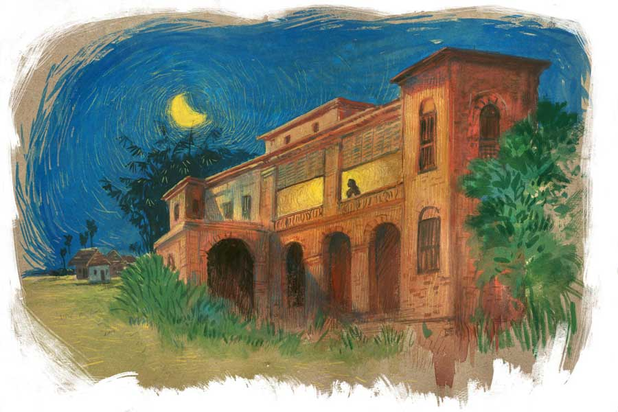

 
 <h1 align=center>জোছনাদির বাড়ি</h1>
<h2 align=center>অলক চক্রবর্তী</h2> আসল নাম জোছনা নয়, দেবাঙ্গনা। আমি মনে মনে বলি জোছনাদি। জোছনাদির চেয়ে বয়সে ছোটরা সবাই ওকে বুঁচকিদি বলে ডাকে। আমিও তাই বলতাম।

ক্লাস নাইনে উঠে আমার ‘জোছনাদি’ আবিষ্কার।

জোছনাদির বাবার নাম শুভঙ্কর মহাপাত্র। ওরা আমাদের গ্রামে সবচেয়ে বড়লোক। ওদের তিন তলা বিশাল পাকাবাড়ি। গ্রামের আর বাকিদের সব মাটির বাড়ি। শুভঙ্কর জেঠুর অনেক বিঘে ধানজমি, পুকুর, ধানের আড়ত, চালকল।

আমার বাবা পোস্টাপিসের পিওন। নিরীহ, নীরব মানুষ। বিঘা চারেক ধানজমি। সামান্য আয়। কিন্তু জোছনাদির বাড়িতে আমার জ্ঞান হওয়ার আগে থেকে যাতায়াত। মা যেত। জোছনাদির ঠাকুমা মাকে বৌমা বলে ডাকত। উপরি আয়ের জন্য মা মুড়ি ভেজে বাজারে পাঠাত। এক বার সেই মুড়ি খেয়ে ঠাকুমার খুব ভাল লাগে। তার পর থেকেই মায়ের ডাক পড়ে জোছনাদির বাড়িতে গিয়ে মুড়ি ভাজার। শুধু মুড়ি নয়, উৎসব-অনুষ্ঠানের সময় মুড়কি, নারকোল, চাল, তিলের নাড়ু, তালপিঠে, পুরপিঠে— নানা কারণে মা-কে ওদের দরকার পড়তই বার বার।

মা হিংয়ের কচুরি খুব ভাল তৈরি করতে পারত। সঙ্গে নানা রকম আলুর দম। কখনও জোয়ান-আচারের স্বাদে, কখনও লেবু-ধনেপাতার স্বাদে, কখনও কাজুবাদাম-পোস্তবাটা দিয়ে সাদা-সাদা, আবার কখনও আলুর ভেতরটা কুরে ফাঁকা করে ভরে দিত মশলাদার ডালবাটার পুর। রান্না নিয়ে পরীক্ষানিরীক্ষার ঝোঁক মায়ের বরাবরই। তাই জোছনাদিদের বাড়িতে আত্মীয়স্বজন এলে মায়ের ডাক পড়ত কচুরি-আলুর দম রাঁধার জন্য।

মায়ের এই কাজ আপাত ভাবে অসম্মানজনক মনে হলেও জোছনাদির পরিবারের অমায়িক ব্যবহার সে রকম ভাবার অবসর দেয়নি। সম্বোধন বা ব্যবহারে সৌজন্যের খামতি ছিল না। যেন আমরাও ওদের আত্মীয়।

আমাদের পারিবারিক আয় সামান্যই। বাবা কারও সাতে-পাঁচে থাকে না। কোনও রাজনৈতিক দলের নেতা-টেতা বা তেমন হোমরাচোমরা কারও সঙ্গে বাবার সম্পর্ক নেই। এমন এক পরিবারের বিপদে-আপদে-সমস্যায় বড় ভরসা জোছনাদির বাবা।

আমার বাড়ি থেকে জোছনাদির বাড়ি হেঁটে সাত মিনিট। জোছনাদির বাড়ি থেকে স্কুল পাঁচ মিনিট। বন্ধুরা ছুট্টে যেতাম, সময় লাগত আরও কম। রোজ জোছনাদির বাড়ির পাঁচিলের সামনে দিয়ে স্কুলে যেতাম। আমি যে বছর ফাইভে ভর্তি হলাম, জোছনাদি তখন ক্লাস টেন। মাধ্যমিকের পর ও মামাবাড়ি চলে গেল থাকার জন্য। সেখানে ইলেভেনে ভর্তি হল। তখনও বুঁচকিদি। আর পাঁচ জন পাড়াতুতো দিদির মতোই। তবে দূরে চলে যেতে দেখা হওয়া কমে গেল।

যখন প্রাইমারি স্কুলে পড়তাম, মা জোছনাদির বাড়ি গেলে বেশির ভাগ সময় আমাকে নিয়ে যেত। বাবা আপত্তি করত। কারণ বাবা আমাকে বেশি করে পড়াতে চাইত। পড়ার ভয়ে আমি ঘ্যানর ঘ্যানর করতাম। বলতাম, মায়ের সঙ্গে যাব। তাতেও কাজ না হলে জোরে জোরে কান্না জুড়তাম। বাবা চাইত পড়াতে, আমি চাইতাম না পড়তে। মা চাইত ভাল ভাল খাবার খাওয়াতে, যা জোছনাদির বাড়ি ছাড়া পাওয়া যেত না।

*****

আমি যখন ক্লাস নাইনে উঠেছি, তখন জোছনাদির দাদার বিয়ে। বিরাট ব্যাপার। গ্রামবাসীর মধ্যে একটাই চর্চার বিষয়। মহা ধুমধাম! কোথা থেকে বাজনা আসবে, কত লোক খাবে, কাকে কাকে বরযাত্রী ডাকবে, বৌভাতের মেনু কী হবে, কাকে কোন দায়িত্ব পালন করতে হবে— সর্ব স্তরে নানা জল্পনা।

ফাইভে ওঠার পর থেকে কিন্তু আমাকে পড়ার জন্য বকুনি খেতে হয়নি। আমি সিরিয়াস হতে শুরু করেছি। হুটহাট যে কোনও অনুষ্ঠানে চলে যাই না। যদি সামনে পরীক্ষা না থাকে, পড়ার ক্ষতি না হয়, তখনই যাই। কিন্তু জোছনাদির দাদা টিঙ্কুদার বিয়ে উপলক্ষে আমার মন নাচতে লাগল। বরযাত্রী যেতে পারব কি না, যাওয়ার জন্য বাবা নতুন জামা জুতো কিনে দেবে কি না। মা বাবাকে বলেছিল, নতুন পোশাক কেনার কথা। বাবা হ্যাঁ-না কিছুই বলছিল না। মুখ দেখে বোঝা যায়, পালাপার্বণ ছাড়া আচমকা খরচে বাবা খুব একটা ইচ্ছুক নয়। আমার পোশাকের তেমন চাহিদা ছিল না। কিন্তু মা ওখানে কবে থেকে কবে পর্যন্ত থাকবে, মানে আমাদের টোটাল খাওয়াদাওয়া ও-বাড়িতে চলবে, তার হিসেব করছিলাম। বাবা বড়জোর এক বার যাবে, বৌভাতের দিন। মা তো অনেক আগে থেকে যাবেই। আমি আর বোন নো কম্প্রোমাইজ়।

তখনও আমার মনে জোছনাদির আবির্ভাব হয়নি। অনেক দিন বুঁচকিদিকে দেখিনি, এক বার বুঁচকিদিকে দেখব। অনেক দিন বুঁচকিদির ফাইফরমাশ খাটিনি, যদি কোনও কাজে লাগতে পারি। যেমন আগে বলত, “এই পিলু, এক ছুট্টে একটা সাবান এনে দে না।… এই পিলু, চল না দুটো কাঁচা আম পেড়ে আনি… এই পিলু, এক ছুট্টে যা না, দুটো ব্লু রিফিল এনে দিবি… এই পিলু হারমোনিয়ামটা একটু ধর না, বাক্স থেকে বের করব...” জোছনাদি রবীন্দ্রসঙ্গীত আর নজরুলগীতি শিখত। একা একা গুনগুন করত ‘ও চাঁদ, চোখের জলের লাগল জোয়ার’ গানটা। গানের গলা ভাল। বেশ ভাল। তবে একটু টেনে টেনে গাইত। বুঁচকিদির মায়ের উদ্দেশ্য ছিল মেয়েকে বিয়ের উপযুক্ত করে তোলা। মেয়ে পাত্রপক্ষের সামনে গাইবে, পাত্রপক্ষ রসগোল্লা শিঙাড়া সাঁটাতে সাঁটাতে গান শুনবে, তার পর বিয়ের পর সংসারের জাঁতাকলে ছেঁচে জন্মের মতো সব সুর ভুলিয়ে দেবে— তা না হলে আর বাঙালি মেয়ের গান শেখা কেন!

*****

টিঙ্কুদার বিয়ের আগের দিন। রাত আটটা। আমি বুঁচকিদির বাড়ি যাচ্ছি। এক ঘণ্টার মধ্যে খেয়ে ফিরে আসব। প্রায় কাছাকাছি এসে গেছি, দেখি বুঁচকিদি আরও তিন জন মেয়ের সঙ্গে রাস্তায়। পাশেই কারও বাড়ি যাবে। সাদা গাউন। আকাশে চাঁদ। জ্যোৎস্না আড়ি করেনি, প্লাবিত পথে বিছিয়ে আছে রুপোলি শাড়ি। জ্যোৎস্নার ঘোর লেগে গেল মনে। আজও সে ঘোর কাটল না। মনে মনে বুঁচকিদি হয়ে গেল জোছনাদি। তার পর থেকে বরাবর ওই মানবীকে দেখলে আমার চোখে জোছনা খেলে যায়। পৃথিবী ভরে যায় চাঁদের নরম আলো আর চন্দনের গন্ধে।

তখন সবে গ্রামে বিদ্যুতের খুঁটি পোঁতা হয়েছে। লাইন আসতে দেরি আছে। তাই জ্যোৎস্নায় কোনও ভেজাল থাকত না। জ্যোৎস্নায় দাঁড়িয়ে থাকতে আমার খুব ভাল লাগত। সত্যি সত্যি বাঁশবাগানের মাথার ওপর চাঁদের দিকে তাকিয়ে কত সন্ধ্যা, কত রাত আনমনা হয়ে থেকেছি।

‘চিরদিন... কাহারো সমান নাহি যায়’— গানটাও জোছনাদি খুব দরদ দিয়ে গাইত। ‘চিরদিন-এর টানটা বার বার খেলিয়ে খেলিয়ে। গানের বক্তব্যও ফলে গেল জোছনাদির জীবনে। জোছনাদি মামার বাড়ি থেকে বিএ পাশ করার পরেই বিয়ের পিঁড়িতে বসল। বর যেন সিনেমার হিরো। কোল্ড স্টোরেজ-সহ অনেক বিজ়নেস। জোছনাদির পাশে মানিয়েছেও দারুণ। আমার খুব ভাল লাগল দেখে। মনে হল খুব সুখে রাখবে জোছনাদিকে। জোছনাদি এতটুকু কষ্ট পাক, আমি চাইনি। মনে হত, তা হলে আমার কষ্টেরও সীমা থাকবে না। জোছনাদি সুখে থাকবে, ভেবে আমিও খুব আনন্দিত হয়েছিলাম। কেন, কতটা— সে বলে বোঝাতে পারব না।

শুভঙ্কর জেঠুর পনেরো বিঘা জমি খাস হয়ে যাওয়ার কিছু দিন পরই হঠাৎ মারা গেল শুভঙ্কর জেঠু। স্ট্রোক। তার পর বাড়িটায় যেন গ্রহণ লাগল। জমি ভেস্টের পর টিঙ্কুদা সরকার-বিরোধী দলে সক্রিয় হতে লাগল।

কেন কে জানে, টিঙ্কুদা হারবে জেনেও পঞ্চায়েতে দাঁড়িয়ে গেল। নমিনেশন তুলে নেওয়ার জন্য চাপ এলেও টিঙ্কুদা রাজি হয়নি। যা হওয়ার আশঙ্কা ছিল তা-ই হল। ভাল লড়াই করেও হার মানতে হল, উপরন্তু বিরাট ক্ষতি। সুষ্ঠু ভাবে ব্যবসা চালাতে পারল না। বিরক্ত হয়ে আরও বেশ কিছুটা জমি বিক্রি করে খড়্গপুর চলে গেল। পেট্রল পাম্প, মোটর বাইকের ডিলারশিপ নিল। ফ্যামিলি গ্রামেই থাকছিল। টিঙ্কুদা যাতায়াত করত। পঁচিশ কিলোমিটার দূরত্ব। জোছনাদির মা বাড়ি ছেড়ে যেতে রাজি নয়। মেয়ের পড়াশোনার ক্ষতি হচ্ছে বলে টিঙ্কুদার স্ত্রীও চলে গেল। জেঠিমা এত বড় বাড়িটাকে বুকে আগলে রাখল।

বিরাট বড় ঝকঝকে গাড়ি চড়ে বরকে নিয়ে জোছনাদি বাপের বাড়ি আসত। মরা গাঙে জোয়ার। জ্যোৎস্নায় ভরে যেত চরাচর। অন্য সময় মরুভূমি। কিংবা শ্মশান। কোলাহলপূর্ণ অট্টালিকা— মলিন, নির্বাক, স্তব্ধ।

আমি গুটিগুটি পায়ে এমএ বিএড কমপ্লিট করে হাই স্কুলের টিচার হলাম। বদলি নিয়ে নিজের গ্রামের স্কুলে। জোছনাদির রুক্ষ, বিবর্ণ, ক্ষুব্ধ বাড়িটার সামনে দিয়ে হেঁটে যাই না আর। বাইকে যাই। বাড়িটার নিকটে এলে ফাঁকা লাগে। জোছনা আড়ি করে থাকে। মরা আলোয় ম্লান হয়ে থাকে প্রান্তর।

*****

জোছনাদির মতো নারীকে স্ত্রী রূপে পেয়েও কোনও পুরুষ যে অন্য নারীতে আসক্ত হতে পারে, তা আমার ভাবনার বাইরে! জানা গেল, জামাইবাবুটি দুশ্চরিত্র। পড়াশোনা বেশি দূর নয়। অঢেল টাকা। ফুর্তি করা তার নেশা। দিনের পর দিন বাড়ি ফেরে না। রাতের পর রাত পড়ে থাকে লাল আলোর পাড়ায়। জোছনাদি ফিরে এসেছে। আর যাবে না। ডিভোর্সের মামলা করেছে। এ সব অন্যের মুখে শোনা।

আমি প্রতি বার স্কুল যাওয়া-আসার সময় বাড়িটার দিকে তাকাই। উপযাচক হয়ে ভিতরে যাই না। যেতে ইচ্ছে করে। যদি দেখা পাই, যদি ‘পিলু’ বলে ডাকে! কয়েক দিনের মধ্যেই গেটের সামনে দিয়ে ভিতরে তাকিয়েছি, বাইক স্লো, দেখি দোতলার বারান্দায় দাঁড়িয়ে আমার দিকে তাকিয়ে। বাইক থামিয়ে মুচকি হাসলাম। ওখান থেকেই কিছু কথা হল। বলল, “স্কুল থেকে ফেরার সময় আসিস। তোর একটু সাহায্য লাগবে। আসবি তো, না খুব বিজ়ি বলে পালিয়ে যাবি?”

বলি, “ব্যস্ত থাকি তো। পড়ানোর পাশাপাশি স্কুলের আরও অনেক দায়িত্ব হেডস্যর আমার ওপর চাপিয়ে দিয়েছেন। না বলতে পারি না। আবার টিউশনি পড়াই। তা বলে তুমি চিন্তা কোরো না। মনে আছে, আগে তোমার কত ফাইফরমাশ খেটে দিতাম!”

“তখন তুই পুঁচকে ছিলি। না বলার সাহস ছিল! তোর কান মলতাম, গালে থাপ্পড় মারতাম। লুডো খেলায় জোর করে হারাতাম— মনে আছে? এখন তুই হাই স্কুলের মাস্টার! ব্যাপারস্যাপারই আলাদা।”

“মোটেই না। তুমি আমাকে আগের মতোই অর্ডার করতে পারো। তবে লুডোতে জোর করে হারালে আর মানব না...” হেসে বলি আমি।

জোছনাদি হাসল। জোছনাদিকে হাসাতে পারলাম বলে আমার খুব ভাল লাগলো। বললাম, “চলি। স্কুল ছুটির পর আসব।”

স্কুলে আজ মন বসল না। একটু আগেই চলে এলাম। অনেক দিন পরে খেলাম জোছনাদির বাড়িতে। ওমলেট, বিস্কুট আর এলাচ দেওয়া গাঢ় দুধের চা।

জোছনাদি ডিভোর্সের ব্যাপারে আরও এক জন ভাল উকিলের সঙ্গে কথা বলতে চায়। এখনও আট বিঘা ধানজমি আছে। ওগুলো বিশ্বস্ত লোকেরা ভাগে চাষ করে। জানতে হবে, পরে কোনও অসুবিধে হতে পারে কি না। ও দিকে টিঙ্কুদা চাইছে গ্রামের পাট পুরোপুরি তুলে দিতে। জেঠিমা আর জোছনাদি চাইছে, যত দিন বাঁচবে এখানেই থাকবে। খড়্গপুর চলে যাওয়া মানে টিঙ্কুদার বৌয়ের অধীনস্থ হয়ে যাওয়া— ওদের এই রকম ধারণা।

আর একটা বিষয়, জেঠিমার কিছু বয়সজনিত রোগ। টিঙ্কুদা মেদিনীপুরে ডাক্তার দেখাচ্ছে, কিন্তু পুরো সমস্যা মিটছে না। কলকাতায় দেখালে কেমন হয়, কোথায় কোন ডাক্তার দেখানো যেতে পারে, এই সব নানা কথা।

আশ্বস্ত করে উঠতে দেরি হল। বেরিয়ে এসেছি। আকাশে তখন শুক্লা সপ্তমীর চাঁদ। বাল্‌বের আলো ভাল লাগছে না। জোছনাদিকে বাইরের আলো নেবাতে বললাম। বললাম, “চাঁদের আলোয় তোমাদের বাড়িটা এখনও আমাকে টানে।”

জোছনাদি হঠাৎ চোখ মুছতে মুছতে ভিতরে চলে গেল। আমি ডাকতে গিয়েও থেমে গেলাম।

পরদিন স্কুলের পথে বলে গেলাম, “ফেরার সময় আসব।”

টিউশনি পড়িয়ে হন্তদন্ত হয়ে যাই। হাতে সময় থাকে না একদম। ওদের সমস্যাগুলো নিয়ে আমার ভাবনা শেয়ার করলাম। পাশের গ্রামের এক জনের জামাই হাই কোর্টের উকিল, তাঁর সঙ্গে কথা বলা যেতে পারে। বড় কোনও হাসপাতালে গিয়ে জেঠিমার সব চেক-আপ করিয়ে আসা যেতে পারে।

ওদের অনেক আত্মীয় কলকাতায় থাকে। কিন্তু ওরা কারও বাড়িতে থাকতে রাজি নয়।  ভোরে গিয়ে ফিরে আসবে। টিঙ্কুদার সময় হবে না সঙ্গে যাওয়ার। তবে গাড়ি দেবে। জেঠিমা আমাকে সঙ্গে যেতে বলল।

আমার বাবা মারা গেছে। মায়ের সঙ্গে থাকি। ভাবলাম, একেবারে মাকেও সঙ্গে নিয়ে যাই। মাকেও ভাল ডাক্তার দেখানো প্রয়োজন।

জেঠিমা ডাক্তার দেখিয়ে বেরিয়ে এল। মা ঢুকল। জোছনাদি পাশে।

জেঠিমা আমাকে আলাদা করে সসঙ্কোচে বলল, “আমি কিছু সোনার গয়না এনেছি, বিক্রি করে দিবি?”

আমি অবাক হলাম। বললাম, “টিঙ্কুদা টাকা দেয়নি!”

“দিয়েছে। কিন্তু টাকা দিতে অনেক কথাও শোনায়। ডাক্তারবাবু অনেক টেস্ট দিয়েছেন, টাকা কম পড়ে যাবে।”

বললাম, “যদি কম পড়ে আমি চালিয়ে নেব। ও সব পরে হবে।”

আমাদের ফিরতে অনেক রাত হল। পূর্ণিমার আগের দিন। জ্যোৎস্নামাখা বাড়িটা আমাকে মোহাচ্ছন্ন করেছে। আমি জোছনাদিকে বললাম, “বাইরের আলো জ্বেলো না।”

পরদিন স্কুল থেকে ফেরার পথে আবার এলাম। মা ওদের বলেছে, আমার সম্বন্ধ দেখা চলছে। এক জায়গায় কথা অনেক দূর এগিয়েছে। জেঠিমা নীচের ঘরে। আমি জোছনাদিকে বললাম, “আজ পূর্ণিমা। তোমাদের বাড়ির ছাদ থেকে কত দিন জ্যোৎস্না দেখিনি। আজ ছাদে যাব।”

সন্ধ্যার জ্যোৎস্না অতটা মায়াবী লাগে না। তবে গভীর রাত পর্যন্ত থাকা তো সম্ভব নয়। জোছনাদি হঠাৎ জিজ্ঞেস করল, “তুই আমাকে সে দিন জোছনাদি বলে ডাকলি কেন? জোছনাদি কে? তুই কাকে ডাকতে গিয়ে আমাকে ডাকলি?”

আমি তখন খুলে বললাম সব কথা। আর হয়তো বলার সুযোগ পাব না। বিয়ে হয়ে গেলে বৌ হয়তো আসতেই দেবে না!

আমার ভাবনারই প্রতিধ্বনি করল জোছনাদি, “তোর বিয়ে হয়ে গেলে তুই আর আমাদের এত হেল্প করতে পারবি না পিলু। ভাবছি...”

“কী ভাবছ?”

“আর হয়তো বেশি দিন বাঁচব না। বাবাকে খুব মিস করি।”

“জমি বিক্রি করে আবার পড়াশোনা করো। চেষ্টা করলে তুমি চাকরি পাবে। আবার বিয়ে করবে।”

জোছনাদি হাউহাউ করে কেঁদে উঠল। আমি বললাম, “তুমি কোনও চিন্তা কোরো না জোছনাদি। তুমি আবার বিয়ে করো, তার পরই আমি বিয়ে করব না-হয়।”

জোছনাদি বলল, “গ্রামের লোকেরা ছেড়ে কথা বলবে! ইতিমধ্যে নিন্দুকেরা কাজ শুরু করে দিয়েছে।”

ভাববার কথা। মা-ও চায় না আমি এখানে আসি। তবু বললাম, “তোমার ফাইফরমাশ খাটতে আমার ভাল লাগে জোছনাদি। তুমি তো জানো। তোমার বলা কাজ আমি ঝড়ের গতিতে করে দিই।”

জোছনাদি আবার হাউহাউ করে কাঁদতে লাগল। জেঠিমা উপরে এল। বোঝাতে লাগল। কান্না থামে না। দেবাঙ্গনার কান্নায় জোছনাদি ভেসে যাচ্ছে। আমি রুমাল বার করে কান্না মুছিয়ে দিতে লাগলাম। জেঠিমা ধীরে ধীরে নীচে নেমে গেল।

তার পর সে কী জ্যোৎস্না, কী জ্যোৎস্না! সেই চন্দনের পাগল-করা গন্ধ। আমার বুকে মুখ গুঁজে জ্যোৎস্না আশ্রয় চাইছে, না আমি জ্যোৎস্নায় ভেসে যেতে চাইছি, বুঝতে পারলাম না। আলোয় ভিজে গেল, ধুয়ে গেল চার দিক। যেন বহু জন্মের ও পার থেকে উঠে এসে আনাচে কানাচে ঘুরে বেড়াতে লাগল একটি কিশোরী গলার গুনগুন, ও চাঁদ, চোখের জলের লাগল জোয়ার দুখের পারাবারে,/ হল কানায় কানায় কানাকানি এই পারে ওই পারে...