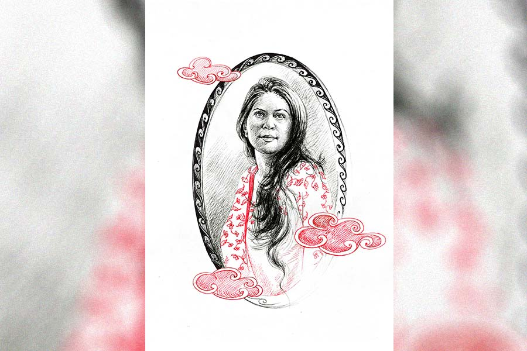

 
 <h1 align=center>জ্বালা</h1>
<h2 align=center>বর্ষা পূততুণ্ড</h2> আয়নার সামনে দাঁড়িয়ে নিজেকে ভাল করে দেখছিল সুরঙ্গমা। বয়স ষাট ছুঁয়ে ফেলেছে। কিন্তু ভগবানের দয়ায় আর প্রসাধনের দাক্ষিণ্যে নিজের চেহারাটা স্বস্তি দেয়। মসৃণ ত্বকের ঔজ্জ্বল্যে শান দিয়ে, চুলের রঙের প্রতি নজর দিয়ে, যোগব্যায়ামে আস্থা রেখে সময়ের কাঁটা ঘুরিয়ে দিয়েছে সুরঙ্গমা। নরম সকালটা উপভোগ করতে করতে বেশ একটা ভাল লাগা তৈরি হল।

মেজাজটা খারাপ হল সমরেশের দিকে তাকিয়ে। হাই তুলতে তুলতে বাথরুম থেকে বেরোল। ভুঁড়িটা ক্রমবর্ধমান। সে দিকে কোনও নজর নেই। চোখে ভেসে উঠল খুড়তুতো বোন দীপার বর অসীমের চেহারাটা। একহারা পেটানো চেহারা, চুলে রুপোলি ছিটে, পেটে এক ইঞ্চিও মেদ জমেনি। সমরেশ অবশ্য সব দিক থেকে লোভনীয় জামাই ছিল বাড়িতে। অবস্থাপন্ন পরিবার, ভাল ডিগ্রি, দারুণ চাকরি। গায়ের রংটাও ফর্সা। চেহারাটা নাদুসনুদুস। সম্বন্ধ করেই বিয়েটা হয়েছিল। দীপা প্রেম করে বাড়ির অমতে হঠাৎই বিয়ে করে ফেলল অসীমকে। সামান্য চাকরি করে, বাড়ির অবস্থাও তেমন ভাল নয়। কিন্তু ওই পেটানো চেহারা,দরাজ হাসি সুরঙ্গমার মনে জ্বালা ধরিয়ে দিয়েছিল।

চায়ের কাপ হাতে নিয়ে এক বার সারা বাড়ি টহল দিল সুরঙ্গমা। পুব-দক্ষিণ খোলা ঝকঝকে ফ্ল্যাটটা মন ভাল করে দেয়। সমরেশ বাজারে বেরিয়েছে। বাজার করে ফিরলে বাসন্তীকে রান্না বলে দেওয়া ছাড়া আর কোনও কাজ নেই হাতে। ছেলের ঘরে ঢুকে ওদের বাঁধানো ছবিতে আলতো করে হাত বুলিয়ে মনে হল ওরা অনেক দিন আসে না। বিদেশ থেকে আসার সময় নতুন নতুন কসমেটিক্স নিয়ে আসে ওর জন্য।

নতুন কেনা ইজ়িচেয়ারটায় গা এলিয়ে দিয়ে ভাবছিল সুরঙ্গমা। ওই জ্বালাটা রয়েই গেল। ছোটবেলায় দীপা স্ট্যান্ড করত স্কুলের পরীক্ষায়। বাড়িসুদ্ধ সবাই বিগলিত চিত্তে প্রশংসা করত। কাকার তেমন পয়সার জোর ছিল না। টিউশন দিতে পারত না। সুরঙ্গমার বাবা মেয়ের জন্য তিন জন মাস্টারের ব্যবস্থা করেছিলেন। তা ছাড়া নাচের ক্লাস, হাতখরচ, সাজগোজের জিনিস সবই জুটত। দীপা ঢাল তলোয়ারহীন নিধিরাম সর্দার হয়ে দারুণ গাইত, স্ট্যান্ড করত। ওর ভাগ্যে জুটে যেত সবার প্রশংসা। ভিতরে ভিতরে জ্বলেপুড়ে যেত সুরঙ্গমা।

জানলার পর্দাগুলো উড়ে উড়ে উইন্ড চাইমগুলো বাজিয়ে দিচ্ছে। একঘেয়ে ভ্যাকুয়াম ক্লিনারের শব্দটা এই ফ্ল্যাটের নিস্তব্ধতাকে ভেঙে খানখান করে দিচ্ছে। এর মধ্যে সুরঙ্গমার চিন্তাগুলো এ দিক-ও দিক উড়ে বেড়াচ্ছে।

হঠাৎই চিন্তাসূত্র ছিন্ন করে বেজে উঠল মোবাইল। কী কাণ্ড! এত ক্ষণ যার কথা মনে পড়ছিল, সেই দীপারই মেয়ের ফোন। ফোন ধরতেই উদ্বেগ-উৎকণ্ঠা মেশানো গলায় বোনঝি যা বলল, তা হল অসীম সকালেমাথা ঘুরে পড়ে গিয়েছে। ডাক্তার ডাকা হয়েছে।

মুখে সামান্য উদ্বেগ প্রকাশ করে ফোন রাখল সুরঙ্গমা। দীপাকে দেখতে খুব সাধারণ। বয়সের থেকে বেশি দেখায়। চেহারার প্রতি যত্ন নেয় না একেবারেই। মোটা ফ্রেমের চশমা, কপালে ভাঁজ, রগের দু’পাশে পাকা চুলের ঝালর। স্কুলে পড়ায়। অসীমের একার আয়ে চলে না। মেয়ে দুটোর বিয়ে হয়েছে খুব সাধারণ ভাবে। অনেক অসুবিধে আছে ওর সংসারে। কিন্তু বোঝে কার সাধ্য? মুখে হাসি লেগেই আছে। প্রশংসা পাওয়ার ভাগ্য একই রকম অটুট। সমরেশও প্রশংসাকারীদের দলে।

“দীপাটা সব সময় হাসি মুখে থাকে। বেশ লাগে কিন্তু!”

শুনে সুরঙ্গমার ভুরু কুঁচকে যায়, “বাড়াবাড়ি কোরো না তো!”

সমরেশ গোবেচারা মুখে বলে, “রান্নাটাও দারুণ করে।”

তা করে। সামনে বসিয়ে চেপে চেপে খাওয়ায়। সমরেশের নিজের ভুঁড়ি নিয়ে তো কোনও চিন্তা নেই। সুরঙ্গমার গা-পিত্তি জ্বলে যায়।

সমরেশ ফিরে বাজারের থলি রেখে হাত-পা ধুয়ে বসতেই নিরুত্তাপ গলায় অসীমের অসুস্থতার খবর জানাল সুরঙ্গমা। সমরেশ ব্যস্ত গলায় বলে, “সে কী কাণ্ড!” বলতে বলতে নিজেই ফোন করে সমরেশ। সব শুনে চিন্তিত মুখে বলল, “ডাক্তার বলেছে হাসপাতালে ভর্তি করতে হবে। বলছে সিরিয়াস কন্ডিশন। এক বার যেতে হবে দেখতে...”

নির্বিকার মুখে হাতের নখগুলো দেখতে থাকে সুরঙ্গমা। এ বারে পার্লারের মেয়েটা ভাল করে ম্যানিকিয়োরটা করেছে। হ্যান্ড ক্রিমটা হাতে ঘষতে ঘষতে মনে হল এ বারে গোল্ড ফেশিয়ালটা করে নিলে হয়। সামনে দুটো বিয়েবাড়ি। দীপার চেহারাটা চোখের সামনে ভেসে উঠল। রাত জেগে স্কুলের খাতা দেখে দেখে চোখের তলায় কালি পড়ে গিয়েছে। সুরঙ্গমা তো রাত জেগে টিভিও দেখে না চোখে কালি পড়ার ভয়ে। পার্লারের মেয়েটা বলে, “আপনি যে এত কেয়ার নিচ্ছেন ম্যাডাম, এটা খুব ভাল লাগে।”

কেয়ার নেবে না কেন? হাতে অঢেল সময়। বাসন্তীর তত্ত্বাবধানে ঘরকন্না তরতর করে এগিয়ে যায়। সমরেশ বিনা বাক্যব্যয়ে বাইরের ঝুটঝামেলা সামলে দেয়। দায়িত্ব, কর্তব্যের বাড়াবাড়ি সুরঙ্গমার কোনও কালেই নেই। ছিমছাম, নিজস্ব দিনযাপনে কোনও ছেদ পড়ে না।

কিন্তু সেই একটা জ্বালা বুকের মধ্যে রয়েই গেল। বাবা-মা কথায় কথায় বলত, “দীপাকে দেখেছিস? কেমন অল্পে সন্তুষ্ট! তোর সব সময়ই খালি চাই আর চাই!”

চাইবে না কেন? বাবার দেওয়ার ক্ষমতা ছিল। সবেধন নীলমণি একমাত্র সন্তান। দেখতে শুনতে চোখে পড়ার মতো। বিয়েতেও বাবার কোনও ঝামেলা হয়নি। দেখেই পছন্দ করেছিল সমরেশরা। বিয়ের পর থেকে সমরেশ একেবারে হাতের তেলোয় করে রেখেছে। রান্নাঘরে বিশেষ ঢুকতে হয়নি। ঘর সাজাতে ভালবাসে। দামি ফার্নিচার, নিত্যনতুন পর্দা, শৌখিন কাচের বাসন কিনে কিনে শখ মিটিয়েছে। আর কিনেছে শাড়ি ফার্নিচার কসমেটিক্স। যখন যেমন ইচ্ছে হয়েছে।

সমরেশের খরচের ব্যাপারে না নেই। ছেলে নিজের বৃত্তে মশগুল। সুরঙ্গমাও নিজেকে নিয়ে বেশ আছে। কিন্তু ওই দীপাই কাঁটা ফুটিয়ে দেয়। মাঝে মাঝে একরাশ খাবারদাবার তৈরি করে নিয়ে চলে আসে অসীমকে সঙ্গে নিয়ে।

“সমরেশদা, আজ ঘুগনি করলাম। টেস্ট করুন। মালপোয়াও আছে কিন্তু!” দুজনে মিলে হেসে হেসে বলে।

সমরেশের খুশি আর ধরে না, “বাঃ! এত সময় পাও কী করে দীপা? স্কুল করে...”

“ও আমায় খুব হেল্প করে সমরেশদা। তাই পারি।”

অসীম সহাস্য ফোড়ন কাটে, “না হলে যে ভালমন্দ খাওয়া হবে না। বলুন সমরেশদা?”

দীপা অসীমের হাতে চিমটি কেটে দেয়। তার পর তিন জনে মিলে হাসির বন্যা বইয়ে দেয়। সুরঙ্গমা গম্ভীর মুখে বাসন্তীকে ডেকে চা করতে বলে। সমরেশ আহ্লাদিত গলায় বলে, “থ্যাঙ্ক ইউ দীপা! তোমার কৃপায় এ সব জোটে আমার কপালে।”

আবার গা জ্বলে যায় সুরঙ্গমার।

দুপুরে খাওয়ার পর চিন্তিত মুখে সমরেশ বলল, “এক বার ঘুরে আসি। অসীমটার জন্য চিন্তা হচ্ছে।”

সুরঙ্গমা আপত্তি জানাল, “ও বেলা গেলে পারতে। এই ভরদুপুরে রোদ লাগাবে কেন?”

সমরেশ বিরক্ত হল, “কী যে বলো না তুমি! অসীম হাসপাতালে। সবাই ছোটাছুটি করছে। আমি রোদের ভয়ে বাড়িতে বসে থাকব?”

দুপুরে একটু না গড়ালে সুরঙ্গমার হয় না। টিভিতে সন্ধেবেলা একটা ভাল প্রোগ্রাম আছে। দেখতে হবে। ঠিক ঘড়ি ধরে বাসন্তী বিকেলের চা দেয়। চা শেষ করে খেয়াল হল, সমরেশ একটা ফোন করল না তো? তখন নিজেই একটা ফোন করল সমরেশকে। ফোনটা বেজে গেল। নিশ্চয়ই গাড়ি চালাচ্ছে। নিশ্চিন্ত মনে রাতের রান্নাটা বলে দিয়ে টিভি খুলে বসল সুরঙ্গমা। বেশ খানিকটা পরে সমরেশ ফোন করল, ভারী গলায় বলল, “খবর ভাল নয়। অসীম ইজ় নো মোর।”

সুরঙ্গমা নিষ্প্রাণ গলায় বলল, “বেশি দেরি কোরো না।”

দীপাটা বড্ড খাটাত অসীমকে। অসীমও দীপা বলতে পাগল। দীপা কী ভালবাসে, কী পছন্দ করে সব অসীমের কণ্ঠস্থ। দীপা গাছ ভালবাসে তো ছুটল গাছ কিনতে। দীপা খাতা দেখছে, অসীম চা করে আনছে। দীপা রান্না করছে, অসীম আনাজ কেটে দিচ্ছে। মেয়েদের বিয়ের সময় দীপা যা বলছে, অসীম দৌড়চ্ছে। কত হাসাহাসি, কত গল্প দু’জনে মিলে। বড্ড বাড়াবাড়ি মনে হত সুরঙ্গমার। অসীম যেন দু’হাত দিয়ে আগলে রাখত দীপাকে। এ বার? এ বার কী হবে? হুঁহ্‌! এই জন্য বলে কোনও কিছুরই বেশি বাড়াবাড়ি ভাল নয়। এক ঝলক ঠান্ডা হাওয়া যেন জুড়িয়ে দিল সুরঙ্গমাকে।

ছেলে ফোন করল, “বাবার কাছে খারাপ খবরটা পেলাম। ভাবতেই পারছি না। দীপামাসির জন্য ভীষণ কষ্ট হচ্ছে। তুমি এখনও যাওনি!...”

শ্মশানপর্ব সমাধা করে অনেক রাতে ফিরল সমরেশ। বিধ্বস্ত চেহারা।

“কী যে হয়ে গেল! ওদের দু’জনকে দেখলে মনটা ভাল হয়ে যেত। দীপা মেয়েটা বড্ড ভাল। যা-ই হোক, কাল তুমি আমার সঙ্গে অবশ্যই ওদের বাড়ি যাবে। আজই যাওয়া উচিত ছিল।”

সমরেশের বিরক্তি টের পাওয়া গেল।

আবার গা জ্বলে গেল সুরঙ্গমার। অসীমের জন্য খারাপ লাগছে। দীপা দীপা করে জীবনটা কাটিয়ে দিল। রানির মতো করে রেখেছিল দীপাকে। দীপার ভাবভঙ্গি দেখলে মনে হত যেন নতুন বিয়ে হয়েছে। এ বার অন্তত দীপার মাটিতে পা পড়বে। অবশ্য জামাইরাও দীপাকে ভীষণ মানে। তবে এ বার কী হবে কে জানে? যা-ই হোক, একটা স্বস্তির নিঃশ্বাস ফেলে কাল ওদের বাড়ি পরে যাওয়ার জন্য একটা সাদা-কালো টাঙ্গাইল গুছিয়ে রাখল সুরঙ্গমা।

 

পরের দিন সকালে  উঠে সময়োপযোগী সেজে নিল সুরঙ্গমা। সমরেশ কিনে আনল এক ঝুড়ি ফল আর হবিষ্যির জিনিস। সাদা শাড়িতে কালো নকশার পাড়, চোখে কালো চশমা, হালকা লিপস্টিক, হাতে দুধসাদা ব্র্যান্ডেড ব্যাগ। সান্ত্বনার কথাগুলো মনে মনে তৈরি করে নিয়েছে সুরঙ্গমা। চুল শ্যাম্পু করে রুক্ষ করে নিয়েছে। ঝলমল করে উঠল গলার হিরে বসানো মঙ্গলসূত্রটা। আজ একটু চওড়া করেই সিঁদুরটা পরেছে।

বাড়ির ভিতরে ঢুকতেই দীপাই এগিয়ে এল, “এসো ছোড়দি। অসীম চলে গেল গো।”

দীপার শুকনো ফ্যাকাশে মুখ, উসকোখুসকো চুল। দেখে মনে হল একটা ঝড় বয়ে গিয়েছে। সুরঙ্গমা রেডি হয়েই ছিল। একেবারে নিখুঁত ভঙ্গিতে ফুঁপিয়ে উঠল, “কী সর্বনাশ হল রে! তোর কপালটা এমন করে পুড়ল? খবরটা পেয়ে বিছানা থেকে উঠতেই পারিনি। তাই কাল আসতে পারলাম না। কী হবে তোর এ বার দীপা? একা কী করে থাকবি?”

মুখে ম্লান হাসি। শান্ত গলায় দীপা সুরঙ্গমাকে থামিয়ে দিল, “কেঁদো না ছোড়দি। তুমি না এলেও কাল সমরেশদা তো সর্বক্ষণ পাশে ছিলেন। সব সামলে দিয়েছেন।”

সানগ্লাসটা খুলে চোখটা মুছে নিল সুরঙ্গমা, “চিন্তা হচ্ছে রে খুব। কী করে চালাবি? যদি টাকাপয়সা লাগে—”

কথাগুলো বলতে পেরে বেশ একটা আত্মপ্রসাদ অনুভব করছিল সুরঙ্গমা। কিন্তু সমরেশ অপ্রসন্ন চোখে তাকাচ্ছিল ওর দিকে।

“ভেবো না ছোড়দি। আমার বেশি কিছু লাগে না গো। ঠিক চলে যাবে।”

দীপার মুখে ম্লান হাসি। গলায় আত্মবিশ্বাসের সুর। ভাঙে তবু মচকায় না। কিন্তু সুরঙ্গমাও ছেড়ে দেওয়ার পাত্রী নয়। বলে, “তা বললে কি হয়? মেয়েরা থাকবে না কি তোর কাছে?”

“না গো। ওদের সংসার আছে না? অসীম নেই, আর সব তো ঠিক আছে। এই যে আমার পড়শিরা। কাল থেকে বার বার ছুটে আসছেন সবাই।”

সত্যি সবাই ঘিরে আছে দীপাকে। মেয়ে-জামাইরাও পাশেই রয়েছে।

সুরঙ্গমা এ বার জোর দিয়ে বলল, “সে যা-ই হোক। অসীম তো চলে গেল। এই দুঃখটা তো...” দীপার মৃদু গলায় শান্তি ঝরে পড়ল, “অসীম চলে গেল। কিন্তু আমার কোনও অভিযোগ নেই। এক দিন তো সবাইকেই...কিন্তু যে ক’টা দিন এক সঙ্গে ছিলাম, বড় আনন্দে কেটেছে। কষ্টকে কষ্ট বলে মনে হয়নি। সেই দিনগুলোরকথা ভেবেই বাকি দিনগুলো কাটিয়ে দিতে পারব।”

সমরেশ চোখ মুছছিল। যত্ত ন্যাকামি! বাধ্য হয়েই সুরঙ্গমাও চোখ মুছে ফেলল।

“ছোড়দি, তোমরা চোখের জল ফেলো না। অসীম আমার সঙ্গেই রইল। ও আমাকে ছেড়ে কোথায় যাবে বলুন তো সমরেশদা?”

হঠাৎ ছেলের ফোন পেয়ে সুরঙ্গমা অবাক, “দীপামাসিকে ফোনটা দাও।”

“এখন? কী দরকার?”

“দাও না। বলছি যখন...” রুষ্ট গলায় বলল ছেলে।

গোমড়া মুখে ফোনটা দিল সুরঙ্গমা। দীপা দূরে গিয়ে কথা বলে এসে বলল, “পাগল ছেলের কথা শোন! বলছে এখন থেকে তুমি আমাদের বাড়িতে থাকবে। তাই কখনও হয়? বল তো ছোড়দি?”

প্রবল বিতৃষ্ণায় অন্য দিকে তাকিয়ে রইল সুরঙ্গমা। সমরেশ তাড়াতাড়ি বলে উঠল, “কেন হবে না? ঠিকই তো বলেছে ছেলেটা। কাজ মিটে গেলেই তোমাকে নিয়ে যাব আমি। আমাদের দু’জনের সঙ্গে থাকলে তোমারও আর একা একা লাগবে না।”

কেউ খেয়াল করল না, সুরঙ্গমার চোখে তখন আগ্নেয়গিরির জন্ম হচ্ছে।

সমরেশের দিকে পূর্ণদৃষ্টিতে তাকিয়ে দীপা বলল, “এটা আমাদের দু’জনের বাড়ি সমরেশদা। সব কিছু আমাদের দু’জনের। ওর সমস্ত স্মৃতি ফেলে রেখে কী করে অন্য কোথাও যাই বলুন তো? আপনারা তো রইলেন। মাঝে মাঝে না-হয় ঘুরে আসব। আপনারাও আসবেন।”

বাড়ি ফিরতে ফিরতে বেলা গড়িয়ে গেল। ক্লান্ত, শোকাহত সমরেশ ঘুমিয়ে পড়ল দুপুরে খাওয়ার পরে। সুরঙ্গমা বসে বসে ভাবছিল। প্রতিবেশীরা শতমুখে প্রশংসা করছিলেন দীপার, “ওঁর কথা আর কী বলব? যেমন ধৈর্য তেমন সাহস! এমনটা দেখা যায় না।”

মেয়েরা বলল, “মা ঠিক থাকলে আমরা ঠিক থাকব।”

জামাইরাও বাধ্য, অনুগত। প্রশংসায় পঞ্চমুখ। শাশুড়িকে মায়ের মতো শ্রদ্ধা করে। দেখলে বোঝা যায়, ওরা কতটা আন্তরিক।

বাসন্তী ঘরে ঢুকল, বলল, “সত্যি কী যে হয়ে গেল! দিদির মতো ভালমানুষ দেখা যায় না গো। এলেই আমার সঙ্গে কত মিষ্টি করে কথা বলত, খোঁজখবর নিত...”

আবার সেই প্রশংসা! সবার সব প্রশংসা চিরকাল দীপাকেই খুঁজে নেবে, এত বড় কপাল পোড়ার পরও। পরিচিত জ্বালাটা এ বার বজ্রনির্ঘোষে ফেটে পড়ল সুরঙ্গমার, “একটু থামো তো দিকি! নিজের কাজ করো গিয়ে। বাজে কথা বকে বকে মাথা ধরিয়ে দিলে যে একেবারে...”

বাসন্তী অবাক হয়ে তাড়াতাড়ি ঘর থেকে বেরিয়ে গেল।

বড্ড অসহায় লাগছিল নিজেকে সুরঙ্গমার। নিজের বাড়ি, গাড়ি, শাড়ি, গয়না সব যেন অর্থহীন হয়ে গেল। চাপা কান্নায় ওর শরীর ফুলে ফুলে উঠছিল। বিকেলের আলো দ্রুত মরে গিয়ে অন্ধকার ঘনিয়ে এল।