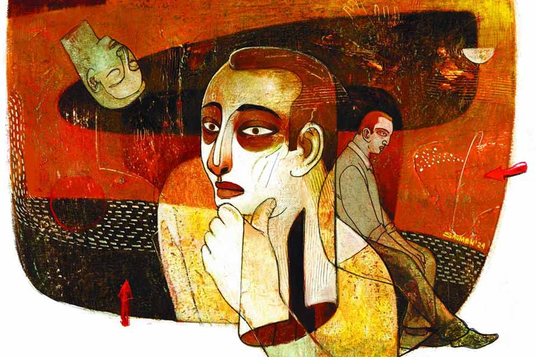

 
 <h1 align=center>জয়ী</h1>
<h2 align=center>সৈকত মুখোপাধ্যায়</h2> ঘড়ির কাঁটায় তখনও বিকেল, কিন্তু কলকাতার আকাশ জুড়ে অন্ধকার ঘনিয়ে এসেছিল। বৃষ্টি হচ্ছিল তুমুল, সঙ্গে বইছিল ঝোড়ো হাওয়া। বৃষ্টির হাত থেকে বাঁচার জন্যে আরও কয়েক জন পথচারীর সঙ্গে তাপসও একটা চায়ের দোকানের ছাউনির নীচে আশ্রয় নিয়েছিল। জায়গাটা যে ঠিক কোথায়, তা আর এত বছর বাদে ওর মনে পড়ে না। রাসবিহারী অ্যাভিনিউয়ের উপরেই কোনও একটা স্টপেজ হবে। হয়তো দেশপ্রিয় পার্ক… কিংবা লেক মার্কেট। বিজন সেতুর দিক থেকে একটা ট্রাম মন্থরগতিতে এ দিকে আসতে আসতে হঠাৎ দাঁড়িয়ে পড়েছিল।

কোনও অস্বাভাবিক শব্দ হয়েছিল কি? বিদ্যুতের তারে নীল আলোর ঝলকানি দেখা গিয়েছিল? অত খুঁটিনাটি আর এখন মনে পড়ে না তাপসের।

রাস্তার মাঝখান দিয়ে ট্রামলাইন। ওরা যেখানে দাঁড়িয়েছিল, ঠিক তার সামনে এসেই ট্রামটা থেমে গিয়েছিল। তত ক্ষণে রাস্তায় এক হাঁটু জল। ট্রামটায় হাতে-গোনা কয়েক জন যাত্রী ছিলেন। তাঁদের মধ্যেই এক জন যাত্রী, তাঁর বোধহয় ওখানেই নামার কথা ছিল, ট্রামের দরজা দিয়ে বেরিয়ে সেই জমা জলের মধ্যে পা ফেলতেই মুখ থুবড়ে পড়ে গেলেন।

তাপসের ঠিক পাশেই যে মাঝবয়সি ভদ্রলোক দাঁড়িয়েছিলেন, তিনি ‘আরে আরে...’ বলতে বলতে সেই পড়ে-যাওয়া লোকটিকে জল থেকে তোলার জন্যে বৃষ্টির মধ্যে দিয়েই দৌড়ে গেলেন এবং ট্রামের দরজার কাছে পৌঁছনো মাত্রই কাটা কলাগাছের মতো আছাড় খেয়ে পড়ে গেলেন।

তাই দেখে আরও এক জন— তিনিও ওই ছাউনির নীচেই দাঁড়িয়েছিলেন— ও দিকে দৌড়োলেন এবং তিন-নম্বর লাশ পড়ল।

হ্যাঁ, মোট পাঁচ জন মারা গিয়েছিল সে দিন। পরের দিন খবরের কাগজের প্রথম পাতাতেই বেরিয়েছিল খবরটা। ঝড়ের দাপটে ট্রামের ওভারহেড তার ছিঁড়ে জলের মধ্যে পড়েছিল। সেই জলে যারাই পা দিয়েছিল, মরেছিল। ট্রামের ড্রাইভার ব্যাপারটা বুঝে তারস্বরে চিৎকার করে সবাইকে সাবধান করতে শুরু না করলে আরও লোক মরত।

কথা সেটা নয়। কথা হচ্ছে, তাপসের বয়স তখন একুশ। চারুচন্দ্র কলেজে থার্ড ইয়ার, ইকনমিক্সে অনার্স। কিন্তু সে চোখের সামনে একটার পর একটা লোককে জলকাদার মধ্যে লুটিয়ে পড়তে দেখেও দৌড়ে যায়নি। তার মানে এই নয় যে, সে বুঝতে পেরেছিল ওখানে মৃত্যুফাঁদ পাতা আছে। আসলে তার ভিজতে ইচ্ছে করছিল না। সে জানত, সে না গেলেও অন্য কেউ যাবে এবং তুলে আনবে লোকগুলোকে।

তাপস মিত্র সে দিন কাউকে বাঁচাতে যায়নি এবং যায়নি বলেই আজ তার বয়স হল একষট্টি। মাঝের বছরগুলোয় সে নিরুপদ্রবে চাকরি পেল, বিয়ে করল, সংসার পাতল এবং গড়িয়ায় ফ্ল্যাট কিনল। মেয়ের বিয়ে দিল এবং গত বছর সচ্ছলতার সঙ্গে অবসর নিল।

এ সব কিছুই হত না। চল্লিশ বছর আগেই সে মারা যেতে পারত। কিন্তু চরিত্রগত এক আত্মকেন্দ্রিকতা তাকে বাঁচিয়ে দিয়েছিল।

তার জন্যে কি তাপস সুখী?

না। সে নিরন্তর অপরাধবোধে ভোগে। তার নিজেকে অস্বাভাবিক বলে মনে হয়।

এই যে, অবসর নেওয়ার এক বছরের মধ্যে সে এত একা হয়ে গেল, দিনের পর দিন কোনও আত্মীয়, কোনও বন্ধু তাকে ফোন করে না, সে-ও এমন কোনও অন্তরঙ্গ মানুষের মুখ ভেবে পায় না যার বাড়িতে গিয়ে সে একটা বিকেল কাটিয়ে আসতে পারে, এর পিছনে কি তার আত্মকেন্দ্রিকতাই দায়ী নয়?

বাবার কথা আজকাল প্রায়ই মনে পড়ে তাপসের। মায়ের কথাও। তার পুরনো পাড়ার কত অচেনা-আধচেনা মানুষ এখনও তাকে রাস্তায় ডেকে দাঁড় করায়, তার খবর নেওয়ার জন্য নয়, শুধু তার বাবা-মায়ের দয়ার কথা বলার জন্য।

বাবার মৃত্যুর দশ বছর পরও মানুষজন তাঁকে কৃতজ্ঞতার সঙ্গে স্মরণ করছে। অথচ সে নিজে যদি আজ মারা যায়, তাপস জানে, শববাহী গাড়িতে ড্রাইভারের পাশে বসার মতো এক জন শ্মশানবন্ধুকেও জোগাড় করা যাবে না।

এই সব নানা কথা ভাবতে-ভাবতেই তাপস মাঝে মাঝে একটা ঝিলের ধারে গিয়ে দাঁড়ায়। জায়গাটা মুকুন্দপুর থেকে একটু দূরে; ভ্যানরিকশা পাওয়া যায়, তবে তাপস হেঁটেই যায়।

যেখানে গিয়ে সে দাঁড়ায় তার বাঁ দিকে, অনেকটা দূরে, একটা আঠারো তলা উঁচু আবাসন, যার নির্মাণকাজ প্রায় সম্পূর্ণ হয়ে এসেছে। আর ডান দিকে হাতের কাছেই বাঁশের বেড়ার উপরে হোগলার ছাউনি দেওয়া একটা ঘর। ছাউনির গায়ে মৎস্যজীবী সমবায় সমিতির বোর্ড। তিন বছর আগে এই দুটোর মধ্যে কোনওটাই ছিল না— না ওই আবাসন, না মাছ-পাহারার ঘর।

দুপুরে খাওয়াদাওয়ার পর মৃদু মন্থর গতিতে হাঁটতে হাঁটতে সে ওখানে চলে যায়। ঝিলের ধার ঘেঁষে কয়েকটা বাঁশের বেঞ্চি রয়েছে। যদি দাঁড়িয়ে থাকতে-থাকতে পা ধরে যায়, তা হলে ওর মধ্যেই কোনও একটায় কিছু ক্ষণ বসে সময় কাটায়।

ভীষণ নির্জন জায়গাটা… ভীষণই নিস্তব্ধ। মানুষের গলার স্বর শোনাই যায় না প্রায়। শুধু কনস্ট্রাকশন-সাইটের ও দিক থেকে মাঝে মাঝে মেশিন ড্রিলের তীক্ষ্ণ শব্দ ভেসে আসে। মাঠের মধ্যে খুঁটিতে বাঁধা তিন-চারটে ছাগল চরে। তাদের পিঠে বসে রাজকীয় ভঙ্গিতে ঘোরাঘুরি করে দুটো ফিঙেপাখি। পোকা দেখলে হাওয়ায় ডিগবাজি খেয়ে উড়ে যায়, পুরনো দিনের টেলিফোনের মতো ক্রিং-ক্রিং ডাক ছাড়ে। শব্দ বলতে এইটুকুই।

তার পর যখন সন্ধের ছায়া ঘন হয়ে আসে, এক জন বৌমানুষ ছাগলগুলোকে খুঁটি থেকে খুলে নিয়ে মাঠ পেরিয়ে মুকুন্দপুরের দিকে হাঁটা লাগায়, তখন তাপসও আড়মোড়া ভেঙে উঠে দাঁড়ায়। বাড়ি ফিরে যায়।

তার মনে পড়ে এক দুঃস্থ রমণীর কথা। কুড়ি বছর আগে ওদের পুরনো পাড়ার এক ওষুধের দোকানে সেই মেয়েটিকে কয়েক মুহূর্তের জন্যে দেখেছিল তাপস। মেয়েটি কাউন্টারের এ দিকে তাপসের একদম পাশে দাঁড়িয়ে দোকানির কাছে দু’-তিনটে ওষুধ চেয়েছিল। তার বাচ্চাটার নাকি খুব জ্বর। সঙ্গে বমি, ভুল-বকা এ সবও ছিল।

দোকানি দু’-পাতা ট্যাবলেট, কী যেন একটা সিরাপ আর ওআরএসের কয়েকটা স্যাশে কাউন্টারের উপর নামিয়ে রেখে বলেছিল, একশো পঁয়তাল্লিশ। না কি একশো পঁয়ত্রিশ? অত খুঁটিনাটি আর মনে পড়ে না তাপসের। তবে এটা পরিষ্কার মনে পড়ে যে, দাম শুনে মেয়েটি আঁতকে উঠেছিল।

ওষুধের দোকানিটি এক ঝটকায় মেয়েটির হাতের নাগাল থেকে সেই সব ট্যাবলেট সিরাপ-টিরাপ সরিয়ে রেখে তাপসের দিকে তাকিয়েছিল। যেন কিছুই হয়নি এই ভাবে বলেছিল, “বলুন স্যর।”

তাপস তার নিজের হাতের প্রেসক্রিপশনটা দোকানির হাতে ধরিয়ে দিয়ে সেই মলিন মেয়েটিকে, আশা-হারানো মা-টিকে ধীরে ধীরে দোকান থেকে বেরিয়ে যেতে দেখেছিল।

হ্যাঁ, ধীরে… খুব ধীরেই হাঁটছিল মেয়েটি। তাপস কি সে দিন পারত না ওকে ফিরিয়ে আনতে? পারত না কি, দোকানিকে বলতে, ‘ওকে ওষুধগুলো দিন। দামটা আমি দিয়ে দিচ্ছি।’

পরে অনেক বার ভেবে দেখেছে, পারত। কাজটা ওর পক্ষে কিছুই কঠিন ছিল না। কিন্তু তখন কথাটা ওর মাথাতেই আসেনি।

কিংবা দশ বছর আগে সল্টলেকের রাস্তায় যে ঘটনাটা ঘটেছিল! বাসে করে কোথাও যাচ্ছিল, কিংবা ফিরছিল। পাগলের মতো দুটো বাসের রেস, হঠাৎ ব্রেক আর সেই ঝাঁকুনিতে ওর ঠিক সামনের সিটের বৃদ্ধ সপাটে মেঝের উপরে পড়ে গিয়েছিলেন।

সেই দৃশ্য মনে পড়তেই আজ এত বছর পরেও তাপসের মুখটা বিকৃত হয়ে উঠল। কী রক্ত কী রক্ত, বাপ রে! একটা বুড়ো মানুষের মাথার চোট থেকে এত রক্ত গড়িয়ে পড়তে পারে!

সল্টলেকের পক্ষে শীতের রাত ন’টা মানে অনেক রাত। গ্যারেজমুখী বাসটায় সে আর ওই বৃদ্ধ বাদে আর তৃতীয় কোনও যাত্রী ছিল না। কোনও রকমে উঠে দাঁড়ানোর পর উনি কেমন যেন অসহায় ভাবে তাপসের মুখের দিকে তাকালেন। তাপস জানলার দিকে মুখটা ঘুরিয়ে নিয়েছিল। আড়চোখে দেখেছিল, ভদ্রলোক পকেট থেকে একটা রুমাল বার করে কপালে চেপে ধরে, টলতে-টলতে বাস থেকে নেমে গেলেন।

যেতেই পারত তাপস ওঁর সঙ্গে। আর কিছু না হোক, হাত ধরে বাড়ি অবধি পৌঁছে দিয়ে আসতে পারত। কিন্তু যায়নি।

কেন যায়নি?

এ সব কথা তো অন্য কারও সঙ্গে আলোচনা করা যায় না। তবে অনেক দিন অবধি তাপস নিজের মনকে বোঝাত যে, বিপদের সময় তার মাথা ঠিকঠাক কাজ করে না। কিন্তু পরে ভেবে দেখেছে, এটা সর্বৈব মিথ্যা যুক্তি। নিজের জীবনের যে কোনও ক্রাইসিস সে খুব দ্রুত সামলাতে পারে। সামলেছেও।

তাই এখন সে মেনেই নিয়েছে যে, সে আসলে অসম্ভব স্বার্থপর।

কিংবা পুরোপুরি মানেনি। মানেনি বলেই সে আজকাল প্রায়ই এই ঝিলটার ধারে এসে দাঁড়ায়।  

তিন-বছর আগে এ রকমই এক নির্জন দুপুরে একটি সাতাশ-আটাশ বছরের ছেলে ওই ঝিলের জলে ডুবে যাচ্ছিল।

আংশিক লকডাউনের সময় ছিল সেটা, মানুষের চলাফেরায় নানা বিধিনিষেধ ছিল। তবু তাপস ওই সময়ে এক দিন দুপুর আড়াইটে নাগাদ এই ঝিলের পাড় ধরে হেঁটে যাচ্ছিল। অফিস থেকেই সে দিন ও এখানে একটা এনকোয়ারিতে এসেছিল; ওই আবাসনটার লাইসেন্সের ব্যাপারেই আসতে হয়েছিল। তখন ও দিকে গাড়ি যাওয়ার রাস্তা ছিল না। তাপস বাইপাস থেকে সাইট অবধি হেঁটে গিয়েছিল, আবার হেঁটেই ফিরছিল।

হঠাৎই সে দেখতে পেয়েছিল, পাড় থেকে বেশ খানিকটা দূরে, জলের উপরে দুটো হাতের মুঠো বার বার বাতাস খামচে ধরছে।

হয়তো তত দিনে তাপস নিজেকে ধিক্কার দিতে-দিতে ক্লান্ত হয়ে পড়েছিল; তাই আর কিছু না ভেবে সে জলের মধ্যে নেমে গিয়েছিল। ঘাট বলে কিছু ছিল না, পাড়ের পিছল মাটির উপর পা দিতেই পা হড়কে গেল, মুহূর্তের মধ্যে সে গিয়ে পড়ল কোমরজলে। তবে পরমুহূর্তেই সে পা-দুটোকে কাদার মধ্যে গেঁথে সামলেও নিয়েছিল নিজেকে। তার পর কোমরের উপর থেকে বাকি শরীরটাকে যতটা সম্ভব স্ট্রেচ করে ডুবন্ত হাত দুটোকে চেপে ধরে উপর দিকে টান দিয়েছিল। রোগাভোগা চেহারা ছিল ছেলেটার। পাড়ে তুলতে তাই অসুবিধে হয়নি।

ছেলেটা যে চান করতে গিয়ে ডুবে যাচ্ছিল না, সেটা তত ক্ষণে তাপস বুঝে গিয়েছিল, কারণ ওর পরনে পুরোদস্তুর জামাকাপড় ছিল। অতি সাধারণ প্যান্ট আর শার্ট। প্লাস্টিকের স্ট্র্যাপ-লাগানো জুতোটা অবশ্য কে জানে কেন পাড়ের ঘাসের উপরে খুলে রেখে গিয়েছিল।

সে যা-ই হোক, তাপস ওকে টেনে তোলার পর ছেলেটা কিছু ক্ষণ হাঁটুর মধ্যে মাথা গুঁজে বসে ছিল। হয় কাঁদছিল কিংবা দম নিচ্ছিল, কারণ, তাপস দেখতে পাচ্ছিল ওর রোগা পিঠটা ফুলে ফুলে উঠছে। একটু বাদে ছেলেটা উঠে দাঁড়িয়ে এ দিক-ও দিক তাকিয়ে একটা হলুদ ফাইল কুড়িয়ে নিয়েছিল মাটি থেকে। জুতোর মধ্যে পা গলাতে-গলাতে তাপসের দিকে তাকিয়ে খুব করুণ গলায় বলেছিল, “কেন যে বাঁচালেন! আর কি সাহস পাব? এ দিকে দেখুন, বাঁচারও উপায় নেই।” এই বলে আর এক বারও পিছন দিকে না তাকিয়ে সে চলে গিয়েছিল।

তার একষট্টি বছরের জীবনে সেই এক বারই তাপস মিত্র কী ভাবে যেন স্বার্থপরতার খোলস ছেড়ে বেরিয়ে আসতে পেরেছিল।

তিন বছর আগের সেই পরার্থপরতার প্রতিদান পাবে, এ রকম একটা অলীক স্বপ্নই ইদানীং তাপসকে আরও গভীর বিষাদরোগের হাত থেকে আগলে রেখেছিল। সেই জন্যেই তাপস প্রতি সপ্তাহে পুবের জলাভূমির অন্তর্গত একটা নাম না-জানা ঝিলের পাড়ে পৌঁছে যেত।

তাপস স্বপ্ন দেখত, মাঝের তিন বছরে সেই যুবকটি বেশ সফল এবং সচ্ছল হয়ে উঠেছে। কোভিড-পরবর্তী সময়ে কত ছেলেমেয়েই তো ঘুরে দাঁড়িয়েছে, দাঁড়ায়নি? সেই যুবকটিও যেন তাদের মধ্যে এক জন।

সে ভাবত, এক দিন বিকেলবেলায় ছেলেটা নিজের বোকামির কথা স্মরণ করে ওই ঝিলের ধারে ফিরে আসবে। ঝিল পেরিয়ে তার চোখ চলে যাবে আরও দূরে… নগর-কলকাতার স্কাইস্ক্র্যাপারের সারির দিকে। সে ভাববে, কী বিশাল, কি প্রতিশ্রুতিময় এই জীবন! আর আমি কিনা বোকার মতো তাকে ছেঁটে ছোট করে দিচ্ছিলাম! সেই অপরিচিত ভদ্রলোক যদি সে দিন আমাকে জল থেকে না…

ভাবতে-ভাবতেই সে হঠাৎ দেখতে পাবে, তাপস একটু দূর থেকে তাকে দেখছে। ছেলেটার চোখ দুটোয় ধীরে-ধীরে বিস্ময়, বিস্ময় থেকে আনন্দ, আনন্দ থেকে কৃতজ্ঞতা ফুটে উঠবে। সে দৌড়ে আসবে তাপসের দিকে।

না, এ রকম কিছু হয়নি কখনও। তবে তাপস ভাবত, হবে।

কিন্তু আজ ঝিলপাড়ে গিয়ে তাপস অবাক হয়ে দেখল যে, সেখানে অনেক মানুষ জড়ো হয়েছে। একটা অ্যাম্বুল্যান্স দাঁড়িয়েছিল। একটা পুলিশের গাড়িও।

পায়ে-পায়ে ভিড়টার দিকে এগিয়ে গিয়েছিল তাপস। জমায়েত থেকে একটু দূরে দাঁড়িয়ে-থাকা এক জন লোককে জিজ্ঞেস করেছিল, “কী হয়েছে ভাই?”

“আর বলেন কেন। সুইসাইড করেছে। এই দশ মিনিট হল জেলেরা বডি তুলল।”

ভিড়ের কেন্দ্র থেকে মহিলাকণ্ঠে কান্নার আওয়াজ ভেসে আসছিল। তাপস কোনও রকমে প্রশ্ন করল, “ছেলে না মেয়ে?”

“ছেলে দাদা, ছেলে। ইয়ং ছেলে, এ দিকেই বাড়ি। আগেও এক-দু’বার চেষ্টা করেছিল… লাকিলি কেউ না কেউ দেখে ফেলেছিল। তবে জানেন তো, এদের আটকানো খুব মুশকিল। এক বার না এক বার ঠিক সাকসেস পেয়ে যায়। দেখবেন নাকি?”

লোকটা ওকে এগোনোর জায়গা করে দিচ্ছিল, কিন্তু তাপস তত ক্ষণে উল্টো দিকে ফিরে হাঁটা লাগিয়েছে।

না, দেখবে না। কিছুতেই সে মৃতদেহের মুখ দেখবে না। যদি মুখটা সেই ছেলেটার মুখের সঙ্গে মিলে যায়, তা হলে তার নিজের বাঁচার ইচ্ছেটাও শেষ হয়ে যাবে না?

তার চেয়ে এখন থেকে সে নিজের ফ্ল্যাটের ছোট খুপরিতে বসেই আবার সেই স্বপ্নটা দেখবে— এক জন যুবকের জয়ী হয়ে ফিরে আসার স্বপ্ন। হয়তো তার ফলে স্বপ্নটা আরও একটু অবাস্তব হয়ে উঠবে, কিন্তু উপায় কী? এখন থেকে তার স্বপ্নটা হবে এ রকম—

ডোরবেলের শব্দে সে ফ্ল্যাটের দরজা খুলে দেখবে, সুসজ্জিত এক যুবক হাসিমুখে দাঁড়িয়ে আছে। তার দামি পোশাকে কোথাও এতটুকু জল নেই, শুকনো খটখটে। চুলে শেওলা-ঝাঁঝি জড়িয়ে নেই। কোথাও থেকে কোনও মড়াকান্নার শব্দ ভেসে আসবে না। ছেলেটি ভারী চওড়া হেসে বলবে, “চিনতে পারছেন স্যর? আমি কিন্তু আপনার কাছে চিরকৃতজ্ঞ...”