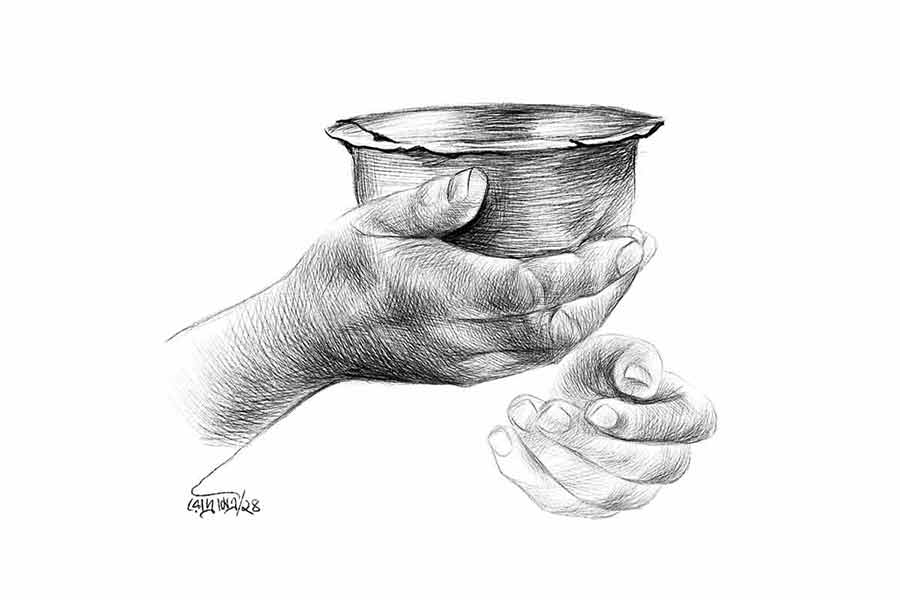

 
 <h1 align=center>ঝরা পাতা</h1>
<h2 align=center>পিনাকী বসু</h2> 

গাছের ঝরা পাতাগুলো যেমন ধুলো আর বাদামি রং মেখে এক জায়গায় জড়ো হয়ে থাকে, তেমনই মন্দিরের সামনে আরও তিন-চার জন ভিখিরির সঙ্গে এক কোণে জড়োসড়ো হয়ে বসে ছিল চিন্ময়ী। তার এখনকার চেহারাটা দেখলে কেউ তার অতীতটা ভাবতেও পারবে না। অবশ্য কেই বা শুকনো পাতার অতীত নিয়ে মাথা ঘামায়!

মন্দিরে পুজো দিয়ে সম্রাট সপরিবার বেরিয়ে আসছিল। কয়েকটা কয়েন ছেলের হাতে দিয়ে সম্রাট বলল, “এঁদের দিয়ে দাও।”

ভিতু চোখে বাচ্চা ছেলেটা ভিখিরিগুলোর দিকে তাকাল, তার পর আরও শক্ত করে বাবার প্যান্টটা চেপে ধরল।

“ও ভয় পাচ্ছে। তুমি সঙ্গে যাও...” মায়ের মন যূথিকার। সন্তানের ভাবনা ঠিক বুঝতে পারে।

এ বার বাচ্চাটার হাত ধরে এগিয়ে যায় সম্রাট। এক এক জনের থালায় এক একটা কয়েন দেয় তারা। ধাতব মুদ্রার শব্দগুলো, দূরত্বের আনুপাতিক হারে লক্ষ্যে পৌঁছনোর কথা জানান দেয়। ভিখিরিরাও সাধ্যমতো আশীর্বাদ করে ওদের।

সম্রাট, চিন্ময়ীর সামনে আসতেই অভ্যস্ত হাতে ফুটো বাটিটা বাড়িয়ে দেয় চিন্ময়ী। মৃদু স্বরে বলে, “ভগবান মঙ্গল করুন।”

কই? ঠং করে পয়সা পড়ার আওয়াজ তো হল না? দাতার মুখের দিকে চোখ তুলে তাকায় চিন্ময়ী। লোকটা বিস্ময়াহত দৃষ্টিতে ওর মুখের দিকে তাকিয়ে আছে। ছেলের হাতে ধরা দু’টাকার কয়েন। লোকটি ছেলের হাত চেপে ধরেছে, যাতে সে কয়েনটা দিতে না পারে। ছেলেও বাবার এই আচরণে অবাক হয়ে বাবাকে দেখছে।

চিন্ময়ীর এত দিনে ভিখারির ভাষা কিছু রপ্ত হয়েছে। কাতর স্বরে বলে ওঠে, “গরিব ভিখিরিকে দুটো টাকা দান করুন বাবা। ঈশ্বর আপনাদের মঙ্গল করবেন।”

সম্রাটের চোখের স্থির দৃষ্টি আরও তীক্ষ্ণ হয়ে ওঠে। তার মুখ থেকে উচ্চারিত হয়, “সিসি?”

সিসি? কত দিন পর এই ডাকটা শুনল চিন্ময়ী। তাকে ঠিক চিনেছে তো লোকটা! সত্যি! সে-ই তো সিসি। চিন্ময়ী চ্যাটার্জি।

কিন্তু এ লোকটা কে? সিসি নামটা জানল কী করে?

তাঁর মুখের পরিবর্তনগুলো এক মনে লক্ষ করছিল সম্রাট। চিন্ময়ী লজ্জায় গুটিয়ে যেতে লাগলেন।

সম্রাট এ বার আরও নিশ্চিত যে, ইনিই সিসি। ওদের স্কুলের সেই ম্যাথমেটিক্স টিচার। আধুনিকা, ছিপছিপে চেহারায় মানানসই সব সুন্দর সুন্দর গাউন পরতেন, তুখোড় ব্রিটিশ ইংরেজি উচ্চারণে পড়াতেন, সেই সিসি! উঁচু ক্লাসের ছাত্রদের ক্রাশ ছিলেন তিনি। আর মেয়েরা নকল করত তাঁর স্টাইল।

সেই সিসির এ কী অবস্থা? নিজের চোখকেই বিশ্বাস করতে পারছে না সম্রাট। কাঁচাপাকা চুল, শীর্ণ চেহারা, নীল নীল শিরা বের করা হাত, কোঁচকানো চামড়ায় নিয়মমাফিক স্নান না করার ছোপ, তাপ্পি দেওয়া ব্লাউজ়ের উপর একটা পুরনো, রংওঠা ছাপা শাড়ি।

চিন্ময়ী বুঝতে পারে যে, সে ধরা পড়ে গেছে। আঁচলটা গায়ের আর একটু সামনের দিকে টেনে নেয় সে। তার পর নিজেকে কিছুটা সামলে নিয়ে অপ্রস্তুত ভঙ্গিতে জিজ্ঞেস করে, “আপনি? মানে আপনাকে তো ঠিক চিনলাম না?”

“আমি সম্রাট চৌধুরী, ম্যাম। ২০০০ সালের হায়ার সেকেন্ডারি। আপনার এক অযোগ্য ছাত্র।”

আশপাশের ভিখিরিরা অবাক বিস্ময়ে তাকিয়ে ব্যাপারটা বোঝার চেষ্টা করছিল। তারা এক বার চিন্ময়ীর দিকে, এক বার সম্রাটের মুখের দিকে তাকিয়ে তাকিয়ে দেখতে লাগল। সে দিকে তাকিয়ে অপ্রস্তুত চিন্ময়ী ব্যাপারটায় ইতি টানার চেষ্টা করলেন, “বেশ বেশ। খুব ভাল। ভাল থেকো। আচ্ছা, তা হলে তুমি এসো বাবা।”

“মানে! কী বলছেন ম্যাম? আপনাকে এই অবস্থায় দেখেও এখানে ফেলে রেখে আমি চলে যাব? আপনি উঠুন। আমার সঙ্গে চলুন। এক্ষুনি...” এইটুকু সময়ের মধ্যেই সিদ্ধান্ত নিয়ে ফেলেছে সম্রাট।

“তোমার সঙ্গে যাব? কোথায় যাব? কেন যাব?” নিজের কানকে বিশ্বাস করতে পারছেন না চিন্ময়ী।

জীবন তাঁকে অনেক দুঃখ দিয়েছে। অনেক বঞ্চনা দেখেছেন তিনি। পেটের ছেলে, বৌমার প্ররোচনায় এক কাপড়ে বাড়ি থেকে বের করে দিয়েছিল তাঁকে। কম বয়সে স্বামী মারা যেতে নিজের যথাসর্বস্ব দিয়ে, বার্ধক্যের দিনযাপনের কথা না ভেবে ছেলেকে পড়াশোনা করিয়ে দাঁড় করিয়েছিলেন। কিন্তু মা-কে বাড়ি থেকে বের করে দেওয়ার মুহূর্তে ছেলের সে সব মনে পড়েনি। তাঁর সন্তান, তাঁর বাড়ি, তাঁর টাকাপয়সা সব কিছু অন্যের হয়ে গিয়েছিল এক মুহূর্তে। আশ্চর্য মাতৃস্নেহ! ছেলের বিরুদ্ধে আইনের দ্বারস্থ হওয়ার কথা ভাবতে পারেননি এক বারও। কেউ সে দিন পাশে দাঁড়ায়নি। কেউ না। কোনও রকমে বহু দূর সম্পর্কের মাসির বাড়ি এসে উঠেছিলেন।

বিধবা মাসতুতো বোন নানা বিষাক্ত কথা শোনালেও ফেলে দেয়নি। থাকতে পেয়ে চিন্ময়ী ভেবেছিলেন, বাচ্চা ছেলেমেয়েদের পড়িয়ে যদি শেষ জীবনটা চালাতে পারেন। কিন্তু তা আর সম্ভব হয়নি। গভীর বিষাদ এবং অবসাদে মানসিক ভারসাম্য হারিয়ে ফেলেছিলেন। আংশিক স্মৃতি লোপ পায়। কী ভাবে জীবন তাঁকে ভিক্ষার্থীদের সঙ্গে বসিয়ে দিল, সে কথা ভাল করে আর মনে পড়ে না তাঁর। বোনের অন্নধ্বংস করবেন না বলে নিজেই, নাকি বোনই জোর করে এক দিন তাঁকে রাস্তায় এনে... মাঝের অংশটুকু জোর করে মনে করতে গেলে মাথায় যন্ত্রণা হয়।

ভাগ্য বলেই সব কিছু মেনে নিয়েছিলেন চিন্ময়ী। আর আজ এত দিন পর ভাগ্য আবার তাঁকে নিয়ে কী খেলা শুরু করল? নিচু স্বরে কী একটা আলোচনা সেরে নিচ্ছে সম্রাট ও যূথিকা। কী বলছে ওরা? চিন্ময়ী বোঝার চেষ্টা করেন।

“আপনি আমাদের সঙ্গে আমাদের বাড়ি যাবেন। উঠে পড়ুন...” সম্রাটের সুযোগ্য স্ত্রীর মতোই বলে ওঠে যূথিকা।

চিন্ময়ী অসহায়ের মতো এক বার সম্রাটের দিকে, এক বার যূথিকার দিকে আর এক বার ওদের সন্তানের মুখের দিকে তাকান। তিনি বুঝে উঠতে পারেন না, এই পরিস্থিতিতে তাঁর কী করা উচিত!

কিছু একটা অন্য রকম ঘটছে দেখে ইতিমধ্যেই বেশ কিছু কৌতূহলী মুখ চার পাশে জড়ো হয়ে গিয়েছিল। আশপাশের কয়েক জন দোকানদারও চিন্ময়ীকে বোঝাতে শুরু করল, “যাও না, এত ভালবেসে নিয়ে যেতে চাইছেন ওঁরা, চলে যাও। এখানে তোমার কী-ই বা আছে? না পোষালে না হয় ফিরে এসো।”

কী উত্তর দেবে চিন্ময়ী? ঘটনার আকস্মিকতায় তিনি তখন কথা হারিয়ে ফেলেছেন।

কিছুটা জনসমর্থন আর কিছুটা প্রশ্রয় পেয়ে সম্রাট আর সময় নষ্ট করে না। চিন্ময়ীর হাত দুটো ধরে তাঁকে তুলে দাঁড় করিয়ে দেয় সে। তার পর এগিয়ে নিয়ে যায় একটু দূরে দাঁড় করিয়ে রাখা তার গাড়িটার দিকে।

পিছন থেকে কেউ বলে ওঠে, “একেই বলে কপাল!”

মানুষ আর ভাগ্য দুটোর উপর থেকেই বিশ্বাস চলে গেছিল চিন্ময়ীর। তবু সম্রাটের মতো এ রকম একটা ভাল ছেলেকে ফিরিয়ে দিতে মন চায়নি চিন্ময়ীর। সম্রাটের বাড়িতে কয়েক দিন একটু আদরযত্ন পেতেই চিন্ময়ীর হারানো জৌলুস অনেকটাই ফিরে এল। শুধু সময়ের হেঁটে যাওয়ার দাগগুলো তখনও গভীর।

যত্নের কোনও ত্রুটি রাখেনি সম্রাট বা যূথিকা। কলেজে পড়াকালীনই সম্রাটের মা মারা যান, চাকরি পাওয়ার পরের বছর বাবাও। সম্রাটের ছেলেটাও ‘ঠাম্মা, ঠাম্মা’ করে এই ক’দিনে চিন্ময়ীর ন্যাওটা হয়ে উঠেছে। সম্রাটের চোখেও তার সেই পুরনো সিসি ম্যাম আজও একই রকম শ্রদ্ধার পাত্রী। কিন্তু চিন্ময়ীর সেই চিরকালীন আত্মসম্মানবোধে কোথাও যেন এই পরগাছা জীবনটা বড্ড বেমানান মনে হতে লাগল। তিনি সম্রাটের ছেলের বইপত্র উল্টেপাল্টে দেখে বুঝতে পেরেছেন, তাঁর স্মৃতিভ্রম আংশিক। তাঁর পড়ানোর বিষয় অঙ্কের অনেকটাই মনে আছে। তাঁর বিশ্বাস, বাকিটা চর্চা শুরু করলেই আগের মতো হয়ে উঠবে।

খাবার টেবিলে কথাটা পেড়েই ফেললেন চিন্ময়ী।

সম্রাটও এ রকম একটা কথার জন্য হয়তো তৈরিই ছিল। সে তার ম্যামকে চেনে। তাঁর আত্মসম্মানের উচ্চতা সে ছোটবেলায়ও লক্ষ করেছে। সে বলল, “ম্যাম, আমি এখন ওই স্কুলের গভর্নিং বডির এক জন। আমি ওদের সঙ্গে কথা বলে রেখেছি। ওখানে আগ্রহী ছেলেমেয়েদের জন্য একটা টিউটোরিয়াল হয়। স্কুল আওয়ারের পর বিকেল থেকে সন্ধে পর্যন্ত। আপনি অঙ্কের টিচার হিসেবে জয়েন করতে পারেন। আর বোর্ডিং ওয়ার্ডেনের ঘরে থাকতেও পারেন। ওয়ার্ডেন ভদ্রমহিলা একাই থাকেন। আপনি অস্বস্তি বোধ করছেন বলেই এ কথা বলা। কিন্তু আমার একান্ত অনুরোধ, আপনি এ বাড়িতে, আমাদের সঙ্গেই থাকুন।”

“না না, আমি ওখানেই থাকব। এই তো কাছেই স্কুল! এখানে তো রোজ আসতেই হবে আমায়, দাদুভাইয়ের কাছে!” ব্যস্ত হয়ে সম্রাটকে থামিয়ে দেন চিন্ময়ী।

সম্রাট আর কথা বাড়ায় না। ম্যামের এই প্রত্যয় তার চেনা।

চিন্ময়ীর মতো অভাগিনীর জীবনে এর চেয়ে ভাল আর কী-ই বা হতে পারত? প্রথম দিন ক্লাসে অনেক কুণ্ঠা নিয়ে ঢুকেছিলেন চিন্ময়ী। সত্যিই তিনি পারবেন তো আবার?

পেরেছিলেন। সব মনে পড়েছিল। সেই গল্পের ছলে অঙ্ক করানোর স্টাইল ফিরে পেতে সময় লাগেনি মোটেই। অঙ্কেরও যে গল্প হতে পারে, তা চিন্ময়ীর ক্লাস না করলে ছাত্রছাত্রীরা হয়তো জানতেও পারত না। যে সব অপরিচিত অঙ্ক পরীক্ষায় এলে, প্রশ্নপত্র শক্ত হয়েছে বলে এত দিন হইচই হত, শিখে-বুঝে করলে সেই অঙ্কগুলোই যে কত ইন্টারেস্টিং, তা এত দিনে সব ছাত্রছাত্রীর জানা হয়ে গিয়েছে। চিন্ময়ীর পড়ানোর জাদুতে মুগ্ধ বহু ছাত্রছাত্রী অঙ্কের টিউটোরিয়ালে আসতে শুরু করল, অঙ্ক নিয়ে ভবিষ্যতে পড়াশোনা করার সিদ্ধান্ত নিয়ে ফেলল। গর্বে সম্রাটের বুকের ছাতি আরও চওড়া হয়ে গেল। গভর্নিং বডিতে বাকিদের কাছে তার সম্মানও বেড়ে গেল।

দিন বদলায়। দুঃখের মতো সুখও চিরস্থায়ী হয় না। ২০২০ সালের শেষ দিকের কথা। করোনার আতঙ্কে বিশ্ববাসী ভয়ে কাঁটা। হঠাৎই এক দিন অসুস্থ হয়ে পড়লেন চিন্ময়ী। প্রচণ্ড পেট খারাপ। শরীর দুর্বল। একটু একটু করে শুরু হল শ্বাসকষ্ট। ডাক্তারের পরামর্শে পরীক্ষা করে তাঁর শরীরে করোনার উপসর্গ পাওয়া গেল। সঙ্গে সঙ্গে করোনা বিভাগে পাঠিয়ে দিলেন চিকিৎসকরা। সেখানে তাঁর অবস্থার আরও অবনতি হতে লাগল। ফুসফুসে নিউমোনিয়া দেখা গেল। ভেন্টিলেশনে পাঠানো হল তাঁকে। সাত দিনের মাথায় সব লড়াইশেষ করে, না-ফেরার দেশে পাড়ি দিলেন চিন্ময়ী।

করোনা-সংক্রমণের দ্বিতীয় ঢেউয়ে তখন তোলপাড় গোটা রাজ্য। সৎকারের জন্য দেহ নিয়ে বসে থাকতে হচ্ছে ঘণ্টার পর ঘণ্টা। হাসপাতালে উপচে পড়ছে মৃতদেহের ভিড়। মর্গে দেহ রাখার জায়গা নেই বলে খবর। মৃত ব্যক্তিদের সৎকার নিয়ে দুশ্চিন্তার শেষ থাকছে না রোগীর আত্মীস্বজনের। বেসরকারি হাসপাতালে করোনা রোগীর মৃত্যুর পর বহু দেহ মর্গেই পড়ে থাকছে। সরকারি ব্যবস্থায় কবে সৎকার হবে, জানা যাচ্ছে না স্পষ্ট করে।

এরই ফাঁকে বিকল্প ব্যবস্থাও চালু হয়েছে। কড়ি ফেললেই বেসরকারি ব্যবস্থাপনায় তড়িঘড়ি সৎকার হচ্ছে কোভিডে মৃতের। সেই ব্যবস্থায় খরচ হচ্ছে হাজার সাতেক টাকা। যারা এ সব প্যাকেজ ঠিক করে, তাদের বক্তব্য, সবাই সব জানে এবং সবাই এর ভাগ পায়। দেহ চুল্লি পর্যন্ত নিয়ে যেতে তিনটি ছেলে কাজ করে। এর চেয়ে কম খরচে সম্ভব নয়। পুরসভার ফ্রি গাড়ি পেতে হলে বডি যেমন পড়ে আছে, সে রকম পড়েই থাকবে অনির্দিষ্ট কাল। অগত্যা সম্রাটকে সাত হাজার টাকাতেই রাজি হতে হল। অসংখ্য বেওয়ারিশ লাশের ভিড়ে আবারও হারিয়ে গেলেন চিন্ময়ী।

চিন্ময়ীর শেষ ইচ্ছে অনুযায়ী তাঁর জিনিসপত্র সব তুলে দেওয়া হল সম্রাটের হাতে। জিনিসপত্র বলতে, একটা তালাবন্ধ ছোট টিনের সুটকেস আর মুখবন্ধ খামে একটা চিঠি।

চিঠিটা সম্রাটকে উদ্দেশ্য করেই লিখেছেন চিন্ময়ী—

“তুমি এই চিঠি পড়ছ, তার মানে আমি এখন তোমার থেকে অনেক, অনেক দূরে।

ভাগ্য ঠিক করে কে কার জীবনে আসবে। হৃদয় ঠিক করে কে কার জীবনে কত দিন থাকবে। তুমি তোমার হৃদয়ে আমায় আমরণ ধরে রেখেছ, এ আমার সর্বশ্রেষ্ঠ প্রাপ্তি।

জন্ম দিলেই যে কেউ সন্তান হয় না, তা তুমি জীবন দিয়ে প্রমাণ করেছ। তুমিই আমার যথার্থ সন্তান। আমি তোমার মা। তোমার শিক্ষিকা। জন্মদাত্রী মা তাঁর সন্তানকে যতটা আশীর্বাদ করতে পারেন, তার চেয়েও বেশি আমি তোমায় আশীর্বাদ করছি। তোমার ভাল হবেই হবে। স্ত্রী-পুত্রকে নিয়ে সুখে থেকো। ঈশ্বর তোমাদের সব ইচ্ছে পূরণ করবেন।

অনেক করেছ তুমি আমার জন্য। আর একটা কাজ আমার করে দিয়ো। আমার ট্রাঙ্কে কিছু জমানো টাকা আছে। ও টাকা তোমার হাতে তুলে দিতে মন চেয়েছিল, কিন্তু বিশ্বাস করো বাবা, পরে মনে হল, তা করলে তোমাকে ছোট করা হয়। তাই অনেক ভেবে, তুমি ও টাকা পেলে যা করতে, তাই করার কথাই বলে যাচ্ছি। ওই সামান্য টাকা স্কুল ফান্ডে ডোনেট করে দিয়ো। চললাম, ভাল থেকো।”

চোখ ভিজে যায় সম্রাটের। দেওয়ালে মায়ের ছবির পাশে টাঙানো চিন্ময়ীর ছবিটার দিকে একদৃষ্টে তাকিয়ে থাকে সে।

