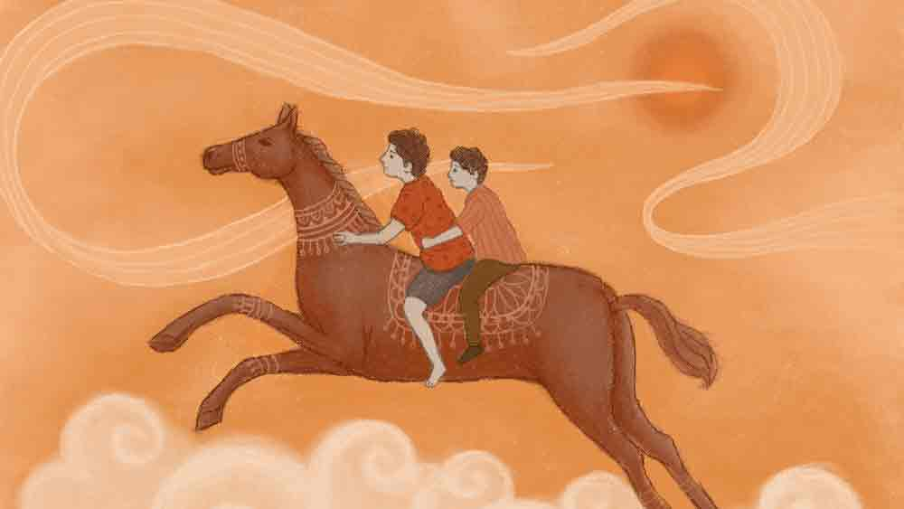

 

<h1 align=center> ঝড়</h1>
<h2 align=center>সংহিতা ঘোষাল মুখোপাধ্যায়</h2>
ত   খন বিকেল। সারা দিনের রাজ্যপাট শেষ করে ঝাউবনের ফাঁকে অস্ত যাচ্ছে প্যাস্টেলে আঁকা সূর্য। দুপুর অবধি হুটোপুটির পর সমুদ্র এখন শান্ত। কেমন যেন অন্যমনস্ক। ছোট ছোট ঢেউ উঠছে, ভাঙছে, মিলিয়ে যাচ্ছে আপনমনেই।   ছোট্ট শ্রুত বসে আছে বোল্ডারের ওপর। আকাশি নীল জিনসের প্যান্ট-পরা পা দুটো ছড়িয়ে দিয়েছে সামনের দিকে। জুতোটা খুলে রেখেছে এক পাশে। একমনে দেখে যাচ্ছে বালির ওপর ঢেউয়ের কারুকাজ। এমনিতে তার মুখে কথার ফুলঝুরি সারা দিন। কিন্তু এখন সে একদম চুপ। ঢেউয়ের মতোই এলোমেলো প্রশ্ন আসছে তার মাথায়, আবার মিলিয়ে যাচ্ছে। পাশেই মা বসে আছেন। কিন্তু যে মা-কে শ্রুত জ্যান্ত ডিকশনারি মনে করে, তাকেও যেন এই মুহূর্তে কথাগুলো বলতে ইচ্ছে করছে না। এই বিশাল সমুদ্র, যার কোনও শেষ নেই, শ্রুতর খাতায় আঁকা নৌকো-ভাসা নদীর থেকেও আরও কত্ত বড়! এই সমুদ্রের ও পারে আছে এক বিশাল মহাদেশ। এই বিশাল জলরাশি নিশ্চয়ই এই মুহূর্তে আছড়ে পড়ছে সেই মহাদেশেরই কোনও সমুদ্রসৈকতে। শ্রুত যেমন ভারতবর্ষের পশ্চিমবঙ্গের এক সমুদ্রসৈকতে বসে স্কুলের ম্যাপবইয়ে দেখা সেই চ্যাপ্টা মহাদেশটার কথা ভাবছে, তেমনি সেই মহাদেশেও হয়তো ঠিক এই সময় তারই মতো কোনও ছোট্ট ছেলে এমনই এক সমুদ্রসৈকতে বসে ভাবছে ম্যাপবইয়ে দেখা ভারত নামে একটা দেশের কথা। ভাবতেই গায়ে কাঁটা দিল শ্রুতর।   তার মনে হল, ‘আচ্ছা অস্ট্রেলিয়ায় এখন ক’টা বাজে? আফ্রিকাতেই বা কেমন সময় এখন?’ মুখ ফিরিয়ে মা-কে প্রশ্নটা করতে যাবে, হঠাৎ দেখে বোল্ডারের ও পাশের বাঁধানো রাস্তায় একটা বাদামি ঘোড়ার লাগাম হাতে ধরে হেঁটে যাচ্ছে তার চেয়ে বয়সে কিছুটা বড় একটা ছেলে। মাথা থেকে সব উদ্ভট কল্পনা সরে গিয়ে তার এই মুহূর্তে খুব ইচ্ছে হল এক বার ঘোড়ার পিঠে চড়ার।   “মা, মা! দেখো, ঘোড়া... আমি চড়ব মা...”   মাও তত ক্ষণে তাকিয়েছেন ঘোড়া আর তার মালিকের দিকে।   “কী গো শুনছ, বাবু ঘোড়ায় চড়তে চাইছে...”   দেবব্রত একটু দূরে অফিসের একটা ফোনে ব্যস্ত ছিলেন। হাত নেড়ে ওদের থামতে বললেন। তার পর আবার মন দিলেন কথায়। এ দিকে ঘোড়ার লাগাম হাতে সেই ছেলেটি দাঁড়িয়ে পড়েছে কাস্টমারের আশায়।   “চাপাও না আন্টি, মাত্র তিরিশ টাকা। তিন বার ঘুরিয়ে দেব। ও বাবু, চাপাও না ভাইকে...”   বিরক্ত হয়ে দেবব্রত সেলফোন পকেটে ঢুকিয়ে এগিয়ে গেলেন ছেলেটার দিকে। পিছনে দুরুদুরু বুকে আট বছরের শ্রুত। ‘বীরপুরুষ’ কবিতাটা পড়ার পর থেকেই তার ঘোড়ায় চাপার বড্ড ইচ্ছে। সে ইচ্ছে বুঝি এ বার পূরণ হতে চলল।   দেবব্রত বললেন, “তিরিশ টাকা? বলিস কী রে? পঁচিশ দেব। নিয়ে যা।”   “কী যে বলেন বাবু, দশ টাকায় এক বার। তিরিশের কমে পোষাবে না বাবু।”   ভ্যানিটি ব্যাগ আর ক্যামেরা সামলে নড়বড়ে বোল্ডারে পা ফেলে তত ক্ষণে এসে দাঁড়িয়েছেন সুমিত্রা, শ্রুতর মা।   “আচ্ছা যাক না বাবা, ছাড়ো তো, ছেলেমানুষ বায়না করেছে…”   “ভাল করে ঘুরিয়ে দেব আন্টি। তুমি ছবি তুলবে তো?”   “তুলব, তুলব। এখন চল তাড়াতাড়ি।”   “আয় ভাই, এই তো এখানে পা রাখ, কিচ্ছু ভয় নেই।”   শ্রুত তখন মনে মনে ভাবছে, ‘আমি যাচ্ছি রাঙা ঘোড়ায় চেপে, টগবগিয়ে… ও হো! ঘোড়াটার রং সত্যিই কী সুন্দর লাল! একদম কবিতায় বলা ঘোড়ার মতো!’   “ভয় পাচ্ছিস না তো ভাই?”   “না না, দারুণ লাগছে!”   “তোরা কবে এসেছিস?”   “এই তো আজ দুপুরে।”   “তার মানে কাল থাকছিস তো?”   “হ্যাঁ, কাল বাবার অফিস ছুটি।”   “আমি রোজ বিকেলে রাজুকে নিয়ে এখানে থাকি।”   “রাজু কে গো?”   “এই যে, তুই যার পিঠে বসে আছিস? আমার বাঘের বাচ্চা।”   “হি হি! ঘোড়াকে বাঘের বাচ্চা বলছ কেন?”   “রাজু যেমন তেমন ঘোড়া নয় রে, ওকে আর একটু বেশি করে ছোলা খাওয়াতে পারলে দেখবি কেমন দৌড়োয়!”   “থামলে কেন, আর একটু নিয়ে চলো না...”   “তিন বার হয়ে গেল তো!”   “না, আর এক বার প্লিজ়!”   “আচ্ছা চল…”   ছেলেটা তিন বারের জায়গায় চার বার ঘুরিয়ে দিল শ্রুতকে। আজ এটাই ওর বউনি। প্রথম খেপটায় কাস্টমারকে খুশি করতে পারলে দিনটা ভাল যায়। আরও অন্তত খানতিনেক কাস্টমার জুটে যাবে এমনই একটা তুক আছে তার।   “কাল আসবি তো?”   “বাবা কি আবার কাল 
চড়তে দেবে!”   “আচ্ছা, ঘুরতে তো আসবি এখানেই, দেখা হবে, চার বার হয়ে গেছে, নাম এ বার।”   *****   পরদিন বিকেল। সেই একই ভঙ্গিতে বোল্ডারের ওপর বসে আছে শ্রুত। আজ কিন্তু তার মাথায় কোনও দেশ-দেশান্তরের চিন্তা নেই। আজ বার বার তার চোখ চলে যাচ্ছে রাস্তার দিকে। ঘোড়া হাতে দু’-এক জন ঘুরে গেছে এর মধ্যেই। কিন্তু শ্রুত তো অপেক্ষা করে আছে ‘বাঘের বাচ্চা’র জন্য। পাশে বসে সুমিত্রা লক্ষ করছেন শ্রুতর ছটফটানি। দু’এক বার দেবব্রতর সঙ্গে চোখের ইশারায় কথাও হয়ে গেছে সুমিত্রার। সেটা শ্রুত বুঝতে পারেনি।   সুমিত্রা হঠাৎ জিজ্ঞেস করলেন, “কী রে বাবু, আজ আর এক বার চড়বি না কি ঘোড়ায়? কাল তো এই সময় কলকাতায়…”   শ্রুত আমতা আমতা করে বলল, “না, আসলে এক্ষুনি ইচ্ছে করছে না মা, একটু পরে…”   সুমিত্রার ঠোঁটে এক চিলতে হাসির রেখা ফুটে উঠেই মিলিয়ে গেল। শ্রুত একটু অপ্রস্তুত হয়ে এক বার মা, আর এক বার বাবার মুখের দিকে তাকিয়ে হেসে 
ফেলল একটুখানি। পরমুহূর্তেই সুমিত্রা গম্ভীর হয়ে সমুদ্র দেখায় মন দিলেন, যেন প্রত্যেকটা ঢেউ গুনে গুনে এক জটিল অঙ্ক এক্ষুনি কষে ফেলতে হবে তাঁকে।   সূর্যের আলো তখন অনেকটা কমে এসেছে। আকাশের রং ধূসর। সমুদ্র থেকে উঠে আসা হাওয়ায় কেমন যেন পাগলাটে ভাব। আজ সমুদ্রে ঢেউ কালকের চেয়ে বেশি আর বড় বড়। এলোমেলো হাওয়ার সঙ্গে লুটোপুটি খেয়ে আছড়ে পড়ছে বালির ওপর। বোঝাই যাচ্ছে বৃষ্টি আসবে। ক্রমশ বদলাচ্ছে সমুদ্রের রূপ। লোকজন একটু একটু করে উঠে যাচ্ছে সমুদ্রের পাশ থেকে। শ্রুতর মুখটা শুকিয়ে গেছে। করুণ চোখে তাকিয়ে আছে রাস্তার দিকে। সুমিত্রা-দেবব্রতর চোখেও কেমন যেন চিন্তার ছাপ। দেবব্রত দু’বার উঠে পায়চারি করে এসে সুমিত্রার দিকে তাকিয়ে বললেন, “বৃষ্টি আসবে যে!” 
ঠিক তখনই...   “ভাই, এই ভাই! চড়বি না কি এক বার?” চমকে তাকাল শ্রুত। যার জন্যে সারা বিকেলের অপেক্ষা, সে এসে গেছে। ঝলমলে মুখে সে দিকে তাকিয়েই শ্রুত থমকে গেল একটু। তাকাল মা-বাবার দিকে।   “বেশি দূর যাস না, বৃষ্টি আসছে,” দেবব্রত বললেন গম্ভীর মুখে।   বাবার পারমিশন হয়ে গেছে। ছুট্টে চলে গেল শ্রুত।   ঘোড়ার পিঠে শ্রুত আর তার নতুন বন্ধু। দেবব্রত ক্যামেরা হাতে ছুটছেন পাশে পাশে।   “তুমি এত দেরি করে এলে কেন?” শ্রুত জিজ্ঞেস করল।   “দিদির জন্যে ওষুধ আনতে গেছিলুম বাজারে, তার পর বিচে আসতেই একটা কাস্টমার পেয়ে গেলুম। তাকে নামিয়ে তোকেই খুঁজছিলুম রে!”   ক্লিক ক্লিক। পটাপট ছবি 
তুলছেন দেবব্রত।   “এই ছেলে, তোর দিদির কী হয়েছে?” দেবব্রত জিজ্ঞেস করলেন হাঁপাতে হাঁপাতে।   “পেটে ব্যথা হয় যখন-তখন।”   “সে কী রে? ডাক্তার দেখিয়েছিস?”   “হ্যাঁ বাবু, দেখিয়েছি। ওষুধ খেলে ক’দিন ভাল থাকে, বন্ধ করলেই আবার যে কে সেই। তুমি বিশ্বাস করবে না বাবু, কাটা পাঁঠার মতো ছটফট করছে আজ সকাল থেকে।”   “ভাল করে ডাক্তার দেখা, ফেলে রাখিস না।”   “পাশের ঘরের কাকু বলছিল কলকাতায় নিয়ে গিয়ে হাসপাতালের ডাক্তার দেখালে ভাল হয়ে যাবে। কিন্তু মা ভয় পায়। কোনও দিন 
যায়নি তো।”   “তুই এখানেই থাকিস?”   “ওই তো, ওই যে মোবাইলের টাওয়ারটা দেখছ, ওর ও পাশেই আমাদের ঘর।”   “তোর বাবা কী করেন?”   “বাবা থাকে না বাবু, গেল শীতকাল থেকে পাত্তা নেই।”   “সে কী, কোথায় গেল?”   “কে জানে! যেখানে গেছে যাক...”   “তুই স্কুলে যাস?”   “আগে যেতুম, এখন আর ভাল্লাগে না।”   “এই এই থাম থাম, আর গিয়ে কাজ নেই। বৃষ্টি এল বলে।”   আজকে সহজেই রাজুর পিঠ থেকে নামল শ্রুত। আদুরে গলায় বলল, “আমি রাজুকে আদর 
করব বাবা।”   “বেশ তো, কর না।”   ছবি উঠল আরও কয়েকটা। মা, বাবা, শ্রুত আর শ্রুতর নতুন বন্ধু। সঙ্গে অবশ্যই রাজু।   “আন্টি ঘোড়া কিনবে? ভাই ভালবাসে...” হঠাৎ বলে বসল রাজু।   “কী যে বলিস, ঘোড়া নিয়ে কী করব?”   “কেন? ভাই চেপে ইস্কুল যাবে!”   হেসে ফেলল সুমিত্রা।   যতই এই বয়সে রোজগার করতে নেমে পড়ুক, আসলে তো ও এক ছেলেমানুষ! মনে মনে ভাবলেন সুমিত্রা। এক আশ্চর্য স্নেহের অনুভূতি তিনি টের পেলেন শিরায় শিরায়। বুকের মধ্যে তিরতির করে কাঁপতে লাগল মাতৃত্বের ভীরু পাখিটা। সুমিত্রা কোমল স্বরে বললেন, “আচ্ছা সে নয় যাবে, কিন্তু রাখব কোথায়?”   “তোমাদের বাড়ির সামনে মাঠ নেই? মাঠে বেঁধে রাখবে।”   “দূর পাগল। আমাদের বাড়ির সামনে কোনও মাঠ নেই। টিভি দেখিস না তুই? কলকাতার ছবি দেখিসনি কখনও?”   “ও কলকাতা… এ কী! পঞ্চাশ টাকা দিলে কেন?”   “এমনি, মিষ্টি কিনে খাস।”   “এঃ হে! বৃষ্টি এসে গেল! আন্টি দৌড়ে যাও।”   “যাই রে, তুই ভাল থাকিস বাবা।”   “টাটা দাদা, টাটা রাজু!” শ্রুত হাত নাড়ল মা বাবার হাত ধরে দৌড়তে দৌড়তে।   “টাটা ভাই, আবার আসিস।”   সুমিত্রা ওড়না দিয়ে জড়িয়ে দিলেন শ্রুতর মাথাটা। যত তাড়াতাড়ি সম্ভব হোটেলে ফিরতে হবে। কলকাতায় ফিরেই শ্রুতর মিড টার্ম অ্যাসেসমেন্ট। এ সময় শরীর খারাপ করলে চলবে না। আবারও বুকের ভিতর ডানা ঝাপটে উঠল মাতৃত্বের সেই অবুঝ পাখিটা।   সুমিত্রা জানতেই পারলেন না, তাদের চলে যাওয়ার পথের দিকে একদৃষ্টে তাকিয়ে আছে বারো বছরের এক কিশোর। সুমিত্রারা বাঁ দিকে ঘুরে যাওয়ার পর রাজুর লাগামের দড়িটা হাতে জড়িয়ে নিয়ে বৃষ্টি গায়ে মেখে হেলতে দুলতে উল্টো পথে হাঁটতে শুরু করল সে।   এক বছর পর।   কলকাতার ফ্ল্যাটে চলছে অনলাইন ক্লাস। বড় বড় ফোঁটায় বৃষ্টি এসে টোকা দিয়ে যাচ্ছে জানলার শার্সিতে। দু’মাস ধরে পৃথিবী জুড়ে এক অতিমারির দাপটে গৃহবন্দি সবাই। সরকারি নির্দেশে দোকানপাট বন্ধ, রাস্তায় লোকজন নেই বললেই চলে। তা ছাড়া কী যেন একটা ঝড় আসবে আজ, তাড়াতাড়ি সব কাজ সেরে চাপা উত্তেজনায় তারই জন্য অপেক্ষা করছে গোটা শহর। টেলিভিশনে নিউজ় চ্যানেলে এক ভদ্রমহিলা ক্রমাগত শাসিয়ে চলেছেন আসন্ন ভয়াবহতার আগাম জুজু দেখিয়ে। অনলাইন ক্লাসে ম্যাডাম পড়াচ্ছেন, “উই শুড ভ্যালু দ্য ডিগনিটি অব লেবার...”   খালি গায়ে ধূসর রঙের হাফপ্যান্ট পরে সমুদ্রের জলে পা ডুবিয়ে বসে আছে একটি বারো-তেরো বছরের ছেলে। তার ম্লান চোখে ধূসর আকাশের ছায়া। একটু দূরে রাস্তার ওপর দাঁড়িয়ে ধুলো শুঁকছে একটা হাড়-জিরজিরে বাদামি রঙের ঘোড়া। ধূ-ধূ সমুদ্রসৈকত। হোটেলগুলো দাঁড়িয়ে আছে সেই ঘুমন্ত পুরীর রাজপ্রাসাদের মতো, একা একা। নিঃশব্দে। ছোট্ট চায়ের দোকানটা বন্ধ কত দিন। কোনও টুরিস্টই আসে না আর আজকাল। তার বদলে বহু দিন পর ঝিনুক এসেছে বালির বিছানায়। কিসের যেন আক্রোশে গর্জে উঠছে বিপুল জলরাশি। গুমরে ওঠা মেঘের কালো ছায়া গড়িয়ে নামছে সমুদ্রের দিগন্তজোড়া বুকে। ঝড় আসছে।      