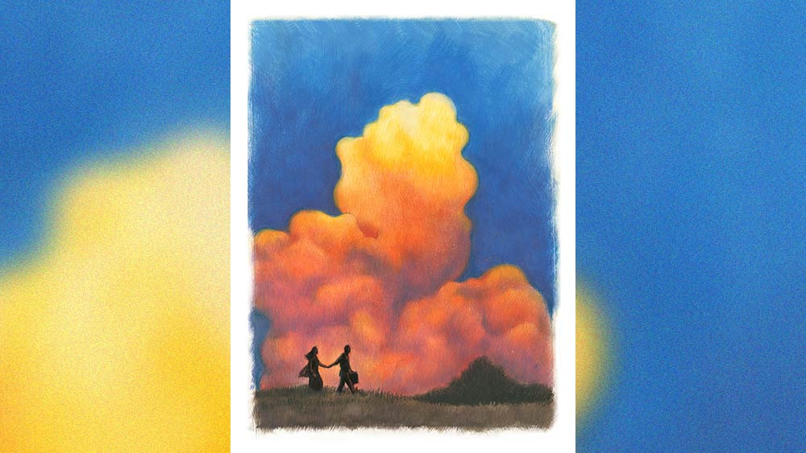

 
 <h1 align=center>ঝড়ওয়ালা</h1>
<h2 align=center>অধীর সিংহ</h2> তরু বিয়ের পর একটি নেশা ধরেছিল। গান শোনা। একা হলেই সে সিডি প্লেয়ারে গান শোনে। আজও তাই গান বাজছিল, ‘ভাল আছি, ভাল থেকো, আকাশের ঠিকানায় চিঠি লিখো…’ হঠাৎ গান থেমে গেল। লোডশেডিং। কয়েক দিন ধরেই সে জেনে গেছে সাইক্লোন আসছে। অজয় তাকে বুঝিয়েছে এই সাইক্লোন কেমন করে তৈরি হয়। এ বার সে এসে পড়ল বোধ হয়। জানলা বন্ধ করতে গিয়ে মেঘে ঢাকা আকাশে তীব্র আলোর ঝলকানি চোখে লাগল। তরু দু’কানে চাপা দিয়ে গুনতে লাগল, একে চন্দ্র-দুয়ে পক্ষ। দ্রিমি দ্রিমি গর্জন শোনা গেল পাঁচ গোনার পর। তার মানে মেঘ দূরে আছে। বেশ ভয়-ভয় করছিল। 

অজয় লাঞ্চ করে জিপ নিয়ে সোজা আলিপুর চলে গেছে। বলে গেছে আসতে রাত হবে। কিংবা হয়তো কাল সকাল। গত কয়েক দিন ধরে নাওয়া-খাওয়া ভুলে এই নতুন সাইক্লোনের পিছনে পড়ে আছে। নাম ‘লায়লা’। অজয়ের মতে এই সাইক্লোন আন্দামান সাগর হয়ে পশ্চিম বাংলায় ঢুকে, তাজপুরের কাছে ল্যান্ডফল করাবে। শুধু ডিউটি নয়, তার নিজের নেশা স্টর্ম মনিটরিং। প্রতি ঘণ্টায় একে রিয়েল টাইমে ট্র্যাক করতে সে বেরিয়ে গেছে।

বছর পাঁচেক আগে অজয় নিয়মিত ফ্রেজারগঞ্জে সমুদ্রের ধারে স্যাটেলাইট অ্যান্টেনা লাগিয়ে ঝড় ট্র্যাকিং করতে আসত। আজানুলম্বিত বেণি, শ্যামলিকা এক কিশোরী তার পাশে দর্শক হয়ে দেখত, আর জিজ্ঞাসা করত, “হ্যাঁ গো, আমি না-হয় নারকোল কুড়োতে আসি। এই সাগর পাড়ে, সায়েবের পোড়ো বাসায়, তুমি কী ছাইপাঁশ করো গো?”

অজয় কৌতুক করে উত্তর দিয়েছিল, “আমি ঝড় ধরি।”

“ও তাই বুঝি, সাগর থেকে যে কালবোশেখি আসে, তাকে তুমি ধরে রাখো ওই বাক্সে?” অবাক বিস্ময়ে সে বলে, “তুমি তা হলে ঝড়ওয়ালা?”

“ঠিক বলেছ। ঝড়ধরাও বলতে পারো। ছেলেধরার মতো। তুমি কে এ বার তাই বলো দিকি!”

“আমি তরুবালা। তুমি এই বাগানের যে কোনও জায়গা থেকে তরু বলে ডাক দিলে আমায় পেয়ে যাবে। আরে, বৃষ্টি এসে গেল!”

কথায় কথায় কখন বৃষ্টি নেমেছে তারা খেয়াল করেনি। তাড়াতাড়ি যন্ত্রপাতি গুটিয়ে জিপে ফিরে আসতে আসতে অজয় বেশ ভিজে গিয়েছিল। তার পিছন পিছন সেই কিশোরীও আসতে থাকে, “আরে, আমাকে ফেলেই চলে যাচ্ছ? দেখ, কত নারকোল আমার কাছে।”

অজয় পিছন ফিরে তাকিয়ে দেখল। তরুবালার কোঁচড়-ভর্তি নারকোল। শাড়ি ভিজে একশা। অজয় কিছু বলার আগেই সে নিয়ে জিপের পেছনের দরজা খুলে ভেতরে ঢুকে সিটে আশ্রয় নেয়। 

“ইস দেখো দেখি কাণ্ড! আমরা দু’জনেই একশা ভিজে গেছি।”

কিশোরী অবলীলায় তাকে আদেশ করে, “তুমি বাপু কিছু ক্ষণ চোখ মুদে রাখো। আমি গায়ের জল মুছব।” কিছু ক্ষণ পরে আবার হুকুম এল, “এ বার চোখ না খুলে নিজের মুন্ডু সিটে হেলিয়ে দাও দিকি। তোমার গা, মাথা মুছে দিচ্ছি। এ রকম ভিজে গায়ে বাড়ি গেলে তোমার মা বকবে।”

অজয়ের চোখ বন্ধ থাকলেও তরুবালার শাড়ির আঁচল আর তার কোমল ছোঁয়া তাকে এক নতুন জগতের মুখে ঠেলে দিল।

বৃষ্টি ধরে যেতে কিশোরী নেমে গিয়েছিল, যাওয়ার সময় তার হাতে দুটো নারকোল দিয়ে বলেছিল, “এই নাও ঝড়ওয়ালা, মাকে দিয়ো, নাড়ু করে দেবে। আমার মা নেই, থাকলে তোমায় নাড়ু খাওয়াতাম। তুমি আবার যখন আসবে, আমার জন্য গোটা কয়েক আনলেই চলবে।”

অজয় মায়ের কাছ থেকে শুধু নাড়ু বানিয়ে নয়, তাঁর মত নিয়ে তিন মাস পর সেই কিশোরীকে বিয়ে করে নিয়ে এসেছিল।

ফ্রেজারগঞ্জের কথা মনে পড়লে তরুর মন খারাপ করে। দেওয়ালঘড়িতে সময় বলছে রাত দশটা। তরুর নিজের জন্য কিছু খাবার তৈরি করতে মন হল না। অনলাইনে খাবারের অর্ডার করল। বৃষ্টি বেশ পড়ছে। এলোমেলো হাওয়া। তরু অনেক হাতড়ে এক চিলতে মোমবাতি পেয়ে ডাইনিং টেবিলে লাগিয়ে দিল। টর্চের চার্জও বেশি নেই। যাকগে! খাবার এলেই খেয়ে শুয়ে পড়বে। বেল বাজবে না, তাই তরু দরজা সামান্য খুলে চেন লক করে রাখল। জলের ঝাপটা আসছে। বেচারা ডেলিভারি বয়দের জন্য মায়া হয়। সুকান্ত থাকলে নিশ্চয়ই তাদের নিয়ে নতুন ‘রানার’ কবিতা লিখত, ‘পিঠেতে খাবারের বোঝা— তবু সে খাবার যাবে না ছোঁয়া।’

একটু পরেই দরজার নক এবং টর্চের আলোয় কমলা ব্যাগ চোখে পড়ল। তরু দরজার চেন খুলে দিল। বর্ষাতি-পরা এক মূর্তি দাঁড়িয়ে। বাইরের জলের ঝাপটা ভিতরে আসতে লাগল। তরু মূর্তিকে ভিতরে আসতে বলল।

“ম্যাডাম, ঘরে জল পড়বে। আপনি প্যাকেট নিয়ে নিন।”

“কিছু হবে না, আপনি ভেতরে আসুন। বাইরে যা বৃষ্টি হচ্ছে,” তরু দরজা ছেড়ে সরে দাঁড়াল।

“কোথায় রাখব প্যাকেট?”

গলার আওয়াজটা কি চেনা? বৃষ্টির আওয়াজে ভাল শোনা যাচ্ছে না, তবু...

তরু ডাইনিং টেবিল দেখিয়ে দিল। আগন্তুক টেবিলে জ্বলন্ত মোমবাতির কাছে প্যাকেট নামিয়ে রাখল।

“আপনার নাম জানতে পারি কি?” কণ্ঠস্বর চেনা লাগায় প্রশ্নটা করল তরু।

আগন্তুক ফিরে তাকাল। মোমবাতির ক্ষীণ আলোতেও চিনতে ভুল হল না, “এ কী! জয়ন্তদা না? তুমি ডেলিভারি…?” তরুর কথা মুখে আটকে গেল। 

“তুমি কি তরু? হ্যাঁ, আমি জয়ন্ত। গত বছর থেকে খাবার ডেলিভারি করছি। লকডাউনে এ কাজ ছাড়া গতি নেই। যাক, অনেক দিন পর তোর সঙ্গে দেখা হল। আমি যাই, আরও অর্ডার পিকআপ করতে হবে।”

“দাঁড়াও জয়ন্তদা। আজ আমি তোমায় পালিয়ে যেতে দেব না।”

দমকা হাওয়া এসে মোমবাতি নিভিয়ে দিল। তরু দরজা বন্ধ করল। তত ক্ষণে জয়ন্ত লাইটার জ্বালিয়ে মোমবাতি ধরিয়েছে।

“আমি জানতাম না তোরা এখানে থাকিস। তোর সায়েন্টিস্ট বর কোথায়?”

“যন্ত্রপাতি নিয়ে কালবোশেখি ধরতে সে দুপুরবেলায় বেরিয়ে গেছে। কখন বাড়ি ফিরবে সে কথা সে নিজেও জানে না।”

“তরু, এই ঝড় এ বার যদি সাগরের দিকে যায়, ফ্রেজারগঞ্জ আস্ত থাকবে না। বিশেষ করে সাহেবের গড় আর নারকোল বাগান।”

“ও সব আর ভাবি না, তুমি বর্ষাতি খুলে জল ঝরিয়ে নাও। তার পর এসো, দু’জনে খেয়ে নিই।”

“না না তরু, তা হয় না। এখুনি হয়তো অর্ডার চলে আসবে ডেলিভারির জন্য। পরে, অন্য দিন। আজ আমি যাই।”

তরু দরজায় পিঠ দিয়ে দাঁড়াল।

“না জয়ন্তদা, তুমি আর আসবে না— আমি জানি। যে ক্ষোভ আমার বুকে চাপা পড়ে আছে, তার জবাবদিহি করে যাও। অবস্থার দোহাই দিয়ে বার বার আমাকে ফিরিয়ে দিয়েছ। হঠাৎ গ্রাম থেকে বেপাত্তা হয়ে গেলে। বাধ্য হয়ে আমাকে বিয়ে করতে হল, না হলে মা-কে কী কারণ দেখাতাম! এখানে এসেই খামের পিছনে আমার ঠিকানা লিখে চিঠি পাঠিয়েছি, তারও উত্তর দিলে না কেন?”

“চিঠি? আমি তোর কোনও চিঠি পাইনি, আর পাওয়ার প্রশ্নই নেই। কারণ তোর বিয়ের আগেই মা কোভিডে আক্রান্ত হয়ে সদর হাসপাতালে ভর্তি হয়। মা আর ফেরেননি, আমিও বাড়ি ফিরিনি। কাজের সন্ধানে কলকাতায় চলে আসি। বাড়ি তো সেই থেকে তালাবন্ধই পড়ে আছে।”

“তুমি আমার চিঠি পাওনি, বিশ্বাস করতে পারছি না। আসলে তুমি কাপুরুষ।”

“দেখ পাগল মেয়ে, আমি যখন জানলাম এক জন নামকরা বিজ্ঞানীর সঙ্গে তোর গাঁটছড়া বাঁধার কথা হচ্ছে, তখন সেখানে এই ম্যাট্রিক-পাশ ছেলে কী করে নাক গলায়?”

“জয়ন্তদা, তোমার ভালবাসা বুঝি লেখাপড়া মেনে চলে?”

জয়ন্ত কিছু ক্ষণ চুপ করে থাকল, তার পর বলল, “এত দিন পর তোর সঙ্গে দেখা হল। খালি ঝগড়া করবি? আমি বরং চলি এখন।”

তরু এগিয়ে এসে জয়ন্তদার হাত ধরে জিজ্ঞাসা করল, “আমি কি খুবই খারাপ মেয়ে?”

জয়ন্ত হাত সরাতে চাইলেও পারল না। তরু বুকের কাপড় সরিয়ে দিল।

“তরু ছাড়, কী করছিস? পাগলামি করিস না।” 

“আমার স্বামী দেশ-বিদেশের ঝড় খুঁজে বেড়ায়। পৃথিবীর যেখানেই তুফান আসুক না কেন, তিনি তাকে অনুসরণ করতে শুরু করেন। উনি বিখ্যাত মানুষ। দেশ-বিদেশ থেকে তাঁকে জিজ্ঞেস করা হয়, কালবোশেখি ঠিক কোথায় বইবে। কিন্তু তরুর বুকের এই ঘূর্ণি তাঁর নজরে আসে না। এই দপদপানি, আর কত দিন চাপা দেব তুমি বলতে পারো?”

বাঁধভাঙা আশ্লেষে প্লাবিত নারীর প্রশ্নের কোনও জবাব জয়ন্তর কাছে ছিল না। সে বুঝল সামনের উন্মুখ ঘূর্ণিতে ডুবে যাওয়াই তার ভবিতব্য। সে পায়ে পায়ে এগোল তরুর দিকে।

তখনই শোনা গেল, দরজায় কেউ নক করছে। তরু দ্রুত বেশবাস ঠিক করতে লাগল। জয়ন্ত ব্যাগ কাঁধে নিয়ে বেরোনোর জন্য প্রস্তুত হল। তরু দরজা খুলতেই, ঝোড়ো কাকের মতো অজয় ভেতরে ঢুকে এল।

“পাওয়ার ব্যাঙ্ক কোথায় রেখেছি বলো তো? খুব দরকার, এক্ষুনি।”

“তুমি আগে ভিজে জামাকাপড় ছেড়ে নাও। আমি খুঁজে দিচ্ছি।”

অজয়ের চোখ পড়ল জয়ন্তর দিকে, জিজ্ঞেস করল, “উনি?”

তরু চমকে উঠে উত্তর দেয়, “উনি... খাবার ডেলিভারি দিতে এসেছিলেন। বৃষ্টিতে এখানে আটকে পড়েছিলেন। এক্ষুনি চলে যাবেন।”

“আচ্ছা, আচ্ছা... বসুন ভাই...”  বলে অজয় নিজের স্টাডিতে ঢুকে গেল। ভিজে জামাকাপড় ছেড়ে টার্কিশ তোয়ালেতে নিজেকে শুকনো করে  ল্যাপটপ অন করল। নিজের তৈরি স্টর্ম ট্র্যাকিং মডেলে ল্যাটিচিউড-লঙ্গিচিউড দিয়ে দেখা গেল ঝড় গতিপথ বদলের ইঙ্গিত দিচ্ছে। আলিপুরের স্যাটেলাইট ডেটা অ্যানালিসিস করেও একই ইঙ্গিত।

অজয়ের অনুমান নির্ভুল প্রমাণ করে বৃষ্টি ধরে আসছিল। হাওয়ায় ঝড়ের রেশ নেই। যাক! কলকাতা বেঁচে গেল। অজয়ের মনে পড়ল, আজ কিছু খাওয়া হয়নি।

“তরু, কিছু খাবারের অর্ডার করে দাও প্লিজ়। দুপুরের পর থেকে আর কিছু খাওয়া হয়নি।”

তরুর আওয়াজ এল, “চাউমিন আনিয়েছি। আর কী অর্ডার দেব?”

“এক্সেলেন্ট! চিলি চিকেন আর সুইট কর্ন সুপ বলে দাও।”

মিনিট কুড়ি পরে দরজায় নক করার আওয়াজ পাওয়া গেল। কিছু ক্ষণ পরে আরও এক বার। অজয় বেরিয়ে এসে দেখল তরু ঘরে নেই। অগত্যা অজয় দরজা খুলে দিল। ছেলেটি খাবারের প্যাকেট হাতে দিল।

কী মনে হতে অজয় ছেলেটিকে জিজ্ঞেস করল, “আচ্ছা, একটু আগেও কি আপনিই এসেছিলেন?”

“আমি না স্যর। আমার শিফ্ট তো এই শুরু হল। আমার আগের শিফ্টে জয়ন্তদা ছিলেন।”

নামটা শুনে কি সেকেন্ডের জন্য থমকাল অজয়? অন্ধকারে বোঝা গেল না। সে বলল, “ও আচ্ছা, দিন প্যাকেট দিন।”

বাথরুমে ক্ষীণ আলোর রেখা, জল পড়ার আওয়াজ আসছে। অজয় প্যাকেট টেবিলে রেখে তরুর উদ্দেশে বলল, “খাবার এসে গেছে।”

ল্যাপটপের চার্জ কমে আসছে। পাওয়ার ব্যাঙ্কটা কোথায় যে গেল? অন্ধকারে পাওয়ার ব্যাঙ্ক খুঁজতে গিয়ে অনেক কিছু ওলটপালট হয়ে গেল। কিছু কাগজপত্র ছিটিয়ে গেল। অজয় আবার তরুকে ডাকল।

“তোমার হল? টর্চটা লাগবে যে!” একটু পরে তরু এল।

অন্ধকার ঘর, টর্চ অন করে মেঝেতে ছড়িয়ে থাকা কাগজপত্র তরু কুড়িয়ে নিল। একটা মুখখোলা খাম! তার নিজের হাতের লেখা ঠিকানা। রি-ডাইরেক্টেড লেটার। অ্যাড্রেসি নট ফাউন্ড। ফ্রেজারগঞ্জ  পো: অফিসের স্ট্যাম্প। তরুর মনে ঝড়, খাম মুঠোয় ধরে টর্চ অজয়ের দিকে এগিয়ে দিল। সব জানত অজয়? সে তো চিঠিতে লিখেছিল জয়ন্তদাকে, তার মনের কথা, তার ভালবাসার কথা। তা হলে!

অজয় ল্যাপটপে নজর রেখে টর্চ নিতে গিয়ে তা ফস্কে কার্পেটে পড়ল। তুলতে গিয়ে অজয়ের গায়ে বেশ কয়েক ফোঁটা জল পড়ল। সবিস্ময়ে মুখ তুলে দেখল, সিক্ত ভীত কম্পমান তরুবালা। সদ্য স্নানের ধারা তার গা বেয়ে নীচে গড়িয়ে পড়ছে। তার চোখ মুখ ফ্যাকাসে।

“তরু, তোমার কী হয়েছে?” অজয় টর্চ সোফায় ছুড়ে তাকে বুকে টেনে নিল।

“কিছু না! অনেক ময়লা জমে ছিল, ধুয়ে এলাম।” 

অজয় তরুর আর্দ্র দেহে টাওয়েল জড়িয়ে দিল।

“তুমি আমাকে ফেলে আর কোথাও যেয়ো না। একা থাকতে আমার ভীষণ ভয় করে। নিজের মনটাকেও যে সব সময় বুঝতে পারি না। মাথায় যেন ভূত চাপে!”  

“ভয়ের কিছু নেই তরু। ঝড় গতিপথ বদল করেছে। এ দিকে আসছে না।”

“না না, তুমি জানো না, কালবোশেখি যখন তখন আসতে পারে। তুমি সব দরজা-জানলা বন্ধ করে দাও, শিগগির।”

অজয় হো হো করে হেসে উঠল, “কালবৈশাখী আসবে, আর আমি জানব না? তুমি ফ্রেজারগঞ্জে সমুদ্রের ধারে ঝড়ের সময় কেমন নারকোল কুড়োতে দৌড়ে দৌড়ে, মনে পড়ে! আমাকে যন্ত্রপাতি নিয়ে বসে থাকতে দেখে তুমি কাছে এসে বলেছিলে, ‘তুমি কে গো?’ আমি বলেছিলাম, আমি ঝড়ওয়ালা। আমায় ফাঁকি দেবে, ঝড়ের সাধ্য কী!”

তরু বলে, “আমার মনে আছে, তুমি তোমার কম্পিউটার দেখিয়ে বলেছিলে, এই দেখো, ঝড় এখানে বন্দি। ও যেখানে যাবে আমি আগে থেকেই বুঝে যাব।” 

কথার মধ্যে আলো জ্বলে উঠল। সিডি প্লেয়ারে বেজে উঠল, ‘…আমার ভিতর বাহিরে, অন্তরে অন্তরে আছ তুমি হৃদয় জুড়ে…’

অজয় তরুর হাত ধরে বলে, “চলো খেয়ে নিই। খুব খিদে পেয়েছে।”